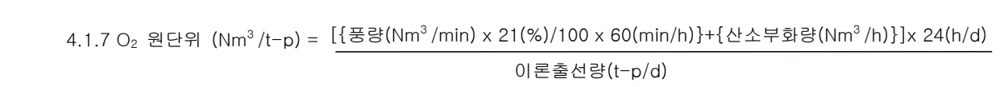
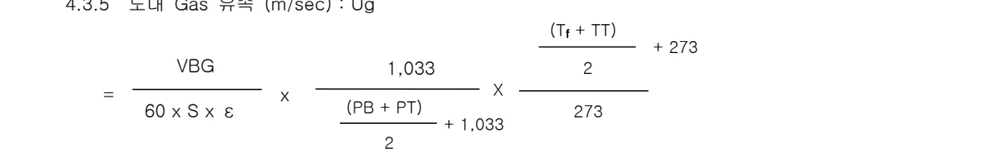
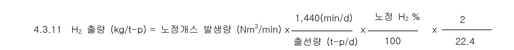
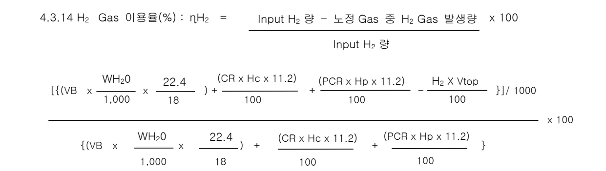

<h2>Page 1</h2>
<h1>1. 적용 범위</h1>

고로 공정에서 사용되는 각종 공식에 대해 규정한다.

<h1>2. 목적</h1>

조업 공정식에 대해 정확하게 이해하여 조업 실적의 공정한 비교분석과 정보 교류가 가능하고, 외국의 선진기술 도입이나 자체 조업기술력을 향상시키는 기초 정보로 활용할 수 있다.

<h1>3. 중점 관리항목</h1>

<table><thead><tr><th>품질영향 인자</th><th>공정영향 인자</th></tr></thead><tbody><tr><td>해당없음</td><td>해당없음</td></tr></tbody></table>
<a href="components/TP-030-010-030 조업공정식 해설(Rev.9)_0900bf4ba7a2c11a_usr0000bf4b95f9e446_p001_table_01.png">Table snapshot</a>

<h1>4. 조업 기준</h1>

<h2>4.1 생산 지수</h2>

주) A : 실적출선량

B : 강풍감산량

C : 휴풍감산량 (정기+임시+돌발)

D : 정기휴풍 감산량

<math display="block">4.1.1 \text{ 조업율 (\%)} = \frac{(A + B + C) - D}{A + B + C} \times 100</math>

<math display="block">4.1.2 \text{ 작업율 (\%)} = \frac{A}{(A + B + C) - D} \times 100</math>

※ 강풍감산량 기준

: 감산량 20% 이상 &amp; 강풍량 20% 이상시

<math display="block">4.1.3 \text{ 가동율 (\%)} = \frac{\text{조업율} \times \text{작업율}}{100} = \frac{A}{A + B + C} \times 100</math>

<h3>4.1.4 이론출선량(t-p/d)</h3>

<math display="block">= \Sigma\{\text{Fe Source 장입량 (t/d)} \times \text{Fe 함량(\%)}\} \times \text{보정계수}(1.00\sim 1.10)</math>

<math display="block">4.1.5 \text{ 송풍원단위 (Nm}^3\text{/t-p)} = \frac{\{\text{풍량(Nm}^3\text{/min)} \times 1,440(\text{min/d})\} + \{\text{산소량(Nm}^3\text{/h)} \times 24(\text{h/d}) / 21(\%) / 100\}\}{\text{이론출선량(t-p/d)}}</math>

<math display="block">4.1.6 \text{ 출선비 (t/d/m}^3\text{)} = \frac{\text{이론출선량 (t-p/d)}}{\text{고로내용적 (m}^3\text{)}}</math>

<math display="block">4.1.7 \text{ O}_2 \text{ 원단위 (Nm}^3\text{/t-p)} = \frac{\{\text{풍량(Nm}^3\text{/min)} \times 21(\%) / 100 \times 60(\text{min/h})\} + \{\text{산소부화량(Nm}^3\text{/h)}\} \times 24(\text{h/d})}{\text{이론출선량(t-p/d)}}</math>

<h2>Page 2</h2>
<h4>4.2 원료, 연료</h4>

<math display="block">4.2.1 \text{ 광석비 (t/t-p)} = \frac{\text{주원료 사용량 (t/d)}}{\text{이론 출선량 (t-p/d)}} \quad (\text{또는, Ore Ratio, O.R 이라고도 함})</math>

<math display="block">4.2.2 \text{ 슬래그비 (kg/t-p)} = \frac{\text{슬래그 발생량 (kg/ch)}}{\text{이론 출선량 (t-p/ch)}} \quad (\text{또는, Slag Volume, S.V 라고도 함})</math>

<math display="block">4.2.3 \text{ 슬래그 염기도} = \frac{\text{슬래그중 CaO 함량 (\%)}}{\text{슬래그중 SiO}_2 \text{ 함량 (\%)}} \quad (\text{또는, CaO/SiO}_2, \text{ C/S 라고도 함})</math>

<math display="block">4.2.4 \text{ 소결광비 (\%)} = \frac{\text{소결광 사용량 (t/ch)}}{\text{주원료 사용량 (t/ch)}} \times 100</math>

<math display="block">4.2.5 \text{ 슬래그 생성량 (kg)} = \frac{\text{장입물중 (SiO}_2 + \text{CaO} + \text{Al}_2\text{O}_3 + \text{MgO)}}{0.975}</math>

주) 0.975의 의미 : 슬래그중 SiO2, CaO, Al2O3, MgO 가 약 97.5%를 차지하고 나머지 2.5%는 소량의 산화물 및 Zn, S 이므로 0.975 를 나누어 주는 것이다.

<math display="block">4.2.6 \text{ 광석/코크스} = \frac{\text{주원료 사용량 (t/ch)}}{\text{코크스 사용량 (t/ch)}} \quad (\text{또는, Ore/Coke, O/C 라고도 함})</math>

<math display="block">4.2.7 \text{ 코크스비 (kg/t-p)} = \frac{\text{코크스 사용량 (kg/d)}}{\text{이론 출선량 (t-p/d)}} \quad (\text{또는, Coke Ratio, C.R 이라고도 함})</math>

<math display="block">4.2.8 \text{ 보정코크스비 (kg/t-p)} = \frac{100 - \text{분석수분 (\%)}}{100 - \text{보정수분 (\%)}} \times \text{코크스비 (kg/t-p)}</math>

<math display="block">4.2.9 \text{ 미분탄비 (kg/t-p)} = \frac{\text{미분탄 사용량 (kg/d)}}{\text{이론 출선량 (t-p/d)}} \quad (\text{또는, Puverized Coal-injection Ratio, PC.R 이라고도 함})</math>

<math display="block">4.2.10 \text{ 환원제비 (kg/t-p)} = \text{코크스비 (kg/t-p)} + \text{미분탄비 (kg/t-p)} \quad (\text{또는, 연료비, Fuel Ratio, RAR: Reduction Agent Ratio, RR: Reductant Ratio 이라고도 함})</math>

<h2>Page 3</h2>
<h2>4.3 개스류 및 노내반응</h2>

<h3>4.3.1 노내 압손지수 (<math>\Delta P/V</math>)</h3>

<math display="block">= \frac{PB - PT}{VB + O_2/60}</math>
주) PB : 풍 압 (<math>\text{g/cm}^2</math>) PT : 노정압 (<math>\text{g/cm}^2</math>) VB : 풍 량 (<math>\text{Nm}^3/\text{min}</math>) <math>O_2</math> : 산 소 (<math>\text{Nm}^3/\text{h}</math>)

<math display="block">4.3.2 \text{ 통기저항지수 (K)} = \frac{(PB + 1,033)^2 - (PT + 1,033)^2}{VBG^{1.7}}</math>
주) VBG : Volume of Bosh Gas (<math>\text{Nm}^3/\text{min}</math>) 대기압 : <math>1\text{atm} = 1,033 \text{ (g/cm}^2\text{)}</math>

* Carman 의 총진층 압력손실식 <math>\Delta P = K.G^{2-\beta}</math> 으로 부터 유도 (고로의 경우 <math>\beta=0.3</math> 적용)

<table><thead><tr><th>단구분</th><th>1 고로</th><th>2,3,4 고로</th></tr></thead><tbody><tr><td>UK</td><td>TP - SP6</td><td>TP - SP10</td></tr><tr><td>MK</td><td>SP6 - SP3</td><td>SP10 - SP6</td></tr><tr><td>LK</td><td>SP3 - BP</td><td>SP6 - BP</td></tr></tbody></table>
<a href="components/TP-030-010-030 조업공정식 해설(Rev.9)_0900bf4ba7a2c11a_usr0000bf4b95f9e446_p003_table_01.png">Table snapshot</a>

<math display="block">4.3.3 \text{ Bosh Gas 량 (Nm}^3/\text{min)}: VBG = VB\left\{1.21 + 2VO_2 + \frac{22.4}{1000} \left( \frac{WH_2O}{9} + \frac{KPC \times PCB}{100} \right) \right\}</math>

주) <math>WH_2O</math> : 습분 (<math>\text{g/Nm}^3</math>)

<math display="block">VO_2 : \frac{\text{O}_2 \text{ 량 (Nm}^3/\text{h)}}{\text{VB (Nm}^3/\text{min)} \times 60 (\text{min}/\text{h})}</math>

<math display="block">PCB : \frac{\text{미분탄 취입량 (t/h)} \times 10^6 (\text{g/t})}{\text{VB (Nm}^3/\text{min)} \times 60 (\text{min}/\text{h})} = \frac{16,666 \times \text{미분탄 취입량 (g/min)}}{\text{VB (Nm}^3/\text{min})}</math>

<math display="block">KPC : \frac{\%\text{ H}_2\text{O}}{9} + \frac{\%\text{ H}_2}{2} + \frac{\%\text{ N}_2}{28} + \frac{\%\text{ O}_2}{16}</math>

<math display="block">VBG = VB \times 1.21 + VB \times 2VO_2 + VB \times \frac{22.4 (\text{l}/\text{mol})}{1000 (\text{l}/\text{Nm}^3)} \times \frac{WH_2O}{18(\text{g}/\text{mol})} \times 2 + \frac{22.4}{1000} \times \frac{KPC \times PCB}{100}</math><table><tbody><tr><td style="border: 1px solid black; padding: 5px;"><math>\text{O}_2 + 2\text{C} \rightarrow 2\text{CO}</math> 1mol 산소는 탄소와 반응, 2mol 의 CO 발생</td><td style="border: 1px solid black; padding: 5px;"><math>\text{C} + \text{H}_2\text{O} \rightarrow \text{CO} + \text{H}_2</math> 1mol 수증기는 탄소와 반응, CO, <math>\text{H}_2</math> 각 1mol 씩 발생</td></tr></tbody></table>

<h2>Page 4</h2>
4.3.4 풍구전 유속(m/sec) : Vot (Velocity of Ordinary Tuyere)

<math display="block">= \frac{VB (1 + 0.001244 WH_{2}O) + \frac{O_{2}}{60}}{60 \times ST} \times \frac{TB + 273}{273} \times \frac{1,033}{PB + 1,033}</math>

주) ST : 풍구 총단면적 (<math>m^2</math>)

TB : 풍온 (<math>^{\circ}C</math>)

WH2O : 습분 (<math>g/Nm^3</math>)

0.001244 (<math>Nm^3/g</math>) : H2O 1g을 <math>Nm^3(0^{\circ}C, 1</math>기압)로 환산한 값

4.3.5 노내 Gas 유속 (m/sec) : Ug

<math display="block">= \frac{VBG}{60 \times S \times \varepsilon} \times \frac{1,033}{\frac{(PB + PT)}{2} + 1,033} \times \frac{\frac{(T_f + TT)}{2} + 273}{273}</math>

주) S : 노내 평균 단면적 (<math>m^2</math>) = (풍구선단~S.L 간 체적) / (풍구선단~S.L 간 높이)

<math>\varepsilon</math>: 공극률 (<math>\approx 0.55</math>)

TT : 노정온도 (<math>^{\circ}C</math>)

대기압 : 1atm = 1,033 (<math>g/cm^2</math>)

절대온도 : K = 273 + 섭씨온도

<math display="block">4.3.6 \text{ 노구개스유속 (m/sec)} = \frac{\text{노정개스발생량}}{60 \times \text{노구단면적}} \times \frac{273 + TT}{273} \times \frac{1,033}{PT + 1,033}</math>

주) TT : 노정온도 (<math>^{\circ}C</math>)

PT : 노정압력 (<math>g/cm^2</math>)

<math display="block">4.3.7 \text{ 노정개스발생량 (Nm}^3/\text{min)} = \frac{\text{풍량} \times 79\%}{\text{노정 개스중 N}_2 \%} \quad \left( \text{or} \quad \frac{22.4}{12} \times \frac{\text{개스화하는 C (kg/t)}}{\text{노정개스중 (CO + CO}_2\text{) \%}} \right)</math>

<h2>Page 5</h2>
<math display="block">4.3.8 \text{ 송풍 에너지 (kg-m/s)} = \frac{(VB \times 1.288 + O_2/60 \times 1.431) \times Vot^2}{Tu \times 60 \times 2 \times 9.8}</math>

주) Vot : 풍구전 유속 (m/s)

Tu : 풍구수 (EA)

1.288 (g/l) : 0°C, 1 기압에서 공기의 밀도

1.431 (g/l) : 0°C, 1 기압에서 산소의 밀도

<math display="block">4.3.9 \text{ 대기습분 (g/Nm}^3\text{)} = 4.953 + (0.3311 \times T + 0.011 \times T^2 + 0.00038 \times T^3) \times M/100</math>

주) T : 대기온도 (°C)

M : 대기습도 (%)

4.3.10 <math>H_2</math> 일량 (kg/t-p)

<math display="block">= (VB \times 1,440 \times \text{습분} \times \frac{2}{18 \times 1,000 \times \text{출선량}}) + \frac{(C.R \times \text{COKE 고정수분} \times 2)}{18 \times 100} + \frac{(PC.R \times PC \text{ 중 H\%})}{100}</math>

주) VB : 풍량 (<math>Nm^3</math>/min)

C.R : 코크스비 (kg/t-p)

<math display="block">4.3.11 \text{ } H_2 \text{ 출량 (kg/t-p)} = \text{노정가스 발생량 (Nm}^3\text{/min)} \times \frac{1,440(\text{min/d})}{\text{출선량 (t-p/d)}} \times \frac{\text{노정 H}_2 \%}{100} \times \frac{2}{22.4}</math>

4.3.12 풍구선 이론연소 온도 (°C) : <math>Tf = 1,559 + 0.839TB - 6.033 WH_2O - 3.0PCB + \underline{4973VO_2}</math>

<math display="block">\text{주) PCB : } \frac{\text{PCI RATE (t/h)} \times 1,000,000(\text{g/t})}{\text{풍량 (Nm}^3\text{/min)} \times 60(\text{min/Hr})} = \frac{16,666 \times \text{PCI (g/h)}}{\text{풍량 (Nm}^3\text{/Hr)}}</math>

<math display="block">VO_2 : \frac{O_2 \text{ 량}}{\text{풍량} \times 60}</math>

뒷 장 계속

<h2>Page 6</h2>

○ 의미 : 연소대 내로 유입되는 열과 유출되는 열수지를 통해 얻어지는 연소대에서의 가스 온도 Tf 식은 회귀 분석에 의해 도출됨

○ 조습(<math>\text{WH}_2\text{O}</math>) : <math>\text{C} + \text{H}_2\text{O} \rightarrow \text{CO} + \text{H}_2 - 31.2 \text{ kcal/g}\cdot\text{mol}</math> (흡열)

산소 부화(<math>\text{O}_2</math>) : <math>\text{C} + \text{O}_2 \rightarrow \text{CO}_2 + 94.3 \text{ Kcal/g}\cdot\text{mol}</math>

<math display="block">\text{CO}_2 + \text{C} \rightarrow 2\text{CO} - 41.4 \text{ Kcal/g}\cdot\text{mol}</math>

<math display="block">2\text{C} + \text{O}_2 \rightarrow 2\text{CO} + 52.2 \text{ Kcal/g}\cdot\text{mol}</math> (발열)

미분탄 취입(PC) : ① 연소대에 취입되는 미분탄의 현열(상온상태의 Solid)

② 미분탄의 <math>\text{VM}(\text{CH}_4, \text{H}_2)</math> 방출시, Cracking Heat Loss 발생(<math>\text{CH}_4 \rightarrow \text{CH}_3^+ / \text{CH}_2^{2+}</math>) : 흡열

<h4>4.3.13 열류비 (HC)</h4>

<math display="block">= \frac{\text{Ws}}{\text{Wg}} = \frac{\text{Cs} \times \text{Gs}}{\text{Cg} \times \text{Gg}}</math>

<math display="block">= \frac{0.31 \times \text{C.R} + 0.22 \times \text{O.R}}{\left\{ (\text{C}_{p,\text{H}_2} \times \text{H}_2 + \text{C}_{p,\text{CO}} \times \text{CO} + \text{C}_{p,\text{CO}_2} \times \text{CO}_2 + \text{C}_{p,\text{N}_2} \times \text{N}_2) / 100 \right\} \times \frac{0.79 \times \text{VB}}{\text{N}_2\% / 100} / \text{선철생산속도}}</math>

주)

<math display="block">\text{C}_{p,\text{H}_2} = \left[ 56.505 - (702.74 \times ((\text{TT} + 273) / 100)^{(-0.75)}) + (1165 \times ((\text{TT} + 273) / 100)^{(-1)}) - (560.7 \times ((\text{TT} + 273) / 100)^{(-1.5)}) \right] / 4.2 / 22.4</math>

<math display="block">\text{C}_{p,\text{CO}} = \left[ 69.145 - (0.70463 \times ((\text{TT} + 273) / 100)^{(0.75)}) - (200.77 \times ((\text{TT} + 273) / 100)^{(-0.5)}) + (176.76 \times ((\text{TT} + 273) / 100)^{(-0.75)}) \right] / 4.2 / 22.4</math>

<math display="block">\text{C}_{p,\text{CO}_2} = \left[ -3.7357 + (30.529 \times ((\text{TT} + 273) / 100)^{(0.5)}) - (4.1034 \times ((\text{TT} + 273) / 100)) + (0.0242 \times ((\text{TT} + 273) / 100)^{(2)}) \right] / 4.2 / 22.4</math>

<h2>Page 7</h2>
<math display="block">C_{p,N2} = [39.06 - (512.79 \times ((TT + 273) / 100)^{-1.5}) + (1072.7 \times ((TT + 273) / 100)^{-2}) - (820.4 \times ((TT + 273) / 100)^{-3})] / 4.2 / 22.4</math>

TT (°C) : 노정 온도

Ws(Kcal) : 고체열용량, Wg(Kcal) : 기체열용량

C(Kcal/kg°C) : 비열, G(g) : 질량, <math>C_p</math> (kcal/°C Nm<math>^3</math>) : 열용량

선회생산속도 (t/min)

C.R : 코크스비 (kg/t-p)

O.R : 광석비 (부원료 포함) (kg/t-p)

H2, CO2, CO, N2 : 노정 Gas 종 각 함유율 (%)

<math display="block">\begin{aligned} 4.3.14 \text{ H}_2 \text{ Gas 이용율(%) : } \eta_{H_2} &amp;= \frac{\text{Input H}_2 \text{ 량} - \text{노정 Gas 중 H}_2 \text{ Gas 발생량} \times 100}{\text{Input H}_2 \text{ 량}} \\ &amp;= \frac{\left[ \left\{ \left( \text{VB} \times \frac{\text{WH}_2\text{O}}{1,000} \times \frac{22.4}{18} \right) + \frac{(\text{CR} \times \text{Hc} \times 11.2)}{100} + \frac{(\text{PCR} \times \text{Hp} \times 11.2)}{100} - \frac{\text{H}_2 \times \text{Vtop}}{100} \right\} / 1000 \right]}{\left[ \left\{ \text{VB} \times \frac{\text{WH}_2\text{O}}{1,000} \times \frac{22.4}{18} \right\} + \frac{(\text{CR} \times \text{Hc} \times 11.2)}{100} + \frac{(\text{PCR} \times \text{Hp} \times 11.2)}{100} \right]} \times 100 \end{aligned}</math>

주) Hc : 코크스중 H2 (≈0.5%)

Hp : 미분탄중 H2 (%)

H2 : 노정개스중 H2 (%)

VB : 송풍원단위 (Nm3/t-p)

Vtop : 노정 Gas 발생 원단위 (Nm3/t-p)

<math display="block">4.3.15 \text{ CO Gas 이용율(%) : } \eta_{\text{CO}} = \frac{\text{CO}_2}{\text{CO} + \text{CO}_2} \times 100</math>

뒷 장 계속

<h2>Page 8</h2>
<math display="block">4.3.16 \text{ 산소부화율 (\%)} = \left( \frac{\text{풍량} \times 60 \times 0.21 + \text{O}_2 \text{량}}{\text{풍량} \times 60 + \text{O}_2 \text{량}} - 0.21 \right) \times 100</math>

<math display="block">4.3.17 \text{ 하부 용해능력 } (\text{^\circ C} \cdot \text{Nm}^3/\text{t-p}) \\ = \text{Tf} \times \frac{\text{VBG} \times 1,440(\text{min}/\text{d})}{\text{출선량 } (\text{t-p}/\text{d})} \quad (\text{또는, Tf} \times \text{VBG} / \text{선철생성속도}(\text{t}/\text{min}))</math>

<math display="block">4.3.18 \text{ 장입물 강하속도 (Travelling Time)} = \frac{V}{\mu} \times \frac{24}{n}</math>

주) V : 유효 내용적 (<math>\text{m}^3</math>) <math>\mu</math>: 1Ch 당 용적 (<math>\text{m}^3/\text{ch}</math>) <math>n</math>: 일일 Ch 수 (<math>\text{ch}/\text{d}</math>)

4.3.19 Carbon Solution Loss [%] : 고로내로 장입된 Carbon 중 철광석과 직접 환원으로 소비되는 Carbon 의 비를 나타냄.

※ 직접환원에 소비되는 C 의 질량 [<math>\text{kg}/\text{t-p}</math>]

<math display="block">= \text{C\_Gas} - \text{C\_Tuy} - \text{C\_SMP} \\ = (\text{가스화된 C}) - (\text{풍구 전 연소되는 C}) - (\text{S, Mn, P 와 직접환원에 소모되는 C})</math>

<math display="block">\bullet \text{C\_Gas} = \text{C\_IN} - \text{C\_HM} - \text{C\_Dust}</math>

<math display="block">\text{C\_IN} = (\text{C.R} \times \text{nC\_Coke} / 100) + (\text{PCR} \times \text{nC\_PCR} / 100) + \{(\text{석회석 장입량} / \text{이론 출선량}) \times (12/100)\}</math>

<math display="block">\text{C\_HM} = 1.3 + (2.57 \times \text{HMT} / 1000) - (0.31 \times \text{nSi\_HM} / 100) + (0.03 \times \text{nMn\_HM} / 100) - \{(0.33 \times \text{nP\_HM} / 100) - (0.40 \times \text{nS\_HM} / 100) \times 10\}</math>

<math display="block">\text{C\_Dust} = \{(\text{Dust 량} \times 24(\text{Hr}/\text{D}) / \text{이론 출선량} \times 1.18) \times \text{nC\_Dust} / 100\} + 3.3</math>

<math display="block">\bullet \text{C\_Tuy} = \left[ \left\{ \left( \text{VB} \times 0.21 \right) + \text{O}_2 / 60 \right\} \times 12 / 22.4 \times 2 \right] + \left( \text{VB} \times \text{WH}_2\text{O} / 1000 \times 12 / 18 \right) \times 60 \times 24 / \text{이론 출선량}</math>

<math display="block">\bullet \text{C\_SMP} = \{(\text{nSi\_HM} / 100 \times 2 \times 12 / 28) + (\text{nP\_HM} / 100 \times 5 / 2 \times 12 / 30) + (\text{nMn\_HM} / 100 \times 12 / 55)\} \times 1000</math>

<h2>Page 9</h2>

∴ CSL [%] = {C_Gas - (C_Tuy + C_SMP)} / C_Gas x 100

주) C_Gas : 개스화한 Carbon [kg/t-p] C_Tuy : 풍구 앞에서 소비된 Carbon [kg/t-p] C_Smp : [Si], [Mn], [P] 환원에 소요된 Carbon [kg/t-p] C_IN : 고로 내로 장입되는 Carbon [kg/t-p]. C_HM : 용선중으로 빠져나가는 Carbon [kg/t-p]. C_Dust : Dust 중으로 빠져나가는 Carbon [kg/t-p]. C.R : Coke Ratio [kg/t-p] PCR : PC Ratio [kg/t-p] nC_Coke, nC_PCR : Coke, PCI 중 고정 Carbon [%] nC_Dust : Dust 중 고정 C 석회석 장입량 [kg], 이론 출선량 [t-p/d], Dust 량 [t/h] VB : 송풍량 [Nm3/min] WH2O : 조습 [g/Nm3] O2 : 산소 취입량 [Nm3/h] HMT : 용선 온도 [°C] nSI_HM, nMn_HM, nP_HM, nS_HM : 용선중 Si, Mn. S, P 농도 [%]

<h2>5. 이상판단 및 조치 기준</h2>

해당사항 없음

‘끝.’

이 하 여 백
