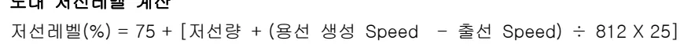
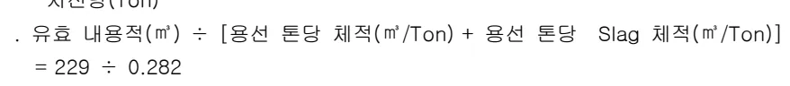

<h2>Page 1</h2>
<h2>1. 적용범위</h2>

고로에서 생선된 용용물의 원활한 배출을 위하여 노저 저선량 평가방법 및 적정 출선량 산정, 출선 작업 기준에 적용한다

<h2>2. 목적</h2>

정확한 저선 Level 및 용용물 저선량을 계산하여 용용물 배출을 원활히하고 용용물 배출 속도 및 배출불량을 예측하여 노황의 불안정을 사전에 조치하기 위함

<h2>3. 중점 관리 항목</h2>

<table><thead><tr><th>품질 영향 인자</th><th>공정 영향 인자</th></tr></thead><tbody><tr><td>[Si], [S]</td><td>풍압, 노열</td></tr></tbody></table>
<a href="components/TP-030-030-040 저선Level 제어 및 출선작업 기준(Rev.12 )_0900bf4ba7a443ae_usr0000bf4b95f9e446_p001_table_01.png">Table snapshot</a>

<h2>4. 조업 기준</h2>

<h3>4.1 조업관리 기준</h3>

<h4>4.1.1 용적계산</h4>

가. 노 하부에서 풍구까지 용적

내용적 = <math>\pi(\text{반경})^2</math> X (노내 출선구에서 풍구까지 거리)

<ul><li>침식용적을 고려할 것</li></ul>

나. 노 하부에서 풍구까지 유효 내용적

유효 내용적 = 내용적 X 1/4

<ul><li>노 하부에서 풍구내에 노심 Coke 의 면적을 총면적의 3/4 로 전제</li></ul>

다. 용선 Ton 당 체적

용선 톤당 체적 = <math>1 \text{ T-P} \div 7.0 = 0.143 \text{ m}^3</math> (용선비중: 7.0)

라. Slag 체적

Slag 톤당 체적: <math>1 \text{ Ton-Slag} \div 2.3 = 0.435 \text{ m}^3</math>

<ul><li>slag 비중: 2.3</li></ul>

용선 톤당 Slag 체적 = <math>0.435 \times 0.32 = 0.139 \text{ m}^3</math>

<ul><li>Slag Volume : 320kg/T-P</li></ul>

<h2>Page 2</h2>
<h4>4.1.2 용선 및 Slag 생성 속도</h4>

가. 용선 생성 속도(T-P/분)

장입 계산에 의한 Charge 당 용선 생산량(T-P/Charge) X Charge 수/분

나. 용선 배출 속도

출선 Speed 의 합(전 출선구)

<h4>4.1.3 노내 저선레벨 계산</h4>

<math display="block">\text{저선레벨(\%)} = 75 + [\text{저선량} + (\text{용선 생성 Speed} - \text{출선 Speed}) \div 812 \times 25]</math>

●75: 노심체적 비율(%)

●25: 유효체적 비율(%)

●812: 전체 내용적이 <math>916 m^3</math>으로 가정시에 유효 내용적에 담을수 있는 용선과 Slag 의 저선량(Ton)

<math display="block">\begin{aligned}\text{유효 내용적}(m^3) \div [\text{용선 톤당 체적}(m^3/\text{Ton}) + \text{용선 톤당 Slag 체적}(m^3/\text{Ton})] \\ = 229 \div 0.282\end{aligned}</math>

<h3>5. 이상판단 및 조치기준 :</h3>

<h4>5.1.1 저선량 증가 판단</h4>

▷출선개시 60 분후 <u>(2 고로 20 분)</u> 출선 Speed 가 평균 출선 Speed 에 못미치는 경우

▷출선개시 40 분<u>(2 고로 60 분)</u> 후 까지 배재구에서 Slag 가 분리되지 않거나 출선 개시 후 Slag 가 단시간 배출후 Cut 되는 경우

▷전 Tap 에서 출선시간이 짧을 경우

▷출선중 출선구가 Coke 등에 의해 자주 막혀서 출선이 원활하지 못할 경우

▷노내 저선 Level 관리 화면에서 90 % 이상 지시할 경우

▷용융물 유동성 악화 (용선 온도가 <math>1460 ^\circ \text{C}</math> 이하 저하, C/S 가 1.30 이상)

뒷장 계속

<h2>Page 3</h2>
<h2>5.1.2 저선량 증가시 조치기준</h2>

<ul><li>○ Lap 출선 실시: Slag 분리가 정상적으로 될 때 까지 실시할 것</li><li>○ Bit 경 확대 출선: 저온의 용융물이 완전 배출 확인이 될 때 까지 실시한다 (Bit 경 확대: 기존의 Bit 경보다 2 ~ 8 mm 큰것)</li><li>○ 출선구 심도 확보: 노저에 저선된 용융물 완전 배출을 위한 심도를 확보 할 것</li></ul>

<ul><li>● 필요시 연속 출선도 검토하며 풍압이 상승하는 경우는 지속적인 Lap 출선 및 완전 공취도 검토하여 실시 할 것.</li></ul>

<h2>5.1.3 노황변동시 출선작업 기준</h2>

<ul><li>○ 용융물 생성량, 용선온도에 따른 출선구 운영패턴 차별화 적용 (3,4 고로 기준)</li></ul>

<table><thead><tr><th>출선비(t/d/m3)</th><th>용선온도(℃)</th><th>출선페턴</th><th>출선구 운영 개수</th><th>Lap / Delay Time</th><th>출선 Bit 경</th></tr></thead><tbody><tr><td>1.25 이상</td><td>-</td><td>Para 출선</td><td>3~4(주상별 대각선 출선)</td><td>Lap time 100~120분</td><td>52~56φ</td></tr><tr><td>1.1~1.25</td><td>1520 이상</td><td>"</td><td>"</td><td>"</td><td>"</td></tr><tr><td rowspan="2">0.9~1.1</td><td>1520 이상</td><td>Lap 출선</td><td>4 (시계/반시계 방향)</td><td>Lap time 5~10분</td><td rowspan="2">56φ (Slag 배출 불량 시 52φ 고려)</td></tr><tr><td>1520 이하</td><td>Delay time 적용</td><td>"</td><td>Delay time 60분</td></tr><tr><td>0.9 이하</td><td>-</td><td>"</td><td>"</td><td>Delay time 90분</td><td></td></tr></tbody></table>
<a href="components/TP-030-030-040 저선Level 제어 및 출선작업 기준(Rev.12 )_0900bf4ba7a443ae_usr0000bf4b95f9e446_p003_table_01.png">Table snapshot</a>

- 출선비 1.25 t/d/m3 이하 시 Para → Lap 출선 변경, 1.1 이하 시 Delay time 적용으로 용융물 배출 안정화

(단, 용선온도 1,520℃ 이상으로 Slag 최대 배출 조건 만족시 최대 배출 패턴 유지)

[Para 출선(출선구 3~4개)] [Lap 출선(출선구 4개)] [일반 출선 (Delay time)]

1주상: #1, #2, #3, #4. Lap time 100~120분.

2주상: Lap time 5~10분, Delay time 60~90분.

‘끝.’

이 하 여 백
