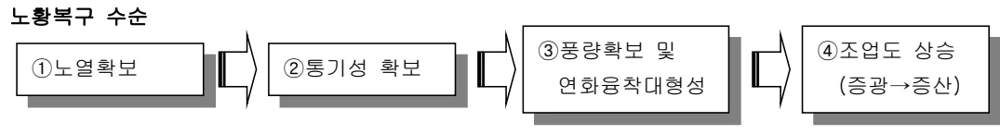

<h2>Page 1</h2>
<h2>1. 적용범위</h2>

고로조업에서 통기성 불량으로 인한 노황변동, 날바람(吹拔 : Channelling)과 장입물 오장입시의 조치 기준에 대하여 적용한다.

<h2>2. 목 적</h2>

노황변동시 복구를 위한 수순 및 기준에 대한 정확한 이해를 토대로 고로 노황을 안정된 상태로 지속 유지하기 위함이다.

<h2>3. 중점관리항목</h2>

<table><tbody><tr><td>품질영향 인자</td><td>공정영향 인자</td></tr><tr><td>[Si] [S]</td><td>풍압, 노열,</td></tr></tbody></table>
<a href="components/TP-030-030-050 노황변동시 조치기준(Rev.10)_0900bf4babda91af_usr0000bf4b95f9e446_p001_table_01.png">Table snapshot</a>

<h2>4. 조업기준</h2>

<h3>4.1 노황변동의 의미</h3>

고로내 GAS 통기성 불량으로 날바람, 미끄러짐(SLIP), 장입물 걸림(HANGING) 등이 발생하고, 이로 인해 노내에서 고체 장입물과 GAS 간의 열교환 및 환원반응 불충분으로 노열이 저하하고, 더욱 악 화되면 노저 냉입까지 연결되는 상황을 말한다.

<h3>4.2 노황복구 수순</h3>

Flowchart illustrating the steps for slag recovery:
<ol><li>① 노열확보</li><li>② 통기성 확보</li><li>③ 풍량확보 및 연화용착대형성</li><li>④ 조업도 상승 (중광→중산)</li></ol>

<h4>4.2.1 노열확보</h4>

가. 노황부조시는 대부분 노내통기성 악화 및 노열급저하에 의해 용융물배출이 어렵고, 유동성이 나쁜 저온의 SLAG 에 의해 노저부(노심 Coke)오염의 우려가 있으므로, 우선적으로 노내온도를 높여 용융물 배출을 도모해야 한다.

나. 노열확보의 방안으로 우선 BLANK COKE 장입 및 O/C 강광을 실시하여 노내의 높은 O/C 를 치환하여야 한다.

다. 강광한 O/C 가 풍구 레벨에 도달하기 위해서는 정상조업시보다 2~3 배의 Traveling Time (8시간 이상)이 소요되므로 당장의 노열회복에는 도움이 되지 못한다.

라. 따라서 ① 최대 풍온 사용 (열풍로 설비조건 고려), 최저 조습사용 (대기조습), PCR 중대 등으로 추가 노열을 부여하고,

<h2>Page 2</h2>

마. ②장입물강하 불량, 통기성이 극도로 불량한 경우에는 감풍하여 취발, SLIP 에 의한 노열의 추가 저하를 막아야 한다.

바. 취발등의 돌발사고 발생시에는 노심 Coke 의 헌열이 노정으로 소실되어, 이미 노열이 저하된 상태이므로 풍구선 이론연소온도(<math>T_f</math>)는 이론계산치 보다 실제로 낮기 때문에 풍온증가, 조습 삭감을 과다하게 하여 <math>T_f</math>를 높여도 문제가 되지 않는다.

사. 오히려 풍온, 조습의 ACTION 없이 PCI 만 증대시킬 경우 실제 <math>T_f</math>의 과다저하로 미연소 COAL 만 다량 발생되어 노심 Coke 오염 및 용융물의 유동성을 저하시키는 악영향을 초래한다.

아. 장기 돌발 휴풍인 경우는 노내에 체류하고 있는 O/C 가 아주 높으므로 재송풍후 곧바로 휴풍전보다 높은 수준의 풍온상승, 조습저하 및 PCI 상승 Action 을 취하여 감광분의 풍구 도달전에 노열과 저하에 의한 냉입사고 또는 추가 노황불량을 막아야 한다. 따라서 감광분 도달전까지는 최대한 입열량을 크게하여 노내 용융물의 배출을 쉽게 하여야 한다.

<h4>4.2.1 통기성 확보</h4>

가. 노내 통기성 확보는 크게 두가지로 나눌수 있는데 ①하나는 노내 과상대 ~ 적하대 사이의 통기성 개선으로 노내 O/C 저하 및 노내 분장입량 억제, 중심부 O/C 감소 (중심 Coke 증대 및 모드에 의한 광석 외진등)에 따라 가능하며

나. ② 노심부의 통기, 흡액성 개선을위해 용선 및 SLAG 온도의 상승과 SLAG 염기도 저하 등의 조치를 취한다.

다. 통기성이 양호하다는 것은 노심과 노상부의 장입물을 통과하는 GAS 흐름이 좋다는 것을 의미하는데 고로 상하부의 노내 통기성이 개선되지 않은 상태에서 무리하게 증풍할경우 노구에서의 COKE 유동화, 적하대 에서의 Coke Flooding 이 나타나며 장입물강하 불안정이 계속된다.

라. 통기성이 개선되지 않은 상태에서의 증풍은 유동성이 불량한 용융물의 생성만 증가시킬 뿐이다.

마. 그러나 노내 O/C 가 높은경우 급속히 낮은 O/C 로 치환을 위해 일정량으로 증풍하여 수회 Check(봉락)를 반복하는것도 의미가 있다. 장입물 강하가 정지하면 가능한한 빨리 감풍하여 Check 해야 큰 봉락을 막을수 있다.

바. 노내 통기성 개선 여부의 판단은
<ul><li>장입물 강하의 안정 (Drop, Slip 현상無),</li><li>풍압의 안정</li><li>노정온도 안정</li><li>소취발 발생유무</li></ul>
사. 통기성 확보후 증풍시는 노황 조건에 따라 가능한 서서히 증풍한다.

<h2>Page 3</h2>
<h4>4.2.3 풍량확보 및 연화용착대 형성</h4>

가. 풍량확보의 기본방향은

<ul><li>노열 및 통기성이 확보된 상태에서 증풍을 시도하여 증풍에 의한 충격방지와 노구부 COKE 유동화(Flooding) 방지를 위해 노정압을 선행 상향하는 방향으로 증풍을 병행해야 한다.</li></ul>

<ul><li>나. 증풍 속도는 노황 고려 서서히 하되 증풍후 풍압 상승, 장입물 강하불량, 노구유속 과다 상승 또는 Profile Meter 측정결과 중심부 Flooding 이 감지(중심부 Terrace 과다 생성 또는 중심부 들림) 되면 증풍을 중지해야 된다.</li><li>다. 증풍시는 노열조정을 위해 PCR을 재계산해야 되며 가능하면 Max 노정압, Max 풍량까지 도달시켜야 한다.</li><li>라. 풍량 확보시까지 증광을 하지 않는 이유는 증풍영향과 증광에 의한 노내 장입물 변동 영향을 동시에 받지 않기 위함이다.</li></ul>

<h4>4.2.4 조업도 상승(증광→증산)</h4>

가. 노황개선의 마지막 단계는 조업도 상승으로 노열확보, 통기성확보, 노정압 및 풍량확보가 완료된 후에 실시한다.

나. 성급한 노황복구를 위해서 각단계별 확인사항을 거치지 않고 증광을 실시하거나 혹은 통기성을 확인하지 않고 증풍을 실시하거나 복구과정중에 정상적인 조치수순에 의하지 않는 경우는 (그동안 수회의 경험을 통하여 확인됨) 결코 성공하지 못하고 휴유증을 크게 겪거나 혹은 계속적인 시행착오를 반복하면서 감풍, 감광으로 조업도상승이 지연되는 등 복구에 몇배의 시간이 소요된다.

다. 따라서 복구수순에 의한 소요기간을 지키는 것이 중요하며 서두름은 결코 성공적이지 못한다는 의식을 가지고 조업자는 복구표준에 대해 인내를 가지고 준수해야 한다.

<h4>4.3 생바람(吹拔 : CHANNELING) 발생전,후 노황관리</h4>

<h5>4.3.1 생바람 현상의 해석</h5>

가. 노내의 장입물 충진층에서 특정부위에 소립 또는 분(粉)의 과다분포로 그 부위의 통기성이 저하할 경우 충진층간에 GAS 분포 및 GAS 속도의 차이가 발생한다.

즉 GAS 속도가 빠른 부위는 장입물의 유동화(FLOODING)가 일어나고 미립자들이 상부로 상승하다가 상부의 장입물 입자들에서 정지상태로 되면 노내 GAS의 상승압력이 급격히 커지고, 장입물층을 파괴하면서 GAS가 급상승한다. 이 현상이 생바람(吹拔 : CHANNELING)현상이다.

<h2>Page 4</h2>

나. 장입물 미끄러짐(SLIP) 이나 내림(붕락)작업시 노내 GAS 가 장입물과의 환원이나 열교환을 하지 않고 노정으로 그대로 분출되는 현상으로써, 이 때 노내 총진충이 파괴되고 노하부에서는 열 BALANCE 가 무너져 노열이 급저하한다.

또한 적하대를 강하하는 용융 SLAG 가 급상승하는 GAS 에 뒤쳐 장입물 표면에 코팅되면 GAS 와 장입물간의 열교환을 차단하여 이러한 저온의 장입물이 노상(爐床)으로 적하 하면 노상온도를 급저하 시킬수도 있다.

다. 총진충 중 비중이 낮은부분(특히 노중심의 COKE 분포지대)으로 노내 GAS 가 급상승 하는 경우이다. 장입물의 분포가 반경방향으로 불균일 하거나 노구부의 GAS 유속이 과다하게 높을 때 일어난다.

<h3>4.3.2 날바람 현상이 고로 조업에 미치는 영향</h3>

가. 냉입

날바람 발생으로 인해 노내에서 GAS-장입물간 환원반응 및 열 교환 반응의 불충분으로 생광석의 노심강하시 심한 흡열반응으로 노열이 저하 하고 심할 경우 냉입사고를 유발한다.

나. 노정설비 손상

노정부의 각종 PACKING 부 손상, GAS 관의 굴절, 노정 및 청정설비 등의 외피에 물은 PAINT 나 기름류에 의한 화재발생 가능.

다. 청정설비 열충격 또는 장입물 역류로 인한 내부막힘 발생으로 DUST 배출 곤란

라. 노정 BLEEDER 및 청정설비 BLEEDER 의 PACKING 손상시 GAS LEAK 발생

<h3>4.3.3 날바람 발생전,후 조치기준</h3>

가. 날바람 발생전

○ 고로별 한계 <math>\Delta P</math> 이상시 노정압 현상태 유지하에 감풍 실시로 Gas Vol, 유속 저하한다.

나. 날바람 발생후 대응 기준

<table><thead><tr><th>구분</th><th>1 단계</th><th>2 단계</th><th>3 단계</th><th>4 단계</th><th>5 단계</th></tr></thead><tbody><tr><td>취발</td><td>노정온도 400~500</td><td>500~600<math>^{\circ}\text{C}</math></td><td>600~800<math>^{\circ}\text{C}</math></td><td>800~1,000<math>^{\circ}\text{C}</math></td><td>1,000<math>^{\circ}\text{C}</math> 이상</td></tr><tr><td>연속 Slip</td><td>30 분 이내 지속</td><td>30 분~1 시간 지속</td><td>1 시간 이상 지속</td><td></td><td></td></tr><tr><td rowspan="3">정상풍량比 감풍 기준 (Nm3/min)</td><td>감풍 5% (감산소 10%) *2BF <math>\Delta 200</math> *3,4BF <math>\Delta 400</math></td><td>감풍 10% (감산소 20%) *2BF <math>\Delta 400</math> *3,4BF <math>\Delta 700</math></td><td>감풍 15% (감산소 30%) *2BF <math>\Delta 600</math> *3,4BF <math>\Delta 1,100</math></td><td>감풍 20% (감산소 40%) *2BF <math>\Delta 800</math> *3,4BF <math>\Delta 1,400</math></td><td>감풍 30% (감산소 60%) *2BF <math>\Delta 1,500</math> *3,4BF <math>\Delta 2,100</math></td></tr><tr><td colspan="5">※ 전 단계 노정압 현팅 미발생시까지 추가 감풍 실시. 단, 감풍시 노정압 동시 하향 금지</td></tr><tr><td colspan="5">(안정 시 풍량에 맞는 적정 노정압 조정)</td></tr></tbody></table>
<a href="components/TP-030-030-050 노황변동시 조치기준(Rev.10)_0900bf4babda91af_usr0000bf4b95f9e446_p004_table_01.png">Table snapshot</a>

<h2>Page 5</h2>
<table><thead><tr><th>강광 및 Extra Coke 장입 기준</th><th>① Extra Coke 40 톤 장입 (2BF 20t, 3,4BF 40t) - 본 ch Coke x 2ch</th><th>① Extra Coke 60 톤 장입 (2BF 30t, 3,4BF 60t) - 본 ch Coke x 3ch</th><th>① Extra Coke 100 톤 장입 (2BF 50t, 3,4BF 100t) - 본 ch Coke x 5ch</th><th>① Extra Coke 160 톤 장입 (2BF 80t, 3,4BF 160t) - 본 ch Coke x 8ch</th><th>① Extra Coke 200 톤 장입 (2BF 100t, 3,4BF 200t) - 본 ch Coke x 10ch</th></tr></thead><tbody><tr><td></td><td>② 강광 O/C 4.5</td><td>② 강광 O/C 4.0</td><td>② 강광 O/C 3.5</td><td>② 강광 O/C 3.0</td><td>② 강광 O/C 2.3</td></tr><tr><td></td><td colspan="5">※ 취발 발생 이후 조업도 복귀(중광) 개시 기준 (전 단계 기준 충족시 단계적조업도 복귀)</td></tr><tr><td></td><td colspan="5">① 중광: 노열 1,400℃ 확인 후, 통기성 및 압력계 양호시 단계적 중광 개시 (취발분 15~20ch 이상 강하 확인)</td></tr><tr><td></td><td colspan="5">② 중광: 노열 1,450℃ 확인 후 단계적 중광</td></tr></tbody></table>
<a href="components/TP-030-030-050 노황변동시 조치기준(Rev.10)_0900bf4babda91af_usr0000bf4b95f9e446_p005_table_01.png">Table snapshot</a>

※ 날바람 단계별 비상 연락 체계

- 1,2 단계: 기준에 따른 선조치 후, 공장장 → 제선부장 → 선강부소장 계통보고

(※ 2 단계는 고로안정화 TF 에 상황 공유)

- 3,4 단계: 대응 기준에 따른 선조치 후, 1,2 단계 기준에 준하여 계통보고

+ 고로안정화 TF 동시 계통보고 (공장장 → 고로안정화 TF 리더&amp;부리더 → TF 팀장)

- 5 단계: 대응 기준에 따른 선조치 후, 3,4 단계 기준에 준하여 계통 보고

+ (공장) 비상 조업 복구를 위한 맛교대 근무 전환, (조업안전색션리더) 복구 지원인력 파악 후 즉시 요청

5. 이상판단 및 조치기준

5.1 오장입시 조치기준

5.1.1 오장입의 의미

노내로 장입되는 철광석 또는 COKE의 과다 또는 과소 장입이나, 석회석의 과다장입

(LIME SETTING) 으로 노내 열 BALANCE 를 파괴하고 노환변동을 유발하는 조업적인 실수를 의미한다.

5.1.2 오장입시 조치기준

<table><thead><tr><th>구분</th><th>조치기준</th></tr></thead><tbody><tr><td>철광석</td><td>○ 과다장입시 : 전량 보상 ○ 과소장입시 : 2/3 보상</td></tr><tr><td>COKE</td><td>○ 과다장입시 : 2/3 보상 ○ 과소장입시 : 전량 보상</td></tr></tbody></table>
<a href="components/TP-030-030-050 노황변동시 조치기준(Rev.10)_0900bf4babda91af_usr0000bf4b95f9e446_p005_table_02.png">Table snapshot</a>

-보상회수는 짝을수록 좋으나 보상량이 많을때는 수회에 걸쳐 나누어 보상한다.

‘끝.’

이 하 여 백
