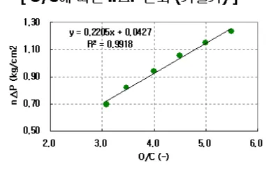

<h2>Page 1</h2>
<h3>1. 적용범위</h3>

고로 조업중에 발생하는 장입물 미끄러짐(SLIP), 장입물 걸림(棚, HANGING)현상등이 발생시의 조치 기준에 대하여 적용한다

<h3>2. 목적</h3>

장입물 강하이상시 신속한 조업 ACTION 으로 노황조정을 하지 않으면 노열저하, 노황변동 등이 발생 한다.

<h3>3. 중점관리 항목</h3>

<table><tr><td>품질영향 인자</td><td>공정영향 인자</td></tr><tr><td>[Si] [S]</td><td>풍압, 노열</td></tr></table>
<a href="components/TP-030-030-070 장입물 강하 이상시 조치 기준(Rev.10)_0900bf4ba7a451c6_usr0000bf4b95f9e446_p001_table_01.png">Table snapshot</a>

<h3>4. 조업기준</h3>

<h4>4.1 장입물 미끄러짐 (SLIP)</h4>

가. SLIP 의 판단

장입물 LEVEL 이 순간적으로 1.0 M 이상 저하하는 경우이며, 0.5~1.0 M 미만의 저하는 DROP 이라한다.

나. SLIP 발생 원인과 조치기준

<table><thead><tr><th>원인</th><th>대책</th></tr></thead><tbody><tr><td>과다한 외진등으로 주변 GAS 류 급저하에 따른 노벽부착물 증대</td><td>장입물분포 조정으로 적정주변 Gas 류 조장, 주변 GAS 류온도 300 °C이상 유지</td></tr><tr><td>연, 원료성상중 ALKALIE 및 Zn 류 증가에 따른 부착물생성</td><td>장입물중 INPUT ALKALIE 및 Zn 장입량 최소화 &amp; 노체온도 관리기준에 의거한 활성화조업</td></tr><tr><td>소결 분율 상승으로 상부 K 가 급상승한 경우</td><td>Ore 외진 또는 감광 Screen 효율개선 (고로, 소결)</td></tr><tr><td>장기간 휴풍 및 정기수리시 장입물 정체시간 증가로 노체벽부 온도저하</td><td>SLIP 폭에 따른 열보상 실시</td></tr></tbody></table>
<a href="components/TP-030-030-070 장입물 강하 이상시 조치 기준(Rev.10)_0900bf4ba7a451c6_usr0000bf4b95f9e446_p001_table_02.png">Table snapshot</a>

뒷 장 계속

<h2>Page 2</h2>
<table><thead><tr><th>원인</th><th>대책</th></tr></thead><tbody><tr><td>노열 급상승(열목)으로 연화용착대 위치가 노구쪽으로 이동하여 불충분한 GAS 분배기의 역할</td><td>신속한 노열보상 실시</td></tr><tr><td>장입물 PROFILE 이상에 따른 용착대근부 비대화로 BRIDGE 형성에 따른 장입물 강하불량</td><td>용착대 형상 개선 : 역 V TYPE으로 유도</td></tr><tr><td>COKE Terrace 가 짧아 광석이 중심부로 다량 흘러들어가 통기성이 급저하</td><td>COKE Terrace 확보를 위한 COKE 내진 또는 Stock Level 상향조정</td></tr><tr><td>노정압이 낮거나 노정온도가 높아 노구유속이 크게 증가하여 노구부 COKE Flooding 으로 광석이 중심부로 유입</td><td>노정압 증대 또는 산소부화, PCR, 조습등 노정온도 하향조치 시행 (감광 포함)</td></tr><tr><td>노저 저선 Level 상승으로 노심이 연화용착대 를 밀어 적하대가 축소되어 COKE 공급통로가 막힌 경우</td><td>LAP 출선실시로 용용물 적극배출</td></tr></tbody></table>
<a href="components/TP-030-030-070 장입물 강하 이상시 조치 기준(Rev.10)_0900bf4ba7a451c6_usr0000bf4b95f9e446_p002_table_01.png">Table snapshot</a>

<h2>4.2 장입물 걸림(栅, HANGING)</h2>

<h3>4.2.1 HANGING의 개념</h3>

가. HANGING :

-노내 통기성이 나쁜 부위의 상승 GAS의 압력이, 그 부분에 걸리는 장입물의 중량보다 클 경우 장입물 강하가 중지되며 이런 현상이 30분 이상 지속되는 경우가 HANGING이다.

HANGING이 걸린 부분의 하부에는 공동이 생기며 HANGING 상태가 길어질 수록 공동은 커지게 되어 봉락작업시 SLIP 폭이 커지게 된다.

-소폭의 감풍을 실시하거나, 실시하지 않아도 장입물이 미끄러져 내려가는 HANGING이 있으나 큰 폭으로 감풍을 하지 않으면 내려가지 않는 HANGING도 있으며, 이 때는 봉락작업(CHECK)을 실시해야 한다.

나. 봉락 (CHECK)

HANGING이 발생했을 경우 송풍압을 급격히 저하시켜 강제로 장입물을 떨어뜨리는 작업이다.

<h3>4.2.2 HANGING의 확인</h3>

가. SOUNDING에 의한 판단 (RECORDER 확인)

장입물 강하가 안되며 SOUNDING RECORDER에 수직으로 표시됨.

<h2>Page 3</h2>
<h3>나. 노체 압력계 및 풍압 상태</h3>

풍압은 급상승 상태로 되며 노체압력은 HANGING 위치에서의 상, 하단 압력편차가 급격히 증가.

<h4>4.2.3 nΔP 를 이용한 HANGING 방지</h4>

<h5>가. nΔP (SP1 단압력 - 노정압) 구성 개념</h5>

장입을 하중 변동요인 즉, O/C 변화 (노내 평균 O/C), S.L 변화 (유효용적), 노정압 변화에 따른 압력손실을 반영할 수 있는 지수 관리

[ O/C에 따른 nΔP 변화 (기울기) ]

[ nΔP 구성 Logic ]

<table><thead><tr><th>구분</th><th>Logic</th></tr></thead><tbody><tr><td>기준 nΔP</td><td><math>rac{	ext{O/C에 따른 n}	ext{ΔP 변화 (기울기)} 	imes 	ext{노내 평균 O/C} 	imes 	ext{SP1단 S.L} - 	ext{현재 S.L}}{	ext{기준 S.L}}</math> <math>0.2205 	imes 	ext{평균 O/C} 	imes 	ext{SP1단 S.L} - 	ext{현재 S.L}</math> <math>0.2205 	imes 	ext{평균 O/C} 	imes 	ext{SP1단 S.L} - 	ext{현재 S.L}</math></td></tr><tr><td>관리 nΔP</td><td><math>	ext{현재 SP1단 평균압력} - 	ext{노정압}</math></td></tr></tbody></table>
<a href="components/TP-030-030-070 장입물 강하 이상시 조치 기준(Rev.10)_0900bf4ba7a451c6_usr0000bf4b95f9e446_p003_table_01.png">Table snapshot</a>

[ O/C에 따른 nΔP 변화 계산 ]

<h3>나. 관리방법</h3>

<ul><li>현재 nΔP (괄호부분)가 기준 nΔP를 넘지 않도록 관리</li><li>Sounding 이 추적되는 동안의 값이 정확한 기준값</li><li>장입물 Dumping 중에는 Sounding Up 직전 마지막 S.L 값을 기준으로 계산</li><li>현재 nΔP 가 기준 nΔP 에 근접할 경우 강풍, 산소부화량 감소, 노정압 증대, 기준 S.L 증대 등 Action 필요</li><li>열용로 교체, Cc 장입 직전에는 기준 대비 현재 nΔP 차이가 0.05 이상 되도록 관리</li><li>Hanging 은 상부에서의 장입물 거동이므로, 상부 K 변동과 가장 밀접하게 관련됨</li></ul>

<h2>Page 4</h2>
<h2>4.2.4 봉락작업</h2>

<h3>가. 1차 봉락</h3>

<ul><li>장입물 강하가 멈추거나 강하속도가 아주 늦고 풍압이 상승할 경우 압력제한을 실시한다.</li><li>통기가 불량하여 생기는 행킹을 견고한 행킹이 되기전에 장입물 강하를 유도하려는 목적으로 사용된다.</li><li>봉락작업은 빠르면 빠를수록 장입물 분포에 영향이 작아서 행킹부위의 하부에 공동을 크게 만들지 않고 출선판작업에 영향을 주지않게 되는 잇점이 있다.</li></ul>

<h3>나. 2차 봉락</h3>

<ul><li>1차 봉락으로도 장입물 강하가 이루어지지 않은 경우 대폭적인 강풍을 실시하여 장입물 강하를 유도한다. 이 경우 반드시 출선판을 하여 SLAG 가 충분히 배출된 후에 실시하는 것이 안전하다.</li></ul>
<u>(통상적으로는 정풍압으로 봉락작업을 실시하나, 포함 4 고로는 내용적 대비 출선판과 풍구사이 거리가 짧아 Slag 역류 가능성이 크기 때문에 정풍량으로 봉락작업을 실시하며, 최소풍량 1,000N m3/min 까지 강풍 후 미봉락시, 봉락직전 풍량까지 증풍 후 다시 반복작업을 실시한다.)</u>

<h2>4.2.4 봉락시 유의사항</h2>

<h3>가. 고로 및 열풍로 폭발방지 Action 의 필수 수행</h3>

<ol type="A"><li>봉락작업시에는 노정에 N2 및 Steam 을 투입하여 Gas Holder 및 노정의 개구부로부터의 공기유입이 발생하지 않도록 한다.</li><li>송풍압을 저압으로 급격히 저하시키면 대기중의 공기가 흡입되어 고로내 폭발조건이 형성될 가능성에 있기 때문이다.</li><li>봉락용 강풍이전에 조습 및 미분탄을 Cut 하여 풍구 앞에서 수소 발생을 줄여야 한다. 풍구 앞에서 발생한 수증기는 봉락시 풍량 "0" 가 될 경우 Air 가 있는 환상관,열풍본관, 열풍로로 이동하여 폭발을 일으킬수 있기 때문이다.</li></ol>

<h3>나. 큰폭의 봉락작업은 출선판,출재 이후에 실시</h3>

<ol type="A"><li>봉락성공시 장입물의 급격한 강하로 노저 용융물이 풍구로 역류할 가능성이 있기 때문에 충분할 정도의 용융물 배출이 이루어진 후에 실시하되 실시 시기는 가능한 빨리 하는 것이 유리하다.</li><li>봉락전에 풍구상태를 점검하여 풍구선에 슬라그가 보일 경우에는 봉락하지 않는다</li><li>노열이 낮을 때에는 송풍압 저하를 보통때의 봉락시보다 천천히 저하시킨다. 노열이 낮을 때에는 노상부의 SLAG 의 유동특성이 좋지 않기 때문에 급격한 송풍압 저하는 풍구내로 SLAG 를 역류하게 한다.</li></ol>

<h2>Page 5</h2>

다. 노열의 손실 또는 저하를 최소화 한다.

A. 봉락 전, 후에 감광한다. 이는 장입물의 급격한 강하 및 간접환원 저하등에 의한 노열의 손실 및 열부족분을 보충하기 위함이다. B. 감광 정도는 행킹의 크기, 빈도, 그 당시의 노열 등을 고려하여 결정한다

라. 2 차사고를 일으키지 않아야 한다

A. SOUNDING ROD 는 봉락작업 전에 올려둔다. B. 봉락성공시 SOUNDING ROD 가 장입물과 함께 저하하여 장입물에 묻혀 WIRE 가 단절되는 것을 방지하기 위함이다. C. 봉락전의 장입물 레벨은 높을수록 좋다, 특히 장입설비가 불안한 경우인 화입, 노벽보수이후 복책 작업시는 장입물이 높아야 2 차사고를 예방할수 있다. D. 봉락작업을 관련부서에 미리 연락한다

<h4>4.2.5 봉락작업 후의 증풍</h4>

가. 봉락후는 정풍량을 기준으로 노정압을 먼저 상향조정한 후에 증풍을 실시하여 송풍압을 상향할 수 있도록 한다.

나. 노내 과상대 및 융착층 분포를 우선 정상적인 상태로 회복하기 위해 봉락전의 풍량의 약 70~80% 수준까지 가능한 신속히 복귀를 한다.

다. 노내 Gas 유속은 취방방지를 위해 정상시보다 낮은 상태로 유지한다. 노열보상은 SLIP 발생크기 및 당시 노열 등을 고려 결정한다.

<h3>5. 이상판단 및 조치기준 : 해당사항 없음</h3>

‘끝.’

이 하 여 백
