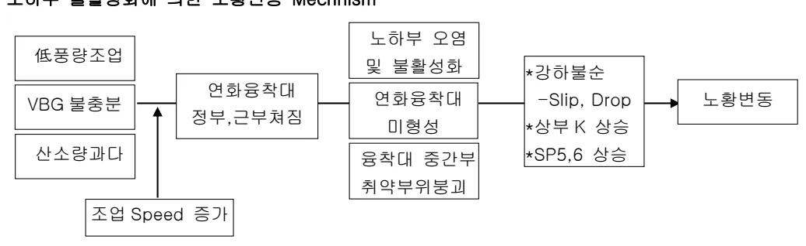
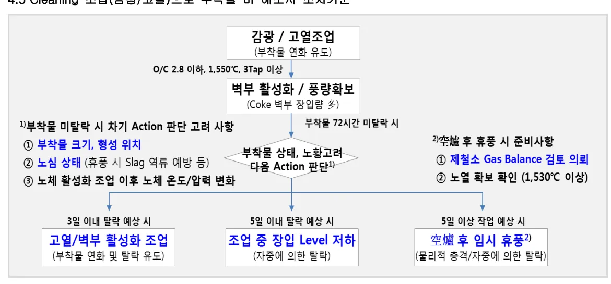
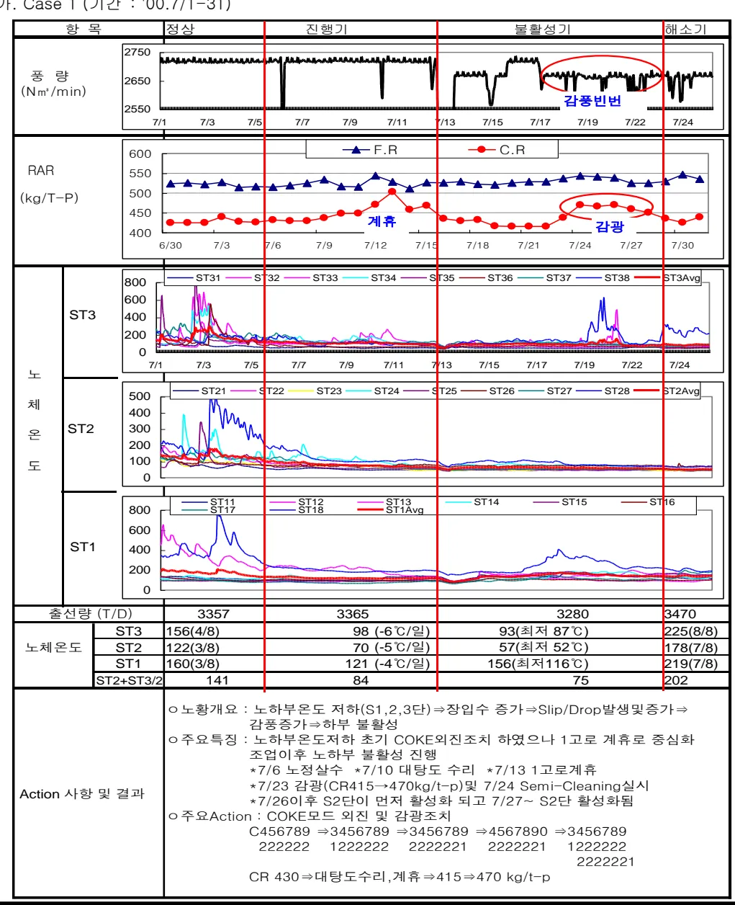
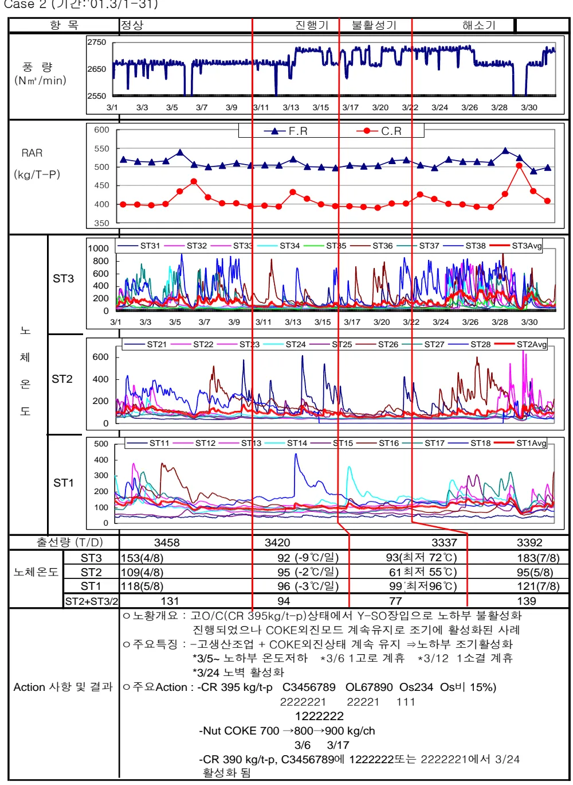
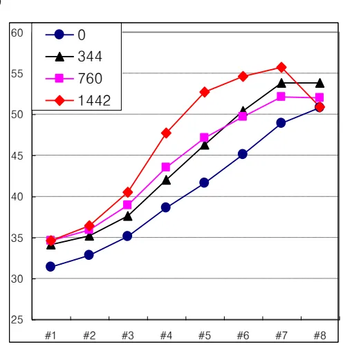
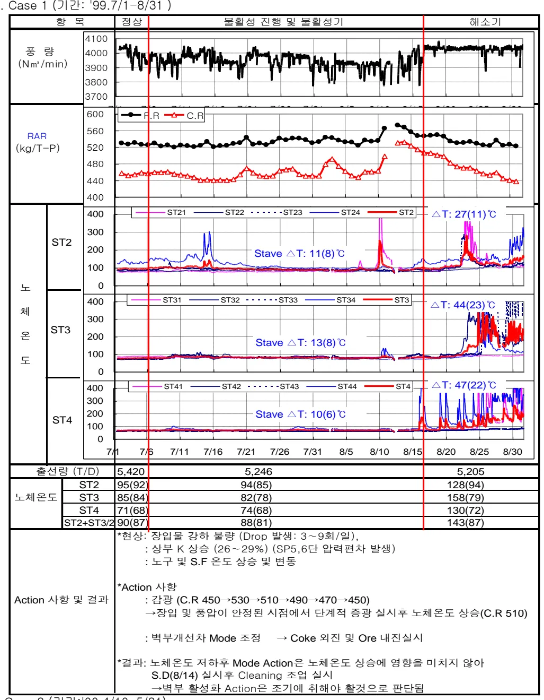
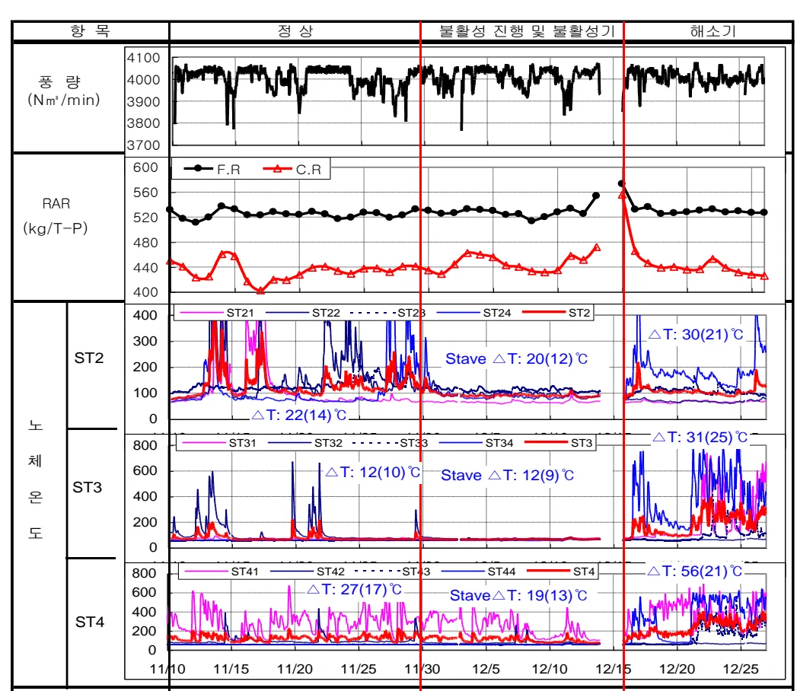

<h2>Page 1</h2>
<h1>1. 적용범위</h1>

노황관리 기술중 노체하부(ST1~3)의 불활성대 생성으로 인한 불량노황 조래시 복구조업기준과 관리방안 및 작업조치수순에 대하여 적용한다.

<h2>2. 목적</h2>

노내 Gas 류 분배를 최적화하여 노체하부를 활성화하여 안정조업을 유지함으로써 효율적인 고로조업과 노장수명화에 기여한다.

<h2>3. 중점관리항목</h2>

<table><thead><tr><th>품질영향인자</th><th>공정영향인자</th></tr></thead><tbody><tr><td>[Si], [S]</td><td>풍압, 노열</td></tr></tbody></table>
<a href="components/TP-030-030-100 노체하부 불활성화시 조치기준(Rev.11)_0900bf4ba7a443ac_usr0000bf4b95f9e446_p001_table_01.png">Table snapshot</a>

<h2>4. 조업기준</h2>

<h3>4.1 노하부 불활성화에 의한 노황변동 Mechanism</h3>

Flowchart illustrating the mechanism of slag movement due to inactive zones in the lower section:

The inactive zone is caused by the combination of Low Slag Flow, VBG Excess, and Excess Slag Ratio, which leads to Slag Movement Speed Increase.

This movement causes Slag Movement, resulting in:
<ul><li>Strong Slag Flow</li><li>-Slip, Drop</li><li>Upper K Increase</li><li>SP5, 6 Increase</li></ul>
The Slag Movement impacts the Lower Section Area and the Slag Flow Area, leading to Slag Flow Formation and Slag Flow Shape.

<h3>4.2 노체하부 온도관리기준 (안정조업시)</h3>

<table><thead><tr><th>구분</th><th>ST1 (°C)</th><th>ST2 (°C)</th><th>ST3 (°C)</th><th>비고</th></tr></thead><tbody><tr><td>2 고로</td><td>45</td><td>50</td><td>60</td><td></td></tr><tr><td>3 고로</td><td>48±2</td><td>44±2</td><td>44±2</td><td></td></tr></tbody></table>
<a href="components/TP-030-030-100 노체하부 불활성화시 조치기준(Rev.11)_0900bf4ba7a443ac_usr0000bf4b95f9e446_p001_table_02.png">Table snapshot</a>

뒷 장 계속

<h2>Page 2</h2>
o 4 고로 노체온도 관리기준

<table><thead><tr><th>구분</th><th>노체온도, 편차 기준</th><th>급배수 온도차 기준</th><th>비고</th></tr></thead><tbody><tr><td>S6~7</td><td><math>35\pm 5^{\circ}\mathrm{C}</math>, 편차 <math>2^{\circ}\mathrm{C}</math> 이상</td><td><math>\Delta T \ge 0.5^{\circ}\mathrm{C}</math></td><td rowspan="4">- 노체온도, 편차, 열부하 3가지 모두 관리 기준 미달 50% 이상 (각 단별), 48시간 지속시 노체 불활성 판단 - 노체 불활성 판단시 즉각 불활 성 해소 Process 이행</td></tr><tr><td>S4~5</td><td><math>35\pm 5^{\circ}\mathrm{C}</math>, 편차 <math>1^{\circ}\mathrm{C}</math> 이상</td><td><math>\Delta T \ge 0.7^{\circ}\mathrm{C}</math></td></tr><tr><td>S3</td><td><math>80\pm 10^{\circ}\mathrm{C}</math>, 편차 <math>5^{\circ}\mathrm{C}</math> 이상</td><td><math>\Delta T \ge 1.0^{\circ}\mathrm{C}</math></td></tr><tr><td>S1~2</td><td><math>100\pm 20^{\circ}\mathrm{C}</math>, 편차 <math>10^{\circ}\mathrm{C}</math> 이상</td><td><math>\Delta T \ge 3.0^{\circ}\mathrm{C}</math></td></tr></tbody></table>
<a href="components/TP-030-030-100 노체하부 불활성화시 조치기준(Rev.11)_0900bf4ba7a443ac_usr0000bf4b95f9e446_p002_table_01.png">Table snapshot</a>

4.3 고로 노하부 불활성 판단기준

<table><thead><tr><th>구분</th><th>ST2~3 온도</th><th>현상 (전고로공통,단계별)</th><th>비고</th></tr></thead><tbody><tr><td>2 고로</td><td><math>\le 70^{\circ}\mathrm{C}</math></td><td>장입 Speed 증가, 풍압안정 노체온도 저하</td><td rowspan="3">*3 고로:All stave</td></tr><tr><td>3 고로</td><td><math>\le 40^{\circ}\mathrm{C}</math></td><td>장입편차, 소 Srop 발생, 감풍횟수 증가</td></tr><tr><td>4 고로</td><td><math>\le 60^{\circ}\mathrm{C}</math></td><td>주상별 온도차 발생 Slip 빈번, 출선재 배출불량, 상부온도 변동</td></tr></tbody></table>
<a href="components/TP-030-030-100 노체하부 불활성화시 조치기준(Rev.11)_0900bf4ba7a443ac_usr0000bf4b95f9e446_p002_table_02.png">Table snapshot</a>

* Stave 고로인 3 고로의 경우는 냉각수 유량을 변경하므로 노체 온도 저하 보다는 Heat Load Heat Load 를 기본으로 노하부 불활성화를 판단함

* 이외 노벽보수 감정시 노하부 원주방향의 부착물 확인시 노하부 불활성 예측 가능 → Semi Cleaning 조업 실시여부 판단

4.4 노하부 온도저하시 조치기준 (전고로공통)

<table><thead><tr><th>항목</th><th>내용</th><th>비고</th></tr></thead><tbody><tr><td rowspan="3">노내 Gas류 조정</td><td>○ 장입 Mode 조정</td><td rowspan="3">고로별 특성화</td></tr><tr><td>- Coke 외진 또는 Ore 내진→주변류 Gas 확보</td></tr><tr><td>○ 중심 Coke 장입량 및 Nut Coke 사용량 조정</td></tr><tr><td rowspan="3">분소결광(Ore Small) 사용량 감소</td><td>○ 분소결광 사용량 감소</td><td rowspan="3"></td></tr><tr><td>○ Nut Coke 사용량 증가</td></tr><tr><td>○ Os 장입 Mode 조정</td></tr><tr><td rowspan="4">Semi-Cleaning 조업</td><td>○ 강광(RAR:정상조업+20kg/T-P, O/C 3.0 수준)</td><td rowspan="4"></td></tr><tr><td>○ 조습량 확보</td></tr><tr><td>○ 고열 및 저염기도 조업, 목표[Si]상향조정 (THM <math>1520^{\circ}\mathrm{C}</math> 이상, C/S 1.0 수준)</td></tr><tr><td>○ 출선,재 작업강화</td></tr><tr><td rowspan="4">Cleaning 조업</td><td>○ 노체냉각수 배수온도 상향조정(2 고로)</td><td rowspan="4"></td></tr><tr><td>○ 강산실시 (정상조업 대비 5~10%)</td></tr><tr><td>○ 고환원제비에 의한 고열조업 지속</td></tr><tr><td>○ 노내통기성 불량시 All Coke 조업전화 검토 ○ 고로별 비상 Mode 사용검토</td></tr></tbody></table>
<a href="components/TP-030-030-100 노체하부 불활성화시 조치기준(Rev.11)_0900bf4ba7a443ac_usr0000bf4b95f9e446_p002_table_03.png">Table snapshot</a>

<h2>Page 3</h2>
4.5 Cleaning 조업(감광/고열)으로 부착물 미 해소시 조치기준

감광 / 고열조업 (부착물 연화 유도)

O/C 2.8 이하, <math>1,550^{\circ}\text{C}</math>, 3Tap 이상

벽부 활성화 / 풍량확보 (Coke 벽부 장입량 多)

부착물 72시간 미탈락 시

부착물 상태, 노황고려 다음 Action 판단

1) 부착물 미탈락 시 자기 Action 판단 고려 사항
<ol><li>부착물 크기, 형성 위치</li><li>노심 상태 (휴풍 시 Slag 역류 예방 등)</li><li>노체 활성화 조업 이후 노체 온도/압력 변화</li></ol>
3일 이내 탈락 예상 시

고열/벽부 활성화 조업 (부착물 연화 및 탈락 유도)

5일 이내 탈락 예상 시

조업 중 장입 Level 저하 (자중에 의한 탈락)

5일 이상 작업 예상 시

2) 空爐 후 휴풍 시 준비사항
<ol><li>제철소 Gas Balance 검토 의뢰</li><li>노열 확보 확인 (<math>1,530^{\circ}\text{C}</math> 이상)</li></ol>
空爐 후 임시 휴풍2) (물리적 충격/자중에 의한 탈락)

뒷 장 계 속

<h2>Page 4</h2>
4.6 노하부 불활성 해소판단 기준 (Cleaning 완료 및 증광판단 기준)

<table><thead><tr><th>항목</th><th>4 고로 기준</th><th>2 고로 기준</th><th>비고</th></tr></thead><tbody><tr><td>가. Belly 온도 (노하부부착물)</td><td>평균 <math>200^{\circ}\text{C}</math> 이상</td><td>ST2 평균온도 <math>\ge 150^{\circ}\text{C}</math>, 또는 T/C 4 개중 1 개 이상 T/C 온도가 <math>200^{\circ}\text{C}</math> 이상 (단 <math>100^{\circ}\text{C}</math> 이하는 없을것)</td><td>증광후 Belly 온도 상승을 전제로 함.</td></tr><tr><td>나. 통기성</td><td>정상풍량 및 노정압 6 시간 유지</td><td>정상풍량(<math>4000\text{ N m}^2</math>) 및 노정압 24 시간 안정 유지 <math>-K \le 4.0</math></td><td></td></tr><tr><td>다. 장입물 강하</td><td>Slip, Drop 6 시간동안 없을 것. 소밀현상 없을 것.</td><td>Slip, Drop 8 시간동안 발생하지 않고 장입 Speed 일정 <math>-\text{Sounding Level 차 } 0.3\text{M 이내}</math></td><td></td></tr><tr><td>라. 출선재 (노심 Coke Cleaning)</td><td>O/C <math>3.0\sim 3.15</math> : <math>1540\pm 10^{\circ}\text{C}</math> O/C <math>3.15\sim 3.25</math> : <math>1530\pm 10</math> O/C <math>3.25\sim 3.4</math> : <math>1520\pm 10</math> - 용선온도 6 시간동안 변동폭 <math>20^{\circ}\text{C}</math> 이내 - <math>[\text{Si}]</math>: 동일 O/C, 풍량에서 변동폭 <math>0.2\%</math> 이내</td><td>용선온도 <math>1530^{\circ}\text{C}</math> 이상유지 용선온도와 <math>[\text{Si}]</math>의 변동폭이 8 시간내 <math>20^{\circ}\text{C}</math>, <math>0.2\%</math> 이내 주상별 편차가 <math>20^{\circ}\text{C}</math> 이내로 연속 4 Tap 유지시</td><td></td></tr><tr><td>마. 풍구상태</td><td>생광강하 풍구 3 개 이내 연소상태 양호</td><td>생광강하 풍구 2 개 이내, 원주방향별 특징이 없을것. (특정풍구 생광강하 지속 등)</td><td></td></tr><tr><td>바. <math>\eta</math> CO</td><td>동일 O/C 에서 변동폭 <math>0.5\%/ 2</math> 시간이내</td><td>동일 O/C 에서 변동폭 <math>0.5\%/ 2</math> 시간이내</td><td></td></tr></tbody></table>
<a href="components/TP-030-030-100 노체하부 불활성화시 조치기준(Rev.11)_0900bf4ba7a443ac_usr0000bf4b95f9e446_p004_table_01.png">Table snapshot</a>

※ 위 기준에 의한 Cleaning 완료판단후 단계적증광 실시

5. 이상판단 및 조치기준 : 해당사항 없음

뒷 장 계속

<h2>Page 5</h2>
<h2>6. 기술이론 (노하부 불활성 조치사례)</h2>

<h3>6.1 1고로 노하부 불활성 조치실적</h3>

가. Case 1 (기간 : '00.7/1-31)

<table border="1"><thead><tr><th>항목</th><th>정상</th><th>진행기</th><th>불활성기</th><th>해소기</th></tr></thead><tbody><tr><td>풍량 (Nm3/min)</td><td colspan="4"></td></tr><tr><td rowspan="2">RAR (kg/T-P)</td><td colspan="4"></td></tr><tr><td colspan="4"></td></tr><tr><td rowspan="2">ST3</td><td colspan="4"></td></tr><tr><td colspan="4"></td></tr><tr><td rowspan="2">노체온도</td><td colspan="4"></td></tr><tr><td colspan="4"></td></tr><tr><td rowspan="2">ST1</td><td colspan="4"></td></tr><tr><td colspan="4"></td></tr><tr><td>출선량 (T/D)</td><td>3357</td><td>3365</td><td>3280</td><td>3470</td></tr><tr><td rowspan="3">노체온도</td><td>ST3</td><td>156(4/8)</td><td>98 (-6℃/일)</td><td>93(최저 87℃)</td><td>225(8/8)</td></tr><tr><td>ST2</td><td>122(3/8)</td><td>70 (-5℃/일)</td><td>57(최저 52℃)</td><td>178(7/8)</td></tr><tr><td>ST1</td><td>160(3/8)</td><td>121 (-4℃/일)</td><td>156(최저 116℃)</td><td>219(7/8)</td></tr><tr><td></td><td>ST2+ST3/2</td><td>141</td><td>84</td><td>75</td><td>202</td></tr><tr><td>Action 사항 및 결과</td><td colspan="4"><ul><li>노황개요 : 노하부온도 저하(S1,2,3단) ⇒ 장입수 증가 ⇒ Slip/Drop 발생및 증가 ⇒ 감풍증가 ⇒ 하부 불활성</li><li>주요특징 : 노하부온도저하 초기 | COKE외진조치 하였으나 1고로 계휴로 중심화 조입이후 노하부 불활성 진행<ul><li>*7/6 노정실수 *7/10 대탕도 수리 *7/13 1고로계휴</li><li>*7/23 감광(CR415→470kg/t-p) 및 7/24 Semi-Cleaning실시</li><li>*7/26이후 S2단이 먼저 활성화 되고 7/27~ S2단 활성화됨</li></ul></li><li>주요Action : COKE모드 외진 및 감광조치<ul><li>C456789 ⇒ 3456789 ⇒ 3456789 ⇒ 4567890 ⇒ 3456789 222222 1222222 2222221 2222221 1222222 2222221</li><li>CR 430 ⇒ 대탕도수리, 계휴 ⇒ 415 ⇒ 470 kg/t-p</li></ul></li></ul></td></tr></tbody></table>

<h2>Page 6</h2>

o 주요 경과사항

(초기)

▷생산 3350 T/D수준에서 노체온도 저하시점인 7/4 C456789 →3456789 (OL6789 Os23 동일) 222222 1222222 2222 12

▷CR 430 kg/t-p 유지 ▷Nut COKE 0, Cc 1.8 ton × 1/3

(진행기)

▷7/5부터 Slip &amp; Drop 2~4회/일 발생 ▷7/6 S-1 B/C 손상부 Fastner작업시 감풍(VB 2700→1000Nm3)으로 노정살수 ▷7/7부터 정입이 122→124 Ch/D로 빨라짐 ▷7/9 C3456789 → 3456789 (OL, Os 동일) 1222222 2222221 ▷7/10 장입 127 Ch/D -#1대탕도 수리차 감광(CR430→450)했으나 VB 2700+VO2 2500 그대로 유지 ▷7/11이후 Slip 일 5회로 증가

(불활성기)

▷7/13 1고로 계류실시 ▷7/13~7/16 계류후 노벽활성화 되지않은 상태에서 증광(CR 415) 및 풍압안정 위해 C3456789 → 3456789 → 456789 → 4567890 까지 내진 2222221 1222222 222222 2222221 이때 S1:150℃, S2: 60~70℃, S3: 90~100℃에서 S2,3단 5~6℃/일 저하 감풍이 일 3~4회, Slip/Drop 일 5~6회 발생 ▷7/20 S3,4단 온도변동 이유로 Os 13→14.5%까지 Up했다가 다시 13.0%로 저하조치 ▷7/23 S2단 50℃, S3단 77℃(시간Data)까지 저하되고 장입상태 불안정 및 풍압변동 &amp; 우천으로 감광(CR 415→450→430→470)실시, Slip/Drop 일 12회 발생 ▷7/24 노하부 Semi-Cleaning위해 C4567890 → 3456789 변경 2222221 1222222 2222221

(해소기)

▷7/26 S3단 활성화, 7/27 S2단 100℃ 이상으로 활성화 ▷7/28 증광실시

● Case 1 의 교훈

▷비교적 低생산 조업하에서 고로 휴풍등 타 요인에 의해 노하부 불활성으로 진행된 사례

▷노하부 불활성화 진행의 일반적 현상

-하부온도 저하(상부→하부) -C/S중심온도 상승, 벽 저하

-장입수 증가, 풍압안정 -Shaft 중, 상부 온도/압력 변동 (2BF)

-K(특히 하부K)상승, Hco저하 -Slip/Drop발생, 감풍빈번

-주상온도차 -출선, 재 골란 -출선회수 증가

*Case 1 의 사례에서 나타난 현상

▷노하부 온도가 저하되는 과정에 *감풍 *고로휴풍 *소결휴지로 Y-SO장입 *드물게는 우천 or 노정살수가 있으면 노체온도 저하는 가속화 됨

▷노하부 온도저하 과정에서 장입Speed상승으로 C/Sonde중심온도 저하되었다고 해서 COKE를 내진하는것이니, 노하부온도 낮은상태에서 일 125Ch Over(PCR 90~100 kg/t-p수준)시는 노하부온도저하를 가속화 시킴 -7/13~7/16 Slip/Drop으로 C/Sonde중심온도 저하시 COKE의 내진Action이 좋은사례

▷또 노하부온도 낮은상태에서 S3,4단 1~2개의 T/C변동이 있다고 하여 COKE를 내진하여 벽부 O/C를 상승시키는것은 誤Action이라고 보며, 이때는 COKE의진상태(C3456789)에서 2222 221 감광 및 RAR 10 15kg/t-p 올려 고열조업하면서 S2단을 활성화 시키는것이 正Action이라고 볼

<h2>Page 7</h2>
<table><thead><tr><th>항목</th><th>정상</th><th>진행기</th><th>불활성기</th><th>해소기</th></tr></thead><tbody><tr><td>풍량 (Nm<math>^3</math>/min)</td><td colspan="4"></td></tr><tr><td>RAR (kg-T-P)</td><td colspan="4"></td></tr><tr><td rowspan="2">노체온도</td><td colspan="4"></td></tr><tr><td colspan="4"></td></tr><tr><td rowspan="2">ST1</td><td colspan="4"></td></tr><tr><td colspan="4"></td></tr><tr><td>출선통량 (T/D)</td><td>3458</td><td>3420</td><td>3337</td><td>3392</td></tr><tr><td rowspan="3">노체온도</td><td>ST3</td><td>153(4/8)</td><td>92 (-9°C/일)</td><td>93(최저 72°C)</td><td>183(7/8)</td></tr><tr><td>ST2</td><td>109(4/8)</td><td>95 (-2°C/일)</td><td>61 최저 55°C)</td><td>95(5/8)</td></tr><tr><td>ST1</td><td>118(5/8)</td><td>96 (-3°C/일)</td><td>99 최저 96°C)</td><td>121(7/8)</td></tr><tr><td>ST2+ST3/2</td><td>131</td><td>94</td><td>77</td><td>139</td></tr><tr><td>Action 사항 및 결과</td><td colspan="4">
○ 노환개요 : 고O/C(CR 395kg/t-p)상태에서 Y-SO장입으로 노하부 불활성화 진행되었으나 COKE외진모드 계속 유지로 조기에 활성화된 사례

○ 주요특징 : -고생산조업 + COKE외진상태 계속 유지 ⇒노하부 조기활성화 *3/5~ 노하부 온도저하 *3/6 1고로 계휴 *3/12 1소결 계휴 *3/24 노벽 활성화

○ 주요Action : -CR 395 kg/t-p C3456789 OL67890 Os234 Os비 15%)

2222221 222221 111

1222222

-Nut COKE 700 → 800 → 900 kg/ch 3/6 3/17

-CR 390 kg/t-p, C3456789에 1222222또는 2222221에서 3/24 활성화 됨
</td></tr></tbody></table>

<h2>Page 8</h2>
(초기)

<ul><li>고O/C(CR 395 kg/t-p) 상태에서 S1,2,3단 온도가 간헐적으로 변동 있었으나 C3456789 OL67890 Os234 (Os비 15%) 조업유지 2222221 또는 1222222 22221 111 -Nut COKE 700 kg/ch, Cc 1.8 T x 1/3</li><li>3/15부터 노체온도가 저하되는 경향이었으나 S1:117℃, S2:84℃, S3:110℃, S4:94℃로 평균온도는 양호함.</li><li>3/16 1고로 계휴실시. 계휴후에도 CR 400 kg/t-p 상태에서 C3456789 OL6789 Os234 1222222 2222 111 Nut 700 kg로 조업하면서 S1,2,3단 안정되고 고생산 유지 or2222221</li><li>3/9 CR 390 kg/t-p 까지 증광</li></ul>

(진행기)

<ul><li>3/10부터 S1,2,3단 온도 저하세 보이고 변동T/C가 적어짐</li><li>3/12 1소결 계휴로 Y-SO 장입</li><li>3/16 1소결 계휴후에도 CR 390 kg/t-p까지 증광하자, 3/16부터 S1,2,3,4단 100℃이하로 저하</li></ul>

(불활성기)

<ul><li>3/17 Nut COKE 800→900 kg/ch, S1,2,3단 온도는 더 저하됨 -S1:90~95℃, S2:52~54℃, S3:60~95℃</li><li>3/19 C3456789 ⇒ C3456789 로 변경후 약 6Hr경과시점 부터 1~2℃/Hr S2단 온도상승 1222222 2222221 *이때도 CR 390 kg/t-p 유지</li><li>3/22 #2대탕도 소수리시 CR 390→420 kg/t-p로 잘 대처했고 3/24부터 노하부는 활성화 됨.</li></ul>

●Case II의 교훈

<ul><li>이번의 경우도 노하부 온도 저하될때 소결정수로 Y-Sinter장입으로 하부 불활성화가 가속화 되었으며 고O/C (CR 400~390 kg/t-p) 상태에서도 C3456789 로 COKE 3Notch를 계속 사용하였기 때문에 노황부조 없이 노벽이 활성화 됨 1222222 또는 2222221</li></ul>

뒷 장 계 속

<h2>Page 9</h2>
다. Case 3 (기간: 01.8/1~9/10)

<table><thead><tr><th>항목</th><th>정상</th><th>진행기</th><th>불활성기</th><th>해소기</th></tr></thead><tbody><tr><td>풍량 (Nm3/min)</td><td>2800</td><td>2600</td><td>2400</td><td>2200</td></tr><tr><td>RAR (kg/T-P)</td><td>F.R</td><td>C.R</td><td></td><td></td></tr><tr><td>ST3</td><td>Si31</td><td>Si32</td><td>Si33</td><td>Si34</td><td>Si35</td><td>Si36</td><td>Si37</td><td>Si38</td><td>Si3Avg</td></tr><tr><td>ST2</td><td>Si21</td><td>Si22</td><td>Si23</td><td>Si24</td><td>Si25</td><td>Si26</td><td>Si27</td><td>Si28</td><td>Si2Avg</td></tr><tr><td>ST1</td><td>Si11</td><td>Si12</td><td>Si13</td><td>Si14</td><td>Si15</td><td>Si16</td><td>Si17</td><td>Si18</td><td>Si1Ave</td></tr><tr><td>출선량 (T/D)</td><td>3554</td><td>3545</td><td>2698</td><td>3,359</td></tr><tr><td rowspan="4">노체온도</td><td>ST3</td><td>117(7/8)</td><td>102(-2℃/일)</td><td>70(최저54℃)</td><td>132</td></tr><tr><td>ST2</td><td>110(4/8)</td><td>75(-5℃/일)</td><td>60(최저50℃)</td><td>144</td></tr><tr><td>ST1</td><td>107(3/8)</td><td>102(-1℃/일)</td><td>83(최저71℃)</td><td>134</td></tr><tr><td>ST2+ST3/2</td><td>114</td><td>89</td><td>65</td><td>138</td></tr><tr><td rowspan="2">Action 사항 및 결과</td><td colspan="5">○ 노황개요 : 고생산 + Nut COKE 1500 kg/ch + Os내진으로 중간부 &amp; 벽부가 불활성화된 사례로 응착대 Profile의 이상발달(W형)로 노하부 불활성이 장기간 진행되었던 사례</td></tr><tr><td colspan="5">○ 주요특징 : -Nut COKE 다량사용, Os내진(Os비:15~16%), 고생산조업으로 중간부 처짐에 의해 근부까지 비대됨. 봉락없이 고열조업 및 분포 조정으로 장기간에 걸쳐 불활성 해소함. -소폭의 증광 또는 MODE변경에도 응착대 정, 근부 통과시 노황변화 보임.</td></tr><tr><td colspan="5">○ 주요Action : -장입MODE C3456789 or 비상모드 C345 OL34 Os12 사용 2222221 544 44 21 -풍량 2300~2400 Nm3에서 고열조업 및 Nut COKE Cut (1500→1200→0 kg/ch)</td></tr></tbody></table>
<a href="components/TP-030-030-100 노체하부 불활성화시 조치기준(Rev.11)_0900bf4ba7a443ac_usr0000bf4b95f9e446_p009_table_01.png">Table snapshot</a>

<h2>Page 10</h2>

o 주요 경과사항

(초기)

o CR 410 kg/t-p, 3550 T/D의 고생산 조업에서 C3456789 OL6789 Os456 (Os비 15~16%), Nut COKE 1500 kg/ch, Cc 1.8T X1/3조업 1222222 2222 111 (또는 56에 21 or 12 까지 내진) o 8/8 124 ch/D, 3602 T/D후 8/9부터 S1,2,3단 온도 100℃ 이하로 저하되고 하부 K 상승

(진행기)

o 8/11 Slip 일 2회 발생 o 8/12 C3456789 ⇒ 3456789 로 바꾸고 S1,2단 온도 70~80 ℃로 낮은 상태이나 1222222 2222222 풍압 안정되어 고생산조업 계속 o 8/15 C3456789 ⇒ 3456789 로 조정후 S1단은 소폭 상승, S2단은 60℃로 더 낮아짐 2222222 2222221

(불활성기)

o 8/17 #1대탕도 수리차 CR 410 →440 kg/t-p o 8/18 SP3,4,5단 압력계 변동되며 일시적 Hanging 발생 (VB 2650 →2000으로 감풍후 자연강하) S2,3단 온도 낮은 상태에서 Slip 일 2~3회 발생 o 8/20부터 중,상부 K 변동, Slip 일 5~6회 발생. S1:90℃, S2:50℃, S3:50℃로 낮아 CR 550~560 kg/t-p (All COKE)로 감광하여 Cleaning 실시 o 8/21~8/22 Nut COKE 1500→1200→1000→0 kg/ch 8/22이후는 풍량이 2300~2400 Nm3만 유지되고 감풍 및 Slip이 빈번해짐(일 5~6회) o 8/24 -비상모드 채택 C345 OL34 Os12 544 44 21 -중광 및 소폭의 모드변경(OL내진)시에도 용착대 정,근부 통과시 노황변동 보임 *용착대 정부 통과시 (변경후 3Hr, 15~20ch) : SP3단 압력 상승, 중부 K 상승 *용착대 근부 통과시 (변경후 6Hr, 30~35ch) : SP3단 압력저하, 풍압상승, 하부K상승 ※ 중간부 처짐으로 인해 중간부 Gas공급이 미약한 상태에서 중간부의 O/C가 상승하면 노벽으로 일시적 Gas흐름 발생. 이 현상은 9/2까지 계속됨. o 8/25부터 S2,3단이 먼저 활성화 되고 S1단은 9/2에 활성화 됨.

뒷 장 계 속

<h2>Page 11</h2>
<h3>●Case III의 교훈 - 용착대 Profile 재형성에는 장시간 소요</h3>

<ul><li>Nut-COKE의 다량사용(1500 kg/ch)으로 반경방향 중간부 COKE Bed가 압아진 상태에서 Os의 내진(Os 5,6 N * 1,2회전)과 고생산조업으로 중간부 O/C 상승 ⇒ 중간부 처지면서 벽부까지 불활성화 됨.</li><li>비상모드 및 감광으로 중심부가 확보되어 있었기 때문에 Hanging등 심한 노화변동은 없었으나 이것이 오히려 용착대 Profile개선에는 오랜 시간이 걸렸고, 풍량은 2300~2400 Nm3 유지되면서도 순수하게 모드변경 및 고열조업에 의해서 노하부를 활성화 시킴.</li></ul>

<ul><li>따라서 Nut-COKE와 중심COKE의 사용량은 COKE회수율 문제를 포함하여 재검토가 필요하며, 10/1 S2,3,4단 온도 낮은상태에서 COKE Base 11.9→12.1 T/ch, Nut-COKE 800→600 kg/ch 후 약 3hr 경과시점 부터 노하부 온도가 상승하였던 사례가 참고자료가 될 수 있음.</li></ul>

<h3>●고로별 Nut-COKE와 중심COKE 사용량과 COKE 층후</h3>

<table><thead><tr><th rowspan="2">고로</th><th rowspan="2">N-COKE (kg/ch)</th><th rowspan="2">C-COKE (kg/ch)</th><th rowspan="2">C/Base</th><th colspan="2">실C.B</th><th rowspan="2">노구부 층후(mm)</th><th rowspan="2">Belly부 층후(mm)</th><th rowspan="2">비고</th></tr><tr><th></th><th></th></tr></thead><tbody><tr><td>1고로</td><td>1,500</td><td>600</td><td>11.7</td><td>9.6</td><td></td><td>485</td><td>235</td><td></td></tr><tr><td>2고로</td><td>1,500</td><td>400</td><td>18.9</td><td>17</td><td></td><td>677</td><td>286</td><td></td></tr><tr><td>3고로</td><td>2,800</td><td>500</td><td>21.5</td><td>18.2</td><td></td><td>503</td><td>224</td><td></td></tr><tr><td>4고로</td><td>2,500</td><td>600</td><td>22.5</td><td>19</td><td></td><td>536</td><td>238</td><td></td></tr></tbody></table>
<a href="components/TP-030-030-100 노체하부 불활성화시 조치기준(Rev.11)_0900bf4ba7a443ac_usr0000bf4b95f9e446_p011_table_01.png">Table snapshot</a>

*1고로를 제외한 타 고로는 OL Mode가 넓어 Ore의 Soft분포가 가능하며, 또한 Nut-COKE의 Os배합으로 벽부 O/C제어가 상대적으로 용이함.

<h3>●1고로 Nut-COKE사용시기별 S/Sonde 온도 및 ECO</h3>

<h2>Page 12</h2>
<h2>6.2 2고로 노하부 불활성 조치실적</h2>

가. Case 1 (기간: '99.7/1-8/31)

<table><thead><tr><th>항목</th><th>정상</th><th>불활성 진행 및 불활성기</th><th>해소기</th></tr></thead><tbody><tr><td>풍량 (Nm<math>^3</math>/min)</td><td>4100 4000 3900 3800 3700</td><td colspan="2"></td></tr><tr><td>RAR (kg/T-P)</td><td>600 560 520 480 440 400</td><td colspan="2">
F.R (Black line) and C.R (Red line) graphs showing trends.
</td></tr><tr><td rowspan="3">노체온도</td><td rowspan="2">ST2</td><td colspan="2">
ST21, ST22, ST23, ST24, ST2

Stave <math>\Delta T: 11(8)^\circ \text{C}</math>

<math>\Delta T: 27(11)^\circ \text{C}</math>
</td></tr><tr><td colspan="2">
ST31, ST32, ST33, ST34, ST3

Stave <math>\Delta T: 13(8)^\circ \text{C}</math>

<math>\Delta T: 44(23)^\circ \text{C}</math>
</td></tr><tr><td>ST4</td><td colspan="2">
ST41, ST42, ST43, ST44, ST4

Stave <math>\Delta T: 10(6)^\circ \text{C}</math>

<math>\Delta T: 47(22)^\circ \text{C}</math>
</td></tr><tr><td>출선통 (T/D)</td><td>5,420</td><td>5,246</td><td>5,205</td></tr><tr><td rowspan="4">노체온도</td><td>ST2</td><td>95(92)</td><td>94(85)</td><td>128(94)</td></tr><tr><td>ST3</td><td>85(84)</td><td>82(78)</td><td>158(79)</td></tr><tr><td>ST4</td><td>71(68)</td><td>74(68)</td><td>130(72)</td></tr><tr><td>ST2+ST3/2</td><td>90(87)</td><td>88(81)</td><td>143(87)</td></tr><tr><td rowspan="2">Action 사항 및 결과</td><td colspan="3">*현상: 장입물 강하 불량 (Drop 발생: 3~9회/일), 상부 K 상승 (26~29%) (SP5,6단 알려펀차 발생) 노구 및 S.F 온도 상승 및 변동</td></tr><tr><td colspan="3">*Action 사항 감광 (C.R 450→530→510→490→470→450) →장입 및 풍압이 안정된 시점에서 단계적 증광 실시후 노체온도 상승(C.R 510) → 벽부개선차 Mode 조정 → Coke 외진 및 Ore 내진실시</td></tr><tr><td colspan="4">*결과: 노체온도 저하후 Mode Action은 노체온도 상승에 영향을 미치지 않아 S.D(8/14) 실시후 Cleaning 조업 실시 → 벽부 활성화 Action은 조기에 취해야 할 것으로 판단됨</td></tr></tbody></table>

나. Case 2 (기간: '00.4/10-5/31)

<h2>Page 13</h2>
<table><thead><tr><th>항목</th><th>정상</th><th>불확성 진행 및 불확성기</th><th>해소기</th></tr></thead><tbody><tr><td>풍량 (<math>\text{Nm}^3/\text{min}</math>)</td><td>4100 4000 3900 3800 3700</td><td>4MB 대수리 풍량저하 조얼</td><td></td></tr><tr><td>RAR (<math>\text{kg}/\text{T-P}</math>)</td><td>600 560 520 480 440 400</td><td>F.R. C.R.</td><td></td></tr><tr><td rowspan="3">노체온도</td><td>ST2</td><td>500 400 300 200 100 0</td><td>ST21 ST22 ST23 ST24 ST2 <math>\Delta T: 16(15)^\circ \text{C}</math> Stave <math>\Delta T: 19(16)^\circ \text{C}</math> <math>\Delta T: 27(24)^\circ \text{C}</math></td></tr><tr><td>ST3</td><td>400 300 200 100 0</td><td>ST31 ST32 ST33 ST34 ST3 <math>\Delta T: 15(13)^\circ \text{C}</math> Stave <math>\Delta T: 14(12)^\circ \text{C}</math> <math>\Delta T: 16(15)^\circ \text{C}</math></td></tr><tr><td>ST4</td><td>400 300 200 100 0</td><td>ST41 ST42 ST43 ST44 ST4 <math>\Delta T: 10(10)^\circ \text{C}</math> Stave <math>\Delta T: 11(9)^\circ \text{C}</math> <math>\Delta T: 11(9)^\circ \text{C}</math></td></tr><tr><td>출선량 (T/D)</td><td>5443</td><td>5331</td><td>5447</td></tr><tr><td rowspan="4">노체온도</td><td>ST2</td><td>104(79)</td><td>107(89)</td><td>128(96)</td></tr><tr><td>ST3</td><td>78(76)</td><td>73(70)</td><td>99(86)</td></tr><tr><td>ST4</td><td>67(67)</td><td>67(64)</td><td>75(68)</td></tr><tr><td>ST2+ST3/2</td><td>91(78)</td><td>80(78)</td><td>114(91)</td></tr><tr><td rowspan="2">Action 사항 및 결과</td><td colspan="4">*현상: 장입물 강하 불량 (Drop 발생: 2~5회/일), 상부 K 상승 (25~27%) (SP5, 6단 압력편차 발생)</td></tr><tr><td colspan="4">*Action 사항 : 감광 (C.R 440→470) →5/18 S.D 실시후 C.R 470수준유지 2~3일 경과후 노체온도 상승 : 벽부개선차 Mode 조정 → Coke 외진 및 Ore 내진설시</td></tr><tr><td colspan="4">*결과: ST2단 온도 변동하나 장입물 강하불량 현상 해소 되지 않으며, ST2단 온도 저하후 Drop 빈번 발생 및 상부 K상승추세 → ST2,3단 온도 및 Stave 온도 병행관리 요구됨. (S.D실시후 노체온도 상승으로 불확성 해소 경험)</td></tr></tbody></table>

다. Case 3 (기간: '00.11/10-12/26)

<h2>Page 14</h2>
<table><thead><tr><th>항목</th><th>정상</th><th>불활성 진행 및 불활성기</th><th>해소기</th></tr></thead><tbody><tr><td>풍량 (Nm3/min)</td><td>4100 4000 3900 3800 3700</td><td></td><td></td></tr><tr><td rowspan="2">RAR (kg/T-P)</td><td colspan="3">
F.R (Black line) and C.R (Red line)
</td></tr><tr><td colspan="3">
RAR (kg/T-P)
</td></tr><tr><td rowspan="3">노체온도</td><td colspan="4">
ST21, ST22, ST23, ST24, ST2

ΔT: 30(21)℃, Stave ΔT: 20(12)℃
</td></tr><tr><td colspan="4">
ST31, ST32, ST33, ST34, ST3

ΔT: 22(14)℃, ΔT: 31(25)℃, Stave ΔT: 12(10)℃
</td></tr><tr><td colspan="4">
ST41, ST42, ST43, ST44, ST4

ΔT: 27(17)℃, ΔT: 56(21)℃, Stave ΔT: 19(13)℃
</td></tr></tbody></table>

<table><thead><tr><th></th><th>출선량 (T/D)</th><th></th><th></th></tr></thead><tbody><tr><td rowspan="4">노체온도</td><td>ST2</td><td>5479</td><td>5420</td><td>5456</td></tr><tr><td>ST3</td><td>133(89)</td><td>96(85)</td><td>113(93)</td></tr><tr><td>ST4</td><td>77(68)</td><td>66(64)</td><td>206(93)</td></tr><tr><td>ST2+ST3/2</td><td>126(89)</td><td>109(73)</td><td>238(135)</td></tr><tr><td></td><td></td><td>105(74)</td><td>81(74)</td><td>160(93)</td></tr></tbody></table>
<a href="components/TP-030-030-100 노체하부 불활성화시 조치기준(Rev.11)_0900bf4ba7a443ac_usr0000bf4b95f9e446_p014_table_01.png">Table snapshot</a>

*현상: 장입물 강하 불량 (Drop 발생: 2~7회/일), 노구 및 S/F온도 온도상승 및 변동 : 상부 K 상승 (25~29%) (SP5, 6단 압력판차 발생) : 12/14 S.D 실시 후 재송풍과정에서 Hanging 발생

*Action 사항 Action 사항 및 결과

: 감광 (C.R 440→470→650) →12/14 S.D 실시 후 재송풍과정에서 Hanging 발생으로 대폭감량 실시

: 벽부개선차 Mode 조정 → Coke 외진 및 Ore 내진 실시

*결과: ST3단 온도 저하된 상태에서 ST2단 온도 저하 유지로 장입물 강하불량 현상 심화

: ST2단 온도 저하후 Drop 빈번 발생 및 상부 K상승추세

→ ST3단 활성화 위해 Mode 소폭 조정했으나, 개선기미 없었음

<h2>Page 15</h2>
<table><thead><tr><th>항목</th><th>정상</th><th>불활성 기간</th><th>해소기</th></tr></thead><tbody><tr><td>풍량 (Nm3/min)</td><td>4100 4000 3900 3800 3700</td><td></td><td></td></tr><tr><td rowspan="2">RAR (kg/T-P)</td><td colspan="2">F.R C.R</td><td></td></tr><tr><td colspan="2"></td><td></td></tr><tr><td rowspan="2">ST2 노체온도</td><td colspan="3">ST21 ST22 ST23 ST24 ST2 Stave <math>\Delta T: 23(18)^{\circ}\text{C}</math> <math>\Delta T: 14^{\circ}\text{C}</math></td></tr><tr><td colspan="3"></td></tr><tr><td rowspan="2">ST3 노체온도</td><td colspan="3">ST31 ST32 ST33 ST34 ST3 Stave <math>\Delta T: 48(25)^{\circ}\text{C}</math> <math>\Delta T: 16^{\circ}\text{C}</math></td></tr><tr><td colspan="3"></td></tr><tr><td rowspan="2">ST4 노체온도</td><td colspan="3">ST41 ST42 ST43 ST44 ST4 Stave <math>\Delta T: 96(77)^{\circ}\text{C}</math> <math>\Delta T: 56^{\circ}\text{C}</math></td></tr><tr><td colspan="3"></td></tr><tr><td>출선량 (T/D)</td><td>5471</td><td>5145</td><td>5460</td></tr><tr><td rowspan="4">노체온도</td><td>ST2</td><td>123 (90)</td><td>90(88)</td><td>94(93)</td></tr><tr><td>ST3</td><td>191(102)</td><td>100(100)</td><td>266(131)</td></tr><tr><td>ST4</td><td>278(215)</td><td>285(200)</td><td>380(295)</td></tr><tr><td>ST2+ST3/2</td><td>157 (96)</td><td>95(94)</td><td>180(112)</td></tr><tr><td colspan="4">*현상: 소 Drop 발생: 1~3회/일 : 상부 K 상승 (24~25%)</td></tr><tr><td colspan="4">*Action 사항 : 감광 (C.R 440→460)</td></tr><tr><td rowspan="2">Action 사항 및 결과</td><td colspan="3">: 벽부개선차 Mode 조정 → Ore 내진실시 (Coke 중심장입 조정 <math>1.2 \times 1/3 \to 1/4</math>)</td></tr><tr><td colspan="3">*결과: ST3단 소폭저하 및 풍압변동으로 감풍횟수 증가시점 Action으로 소폭 감광후 노체온도 상승</td></tr></tbody></table>
<a href="components/TP-030-030-100 노체하부 불활성화시 조치기준(Rev.11)_0900bf4ba7a443ac_usr0000bf4b95f9e446_p015_table_01.png">Table snapshot</a>

<h2>Page 16</h2>
<ul><li>노하부 불활성의 조기현상으로 풍압상승에 의한 감압횟수 증가</li><li>상부 K 상승 및 SP5,6 단 상승 및 편차발생</li><li>노구온도 및 S.F 온도 변동 심함</li><li>장입물 강하 불량(Drop 및 Slip 발생)</li></ul>

<h3>o 2 고로 불활성예방 관리 Point</h3>

<ul><li>ST2,3 단 온도 및 stave 온도를 병행관리하되 3 단온도 중점관리되어야 할 것으로 판단됨.</li><li>ST2,3 단 평균 <math>90^{\circ}\text{C}</math> 이상 및 Stave <math>\Delta T 15^{\circ}\text{C}</math> 이상관리되어야 하며 ST3 단 및 Stave 중점관리</li></ul>

<h3>o 불활성해소 Action 기준</h3>

<ul><li>노체온도 하락시 소폭의 Mode 조정으로는 어려울 것으로 판단되나, 불활성 진행전 Mode Action으로 가능할 것으로 판단(온도저하에 따른 풍압제한 횟수 증가시)</li><li>장입물 강하불량(Slip 및 Drop 발생시)은 감광이 수반되어야 함.</li><li>2 고로의 경우 냉각반고로에 비해 온도저하폭이 커며, 빠른 시간내에 저하되므로 적기에 Action 을 빨리 취해주어야 한다고 판단됨</li></ul>

<h3>o 노체온도 및 Stave 온도 관리기준</h3>

<table><thead><tr><th rowspan="2">구분</th><th colspan="3">K</th><th rowspan="2">노구 및 S/F 온도</th><th colspan="2">노체온도(Stave온도)</th><th rowspan="2">비고</th></tr><tr><th>하부</th><th>중부</th><th>상부</th><th>ST2</th><th>ST3</th></tr></thead><tbody><tr><td>1차 Action</td><td>60↑</td><td>14↓</td><td>26↑</td><td>170↑</td><td>80↓ (75)</td><td>90↓ (75)</td><td>- Stave온도는 <math>\Delta T 20^{\circ}\text{C}</math> 이상 관리</td></tr><tr><td>2차 Action</td><td>60↑</td><td>12↓</td><td>28↑</td><td>200↑</td><td>80↓ (70)</td><td>90↓ (70)</td><td>- Stave온도는 <math>\Delta T 15^{\circ}\text{C}</math> 이상 관리</td></tr></tbody></table>
<a href="components/TP-030-030-100 노체하부 불활성화시 조치기준(Rev.11)_0900bf4ba7a443ac_usr0000bf4b95f9e446_p016_table_01.png">Table snapshot</a>

<ul><li>1차 Action: 감광 및 벽부 O/C경감차 Mode 조정</li><li>2차 Action: Semi-Cleaning 등 감광폭 확대</li></ul>

‘끝’

이 하 여 백
