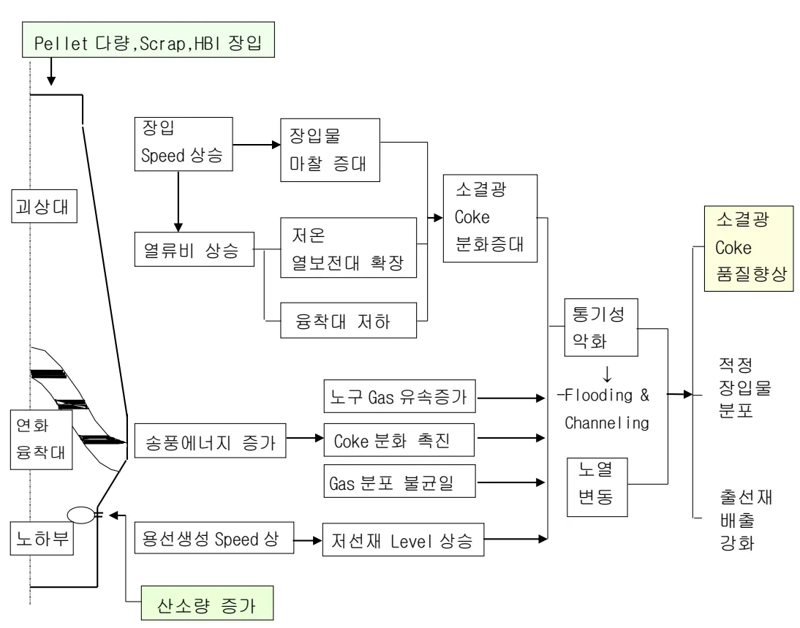

<h2>Page 1</h2>
<h2>1. 적용범위</h2>

조업 및 경영 여건 변화로 증산 조업 필요시 안정적인 고로조업을 수행하기 위한 고로내 현상 변화 및 조업방향에 대해 적용한다.

<h2>2. 목적</h2>

당사 및 외국 고로의 고출선비 조업 실적을 알아보고 고출선비 조업을 안정적으로 수행하기 위한 조업적 기본사상을 이해하는데 목적이 있다.

<h2>3. 중점 관리 항목</h2>

<table><thead><tr><th>품질 영향인자</th><th>공정 영향인자</th></tr></thead><tbody><tr><td>[Si], [S]</td><td>풍압, 노열</td></tr></tbody></table>
<a href="components/TP-030-040-020 고출선비 조업시 기본사상 기준(Rev.10)_0900bf4ba7a2b08c_usr0000bf4b95f9e446_p001_table_01.png">Table snapshot</a>

<h2>4. 조업기준</h2>

<h3>4.1 고출선비 조업 방법</h3>

고출선비 조업을 수행하기 위해서는 단위 시간당 한정된 내용적에서 철광석의 환원을 얼마나 효율적으로 빨리 시키느냐가 주요한 관건이며, 이를 위한 수단으로 일반적으로 단위 시간당 투입 산소원단위를 증가시키는 방법과 연료비를 저하시켜 송풍원단위를 낮추는 방법이 있다.

Flowchart illustrating the method for high-Fe blast furnace operation:

Inputs (Factors) leading to Input 산소 (Input Oxygen):
<ul><li>풍량 ↑ (Air Volume ↑)</li><li>O2 부화 ↑ (O2 Enrichment ↑)</li><li>풍온 ↑ (Air Temperature ↑)</li><li>조습 ↓ (Moisture ↓)</li><li>Slag Vol ↓ (Slag Volume ↓)</li></ul>
Input 산소 ↑ leads to Output: 출선비 Up (Fe Content Up).

Inputs (Factors) leading to 연료비 ↓ (Fuel Consumption ↓):
<ul><li>조습 ↓ (Moisture ↓)</li><li>Slag Vol ↓ (Slag Volume ↓)</li></ul>
연료비 ↓ leads to Output: 송풍원단위 ↓ (Blower Unit ↓).

송풍원단위 ↓ leads to Output: 출선비 Up (Fe Content Up).

Final Step: 뒷 장 계속 (Continue to the next section).

<h2>Page 2</h2>
<h4>4.2 고출선비 조업시 노내현상 변화</h4>

Flowchart illustrating changes in the blast furnace interior during high blast furnace operation (고출선비 조업시 노내현상 변화).

Inputs (Pellet, Scrap, HBI) lead to:
<ul><li>과상대 (Excess charge)</li><li>장입 Speed 상승 (Increased charging speed)</li><li>열류비 상승 (Increased thermal load)</li></ul>
These factors contribute to:
<ul><li>장입물 마찰 증대 (Increased friction of charged material)</li><li>저온 열보전대 확장 (Expansion of low-temperature heat preservation zone)</li><li>용착대 저하 (Decreased slagging zone)</li></ul>
These factors lead to:
<ul><li>소결광 Coke 분화증대 (Increased decomposition of sintered ore Coke)</li><li>통기성 악화 (Worsened permeability)</li><li>노구 Gas 유속증가 (Increased gas velocity in tuyeres)</li><li>Coke 분화 촉진 (Promotion of coke decomposition)</li><li>Gas 분포 불균일 (Uneven gas distribution)</li><li>노열 변동 (Fluctuation of temperature in the furnace)</li></ul>
The above factors result in:
<ul><li>Flooding &amp; Channelling</li><li>적정 장입물 분포 (Optimal distribution of charged material)</li><li>출선재 배출 강화 (Enhanced slag discharge)</li></ul>
The overall impact is summarized as 산소량 증가 (Increased oxygen quantity).

증산 조업시 노하부 Gas Volume 증가에 의한 승풍에너지 증가로 소결광 및 Coke의 분화를 촉진시켜 노심 통액성 악화와 Slag Flooding 현상을 일으킬 수 있으며, 노상부에서는 Gas 유속 증가로 장입물의 유동화 현상이 일어날 수 있다.

또한 장입 Speed 증가에 의하여 승온 및 환원이 불균일한 장입물이 노하부로 강하하기 쉽고 환원불량에 의하여 노열저하, 용착대 부위에서 용해불량, 노상에서 용선재의 흐름 불안정을 초래하기도 하며, 용용물 생성 Speed 증가에 의하여 저선재 Level 이 쉽게 상승하는 문제점이 있어 고출선비 조업시에는 출선에 대한 강화 대책이 필요하다.

소결광의 분화가 이루어지는 저온 열보존대(<math>550</math>~<math>650^{\circ}\mathrm{C}</math>) 구간이 확장되므로 연,원료의 품질개선과 통기성을 개선할 수 있는 장입물 분포제어의 개발이 필요하다. 또한 노정압증대, 미분탄취입에 의한 열류비 하향조정, Slag Volume 하향등의 조치를 취할 수도 있다.

<h2>Page 3</h2>
<h4>4.3 고출선비 조업시 문제점 및 대책</h4>

<table><thead><tr><th>증산 방법</th><th>예상 문제점</th><th>대책</th></tr></thead><tbody><tr><td>○ Input O2 량 증대 - 산소부화 ↑ - 풍 량 ↑</td><td>○ 노내 Gas 량 증가로 Coke 분화 촉진 - 노저 풍액성 악화 - 노저 측벽부 온도 상승</td><td>○ 장입물 분포 개선 - 중심류 강화 (Coke 중심 장입) ○ 노정압 증대 ○ 풍구경 확대로 풍구유속 저하 ○ Coke 풍질개선 (CSR, 입도)</td></tr><tr><td>○ 연료비 저감 (송풍원단위 저감) - 조 습 ↓ - Gas 이용율 ↑ - 노체 방산열 ↓ - Slag Volume ↓</td><td>○ 열류비 상승 (저온 열보존대 증가) - 소결광 분화 촉진→ 노내 통기성 악화 - 생광의 노저 강하→ 노저 풍액성 악화 ○ 노내 용융물 증가 - 연화 융착대 외곡 - 노하부 압손 증가 ○ 노저 측벽부 온도 상승</td><td>○ 미분탄 취입비 증가 ○ 소결광 성상 개선 (RDI 개선, 입도(-10m) 및 강도 보강) ○ Coke 수분↓ 및 강도↑ ○ 용선재 배출강화 - 출선구 Bit 경 확대 ○ 출선구 심도 확보 ○ Slag Volume 저하조업</td></tr></tbody></table>
<a href="components/TP-030-040-020 고출선비 조업시 기본사상 기준(Rev.10)_0900bf4ba7a2b08c_usr0000bf4b95f9e446_p003_table_01.png">Table snapshot</a>

<h4>4.4 고출선비 조업시 주의 사항</h4>

가. 고출선비 조업을 위해서는 연, 원료 풍질의 개선이 필요하나, Coke 가동을 및 소결 생산성 증가로 연, 원료 풍질이 저하할 우려가 있으므로 사전에 연, 원료 수급계획을 수립해야 한다.

나. 고출선비 조업시 원활한 출선은 필수요소이며, 또한 노저 측벽온도가 급격하게 상승할 우려가 있으므로 Mud 재 풍질개선, 출선구 연관리 철저 등 출선구 안정대책이 필요하다.

다. 고출선비 조업시 냉각수의 누수, 연, 원료의 풍질변동 등 외란요인 발생시 노열이 급격히 저하 하므로 설비관리를 철저히 하여야 하며 외란 요인 발생시 신속하게 감풍 및 감광을 실시한다.

<h4>5. 이상판단 및 조치기준 : 해당사항 없음</h4>

‘끝.’

이 하 여 백
