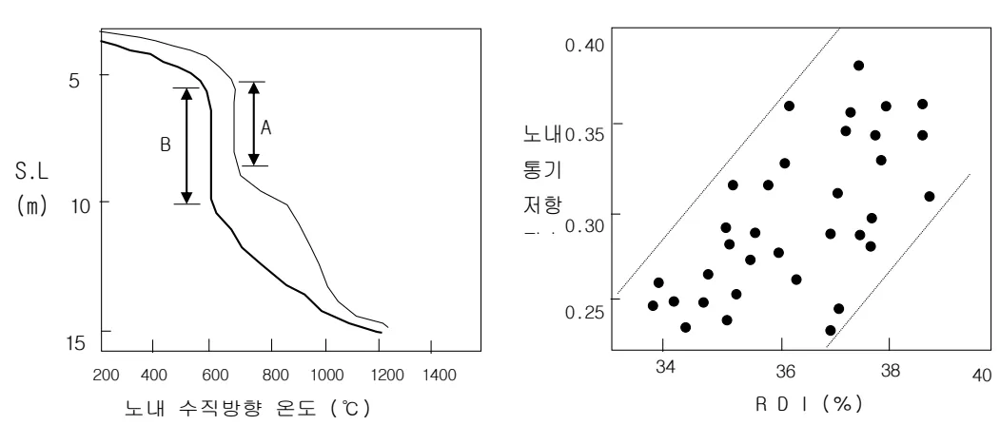
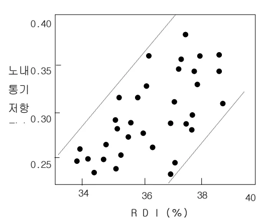

<h2>Page 1</h2>
<h1>1. 적용범위</h1>

고출선비 조업을 안정적으로 수행하기 위한 소결광, Coke 및 PCI용 Coal의 품질관리 기준에 대해 적용한다.

<h2>2. 목적</h2>

고출선비 조업시 송풍에너지 증가 및 저온 열보존대 영역 확대에 따른 연, 원료의 분화가 촉진되므로 이에 대한 대책을 수립하여 증산조업을 안정적으로 수행하는데 목적이 있다.

<h3>3. 중점관리 항목</h3>

<table><thead><tr><th>품질영향 인자</th><th>공정영향 인자</th></tr></thead><tbody><tr><td>[Si], [S]</td><td>풍압, 노열</td></tr></tbody></table>
<a href="components/TP-030-040-030 고출선비 조업시 연,원료 품질관리 기준(Rev.13)_0900bf4ba7a37e2d_usr0000bf4b95f9e446_p001_table_01.png">Table snapshot</a>

<h2>4. 조업기준</h2>

<h3>4.1 연, 원료 품질강화 조건</h3>

고출선비 조업시에는 노내에서 열류비가 상승하여 노정온도가 저하하고 그 결과로 저온 열보존대 구역 (Thermal Reserve Zone : <math>600^{\circ}\text{C}</math>)의 길이가 아래 그림과 같이 증가한다. 노내에서 저온 열보존대의 길이가 증가시에는 장입된 소결광이 이 구간을 통과할 때 쉽게 분화되어 Shaft 부위에서의 통기성을 저해한다. 따라서 고출선비 조업시에는 소결광 RDI를 대폭 개선하여 소결광이 이 구간을 통과시에도 환원 분화에 의한 통기성 저해를 최소화 해주는 것이 필요하다.

A : 출선비 : <math>2.27 \text{ T/D} \cdot \text{m}^3</math> B : 출선비 : <math>2.84 \text{ T/D} \cdot \text{m}^3</math>

연료비 : <math>500 \text{ Kg/T-P}</math> 연료비 : <math>492 \text{ Kg/T-P}</math>

열류비 : <math>0.76</math> 열류비 : <math>0.81</math>

노정온도 : <math>188^{\circ}\text{C}</math> 노정온도 : <math>172^{\circ}\text{C}</math>

[그림 1.] 출선비와 노내 수직방향 온도

그림 2. RDI와 통기성

<h2>Page 2</h2>
<h2>4.2 소결광 품질개선 목표</h2>

고출선비 조업시에는 장입 Speed 증가 및 열류비 상승에 의한 미환원 철광석의 노하부 강화를 최소화하기 위하여 기본적으로 소결광 저 Slag volume 및 고 피환원성이 요구 된다. 또한 저온 열보존대 영역의 확대에 따른 소결광의 환원분화에 대처하기 위하여 RDI를 개선하고, 성분관리를 강화(<math>Al_2O_3</math> ↓, <math>MgO</math> ↑, <math>FeO</math> ↓) 해 주어야 하며, 통기성 저해 요인을 최소화 하기 위하여 강도향상 및 분불저하를 위한 Screen 효율을 향상시켜 분장입을 최소화 해야한다. <a href="#">필요시, B/C 상에서 <math>CaCl_2</math> 를 살포하여 RDI를 개선시킨다.</a> Pellet 는 기본적으로 소결광 대비 T-Fe 가 높으며 사용비 1% 증대시에 출선비 0.1% 증가 또는 연료비 0.5~1Kg/T-P 저하 효과가 있으며 소결광 대비 Slag Volume 저하에 의한 출선비 증대 효과가 있으므로 고출선비 조업시 유용한 수단으로 사용하고 있다.

<h2>4.3 Coke 및 PCI Coal 품질개선 목표</h2>

고출선비 조업시에는 노상부에 장입된 Coke 는 송풍에너지 증가 및 강한 Speed 증가에 의하여 기본적으로 분화되기 쉽고 노심 부위에 촉적된 분 Coke 는 Slag 유동성을 저하시켜 노하부 통액성에 악영향을 미치므로 입도 및 냉간, 열간 강도의 증가가 요구된다. 또한 Coke Ash 는 0.1% 저하시 출선비 0.2% 증가 효과가 있으므로 최대한 낮추어서 연료비 저감을 도모한다.

PCI Coal 은 연료비와 Gas Volume 의 감소를 위하여 가능한 고발열량, 저휘발분의 반무연탄을 사용하는 것이 유리하나, 저휘발분의 반무연탄을 전량 사용시 연소성 악화에 의하여 노심에 미연소 Coal 의 촉적으로 노화학화의 위험이 있으므로 연소성을 고려하여 고 휘발분 Coal 을 일정 비율로 혼합하여 사용해야 하며, 풍구전 반응에 의한 <math>SiO</math> Gas 발생 최소화를 위하여 저 <math>SiO_2</math> Coal 을 사용한다.

<h2>4.4 고로 Coke 및 소결광 Bin Screen 효율향상</h2>

고출선비 조업시 고로 소결광 및 Coke 사용량 증가로 인하여 후공정에서는 수급 Balance 를 위해 생산량을 증가시킬 것이다. 연원료 생산량 증대시 품질이 저하될 가능성 이 있으며, 고출선조업의 노황에 통기성저하등 나쁜 영향을 줄 수 있다. 따라서 고로 연원료 Bin 하부 Screen 효율을 최대한 증대시켜 고로내 분장입량을 최소화해야한다. (Bin Gate 최소화) 또한 Bin Level 관리를 철저히 하여 Bin 내부 부착광이 노내로 장입되지 않도록 한다.

<h2>5. 이상판단 및 조치기준 : 해당사항 없음</h2>

‘끝.’

이 하 여 백
