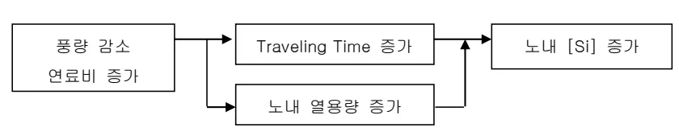
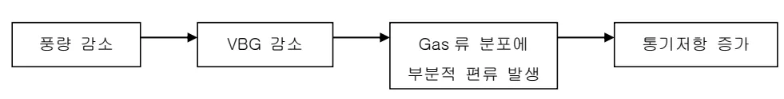
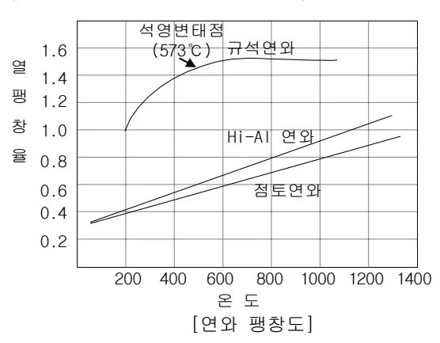
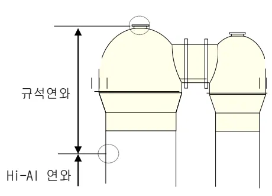

<h2>Page 1</h2>
<h1>1. 적용범위</h1>

조업 및 경영 여건 변화로 감산 조업 필요시 안정적으로 감산조업을 수행하기 위한 감산조업 방법, 감산조업시 문제점 및 대책에 대해 적용한다.

<h2>2. 목 적</h2>

고로 감산조업시 조업방안 수립을 위한 기술적인 원리 및 실적을 정립하여 감산조업시에도 장기적인 안정조업 수행을 목표로 한다.

<h2>3. 중점 관리 항목</h2>

<table><tbody><tr><td>품질 영향인자</td><td>공정 영향인자</td></tr><tr><td>[Si], [S]</td><td>풍압, 노열,</td></tr></tbody></table>
<a href="components/TP-030-040-060 감산조업 사상과 감산 기준(Rev.9)_0900bf4ba7a2b094_usr0000bf4b95f9e446_p001_table_01.png">Table snapshot</a>

<h2>4. 조업기준</h2>

<h3>4.1 감산조업 수준 결정</h3>

가. 내용적이 3500 <math>\text{m}^3</math> 이하인 고로의 감산조업 Level 은 일반적으로 출선비 1.55 <math>\text{T/D/m}^3</math> 수준 이상을 유지해야 하나, 장기 노화 불안정을 예방하기 위하여 출선비 1.70 <math>\text{T/D/m}^3</math> 이상으로 실시 (대폭적인 감산조업시 노심 Coke 불활성화,노벽 부착물 형성등에 의한 장기노화 불안정 초래) 나. 내용적이 3500 <math>\text{m}^3</math> 이상인 고로는 송풍 에너지 저하에 의한 노심부 불활성화 영향이 소형고로에 비해 크므로 출선비 1.70 <math>\text{T/D/m}^3</math> 이상을 유지해야 하나, 장기 노화 불안정을 예방하기 위하여 출선비 1.80 <math>\text{T/D/m}^3</math> 이상으로 실시 다. 고로 내용적 크기에 따른 고로 가동율 관리의 한계치는 일반적으로 3500 <math>\text{m}^3</math> 이하 고로의 경우 94% 수준을 유지하고, 3500 <math>\text{m}^3</math> 이상의 대형고로는 95% 이상으로 유지 라. 대폭적인 감산여건 발생시에는 고로별로 번갈아 휴풍을 실시하고 나머지 고로는 최저 출선비 유지 마. 휴풍에 의한 감산의 한계

연료비의 상승, 휴풍후의 용선온도의 저하, 용선 성분변동 등을 감안하여 휴풍시간 및 빈도를 결정한다. 대체적으로 고로 휴풍시 최대 8~9 시간/회/5 일, 혹은 12 시간/회/1 주간이 최적이며, 뱅킹시는 회당 최저 5 일에서 100 일 이상을 고려한다.

<h2>Page 2</h2>

그림 1. 출선량과 내용적과의 관계

뒷 장 계속

<h2>Page 3</h2>
<h2>4.2 감산조업시 유의사항</h2>

<table><thead><tr><th>구분</th><th>유의사항</th><th>대책</th></tr></thead><tbody><tr><td>노상부</td><td><ul><li>감광에 의한 O.B 및 C.B 변화로 장입물 분포 변화</li><li>연, 원료 풍질저하</li><li>주변류 발달에 의한 노체 열부하 증가</li><li>장입물 강하 불균일</li><li>노내 부착물 생성</li></ul></td><td><ul><li>적정 장입물 분포제어 Pattern 정립</li><li>연, 원료 풍질관리 기준 준수</li><li>중심류 강화형 분포제어</li><li>풍구별 풍량 편차 최소화</li><li>장입물 입도 강화로 노내분장입 최소화 냉각수량조정, 일시적 감광조업으로 노내 Cleaning 조업 실시</li></ul></td></tr><tr><td>노하부</td><td><ul><li>풍구선 유속 및 송풍에너지 저하</li><li>노내 Gas 유속 저하</li><li>용해능력 부족에 의한 연화 용착대 비대</li><li>휴풍후 조업도 상승 기간 중 벽락등에 의한 풍구, 냉각반 파손</li><li>Tf 상승</li></ul></td><td><ul><li>풍구경 축소 및 한계 VBG 관리기준 설정, 운영</li><li>노정압 조정</li><li>열간 용해 특성이 우수한 소결광 사용비 증대, 고 C/S 조업</li><li>풍구 Hardfacing 면적 증대 및 냉각수 급, 배수 상대 정밀관리</li><li>노하부 온도 밀착관리</li><li>PCI 등 최적 송풍조건 조정</li></ul></td></tr><tr><td>노저부</td><td><ul><li>출선량 감소에 의한 노저부 투입열량 감소로 노저 용기 및 노열변동 대</li><li>노심 Coke 불활성화에 의한 출선 Tap 수 증가</li><li>Slag 배출 불량</li><li>노내 Traveling Time 증가에 의한 용선종 [Si] 과다 상승 및 변동 대</li></ul></td><td><ul><li>노심 Coke 건전성 확보를 위한 Coke 중심 장입량 증대</li><li>용선온도 상향 관리</li><li>Lap 출선 실시등 출선 강화</li><li>출선구 심도 확보 및 Bit 경 증대</li><li>노열 상향 관리 및 MgO 증대</li><li>출선 지연 최소화</li><li>Tf 과다 상승 방지 (조습 증가 및 풍온 저하)</li></ul></td></tr></tbody></table>
<a href="components/TP-030-040-060 감산조업 사상과 감산 기준(Rev.9)_0900bf4ba7a2b094_usr0000bf4b95f9e446_p003_table_01.png">Table snapshot</a>

<h2>4.3 감산조업시 문제점 원인 및 대책</h2>

<h3>가. 풍구유속 저하</h3>

Flowchart illustrating the cause and solution for raceway velocity reduction:

풍량 감소 → Gas류 주변류화 및 풍구유속 저하 → Race Way 축소 → 풍구선 운동 Energy 저하

Bosh 및 Shaft 부 온도 상승 → Gas 이용을 저하 노체열부하 증가

●대책 : 풍구경 축소, 조정에 의한 풍구유속 저하 방지

<h2>Page 4</h2>

나. 노저온도 저하

Flowchart for Low Temperature Decrease:

VBG 감소 → Gas 류 주변류화 및 풍구유속 저하

Gas 류 주변류화 및 풍구유속 저하 → 노저 중심부 불활성 확대

Gas 류 주변류화 및 풍구유속 저하 → 주상간 용선재의 풍액성 약화

노저 중심부 불활성 확대 → 노저온도 저하

주상간 용선재의 풍액성 약화 → 노저온도 저하

● 대책 :

○ 조업측면 :
<ul><li>Coke 중심 장입량 증대</li><li>풍구경 축소 조정에 의한 풍구유속 저하 방지</li><li>노저 Bottom 냉각수 유량 하향 조정</li></ul>
○ 작업측면 :
<ul><li>초기 출선속도 증가 → Bit 경 확대</li><li>Lap 출선강화 → 출선 횃수 증대</li><li>안전 출선구 심도의 확보</li><li>Mud 재 사용 조정 : 공학대 용이한 Mud 사용</li></ul>

다. 노벽온도의 상승

Flowchart for Nozzle Wall Temperature Increase:

풍량 감소 → Gas 류 주변류화 및 풍구유속 저하

Gas 류 주변류화 및 풍구유속 저하 → 국부적인 열류비 저하 및 노벽 열부하 증대

국부적인 열류비 저하 및 노벽 열부하 증대 → Bosh 및 Shaft 부 온도 상승

→ 철피 적열,균열 발생 → 냉각반 파손

● 대책 : - 소결광 사용량 증대

- 중심류 활성화형 장입물 분포제어

(*주의사항 : 과도한 중심류 조업시 벽부 O/C 증가로 인한 용착대 근부 비대로 노열 변동 및 풍구 파손 등의 위험이 있음)

- 풍구 뚫

(*주의사항 : 노벽 열부하 저하 효과는 있으나, 노내 Gas 흐름의 불균일과 특히 원주 방향 Unbalance 를 조장할 위험이 있음)

뒷 장 계 속

<h2>Page 5</h2>

라. 용선중 [Si] 변동

Flowchart showing factors affecting [Si] increase:

풍량 감소, 연료비 증가, Traveling Time 증가, 노내 열용량 증가, and 노내 [Si] 증가 are shown, with arrows indicating relationships.

Scatter plot showing the relationship between <math>Si(\%)</math> (Y-axis, 0 to 0.9) and <math>P_{max}(T/D. m^2)</math> (X-axis, 1 to 2.6). The regression equation is <math>y = -0.0602x + 0.5241</math>.

( * 출선비 <math>0.1 T/D/m^2</math> 저하시 [Si] 은 0.03% 상승함 )

●대책 : - 출선재 배출 강화와 출선공 확대 개공 필요 - 저 <math>SiO_2</math> PCI Coal 사용 - 조습 증가 등으로 <math>T_f</math> 상승 방지

마. 통기성 악화

Flowchart showing factors affecting reduced permeability:

풍량 감소, VBG 감소, Gas류 분포에 부분적 편류 발생, and 통기저항 증가 are shown, with arrows indicating relationships.

●대책 :
<ul><li>○ Coke 품질 향상</li><li>- DI 및 입도의 향상</li><li>- 고로 Bin 하부 Screen 관리 강화로 입도 저하 방지</li></ul>

뒷 장 계속

<h2>Page 6</h2>

ㅇ 소결광 품질 향상

<ul><li>통기성 개선 및 노벽 열부하 저감을 위해 환원분화율(RDI) 40% 이하로 관리</li><li>소림과 대림의 임도편차 감소</li></ul>

ㅇ 소결광 사용비의 증대

<ul><li>소결광 사용 증대로 [Si] 변동 최소화, 통기저항 및 노벽 열부하 개선 (*소결광은 우수한 하중연화 특성에 의해 노하부에서 용락이 양호 )</li><li>연화 용착대 및 통기성 개선으로 낮은 VBG로도 비교적 균일한 원주 Balance 유지</li></ul>

바. 설비에 미치는 영향

(1). 풍온저하의 한계

열풍로 규석 연화의 풍온 저하에 따른 열적 총격 방지를 위해 Dome 온도를 <math>950^{\circ}\mathrm{C}</math> 이상 유지 (풍온 최저 <math>800^{\circ}\mathrm{C}</math>까지 조업 가능)

[연화 팽창도]

(2). 최저 노정압 유지

노정압 발전기 가동을 위해 2고로는 노정압 <math>1.0 \mathrm{Kg}/\mathrm{cm}^2</math> (TRP 전단 <math>0.7 \mathrm{Kg}/\mathrm{cm}^2</math>) 이상, 3,4고로는 <math>1.2 \mathrm{Kg}/\mathrm{cm}^2</math> (TRP 전단 <math>0.9 \mathrm{Kg}/\mathrm{cm}^2</math>) 이상 유지

그 이하에서는 노정압 균배압시 Motoring (Reverse Powering) 현상 발생 위험이 있음.

(3). 노정 온도 상승에 따른 광석 수금물의 손상

(4). 풍구 부상하는 경향 증가

<h2>Page 7</h2>

5. 이상판단 및 조치기준 : 해당사항 없음.

<h2>6. 기술이론</h2>

<h3>6.1 감산조업 방법</h3>

<table><thead><tr><th>구분</th><th>조업 Action</th><th>문제점</th><th>비고</th></tr></thead><tbody><tr><td>가동율 저하형 (1안)</td><td>휴풍 횟수 증대 (조정휴풍 실시) 휴풍시간 증대</td><td>노황 불안정에 의한 풍구대파, 냉각반 파손 발생으로 노내침수 가능성 용선 품질 변동 대 연료비 상승</td><td>후공정 돌발 사고시 단기적 감산조업시 소폭적인 감산조업시</td></tr><tr><td>연료비 상승형 (2안)</td><td>VBG 일정 유지 -O2 부화량 조정 -N2 부화조업 추진 -감광 및 연료비 상승</td><td>에너지 손실량 대 - Coke, N2 등 - BFG 열량 상승</td><td>장기간 감산조업 10~20% 감산조업</td></tr><tr><td>감풍형 (3안)</td><td>VBG량을 한계 Level 까지 저하 -풍량 및 O2 부화량 조정</td><td>VBG 저하에 따른 노내 Gas류 분포 변화 노저부 투입열량 감소에 의한 노저부 융기 및 노벽부착물 생성 노황불안정 (Slip, Hanging 빈발) 냉각반 파손 및 철피균열 용선 품질 변동</td><td>중,장기간 감산조업 대폭적인 감산 필요시</td></tr></tbody></table>
<a href="components/TP-030-040-060 감산조업 사상과 감산 기준(Rev.9)_0900bf4ba7a2b094_usr0000bf4b95f9e446_p007_table_01.png">Table snapshot</a>

뒷장 계속

<h2>Page 8</h2>
<h2>6.2 감산조업시 조업실적</h2>

가. 내용적 3500 m3 이상급 고로의 감산조업 실적(13년수집)

<table><thead><tr><th rowspan="2">구분</th><th colspan="2">倉敷3BF</th><th colspan="2">倉敷4BF</th><th colspan="2">名古室3BF</th><th colspan="2">大分1BF</th></tr><tr><th>'06</th><th>'07</th><th>'06</th><th>'07</th><th>'06</th><th>'07</th><th>'06</th><th>'07</th></tr></thead><tbody><tr><td>내용적 (m3)</td><td colspan="2">4359</td><td colspan="2">5005</td><td colspan="2">4300</td><td colspan="2">4884</td></tr><tr><td>출선비 (T/D·m3)</td><td>1.91</td><td>1.92</td><td>2.14</td><td>2.16</td><td>2.18</td><td>2.20</td><td>2.06</td><td>2.03</td></tr><tr><td>Coke Rate (kg/T-P)</td><td>386.0</td><td>391.1</td><td>363.0</td><td>368.4</td><td>344.0</td><td>338.8</td><td>386.0</td><td>393.5</td></tr><tr><td>PCR (Oil) (kg/T-P)</td><td>110.3</td><td>107.6</td><td>118.3</td><td>116.7</td><td>140.3</td><td>138.0</td><td>106.6</td><td>91.0</td></tr><tr><td>연료비 (kg/T-P)</td><td>496.5</td><td>498.7</td><td>481.7</td><td>485.1</td><td>484.3</td><td>476.7</td><td>492.6</td><td>484.5</td></tr><tr><td rowspan="4">송풍</td><td>풍량 (N m3/T-P)</td><td>6418</td><td>6467</td><td>7529</td><td>7677</td><td>6335</td><td>6331</td><td>7177</td><td>7192</td></tr><tr><td>풍온 (°C)</td><td>1115</td><td>1117</td><td>1149</td><td>1131</td><td>1192</td><td>1192</td><td>1171</td><td>1180</td></tr><tr><td>조습 (g/N m3)</td><td>33.0</td><td>28.9</td><td>34.0</td><td>29.9</td><td>16.0</td><td>16.7</td><td>41.0</td><td>38.2</td></tr><tr><td>O2 부화 (%)</td><td>2.20</td><td>2.56</td><td>2.50</td><td>2.77</td><td>3.70</td><td>3.68</td><td>2.50</td><td>1.80</td></tr><tr><td rowspan="2">노정</td><td>압력 (kg/cm2)</td><td>2.652</td><td>2.649</td><td>2.751</td><td>2.784</td><td>2.258</td><td>2.261</td><td>2.209</td><td>2.123</td></tr><tr><td>온도 (°C)</td><td>138</td><td>138</td><td>148</td><td>143</td><td>144</td><td>143</td><td>131</td><td>124</td></tr><tr><td rowspan="3">원료</td><td>Sinter Ratio (%)</td><td>73.2</td><td>73.7</td><td>75.2</td><td>74.3</td><td>74.6</td><td>74.6</td><td>83.2</td><td>82.3</td></tr><tr><td>Pellet Ratio (%)</td><td>3.1</td><td>3.1</td><td>1.2</td><td>1.9</td><td>6.6</td><td>9.8</td><td>1.8</td><td>0.9</td></tr><tr><td>광석비 (kg/T-P)</td><td>1615</td><td>1613</td><td>1634</td><td>1624</td><td>1642</td><td>1617</td><td>1614</td><td>1608</td></tr><tr><td rowspan="3">용선</td><td>용선온도 (°C)</td><td>1501</td><td>1506</td><td>1507</td><td>1507</td><td>1539</td><td>1543</td><td>1542</td><td>1539</td></tr><tr><td>[Si] (%)</td><td>0.34</td><td>0.38</td><td>0.29</td><td>0.30</td><td>0.48</td><td>0.46</td><td>0.59</td><td>0.51</td></tr><tr><td>Tap 수 (회/일)</td><td>6.6</td><td>6.6</td><td>6.9</td><td>6.6</td><td>8.4</td><td>8.8</td><td>9.8</td><td>10.6</td></tr><tr><td rowspan="3">슬래그</td><td>Slag V (kg/T-P)</td><td>305.0</td><td>308.3</td><td>305.0</td><td>307.7</td><td>293.7</td><td>285.4</td><td>295.2</td><td>289.9</td></tr><tr><td>C/S</td><td>1.27</td><td>1.27</td><td>1.28</td><td>1.28</td><td>1.24</td><td>1.19</td><td>1.22</td><td>1.22</td></tr><tr><td>Al2O3 (%)</td><td>14.96</td><td>14.80</td><td>14.76</td><td>14.63</td><td>14.40</td><td>13.93</td><td>14.98</td><td>14.90</td></tr><tr><td></td><td>이론연소온도(Tf:°C)</td><td>1960</td><td>-</td><td>-</td><td>-</td><td>-</td><td>-</td><td>-</td><td>-</td></tr><tr><td></td><td>풍구선 유속 (m/s)</td><td>219</td><td>182</td><td>183</td><td>187</td><td>187</td><td>255</td><td>250</td><td>256</td></tr><tr><td></td><td>Bosh Gas량(N m3/min)</td><td>8993</td><td>-</td><td>-</td><td>-</td><td>-</td><td>-</td><td>-</td><td>-</td></tr><tr><td></td><td>Gas 이용율 (%)</td><td>46.8</td><td>47.2</td><td>46.1</td><td>48.5</td><td>47.7</td><td>50.9</td><td>50.7</td><td>49.0</td></tr><tr><td></td><td>고로 가동율 (%)</td><td>98.8</td><td>-</td><td>-</td><td>-</td><td>-</td><td>-</td><td>-</td><td>-</td></tr><tr><td></td><td>특기사항</td><td>o 고조습조업</td><td></td><td>o 고효율 조업</td><td></td><td>o 고효율,고 PR 조업</td><td></td><td>o 고조습 조업</td><td></td></tr><tr><td></td><td></td><td></td><td></td><td>o 고조습 조업</td><td></td><td></td><td>o 고 SR 조업</td><td></td></tr></tbody></table>
<a href="components/TP-030-040-060 감산조업 사상과 감산 기준(Rev.9)_0900bf4ba7a2b094_usr0000bf4b95f9e446_p008_table_01.png">Table snapshot</a>

‘끝.’
