<h2>Page 1</h2>
<h2>1. 적용범위</h2>

용선중 [S]성분의 관리기준과 목적 및 [S]상승으로 인한 공정간 문제점과, 노내에서의 S 거동에 대하여 적용한다.

<h2>2. 목적</h2>

용선중 [S]는 재품후 적열취성을 일으키므로 재강과정에서 반드시 제거해야 하며, 용선중의 [S]가 높게되면 재강에서의 탈황비용이 증가하고 탈황을 위한 공정지연 등 재강조업 효율을 저하시키므로 고로공정에서부터 성분규격을 만족시키는 것이 필요하다.

<h2>3. 중점관리항목</h2>

<table><thead><tr><th>품질영향인자</th><th>공정영향인자</th></tr></thead><tbody><tr><td>[S]</td><td>풍압, 노열,</td></tr></tbody></table>
<a href="components/TP-030-050-040 [S] 제어기술 기준(Rev.9)_0900bf4ba7a2b66b_usr0000bf4b95f9e446_p001_table_01.png">Table snapshot</a>

<h2>4. 조업기준</h2>

<h3>4.1 용선[S] 성분기준</h3>

<table><thead><tr><th>구분</th><th>성분규격 기준</th><th>비고</th></tr></thead><tbody><tr><td>[S]</td><td><math>\le 0.040</math></td><td>내부 관리 기준 기술기준(고로공정) - 용선 및 외 판주물선 요구품질 기준(TP- 030-050-020)에 따른다.</td></tr></tbody></table>
<a href="components/TP-030-050-040 [S] 제어기술 기준(Rev.9)_0900bf4ba7a2b66b_usr0000bf4b95f9e446_p001_table_02.png">Table snapshot</a>

<h2>5. 이상판단 및 조치기준</h2>

가. 용선[S]이 이상판단기준을 벗어났을시는 « 기술기준(고로공정) - 용선 및 외판주물선 요구품질 기준 (TP-030-050-020) »의 용선품질 이상시 조치기준에 따른다.

뒷 장 계속

<h2>Page 2</h2>
<h2>6. 기술이론</h2>

고로내에서의 S의 이행은 Si과 같은 형태로 노저에서의 Slag-Metal 반응을 중심으로 이루어졌다. 그러나 실조업 고로 및 고로 해체 조사를 통해 S의 거동을 다음과 같이 두 개로 분류하게 되었다.

<ol><li>Slag-Metal 반응에 의한 S의 거동</li><li>Gas-metal 반응에 의한 S의 거동.</li></ol>

<h3>6.1 COKE 중 S의 GAS 상으로의 이행</h3>

<h4>6.1.1 탈 GAS (COKE의 탈류현상)</h4>

탈류는 온도에 의존하고 Gas 분위기에는 의존하지 않는다고 생각할 수 있다. 탈류를 시작하는 온도는 약 600℃ 이고, 코크스중 S의 Gas 상으로의 이행은 전체의 약 5~20% 정도 이루어진다.

코크스중 S의 탈류과정을 보면 Shaft 중부에서 시작하고 풍구 주위에서 급격히 감소한다.

유형 별로 보면 유산염(硫酸鹽) S는 노내에서 거의 탈류되지 않고, 유화물(硫化物) S는 Shaft 중간까지 서서히 탈류되고 그 뒤에는 거의 바뀌지 않고, 유기질(硫機質) S는 풍구 Level까지는 거의 탈류되지 않다가 풍구 Level에서 급격히 탈류 된다.

(P.S) (O.S)

S.S: 유산염 S P.S: 유화물 S O.S: 유기질 S

Total S (%) 유형별 S

&lt;그림 1. 노내 S의 분포&gt;

뒷장 계속

<h2>Page 3</h2>

그림 2는 코크스의 탈류와 노내온도의 관계를 보여준다. 이 경우에도 <math>600^{\circ}\text{C}</math> 근처에서 탈류가 시작되고 온도상승과 함께 탈류가 진행된다. <math>1200^{\circ}\text{C}</math>까지의 탈류는 주로 유화물, <math>1600^{\circ}\text{C}</math>근처의 탈류는 유기질 S 가 관여 하고 있다고 생각된다.

&lt;그림 2. 노내온도와 탈류와의 관계&gt;

<h4>6.1.2 화학반응</h4>

Gas 의 화학 반응에 의해서 코크스의 S 가 Gas 상으로 이행하는 현상이다. 코크스가 풍구전단에서 연소할 때 발생하는 현상이며, Oil 또는 Coal 중의 S 도 화학반응에 의해 Gas 화 한다.

<h4>6.1.3 GAS 화 하는 S 화합물의 형태</h4>

Gas 화 한 S 는 여러가지 Gas 분위기에서 여러종류의 화합물로 존재한다. 고로내의 Gas 중 S 화합물은 <math>\text{H}_2\text{S}</math>, <math>\text{SO}</math>, <math>\text{SO}_2</math>, <math>\text{SO}_3</math>, <math>\text{COS}</math>, <math>\text{S}_2</math>, <math>\text{CS}_2</math> 이며, <math>\text{H}_2</math>, <math>\text{CO}</math>, <math>\text{CO}_2</math> 와 평형을 이룬다.

<math display="block">\text{H}_2 + \frac{1}{2}\text{S}_2 = \text{H}_2\text{S}</math>

<math display="block">2\text{CO} + \text{S}_2 = \text{CS}_2 + \text{CO}_2</math>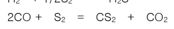

<math display="block">\text{CO} + \frac{1}{2}\text{S}_2 = \text{COS}</math>

<math display="block">2\text{CO}_2 + \frac{1}{2}\text{S}_2 = \text{SO}_2 + 2\text{CO}</math>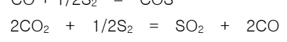

<math display="block">3\text{CO}_2 + \frac{1}{2}\text{S}_2 = 3\text{CO} + \text{SO}_3</math>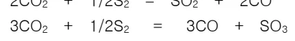

<math display="block">\text{CO}_2 + \frac{1}{2}\text{S}_2 = \text{SO} + \text{CO}</math>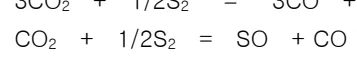

&lt;그림 3. 온도에 따른 Gas 상의 분압분포&gt;

이때 총압력 대비 각각의 Gas 의 평형지수에서 각각의 Gas 의 분압 및 온도와 유화물비의 관계를 얻을수있다.

그림 3 에서 나타난것과 같이 고온의 풍구근처에서는 <math>\text{H}_2\text{S}</math> 와 <math>\text{CS}_2</math> 가 많고 풍구에서 떨어진 용착대 부근에서는 <math>\text{CS}_2</math> 가 감소한다

<ol><li>고로에서의 S 공급원의 대부분은 코크스, 미분탄이다.</li><li>S 의 Gas 상으로의 이행은 대부분 코크스, 미분탄의 풍구선단에서의 연소에 의한다.</li><li>장입물로의 가류는 과상대, 용착대, 적하대 어디에서든지 일어나지만 용착대에서 현저히 일어난다.</li></ol>

<h2>Page 4</h2>
<h2>6.2 GAS 에 의한 탈류반응 MECHANISM</h2>

<h3>Gas-Metal 반응에 의한 탈류반응 4 단계</h3>

<ol><li>용선내의 S의 용선표면으로의 확산</li><li>용선표면에서의 S Gas의 생성</li><li>흡착 S Gas의 탈착</li><li>용선표면에서 생성한 S Gas의 가스상 내로의 이동.</li></ol>

<h3>CO, CO2, H2 에의한 탈류반응</h3>

<math display="block">\text{CO} + [\text{S}] = \text{COS}</math>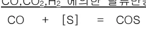

<math display="block">2\text{CO} + 2[\text{S}] = \text{CS}_2 + \text{CO}_2</math>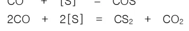

<math display="block">\text{CO}_2 + [\text{S}] = \text{SO} + \text{CO}</math>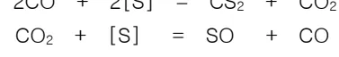

<math display="block">\text{H}_2 + [\text{S}] = \text{H}_2\text{S}</math>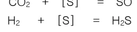

<h3>알칼리에의한 탈류반응</h3>

<math display="block">\text{Ca} + [\text{S}] = \text{CaS}</math>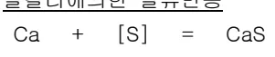

<math display="block">\text{Mg} + [\text{S}] = \text{MgS}</math>

<math display="block">2\text{K} + [\text{S}] = \text{K}_2\text{S}</math>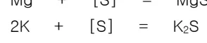

<math display="block">2\text{Na} + [\text{S}] = \text{Na}_2\text{S}</math>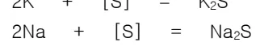

<math display="block">2[\text{S}] = \text{S}_2</math>

<math display="block">\text{C} + 2[\text{S}] = \text{CS}_2</math>

&lt;그림 4. Mg Gas 에의한 탈류반응&gt;

<h2>6.3 SLAG-METAL 반응에 의한 [S]의 이행</h2>

<h3>6.3.1 탈류반응 MECHANISM</h3>

<math display="block">[\text{MS}] \rightarrow (\text{MS})</math>

<math display="block">(\text{MS}) + (\text{NO}) \rightarrow (\text{MO}) + (\text{NS})</math>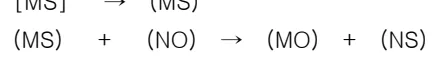

<math display="block">(\text{MO}) + [\text{R}] \rightarrow [\text{M}] + (\text{RO})</math>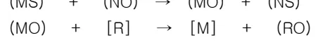

<math display="block">\text{M} = \text{Fe, Mn} \quad \text{N} = \text{Ca, Mg} \quad \text{R} = \text{C, Si, Mn, Al}</math>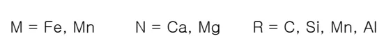

최근에 Slag 중의 S는 이온구조로서 존재하고 있다고 생각한다.

뒷 장 계속

<h2>Page 5</h2>

&lt;1 단계&gt;

탈류초기에는 평형에서 차이가 큰 S가 Fe 또는 Mn과 동시에 Slag에 이동하지만 탄소포화용선과의 평형식보다 높게된 Slag 중의 <math>Fe^{2+}</math>는 <math>O^{2-}</math>와 함께 용선으로 돌아온다.

<math display="block">[S] + 2e^- \rightarrow S^{2-}</math>

<math display="block">Fe \rightarrow Fe^{2+} + 2e^-</math>

<math display="block">Fe^{2+} + 2e^- \rightarrow [Fe]</math>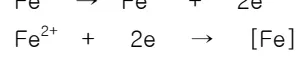

<math display="block">O^{2-} \rightarrow [O] + 2e^-</math>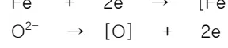

&lt;1 단계&gt;

이시기에는 Slag 중의 Fe 함량이 높다.

&lt;2 단계&gt;

탈류의 진행이 완만하게 된 Slag 중의 Fe 함량은 저하된다. 용선중의 Mn, Si 등의 탈산원소가 함유되면 계면 근접에서 탈산반응이 일어나고 용선으로 이동한 [O]는 제거된다.

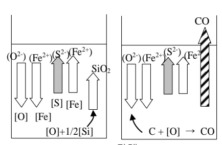

&lt;2 단계&gt;

&lt;3 단계&gt;

반응이 늦지만 탈산력이 강한 [C]에 의한 탈류가 지배적인 시기이다. Slag의 탄소포텐셜은 저하하고, <math>SiO_2</math>의 환원이 시작된다. 용선중의 Si 농도 상승과 함께 천천히 탈류가 진행된다. Si의 환원평형이 성립될 때 S의 분배반응(Slag-Metal 반응)도 완료된다.

&lt;3 단계&gt;

<h3>6.3.2 탈류반응에 미치는 SLAG 염기도 및 점성의 영향</h3>

Slag-Metal 간의 탈류반응은 Slag의 유동성, 염기도가 크게 기여한다. 그림 5는 염기도와 S의 분배율 관계를 나타낸다. <math>1450\sim1500^\circ\text{C}</math>에서는 <math>C/S 1.50</math>까지 탈류율(분배율)이 상승하지만, 그 이상 염기도가 상승하면 거꾸로 탈류율이 저하한다. 또 용선온도가 높게되면 탈류율이 좋아진다. 저염기도에서는 <math>1400\sim1500^\circ\text{C}</math>의 온도차에 의한 탈류율의 차는 적지만 <math>C/S 1.5</math>까지 높게 끌어 데라 탈류율의 차가 커지게 된다.

<h2>Page 6</h2>

즉 ① 1400℃의 Slag 에서 C/S 1.25 1450℃의 Slag 에서 C/S 1.45 1500℃의 Slag 에서 C/S 1.52 이상이 되면 Slag 의 점성 이 극도로 악화되어 탈류율이 저하한다. ② 동일한 영기도에서도 노내온도가 높을 때 탈류율은 높다. (그림 6) ③ 고염기도경우 온도차에 의한 점성의 저하율이 높기

&lt;그림 5. C/S 와 (S)/[S]의 관계&gt;

염기도의 인자로서 그림 7 은 복합염기도(<math>C+M/S+A</math>)와 <math>(S)/[S]</math>의 관계를 보여주면 이는 그림 5 와 같이 영기도 상승에 따라 탈류율도 상승하고 있다.

&lt;그림 7. 복합염기도와 (S)/[S]와의 관계&gt;

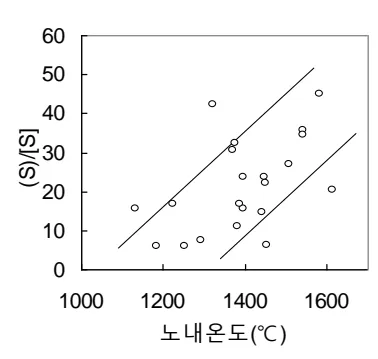

&lt;그림 6. 노내온도와 탈류반응&gt;

뒷 장 계속

<h2>Page 7</h2>

Slag 중의 (MgO)가 점성에 미치는 영향에 관해서는 일반적으로 (MgO)는 Slag의 점성을 내리고 탈류에 효과가 있다고 한다. 그림 8은 각 온도에서 (MgO)%와 점성과의 관계를 보여준다. <math>1450^{\circ}\text{C}</math> 이상이면 (MgO)는 15~16%까지 점성이 아주 낮다. 그러나 <math>1400^{\circ}\text{C}</math>로 온도가 낮아지면 (MgO)의 효과는 별로 없고, 4%이상 첨가하면 거꾸로 점성이 상승한다.

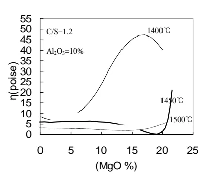

&lt;그림 8. 각 온도에서 (MgO)%와 점성의 관계&gt;

그림 9는 <math>(\text{Al}_2\text{O}_3)</math>의 증가에 대한 (MgO)의 효과를 나타내지만 (MgO) 6~7%까지는 <math>(\text{Al}_2\text{O}_3)</math>의 상승에 대하여 (MgO)를 증가시키는 쪽이 Slag의 점성을 저하시킨다. 그러나 MgO 8% 이상이면 상대적으로 점성은 저하되지만 <math>(\text{Al}_2\text{O}_3)</math>와의 관계는 거의 없어진다.

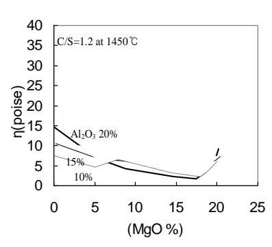

&lt;그림 9. 각 <math>(\text{Al}_2\text{O}_3)</math>%에 대한 (MgO)%의 관계&gt;

- '끝.' -

이 하 여 백
