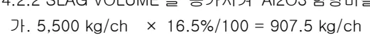
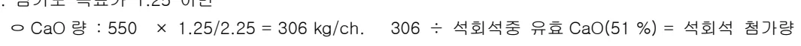
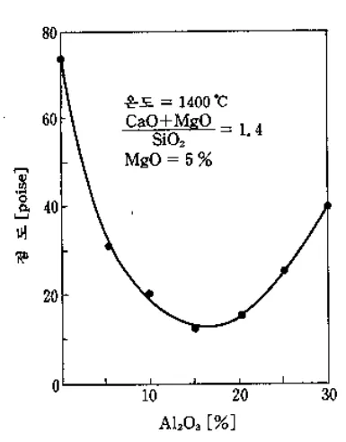
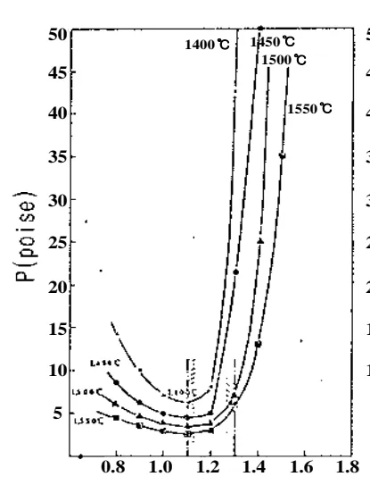
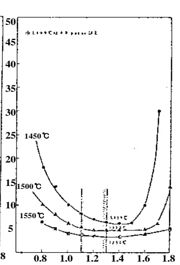
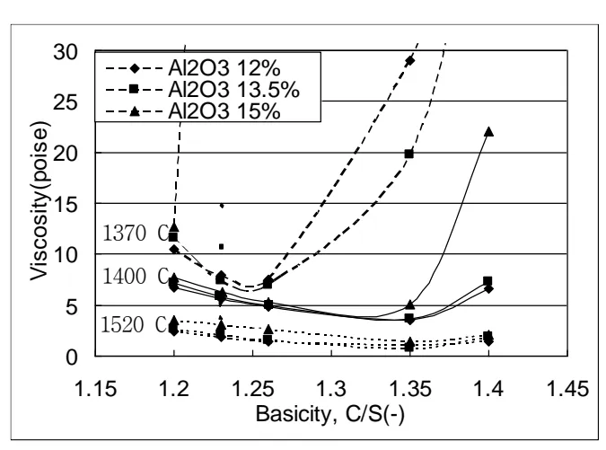
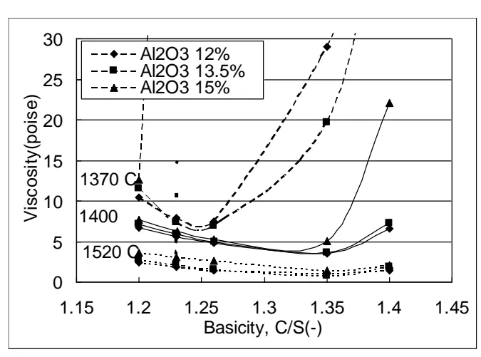
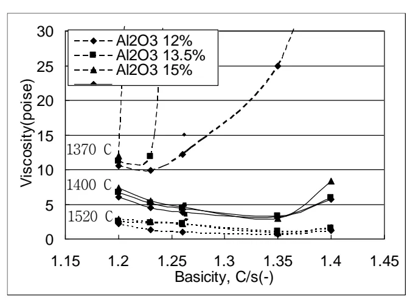

<h2>Page 1</h2>
<h1>1. 적용범위</h1>

고로내에서 용선과 함께 생성되는 SLAG 중의 Al2O3 성분 관리기술에 대하여 적용한다.

<h1>2. 목적</h1>

SLAG 중의 Al2O3 함량은 SLAG 유동성에 큰 영향을 미치므로 적정 함량을 유지함으로써 고로내 통기성을 확보하여 안정된 노황을 유지할 수 있다.

<h1>3. 중점관리 항목</h1>

<table><thead><tr><th>품질영향 인자</th><th>공정영향 인자</th></tr></thead><tbody><tr><td>[Si] [S]</td><td>풍압, 노열</td></tr></tbody></table>
<a href="components/TP-030-060-030 Slag 중 Al2O3 성분관리 기술기준(Rev.11)_0900bf4ba7a4406e_usr0000bf4b95f9e446_p001_table_01.png">Table snapshot</a>

<h1>4. 조업기준</h1>

<h2>4.1 SLAG 중 Al2O3 함량 관리기준</h2>

<table><thead><tr><th>조업조건</th><th>Al2O3 함량 관리기준</th></tr></thead><tbody><tr><td>ㅇ 용선온도 1,500 °C ㅇ SLAG 중 MgO 4~5 % ㅇ SLAG 영기도 (C/S) 1.10 ~ 1.30</td><td>ㅇ 관리범위 : Al2O3 10 ~ 16 % ㅇ 적정범위 : Al2O3 14.0 ~ 15.5 %</td></tr></tbody></table>
<a href="components/TP-030-060-030 Slag 중 Al2O3 성분관리 기술기준(Rev.11)_0900bf4ba7a4406e_usr0000bf4b95f9e446_p001_table_02.png">Table snapshot</a>

- Al2O3 는 양성산화물로서 산성 Slag 일때와 염기성 Slag 일때 거동이 다르지만, 실제 고로 Slag 에서는 CaO 가 다양 존재해 CaO/Al2O3 비가 1 이하로 되는 것이 거의 없어 Al2O3 도 산소를 4개 배위해 SiO2 와 동일한 거동을 나타낸다. 따라서 Al2O3 량이 증가 하면 산성 영역에서는 SiO2 가 증가할때와 똑같이 점성이 증가한다. Al2O3 도 SiO2 처럼 안정한 Slag 를 형성하지만 점성이 높아 고로조업에 좋지 않다.

-SLAG 중 Al2O3 함량 관리기준은 10 ~ 16 %로 한다.

-SLAG 중 Al2O3 는 유동성을 저해할 뿐 아니라, 노내의 탈황능력을 저하시키고 통기성 장애를 일으키므로 일정한도 이상 상승하지 않도록 제어 할 필요가 있다.

<h2>4.2 SLAG 중 Al2O3 함량비 제어 방법</h2>

&lt;계산전제&gt;

ㅇ SLAG 중 Al2O3 16.5 → 15.0 %로 조정

ㅇ SLAG VOLUME 5,500 kg/ch 로 가정할 때.

<h2>Page 2</h2>

4.2.1 SLAG VOLUME 은 일정하게 하고 <math>Al_2O_3</math> 입량조정으로 제어하는 방법 (소결에서 조치)

<math display="block">가. 5,500 \text{ kg/ch} \times 1.5 \text{ \%/100} = 82.5 \text{ kg/ch}</math>

나. Ch 당 장입되는 <math>Al_2O_3</math> 입량을 82.5 kg/ch 줄이기 위해 소결광중 <math>Al_2O_3</math> 함량을 조정한다.

4.2.2 SLAG VOLUME 을 증가시켜 <math>Al_2O_3</math> 함량비를 저하시키는 방법(고로에서 조치)

<math display="block">가. 5,500 \text{ kg/ch} \times 16.5\text{\%/100} = 907.5 \text{ kg/ch}</math>

<math display="block">907.5 / 5,500 + x = 0.15 \quad \text{여기서 } x = 550 \text{ kg/ch}</math>

나. 염기도 목표가 1.25 이면

<math display="block">\circ \text{ CaO 량 : } 550 \times 1.25/2.25 = 306 \text{ kg/ch.} \quad 306 \div \text{ 석회석중 유효 CaO(51 \%) = 석회석 첨가량}</math>

<math display="block">\circ \text{ SiO}_2 \text{ 량 : } 550 \times 1/2.25 = 244 \text{ kg/ch.} \quad 244 \div \text{ 규석중 유효 SiO}_2 \text{ (96 \%) = 규석 첨가량}</math>

<h2>5. 이상판단 및 조치기준</h2>

가. <math>Al_2O_3</math> 함량이 관리범위를 벗어났을시는 소결공장에 통보하여 입 <math>Al_2O_3</math> 량을 감소해 줄 것을

요청하고, 소결에서의 조치가 불가능 할 때는 4.2.2 항의 SLAG VOLUME 을 증가시켜 <math>Al_2O_3</math>

농도를 희석시키는 방법을 취한다.

<h1>6. 기술이론</h1>

<h2>6.1 SLAG 중 <math>Al_2O_3</math> 함량에 따른 점도변화</h2>

<math>Al_2O_3</math> 함량은 우측 그림에서 보듯이 점성에

크게 영향을 주고, 높을 때에는 배재, 선재분리,

탈황 등이 나빠지므로 10~20%로 조정하고 있다.

이 조정은 철광석의 배합에서 하나 이것이 불가능하면

Slag 량을 규석 등으로 증가시켜 <math>Al_2O_3</math> 함량을 희석시킨다

온도 = <math>1400^{\circ}\text{C}</math> <math>\frac{\text{CaO} + \text{MgO}}{\text{SiO}_2} = 1.4</math> <math>\text{MgO} = 5 \text{ \%}</math>

Y-axis: 점도 [poise]

X-axis: <math>\text{Al}_2\text{O}_3</math> [%]

뒷 장 계속

<h2>Page 3</h2>
6.2 Al2O3 증가에 대한 C/S 변화

Al2O3 가 증가하면 점도의 낮은 범위가 고 C/S 측에 넓게 된다. Al2O3 20%의 경우 1400℃에 있어서 점도는 비정상적으로 높은 값이 된다. 따라서 Al2O3 를 낮게 관리하여야 한다.

(a) Al2O3 10%, MgO 5%

(b) Al2O3 15%, MgO 5%

(c) Al2O3 20%, MgO 5%

- Al2O3 량에 대한 적정 염기도 범위는 다음 표와 같다.

<table><thead><tr><th rowspan="2">한계조건</th><th colspan="3">적정 C/S 범위</th></tr><tr><th>Al2O3 10%</th><th>Al2O3 15%</th><th>Al2O3 20%</th></tr></thead><tbody><tr><td>1400°C 10poise 이하</td><td>0.9 ~ 1.2</td><td>1.1 ~ 1.3</td><td>-</td></tr><tr><td>1450°C 6poise 이하</td><td>0.9 ~ 1.2</td><td>1.25</td><td>1.4</td></tr><tr><td>1450°C 10poise 이하</td><td>0.75 ~ 1.25</td><td>0.85 ~ 1.4</td><td>1.0 ~ 1.6</td></tr></tbody></table>
<a href="components/TP-030-060-030 Slag 중 Al2O3 성분관리 기술기준(Rev.11)_0900bf4ba7a4406e_usr0000bf4b95f9e446_p003_table_01.png">Table snapshot</a>

뒷 장 계속

<h2>Page 4</h2>
<h3>6.3 SLAG 중 MgO 와 Al<math>_2</math>O<math>_3</math> 함량에 따른 점도변화</h3>

▷ 다음 그림은 MgO 가 5%일때 알루미나 12, 13.5, 15%에서 점도를 나타낸 것으로 각 염기도에서 Al<math>_2</math>O<math>_3</math> 가 15%일때 가장 높은 점도를  나타냄. 대체적으로 Al<math>_2</math>O<math>_3</math> 가 15%일때 가장 높은 점도를 나타내다가 염기도가 일정수준 이상 상승시 점도는 급 상승함. 환편 낮은 온도에서는 Al<math>_2</math>O<math>_3</math> 13.5%에서 가장 낮은 점도가 됨.

▷ 다음 그림은 MgO 가 7%일때 염기도 증가시 알루미나량 변화에 따른 점도를 나타낸 것으로 앞의 경우처럼 Al<math>_2</math>O<math>_3</math> 가 13.5%일때 점도가 가장 낮게된다. 이것은 특히 낮은 온도에서 더욱 쉽게 알 수 있으며 염기도 1.24 근처에서 최저점도를 보인 후 증가하기는 하지만 염기도 1.3 까지는 MgO 4~5%, Al<math>_2</math>O<math>_3</math> 15.5% 이하에서 크게 점도에 문제가 되지않음.

뒷 장 계속

<h2>Page 5</h2>

다음그림은 <math>MgO</math>가 9%일 때

온도, 알루미나의 변화에 따른 점도변화를 나타낸 것으로 알루미나 12%에서 가장 낮은 점도를, 13.5, 15%의 경우는 비슷한 점도를 나타냄. <math>MgO</math>를 7% 이상으로 증가시킬 경우에 <math>MgO</math> 증가에 의한 점도저하의 정도가 떨어짐

위의 결과로 부터 <math>Al_2O_3</math>를 15~15.5%로 증가시킬 경우 <math>MgO</math>는 4~5%, 염기도는 1.20~1.30 정도의 관리가 필요함.

‘끝.’

이 하 여 백
