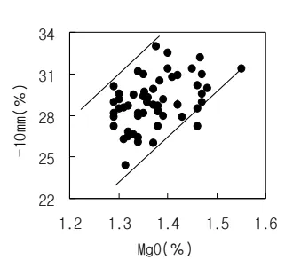
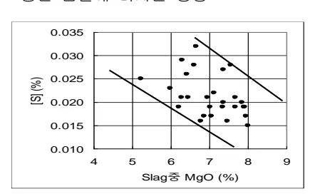
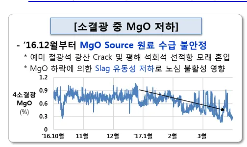
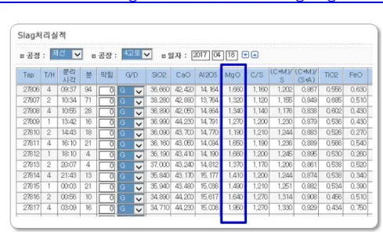

<h2>Page 1</h2>
<h2>1. 적용범위</h2>

고로내에서 생성되는 SLAG 중의 MgO 성분 관리에 대해 적용한다.

<h2>2. 목적</h2>

SLAG 중 MgO 성분은 SLAG 유동성을 개선하여 노내 흡액성을 향상시켜 고로 노화 안정유지에 도움이 되고 또한 노내에서의 탈황효과를 좋게하나, 소결 및 고로조업에서 SLAG VOLUME 상승으로 연료비 상승과, 소결광의 낙하강도(SI)저하, 분율(-10mm)상승 등의 나쁜 효과도 있으므로 적정범위를 설정하여 관리 할 필요가 있다.

<h2>3. 중점관리 항목</h2>

<table><thead><tr><th>품질영향 인자</th><th>공정영향 인자</th></tr></thead><tbody><tr><td>[Si], [S]</td><td>풍압, 노열</td></tr></tbody></table>
<a href="components/TP-030-060-040 Slag 중 MgO 성분관리 기술기준(Rev.9)_0900bf4ba7a44074_usr0000bf4b95f9e446_p001_table_01.png">Table snapshot</a>

<h2>4. 조업기준</h2>

<h3>4.1 SLAG 중 MgO 성분 관리기준</h3>

<table><thead><tr><th>조업 조건</th><th>MgO 함량 관리 기준</th></tr></thead><tbody><tr><td>ㅇ용선온도 : 1,500 °C</td><td>ㅇ관리범위 : MgO 5.0 ± 2.0 %</td></tr><tr><td>ㅇSLAG 중 Al2O3 : 14 ~ 16 %</td><td></td></tr><tr><td>ㅇSLAG 염기도 : 1.10 ~ 1.30</td><td>ㅇ적정범위 : MgO 5.0 ± 1.0 %</td></tr></tbody></table>
<a href="components/TP-030-060-040 Slag 중 MgO 성분관리 기술기준(Rev.9)_0900bf4ba7a44074_usr0000bf4b95f9e446_p001_table_02.png">Table snapshot</a>

<h2>5. 이상판단 및 조치기준</h2>

<h3>5.1 예방/이상 판단 및 조치기준</h3>

가. 용선중의 [S]상승시 1 차적으로 용선온도, SLAG 염기도, 입량 S 등을 확인한 후 이들 조업지수가 정상이면 SLAG 및 소결광중의 MgO 성분을 확인하여 노내 탈황능력을 CHECK 한다. 나. 출선, 재 상태가 나빠지거나 출선, 재 분리가 악화되면 SLAG 중 염기도, Al2O3, MgO 성분을 CHECK 하여 조업관리 범위내로 유도한다.

다. 고로 용선온도나 SLAG 염기도 조정 조치외 소결광 성분에서 MgO 를 제어 할 필요가 있다고 판단되면 소결공장에 성분조정을 요청한다.

뒷 장 계속

<h2>Page 2</h2>
<h2>6. 기술이론</h2>

<h3>6.1 SLAG 정도에 대한 MgO 의 영향</h3>

o Slag 중에 MgO 가 증가하면 산성 Slag 에 대해서는 Network 파괴자로 작용하기 때문에 점성을 저하시켜 유동성을 개선하고, 염기성 Slag 에 대해서는 안정성을 개선한다.

MgO 는 산성 Slag 에 대해서는 점성을 저하시키는 것이 가능 하지만 CaO 에 비해 약염기성 이므로 CaO 가 과잉으로 존재하는 염기성 Slag 에서는 그 효과를 충분히 발휘하지 못한다.

Al<math>_2</math>O<math>_3</math> 함유 Slag 에 MgO 를 첨가하면 Al<math>_2</math>O<math>_3</math> 량이 많아지는 만큼 MgO 의 점성저하 효과가 큼

o MgO 는 Slag 의 유동성을 증가시키고 탈황에도 효과가 있으므로 Al<math>_2</math>O<math>_3</math> 의 함량이 높을 때 MgO 를 가하여 염기도로서 복합염기도(<math>\text{CaO}+\text{MgO}/\text{SiO}_2+\text{Al}_2\text{O}_3</math>)를 관리하여 이 값을 0.95~1.05 로 조정한다. MgO 는 백운석등 MgO 가 포함된 원료를 장입하든가 소결광에 분상의 백운석, <u>예미광(MgO 15.5%)</u> 등을 첨가해서 조정한다.

o Al<math>_2</math>O<math>_3</math> 농도가 10, 15, 20 % 인 경우에 MgO 농도가 증가하면 점도는 작게 되고, 이 범위 내에서는 MgO 는 Slag 의 유동성을 좋게 하는 효과가 있다.

Slag 점도와 MgO 농도 변화(1500°C)

뒷 장 계속

<h2>Page 3</h2>
<h2>6.2 MgO 가 조업에 미치는 영향</h2>

<h3>가. 정립광 특성</h3>

<table><thead><tr><th></th><th>MT.N</th><th>HAM</th><th>IBG</th><th>규석</th><th>비고</th></tr></thead><tbody><tr><td>연화개시(°C)</td><td>901</td><td>960</td><td>891</td><td>-</td><td></td></tr><tr><td>용융적하(°C)</td><td>1528</td><td>1528</td><td>1516</td><td>-</td><td></td></tr><tr><td>차이</td><td>627</td><td>568</td><td>625</td><td>-</td><td></td></tr></tbody></table>
<a href="components/TP-030-060-040 Slag 중 MgO 성분관리 기술기준(Rev.9)_0900bf4ba7a44074_usr0000bf4b95f9e446_p003_table_01.png">Table snapshot</a>

◦ 규석은 1600°C 에서 연화 및 용융 적하 없음

<h3>나. MgO 증가시 소결 조업 영향</h3>

고용점 MgO 에 의한 용액생성 저하 → Slag 결합력 저하 → SI 저하, -10mm 증가 회수율, 생산성 저하

Slag 응고범위 축소 → Calcium Ferrite 생성억제 → 피환원성 저하(RI ↓), RDI 개선

Magnetite 안정화 → 2차 Hematite 생성억제

RI (%) vs MgO (%)

RI (%)

MgO (%)

YIELD(%) vs MgO (%)

YIELD(%)

MgO (%)

-10mm(%) vs MgO (%)

-10mm(%)

MgO (%)

뒷 장 계속

<h2>Page 4</h2>

다. MgO 가 고로조업에 미치는 영향

▷ Slag 융점 및 점성에 미치는 영향

<table><thead><tr><th>Slag MgO(%)</th><th>0</th><th>2</th><th>4</th><th>6</th><th>8</th><th>10</th><th>비고</th></tr></thead><tbody><tr><td>용융온도(°C)</td><td>1346</td><td>1361</td><td>1402</td><td>1425</td><td>1445</td><td>1467</td><td></td></tr><tr><td>점성 (Poise)</td><td>55</td><td>22</td><td>15</td><td>5.7</td><td>5.2</td><td>4.7</td><td></td></tr></tbody></table>
<a href="components/TP-030-060-040 Slag 중 MgO 성분관리 기술기준(Rev.9)_0900bf4ba7a44074_usr0000bf4b95f9e446_p004_table_01.png">Table snapshot</a>

- Slag 중 MgO 가 강소에 따라 점성은 소폭 상승하나, 용고온도가 저하함에 따라 노열 급저하시 냉입사고의 위험이 적음.

▷ 용선 품질에 미치는 영향

- 용선 중 [S] 영향

* 고로내에서 MgS 에 의한 탈류반응을 촉진시켜 용선중 [S] 저하

- 용선중 [Si] 영향

* Mg 의 휘발량은 SiO2 의 휘발량과 비슷하여 경합반응에 의해 SiO2 휘발을 억제 하여 MgO 증가시 용선중 [Si] 를 저하.

<h3>6.3 소결광 MgO 저하에 의한 Slag MgO 저하 및 유동성 악화 실조업 사례</h3>

▷ '17.3/26 일 포항 4 고로 노황변동 이후 복구시 소결 MgO 저하에 의해 Slag MgO 저하

<h4>[소결광 중 MgO 저하]</h4>
- '16.12월부터 MgO Source 원료 수급 불안정

* 예미 철광석 광산 Crack 및 평해 석회석 선적항 모래 흔입

* MgO 하락에 의한 Slag 유동성 저하로 노심 불활성 영향

<h4>Slag치리실태</h4><table><thead><tr><th>Tsp</th><th>T/H</th><th>판단 시간</th><th>분</th><th>인입</th><th>G/D</th><th>SiO2</th><th>CaO</th><th>Al2O3</th><th>MgO</th><th>C/S</th><th>(C+M)/V (S+M)</th><th>TiO2</th><th>FeO</th></tr></thead><tbody><tr><td>27806</td><td>4</td><td>09:37</td><td>94</td><td>0</td><td>G</td><td>36.660</td><td>42.420</td><td>14.194</td><td>1.693</td><td>1.193</td><td>1.222</td><td>0.967</td><td>0.599</td><td>0.630</td></tr><tr><td>27807</td><td>2</td><td>10:34</td><td>71</td><td>0</td><td>G</td><td>38.280</td><td>42.880</td><td>13.764</td><td>1.320</td><td>1.120</td><td>1.195</td><td>0.949</td><td>0.685</td><td>0.510</td></tr><tr><td>27808</td><td>4</td><td>10:56</td><td>28</td><td>0</td><td>G</td><td>36.890</td><td>42.080</td><td>14.664</td><td>1.340</td><td>1.140</td><td>1.176</td><td>0.838</td><td>0.602</td><td>0.430</td></tr><tr><td>27809</td><td>1</td><td>13:42</td><td>16</td><td>0</td><td>G</td><td>36.990</td><td>44.230</td><td>14.791</td><td>1.270</td><td>1.200</td><td>1.230</td><td>0.879</td><td>0.536</td><td>0.430</td></tr><tr><td>27810</td><td>2</td><td>14:43</td><td>18</td><td>0</td><td>G</td><td>36.090</td><td>43.700</td><td>14.770</td><td>1.190</td><td>1.210</td><td>1.244</td><td>0.883</td><td>0.526</td><td>0.270</td></tr><tr><td>27811</td><td>4</td><td>16:10</td><td>21</td><td>0</td><td>G</td><td>36.160</td><td>43.050</td><td>14.044</td><td>1.650</td><td>1.160</td><td>1.236</td><td>0.889</td><td>0.596</td><td>0.540</td></tr><tr><td>27812</td><td>1</td><td>16:10</td><td>4</td><td>0</td><td>G</td><td>36.160</td><td>43.410</td><td>14.190</td><td>1.600</td><td>1.200</td><td>1.246</td><td>0.896</td><td>0.530</td><td>0.360</td></tr><tr><td>27813</td><td>2</td><td>20:07</td><td>4</td><td>0</td><td>G</td><td>37.000</td><td>43.340</td><td>14.812</td><td>1.370</td><td>1.170</td><td>1.206</td><td>0.981</td><td>0.538</td><td>0.620</td></tr><tr><td>27814</td><td>4</td><td>21:43</td><td>13</td><td>0</td><td>G</td><td>35.840</td><td>43.170</td><td>15.177</td><td>1.410</td><td>1.200</td><td>1.244</td><td>0.874</td><td>0.538</td><td>0.340</td></tr><tr><td>27815</td><td>1</td><td>00:05</td><td>21</td><td>0</td><td>G</td><td>35.940</td><td>43.480</td><td>15.036</td><td>1.490</td><td>1.210</td><td>1.251</td><td>0.882</td><td>0.534</td><td>0.390</td></tr><tr><td>27816</td><td>2</td><td>00:56</td><td>10</td><td>0</td><td>G</td><td>34.890</td><td>44.230</td><td>15.617</td><td>1.640</td><td>1.270</td><td>1.314</td><td>0.908</td><td>0.466</td><td>0.510</td></tr><tr><td>27817</td><td>4</td><td>03:09</td><td>16</td><td>0</td><td>G</td><td>34.710</td><td>44.230</td><td>15.008</td><td>1.950</td><td>1.270</td><td>1.330</td><td>0.929</td><td>0.434</td><td>0.750</td></tr></tbody></table>

'끝.'

이 하 여 백
