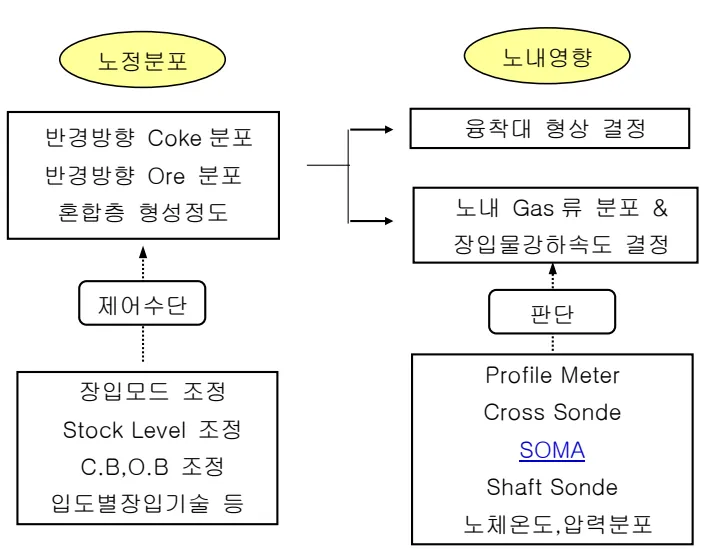

<h2>Page 1</h2>
<h1>1. 적용범위</h1>

고로에서 노내 반경방향별 Gas류 제어에 의한 안정된 노황유지를 위해 적용하고 있는 장입물 분포제어 기술과 고로의 적정 장입물 분포를 위한 장입 Mode 설정의 기본사상에 대해 적용한다.

<h2>2. 목 적</h2>

<ul><li>노내 통기성 개선에 의한 노황안정 및 생산성 향상</li><li>노체 열부하 억제에 의한 노체수명연장</li><li>노심 통기, 풍액성 개선에 의한 노저 측벽부 수명연장으로 고로수명 향상</li></ul>

<h3>3. 중점관리 항목</h3>

<table><tbody><tr><td>풍질영향 인자</td><td>공정영향 인자</td></tr><tr><td>[Si], [S]</td><td>풍압, 노열</td></tr></tbody></table>
<a href="components/TP-030-070-020 장입물 분포제어와 장입모드의 기본사상 기준(Rev.9)_0900bf4ba7a2bc7a_usr0000bf4b95f9e446_p001_table_01.png">Table snapshot</a>

<h2>4. 조업 기준</h2>

<h3>4.1 장입물 분포제어</h3>

<h4>4.1.1 장입물 분포제어 기본사상</h4>

가. 장입물 분포제어 기본개념

노내 장입물의 반경방향의 분포는 주로 광석, 코크스의 혼합층 형성량으로 나타낼 수 있으며 그 기능은 고로내부 상승가스를 분배하고 노상부에서는 장입물의 강하상태를 결정해 주며 노하부에서는 연화용착대 형상에 큰 영향을 미친다.

분포제어는 최적의 융착대형상을 얻기위한 수단으로서 사용되며 고로노황 안정에 지대한 영향을 미치므로 고출선비, 고미분탄비 조업등 조업조건에 따른 적정 분포제어기술의 사용이 필요하다. 포항고로의 장입물 분포조정의 목표는 ①노내 통기성 개선에의한 생산성 향상, ②노내 Gas 이용을 향상에 의한 연료비 절감, ③노체열부하 억제에의한 노체수명 연장, ④노심 통기, 풍액성 개선에의한 노저측벽부 수명연장 및 ⑤ Slip, Hanging, Channeling, 풍구곡손, 냉입, 노심오염등의 사고예방에 있다.

장입물의 반경방향의 분포를 제어하는 방법으로는 일반적으로 장입모드 변경,

Stock Level 변경, Coke, Ore Base 변경 등이 기본적인 수단으로 사용되고 있다.

포항 고로에서는 2고로 2대기에서 처음으로 Bell-less Type 의 장입장치 체택을 시작으로 분포제어 기술에 대한 사상을 정립하고 발전시킨 결과 현재 조업 적용중인 소결광 입도별 장입, Coke 중심장입, Nut Coke 장입기술들을 적용중에 있다.

<h2>Page 2</h2>

Flowchart illustrating the process flow:
<ul><li>Inputs (Top Left): 노정분포 (Pipeline Distribution)</li><li>Inputs (Top Right): 노내영향 (Influence inside the tunnel)</li><li>Left Side Inputs: 반경방향 Coke 분포, 반경방향 Ore 분포, 혼합층 형성정도</li><li>Right Side Inputs: 용착대 형상 결정, 노내 Gas 류 분포 &amp; 장입물강하속도 결정</li><li>Center: 제어수단 (Control Unit) receives inputs from Left Side and Right Side, and outputs to Left Side and Right Side.</li><li>Left Side Outputs: 장입모드 조정, Stock Level 조정, C.B.O.B 조정, 입도별장입기술 등</li><li>Right Side Outputs: 판단 (Judgment), Profile Meter, Cross Sonde, SOMA, Shaft Sonde, 노체온도, 압력분포 (Tunnel Body Temperature, Pressure Distribution)</li></ul>

<h3>4.1.2 장입 Notch 설정근거</h3>

장입 Notch 설정근거는 고로내에 장입물을 분배함에 있어서 노중심을 기준하여 벽측의 단면적이 크고 중심 및 중간부위가 단면적이 상대적으로 적다. 따라서 반경방향의 거리를 벽측은 좁게하고 중간부로 갈수록 넓게 되도록 장입물을 분배시켜 각 Notch 별로 장입물이 차지하는 면적이 동일하도록 Chute 각도를 조정하였으며 이를 등면적 분할방식이라고 한다. (노 중심부로 갈수록 경동각도 차이를 크게하면 면적 배분이 벽측과 동일하게 된다)

뒷 장 계 속

<h2>Page 3</h2>

가. 장입 Notch 별 낙하궤적 (예: 포항 고로 낙하궤적)

GL+38900

Coke

Ore

S.L.

0.0m

0.5m

1.0m

1.5m

2.0m

2.5m

3.0m

3.5m

0.0m

0.5m

1.0m

1.5m

2.0m

2.5m

3.0m

3.5m

4.0m

Wall

Center

1 2 3 4 5 6 7 8 9 10

뒷 장 계 속

<h2>Page 4</h2>
<h2>4.2 Bell Less 고로 분포제어의 기본이론</h2>

<h3>4.2.1 장입 Mode 기본사상</h3>

<h4>가. 장입 Mode 기본개념</h4>

포항 고로 노정설비는 소결광 입도별 장입이 가능한 Bell-Less 장입장치로서 <math>C\downarrow</math>, <math>OL\downarrow</math>, <math>Os\downarrow</math>의 Sequence를 1Charge로 하여 Coke를 노벽측에 장입하여 Coke 경사각을 크게함과 동시에 적정길이의 Terrace를 만들어 대립(입도: 10~50 mm)의 광석을 Terrace 선단에 층돌시켜 운동에너지에 의해 Coke 층을 봉괴시키고 혼합층을 형성하여 반경방향의 Ore/Coke를 제어해 주어 고 O/C 하에서도 통기성 및 Gas 이용률이 우수한 융착대를 형성 시킬 수 있다. 노벽측에 소립광석을 안착시켜 노벽부 불활성대 생성을 방지하고 노벽 보호를 유도한다. 또한, 중간부 Coke 층후가 얇아져 연화 융착대 근부의 처짐 현상을 개선하기 위해 Nut Coke(15~30mm)를 대립광석의 선단부에 혼합 장입할 수도 있으며, 중심 Gas류 발달을 측진시키고 건전한 노심 Coke를 확보하기 위하여 Coke 중심장입을 병행 실시할 수도 있다.

<h4>※ 장입 Mode 설명</h4>

(예) <math>C</math> 234567 333322 <math>OL</math> 56789 12221 <math>Os</math> 234 121

→ Notch 번호 → 각 Notch 별 선회수

소립 Ore (5~10mm) 대립 Ore (10~50mm)

<h4>나. 장입 Mode 조정 기본개념</h4>

<h4>※ 포항 고로 장입 Mode (예)</h4>

<table><thead><tr><th></th><th>장입모드</th><th>사상</th></tr></thead><tbody><tr><td>Coke</td><td><math>C</math> 12345678 12222222</td><td>o Terrace 1.0~1.2m 형성 o 경사각 증대</td></tr><tr><td>OL</td><td><math>OL</math> 56789 12221</td><td>O Terrace 선단부 장입으로 혼합층 증대 o 반경방향 O/C 균일화 (다중 Ring 사용)</td></tr><tr><td>Os</td><td><math>Os</math> 234 121</td><td>O 노벽측에 안착시켜 Skin Flow 조정</td></tr></tbody></table>
<a href="components/TP-030-070-020 장입물 분포제어와 장입모드의 기본사상 기준(Rev.9)_0900bf4ba7a2bc7a_usr0000bf4b95f9e446_p004_table_01.png">Table snapshot</a>

<h2>Page 5</h2>

다. 적용중인 장입 방법

Ore는 대립과 소립을 분리하여 장입하는 소결광 입도별장입 기술을 적용중에 있고 중심류 제어를 위한 Coke 중심장입, 벽부 및 중간류 제어를 위한 Nut Coke 장입기술을 적용하고 있다.

장입물 입도현황

<table><thead><tr><th>구분</th><th>Size(mm)</th></tr></thead><tbody><tr><td>C</td><td>Normal Coke</td><td>25 ~ 75</td></tr><tr><td rowspan="3">OL</td><td>Large Sinter</td><td>10 ~ 50</td></tr><tr><td>Lump Ore</td><td>8 ~ 30</td></tr><tr><td>Pellet</td><td>8 ~ 30</td></tr><tr><td>Os</td><td>Small Sinter</td><td>5 ~ 10</td></tr></tbody></table>
<a href="components/TP-030-070-020 장입물 분포제어와 장입모드의 기본사상 기준(Rev.9)_0900bf4ba7a2bc7a_usr0000bf4b95f9e446_p005_table_01.png">Table snapshot</a>

라. 내진지수

광석, Coke 장입의 평균 Notch 를 표현하는 지수로써 다음과 같은 내진지수를 사용하고 있다.

o 선회수 기준 내진지수 : <math>\sum(Xi \times Yi) / \sum Yi</math>

o 장입량 기준 내진지수 : <math>\sum(Xi \times Yi) / \sum Yj</math>

※ <math>Xi</math>: Notch No, <math>Yi</math>: Notch 별 회전수, <math>Yj</math>: Notch 별 실장입량

마. 장입방법

(1) 스파이럴(Spiral) 장입

1 회 장입시 경동 Notch 를 4 개 이상 사용하는 장입방법

(2) 링(Ring) 장입

1 회 장입시 1~3 개 사이의 경동 Notch 를 사용하는 장입 방법

(3) 벨-라이크 장입 (Bell-like)장입

벨라이크 장입은 Bell-less 고로에서 Bell 고로와 유사한 퇴적형상이 되도록 장입하는 방법

뒷 장 계 속

<h2>Page 6</h2>
<h2>4.2.2 장입물 분포방법</h2>

가. 장입물 Mode 조정

각 고로별로 일정한 선회 Chite 경동각도에서 Coke, Large Ore, Small Ore, Center Coke 를 장입순서에 맞추어 각각의 주어진 Notch (1~11 Notch)별로 노황여건을 고려하여 선정된 Mode 에 구분하여 장입한다.

나. 장입물 경동각도 조정

선회 CHUTE 교환직후 초기에 광석 및 Coke 의 마찰력증가 결과로 낙하 에너지가 감소하여 낙하궤적축소 및 내진 효과가 있으므로 Chute 교환 전, 후 낙하궤적의 동일유지를 위해 경동각도를 상향 조정할 수 있다.

다. MCG 개도 조정

Coke Terrace 를 적정 수준으로 유지시켜 고로내 반경방향의 중간부에 적절한 Mixing Zone 을 유지시켜 중간부 통기성 확보 및 광석의 중간부처짐 현상의 개선과 노정장입 Hopper 양측의 배출특성 변화로 장입량 편차 발생요인을 최소화 하고자 MCG 개도를 가감하여 조정할 수 있다.

라. Stock Level 조정

각 고로별로 장입 기준선으로 부터 일정 S.L 하에서 Coke Terrace 길이를 적정수준 범위에서 조정 하고자 Stock Level 의 높낮이를 가감할 수 있다.

<ul><li>Coke Terrace 축소 : Stock Level 하향 조정</li><li>Coke Terrace 확대 : Stock Level 상향 조정</li></ul>

<h3>5. 이상판단 및 조치기준</h3>

장입 Mode 변경이후 4~5 시간 경과후 노체 온도변화, Cross Sonde 기타 센서류를 통하여 Gas 류 변화정도를 확인한후 현재 Mode 를 유지할지 재조정할지를 판단한다.

‘끝.’

이 하 여 백
