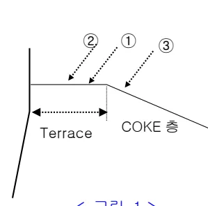
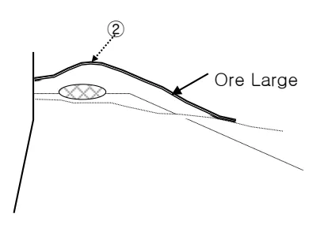
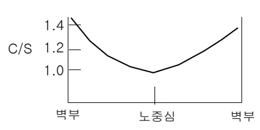

<h2>Page 1</h2>
<h2>1. 적용범위</h2>

고로내의 Gas류 안정을 위한 장입물 분포제어 기술의 일환으로 Ore의 입도별로 분류하여 장입하는 Ore 입도별 장입기술에 대해 적용한다.

<h2>2. 목적</h2>

ㅇ Ore 입도별 장입에 의한 노내 Gas류 제어로 통기성 개선에 의한 노황안정 및 생산성 향상

ㅇ 고로내 반경방향별 Ore의 균일한 분포를 통한 노내 Gas류 안정

<h2>3. 중점관리 항목</h2>

<table><thead><tr><th>품질영향 인자</th><th>공정영향 인자</th></tr></thead><tbody><tr><td>[Si], [S]</td><td>풍압, 노열</td></tr></tbody></table>
<a href="components/TP-030-070-040 Ore 입도별 장입기술 기준(Rev.8)_0900bf4ba7a2bc76_usr0000bf4b95f9e446_p001_table_01.png">Table snapshot</a>

<h2>4. 조업 기준</h2>

<h3>4.1 Ore Large 장입 Mode 적용사상</h3>

가. 혼합층 형성 (Ore Large 첫 Notch 시작 Point 선정)

<ol><li>Coke Mode 와 Ore Large Mode 가 겹치는 Notch 수는 각 고로별 상황에 맞게 선정한다.</li><li>최초 장입위치는 Coke Terrace 선단에서 20 Cm 정도 노벽측(①)으로 장입해야 한다.</li><li>&lt;그림 1&gt; 만약에 ② 위치에 장입할 경우에는 Ore Large 층돌시 Gausing Area (Coke 붕괴량) 축소에 따라 혼합층 형성량이 감소하고 Ore Terrace 가 축소되어 Ore Small 장입시 중심으로 흘러 들어갈 가능성이 있으며 이는 풍압 불안정을 유발할 수도 있다. &lt;그림 2&gt;</li><li>한편 &lt;그림 1&gt;의 ③ 위치에 장입할 경우에는 Ore Large 층돌시 Gauging Area(Coke 붕괴량) 증가에 따라 Coke 층후가 감소하고 주변부에 Coke 잔류량이 증가하여 Skin Flow 온도 및 Belly 온도를 상승시켜 Gas류가 주변류화가 되기 쉽다.</li></ol>

<u>&lt;그림 1&gt;</u>

<u>&lt;그림 2&gt;</u>

<h2>Page 2</h2>
나. 혼합층 형성(Ore Large 첫 Notch 회전수 결정)

(1) 첫 Notch의 적정 회전수는 1~2 회전이며 (2) 3 회전일 경우 혼합층 형성이 감소되므로 사용시 신중한 고려가 필요하다. (3) 한편 Coke 층, OL, 혼합층, Os 등 각층의 통기성의 우위정도는 다음과 같다.

<table><thead><tr><th>구분</th><th>Coke1</th><th>OL</th><th>혼합층 (Coke+OL)</th><th>Os</th></tr></thead><tbody><tr><td>괴상대</td><td>1</td><td>2</td><td>3</td><td>4</td></tr><tr><td>연화용착대</td><td>1</td><td>3</td><td>2</td><td>3</td></tr><tr><td>TOTAL</td><td>1</td><td>3</td><td>2</td><td>4</td></tr></tbody></table>
<a href="components/TP-030-070-040 Ore 입도별 장입기술 기준(Rev.8)_0900bf4ba7a2bc76_usr0000bf4b95f9e446_p002_table_01.png">Table snapshot</a>

다. 분포 일반사항

(1) 반경방향 O/C 균일화를 위해 5Notch 이상 다중 Ring 사용 (2) OL 장입후 충분한 Terrace 확보로 중심부로 Os 유입 방지 (3) 노내 염기도 분포개선을 위해 염기도가 낮은 정립광과 부원료는 OL에 포함하여 고로 중심부의 염기도(<math>	ext{CaO}/	ext{SiO}_2</math>)를 낮게하여 저온에서도 Slag의 흐름을 좋게한다 &lt;그림 3&gt;

&lt;그림 3&gt;

(4) 입도별 장입과 충분한 Sizing으로 OL에 소립포함 최소화

뒷 장 계속

<h2>Page 3</h2>
<h2>4.2 노정 Hopper 배출특성</h2>

광석 충돌판이 없는 노정 Hopper의 퇴적형상은 중심부에 소립이, 벽부에 대립이 쌓이는 형태로 배출시에는 중심부가 우선 배출되어 시간이 경과함에 따라서 평균입도가 증가하므로 중심부로 갈수록 대립이 증가하여 통기성 개선에 유리하다.

또한 고로벽부에는 소립광의 안착이 용이하여 노벽보호의 효과가 있다. &lt;그림 4&gt;

&lt;그림 4&gt; 퇴적형상 및 배출특성

뒷 장 계속

<h2>Page 4</h2>
<h3>4.3 소결광 입도별 장입사상</h3>

소결광

OL 입도 대

통기성 개선

중간, 중심부 장입

중심부 O/C 증대 가능

nCO ↑

RAR ↓

OS 입도 小

통기성 약화

주변부 장입

주변부 O/C 감소 가능

노벽 Gas 류 감소

노명연장

환원용융성 개선

불활성대 생성 방지

근부 처짐 비대 방지

<h3>4.4 Ore Small 장입 사상</h3>

가. 노벽측에 장입하여 과다한 주변류 발생을 억제한다.

나. OL 위에 작은 층격으로 안착해야 한다.

다. ORE Large 의 Terrace 밖으로 흘러 넘쳐서 중심부에 유입되어 중심류를 약화시켜서는 안된다.

라. 고 PCR, 고출비 조업하의 통기성 확보 측면에서 노내의 단면적이 제일 넓은 벽측에서 통기성을 확보하지 않으면 어려울 것으로 판단되며, 향후 ORE SMALL 장입시 과도하게 노벽측에 장입되는 것은 고려 해야 함.

<h3>5. 이상판단 및 조치기준 : 해당사항 없음</h3>

‘끝.’
