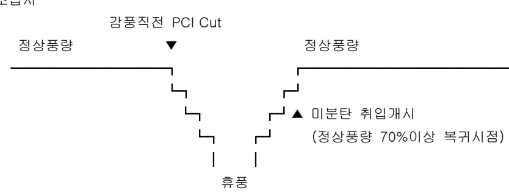

<h2>Page 1</h2>
<h1>1. 적용범위</h1>

고로공정 미분탄 취입조업중 미분탄 취입 및 Cut 시 조업기준에 대하여 적용한다.

<h2>2. 목적</h2>

미분탄 취입조업시 미분탄의 취입 및 Cut 기준을 고로 노황 및 노열상태를 고려, 상황발생 유형별 세분하여 설정하고 이를 준수함으로써 안정적인 고로조업 수행을 하고자 함

<h2>3. 중점 관리항목</h2>

<table><tbody><tr><td>품질영향인자</td><td>공정영향인자</td></tr><tr><td><u>용선온도</u></td><td>풍압, 노열</td></tr></tbody></table>
<a href="components/TP-030-080-050 미분탄 취입 및 Cut 기준(Rev.12)_0900bf4ba7a2bc2d_usr0000bf4b95f9e446_p001_table_01.png">Table snapshot</a>

<h2>4. 조업기준</h2>

<h3>4.1 송, 휴풍시 미분탄 취입기준</h3>

<h4>(1) 정상조업시</h4>

감풍직전 PCI Cut

정상풍량 → (↓) → 정상풍량

↓

미분탄 취입개시 (정상풍량 70%이상 복귀시점)

↓

휴풍

<h4>(2) 설비 Trouble 에 의한 감풍 및 Hanging(걸림) 발생시</h4>

<ul><li>설비 Trouble 조치후 정상풍량의 70% 이상시 미분탄 취입개시</li><li>Hanging 이 발생하여 봉락(내림)작업시는 봉락 감풍전 미분탄 Cut, 증풍시는 정상풍량의 70% 이상 복귀시 미분탄 정상취입</li></ul>

뒷장계속

<h2>Page 2</h2>
<h2>4.2. 미분탄 Cut 시 조업기준</h2>

(1) 1,2 고로 미분탄 Cut 시 조업기준 (노황에 따라 가감 할 수 있다)

<table><thead><tr><th>용선온도/시간</th><th>1 Hr 이내</th><th>2 Hr 이내</th><th>2 Hr 이상</th></tr></thead><tbody><tr><td>1520℃ 이상</td><td>O2 Cut, 열보상 무</td><td>O2 Cut, 감풍 16% B.C 1t×3Ch</td><td rowspan="3">- B.C 1 Ch 후 All Coke 조업전환 (치환율 1:1.2)</td></tr><tr><td>1520&gt;THM&gt;1500℃</td><td>O2 Cut, 감풍 16% B.C 1t×3Ch</td><td>O2 Cut, 감풍 20% B.C 1t×6Ch</td></tr><tr><td>1500℃ 이하</td><td>O2 Cut, 감풍 25% B.C 1 Batch</td><td>O2 Cut, 감풍 36% B.C 1 Ch</td></tr></tbody></table>
<a href="components/TP-030-080-050 미분탄 취입 및 Cut 기준(Rev.12)_0900bf4ba7a2bc2d_usr0000bf4b95f9e446_p002_table_01.png">Table snapshot</a>

주) THM : Temperature of Hot Metal (용선온도)

(2) 3, 4 고로 미분탄 Cut 시 조업기준(노황에 따라 가감 할 수 있다)

<table><thead><tr><th>용선온도/시간</th><th>1 Hr 이내</th><th>2 Hr 이내</th><th>2 Hr 이상</th></tr></thead><tbody><tr><td>1520℃ 이상</td><td>O2 Cut, PC Cut 전후 취입량 조정</td><td>O2 Cut, 감풍 20% PC 조정+B.C 3t×4Ch</td><td>O2 Cut, 감풍 40% PC 조정+B.C 4t×5Ch</td></tr><tr><td>1520&gt;THM&gt;1500℃</td><td>O2 Cut, PC Cut 전후 취입량 조정</td><td>O2 Cut, 감풍 30% PC 조정+B.C 3t×4Ch</td><td>O2 Cut, 감풍 50% PC 조정+B.C 4t×5Ch</td></tr><tr><td>1500℃ 이하</td><td>O2 Cut, 감풍 21% PC 조정+B.C 2t×3Ch</td><td>O2 Cut, 감풍 40% PC 조정+B.C 5t×3Ch</td><td>O2 Cut, 감풍 50% PC 조정+ C.R 550Kg</td></tr></tbody></table>
<a href="components/TP-030-080-050 미분탄 취입 및 Cut 기준(Rev.12)_0900bf4ba7a2bc2d_usr0000bf4b95f9e446_p002_table_02.png">Table snapshot</a>

<h2>5. 이상판단 및 조치기준</h2>

<h3>5.1 예방판단 및 조치기준</h3>

⊙ 상기 “4.1의 ‘송, 휴풍시 미분탄 취입기준’에 따른다.

<h3>5.2 이상판단 및 조치기준</h3>

⊙ 상기 “4.2의 ‘미분탄 Cut 시 조업기준’에 따른다

<h2>6. 기술이론</h2>

⊙ Coal 취입시 열효과 규정

<table><thead><tr><th>구분</th><th>0Hr</th><th>1</th><th>2</th><th>3</th><th>4</th><th>5</th><th>6</th><th>7</th><th>8</th><th>9</th><th>10</th><th>11</th><th>12</th><th>13</th></tr></thead><tbody><tr><td>기준</td><td></td><td></td><td></td><td></td><td></td><td></td><td></td><td></td><td></td><td></td><td></td><td></td><td></td><td></td></tr><tr><td>1 시간후</td><td></td><td>▲Coal 취입</td><td></td><td></td><td></td><td></td><td></td><td></td><td></td><td></td><td></td><td></td><td></td><td></td></tr><tr><td>Coal 재취입</td><td></td><td>▲ 증광</td><td></td><td></td><td></td><td></td><td></td><td></td><td></td><td></td><td></td><td></td><td></td><td></td></tr><tr><td>2 시간후</td><td></td><td></td><td>▲ Coal 취입</td><td></td><td></td><td></td><td></td><td></td><td></td><td></td><td></td><td></td><td></td><td></td></tr><tr><td>Coal 재취입</td><td></td><td></td><td>▲ 증광</td><td></td><td></td><td></td><td></td><td></td><td></td><td></td><td></td><td></td><td></td><td></td></tr></tbody></table>
<a href="components/TP-030-080-050 미분탄 취입 및 Cut 기준(Rev.12)_0900bf4ba7a2bc2d_usr0000bf4b95f9e446_p002_table_03.png">Table snapshot</a>

“끝”
