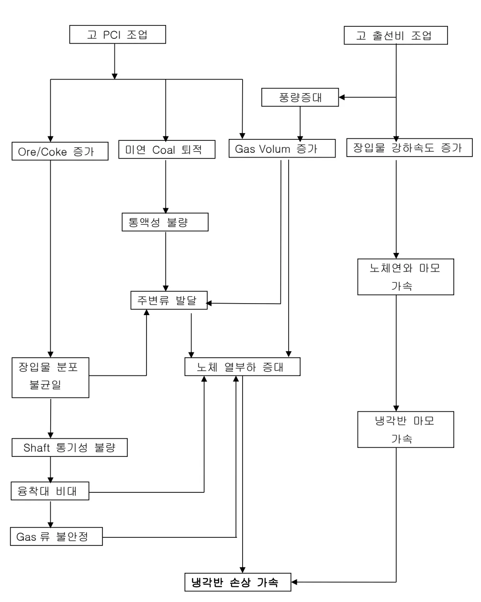
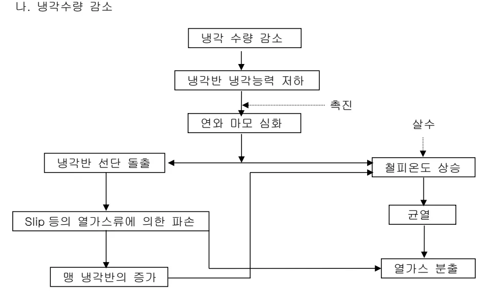

<h2>Page 1</h2>
<h1>1. 적용범위</h1>

전 고로에 설치된 노체 냉각반 손상 메커니즘 및 관리에 대하여 적용한다

<h2>2. 목적</h2>

고압조업, 보조연료 취입, 고온송풍 조업등의 고생산성 하에서 노체철피 보호 및 내화물의 침식 억제로 고로 노수명 20년 이상의 장수명화를 위한 노체 냉각반 관리기술

<h2>3. 중점관리 항목</h2>

<table><thead><tr><th>품질 영향 인자</th><th>공정 영향 인자</th></tr></thead><tbody><tr><td>[S], [Si]</td><td>풍압, 노열</td></tr></tbody></table>
<a href="components/TP-030-090-030 노체 냉각반 관리기술 기준(Rev.9)_0900bf4ba7a466a5_usr0000bf4b95f9e446_p001_table_01.png">Table snapshot</a>

<h2>4. 조업기준</h2>

<h3>4.1 조업관리 기준</h3>

<h4>4.1.1 노체 냉각반 손상기구</h4>

가. 장기적인 사용에 의한 마모 1) 장입물에 의한 기계적 마모 2) 고로 상승가스에 의한 Sand Blasting 효과: Coke slit 에서의 풍속 50~100 m/s 3) Zn, Alkali, CO 분해 및 산화(침탄)와 같은 화학적 손상: <math>2Cu + CO_2 = Cu_2O+CO</math> 4) 연와의 압축이완(열변동)에 의한 피로 및 균열 나. 급격한 열 충격에 의한 마모 및 용손 1) 연와 탈락 2) 냉각관내 Scale 에 의한 막힘으로 용손 3) 노체 열부하에 의한 Spalling

뒷 장 계속

<h2>Page 2</h2>

다. 냉각능 부족에 의한 용손(유속, 압력)

• 노체 열부하 대비 냉각수량(유속) 부족

• 노내압 대비 냉각수압이 낮을 경우 냉각반 손상시 노내 Gas 가 Ring Main 으로 역류하여

주변 냉각반의 냉각 능력 급저하 초래

1) 냉각수 유속에 따른 냉각반 열부하 허용선(NSC 기술자료)

Figure 1: A graph showing the relationship between heat load (열부하, <math>\text{Kcal/m}^2\cdot\text{Hr}</math>, Y-axis, scaled by <math>\times 10^6</math>) and cooling water velocity (냉각수 유속, <math>\text{m/sec}</math>, X-axis). The curve represents the allowable heat load for the cooling plates. Key points are marked: Water velocity (용속) and Cooling plate (냉각반). A point corresponding to <math>200^\circ\text{C}</math> and <math>178^\circ\text{C}</math> is also indicated.

o 6 Path 냉각반의 유속

: <math>100 \ell/\text{min} = 1.0 \text{ m/sec}</math>

o 유속 <math>0.4\text{m/sec}</math>에서는

<math>3.0 \text{ Gcal}</math>의 열부하시 용손

o 유속 <math>1.0\text{m/sec}</math>에서는

<math>4.5 \text{ Gcal}</math>이상의 열부하에서

용손에 이름.

2) 냉각 수압과 냉각수 Steam 화 온도와의 관계

Figure 2: A graph showing the relationship between temperature (온도, <math>^\circ\text{C}</math>, Y-axis, ranging from 100 to 180) and pressure (압력, <math>\text{kg/cm}^2</math>, X-axis, ranging from 1 to 6). The curve shows that temperature decreases as pressure increases.

o 수압의 증가(<math>1 \to 4\text{kg/cm}^2</math>)로

끓는점 상승(<math>120 \to 155^\circ\text{C}</math>)

o 동일 냉각수량, 수온하에서도

수압이 증가할수록

냉각수의 Steam 화가 줄어들어

냉각능이 향상됨.

<h2>Page 3</h2>

3) 냉각수 유량에 따른 Heat Pick up 비율

Heat Pickup (KCal/min)

Cooling water flow rate (<math>\ell</math>/min)

4) 내화물에 따른 열부하 변화

Heat loss (<math>\text{KW}/\text{m}^2</math>)

Refractory thickness (m)

<math>\circ</math> <math>p=312\text{mm}</math>, SiC <math>\triangle</math> <math>p=312\text{mm}</math>, Alumina <math>\square</math> <math>p=624\text{mm}</math>, Alumina

5) 노체잔존연와에 따른 냉각반 및 철피 열부하(SIC 기준)

<table><thead><tr><th rowspan="2">잔존연와두께 [마모두께](mm)</th><th colspan="5">방산열</th></tr><tr><th>연와와 접한 냉각반(kw)</th><th>노내와 접한 냉각반(kw)</th><th>철피 노냉 (kw)</th><th>총 방산열 (kw)</th><th>단위면적당 총 방산열(kw)</th></tr></thead><tbody><tr><td>765[0]</td><td>0.676</td><td>0</td><td>0.0005</td><td>0.677</td><td>8.69</td></tr><tr><td>536[229]</td><td>6.524</td><td>1.68</td><td>0.006</td><td>8.21</td><td>105.26</td></tr><tr><td>300[465]</td><td>6.464</td><td>15.272</td><td>0.037</td><td>21.773</td><td>279.16</td></tr><tr><td>150[615]</td><td>6.186</td><td>23.451</td><td>0.112</td><td>29.748</td><td>381.40</td></tr></tbody></table>
<a href="components/TP-030-090-030 노체 냉각반 관리기술 기준(Rev.9)_0900bf4ba7a466a5_usr0000bf4b95f9e446_p003_table_01.png">Table snapshot</a>

뒷 장 계속

<h2>Page 4</h2>
<h3>4.1.2 냉각반 손상 메커니즘</h3>

가. 고 PCI 조업 및 고 출선비 조업

고 PCI 조업 및 고 출선비 조업

고 PCI 조업 → Ore/Coke 증가, 미연 Coal 퇴적, Gas Volum 증가

고 출선비 조업 → 장입물 강하속도 증가

장입물 강하속도 증가 → 노체 연와 마모 가속

Gas Volum 증가 → 풍량증대

풍량증대 → Gas Volum 증가, 주변류 발달

미연 Coal 퇴적 → 풍액성 불량

풍액성 불량 → 주변류 발달

Ore/Coke 증가 → 장입물 분포 불균일

Gas Volum 증가 → 노체 열부하 증대

장입물 분포 불균일 → Shaft 통기성 불량

Shaft 통기성 불량 → 운착대 비대

운착대 비대 → Gas 류 불안정

Gas 류 불안정 → 주변류 발달, 노체 열부하 증대

노체 열부하 증대 → 냉각반 손상 가속

노체 연와 마모 가속 → 냉각반 마모 가속

냉각반 마모 가속 → 냉각반 손상 가속

<h2>Page 5</h2>
<h4>나. 냉각수량 감소</h4>

Flowchart illustrating the reduction of cooling water quantity:

냉각 수량 감소 (Cooling Water Quantity Reduction)

↓

냉각반 냉각능력 저하 (Cooling Water Quantity Reduction leads to Decreased Cooling Capacity of Cooling Plate)

↓

연와 마모 심화 (Increased Wear of Condenser Tubes)

↓

절피온도 상승 (Increased Economizer Temperature)

↓

균열 (Cracking)

↓

열가스 분출 (Exhaust of Hot Gas)

↓

냉각반 선단 돌출 (Cooling Plate Leading Edge Protrusion)

↓

Slip 등의 열가스류에 의한 파손 (Damage due to Slip and other Hot Gas Flow)

↓

냉 냉각반의 증가 (Increased Cooling Plate Cooling)

Note: 측진 (Side Thrust) is indicated between Decreased Cooling Capacity and Increased Wear of Condenser Tubes.

<h3>4.1.3 노체관리 방향</h3>

<h4>가. 설비측면</h4>

<ol><li>냉각반 냉각능력 향상을 위해 냉각수 유속(유량)을 확보하고 냉각수 압력을 노내암이상으로 한다</li><li>손상된 노벽은 주기적인 노체 압입 및 노벽 Spray 를 통하여 보수하고 열화 냉각반은 노벽의 마모정도를 고려하여 길이를 축소한 냉각반으로 계획교체 실시 할 것</li></ol>

<h4>나. 조업측면</h4>

조업 경년에 따라 생산계획, 풍량, 산소, 장입물 분포, 등을 조정하여 노체 열부하를 줄여 안정적인 조업실시 할 것

<h4>다. 감시 및 관리측면</h4>

<ol><li>냉각수 유량은 고로별, 부위별 틀리므로 최초 설계 유량을 매일 정기적으로 확인하면서 입,출 수온 차이를 기록 관리 하여 입,출 수온 차이가 평균 수온 차이보다 클 경우 증량 실시 할 것</li><li>냉각반 파손시 교체 할수 있도록 설치된 냉각반 보다 100mm, 150mm, 200mm 단축된 예비품 확보 할 것</li><li>노체 절피 및 냉각반 전문팀을 편성 운영하고 냉각반 감시시스템 구축 등 체계적인 노체 점검활동 강화</li><li>기술, 작업표준 재, 개정 및 교육을 통한 노말기 조업의 비상대응 능력 강화</li></ol>

<h2>5. 이상판단 및 조치기준 : 해당사항 없음</h2>