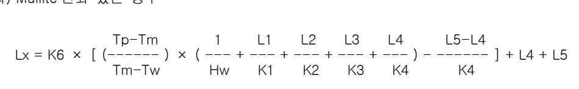
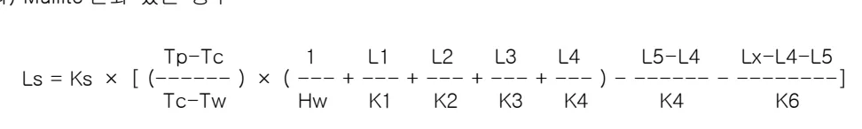
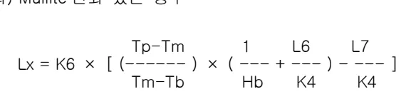
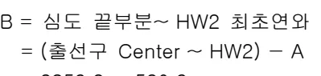
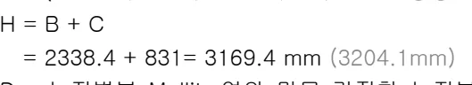
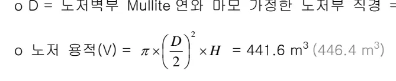
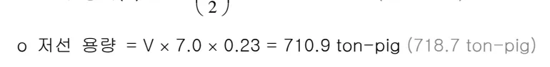

<h2>Page 1</h2>
<h2>1. 적용범위</h2>

감척조업이 완료되어 종풍후 통상의 출선구로 배출될수 없는 노저부의 용용물을 노외로 배출시키는 작업으로써 종풍직전에 행해지는 최종출선과 구별되며, 종풍조업종 철폐개구를 완료하여 종풍직전에 노저연와의 침식 하한선을 추정하여, 노저연와를 Boring 개공하는 임시출선 및 그에 관련된 일련의 작업에 대하여 적용한다.

<h2>2. 목적</h2>

<ul><li>주수냉각시 수성 Gas 발생에 의한 폭발방지</li><li>노저발파 작업물량 최소화</li></ul>

<h2>3. 중점 관리항목 : 해당사항 없음</h2>

<h2>4. 조업기준</h2>

<h3>4.1 노저 출선계획</h3>

<h4>4.1.1 노저출선구 Level 결정</h4>

노저출선구 Level 의 결정은 노저 T/C 온도에 의한 계산으로 노저연와 침식 하한선을 추정한 것이다. (<u>노저연화 잔존 중 가장 얕은 곳을 개공한다.</u>) 통상 노저 침식선의 추정은 RI의 희석분석법과 노저 T/C 온도에 의한 계산외에 해체또는 타고로 실적 예를 참고로 하여 복합적으로 추정 판단하는 것이 일반적이다.

<h4>4.1.2 노저부 잔존연와 및 응고층 추정</h4>

가. 노저 Wall 부 잔존연와 및 응고층 두께 계산식

(1) Wall 부 잔존연와 계산

(가) Mullite 연와 없는 경우

<math display="block">Lx = K4 \times \left( \frac{Tp-Tm}{Tm-Tw} \right) \times \left( \frac{1}{Hw} + \frac{L1}{K1} + \frac{L2}{K2} + \frac{L3}{K3} + \frac{L4}{K4} \right) + L4</math>

뒷 장 계속

<h2>Page 2</h2>
(나) Mullite 연와 있는 경우

<math display="block">L_x = K_6 \times \left[ \left( \frac{T_p - T_m}{T_m - T_w} \right) \times \left( \frac{1}{H_w} + \frac{L_1}{K_1} + \frac{L_2}{K_2} + \frac{L_3}{K_3} + \frac{L_4}{K_4} \right) - \frac{L_5 - L_4}{K_4} \right] + L_4 + L_5</math>

(2) Wall 부 응고층 계산

(가) Mullite 연와 없는 경우

<math display="block">L_s = K_s \times \left[ \left( \frac{T_p - T_c}{T_c - T_w} \right) \times \left( \frac{1}{H_w} + \frac{L_1}{K_1} + \frac{L_2}{K_2} + \frac{L_3}{K_3} + \frac{L_4}{K_4} \right) - \frac{L_x - L_4}{K_4} \right]</math>

(나) Mullite 연와 있는 경우

<math display="block">L_s = K_s \times \left[ \left( \frac{T_p - T_c}{T_c - T_w} \right) \times \left( \frac{1}{H_w} + \frac{L_1}{K_1} + \frac{L_2}{K_2} + \frac{L_3}{K_3} + \frac{L_4}{K_4} \right) - \frac{L_5 - L_4}{K_4} - \frac{L_x - L_4 - L_5}{K_6} \right]</math>

나. 노저 Bottom 부 잔존연와 및 응고층 두께 계산식

(1) Bottom 부 잔존연와 계산

(가) Mullite 연와 없는 경우

<math display="block">L_x = K_4 \times \left( \frac{T_p - T_m}{T_m - T_b} \right) \times \left( \frac{1}{H_b} + \frac{L_6}{K_4} \right)</math>

(나) Mullite 연와 있는 경우

<math display="block">L_x = K_6 \times \left[ \left( \frac{T_p - T_m}{T_m - T_b} \right) \times \left( \frac{1}{H_b} + \frac{L_6}{K_4} \right) - \frac{L_7}{K_4} \right]</math>

뒷 장 계속

<h2>Page 3</h2>
(2) Bottom 부 응고층 계산

(가) Mullite 연와 없는 경우

<math display="block">L_s = K_s \times \left[ \left( \frac{T_p - T_c}{T_c - T_b} \right) \times \left( \frac{1}{H_b} + \frac{L_6}{K_4} \right) - \frac{L_x - L_1}{K_4} \right]</math>

(나) Mullite 연와 있는 경우

<math display="block">L_s = K_s \times \left[ \left( \frac{T_p - T_c}{T_c - T_b} \right) \times \left( \frac{1}{H_b} + \frac{L_6}{K_4} \right) - \frac{L_7}{K_4} - \frac{L_x - L_6 - L_7}{K_6} \right]</math>

※적용 Data

<table><thead><tr><th>기호</th><th>설명</th><th>값</th><th>기호</th><th>설명</th><th>값</th></tr></thead><tbody><tr><td>L1</td><td>Scale 두께</td><td>0.5mm</td><td>K3</td><td>Stamp 열전도율</td><td>6</td></tr><tr><td>L2</td><td>철피 두께</td><td>60</td><td>K4</td><td>Carbon 열전도율</td><td>10</td></tr><tr><td>L3</td><td>Stamp 두께</td><td>100</td><td>K6</td><td>Alumina 열전도율</td><td>2</td></tr><tr><td>L4</td><td>T/C 삽입장</td><td>100,200</td><td>Ks</td><td>응고층 열전도율</td><td>2</td></tr><tr><td>L5</td><td>Wall Carbon 두께</td><td></td><td>Tp</td><td>가동면 온도</td><td>1150,1300°C</td></tr><tr><td>L6</td><td>HB0~HB3 단 거리</td><td></td><td>Tw</td><td>벽부냉각수 온도</td><td>30°C</td></tr><tr><td>L7</td><td>HB3~Alumina 거리</td><td></td><td>Tb</td><td>Cooling Pipe 냉각수 온도</td><td>30°C</td></tr><tr><td>K1</td><td>Scale 열전도도</td><td>1.25 kcal/m hr °C</td><td>Hw</td><td>벽부냉각수 열전달계수</td><td>6000 kcal/m2hr °C</td></tr><tr><td>K2</td><td>철피 열전도율</td><td>45</td><td>Hb</td><td>Cooling Pipe 열전달계수</td><td>30</td></tr></tbody></table>
<a href="components/TP-030-100-040 노저 출선작업 기술기준(Rev.9)_0900bf4ba7a2be00_usr0000bf4b95f9e446_p003_table_01.png">Table snapshot</a>

4.1.3 노저 저선량 계산 (예: 포항 3 고로)

노저연와 침식선을 기준으로 노저개공 위치를 설정하여, 노저부 용적을 계산하여 저선량을 추정하며, 노저 출선량은 출선구 심도에 따라 다소의 차가 있으므로 임시 출선구 별로 노저 출선량을 추산한다

○ 포항 3 고로 노저개공 실적

<table><thead><tr><th>노저개공위치</th><th>개공심도</th><th>비고</th></tr></thead><tbody><tr><td>GL+10,700mm</td><td>3,000mm</td><td>105°방향</td></tr><tr><td>GL+7,800mm</td><td>4,000m</td><td>15°방향</td></tr><tr><td>GL+7,600mm</td><td>3,000mm</td><td>15°방향</td></tr></tbody></table>
<a href="components/TP-030-100-040 노저 출선작업 기술기준(Rev.9)_0900bf4ba7a2be00_usr0000bf4b95f9e446_p003_table_02.png">Table snapshot</a>

<h2>Page 4</h2>

가. 노저 저선량 계산

o A = 출선구 Center ~ 심도 끝부분

- 심도 3000mm 경우 = 520.9 mm (심도 2800mm 경우 = 486.2 mm)

o B = 심도 끝부분~ HW2 최초연와

<math display="block">= (\text{출선구 Center} \sim \text{HW2}) - A</math>

<math display="block">= 2859.3 - 520.9</math>

<math display="block">= 2338.4 \text{ mm} (2373.1\text{mm})</math>

o C = (HW2 최초연와 ~ 노저침식선:252°방향 계산값 적용)

o H = B + C

<math display="block">= 2338.4 + 831 = 3169.4 \text{ mm} (3204.1\text{mm})</math>

o D = 노저벽부 Mullite 연와 마모 가정한 노저부 직경 = 13320 mm

<math display="block">o \text{ 노저 용적}(V) = \pi \times \left(\frac{D}{2}\right)^2 \times H = 441.6 \text{ m}^3 (446.4 \text{ m}^3)</math>

<math display="block">o \text{ 저선 용량} = V \times 7.0 \times 0.23 = 710.9 \text{ ton-pig} (718.7 \text{ ton-pig})</math>

[표. 타고로 공극률 적용 비교]

<table><thead><tr><th>구분</th><th>P3R2계획</th><th>P4R1</th><th>P2R1</th><th>G1R1</th><th>G2R1</th></tr></thead><tbody><tr><td>예상출선량</td><td>710.7</td><td>136톤</td><td>333톤</td><td>736톤</td><td>667톤</td></tr><tr><td>적용공극율</td><td>1/4.33</td><td>1/4.33</td><td>1/4.33</td><td>1/4.33</td><td>1/4.33</td></tr><tr><td>실적출선량</td><td>-</td><td>115톤</td><td>300톤</td><td>772톤</td><td>1042톤</td></tr></tbody></table>
<a href="components/TP-030-100-040 노저 출선작업 기술기준(Rev.9)_0900bf4ba7a2be00_usr0000bf4b95f9e446_p004_table_01.png">Table snapshot</a>

[그림. 노저출선 예상량 계산을 위한 모식도]

<h2>Page 5</h2>
<h4>4.1.4 노저출선 개공위치 선정 및 잔선수선 방법</h4>

최초 노저출선 개공위치는 노중심에서의 응고층 두께를 감안하여 개공을 실시하고 용선이 나오지 않을 시는 최초 노저 개공위치보다 상부에 개공을 실시한다.

가. 개공위치 선정시 고려사항

<ol><li>통상의 길이가 짧고 설치가 용이한 곳</li><li>통 설치에 따른 장애물이 적은 곳</li><li>작업조건을 고려하여 위치를 선정.</li><li>Dry-Pit에 의한 잔선처리의 경우, 4 본주와 간섭이 안되도록 피하고, 노저하부 장애물이 적은 방향으로 하여 임시 출선구에서 Dry-Pit까지 잔선통 길이가 짧은 쪽을 선택하는 것이 바람직하다.</li></ol>

나. 잔선 수선방법 (예:포항 3고로)

<ul><li><math>105^{\circ}</math>(열풍로광장), <math>240^{\circ}</math>, <math>270^{\circ}</math>(Dry Pit) 세 방향을 기본으로 사처리하여 노저출선한다.</li><li>3번 Dry Pit를 사처리 공간으로 사용하되 대 Block 공법을 위한 공간에 간섭이 충분히 되지 않게 벽을 설치한다.</li><li>Dry Pit에 모래사장을 달걀판 모양으로 제작하여 용선의 흐름을 조절한다.</li><li>각 지통부에는 산을 만들고 1번 Stopper를 해체하면 다음 2번 Stopper 부에 용선이 고인후 지통으로 흐르는 방법으로 실시한다</li></ul>

[그림.임시탕도 Layout]

<h2>Page 6</h2>
※ 노저 잔선 수선방법

<table><thead><tr><th>구분</th><th>장 단 점</th><th>비 고</th></tr></thead><tbody><tr><td>Ladle 수선</td><td><ul><li>용선처리가 용이</li><li>노저출선→Ladle 수선→타고로차입(Mixing)→제강이송</li><li>임시출선구 및 탕도설치를 위한 사전작업이 필요</li><li>고로노저 구조상 Ladle 수선을 위해서는 탕도거리가 너무 길고 경사각이 적어 탕도내의 용용물 응고 가능성이 높아 Over Flow 에 의한 대형사고 위험성이 높음</li></ul></td><td>
P2R1 P3R1 적용
</td></tr><tr><td>D/P 수선</td><td><ul><li>임시출선구 및 탕도설치를 위한 사전작업이 필요</li><li>Dry-Pit 에 수선하므로 우천시 대비가 필요</li><li>노저 임시출선구 방향이 제한</li><li>작업부하 및 사고발생등을 고려할 때 Ladle 수선보다 유리함</li><li>용선처리</li><li>노저출선→Dry-Pit 수선→파쇄→형선으로 사용</li></ul></td><td>
P1R1 P1R2 P4R1 적용
</td></tr><tr><td>노저 발파</td><td><ul><li>사전작업에 의한 설비휴지 불필요</li><li>정확한 침식 Line 추정공란에 따른 문제점 없음</li><li>발파 기술상의 문제점</li><li>해체 공정상의 경제적, 시간적 유, 불리에 대해 불명확</li></ul></td><td>
노저발파를 행한 고로는 주로 개수후 Stand-By 나 폐쇄 고로를 대상으로 실시하였음(日本)
</td></tr></tbody></table>
<a href="components/TP-030-100-040 노저 출선작업 기술기준(Rev.9)_0900bf4ba7a2be00_usr0000bf4b95f9e446_p006_table_01.png">Table snapshot</a>

4.1.5 노저출선 개공 기술

일발개공기를 이용하여 노내에 잔존하는 연와 및 부착층을 개공할 수 있는 Bit 를 각각 사용하여 아래 개공 순서에 맞게 개공을 실시한다.

가. 개공 순서 (예 포함 4 고로)

(1) Core Drill Bit 를 이용하여 연와를 단계적으로 개공한다. 개공후 측온을 하여 400~500℃가 되면 연와 개공 완료로 판단한다. (연와 개공 깊이 1300 ~ 2000mm) 만약 개공이 불가능할 경우 개공 위치를 한단계 올려서 동일한 방법으로 개공한다.

<h2>Page 7</h2>

(2) 부착총 개공용 일발 Drill Bit 로 교체하여 부착총을 단계적으로 개공한다. 개공후 측온을 하여 <math>800^{\circ}\mathrm{C}</math>가 되면 부착총 개공 완료로 판단한다. (부착총 개공 깊이 <math>500 \sim 1000\mathrm{mm}</math>) 만약, 일발 개공이 불가능할 경우 바로 산소 개공을 실시한다.

(3) 일발개공한 부위의 온도가 <math>800^{\circ}\mathrm{C}</math>가 되면 일발개공기를 취외하고, 제강용 산소 Pipe 를 이용하여 산소 개공하여 노저출선 개공을 완료한다. (산소 Pipe 3~5ea 사용)

※ 노저출선 개공 Flow

Flowchart illustrating the drilling and oxygen lance process:
<ol><li>Start: Core Drill Bit 이용 (GL 7300→7900)</li><li>Condition: Carbon Drilling 깊이: 1300~2000mm</li><li>Decision Point 1: 완료기준: <math>400 \sim 500^{\circ}\mathrm{C}</math> (Core Drill 불가)</li><ul><li>If No (Not met): Loop back to Core Drill Bit 이용.</li><li>If Yes (Met): Proceed to next step.</li></ul><li>Proceed to: 일발 Drill Bit 이용 (GL 7300→7900)</li><li>Condition: 부착총 Drilling 깊이: <math>500 \sim 1000\mathrm{mm}</math></li><li>Decision Point 2: 완료기준: <math>800^{\circ}\mathrm{C}</math></li><ul><li>If Yes (Met): Proceed to next step.</li><li>If No (Not met): Loop back to 일발 Drill Bit 이용.</li></ul><li>Proceed to: <math>\mathrm{O}_2</math> Lancing 실시 (GL 7300→7900)</li><li>Decision Point 3: 출선 성공</li><ul><li>If No (Not successful): Loop back to <math>\mathrm{O}_2</math> Lancing 실시.</li><li>If Yes (Successful): End.</li></ul></ol>

5. 이상판단 및 조치기준 : 해당사항 없음

‘끝.’

이 하 여 백
