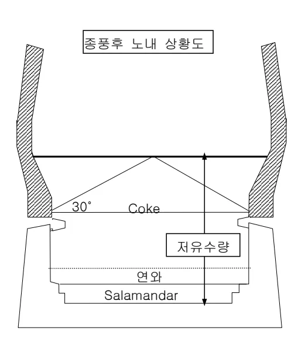
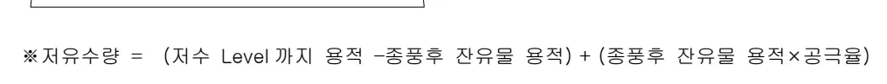
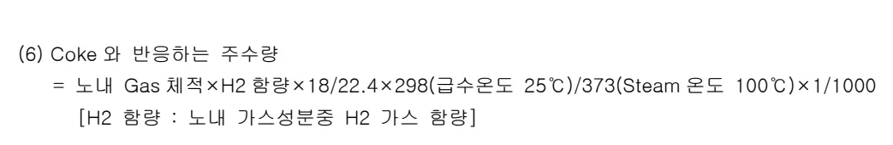
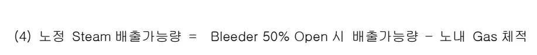
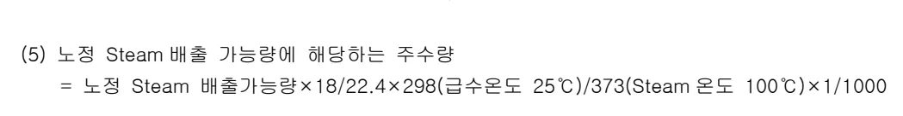
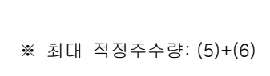
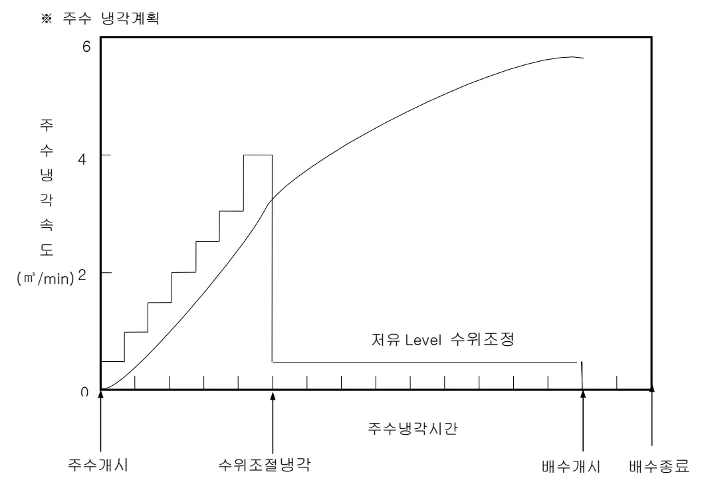

<h2>Page 1</h2>
<h1>1. 적용범위</h1>

노저출선이 완료된 후 고로를 몰로써 냉각시키는 작업인 주수냉각 작업에 대하여 적용한다

<h1>2. 목적</h1>

노저출선이 완료된 후 고로내에 들어있는 적열상태의 COKE, 내화물, 노저연와 및 잔설등 내용물을 충분히 냉각시켜 내용물 소출작업, 연와해체작업, 노저발파, 제거작업 등을 신속, 용이하고 안전하게 행하기 위하여 실시한다.

<h1>3. 중점관리 항목 : 해당사항 없음</h1>

<h1>4. 조업 기준</h1>

<h2>4.1 조업관리 기준</h2>

<h3>4.1.1 주수완료 판단기준 (포항 3 고로)</h3>

<table><thead><tr><th rowspan="2">구분</th><th colspan="2">노내 Gas 성분</th><th rowspan="2">노정 증기압</th><th rowspan="2">배수온도</th></tr><tr><th>H2</th><th>CO</th></tr></thead><tbody><tr><td>주수완료 판단조건</td><td>0% 이하</td><td>2%이하</td><td>“0”mmAq</td><td>70℃이하</td></tr></tbody></table>
<a href="components/TP-030-100-050 주수 냉각작업 기술기준(Rev.9)_0900bf4ba7a451db_usr0000bf4b95f9e446_p001_table_01.png">Table snapshot</a>

<h3>4.1.2 냉각시 고려사항</h3>

가. 주수냉각시 노내압력은 외부공기의 흡입으로 인한 노내 Gas 폭발을 방지하기 위하여 노내압을 정압(+압)으로 유지하여야 함.

나. 노내 저수 Level은 배수처리량을 최소화하기 위하여 잔유물 직상부까지로 함.

다. 주수냉각의 완료판단은 노정발생 증기압 “0”, 풍구배수 온도 70℃이하, 발생 Gas 성분은 폭발한계 범위외의 농도를 기준으로 함, (H2 ≤ 2%, CO ≤ 4%)

라. 노내 압력조정은 Manometer 에서 압력을 감시하며, 항상 정압(+압) 유지가 가능하도록 노정 Bleeder 를 조정한다.

뒷 장 계속

<h2>Page 2</h2>
4.1.3 주수량 검토

가. 냉각물의 소요열량

<table><thead><tr><th rowspan="2">구분</th><th colspan="2">냉각전</th><th colspan="2">냉각후</th></tr><tr><th>온도 (°C)</th><th>비열 (kcal/°C)</th><th>온도 (°C)</th><th>비열 (kcal/°C)</th></tr></thead><tbody><tr><td>연와</td><td>800</td><td>256</td><td>70</td><td>202</td></tr><tr><td>Coke</td><td>1,500</td><td>400</td><td>70</td><td>150</td></tr><tr><td>Salamandar</td><td>1,200</td><td>300</td><td>70</td><td>300</td></tr></tbody></table>
<a href="components/TP-030-100-050 주수 냉각작업 기술기준(Rev.9)_0900bf4ba7a451db_usr0000bf4b95f9e446_p002_table_01.png">Table snapshot</a>

<math display="block">* \text{소요열량 계산식} = \text{냉각물 중량}(T) \times [( \text{냉각전온도} \times \text{비열}) - (\text{냉각후 온도} \times \text{비열})]</math>

나. 주수총량 산출

<math display="block">* \text{주수 총량} = \text{저유수량} + \text{연와 및 Coke 흡습수량} + \text{누수량} + \text{증발수량}</math>

(1) 저유수량 산출식

도면 설명: Coke가 연와와 Salamandar 사이에 30도 각도로 위치하고 있다. Coke는 저유수량과 연와, Salamandar에 연결되어 있다. 상단에는 '종풍후 노내 상황도'가 표시되어 있다.

*전제 조건

<table><thead><tr><th>구분</th><th>공극율 (%)</th><th>비중</th></tr></thead><tbody><tr><td>Coke</td><td>30</td><td>0.50</td></tr><tr><td>Salamandar</td><td>5</td><td>3.34</td></tr></tbody></table>
<a href="components/TP-030-100-050 주수 냉각작업 기술기준(Rev.9)_0900bf4ba7a451db_usr0000bf4b95f9e446_p002_table_02.png">Table snapshot</a>

<math display="block">* \text{저유수량} = (\text{저수 Level 까지 용적} - \text{종풍후 잔유물 용적}) + (\text{종풍후 잔유물 용적} \times \text{공극율})</math>

<h2>Page 3</h2>
(2) 연와,Coke 의 흡습수량 산출식

<math display="block">\text{※ 흡습수량} = (\text{연와중량} + \text{잔유 Coke 중량}) \times \text{흡습율} [\text{흡습율}: 10\%]</math>

(3) 누수량 산출식

<math display="block">\text{※ 누수량} = (\text{저유수량} + \text{흡습수량}) \times \text{누수율} [\text{누수율}: 15\%]</math>

(4) 증발수량 산출식

<math display="block">\text{※ 증발수량} = \left[ \text{총소요열량} - \left[ \text{저유수량} \times (100 - \text{급수온도}) \times \text{물의비열} \right] \right. \\ \left. + \left[ 539 + (100 - \text{급수온도}) \right] \times \text{물의비열} \right]</math>

<math display="block">= \text{총수량} - (\text{저유수량} + \text{흡습수량} + \text{누수량})</math>

4.1.4 주수속도 검토

가. 초기 주수속도 계산

초기 주수냉각은 급격한 수성 Gas의 반응을 피하기 위해 주수속도를 최저로 관리하며, 이후로 단계적으로 주수속도를 상승시킴.

<math display="block">(1) \text{ Steam 배출속도} = \sqrt{2 \times \text{중력 가속도} \times \text{Steam 노정압력}/\text{Steam 비중}}</math>

<math display="block">(2) \text{ Bleeder } 50\% \text{ Open 시 배출가능량} = \text{Bleeder 단면적} \times \text{유량계수} \times \text{Steam 배출속도}</math>

<math display="block">(3) \text{ 노내 Gas 체적} = \text{질소 취입량}/\text{질소분율}</math>

<math display="block">(4) \text{ 노정 Steam 배출가능량} = \text{Bleeder } 50\% \text{ Open 시 배출가능량} - \text{노내 Gas 체적}</math>

<math display="block">(5) \text{ 노정 Steam 배출 가능량에 해당하는 주수량} \\ = \text{노정 Steam 배출가능량} \times 18/22.4 \times 298(\text{급수온도 } 25^{\circ}\text{C})/373(\text{Steam 온도 } 100^{\circ}\text{C}) \times 1/1000</math>

<math display="block">(6) \text{ Coke 와 반응하는 주수량} \\ = \text{노내 Gas 체적} \times \text{H2 함량} \times 18/22.4 \times 298(\text{급수온도 } 25^{\circ}\text{C})/373(\text{Steam 온도 } 100^{\circ}\text{C}) \times 1/1000 \\ [\text{H2 함량} : \text{노내 가스성분중 H2 가스 함량}]</math>

<math display="block">\text{※ 초기 적정주수량} = (5) + (6)</math>

<h2>Page 4</h2>
<math display="block">(1) \text{ Steam 배출속도} = \sqrt{2 \times \text{중력 가속도} \times \text{Steam 노정압력}/\text{Steam 비}}\end{math&gt;</math>

<math display="block">(2) \text{ Bleeder } 100\% \text{ Open 시 배출가능량} = \text{단면적} \times \text{유량계수} \times \text{Steam 배출속도}</math>

<math display="block">(3) \text{ 노내 Gas 체적} = \text{질소 취입량}/\text{질소분율}</math>

<math display="block">(4) \text{ 노정 Steam 배출가능량} = \text{Bleeder } 50\% \text{ Open 시 배출가능량} - \text{노내 Gas 체적}</math>

<math display="block">(5) \text{ 노정 Steam 배출 가능량에 해당하는 주수량} \\ = \text{노정 Steam 배출가능량} \times 18/22.4 \times 298(\text{급수온도 } 25^\circ\text{C})/373(\text{Steam 온도 } 100^\circ\text{C}) \times 1/1000</math>

<math display="block">(6) \text{ Coke 와 반응하는 주수량} \\ = \text{노내 Gas 체적} \times \text{H}_2 \text{ 함량} \times 18/22.4 \times 298(\text{급수온도 } 25^\circ\text{C})/373(\text{Steam 온도 } 100^\circ\text{C}) \times 1/1000 \\ [\text{H}_2 \text{ 함량} : \text{노내 가스성분중 H}_2 \text{ 가스 함량}]</math>

<math display="block">\text{※ 최대 적정주수량: } (5)+(6)</math>

<h4>4.1.5 주수냉각 계획</h4>

익주현상(益注現象)으로 인해서 고로의 상부로부터 물이 강하할 때 하부로부터 올라오는 Steam 의 압력에 의해 수직으로 분산되어 냉각수의 이용율이 저하하므로 초기 주수시에는 益注点 이하에서 주수를 개시하며, 초기 적정주수량이내 범위에서 시작하여 단계적으로 주수 속도를 증가시켜 최대 주수속도에 도달토록 계획을 한다.

뒷 장 계속

<h2>Page 5</h2>

※ 주수 냉각계획

Graph showing the water cooling schedule (주수 냉각계획). The Y-axis represents Water Cooling Rate (주수 냉각 속도) in <math>m^3/min</math>, ranging from 0 to 6. The X-axis represents Time (주수 냉각 시간), divided into stages by arrows indicating Water Level Adjustment Rate (수위조절냉각) and Water Discharge Rate (배수종료). The graph illustrates a stepwise increase in cooling rate followed by a constant rate, reaching a steady state labeled '저유 Level 수위조정' (Low Level Water Level Adjustment). Key points marked are Water Inlet Time (주수개시), Water Level Adjustment Rate (수위조절냉각), Water Discharge Start Time (배수개시), and Water Discharge End Time (배수종료).

<h4>4.1.6 주수냉각수 처리방법</h4>

가. 주수개시전 Thickener 1기를 비워서 노내 저류수 배수는 풍구에서 Thickener로 유도함

나. 배수시 수질오염 방지를 위해 Thickener에 집수후 Vacuum Car를 이용하여 원료 Yard에 살포.

<h4>5. 이상판단 및 조치기준 : 해당사항 없음</h4>

‘끝.’

이 하 여 백
