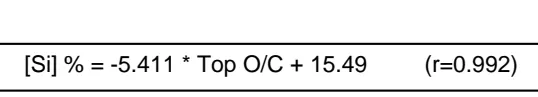
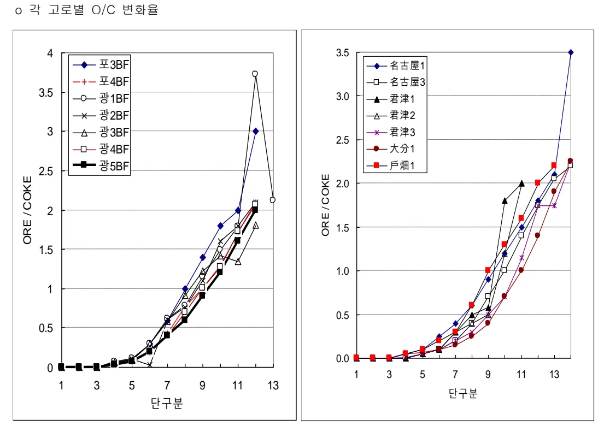
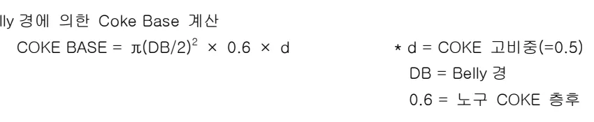
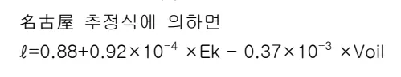

<h2>Page 1</h2>
<h1>1. 적용범위</h1>

고로 화입후 원활한 조기 조업도 상승과 승온과정 중의 노체보호 및 노열확보를 위한 사전 장입물 충진 작업의 작업기준과 관리방안 및 조치수순에 대하여 적용한다.

<h2>2. 목 적</h2>

<ul><li>충분한 화입 Coke 장입으로 노내 장입물 및 노체의 조기승온,노열의 조기확보</li><li>적정 Slag Volume 확보로 노벽연와 손상 방지</li><li>Slag 유동성 확보(저 염기도, 저 <math>Al_2O_3</math>)에 의한 순조로운 출선, 출재작업 도모</li><li>적정 장입물 분포로 노내 Gas류 안정 유지 및 조기 조업도 상승</li><li>노내 평균 O/C 및 Top O/C 적정화로 초출선후 제강선으로의 조기 이행</li></ul>

<h2>3. 중점관리 항목 : 해당사항 없음</h2>

<h2>4. 조업기준</h2>

<h3>4.1 충진조업기준 및 관리항목</h3>

<h4>4.1.1 초탕[Si] 목표</h4>

화입후 원활한 용융물 생성 및 강화에 의한 안정적 조업도 상승을 위해 노저 및 노체연와, 충진 장입물의 조기승열을 위한 충분한 노열확보가 요구된다.

초탕시의 노열 평가방법으로서 [Si]과 용선온도가 있지만 화입조기 용선온도는 노저연와에 열을 빼앗긴 상태이므로 충분한 평가방법이 되지 못하기 때문에 [Si]으로 평가하는 것이 일반적이다.

초탕[Si]는 화입 후 축열의 기준이 되기 때문에 조기승온을 위해서는 높은쪽이 바람직하나, 너무 높으면 고[Si]용선 상태가 장기간 지속되어 용선처리 부하 및 출선재 작업이 어렵게 되므로 이를 고려하여 조기 노열목표의 설정이 필요하다.

<h4>4.1.2 충진평균 O/C</h4>

충진시의 평균 O/C는 화입용 Coke(Bed+승열용)량과 Top O/C가 결정되면 대략 그 범위가 결정 되나, 충진시의 장입물은 초탕 용선[Si]과는 밀접한 관계가 있으므로 초탕목표 용선[Si]과 충진평 균 O/C와의 통계분석 및 안정적 승온을 고려하여 계획을 수립한다.

뒷 장 계 속

<h2>Page 2</h2>
o 초탕 [Si]와 총진평균 O/C 와의 관계 (내용적 3,000 <math>\text{Nm}^3</math> 이상)

Scatter plot showing the relationship between Total Si Content (초탕 [Si] (%)) on the x-axis (ranging from 3% to 8%) and Total O/C Ratio (총진평균 O/C) on the y-axis (ranging from 0.3 to 0.5). The regression equation is <math>y = -0.0054x^2 + 0.028x + 0.4136</math> with <math>R^2 = 0.612</math>.

o 고로별 초탕 [Si]실적

<table><thead><tr><th rowspan="2">구분</th><th rowspan="2">내용적 (<math>\text{m}^3</math>)</th><th rowspan="2">평균 O/C</th><th colspan="2">초탕 [Si] (%)</th></tr><tr><th>계획</th><th>실적</th></tr></thead><tbody><tr><td rowspan="6">포항</td><td>P2R3</td><td>2,550</td><td>0.440</td><td>5.5</td><td>8.4</td></tr><tr><td>P3R1</td><td>3,795</td><td>0.400</td><td>4.0</td><td>7.00</td></tr><tr><td>P4R1</td><td>3,795</td><td>0.450</td><td>4.0</td><td>4.63</td></tr><tr><td>P3R2</td><td>4,350</td><td>0.220</td><td>7.5</td><td>8.6</td></tr><tr><td>P4R2</td><td>5,600</td><td>0.231</td><td>7.5</td><td>5.5</td></tr><tr><td><u>P3R3</u></td><td><u>5,600</u></td><td><u>0.210</u></td><td><u>7.5</u></td><td><u>6.7</u></td></tr><tr><td rowspan="10">광양</td><td>G5R1</td><td>5,500</td><td>0.377</td><td>5.0</td><td>7.1</td></tr><tr><td>G1BF</td><td>3,800</td><td>0.424</td><td>4.0</td><td>3.54</td></tr><tr><td>G2BF</td><td>3,800</td><td>0.390</td><td>4.0</td><td>3.95</td></tr><tr><td>G3BF</td><td>3,800</td><td>0.330</td><td>4.0</td><td>3.97</td></tr><tr><td>G4BF</td><td>3,800</td><td>0.347</td><td>4.0</td><td>7.13</td></tr><tr><td>G5BF</td><td>3,950</td><td>0.370</td><td>5.0</td><td>5.4</td></tr><tr><td>G1R1</td><td>3,950</td><td>0.297</td><td>5.0</td><td>8.08</td></tr><tr><td>G2R1</td><td>4,350</td><td>0.224</td><td>7.5</td><td>4.56</td></tr><tr><td>G3R1</td><td>4,600</td><td>0.148</td><td>7.5</td><td>8.96</td></tr><tr><td>G4R1</td><td>5,500</td><td>0.36</td><td>7.5</td><td>4.0</td></tr><tr><td rowspan="2">인니</td><td>G1R2</td><td>6,000</td><td>0.41</td><td>6.0</td><td>4.5</td></tr><tr><td>PT.KP 1BF</td><td>3,800</td><td>0.298</td><td>7.5</td><td>-</td></tr></tbody></table>
<a href="components/TP-030-110-050 장입물 충진작업 기준(Rev.9)_0900bf4ba7a62154_usr0000bf4b95f9e446_p002_table_01.png">Table snapshot</a>

뒷 장 계속

<h2>Page 3</h2>
<h3>4.1.3 총진 단구분</h3>

종래의 실적에 의하면 1 단은 침목적, 2 단은 Bosh, 3 단은 Belly 로 하고, 이후는 등고로 하거나 등장입 횟수로 하는 것이 통례적이다.

○ 고로별 총진단구분 실적

<table><thead><tr><th>구분</th><th>HEARTH</th><th>BOSH</th><th>BELLY</th><th>SHAFT</th></tr></thead><tbody><tr><td>戶畑 1BF 2BF</td><td>제 1 단</td><td>제 2 단</td><td>3 단</td><td>6CH 마다 분할</td></tr><tr><td>君津 1BF 2BF 3BF 堺 2BF</td><td></td><td></td><td></td><td></td></tr><tr><td>洞岡 4BF 포항 1BF 1BF(R1) 1BF(R2) 2BF 2BF(R1) 2BF(R2) 3BF 3BF(R1) 3BF(R2) 4BF 4BF(R1) FBF 신 FBF</td><td></td><td></td><td></td><td></td></tr><tr><td>광양 1BF 2BF 3BF 4BF 5BF</td><td></td><td></td><td></td><td>2m 등고로 분할</td></tr></tbody></table>
<a href="components/TP-030-110-050 장입물 충진작업 기준(Rev.9)_0900bf4ba7a62154_usr0000bf4b95f9e446_p003_table_01.png">Table snapshot</a>

<h2>Page 4</h2>
4.1.4 Top O/C 및 O/C 변화율

가. Top O/C

추진시 Top O/C는 초기 조업도 상승 Pattern 과 관계가 있다.

최근고로는 Hearth 부 용적이 차지하는 비율이 점점 커지고 있기 때문에, 노하부의 장입비율을 크게 하고 Top O/C를 높이는 경향이 있다.

즉, Coke 를 하부는 두텁게, 상부는 얇게 분포시켜 조기에 노저에 열을 가하는 방법이 지배적이다.

Top O/C 가 너무 높으면 노저, 노체에 완전히 열이 불기전에 열 Level 을 저하시킬 우려가 있으며, 너무 낮으면 과도한 노열상승으로 출선타업이 문제가 된다.

o 고로별 화입시 Top O/C 실적

<table><thead><tr><th>구분</th><th>화입일</th><th>내용적(m3)</th><th>TOP O/C</th></tr></thead><tbody><tr><td>君津 2BF</td><td>'82. 2.</td><td>2,884</td><td>2.20</td></tr><tr><td>3BF</td><td>'86. 4.17</td><td>4,063</td><td>2.10</td></tr><tr><td>名古屋 1BF</td><td>'79. 3.</td><td>3,890</td><td>2.35</td></tr><tr><td>3BF</td><td>'84.12. 6</td><td>3,424</td><td>2.20</td></tr><tr><td>堺 2BF</td><td>'84. 4.</td><td>2,797</td><td>2.25</td></tr><tr><td>戸畑 1BF</td><td>'85.12.</td><td>4,407</td><td>2.15</td></tr><tr><td>4BF</td><td>'78. 7.</td><td>4,250</td><td>2.00</td></tr><tr><td>포항 1BF</td><td>'73. 6. 8</td><td>1,660</td><td>1.90</td></tr><tr><td>1BF(R1)</td><td>'79. 9.27</td><td>1,660</td><td>2.00</td></tr><tr><td>1BF(R2)</td><td>'93. 2.26</td><td>1,660</td><td>2.00</td></tr><tr><td>2BF</td><td>'76. 5.31</td><td>2,254</td><td>2.00</td></tr><tr><td>2BF(R1)</td><td>'83. 5.25</td><td>2,550</td><td>2.00</td></tr><tr><td>2BF(R2)</td><td>'96. 8. 5</td><td>2,550</td><td>2.00</td></tr><tr><td><u>2BF(R3)</u></td><td><u>'15.5.12</u></td><td><u>2,550</u></td><td><u>2.10</u></td></tr><tr><td>3BF</td><td>'78.12. 8</td><td>3,795</td><td>2.00</td></tr><tr><td>3BF(R1)</td><td>'89. 1.23</td><td>3,795</td><td>2.15</td></tr><tr><td>3BF(R2)</td><td>'06. 5.4</td><td>4,350</td><td>2.10</td></tr><tr><td><u>3BF(R3)</u></td><td><u>'17.6.6</u></td><td><u>5,600</u></td><td><u>2.10</u></td></tr><tr><td>4BF</td><td>'81. 2.18</td><td>3,795</td><td>2.00</td></tr><tr><td>4BF(R1)</td><td>'94. 7.19</td><td>3,795</td><td>2.10</td></tr><tr><td><u>4BF(R2)</u></td><td><u>'10.10.8</u></td><td><u>5,600</u></td><td><u>2.10</u></td></tr></tbody></table>
<a href="components/TP-030-110-050 장입물 충진작업 기준(Rev.9)_0900bf4ba7a62154_usr0000bf4b95f9e446_p004_table_01.png">Table snapshot</a>

뒷 장 계속

<h2>Page 5</h2>
<table><tr><td>광양 1BF</td><td>'87.4.24</td><td>3,800</td><td>2.12</td></tr><tr><td>2BF</td><td>'88.7.12</td><td>3,800</td><td>2.10</td></tr><tr><td>2BF (R1)</td><td>'05.5.20</td><td>4,350</td><td>2.10</td></tr><tr><td>3BF</td><td>'90.12.4</td><td>3,800</td><td>2.10</td></tr><tr><td>4BF</td><td>'92.9.25</td><td>3,800</td><td>2.07</td></tr><tr><td>5BF</td><td></td><td>4,020</td><td>2.00</td></tr></table>
<a href="components/TP-030-110-050 장입물 충진작업 기준(Rev.9)_0900bf4ba7a62154_usr0000bf4b95f9e446_p005_table_01.png">Table snapshot</a>

최근 화입고로들은

<ul><li>제강선으로의 조기이행</li><li>노정온도의 과다상승 억제(특히 Bell-Less 고로는 노정 장입설비 보호측면)</li><li>화입초기 조업도 조기상승을 위한 급속한 증광 Pitch 를 피할 수 있도록 Top O/C 를 2.1 이상으로 하는 경우가 많다.</li><li>Top O/C 와 초탕 [Si]과의 관계식 [君津 2 고로]</li></ul>

<math display="block">[	ext{Si}] 	ext{ }	ext{\%} = -5.411 	imes 	ext{Top O/C} + 15.49 	ext{ } (r=0.992)</math>

나. O/C 변화율

<ul><li>기본개념</li></ul>

노내 O/C 분포변화는 노하부 승열을 가능한 빠르게 하여 Slag 가 용용적 과정에서 응고하지 않도록 하고, 그 후는 서서히 광석을 용해시킴으로서 용착대를 형성시켜 노내 정상 Profile 을 조기에 확보할 수 있도록 분포시킨다.

<ul><li>O/C 변화율</li></ul>

화입송풍 후 조기에 확실한 노열확보 및 노채연와, 장입물의 승열이 완료될 때까지 용용물적하를 최소화하도록 화입용 Coke 40~50%를 O/C 0 으로 하고, 나머지를 O/C 1.0 미만에 분포시키는 것이 지배적이다.

뒷 장 계 속

<h2>Page 6</h2>
o 포항고로 O/C 변화율 실적

<table><thead><tr><th rowspan="2">구분</th><th colspan="2">포항 2BF(R1)</th><th colspan="2">포항 3BF(R1)</th><th colspan="2">포항 4BF(R1)</th><th colspan="2">포항 2BF(R2)</th><th colspan="2">포항 3BF(R2)</th></tr><tr><th>O/C</th><th>Ch(No.)</th><th>O/C</th><th>Ch(No.)</th><th>O/C</th><th>Ch(No.)</th><th>O/C</th><th>Ch(No.)</th><th>O/C</th><th>Ch(No.)</th></tr></thead><tbody><tr><td>14 단</td><td>-</td><td>-</td><td>-</td><td>-</td><td>-</td><td>-</td><td>-</td><td>-</td><td>-</td><td>-</td></tr><tr><td>13 단</td><td>-</td><td>-</td><td>-</td><td>-</td><td>-</td><td>-</td><td>-</td><td>-</td><td>-</td><td>-</td></tr><tr><td>12 단</td><td>2.03</td><td>1(68)</td><td>3.0</td><td>1(56)</td><td>2.10</td><td>2(58)</td><td>2.0</td><td>2(61)</td><td>2.10</td><td>1(64)</td></tr><tr><td>11 단</td><td>3.40 1.80</td><td>1(67) 2(66)</td><td>2.0</td><td>2(55)</td><td>1.72</td><td>2(56)</td><td>1.9</td><td>2(59)</td><td>1.60</td><td>1(63)</td></tr><tr><td>10 단</td><td>1.62</td><td>4(64)</td><td>1.8</td><td>1(53)</td><td>1.30</td><td>3(54)</td><td>1.7</td><td>3(57)</td><td>1.20</td><td>2(62)</td></tr><tr><td>9 단</td><td>1.66</td><td>4(60)</td><td>1.4</td><td>3(52)</td><td>1.01</td><td>3(51)</td><td>1.4</td><td>3(54)</td><td>0.90</td><td>3(60)</td></tr><tr><td>8 단</td><td>1.01</td><td>4(56)</td><td>1.0</td><td>4(49)</td><td>0.77</td><td>4(48)</td><td>1.0</td><td>4(51)</td><td>0.60</td><td>3(57)</td></tr><tr><td>7 단</td><td>0.69</td><td>5(52)</td><td>0.6</td><td>4(45)</td><td>0.43</td><td>4(44)</td><td>0.6</td><td>4(47)</td><td>0.40</td><td>4(54)</td></tr><tr><td>6 단</td><td>0.24</td><td>6(47)</td><td>0.3</td><td>5(41)</td><td>0.18</td><td>5(40)</td><td>0.3</td><td>5(43)</td><td>0.20</td><td>6(50)</td></tr><tr><td>5 단</td><td>0.20</td><td>7(41)</td><td>0.1</td><td>5(36)</td><td>0.07</td><td>6(35)</td><td>0.1</td><td>6(38)</td><td>0.07</td><td>7(44)</td></tr><tr><td>4 단</td><td>0.05</td><td>7(34)</td><td>0.05</td><td>6(31)</td><td>0.04</td><td>6(29)</td><td>0.05</td><td>7(32)</td><td>0.03</td><td>7(37)</td></tr><tr><td>3 단</td><td>0</td><td>12(27) )</td><td>0</td><td>10(25) )</td><td>0</td><td>10(23) )</td><td>0</td><td>11(25)</td><td>0</td><td>13(30)</td></tr><tr><td>2 단</td><td>0</td><td>15(15) )</td><td>0</td><td>15(15) )</td><td>0</td><td>13(13) )</td><td>0</td><td>14(14)</td><td>0</td><td>17(17)</td></tr><tr><td>1 단</td><td colspan="10">점 목 적</td></tr><tr><td>C.B(T/Ch)</td><td>15</td><td></td><td>25</td><td></td><td>25</td><td></td><td>17 25.0</td><td></td><td>27</td><td></td></tr><tr><td>평균 O/C</td><td>0.45</td><td></td><td>0.40</td><td></td><td>0.362</td><td></td><td>0.365 0.338</td><td></td><td>2.10</td><td></td></tr><tr><td>화입용 Coke(T)</td><td>770</td><td></td><td>1160</td><td></td><td>1275</td><td></td><td>867 1375</td><td></td><td>102 1623</td><td></td></tr><tr><td>내용적(<math>\text{m}^3</math>)</td><td>2550</td><td></td><td>3795</td><td></td><td>3795</td><td></td><td>2550 4020</td><td></td><td>4350</td><td></td></tr><tr><td>내용적당 화입용 Coke량</td><td>0.30</td><td></td><td>0.31</td><td></td><td>0.34</td><td></td><td>0.34 0.342</td><td></td><td>0.397</td><td></td></tr></tbody></table>
<a href="components/TP-030-110-050 장입물 충진작업 기준(Rev.9)_0900bf4ba7a62154_usr0000bf4b95f9e446_p006_table_01.png">Table snapshot</a>

뒷 장 계속

<h2>Page 7</h2>
o 광양고로 O/C 변화율 실적

<table><thead><tr><th rowspan="2">구분</th><th colspan="2">광양 1BF</th><th colspan="2">광양 2BF</th><th colspan="2">광양 3BF</th><th colspan="2">광양 4BF</th><th colspan="2">광양 5BF</th></tr><tr><th>O/C</th><th>Ch(No.)</th><th>O/C</th><th>Ch(No.)</th><th>O/C</th><th>Ch(No.)</th><th>O/C</th><th>Ch(No.)</th><th>O/C</th><th>Ch(No.)</th></tr></thead><tbody><tr><td>14 단</td><td>-</td><td>-</td><td></td><td></td><td>-</td><td>-</td><td>-</td><td>-</td><td>-</td><td>-</td></tr><tr><td>13 단</td><td>2.12</td><td>1(61)</td><td></td><td></td><td>-</td><td>-</td><td>-</td><td>-</td><td>-</td><td>-</td></tr><tr><td>12 단</td><td>3.72</td><td>1(60)</td><td>-</td><td>0(63)</td><td>1.81</td><td>2(59)</td><td>2.07</td><td>2(57)</td><td>2.00</td><td>1(63)</td></tr><tr><td>11 단</td><td>1.79</td><td>2(59)</td><td>1.62</td><td>1(63)</td><td>1.35</td><td>2(57)</td><td>1.73</td><td>2(55)</td><td>1.60</td><td>4(62)</td></tr><tr><td>10 단</td><td>1.49</td><td>3(57)</td><td>1.19</td><td>3(62)</td><td>1.42</td><td>2(55)</td><td>1.27</td><td>2(53)</td><td>1.20</td><td>3(58)</td></tr><tr><td>9 단</td><td>1.15</td><td>2(54)</td><td>0.93</td><td>3(59)</td><td>1.22</td><td>2(53)</td><td>1.01</td><td>3(51)</td><td>0.90</td><td>3(55)</td></tr><tr><td>8 단</td><td>0.78</td><td>4(52)</td><td>0.80</td><td>3(56)</td><td>0.92</td><td>4(51)</td><td>0.70</td><td>4(48)</td><td>0.60</td><td>4(52)</td></tr><tr><td>7 단</td><td>0.62</td><td>5(48)</td><td>0.43</td><td>4(53)</td><td>0.59</td><td>5(47)</td><td>0.40</td><td>4(44)</td><td>0.40</td><td>6(48)</td></tr><tr><td>6 단</td><td>0.30</td><td>5(43)</td><td>0.22</td><td>6(49)</td><td>0.30</td><td>5(42)</td><td>0.20</td><td>5(40)</td><td>0.20</td><td>6(42)</td></tr><tr><td>5 단</td><td>0.11</td><td>6(38)</td><td>0.08</td><td>6(43)</td><td>0.09</td><td>6(37)</td><td>0.07</td><td>6(35)</td><td>0.07</td><td>6(36)</td></tr><tr><td>4 단</td><td>0.07</td><td>7(32)</td><td>0.03</td><td>7(37)</td><td>0.06</td><td>7(31)</td><td>0.03</td><td>6(29)</td><td>0.03</td><td>6(30)</td></tr><tr><td>3 단</td><td>0</td><td>11(25)</td><td>0</td><td>13(30)</td><td>0</td><td>11(24)</td><td>0</td><td>10(23)</td><td>0</td><td>11(24)</td></tr><tr><td>2 단</td><td>0</td><td>14(14)</td><td>0</td><td>17(17)</td><td>0</td><td>13(13)</td><td>0</td><td>13(13)</td><td>0</td><td>13(13)</td></tr><tr><td>1 단</td><td colspan="10">첨 목 적</td></tr><tr><td>C.B(T/Ch)</td><td>23.2</td><td></td><td>27.2</td><td></td><td>24.4</td><td></td><td>25.0</td><td></td><td>25.0</td><td></td></tr><tr><td>평균 O/C</td><td>0.424</td><td></td><td>0.224</td><td></td><td>0.330</td><td></td><td>0.347</td><td></td><td>0.338</td><td></td></tr><tr><td>화입용 Coke(T)</td><td>1205</td><td></td><td>1591</td><td></td><td>1245</td><td></td><td>1229</td><td></td><td>1375</td><td></td></tr><tr><td>내용적(<math>m^3</math>)</td><td>3800</td><td></td><td>4350</td><td></td><td>3800</td><td></td><td>3800</td><td></td><td>4020</td><td></td></tr><tr><td>내용적당</td><td>0.317</td><td></td><td>0.490</td><td></td><td>0.328</td><td></td><td>0.323</td><td></td><td>0.342</td><td></td></tr><tr><td>화입용 Coke량</td><td></td><td></td><td></td><td></td><td></td><td></td><td></td><td></td><td></td><td></td></tr></tbody></table>
<a href="components/TP-030-110-050 장입물 충진작업 기준(Rev.9)_0900bf4ba7a62154_usr0000bf4b95f9e446_p007_table_01.png">Table snapshot</a>

뒷 장 계속

<h2>Page 8</h2>
o 일본고로 O/C 변화율 실적

<table><thead><tr><th rowspan="2">구분</th><th colspan="2">君津 3BF</th><th colspan="2">大分 1BF</th><th colspan="2">戶畑 1BF</th><th colspan="2">洞岡 4BF</th></tr><tr><th>O/C</th><th>Ch(No.)</th><th>O/C</th><th>Ch(No.)</th><th>O/C</th><th>Ch(No.)</th><th>O/C</th><th>Ch(No.)</th></tr></thead><tbody><tr><td rowspan="2">14 단</td><td>2.1</td><td>1(75)</td><td>2.3</td><td>2(66)</td><td>-</td><td>-</td><td>-</td><td>-</td></tr><tr><td>2.4</td><td>1(74)</td><td>2.2</td><td>1(64)</td><td>-</td><td>-</td><td>-</td><td>-</td></tr><tr><td rowspan="2">13 단</td><td>1.6</td><td>1(73)</td><td rowspan="2">19</td><td rowspan="2">2(63)</td><td rowspan="2">2.20</td><td rowspan="2">5(66)</td><td rowspan="2">-</td><td rowspan="2">-</td></tr><tr><td>1.9</td><td>1(72)</td></tr><tr><td rowspan="2">12 단</td><td>1.9</td><td>1(71)</td><td rowspan="2">1.4</td><td rowspan="2">2(61)</td><td rowspan="2">2.0</td><td rowspan="2">3(61)</td><td rowspan="2">-</td><td rowspan="2">-</td></tr><tr><td>1.6</td><td>1(70)</td></tr><tr><td rowspan="2">11 단</td><td>1.3</td><td>3(67)</td><td rowspan="2">1.0</td><td rowspan="2">2(59)</td><td rowspan="2">1.6</td><td rowspan="2">2(58)</td><td rowspan="2">2.20</td><td rowspan="2">3(55)</td></tr><tr><td>1.0</td><td>3(64)</td></tr><tr><td>10 단</td><td>0.7</td><td>3(61)</td><td>0.7</td><td>3(57)</td><td>1.3</td><td>2(56)</td><td>1.90</td><td>3(52)</td></tr><tr><td>9 단</td><td>0.5</td><td>5(58)</td><td>0.4</td><td>5(54)</td><td>1.0</td><td>3(54)</td><td>1.50</td><td>3(49)</td></tr><tr><td>8 단</td><td>0.3</td><td>4(53)</td><td>0.25</td><td>6(49)</td><td>0.6</td><td>3(51)</td><td>1.00</td><td>4(46)</td></tr><tr><td>7 단</td><td>0.2</td><td>6(49)</td><td>0.15</td><td>6(43)</td><td>0.3</td><td>2(48)</td><td>0.50</td><td>5(42)</td></tr><tr><td>6 단</td><td>0.1</td><td>5(43)</td><td>0.10</td><td>7(37)</td><td>0.2</td><td>3(46)</td><td>0.20</td><td>5(37)</td></tr><tr><td>5 단</td><td>0.05</td><td>4(38)</td><td>0.07</td><td>7(30)</td><td>0.1</td><td>4(43)</td><td>0.10</td><td>5(32)</td></tr><tr><td>4 단</td><td>0.01</td><td>4(34)</td><td>0.05</td><td>8(23)</td><td>0.05</td><td>4(39)</td><td>0.05</td><td>5(27)</td></tr><tr><td>3 단</td><td>0</td><td>12(30)</td><td>0</td><td>8(15)</td><td>0</td><td>21(35)</td><td>0</td><td>10(22)</td></tr><tr><td>2 단</td><td>0</td><td>18(18)</td><td>0</td><td>7(7)</td><td>0</td><td>14(14)</td><td>0</td><td>11(22)</td></tr><tr><td>1 단</td><td colspan="2">침 목 적</td><td colspan="2"></td><td colspan="2"></td><td colspan="2"></td></tr><tr><td>C.B(T/Ch)</td><td>20</td><td></td><td>22</td><td></td><td>25</td><td></td><td>10</td><td></td></tr><tr><td>평균 O/C</td><td>0.452</td><td></td><td>0.455</td><td></td><td>0.446</td><td></td><td>0.455</td><td></td></tr><tr><td>화입용 Coke(T)</td><td>1520</td><td></td><td>1260</td><td></td><td>1275</td><td></td><td>440</td><td></td></tr><tr><td>내용적(<math>m^3</math>)</td><td>4,060</td><td></td><td>4,158</td><td></td><td>4,407</td><td></td><td>1,540</td><td></td></tr><tr><td>내용적당 화입용 Coke량</td><td>0.74</td><td></td><td>0.61</td><td></td><td>0.578</td><td></td><td>0.57</td><td></td></tr></tbody></table>
<a href="components/TP-030-110-050 장입물 충진작업 기준(Rev.9)_0900bf4ba7a62154_usr0000bf4b95f9e446_p008_table_01.png">Table snapshot</a>

뒷 장 계속

<h2>Page 9</h2>
<h4>4.1.5 압축율</h4>

압축율은 Bosh 부 15%, Top 부 5%로 하고 그 사이에는 직선적으로 변하는 것이 일반적이다.

o 각 고로별 O/C 변화율

<h4>4.1.6 Coke Base 결정</h4>

가. Coke Base 결정의 기본개념

Coke Base 결정의 Point는 융착대 형성 후 Slit의 층후를 확실히 유지하는 것과 O/C Up 과정에 있어서 융착층의 Up이 원활히 이루어 지도록 하는 것이다.

화입시의 Coke Base 가 조업에 미치는 영향은 일반적으로 다음과 같다.

뒷 장 계속

<h2>Page 10</h2>

o Coke Base 가 화입조업에 미치는 영향

<table><thead><tr><th>구분</th><th>Coke Base 대(大)</th><th>Coke Base 소(小)</th></tr></thead><tbody><tr><td>장입물의 분포</td><td>o 광석층이 두껍고 중심까지 층확보가 가능→편석 소</td><td>o 광석층이 얇고 중심까지 층확보가 어려움→편석 대</td></tr><tr><td>노정 Gas 성분, 온도변동</td><td>o Coke 와 광석층의 두께 厚 →통기성 차이, Gas 류 변동으로 온도·성분 변동 대</td><td>o Coke 와 광석층의 두께 薄 →통기성 차이가 적어 온도·성분 변동 소</td></tr><tr><td>근부용해능력</td><td>o 광석층후가 두꺼워 용력이 어려움.</td><td>o 광석층후가 얇아 용력이 용이함.</td></tr><tr><td>노내 O/C 분포</td><td>o 장입횟수가 적기 때문에 원활한 분포형성이 어려움.</td><td>o 장입횟수가 많기 때문에 원활한 분포형성이 용이함.</td></tr><tr><td>종합 평가</td><td>o 편석방지 유리 o O/C Up 시 층후변동 최소화</td><td>o 극단적으로 적지않는 한 통기성, 용해성, 분포제어성 측면에서 유리</td></tr></tbody></table>
<a href="components/TP-030-110-050 장입물 충진작업 기준(Rev.9)_0900bf4ba7a62154_usr0000bf4b95f9e446_p010_table_01.png">Table snapshot</a>

※ 최근 화입고로에서는 Coke Slit 와 융착층 형성 후 광석층의 안정적 확보 및 조기 조업도 상승 관점에서 Coke Base 를 높이는 경향이 있으나, 주로 타사 실적을 기준으로 설정하고 있다.

나. Coke Base 검토

(1) 노구부 광석 층후에 의한 Coke Base 계산

o 名古屋 1 고로 해체조사 결과 안정된 융착층 형성이 가능한 최소 조건 ⇒ 최소융착대 두께 50mm ⇒ 노구부 광석 층후 279mm - 위 조건을 만족시키기 위한 名古屋 광석 Base 계산식은 다음과 같음.

<math display="block">\text{광석 Base} = \pi \times (DT/2)^2 \times \text{노구부 광석층후} \times \text{광석비중}</math>

(2) 노구부 COKE 층후에 의한 Coke Base 계산 (名古屋 자료)

<math display="block">\text{COKE BASE} = \pi (DT/2)^2 \times 0.6 \times d</math>
* <math>d</math> = COKE 고비중(=0.5) <math>DT</math> = 노구경 0.6 = 노구 COKE 층후

(3) Belly 경에 의한 Coke Base 계산

<math display="block">\text{COKE BASE} = \pi (DB/2)^2 \times 0.6 \times d</math>
* <math>d</math> = COKE 고비중(=0.5) <math>DB</math> = Belly 경 0.6 = 노구 COKE 층후

<h2>Page 11</h2>

(4) 타고로 실적에 의한 Coke Base 계산

Scatter plot showing CB (T/Ch) on the y-axis (10 to 40) versus 내용적 (<math>\text{m}^3</math>) on the x-axis (2000 to 5000). The regression equation is <math>y = 5E-06x^2 - 0.0236x + 44.2</math> with <math>R^2 = 0.5354</math>.

(5) 고로별 Coke Base 실적

<table><thead><tr><th></th><th></th><th>내용적 (<math>\text{N m}^3</math>)</th><th>화입일</th><th>노구경 (m)</th><th>노복경 (m)</th><th>C.B (T/Ch)</th><th>노구 단면적비에 의한 추정</th><th>노복 단면적비에 의한 추정</th></tr></thead><tbody><tr><td rowspan="5">타고로</td><td>名古屋 1BF</td><td>3890</td><td>'97.3</td><td>9.2</td><td>14.4</td><td>25.0</td><td>27.2</td><td>25.0</td></tr><tr><td>名古屋 3BF(R)</td><td>3424</td><td>'84.12</td><td>9.2</td><td>13.7</td><td>22.8</td><td>24.8</td><td>25.2</td></tr><tr><td>君津 3BF(R)</td><td>4063</td><td>'86.4</td><td>9.5</td><td>14.6</td><td>20.0</td><td>20.4</td><td>19.5</td></tr><tr><td>REDCAR 1BF</td><td>4305</td><td>'86.8</td><td>10.8</td><td>15.15</td><td>30.0</td><td>23.7</td><td>27.1</td></tr><tr><td>DUNKERQUE 4BF</td><td>4187</td><td>'83.4</td><td>11.0</td><td>15.1</td><td>40.0</td><td>30.5</td><td>36.4</td></tr><tr><td rowspan="7">광양</td><td>포항 2BF</td><td>2550</td><td>'83.5</td><td>8.0</td><td>12.1</td><td>15.0</td><td>21.6</td><td>21.2</td></tr><tr><td>포항 3BF</td><td>4350</td><td>'06.5</td><td>10.1</td><td>15.9</td><td>27.0</td><td>22.0</td><td>22.0</td></tr><tr><td>평균</td><td>3844</td><td>-</td><td>9.7</td><td>14.4</td><td>25.5</td><td>24.5</td><td>25.3</td></tr><tr><td>1 고로</td><td>3800</td><td>'87.4</td><td>9.6</td><td>14.4</td><td>23.2</td><td>23.5</td><td>24.3</td></tr><tr><td>2 고로</td><td>4350</td><td>'05.5</td><td>10.1</td><td>15.9</td><td>27.0</td><td>23.5</td><td>24.3</td></tr><tr><td>3 고로</td><td>3800</td><td>'90.12</td><td>9.6</td><td>14.4</td><td>24.4</td><td>23.5</td><td>24.3</td></tr><tr><td>4 고로</td><td>3800</td><td>'92.9</td><td>9.6</td><td>14.4</td><td>25.0</td><td>23.5</td><td>24.3</td></tr><tr><td></td><td>5 고로</td><td>4020</td><td>'99.9</td><td>9.6</td><td>14.4</td><td>25.0</td><td>23.5</td><td>24.3</td></tr></tbody></table>
<a href="components/TP-030-110-050 장입물 충진작업 기준(Rev.9)_0900bf4ba7a62154_usr0000bf4b95f9e446_p011_table_01.png">Table snapshot</a>

뒷 장 계속

<h2>Page 12</h2>
<h2>4.2 충진용 장입물 설정기준</h2>

<h3>4.2.1 츄광석</h3>

<h4>가. 소결광</h4>

<h5>o 소결광 품질기준</h5>

<table><thead><tr><th>구분</th><th>적정 수준</th><th>비고</th></tr></thead><tbody><tr><td rowspan="3">품질</td><td>SI 92±0.5</td><td>장입시 낙하거리가 큰 것을 고려</td></tr><tr><td>RDI 30 이하</td><td>노내에서 장시간 체류에 견딜 수 있는 열간성상 확보</td></tr><tr><td>-10 mm 28%이하</td><td>노내 분장입량 최대억제</td></tr><tr><td rowspan="5">성분</td><td>FeO 7~9%</td><td>소결광 강도 확보를 위해 상향조정</td></tr><tr><td>SiO2 6.0±0.2%</td><td>적정 SiO2 확보에 의한 소결광 품질(RDI, SI) 확보</td></tr><tr><td>Al2O3 1.4±0.05%</td><td>고로 SLAG 유동성 개선을 위해 소결광중 Al2O3 하향유도</td></tr><tr><td>MgO 1.5±0.3%</td><td>소결광 고온성상 개선 및 용선탈류율 향상</td></tr><tr><td>C/S 1.75%</td><td>소결광 고온성상 유지 및 석회석 사용량 감소</td></tr><tr><td>사용비</td><td>80%</td><td>적정 조업수준 유지</td></tr></tbody></table>
<a href="components/TP-030-110-050 장입물 충진작업 기준(Rev.9)_0900bf4ba7a62154_usr0000bf4b95f9e446_p012_table_01.png">Table snapshot</a>

<h5>o 고로별 충진용 소결광 품질실적</h5>

<table><thead><tr><th>구분</th><th>SI</th><th>RDI</th><th>-10 mm</th><th>FeO</th><th>Al2O3</th><th>MgO</th><th>SiO2</th><th>C/S</th><th>소결광비</th><th>정립광비</th></tr></thead><tbody><tr><td>포항 2BF(R1)</td><td>92.5</td><td>-</td><td>20.1</td><td>7.2</td><td>1.64</td><td>1.86</td><td>6.00</td><td>1.67</td><td>80</td><td>20</td></tr><tr><td>3BF(R1)</td><td>94.5</td><td>31.6</td><td>20.7</td><td>7.74</td><td>1.52</td><td>1.70</td><td>5.83</td><td>1.75</td><td>80</td><td>20</td></tr><tr><td>3BF(R2)</td><td>93.0</td><td>30.0</td><td>25.0</td><td>7.50</td><td>1.35</td><td>0.8</td><td>5.00</td><td>1.86</td><td>80</td><td>20</td></tr><tr><td>4BF(R1)</td><td>91.0</td><td>32.5</td><td>36.9</td><td>8.92</td><td>1.45</td><td>1.87</td><td>6.03</td><td>1.75</td><td>80</td><td>20</td></tr><tr><td>광양 1BF</td><td>91.8</td><td>36.7</td><td>24.0</td><td>6.06</td><td>1.55</td><td>1.77</td><td>6.28</td><td>1.68</td><td>83</td><td>17</td></tr><tr><td>2BF</td><td>90.8</td><td>33.2</td><td>22.5</td><td>7.00</td><td>1.44</td><td>1.75</td><td>5.97</td><td>1.75</td><td>80</td><td>20</td></tr><tr><td>3BF</td><td>89.7</td><td>25.8</td><td>28.1</td><td>7.86</td><td>1.53</td><td>1.68</td><td>5.90</td><td>1.77</td><td>80</td><td>20</td></tr><tr><td>4BF</td><td>92.2</td><td>26.3</td><td>30.3</td><td>7.59</td><td>1.35</td><td>1.53</td><td>5.98</td><td>1.76</td><td>80</td><td>20</td></tr><tr><td>5BF</td><td>&gt; 92</td><td>&lt;35</td><td>&lt;25</td><td>7.5</td><td>1.35</td><td>1.50</td><td>5.90</td><td>1.73</td><td>80</td><td>20</td></tr></tbody></table>
<a href="components/TP-030-110-050 장입물 충진작업 기준(Rev.9)_0900bf4ba7a62154_usr0000bf4b95f9e446_p012_table_02.png">Table snapshot</a>

뒷 장 계속

<h2>Page 13</h2>
나. 정립광

점성광, 열활성광, 자철광 등의 장입을 피하고 저 <math>\text{Al}_2\text{O}_3\%</math>, 고품위 광석 사용을 기본전제로 통상 IHG 광석을 사용한다.

o 고로별 충진용 정립광 사용실적

<table><thead><tr><th>구분</th><th>P-3BF(R1)</th><th>P-3BF(R2)</th><th>P-4BF(R1)</th><th>K-1BF</th><th>K-2BF(R1)</th><th>K-3BF</th><th>K-4BF</th><th>K-5BF</th></tr></thead><tbody><tr><td>광종</td><td>IHG</td><td>ISD</td><td>IHG</td><td>IHG</td><td>ISD</td><td>IHG</td><td>IHG</td><td>IHG</td></tr><tr><td>사용비</td><td>20</td><td>20</td><td>20</td><td>17</td><td>20</td><td>20</td><td>20</td><td>20</td></tr></tbody></table>
<a href="components/TP-030-110-050 장입물 충진작업 기준(Rev.9)_0900bf4ba7a62154_usr0000bf4b95f9e446_p013_table_01.png">Table snapshot</a>

4.2.2 부원료

가. BALLAST

<ul><li>고로 화입 충진시 특별제조된 Slag(BALLAST)를 사용하여 융점이 높고 열적 손실이 큰 규석 및 석회석 사용량을 저감하기 위함이다.</li><li>저온용해가 타 Flux 비해 용이하므로 <math>\text{Al}_2\text{O}_3</math> 목표범위내에서 최대사용을 기본개념으로 하였다. (입도는 10~30mm 수준)</li><li>고로별 BALLAST 사용실적</li></ul>

<table><thead><tr><th></th><th>P-3BF(R1)</th><th>P-3BF(R2)</th><th>K-1BF</th><th>K-2BF</th><th>K-2BF(R1)</th><th>K-3BF</th><th>K-4BF</th><th>K-5BF</th></tr></thead><tbody><tr><td>사용량 (Ton)</td><td>116</td><td>284.2</td><td>115</td><td>132</td><td>280.7</td><td>133</td><td>155.8</td><td>170.9</td></tr><tr><td><math>\text{Al}_2\text{O}_3</math> (%)</td><td>&lt; 13.0</td><td>&lt; 11.5</td><td>12.40</td><td>12.55</td><td>12.1</td><td>12.10</td><td>12.02</td><td>12.20</td></tr></tbody></table>
<a href="components/TP-030-110-050 장입물 충진작업 기준(Rev.9)_0900bf4ba7a62154_usr0000bf4b95f9e446_p013_table_02.png">Table snapshot</a>

나. 규석, 석회석

저온용용이 어려우며, 융착대 폭을 증대시킬 우려가 있으므로 장입량을 가능한 줄인다.

뒷 장 계 속

<h2>Page 14</h2>
o 고로별 총진용 부원료 사용실적

<table><thead><tr><th>구분</th><th>내용적(<math>\text{m}^3</math>)</th><th>Ballast(Ton)</th><th>규석(Ton)</th><th>석회석(Ton)</th><th>합계(Ton)</th></tr></thead><tbody><tr><td>廣畑 4BF</td><td>2,548</td><td>190</td><td>51</td><td>88</td><td>329</td></tr><tr><td>君津 1BF</td><td>2,708</td><td>170</td><td>77</td><td>120</td><td>367</td></tr><tr><td>2BF</td><td>3,018</td><td>132</td><td>100</td><td>210</td><td>442</td></tr><tr><td>3BF</td><td>4,063</td><td>197</td><td>111</td><td>202</td><td>510</td></tr><tr><td>포항 1BF</td><td>1,660</td><td>88</td><td>48</td><td>100</td><td>236</td></tr><tr><td>1BF(R1)</td><td>1,660</td><td>82</td><td>49</td><td>100</td><td>231</td></tr><tr><td>1BF(R2)</td><td>1,660</td><td>62</td><td>54</td><td>96</td><td>212</td></tr><tr><td>2BF</td><td>2,254</td><td>89</td><td>64</td><td>144</td><td>229</td></tr><tr><td>2BF(R1)</td><td>2,550</td><td>80</td><td>68</td><td>141</td><td>289</td></tr><tr><td>2BF(R2)</td><td>2,550</td><td>118</td><td>71</td><td>144</td><td>333</td></tr><tr><td>3BF(R1)</td><td>3,795</td><td>116</td><td>105</td><td>218</td><td>439</td></tr><tr><td>3BF(R2)</td><td>4,350</td><td>284.2</td><td>38.3</td><td>137.3 +42.1(사문암)</td><td>501.8</td></tr><tr><td>4BF</td><td>3,795</td><td>88</td><td>97</td><td>205</td><td>390</td></tr><tr><td>4BF(R1)</td><td>3,795</td><td>170</td><td>88</td><td>193</td><td>451</td></tr><tr><td>신 FBF</td><td>1,080</td><td>46</td><td>37</td><td>65</td><td>148</td></tr><tr><td>광양 1BF</td><td>3,800</td><td>115</td><td>98</td><td>179</td><td>390</td></tr><tr><td>2BF</td><td>3,800</td><td>132</td><td>102</td><td>197</td><td>431</td></tr><tr><td>2BF(R1)</td><td>4,350</td><td>280.7</td><td>35.0</td><td>135.1</td><td>41.4</td></tr><tr><td>3BF</td><td>3,800</td><td>139</td><td>85</td><td>199</td><td>423</td></tr><tr><td>4BF</td><td>3,800</td><td>156</td><td>80</td><td>188</td><td>424</td></tr><tr><td>5BF</td><td>4,020</td><td>155.8</td><td>64.6</td><td>159.6</td><td>380.0</td></tr></tbody></table>
<a href="components/TP-030-110-050 장입물 충진작업 기준(Rev.9)_0900bf4ba7a62154_usr0000bf4b95f9e446_p014_table_01.png">Table snapshot</a>

4.2.3 Coke

<ul><li>화입후 조탕시까지는 노내 승열이 완료되지 않기 때문에 생성된 용선과 Slag 는 부분적으로 열부족 및 성분편석에 의해 유동성이 악화될 우려가 있으므로 Slag 배출을 용이하게 하기 위해서는 Coke 입도가 커야 한다.</li><li>Bed Coke 는 노심 Coke 로 남아 향후 조염에 큰 영향을 미친다고 고려되기 때문에 강도 및 입도가 커야 한다.</li><li>Coke 입도 확보를 위해 총진시에는 Coke Screen 하단을 취외하고 사용한다.</li></ul>

뒷 장 계속

<h2>Page 15</h2>
o 고로별 충진용 Coke 품질실적 (강도)

<table><thead><tr><th rowspan="2">구분</th><th colspan="2">WHARF</th><th colspan="2">고로전</th></tr><tr><th>강도(%)</th><th>입도(mm)</th><th>강도(%)</th><th>입도(mm)</th></tr></thead><tbody><tr><td>포항 3BF(R1)</td><td>87.2</td><td>56.6</td><td>88.6</td><td>52.4</td></tr><tr><td>포항 3BF(R2)</td><td>87.0</td><td>55.5</td><td>88.0</td><td>55.0</td></tr><tr><td>광양 1BF</td><td>87.0</td><td>50.0</td><td>87.5</td><td>50.5</td></tr><tr><td>2BF</td><td>86.6</td><td>56.0</td><td>88.6</td><td>54.2</td></tr><tr><td>2BF(R1)</td><td>87.0</td><td>55.6</td><td>88.3</td><td>55.1</td></tr><tr><td>3BF</td><td>86.9</td><td>58.2</td><td>88.1</td><td>58.0</td></tr><tr><td>4BF</td><td>86.4</td><td>55.3</td><td>88.3</td><td>53.6</td></tr><tr><td>5BF</td><td>86.5</td><td>56.0</td><td>88.5</td><td>55.0</td></tr></tbody></table>
<a href="components/TP-030-110-050 장입물 충진작업 기준(Rev.9)_0900bf4ba7a62154_usr0000bf4b95f9e446_p015_table_01.png">Table snapshot</a>

4.2.4 Slag 조성

가. 영기도

화입시의 Slag 성상은 저온에서의 유동성을 확보하고, 적하 체류시간 내에 재응고하지 않도록 결정되어야 한다. 화입 후 조업도 상승과정에서 SLAG의 역할은 적하 SLAG에 의한 노저부의 승열과 연와의 SlagCoating 등이며,노하부에서는 저용점·고유동성 Slag를 형성시키고 노상부에는 충분한 열이 확보된 Slag를 형성시키기 위하여 고용점·고유동성 Slag를 생성시키는 것이 일반적이다. 화입초기는 노열이 충분하지 못한 상태이므로 Slag 유동성이 가장 중요하다. Slag 영기도는 노열이 부족한 화입초기의 유동성 확보와 노벽연와의 보호면에서 낮은 쪽이 바람직하지만 너무 낮아도 유동성을 악화시키므로,저용점 Slag를 생성시키기 위하여 노하부의 영기도를 낮게 하고 노상부는 서서히 증가를 유도한다.

o 고로별 Slag 영기도 실적

<table><thead><tr><th rowspan="2"></th><th rowspan="2"></th><th colspan="2">BOTTOM</th><th colspan="2">TOP</th><th rowspan="2">평균</th></tr><tr><th></th><th></th><th></th><th></th></tr></thead><tbody><tr><td rowspan="3">포항</td><td>3BF (R1)</td><td>0.85</td><td></td><td>1.15</td><td></td><td>0.91</td></tr><tr><td>3BF (R2)</td><td>0.86</td><td></td><td>1.08</td><td></td><td>0.91</td></tr><tr><td>4BF</td><td>0.85</td><td></td><td>1.10</td><td></td><td>–</td></tr><tr><td rowspan="6">광양</td><td>1BF</td><td>0.81</td><td></td><td>1.10</td><td></td><td>0.89</td></tr><tr><td>2BF</td><td>0.79</td><td></td><td>1.11</td><td></td><td>0.90</td></tr><tr><td>2BF(R1)</td><td>0.86</td><td></td><td>1.08</td><td></td><td>0.91</td></tr><tr><td>3BF</td><td>0.82</td><td></td><td>1.20</td><td></td><td>0.90</td></tr><tr><td>4BF</td><td>0.85</td><td></td><td>1.10</td><td></td><td>0.92</td></tr><tr><td>5BF</td><td>0.84</td><td></td><td>1.09</td><td></td><td>0.92</td></tr></tbody></table>
<a href="components/TP-030-110-050 장입물 충진작업 기준(Rev.9)_0900bf4ba7a62154_usr0000bf4b95f9e446_p015_table_02.png">Table snapshot</a>

<h2>Page 16</h2>
나. Al2O3

일반적으로 슬라그중 Al2O3가 상승하면 점성이 증가하기 때문에 화입조업에서는 Slag 유동성 확보를 위해서 Al2O3 목표를 13.0% 이하로 관리를 한다.

슬라그중 Al2O3의 관리는 낭미광 사용량을 증가시켜 소결광 및 Ballast 중 Al2O3 저하 유도하거나, 부원료를 사용하여 조정을 한다.

그러나 화입조업시에는 부원료사용시 슬라그량이 증가하기 때문에 지양한다.

Slag 중 Al2O3 저하를 위해서 정립광 대신 Pellet 사용 및 COKE 중 Al2O3 저하도 고려할 필요가 있다.

다. MgO

Slag 중 MgO가 증가하면 산성 Slag에 대해서는 Network 파괴자로 작용하기 때문에 점성을 저하시켜 유동성을 개선하고, 염기성 Slag에 대해서는 안정성을 개선한다.

MgO는 산성 Slag(저염기도)에 대해서는 점성을 저하시키는 것이 가능하지만, CaO에 비해서는 약염기성이기 때문에 CaO가 과잉으로 존재하는 염기성 Slag에서는 그 효과를 충분히 발휘하지 못한다. Al2O3 함유 Slag에 MgO를 첨가하면 Al2O3량이 많아지는 만큼 MgO 점성효과가 크다.

라. Slag 량

Slag 량은 조기 노열상승 및 노벽연와보호를 위해서는 많은 편이 유리하나, 너무 많을 경우 출선, 출재작업상 바람직하지 못하며, 조기 노열상승을 목표로 하부의 O/C를 낮게 할 경우에는 SLAG 량을 많게 할 필요가 없다.

5. 이상판단 및 조치기준 : 해당사항 없음

6. 기술이론 (장입물 총진계획시 이론적계산)

6.1 화입용 Coke 계산

6.1.1 고로 승열 실적

화입후 고로의 승열은 총진장입물의 승열과 노체의 승열로 크게 구분할 수 있음.

가. 총진 장입물의 승열

장입물의 승열완료시점 이후에 초출선을 실시하며, 노체승열 완료시점을 기준으로 고로의 승열이 완료된 것으로 보고 평상조업으로 이행한다.

"장입물의 승열완료시점" 판단은 통상 노정온도를 기준으로 하며, 노정온도가 정상조업 범위인 150~200℃에 도달하면 장입물의 승열이 완료된 것으로 판단한다.

<h2>Page 17</h2>
<h4>나. 노체의 승열</h4>

노체의 승열은 통상 노저연와의 온도에 의해서 판단하며, 장입후 노저연와온도는 초기상승단계를 거쳐 시간의 경과에 따라 상승속도가 변화되다가 화입 후 15~20 일 사이에 재승온이 일어난다. 이는 초기 측열완료로 평형상태에 도달후 연와의 침식에 의하여 발생하는 것으로 추정된다.

따라서 노체의 승열에 필요한 고열 조업기간은 15~20 일 정도이며, 재승온이 완료되어 고로전체가 통상조업 수준에 도달되는 기간은 조업도 상승속도에 따라 약 30~45 일이 소요된다

(君津 1,3 고로의 경우 고열 조업 기간은 약 16 일 수준)

<h4>○ 고로별 노저온도 승온실적</h4>

<table><thead><tr><th rowspan="2">구분</th><th colspan="3">BOTTOM 부위</th><th colspan="3">WALL 부위</th></tr><tr><th>승온온도</th><th>승온경과일수</th><th>측정위치</th><th>승온온도</th><th>승온경과일수</th><th>측정위치</th></tr></thead><tbody><tr><td>포항 2BF(R1)</td><td>230℃</td><td>19일</td><td>B-3 단</td><td>130℃</td><td>28일</td><td>H-5 단</td></tr><tr><td>3BF</td><td>205℃</td><td>25일</td><td>2,451mm</td><td>294℃</td><td>33일</td><td>500mm</td></tr><tr><td>3BF(R1)</td><td>220℃</td><td>19일</td><td>B-5 단</td><td>105℃</td><td>21일</td><td>H-5 단</td></tr><tr><td>3BF(R2)</td><td>208℃</td><td>8일</td><td>B-3 단</td><td>110℃</td><td>22일</td><td>HW-7 단</td></tr><tr><td>4BF</td><td>200℃</td><td>35일</td><td>2,750mm</td><td>91℃</td><td>26일</td><td>150mm</td></tr><tr><td>광양 1BF</td><td>201℃</td><td>24일</td><td>2,750mm</td><td>95℃</td><td>26일</td><td>750mm</td></tr><tr><td>2BF</td><td>200℃</td><td>19일</td><td>HB-4 단</td><td>91℃</td><td>23일</td><td>HW-6 단</td></tr><tr><td>2BF(R1)</td><td>208℃</td><td>8일</td><td>B-3 단</td><td>110℃</td><td>22일</td><td>HW-7 단</td></tr><tr><td>3BF</td><td>203℃</td><td>22일</td><td>HB-4 단</td><td>94℃</td><td>15일</td><td>HW-6 단</td></tr><tr><td>4BF</td><td>200℃</td><td>38일</td><td>HB-4 단</td><td></td><td></td><td>HW-6 단</td></tr></tbody></table>
<a href="components/TP-030-110-050 장입물 충진작업 기준(Rev.9)_0900bf4ba7a62154_usr0000bf4b95f9e446_p017_table_01.png">Table snapshot</a>

<h4>○ 고로별 노정온도 승온실적</h4>

<table><thead><tr><th rowspan="2">구분</th><th rowspan="2">화입일자</th><th colspan="2">노정온도 상승</th><th rowspan="2">노정온도 안정 시간</th><th rowspan="2">환원개시 시간</th></tr><tr><th>100℃</th><th>200℃</th></tr></thead><tbody><tr><td>名古屋 1BF</td><td>-</td><td>H+13.5</td><td>Hanging</td><td>-</td><td>H+6</td></tr><tr><td>3BF</td><td>'84.12.6</td><td>H+15</td><td>H+16</td><td>H+17</td><td>H+6</td></tr><tr><td>大分 1BF</td><td>'72.4.19</td><td>12.5</td><td>13</td><td>-</td><td>H+7</td></tr><tr><td>Redcar 1BF</td><td>-</td><td>12</td><td>15</td><td>-</td><td>H+6</td></tr><tr><td>포항 1BF(R2)</td><td>'93.2.26</td><td>19.5</td><td>21.5</td><td>24</td><td></td></tr><tr><td>2BF</td><td>'76.5.31</td><td>17</td><td>17</td><td>21</td><td></td></tr><tr><td>2BF(R1)</td><td>'83.5.25</td><td>16</td><td>20</td><td>20</td><td>H+7</td></tr><tr><td>3BF(R1)</td><td>'89.1.23</td><td>13'30'</td><td>15'40'</td><td>19</td><td>H+9</td></tr><tr><td>3BF(R2)</td><td>'06.5.4</td><td>11'40'</td><td>14'00'</td><td>15'</td><td></td></tr><tr><td>4BF</td><td>'81.2.18</td><td>15</td><td>21</td><td>21</td><td></td></tr><tr><td>4BF(R1)</td><td>'94.7.19</td><td>11</td><td>16</td><td>16</td><td></td></tr><tr><td>신 FBF</td><td>'90.9.25</td><td>20</td><td>22</td><td>22</td><td></td></tr><tr><td>광양 1BF</td><td>'87.4.24</td><td>11</td><td>18.5</td><td>-</td><td>H+9</td></tr><tr><td>2BF</td><td>'88.7.12</td><td>11</td><td>16'2'</td><td>19</td><td>H+7</td></tr><tr><td>2BF(R1)</td><td>'05.5.20</td><td>11°40'</td><td>14°00'</td><td>15°</td><td></td></tr><tr><td>3BF</td><td>'90.12.4</td><td>12</td><td>14</td><td>-</td><td>H+7</td></tr><tr><td>4BF</td><td>'92.9.25</td><td>12'26'</td><td>13'46'</td><td>-</td><td>H+7</td></tr></tbody></table>
<a href="components/TP-030-110-050 장입물 충진작업 기준(Rev.9)_0900bf4ba7a62154_usr0000bf4b95f9e446_p017_table_02.png">Table snapshot</a>

<h2>Page 18</h2>
<h3>6.1.2 화입용 COKE 량</h3>

o 화입용 Coke = Bed Coke + 승열 Coke

- Bed Coke 연소반응에 관여하지 않고 화입후 용해대 이하의 공간에 잔존하여 노심을 형성하는 Coke (통상적으로 O/C 0 의 장입량)

- 승열 Coke 화입후 Bed Coke, 충진 장입물, 노체를 가열하여 정상 수준의 온도를 유지하고, 출선재의 온도를 고온으로 유지하여 초출선 및 초출재를 원활하게 하기 위한 Coke

즉, 화입후 Bed Coke, 충진장입물, 노체를 가열하여 통상시의 고열 Level 에 도달할 때까지 필요한 열량을 공급하는 데 소요되는 Coke 를 승열용 Coke 라 할 수 있고, 이는 충진시 Bed Coke 를 제외한 O/C 1.0 이하의 COKE 장입량에 해당된다고 할 수 있으며, 고로에 충분한 열을 부여하고 초출선, 초출재를 원활하게 행하는 것이 목적이다.

화입용 Coke 량을 극도로 많게하면 [Si] Level 이 너무 상승하여 영기도가 높게되며, 용선재의 유동성을 해치기 때문에 출선·출재를 곤란하게 함.

<h4>가. 통계적인 방법에 의한 Coke 량</h4>

화입용 Coke 량은 초탕 [Si]성분, Top O/C 및 충진평균 O/C 가 결정되면 내용적에 비례하므로 결 과적으로 타고로 실적을 감안하여 내용적을 기준으로 결정한다.

대형고로에서는 노상경이 크기 때문에 소형고로에 비해 노상까지 열을 확보하는데 많은 시간이 소 요되며, 한번 확보된 열은 급격히 저하하지 않는다.

o 고로내용적과 화입용 Coke 량의 관계

Scatter plot showing the relationship between the amount of Coke fed (화입용 COKE, Ton) on the Y-axis (ranging from 200 to 1400) and the internal volume (내용적, <math>\text{m}^3</math>) on the X-axis (ranging from 0 to 5,000). The data points show a strong positive linear correlation, described by the regression equation:
<math display="block">y = 0.3347x - 87.222</math>
The coefficient of determination is:
<math display="block">R^2 = 0.9553</math>

<h2>Page 19</h2>

나. 이론적인 계산에 의한 Coke 량

(1) Bed Coke

Bed Coke 는 화입시 연소하지 않고 노상부와 Bosh 부의 일부에 남아 노심을 형성하는 Coke 로서 풍구 Level 이하의 Hearth 의 전용적을 Coke 가 차지하며, 풍구 Level 이상에서는 원추형으로 존재가정한다. 따라서, Bed Coke 가 차지하는 체적은 다음식에 의해서 구할 수가 있다.

<math display="block">V = \pi/4 \times \{D^2 \times H + L_c \times (D - 2l)^2 \div 3\}</math>

V : 노심의 체적 (<math>m^3</math>) H : 노저 ~ 풍구거리 (m)

<math>L_c</math>: 노심의 높이 (m) D : 노상경 (m)

<math>l</math>: 연소대 길이 (m)

Bed Coke 비중 : 0.5, 노심에서 압축율 10% 적용

※ 연소대의 길이 (<math>l</math>)

名古屋 추정식에 의하면

<math display="block">l = 0.88 + 0.92 \times 10^{-4} \times Ek - 0.37 \times 10^{-3} \times Voil</math>

<math>Ek</math> : 송풍에너지 (<math>\text{kg} \cdot \text{m/s}</math>)

<math>Voil</math> : 종유 취입량 (<math>\text{l/Hr}</math>)

※ 노심의 높이 (<math>L_c</math>)

<math display="block">L_c = 6.935 \times D \times \sqrt{dpc} \times (2 \times l)</math>

<math>dpc</math> : Coke 입경, <math>D</math> : 노상경

(2) 승열 Coke

Bed Coke, 총진장입물, 노체를 가열하여 통상시의 고열 Level 에 도달할 때까지 필요한 열량을 공급하는 데 소요되는 Coke 로써, 장입물의 승열이 완료된 것으로 간주하는 노정온도 상승완료 시점까지 연소된 Coke 를 말한다.

o 승열 Coke 량 : Bed Coke 가열용 Coke + Bed Coke 이외 장입물 가열용 Coke

+ 연와 가열용 Coke

+ STAVE 가열용 Coke

o Heat Balance : 입열 = 출열

- 입열 = 승열용 Coke + 송풍현열

- 출열 = Bed Coke 가열 열량 + Bed Coke 이외 장입물 가열 열량

+ 연와 가열 열량

+ STAVE 가열 열량

+ STAVE 냉각수 가열 열량

+ 노정 Gas 현열

<h2>Page 20</h2>

(i) Bed Coke의 가열 : Q1

Bed Coke는 초기 Slag가 적하하여도 응고되지 않는 <math>1,100^{\circ}\text{C}</math>까지 가열되어야 한다.

<math display="block">Q1 = \text{Bed Coke량} \times [\text{Cpke 비열} \times (1,100-20) + \text{Coke 중 수분} \times ((100-20)+539)]</math>
(여기에서 가열온도:<math>1,100^{\circ}\text{C}</math>, Coke 수분:5.0%, Coke 비열:0.351 적용)

(ii) Bed Coke 이외의 장입물의 가열 : Q2

충진시 장입된 Bed Coke 이외의 장입물과 화입후 노정온도가 일상조업 온도인 <math>200^{\circ}\text{C}</math>정도 가열될 때까지 장입된 장입물을 가열하는 데 필요한 열량

<math display="block">Q2 = \{(q1+q4) \times 0.31 + (q2+q5) \times 0.21 + (q3+q6) \times 0.21\} \times (800-20)</math>

- 가열온도 : <math>800^{\circ}\text{C}</math>

- 가열대상 : q1 : Bed Coke 제외 충진 Coke량 q4 : 추가 Coke량

q2 : 충진 광석량 q5 : 추가 광석량

q3 : 충진 부원료량 q6 : 추가 부원료량

* q4,q5,q6은 노정온도 <math>200^{\circ}\text{C}</math> 도달시까지 추가로 장입하는 Coke,광석,부원료량임.

노내 장입물 평균온도 : <math>800^{\circ}\text{C}</math> 가정

* Q2의 계산을 위해 누계송풍량,누계 COKE량,연소풍량 원단위를 산출하여 적용하며, 타고 로 실적으로부터 노정온도 안정시점(<math>200^{\circ}\text{C}</math> 도달)까지의 소요시간은 15~20 시간이 소요되 는 것을 알 수 있다.

(iii) 연와의 가열 : Q3

<math display="block">Q3 = \text{연와중량} \times \text{비열} \times \text{연와 평균가열온도}</math>

* 연와가열온도(평균) : 노체 <math>300^{\circ}\text{C}</math>, 노저 <math>500^{\circ}\text{C}</math>,

비열(평균) : Alumina 계 0.22, Carbon 계 0.38

(iv) STAVE의 가열 : Q4

<math display="block">Q4 = \text{STAVE 중량} \times \text{비열} \times \text{STAVE 가열온도}</math>

* STAVE 가열온도(평균) : <math>300^{\circ}\text{C}</math>

(v) STAVE 냉각수의 가열 : Q5

<math display="block">Q5 = \text{냉각수량} \times \text{비열} \times \text{평균가열온도}</math>

* 냉각수 가열온도(평균) : <math>\Delta 16.5^{\circ}\text{C}</math>, 냉각수 통수량(평균) : <math>2131 \text{ m}^3/\text{Hr}</math>

(vi) 노정 Gas 헌열 : Q6

기준시점까지의 평균 Data와 Coke 연소풍량(C→CO)과 <math>\text{N}_2</math> Balance 에 의해

<math display="block">Q6 = \text{COKE} \times 1,000 \times 22.4 / 12 \div 2 \div 0.21 \times 0.79 \div 0.635 \times 0.321 \times 200</math><math display="block">= \text{COKE} \times 355 \times 10^3 \text{ kcal}</math>

<h2>Page 21</h2>

※ 0.321은 H2 1.7%, CO2 10%, CO 25%, N2 63.5% Gas 조성시의 BFG 비열

Coke 는 화입용 Coke

(vii) 화입용 Coke 연소열 : Q7

<math display="block">Q7 = 2,450 \text{ kcal/kg-COKE} \times 10^3 \text{ kg/t} \times \text{Coke}(T)</math>

※ Coke 발열량 = 2,450 kcal/kg-COKE (C→CO)

(viii) 송풍 현열 : Q8

<math display="block">Q8 = \text{Coke} \times 22.4/12 \div 2 \div 0.21 \times 0.33 \times 700 = \text{Coke} \times 1,027 \times 10^3 \text{ kcal}</math>

※ 풍온 700℃, 공기 비열 0.33

뒷 장 계속

<h2>Page 22</h2>
(3) 고로별 화입용 Coke 충진실적

<table><thead><tr><th rowspan="2">구분</th><th rowspan="2">화입 일자</th><th rowspan="2">노상면적 (m²)</th><th rowspan="2">노저~풍구 (mm)</th><th rowspan="2">내용적 (m³)</th><th rowspan="2">BED COKE (TON)</th><th rowspan="2">승열용 COKE (TON)</th><th rowspan="2">화입용 COKE@ (TON)</th><th rowspan="2">@÷ 내용적 (T/m³)</th><th colspan="2">초탕[SI] (%)</th></tr><tr><th>실적</th><th>목표</th></tr></thead><tbody><tr><td>堺 1BF(R1)</td><td>'70.3.11</td><td>78.50</td><td>4,270</td><td>2,047</td><td>150</td><td>360</td><td>510</td><td>0.25</td><td>3.47</td><td>4.2</td></tr><tr><td>2BF(R1)</td><td>'72.8.20</td><td>98.47</td><td>4,470</td><td>2,620</td><td>149</td><td>551</td><td>700</td><td>0.27</td><td>2.66</td><td>4.0</td></tr><tr><td>戶畑 1BF(R2)</td><td>'72.8.2</td><td>75.39</td><td>4,067</td><td>1,913</td><td>120</td><td>360</td><td>480</td><td>0.25</td><td>3.43</td><td>4.5</td></tr><tr><td>2BF(R2)</td><td>'68.4.20</td><td>75.39</td><td>4,067</td><td>1,909</td><td>132</td><td>368</td><td>500</td><td>0.26</td><td>3.45</td><td>4.0</td></tr><tr><td>3BF(R1)</td><td>'69.3.1</td><td>75.39</td><td>4,270</td><td>1,947</td><td>140</td><td>340</td><td>480</td><td>0.25</td><td>4.10</td><td>4.0</td></tr><tr><td>3BF(R2)</td><td>'69.5.31</td><td>86.55</td><td>4,770</td><td>2,338</td><td>389</td><td>391</td><td>780</td><td>0.30</td><td>6.12</td><td>4.0</td></tr><tr><td>君津 1BF</td><td>'68.11.27</td><td>103.82</td><td>4,470</td><td>2,705</td><td>280</td><td>500</td><td>780</td><td>0.29</td><td>4.62</td><td>3.4</td></tr><tr><td>2BF(R1)</td><td>'69.10.1</td><td>113.04</td><td>5,070</td><td>2,884</td><td>632</td><td>224</td><td>856</td><td>0.28</td><td>4.51</td><td>3.4</td></tr><tr><td>3BF(R1)</td><td>'71.9.13</td><td>-</td><td>-</td><td>4,063</td><td>-</td><td>-</td><td>1,220</td><td>0.30</td><td>4.33</td><td>4.0</td></tr><tr><td>扇島 1BF</td><td>'76.11.12</td><td>143.10</td><td>6,200</td><td>4,052</td><td>-</td><td>-</td><td>1,250</td><td>0.31</td><td>3.10</td><td>4.0</td></tr><tr><td>大分 1BF</td><td>'72.4.19</td><td>-</td><td>-</td><td>4,158</td><td>-</td><td>-</td><td>1,260</td><td>0.30</td><td>2.41</td><td>4.0</td></tr><tr><td>名古屋 3BF(R1)</td><td>'69.4.5</td><td>-</td><td>-</td><td>2,924</td><td>-</td><td>-</td><td>1,000</td><td>0.34</td><td>6.35</td><td>4.0</td></tr><tr><td>3BF(R3)</td><td>'84.12.6</td><td>122.70</td><td>-</td><td>3,424</td><td>502</td><td>498</td><td>1,000</td><td>0.31</td><td>4.24</td><td>4.0</td></tr><tr><td>포항 1BF</td><td>'73.6.8</td><td>-</td><td>-</td><td>1,660</td><td>-</td><td>-</td><td>420</td><td>0.25</td><td>4.65</td><td>4.0</td></tr><tr><td>1BF(R2)</td><td>'93.2.26</td><td>-</td><td>-</td><td>1,660</td><td>214</td><td>421</td><td>635</td><td>0.38</td><td>5.63</td><td>5.0</td></tr><tr><td>2BF</td><td>'76.5.31</td><td>81.70</td><td>4,600</td><td>2,254</td><td>290</td><td>410</td><td>700</td><td>0.31</td><td>6.50</td><td>4.0</td></tr><tr><td>2BF(R1)</td><td>'83.5.25</td><td>94.98</td><td>5,700</td><td>2,550</td><td>334</td><td>436</td><td>770</td><td>0.30</td><td>5.14</td><td>4.0</td></tr><tr><td>2BF(R2)</td><td>'96.8.5</td><td>-</td><td>5,550</td><td>2,550</td><td>341</td><td>526</td><td>867</td><td>0.34</td><td>-</td><td>4.0</td></tr><tr><td>3BF</td><td>'78.12.8</td><td>136.80</td><td>5,550</td><td>3,795</td><td>630</td><td>530</td><td>1,160</td><td>0.31</td><td>4.03</td><td>4.0</td></tr><tr><td>3BF(R1)</td><td>'89.1.23</td><td>136.80</td><td>6,700</td><td>3,795</td><td>630</td><td>530</td><td>1,160</td><td>0.31</td><td>5.21</td><td>4.0</td></tr><tr><td>3BF(R2)</td><td>'06.5.4</td><td>151.6</td><td>7,760</td><td>4,350</td><td>810</td><td>102</td><td>1,620</td><td>181</td><td>7.2</td><td>4.0</td></tr><tr><td>4BF</td><td>'81.2.18</td><td>136.80</td><td>6,700</td><td>3,795</td><td>630</td><td>530</td><td>1,160</td><td>0.31</td><td>4.63</td><td>4.0</td></tr><tr><td>4BF(R1)</td><td>'94.7.19</td><td>-</td><td>-</td><td>3,795</td><td>630</td><td>645</td><td>1,275</td><td>0.34</td><td>6.46</td><td>4.0</td></tr><tr><td>FBF</td><td>'74.10.1</td><td>-</td><td>-</td><td>330</td><td>-</td><td>-</td><td>-</td><td>-</td><td>-</td><td>-</td></tr><tr><td>신 FBF</td><td>'90.9.25</td><td>46.50</td><td>4,400</td><td>1,080</td><td>133</td><td>197</td><td>330</td><td>0.31</td><td>6.25</td><td>5.0</td></tr><tr><td>광양 1BF</td><td>'87.4.24</td><td>136.85</td><td>6,700</td><td>3,800</td><td>630</td><td>575</td><td>1,205</td><td>0.31</td><td>3.95</td><td>4.0</td></tr><tr><td>2BF</td><td>'88.7.14</td><td>136.85</td><td>6,700</td><td>3,800</td><td>630</td><td>575</td><td>1,202</td><td>0.31</td><td>3.69</td><td>4.0</td></tr><tr><td>2BF(R1)</td><td>'05.5.20</td><td>149.49</td><td>6,800</td><td>4,350</td><td>810</td><td>781</td><td>1,591</td><td>0.49</td><td>4.56</td><td>7.5</td></tr><tr><td>3BF</td><td>'90.12.4</td><td>136.85</td><td>6,700</td><td>3,800</td><td>630</td><td>615</td><td>1,245</td><td>0.33</td><td>3.97</td><td>4.0</td></tr><tr><td>4BF</td><td>'92.9.25</td><td>136.85</td><td>6,700</td><td>3,800</td><td>630</td><td>599</td><td>1,229</td><td>0.32</td><td>7.13</td><td>4.0</td></tr><tr><td>5BF</td><td></td><td>267.5</td><td>7,300</td><td>4,020</td><td>683.9</td><td>691.1</td><td>1,375</td><td>0.323</td><td></td><td>5.0</td></tr></tbody></table>
<a href="components/TP-030-110-050 장입물 충진작업 기준(Rev.9)_0900bf4ba7a62154_usr0000bf4b95f9e446_p022_table_01.png">Table snapshot</a>

- '끝' -

이 하 여 백
