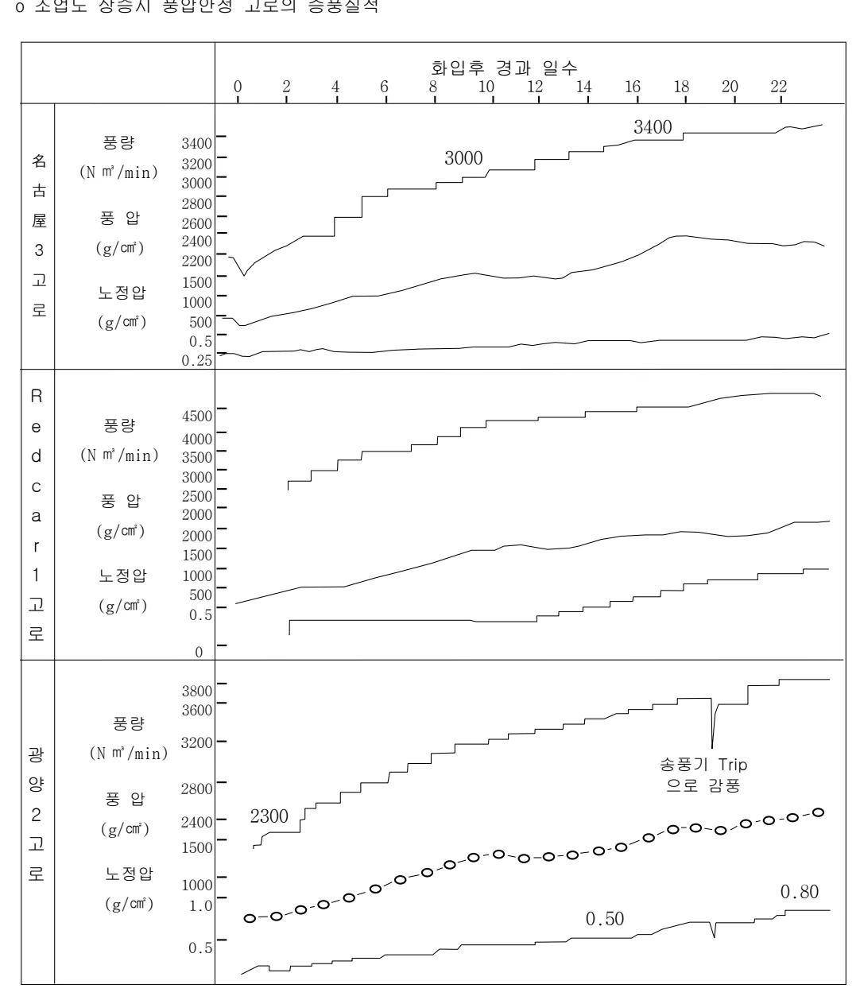
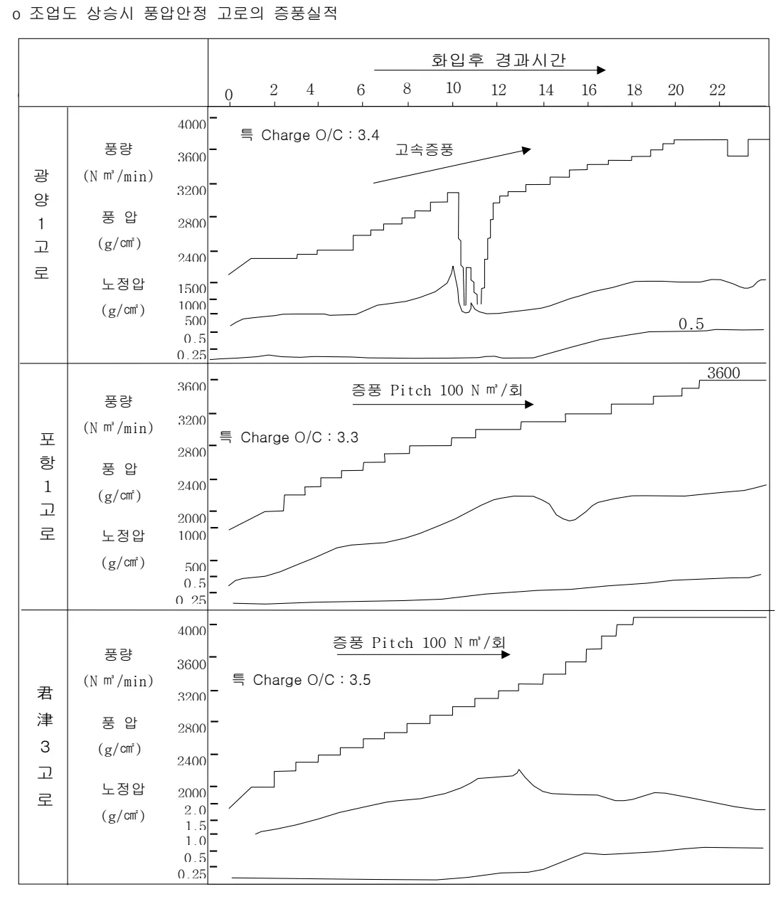
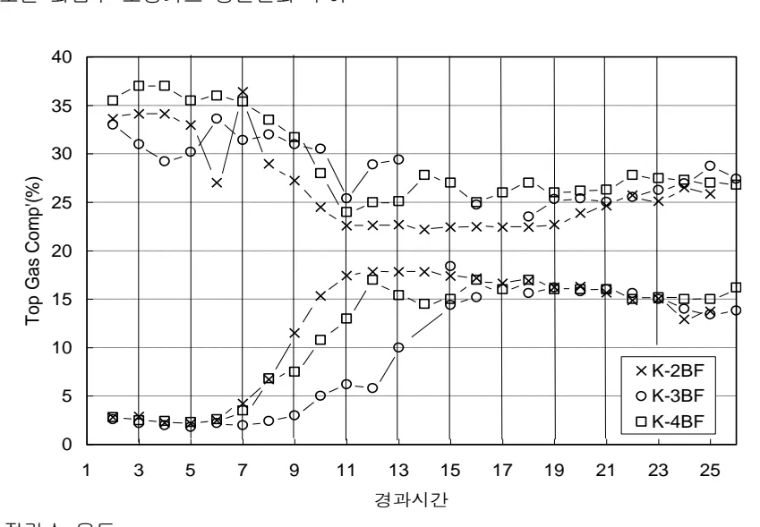

<h2>Page 1</h2>
<h1>1. 적용범위</h1>

고로 화입조업 기술중 화입직후 고효율 고로조업 조기수행과 안정적인 조업도 상승을 위한 조업 기준과 관리방안 및 조치수순에 대하여 적용한다.

<h2>2. 목 적</h2>

<ul><li>화입직후 노내연화용착대 Profile을 조기에 형성하고,</li><li>화입조기 설비 및 조업 Trouble에 대비하고 원활한 노내 용용을 배출을 통한 노열의 조기확보 노체, 노상부 안정적 온도상향 유도</li></ul>

<h3>3. 중점관리 항목 : 해당사항 없음</h3>

<h2>4. 조업기준</h2>

<h3>4.1 조업도 상승계획 수립과 실적비교</h3>

<h4>4.1.1 단계별 조업도 상승계획</h4>

<table><thead><tr><th>구분</th><th>단계</th><th>기간</th><th>주요 조업관리 항목</th><th>비고</th></tr></thead><tbody><tr><td rowspan="2">화입조업</td><td>1</td><td>화입후 24 시간</td><td><ul><li>증풍, 가스 통입, 노열확보</li><li>노정온도 관리</li><li>조출선, 재작업</li><li>풍구 Ring 제거(Uot 조정)</li><li>각종 조업 Data 확보</li><li>입도별 장입</li></ul></td><td rowspan="2">※제강용선으로 이행</td></tr><tr><td>2</td><td>2~9 일</td><td><ul><li>증풍 Pitch</li><li>노열확보 및 노체승온</li><li>주상 탈규설비 가동</li><li>미분탄 취입 개시</li><li>노열 Balance Check 및 제반인자 조정</li><li>적정 가스류 분포조정 위한 장입 Mode 조정<ul><li>목표 Bell-less Mode 로 이행</li><li>Coke Base 적정화</li><li>Coke 중심장입</li></ul></li></ul></td></tr><tr><td rowspan="2">조업도 상승조업</td><td>3</td><td>10 일~ 정상조업</td><td><ul><li>제 조업지수 조정</li><li>정상조업도 달성</li><li>노열확보 및 노저승온 완료</li><li>부대설비 가동<ul><li>노정압 발전기</li><li>폐열회수 설비</li><li>제 노황지수 확립</li><li>작업표준 정립, 보완</li></ul></li><li>산소부화 설비</li><li>수재 설비</li></ul></td><td>※제 조업지수의 정상조업 도달<ul><li>풍량</li><li>노정압</li><li>[Si]</li><li>F.R</li></ul></td></tr></tbody></table>
<a href="components/TP-030-110-070 조업도 상승 기준(Rev.8)_0900bf4ba7a62142_usr0000bf4b95f9e446_p001_table_01.png">Table snapshot</a>

<h2>Page 2</h2>
<h4>4.1.2 화입후 24시간 조업계획</h4>

이 기간은 승열용 COKE에 의한 노내 장입물의 승열과 철광석의 환원용해가 시작되고, 노심부의 침목연소시 노저연와의 승열을 도모하기 위하여 출선구로부터 공취 실시, B.F.G 통입, 출선재 준비작업을 순조롭게 수행해야 할 중요한 시기로서 정상조업도 달성이 순조로웠던 타고로 실적을 근거로 정상조업도 달성 계획을 수립한다.

<h5>가. 승풍량</h5>

O/C가 낮은 상태인 화입조기의 노열은 Coke 연소열 즉, 승풍량의 다소에 의하여 거의 좌우된다.

<ul><li>화입조기 설비 Trouble의 위험성에 대비한 노열의 조기 확보</li><li>노체 조기 승열 및 노내 Profile의 조기 형성</li><li>Slag 및 용선의 유동성 확보와 원활한 초출선 실시</li><li>화입조기 풍구부 오염 및 閉鎖 방지를 위하여 증풍 Speed는 가능한 한 빨리한다.</li></ul>

<h5>(1) 각 고로의 증풍 방법</h5>

<ul><li>각 고로 화입시 증풍 실적</li></ul>

당사 고로의 경우 대부분 화입후 증풍 속도는 초기고속, 후기저속 증풍형으로 조기에 노열을 확보함으로써 설비 Trouble에 대비하고 노정온도 상승으로 증풍이 어려운 화입 후 10~15시간 이후에는 저속증풍을 실시하여 목표승풍량을 달성한다.

<h5>※ 증풍 방법 비교</h5>

<table><thead><tr><th>증풍방법</th><th>고로명</th><th>기본개념</th></tr></thead><tbody><tr><td>균등증풍형</td><td>君津,大分 2BF,堀,廣,포항 1~4BF</td><td><ul><li>화입후 H+24의 목표 승풍비 1.0까지 균등승풍</li><li>화입후 연환 융착대 형성시기(H+7~15°)의 통기안정 도모</li></ul></td></tr><tr><td>초기 고속 후기 저속 증풍형</td><td>名古屋 1,3BF,大分 1BF,Redcar 1BF,광양 1~4BF, P2R2</td><td><ul><li>설비 trouble에 대비하여 초기에 노열확보</li><li>노정온도 상승으로 증풍이 어려운 H+10~15° 이후에는 빠른 속도의 증풍을 피함으로써 무난히 목표 승풍량을 달성하기 위함.</li></ul></td></tr></tbody></table>
<a href="components/TP-030-110-070 조업도 상승 기준(Rev.8)_0900bf4ba7a62142_usr0000bf4b95f9e446_p002_table_01.png">Table snapshot</a>

뒷 장 계속

<h2>Page 3</h2>
<table><thead><tr><th rowspan="2"></th><th rowspan="2"></th><th rowspan="2">내용적 (<math>\text{m}^3</math>)</th><th rowspan="2">화입일</th><th rowspan="2">화입시</th><th rowspan="2">H+6hr</th><th rowspan="2">H+12hr</th><th colspan="2">H+24hr</th><th rowspan="2">감풍</th></tr><tr><th>계획</th><th>실적</th></tr></thead><tbody><tr><td rowspan="2">大分</td><td>1BF</td><td>4158</td><td>79.8</td><td>-</td><td>0.70</td><td>0.78</td><td>0.95</td><td>0.95</td><td></td></tr><tr><td>2BF</td><td>5670</td><td>76.10</td><td></td><td>0.51</td><td>0.71</td><td>1.03</td><td>0.99</td><td>2 회</td></tr><tr><td rowspan="2">名古屋</td><td>1BF</td><td>3890</td><td>79.3</td><td>0.60</td><td>0.72</td><td>0.93</td><td>1.03</td><td>1.03</td><td>Hanging2 회</td></tr><tr><td>3BF</td><td>3424</td><td>84.12</td><td>0.58</td><td>0.83</td><td>0.91</td><td>0.99</td><td>0.99</td><td></td></tr><tr><td rowspan="2">君津</td><td>2BF</td><td>4063</td><td>86.4</td><td>0.47</td><td>0.54</td><td>0.78</td><td>1.00</td><td>1.00</td><td></td></tr><tr><td>水島 3BF</td><td>3363</td><td>78.6</td><td>0.48</td><td>-</td><td>-</td><td>-</td><td>1.01</td><td></td></tr><tr><td rowspan="2">Redcar</td><td>1BF</td><td>4305</td><td>86.8</td><td>0.58</td><td>0.77</td><td>0.91</td><td>1.02</td><td>1.04</td><td></td></tr><tr><td>1BF</td><td>1660</td><td>79.9</td><td>0.48</td><td>0.66</td><td>0.75</td><td>0.84</td><td>0.87</td><td></td></tr><tr><td rowspan="5">Dunkerq' 4</td><td>1BF</td><td>4187</td><td>83.4</td><td>0.40</td><td>0.72</td><td>0.76</td><td>0.30</td><td>0.80</td><td></td></tr><tr><td>P2R2</td><td>2550</td><td>97.8</td><td>0.51</td><td>0.78</td><td>0.84</td><td></td><td>0.94</td><td></td></tr><tr><td>3BF</td><td>3795</td><td>89.1</td><td>0.45</td><td>0.71</td><td>0.80</td><td></td><td>0.95</td><td></td></tr><tr><td>3BF (R2)</td><td>4350</td><td>'06.5</td><td>0.32</td><td>0.78</td><td>0.83</td><td>1.10</td><td>1.24</td><td>1 회</td></tr><tr><td>4BF</td><td>5600</td><td>10.10</td><td>0.47</td><td>0.61</td><td>0.74</td><td>0.95</td><td>0.95</td><td></td></tr><tr><td rowspan="5">광양</td><td>1BF</td><td>3800</td><td>87.4</td><td>0.61</td><td>0.64</td><td>0.80</td><td></td><td>0.99</td><td>Hanging 1 회</td></tr><tr><td>2BF</td><td>3800</td><td>88.7</td><td>0.61</td><td>0.76</td><td>0.87</td><td>1.01</td><td>1.03</td><td>1BF 분송(H+20)</td></tr><tr><td>3BF</td><td>3800</td><td>90.12</td><td>0.61</td><td>0.74</td><td>0.86</td><td></td><td>1.00</td><td></td></tr><tr><td>4BF</td><td>3800</td><td>92.9</td><td>0.61</td><td>0.74</td><td>0.86</td><td></td><td>1.00</td><td></td></tr><tr><td>5BF</td><td>3800</td><td></td><td>0.61</td><td>0.74</td><td>0.86</td><td>1.00</td><td></td><td></td></tr></tbody></table>
<a href="components/TP-030-110-070 조업도 상승 기준(Rev.8)_0900bf4ba7a62142_usr0000bf4b95f9e446_p003_table_01.png">Table snapshot</a>

(2) 증풍방안

급속한 증풍, 장입물 총진시의 과도한 광석내진으로 인해 용착대 형성시점에 풍압급상승에 의한 Hanging 발생 방지를 위하여 중심류 지향의 총진 및 조기 가스통입으로 순조롭게 목표 풍량을 확보하고, 노내 Coke 유동방지를 위해 조기에 노정압을 상승시켜 노내 가스유속 적정화를 도모한다.

화입초기 조기고속, 후기 저속의 증풍방법을 선택하여 입열량 증가를 적극도모하고 Slag 배출지연에 대비하여 조기 풍온상승, 조습량 저하 및 중심류 과다 발달방지 등으로 노열확보에 최우선을 두어 화입초기 설비 Trouble에 대비한다.

뒷 장 계속

<h2>Page 4</h2>
0 조업도 상승시 풍압안정 고로의 증풍실적

<table><thead><tr><th></th><th>항입후 경과 일수</th><th>0</th><th>2</th><th>4</th><th>6</th><th>8</th><th>10</th><th>12</th><th>14</th><th>16</th><th>18</th><th>20</th><th>22</th></tr></thead><tbody><tr><td rowspan="4">名古屋3高 로</td><td>풍량</td><td>3400</td><td></td><td></td><td></td><td></td><td>3000</td><td></td><td></td><td></td><td></td><td>3400</td><td></td></tr><tr><td>(<math>\text{N m}^3/\text{min}</math>)</td><td>3200</td><td></td><td></td><td></td><td></td><td></td><td></td><td></td><td></td><td></td><td></td><td></td></tr><tr><td>풍압</td><td>2600</td><td></td><td></td><td></td><td></td><td></td><td></td><td></td><td></td><td></td><td></td><td></td></tr><tr><td>(<math>\text{g}/\text{cm}^2</math>)</td><td>2400</td><td></td><td></td><td></td><td></td><td></td><td></td><td></td><td></td><td></td><td></td><td></td></tr><tr><td rowspan="4">Red car 1高 로</td><td>풍량</td><td>4500</td><td></td><td></td><td></td><td></td><td></td><td></td><td></td><td></td><td></td><td></td><td></td></tr><tr><td>(<math>\text{N m}^3/\text{min}</math>)</td><td>4000</td><td></td><td></td><td></td><td></td><td></td><td></td><td></td><td></td><td></td><td></td><td></td></tr><tr><td>풍압</td><td>2500</td><td></td><td></td><td></td><td></td><td></td><td></td><td></td><td></td><td></td><td></td><td></td></tr><tr><td>(<math>\text{g}/\text{cm}^2</math>)</td><td>2000</td><td></td><td></td><td></td><td></td><td></td><td></td><td></td><td></td><td></td><td></td><td></td></tr><tr><td rowspan="4">광양2 고 로</td><td>풍량</td><td>3800</td><td></td><td></td><td></td><td></td><td></td><td></td><td></td><td></td><td></td><td></td><td></td></tr><tr><td>(<math>\text{N m}^3/\text{min}</math>)</td><td>3600</td><td></td><td></td><td></td><td></td><td></td><td></td><td></td><td></td><td></td><td></td><td></td></tr><tr><td>풍압</td><td>2800</td><td></td><td></td><td></td><td></td><td>2300</td><td></td><td></td><td></td><td></td><td></td><td></td></tr><tr><td>(<math>\text{g}/\text{cm}^2</math>)</td><td>2400</td><td></td><td></td><td></td><td></td><td></td><td></td><td></td><td></td><td></td><td></td><td></td></tr><tr><td rowspan="4">광양2 고 로</td><td>풍량</td><td>3200</td><td></td><td></td><td></td><td></td><td></td><td></td><td></td><td></td><td></td><td></td><td></td></tr><tr><td>(<math>\text{N m}^3/\text{min}</math>)</td><td>2800</td><td></td><td></td><td></td><td></td><td></td><td></td><td></td><td></td><td></td><td></td><td></td></tr><tr><td>풍압</td><td>2400</td><td></td><td></td><td></td><td></td><td></td><td></td><td></td><td></td><td></td><td></td><td></td></tr><tr><td>(<math>\text{g}/\text{cm}^2</math>)</td><td>2300</td><td></td><td></td><td></td><td></td><td></td><td></td><td></td><td></td><td></td><td></td><td></td></tr><tr><td rowspan="4">광양2 고 로</td><td>풍량</td><td>3200</td><td></td><td></td><td></td><td></td><td></td><td></td><td></td><td></td><td></td><td></td><td></td></tr><tr><td>(<math>\text{N m}^3/\text{min}</math>)</td><td>2800</td><td></td><td></td><td></td><td></td><td></td><td></td><td></td><td></td><td></td><td></td><td></td></tr><tr><td>풍압</td><td>2400</td><td></td><td></td><td></td><td></td><td></td><td></td><td></td><td></td><td></td><td></td><td></td></tr><tr><td>(<math>\text{g}/\text{cm}^2</math>)</td><td>2300</td><td></td><td></td><td></td><td></td><td></td><td></td><td></td><td></td><td></td><td></td><td></td></tr><tr><td rowspan="4">광양2 고 로</td><td>풍량</td><td>3200</td><td></td><td></td><td></td><td></td><td></td><td></td><td></td><td></td><td></td><td></td><td></td></tr><tr><td>(<math>\text{N m}^3/\text{min}</math>)</td><td>2800</td><td></td><td></td><td></td><td></td><td></td><td></td><td></td><td></td><td></td><td></td><td></td></tr><tr><td>풍압</td><td>2400</td><td></td><td></td><td></td><td></td><td></td><td></td><td></td><td></td><td></td><td></td><td></td></tr><tr><td>(<math>\text{g}/\text{cm}^2</math>)</td><td>2300</td><td></td><td></td><td></td><td></td><td></td><td></td><td></td><td></td><td></td><td></td><td></td></tr><tr><td rowspan="4">광양2 고 로</td><td>풍량</td><td>3200</td><td></td><td></td><td></td><td></td><td></td><td></td><td></td><td></td><td></td><td></td><td></td></tr><tr><td>(<math>\text{N m}^3/\text{min}</math>)</td><td>2800</td><td></td><td></td><td></td><td></td><td></td><td></td><td></td><td></td><td></td><td></td><td></td></tr><tr><td>풍압</td><td>2400</td><td></td><td></td><td></td><td></td><td></td><td></td><td></td><td></td><td></td><td></td><td></td></tr><tr><td>(<math>\text{g}/\text{cm}^2</math>)</td><td>2300</td><td></td><td></td><td></td><td></td><td></td><td></td><td></td><td></td><td></td><td></td><td></td></tr><tr><td rowspan="4">광양2 고 로</td><td>풍량</td><td>3200</td><td></td><td></td><td></td><td></td><td></td><td></td><td></td><td></td><td></td><td></td><td></td></tr><tr><td>(<math>\text{N m}^3/\text{min}</math>)</td><td>2800</td><td></td><td></td><td></td><td></td><td></td><td></td><td></td><td></td><td></td><td></td><td></td></tr><tr><td>풍압</td><td>2400</td><td></td><td></td><td></td><td></td><td></td><td></td><td></td><td></td><td></td><td></td><td></td></tr><tr><td>(<math>\text{g}/\text{cm}^2</math>)</td><td>2300</td><td></td><td></td><td></td><td></td><td></td><td></td><td></td><td></td><td></td><td></td><td></td></tr><tr><td rowspan="4">광양2 고 로</td><td>풍량</td><td>3200</td><td></td><td></td><td></td><td></td><td></td><td></td><td></td><td></td><td></td><td></td><td></td></tr><tr><td>(<math>\text{N m}^3/\text{min}</math>)</td><td>2800</td><td></td><td></td><td></td><td></td><td></td><td></td><td></td><td></td><td></td><td></td><td></td></tr><tr><td>풍압</td><td>2400</td><td></td><td></td><td></td><td></td><td></td><td></td><td></td><td></td><td></td><td></td><td></td></tr><tr><td>(<math>\text{g}/\text{cm}^2</math>)</td><td>2300</td><td></td><td></td><td></td><td></td><td></td><td></td><td></td><td></td><td></td><td></td><td></td></tr><tr><td rowspan="4">광양2 고 로</td><td>풍량</td><td>3200</td><td></td><td></td><td></td><td></td><td></td><td></td><td></td><td></td><td></td><td></td><td></td></tr><tr><td>(<math>\text{N m}^3/\text{min}</math>)</td><td>2800</td><td></td><td></td><td></td><td></td><td></td><td></td><td></td><td></td><td></td><td></td><td></td></tr><tr><td>풍압</td><td>2400</td><td></td><td></td><td></td><td></td><td></td><td></td><td></td><td></td><td></td><td></td><td></td></tr><tr><td>(<math>\text{g}/\text{cm}^2</math>)</td><td>2300</td><td></td><td></td><td></td><td></td><td></td><td></td><td></td><td></td><td></td><td></td><td></td></tr><tr><td rowspan="4">광양2 고 로</td><td>풍량</td><td>3200</td><td></td><td></td><td></td><td></td><td></td><td></td><td></td><td></td><td></td><td></td><td></td></tr><tr><td>(<math>\text{N m}^3/\text{min}</math>)</td><td>2800</td><td></td><td></td><td></td><td></td><td></td><td></td><td></td><td></td><td></td><td></td><td></td></tr><tr><td>풍압</td><td>2400</td><td></td><td></td><td></td><td></td><td></td><td></td><td></td><td></td><td></td><td></td><td></td></tr><tr><td>(<math>\text{g}/\text{cm}^2</math>)</td><td>2300</td><td></td><td></td><td></td><td></td><td></td><td></td><td></td><td></td><td></td><td></td><td></td></tr><tr><td rowspan="4">광양2 고 로</td><td>풍량</td><td>3200</td><td></td><td></td><td></td><td></td><td></td><td></td><td></td><td></td><td></td><td></td><td></td></tr><tr><td>(<math>\text{N m}^3/\text{min}</math>)</td><td>2800</td><td></td><td></td><td></td><td></td><td></td><td></td><td></td><td></td><td></td><td></td><td></td></tr><tr><td>풍압</td><td>2400</td><td></td><td></td><td></td><td></td><td></td><td></td><td></td><td></td><td></td><td></td><td></td></tr><tr><td>(<math>\text{g}/\text{cm}^2</math>)</td><td>2300</td><td></td><td></td><td></td><td></td><td></td><td></td><td></td><td></td><td></td><td></td><td></td></tr><tr><td rowspan="4">광양2 고 로</td><td>풍량</td><td>3200</td><td></td><td></td><td></td><td></td><td></td><td></td><td></td><td></td><td></td><td></td><td></td></tr><tr><td>(<math>\text{N m}^3/\text{min}</math>)</td><td>2800</td><td></td><td></td><td></td><td></td><td></td><td></td><td></td><td></td><td></td><td></td><td></td></tr><tr><td>풍압</td><td>2400</td><td></td><td></td><td></td><td></td><td></td><td></td><td></td><td></td><td></td><td></td><td></td></tr><tr><td>(<math>\text{g}/\text{cm}^2</math>)</td><td>2300</td><td></td><td></td><td></td><td></td><td></td><td></td><td></td><td></td><td></td><td></td><td></td></tr><tr><td rowspan="4">광양2 고 로</td><td>풍량</td><td>3200</td><td></td><td></td><td></td><td></td><td></td><td></td><td></td><td></td><td></td><td></td><td></td></tr><tr><td>(<math>\text{N m}^3/\text{min}</math>)</td><td>2800</td><td></td><td></td><td></td><td></td><td></td><td></td><td></td><td></td><td></td><td></td><td></td></tr><tr><td>풍압</td><td>2400</td><td></td><td></td><td></td><td></td><td></td><td></td><td></td><td></td><td></td><td></td><td></td></tr><tr><td>(<math>\text{g}/\text{cm}^2</math>)</td><td>2300</td><td></td><td></td><td></td><td></td><td></td><td></td><td></td><td></td><td></td><td></td><td></td></tr><tr><td rowspan="4">광양2 고 로</td><td>풍량</td><td>3200</td><td></td><td></td><td></td><td></td><td></td><td></td><td></td><td></td><td></td><td></td><td></td></tr><tr><td>(<math>\text{N m}^3/\text{min}</math>)</td><td>2800</td><td></td><td></td><td></td><td></td><td></td><td></td><td></td><td></td><td></td><td></td><td></td></tr><tr><td>풍압</td><td>2400</td><td></td><td></td><td></td><td></td><td></td><td></td><td></td><td></td><td></td><td></td><td></td></tr><tr><td>(<math>\text{g}/\text{cm}^2</math>)</td><td>2300</td><td></td><td></td><td></td><td></td><td></td><td></td><td></td><td></td><td></td><td></td><td></td></tr><tr><td rowspan="4">광양2 고 로</td><td>풍량</td><td>3200</td><td></td><td></td><td></td><td></td><td></td><td></td><td></td><td></td><td></td><td></td><td></td></tr><tr><td>(<math>\text{N m}^3/\text{min}</math>)</td><td>2800</td><td></td><td></td><td></td><td></td><td></td><td></td><td></td><td></td><td></td><td></td><td></td></tr><tr><td>풍압</td><td>2400</td><td></td><td></td><td></td><td></td><td></td><td></td><td></td><td></td><td></td><td></td><td></td></tr><tr><td>(<math>\text{g}/\text{cm}^2</math>)</td><td>2300</td><td></td><td></td><td></td><td></td><td></td><td></td><td></td><td></td><td></td><td></td><td></td></tr><tr><td rowspan="4">광양2 고 로</td><td>풍량</td><td>3200</td><td></td><td></td><td></td><td></td><td></td><td></td><td></td><td></td><td></td><td></td><td></td></tr><tr><td>(<math>\text{N m}^3/\text{min}</math>)</td><td>2800</td><td></td><td></td><td></td><td></td><td></td><td></td><td></td><td></td><td></td><td></td><td></td></tr><tr><td>풍압</td><td>2400</td><td></td><td></td><td></td><td></td><td></td><td></td><td></td><td></td><td></td><td></td><td></td></tr><tr><td>(<math>\text{g}/\text{cm}^2</math>)</td><td>2300</td><td></td><td></td><td></td><td></td><td></td><td></td><td></td><td></td><td></td><td></td><td></td></tr><tr><td rowspan="4">광양2 고 로</td><td>풍량</td><td>3200</td><td></td><td></td><td></td><td></td><td></td><td></td><td></td><td></td><td></td><td></td><td></td></tr><tr><td>(<math>\text{N m}^3/\text{min}</math>)</td><td>2800</td><td></td><td></td><td></td><td></td><td></td><td></td><td></td><td></td><td></td><td></td><td></td></tr><tr><td>풍압</td><td>2400</td><td></td><td></td><td></td><td></td><td></td><td></td><td></td><td></td><td></td><td></td><td></td></tr><tr><td>(<math>\text{g}/\text{cm}^2</math>)</td><td>2300</td><td></td><td></td><td></td><td></td><td></td><td></td><td></td><td></td><td></td><td></td><td></td></tr><tr><td rowspan="4">광양2 고 로</td><td>풍량</td><td>3200</td><td></td><td></td><td></td><td></td><td></td><td></td><td></td><td></td><td></td><td></td><td></td></tr><tr><td>(<math>\text{N m}^3/\text{min}</math>)</td><td>2800</td><td></td><td></td><td></td><td></td><td></td><td></td><td></td><td></td><td></td><td></td><td></td></tr><tr><td>풍압</td><td>2400</td><td></td><td></td><td></td><td></td><td></td><td></td><td></td><td></td><td></td><td></td><td></td></tr><tr><td>(<math>\text{g}/\text{cm}^2</math>)</td><td>2300</td><td></td><td></td><td></td><td></td><td></td><td></td><td></td><td></td><td></td><td></td><td></td></tr><tr><td rowspan="4">광양2 고 로</td><td>풍량</td><td>3200</td><td></td><td></td><td></td><td></td><td></td><td></td><td></td><td></td><td></td><td></td><td></td></tr><tr><td>(<math>\text{N m}^3/\text{min}</math>)</td><td>2800</td><td></td><td></td><td></td><td></td><td></td><td></td><td></td><td></td><td></td><td></td><td></td></tr><tr><td>풍압</td><td>2400</td><td></td><td></td><td></td><td></td><td></td><td></td><td></td><td></td><td></td><td></td><td></td></tr><tr><td>(<math>\text{g}/\text{cm}^2</math>)</td><td>2300</td><td></td><td></td><td></td><td></td><td></td><td></td><td></td><td></td><td></td><td></td><td></td></tr><tr><td rowspan="4">광양2 고 로</td><td>풍량</td><td>3200</td><td></td><td></td><td></td><td></td><td></td><td></td><td></td><td></td><td></td><td></td><td></td></tr><tr><td>(<math>\text{N m}^3/\text{min}</math>)</td><td>2800</td><td></td><td></td><td></td><td></td><td></td><td></td><td></td><td></td><td></td><td></td><td></td></tr><tr><td>풍압</td><td>2400</td><td></td><td></td><td></td><td></td><td></td><td></td><td></td><td></td><td></td><td></td><td></td></tr><tr><td>(<math>\text{g}/\text{cm}^2</math>)</td><td>2300</td><td></td><td></td><td></td><td></td><td></td><td></td><td></td><td></td><td></td><td></td><td></td></tr><tr><td rowspan="4">광양2 고 로</td><td>풍량</td><td>3200</td><td></td><td></td><td></td><td></td><td></td><td></td><td></td><td></td><td></td><td></td><td></td></tr><tr><td>(<math>\text{N m}^3/\text{min}</math>)</td><td>2800</td><td></td><td></td><td></td><td></td><td></td><td></td><td></td><td></td><td></td><td></td><td></td></tr><tr><td>풍압</td><td>2400</td><td></td><td></td><td></td><td></td><td></td><td></td><td></td><td></td><td></td><td></td><td></td></tr><tr><td>(<math>\text{g}/\text{cm}^2</math>)</td><td>2300</td><td></td><td></td><td></td><td></td><td></td><td></td><td></td><td></td><td></td><td></td><td></td></tr><tr><td rowspan="4">광양2 고 로</td><td>풍량</td><td>3200</td><td></td><td></td><td></td><td></td><td></td><td></td><td></td><td></td><td></td><td></td><td></td></tr><tr><td>(<math>\text{N m}^3/\text{min}</math>)</td><td>2800</td><td></td><td></td><td></td><td></td><td></td><td></td><td></td><td></td><td></td><td></td><td></td></tr><tr><td>풍압</td><td>2400</td><td></td><td></td><td></td><td></td><td></td><td></td><td></td><td></td><td></td><td></td><td></td></tr><tr><td>(<math>\text{g}/\text{cm}^2</math>)</td><td>2300</td><td></td><td></td><td></td><td></td><td></td><td></td><td></td><td></td><td></td><td></td><td></td></tr><tr><td rowspan="4">광양2 고 로</td><td>풍량</td><td>3200</td><td></td><td></td><td></td><td></td><td></td><td></td><td></td><td></td><td></td><td></td><td></td></tr><tr><td>(<math>\text{N m}^3/\text{min}</math>)</td><td>2800</td><td></td><td></td><td></td><td></td><td></td><td></td><td></td><td></td><td></td><td></td><td></td></tr><tr><td>풍압</td><td>2400</td><td></td><td></td><td></td><td></td><td></td><td></td><td></td><td></td><td></td><td></td><td></td></tr><tr><td>(<math>\text{g}/\text{cm}^2</math>)</td><td>2300</td><td></td><td></td><td></td><td></td><td></td><td></td><td></td><td></td><td></td><td></td><td></td></tr><tr><td rowspan="4">광양2 고 로</td><td>풍량</td><td>3200</td><td></td><td></td><td></td><td></td><td></td><td></td><td></td><td></td><td></td><td></td><td></td></tr><tr><td>(<math>\text{N m}^3/\text{min}</math>)</td><td>2800</td><td></td><td></td><td></td><td></td><td></td><td></td><td></td><td></td><td></td><td></td><td></td></tr><tr><td>풍압</td><td>2400</td><td></td><td></td><td></td><td></td><td></td><td></td><td></td><td></td><td></td><td></td><td></td></tr><tr><td>(<math>\text{g}/\text{cm}^2</math>)</td><td>2300</td><td></td><td></td><td></td><td></td><td></td><td></td><td></td><td></td><td></td><td></td><td></td></tr><tr><td rowspan="4">광양2 고 로</td><td>풍량</td><td>3200</td><td></td><td></td><td></td><td></td><td></td><td></td><td></td><td></td><td></td><td></td><td></td></tr><tr><td>(<math>\text{N m}^3/\text{min}</math>)</td><td>2800</td><td></td><td></td><td></td><td></td><td></td><td></td><td></td><td></td><td></td><td></td><td></td></tr><tr><td>풍압</td><td>2400</td><td></td><td></td><td></td><td></td><td></td><td></td><td></td><td></td><td></td><td></td><td></td></tr></tbody></table>

<h2>Page 5</h2>
o 조업도 상승시 풍압안정 고로의 증풍실적

<table><thead><tr><th colspan="2">화입후 경과시간</th></tr><tr><th>0</th><th>2</th><th>4</th><th>6</th><th>8</th><th>10</th><th>12</th><th>14</th><th>16</th><th>18</th><th>20</th><th>22</th></tr></thead><tbody><tr><td>광양 1고로</td><td>
풍량 (N m3/min)

풍압 (g/cm2)

노정압 (g/cm2)

특 Charge O/C : 3.4

고속증풍

0.5
</td></tr><tr><td>포항 1고로</td><td>
풍량 (N m3/min)

풍압 (g/cm2)

노정압 (g/cm2)

특 Charge O/C : 3.3

증풍 Pitch 100 N m2/회

3600

0.5
</td></tr><tr><td>君津 3고로</td><td>
풍량 (N m3/min)

풍압 (g/cm2)

노정압 (g/cm2)

특 Charge O/C : 3.5

증풍 Pitch 100 N m2/회

0.5
</td></tr></tbody></table>

뒷 장 계속

<h2>Page 6</h2>

o 목표 풍량 설정

- 화입시 정풍량 교체시점은 고속증풍 고로에서는 <math>0.5\sim 0.6\text{ N m}^2/\text{m}^2</math>, 저속증풍 고로에서는 <math>0.3\sim 0.4\text{ N m}^2/\text{m}^2</math> 범위임.

- 화입 24 시간 목표 풍량은 고속증풍 고로의 경우 풍량과 고로내용적의 비를 <math>1.0\text{ N m}^2/\text{m}^2</math> 이상을 목표로 하는 고로도 있으나 통상 1.0을 목표로 한다.

나. Ore/Coke

타고로의 열 Balance 를 참조하여 적당한 여유 열을 가지고록 화입시 O/C 는 2.10 1차 증광은 2.2(증광시기는 장입물 승열이 완료된 노정온도 <math>200^\circ\text{C}</math>에 도달하게 되는 시간), 2차 증광은 2.2로 초출선시 [Si] Level 과 용선온도를 확인 후 실시한다.

o 고로별 화입 초기 증광실적

<table><thead><tr><th rowspan="2"></th><th rowspan="2"></th><th rowspan="2">내용적 (화입일)</th><th rowspan="2">화입시 O/C</th><th rowspan="2">1차 증광</th><th rowspan="2">2차 증광</th><th rowspan="2">H+24hr 시점 O/C</th><th colspan="2">초출선</th></tr><tr><th>온도</th><th>[Si]</th></tr></thead><tbody><tr><td rowspan="2">名古屋</td><td>1BF</td><td>3890 (79.3)</td><td>2.30</td><td>2.30→2.35 (H+18)</td><td>2.35→2.42 (H+25)</td><td>2.35</td><td>1433</td><td>4.65</td></tr><tr><td>3BF</td><td>3424 (84.12)</td><td>2.30</td><td>-</td><td>-</td><td>2.30</td><td>1453</td><td>4.25</td></tr><tr><td rowspan="2">Redcar</td><td>1BF</td><td>4305 (86.8)</td><td>2.20</td><td>2.20→2.25 (H+22)</td><td>2.25→2.30 (H+30)</td><td>2.25</td><td>1400</td><td>4.01</td></tr><tr><td></td><td></td><td></td><td></td><td></td><td></td><td></td><td></td></tr><tr><td rowspan="4">포항</td><td>P2R2</td><td>2550 (97.8)</td><td>2.0</td><td>2.0→2.10 (H+21°30') (T.T 375°C)</td><td>2.10→2.15 (H+32)</td><td>2.15</td><td>1460</td><td>5.25</td></tr><tr><td>3BF</td><td>3795 (89.1)</td><td>2.15</td><td>2.15→2.20 (H+17)</td><td>2.20→2.25 (H+27)</td><td>2.20</td><td>1470</td><td>5.16</td></tr><tr><td>3BF (R2)</td><td>4350 (°06.5)</td><td>2.10</td><td>2.10→2.20 (H+12)</td><td>2.20→2.30 (H+23)</td><td>2.30</td><td>1350</td><td>6.49</td></tr><tr><td>4BF</td><td>5600 (10.10)</td><td>2.00</td><td>2.00→2.10 (H+14)</td><td>2.10→2.20 (H+19)</td><td>2.20</td><td>1475</td><td>4.63</td></tr><tr><td rowspan="4">광양</td><td>1BF</td><td>3800 (87.4)</td><td>2.10</td><td>2.10→2.20 (H+16)</td><td>2.20→2.25 (H+38)</td><td>2.20</td><td>1325</td><td>3.95</td></tr><tr><td>2BF</td><td>3800 (88.7)</td><td>2.10</td><td>2.10→2.15 (H+12°57') (TT 120°C)</td><td>2.15→2.20 (H+14°45') (TT 166°C)</td><td>2.20</td><td>1356</td><td>3.74</td></tr><tr><td>3BF</td><td>3800 (90.12)</td><td>2.10</td><td>2.10→2.20 (H+15°12') (TT 200°C)</td><td>2.20→2.25 (H+39°20') (THM1506°C)</td><td>2.20</td><td>1400</td><td>3.97</td></tr><tr><td>4BF</td><td>3800 (92.9)</td><td>2.10</td><td>2.10→2.20 (H+15°52') (TT 230°C)</td><td>2.20→2.25 (H+23°31') (THM1521°C)</td><td>2.25</td><td>1493</td><td>7.13</td></tr></tbody></table>
<a href="components/TP-030-110-070 조업도 상승 기준(Rev.8)_0900bf4ba7a62142_usr0000bf4b95f9e446_p006_table_01.png">Table snapshot</a>

뒷 장 계속

<h2>Page 7</h2>

다. 습분

화입초기의 습분취입은 노열 Balance 에 중대한 영향을 미치나 너무 낮을 경우 연화용착대 형성 시점에 통기불량을 초래할 수 있으므로 노황 조정수단으로 일시 습분 취입량을 증대시킬 필요가 있다.

0 고로별 화입초기 습분 취입실적

<table><thead><tr><th>고로별</th><th>화입일</th><th>조습실적</th><th>H+24시점 O/C</th></tr></thead><tbody><tr><td rowspan="4">포항</td><td>P2R2</td><td>97.8.1</td><td>화입초기 : 대기(21g/N m3), H+8~14 : 45~55g/N m3</td><td>2.10</td></tr><tr><td>3BF(R)</td><td>89.1.23</td><td>H+4°부터 30 g/N m3 일정</td><td>2.20</td></tr><tr><td>3BF(2R)</td><td>’06.5.4</td><td>H+5°:20 → H+8°:50 → H+20°:30 g/N m3 일정</td><td>2.30</td></tr><tr><td>4BF</td><td>81.2.18</td><td>H+10°부터 15 g/N m3 일정</td><td>2.20</td></tr><tr><td rowspan="2">名古屋</td><td>1BF</td><td>79.3</td><td>10~13 g/N m3</td><td>2.35</td></tr><tr><td>BF(R)</td><td>84.12</td><td>대기습분</td><td>2.30</td></tr><tr><td>君津</td><td>3BF(R)</td><td>86.4</td><td>H+5°부터 35 g/N m3 일정</td><td></td></tr><tr><td>戶畑</td><td>1BF(R)</td><td>85.12</td><td>H+1°40'부터 25 g/N m3 일정</td><td></td></tr><tr><td>Redcar</td><td>1BF(R)</td><td>86.8</td><td>H+5°:15 g/N m3, H+6°:25g/N m3, H+9:30g/N m3</td><td>2.25</td></tr><tr><td>Dunkerque</td><td>4BF</td><td>86.2</td><td>대기습분</td><td></td></tr><tr><td rowspan="6">광양</td><td>1BF</td><td>87.4</td><td>H+1°10':20 g/N m3, H+6°이후 35g/N m3 유지</td><td>2.20</td></tr><tr><td>2BF</td><td>88.7</td><td>화입초기: 대기(27.5 g/N m3), H+6°:27g/N m3, H+15°이후 대기(27.5 g/N m3)→35 g/N m3→30 g/N m3</td><td>2.20</td></tr><tr><td>3BF</td><td>90.12</td><td>화입초기 15 g/N m3, H+8~19°:35 g/N m3, H+19°이후: 30→25→20→15 g/N m3</td><td>2.20</td></tr><tr><td>4BF</td><td>92.9</td><td>화입초기: 대기(19.0) 15±5 g/N m3, H+8~14°: 40±5g/N m3, H+15°이후 : 40±5 g/N m3</td><td>2.25</td></tr><tr><td>5BF</td><td>00.4</td><td>화입초기 15 g/N m3, H+8~14°: 35g/N m3, H+17°이후 : 15±5 g/N m3</td><td>2.20</td></tr></tbody></table>
<a href="components/TP-030-110-070 조업도 상승 기준(Rev.8)_0900bf4ba7a62142_usr0000bf4b95f9e446_p007_table_01.png">Table snapshot</a>

라. 송풍온도

화입초기 노저온도에 따른 용융물 배출불량현상을 해소하기 위하여 송풍초기 760℃까지 조기확 보후 800℃로 송풍온도를 유지하며 가능한 송풍온도를 최대 상승시켜 조기입열량을 증가시킨다.

뒷 장 계속

<h2>Page 8</h2>
<h4>○ 고로별 화입초기 송풍운도 상승실적</h4>

<table><thead><tr><th>고로별</th><th>내용적 (<math>\text{m}^3</math>)</th><th>화입일</th><th>송풍운도</th></tr></thead><tbody><tr><td rowspan="2">名古屋</td><td>1BF</td><td>3890</td><td>79.3</td><td>700 <math>\text{m}^3</math> 일정</td></tr><tr><td>2BF</td><td>3424</td><td>84.12</td><td>"</td></tr><tr><td rowspan="2">君津</td><td>3BF</td><td>4063</td><td>83.4</td><td>"</td></tr><tr><td>4BF</td><td>4930</td><td>75.10</td><td>"</td></tr><tr><td>戸畑</td><td>1BF</td><td>4407</td><td>85.12</td><td>"</td></tr><tr><td>堺</td><td>2BF</td><td>2797</td><td>84.3</td><td>700 → 720 <math>^{\circ}\text{C}</math></td></tr><tr><td>廣畑</td><td>4BF</td><td>2950</td><td>77.2</td><td>650 <math>^{\circ}\text{C}</math> 일정</td></tr><tr><td rowspan="2">大分</td><td>1BF</td><td>4158</td><td>79.8</td><td>550 → 650 <math>^{\circ}\text{C}</math></td></tr><tr><td>2BF</td><td>2857</td><td>79.3</td><td>750 <math>^{\circ}\text{C}</math> 일정</td></tr><tr><td rowspan="2">水島</td><td>3BF</td><td>3363</td><td>78.6</td><td>730 <math>^{\circ}\text{C}</math> 일정</td></tr><tr><td>Redcar</td><td>1BF</td><td>4305</td><td>86.4</td><td>700 → 725 <math>^{\circ}\text{C}</math></td></tr><tr><td rowspan="4">포항</td><td>P2R2</td><td>2550</td><td>97.8</td><td>580→670→800→1000(H+6,14,24)</td></tr><tr><td>3BF(R)</td><td>3795</td><td>89.1</td><td>700 → 780 → 780<math>^{\circ}\text{C}</math> (H+12, 24)</td></tr><tr><td>3BF(R2)</td><td>4350</td><td>'06.5</td><td>850 1050<math>^{\circ}\text{C}</math>(H+9) → 1100<math>^{\circ}\text{C}</math>(H+12)</td></tr><tr><td>4BF</td><td>5600</td><td>81.2</td><td>700 <math>^{\circ}\text{C}</math> 일정</td></tr><tr><td rowspan="5">광양</td><td>1BF</td><td>3800</td><td>87.4</td><td>700 → 730 <math>^{\circ}\text{C}</math> (H + 16)</td></tr><tr><td>2BF</td><td>3800</td><td>88.7</td><td>700 → 730 <math>^{\circ}\text{C}</math> (H + 4<math>^{\circ}5'</math>)</td></tr><tr><td>3BF</td><td>3800</td><td>90.12</td><td>760 → 780 <math>^{\circ}\text{C}</math> (H + 5<math>^{\circ}10'</math>)</td></tr><tr><td>4BF</td><td>3800</td><td>92.9</td><td>700 → 800 <math>^{\circ}\text{C}</math> (H + 4<math>^{\circ}5'</math>) →850(H + 5<math>^{\circ}5'</math>)</td></tr><tr><td>5BF</td><td>3800</td><td></td><td>700 → 800 <math>^{\circ}\text{C}</math> (H + 4<math>^{\circ}</math>)</td></tr></tbody></table>
<a href="components/TP-030-110-070 조업도 상승 기준(Rev.8)_0900bf4ba7a62142_usr0000bf4b95f9e446_p008_table_01.png">Table snapshot</a>

<h4>4.1.3 화입후 10일간 조업계획</h4>

이 기간은 노벽 및 Race Way 용해대의 열 Level 이 정상화 되어가는 기간으로 열여유가 많은 상태에서 조업을 하므로 용선종 [Si]이 높아지게 된다. 따라서 후공정의 조업 정상화와 원활한 노전작업을 위해 단계적으로 O/C 및 송풍량을 증가시켜 용선종 [Si] Level 저하를 도모한다.

[Si] Level 은 Shaft 하부 노체연와가 승열이 완료된 후, D+5 일째 주물용선에서 [Si] 3.0%이하의 재강용선으로 이행하고 D+11 [Si] 1.0%이하를 목표로 한다.

그러나, 화입초기 전, 후공정 및 노정장입 설비 Trouble 등 여러가지 여건에 의한 돌발류풍의 위험성에 대비하여 노열을 상향 관리한다.

뒷 장 계속

<h2>Page 9</h2>
<h2>4.2 조업도 상승방법</h2>

<h3>4.2.1 중풍 우선 조업도 상승</h3>

화입후 조기 상조업도 달성을 위하여 O/C 보다는 타고로 조업도 상승실적을 고려하여 풍량우선으로 조업도 상승조업을 실시한다.

<h3>4.2.2 화입초기 내부화 조업실시</h3>

화입초기 안정된 노황 유지를 위해

<ul><li>풍구유속은 Ring 을 취부하여 <math>230\pm 10</math> m/sec로 유지</li><li>조기 Bell-less 장입 Mode 는 중심류 지향의 Bell-like 장입 Mode 사용</li><li>풍구 Ring 제거후부터는 노내 가스 유속 <math>2.6\sim 2.8</math> m/sec 를 목표로 풍량과 노정압을 상승시켜 적극적인 내부화 조업을 유도.</li></ul>

<h3>4.2.3 화입초기 입도별 장입실시</h3>

화입초기부터 입도별 장입을 실시하되 노중심부의 Coke 량을 확보하고 조기 저풍량으로 인한 장입을 경사각 변화에 대처하기 위하여 Coke 중심장입을 조기에 실시하여 안정된 중심류 확보와 Ore 내진을 용이하게 하여 조기 노열 확보를 도모한다.

<h3>4.2.4 화입초기 노열확보</h3>

초출선 전후 노열저하 현상을 해소하기 위하여

<ul><li>노정압 조기 상승</li><li>조기 풍운상승 및 조습량 삭감유도</li><li>침목 충진량 증대와 1,2,3,4 고로 대비 Ore 내진을 조기 실시한다.</li></ul>

<h3>4.2.5 조기 PCI 조업실시</h3>

<ul><li>조업도 조기 상승시에 발생할수 있는 노열 부족현상에 대비</li><li>Po 출선량 증가에 따른 대처수단으로 가능한 조기에 미분탄취입을 실시한다(Burner 는 화입시 취부).</li></ul>

<h3>4.2.6 화입초기 용선처리</h3>

<ul><li>화입초기 고 [Si] 용선은 주선처리하고 그후는 타고로 용선과 혼합또는 탈규를 통하여 주선처리량을 최소화한다.</li><li>사처리량은 Zero 를 목표로 하되 주선 및 사처리 설비의 완벽한 준비를 하여둔다.</li></ul>

<h3>4.2.7 순조로운 조업도 상승을 위한 연원료 품질향상</h3>

노내 원활한 통기성 및 흡액성을 확보하기 위하여 연원료 품질을 강화한다.

<ul><li>Coke : 고강도 Coke 제조를 위한 사전 배합 Test 를 실시하고 노심 Coke 의 입도를 개선하기</li></ul>

<h2>Page 10</h2>

위하여 충진 및 화입초기의 Coke 입도는 +50mm로 한다.

ㅇ 원료 : 노내 장기 체류에 견딜수 있는 고강도의 소결광을 제조하고 정립광은 저 Al2O3 고품위의 광석인 IHG를 사용한다.

<h4>4.3 화입조업 실적</h4>

<h5>4.3.1 조업도 상승기준 및 실적</h5>

가. 고로별 증풍 및 증광실적

A scatter plot showing the relationship between VBG/I.V (x-axis) and O/C (y-axis). The x-axis ranges from 1.2 to 2.2, and the y-axis ranges from 2.5 to 4.0. The plot displays various data points (represented by different symbols: circles, squares, triangles, diamonds, crosses, asterisks) connected by lines, illustrating trends across different operational conditions.

Annotations on the plot include:
<ul><li>초기 고품량 저 O/C</li><li>+ 증풍억제, 고 O/C</li><li>저 풍량</li><li>고 O/C 형</li><li>광량 1,2,3BF</li><li>정상조업도 달성</li><li>고 풍량</li><li>저 O/C 형</li></ul>

<h2>Page 11</h2>

화입후 조기 정상 조업도 달성을 위하여 포함 2,3 고로 및 광양 2,3,4 고로 조업도 상승실적을 고려하여 풍량 우선으로 조업도를 상승시킨다. 상기 실적에 의하면 당사고로는 외국 타 제철소에 비하여 노심의 조기 승열 및 노황 안정에 중점을 두어 고풍량 저 O/C 형의 조업도 상승 방법을 선택 하였으며 미분탄 취입을 계기로 O/C를 상승시켰음을 알 수 있다.

<h4>나. 조기조업도 상승방법과 조업성적 비교</h4>

<table><thead><tr><th></th><th>고로</th><th>6개월시점 연료비 (kg/t-p)</th><th>6개월간 Slip(회/월)</th><th>12~18개월간평균연료비(kg/t-p)</th><th>Slip (회/월)</th></tr></thead><tbody><tr><td rowspan="2">저풍량, 고 O/C</td><td>A</td><td>475</td><td>87</td><td>470</td><td>1</td></tr><tr><td>P-3BF R1</td><td>487</td><td>2.8</td><td>481</td><td>8.8</td></tr><tr><td rowspan="3">고풍량, 저 O/C</td><td>K-3BF</td><td>488</td><td>0</td><td>491</td><td>0</td></tr><tr><td>K-4BF</td><td>485</td><td>2.9</td><td>-</td><td>-</td></tr><tr><td>B</td><td>475</td><td>1</td><td>455</td><td>9</td></tr><tr><td rowspan="3">초기 고풍량, 저 O/C →중풍역제, 고 O/C</td><td>C</td><td>470</td><td>32</td><td>475</td><td>18</td></tr><tr><td>D</td><td>460</td><td>5</td><td>445</td><td>3</td></tr><tr><td>평균</td><td>468</td><td>13</td><td>458</td><td>10</td></tr></tbody></table>
<a href="components/TP-030-110-070 조업도 상승 기준(Rev.8)_0900bf4ba7a62142_usr0000bf4b95f9e446_p011_table_01.png">Table snapshot</a>

<h3>4.3.2 노열판단</h3>

화입직후 노열의 상태는 노정 가스 온도 및 성분과 노체온도 변화로부터 측정할 수 있다.

화입후 고로 노열의 변화를 분류해 보면,

<ul><li>노정 가스 온도 및 성분의 일정치로 안정되는 시점</li><li>Bosh, Belly 및 Shaft 하부온도가 일정치로 안정되는 시점</li><li>노벽온도 전체가 일정치로 안정되는 시점</li><li>노저온도가 일정치로 안정되는 시점 등으로 대별된다.</li><li>노정 가스온도 및 성분이 안정되는 시점</li></ul>

<h3>4.3.3 정상적 환원진행 판단 (노정가스안정)</h3>

<h4>가. 노정가스 성분</h4>

다음 표의 포함 3 고로 및 광양고로 노정가스 조성변화와 온도추이를 보면 화입후 7시간 경과 후부터 BFG 중 CO가 저하하고 CO2가 상승하기 시작하였으며 화입 10~11 시간후부터 노정가스 성분은 정상상태가 되었다. 연화용착대 형성 이후 가스이용을 저하 현상이 나타난 것은 노정온도의 상승완료시점과 일치하여 장입물 승열이 완료되었음을 의미하나 저하 폭이 큰 것은 중심류 과다로 추정할 수 있다

<h2>Page 12</h2>
o 고로별 증풍속도와 노정온도 및 가스 변동추이

<table><thead><tr><th rowspan="2"></th><th colspan="2">포항</th><th colspan="4">광양</th><th colspan="2">名古屋</th><th colspan="2">大分</th><th colspan="2">君津</th><th colspan="2">Redcar</th></tr><tr><th>3R1</th><th>3R2</th><th>1BF</th><th>2BF</th><th>3BF</th><th>4BF</th><th>1</th><th>3</th><th>1BF</th><th>2BF</th><th>1BF</th><th>2BF</th><th>1BF</th></tr></thead><tbody><tr><th>내용적</th><td>3795</td><td>4350</td><td>3800</td><td>3800</td><td>3800</td><td>3800</td><td>3890</td><td>3424</td><td>4158</td><td>2884</td><td>4305</td><td></td><td></td></tr><tr><th>화입일</th><td>89.1</td><td>'06.5</td><td>87.4</td><td>88.7</td><td>90.12</td><td>92.9</td><td>79.3</td><td>84.12</td><td>79.8</td><td>82.2</td><td>86.8</td><td></td><td></td></tr><tr><th rowspan="4">증풍</th><th>0.51</th><td>0.61</td><td>0.32</td><td>0.61</td><td>0.61</td><td>0.61</td><td>0.60</td><td>0.58</td><td></td><td>0.46</td><td>0.58</td><td></td><td></td></tr><tr><th>0.78</th><td>0.71</td><td>0.78</td><td>0.63</td><td>0.76</td><td>0.74</td><td>0.74</td><td>0.72</td><td>0.83</td><td>0.70</td><td>0.55</td><td>0.77</td><td></td><td></td></tr><tr><th>0.84</th><td>0.80</td><td>0.83</td><td>0.80</td><td>0.87</td><td>0.86</td><td>0.86</td><td>0.93</td><td>0.91</td><td>0.78</td><td>0.76</td><td>0.91</td><td></td><td></td></tr><tr><th>0.94</th><td>0.96</td><td>1.24</td><td>0.99</td><td>1.01</td><td>1.00</td><td>1.00</td><td>1.03</td><td>0.99</td><td>0.96</td><td>0.94</td><td>1.04</td><td></td><td></td></tr><tr><th>Top O/C</th><td>2.15</td><td>2.10</td><td>2.10</td><td>2.10</td><td>2.10</td><td>2.10</td><td>2.35</td><td>2.30</td><td>2.30</td><td>2.20</td><td>2.20</td><td></td><td></td></tr><tr><th>환원개시</th><td>H+9</td><td>H+9</td><td>H+9</td><td>H+7</td><td>H+7</td><td>H+7</td><td>H+6</td><td>H+6</td><td>H+7</td><td>H+9</td><td>H+6</td><td></td><td></td></tr><tr><th rowspan="2">T.T 상승 (H+)</th><td>8</td><td>14</td><td>9</td><td>11</td><td>11</td><td>12</td><td>12</td><td>13.5</td><td>15</td><td>12.5</td><td>17</td><td>12</td><td></td></tr><tr><td>12</td><td>16</td><td>12</td><td>18.5</td><td>16.2</td><td>14</td><td>14</td><td></td><td>16</td><td>13</td><td>19</td><td>15.5</td><td></td></tr><tr><th>증풍방법</th><td>고속</td><td>고속</td><td>고속</td><td>고속</td><td>고속</td><td>고속</td><td>고속</td><td>고속</td><td>고속</td><td>저속</td><td>고속</td><td></td><td></td></tr><tr><th>장입방법</th><td>CO</td><td>CO</td><td>CO</td><td>COO</td><td>COO</td><td>COO</td><td>CO</td><td>COO</td><td>CO</td><td>CO</td><td>CO</td><td>CO</td><td></td></tr></tbody></table>
<a href="components/TP-030-110-070 조업도 상승 기준(Rev.8)_0900bf4ba7a62142_usr0000bf4b95f9e446_p012_table_01.png">Table snapshot</a>

나. 노정가스 성분변동 및 안정의 의미

노정가스 성분의 변동은 철광석의 환원이 개시되어 Slag가 생성되기 시작함을 의미하며 노정가스성분의 안정은 정상적인 환원의 진행을 뜻하며 이때는 Slag 유동성 확보를 위한 노내 입열의 적극적인 증가를 도모해야 한다.

뒷 장 계속

<h2>Page 13</h2>

○ 고로별 화입후 노정가스 성분변화 추이

다. 노정가스 온도

노정가스 온도는 포항 4 고로가 17 시간, 포항 3 고로가 15 시간, 광양 3 고로가 14 시간경과후 정상상태에 도달하게 되었다. 노정가스 온도가 정상상태에 도달하게 되면 장입물의 승열이 완료된 것을 의미하며 타고로보다 상대적으로 빠르면 증풍속도가 크고 증풍도중 풍압상승, Hanging 등으로 인한 감풍이 없이 입열량이 증가된 것으로 간주할 수 있다.

<h3>4.3.4 노체압력 및 온도 분포</h3>

<ul><li>노내압력 분포를 통해 연화용착대 시점을 추정할 수 있으며 화입후 10~16 시간 경과후부터 압력계 압손증가로 압력분포 변동 개시시점을 확인할 수 있다.</li><li>Shaft 하부의 노체온도가 안정되는 시점은 Raceway 및 열 Balance 가 안정되는 시점을 의미하며 약 D+2 일 이후부터 Shaft 하부, Bosh 부, Belly 부가 일정치로 안정되는 추이를 확인할 수 있다. 노저를 제외한 풍구 Level 상부의 전 온도가 안정되는 시점은 고로별로 기간이 다를 수 있으나 대체로 D+1~7 일 이후에 일정치로 안정화되는 추이를 확인할 수 있다.</li><li>노저온도가 일정치로 안정된다는 것은 노전체가 정상수준에 도달했음을 의미하며 화입이후 노저온도 상승개시후에 D+30~40 일 후에 안정추이를 보인다.</li></ul>

<h3>4.3.5 기타</h3>

장입물의 승열이 완료되는 시점에서 노정온도 제어를 위한 제반 Action 이 필요 (노정살수 등)하

<h2>Page 14</h2>

나 타고로의 화입실적에서 노정온도 보다는 가스조성의 정상상태 도달이 빠른것은 노내반응이 우선이며 전열이 늦어짐을 나타낸다. 따라서 장입물의 승열은 조기에 달성하기 위해서는 O/C 보다 증풍 우선으로 하여 노내의 입열 증가를 시도함이 바람직하다. 그러나 연화용착대 형성시점인 10~12 시간 증풍 Pitch 를 급속히 증가시킬 경우 풍압 상승이 우려되므로 노내 가스유속 등을 고려하여 그 동안은 서서히 증대시켜야 한다.

<h4>5. 이상판단 및 조치기준 : 해당사항 없음</h4>

‘끝.’

이 하 여 백
