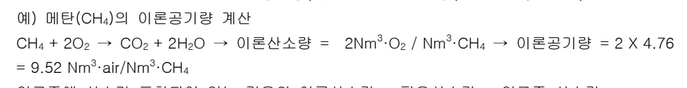
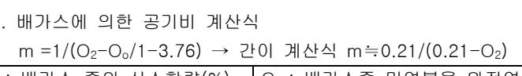
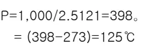

<h2>Page 1</h2>
<h1>1. 적용범위</h1>

열풍로는 송풍기에서 공급되는 공기를 예열 및 촉열을하여 열풍을 공급하는 설비로 고로에서 중요한 열풍로 조업관리기준 대하여 적용한다.

<h2>2. 목적</h2>

<ul><li>열풍로 설비는 고로의 노화 및 생산을 결정짓는 중요설비이다</li><li>열풍로의 효율적 운전 및 설비안정을 위해서는 설비 및 관리기준을 명확하게 파악하고 있어야 한다</li></ul>

<h2>3. 중점 관리항목</h2>

<table><thead><tr><th>품질영향인자</th><th>공정영향인자</th></tr></thead><tbody><tr><td>[Si], [S]</td><td>풍압, 노열</td></tr></tbody></table>
<a href="components/TP-030-120-010 열풍로 조업관리 기준(Rev.11)_0900bf4ba7a46003_usr0000bf4b95f9e446_p001_table_01.png">Table snapshot</a>

<h2>4. 조업 기준</h2>

<h3>4.1 열풍로 조업관리 기준</h3>

<table><thead><tr><th>구분</th><th>1BF</th><th>2BF</th><th>3BF</th><th>4BF</th></tr></thead><tbody><tr><td>송풍온도(℃)</td><td colspan="4">각 고로별 조업조건에 맞게 설정</td></tr><tr><td>Dome Max 온도(℃)</td><td>1320 이하</td><td>1320 이하</td><td>1400 이하</td><td>1400 이하</td></tr><tr><td rowspan="2">배 Gas</td><td>Max. 온도(℃)</td><td>350 이하</td><td>350 이하</td><td>350 이하</td><td>350 이하</td></tr><tr><td>O2(%)</td><td>0.1~1.0</td><td>0.1~1.0</td><td>1.0~2.5</td><td>1.0~2.5</td></tr></tbody></table>
<a href="components/TP-030-120-010 열풍로 조업관리 기준(Rev.11)_0900bf4ba7a46003_usr0000bf4b95f9e446_p001_table_02.png">Table snapshot</a>

(열풍로 운전조건에 따라 조업관리기준을 변경할 수 있음.)

<h3>4.2 열풍로 철피온도 관리기준</h3>

<table><thead><tr><th>구분</th><th>온도 관리 기준</th><th>비고</th></tr></thead><tbody><tr><td>Dome 철피</td><td>200 ±50℃</td><td>- 200~ 250℃:Air Cooling, Mortar 압입</td></tr><tr><td>기타 철피</td><td>200℃ 이하</td><td>- 250℃이상 : Mortar 압입</td></tr></tbody></table>
<a href="components/TP-030-120-010 열풍로 조업관리 기준(Rev.11)_0900bf4ba7a46003_usr0000bf4b95f9e446_p001_table_03.png">Table snapshot</a>

(열풍로 운전조건에 따라 관리기준을 변경할 수 있음.)

<h3>4.3. 열풍로 Dome 및 송풍온도 관리</h3>

가. 열풍로 Dome 온도 관리는 Type에 따라 다르며 외연식인 3,4 고로는 통상 1400℃ 이하로 관리하고 조업에 따라 변경할 수가 있다.

특히, 규석연와 열풍로의 수명은 Dome 온도 관리가 매우 중요하므로 정확하게 판단하여야 하며 열풍로 Dome 변경시는 매우 신중하게 판단하여 결정하여야 한다.

<h2>Page 2</h2>

나. 송풍온도 제어쪽은 목표 풍온 <math>\pm 5^{\circ}\mathrm{C}</math> 이내로 제어하되, 조업중 설비 이상시는 즉시 조치하여 목표 송풍온도 도달하도록 연소관리를 하여야 한다.

다. 송풍온도 목표치 조정시 사전에 COG 흔소율을 조정하여 측열도를 충분히 조정후 송풍온도를 상향, 또는 하향 조정한다.

<h2>5. 이상판단 및 조치기준</h2>

<h3>5.1 이상 판단 및 조치기준</h3>

가. 상기 열풍로관리 기준은 고로노황변동 또는 설비 Trouble 시 일시 조정될 수 있다

나. 열풍로 운전자는 평상시 열풍로관리 기준이 4.1, 4.2 항의 기준내에 있음을 확인하면서 운전 또는 감시를 한다.

다. 열풍로 운전자는 조업중 열풍로관리 기준이 4.1, 4.2 항의 기준에서 벗어났을 경우 조업변동 사항 및 기준에서 벗어난 조업지수와 관련한 설비에 대하여 정밀 Check 하면서 파트장에게 보고한 후 파트장의 지시를 받아 필요한 조치를 취한다.

뒷 장 계속

<h2>Page 3</h2>
<h2>6. 기술이론</h2>

<h3>6.1 연소이론</h3>

<h4>6.1.1 연소란</h4>

연료 + 산화제(공기, 산소) → 연소생성물 + 열 + 빛

<h4>6.1.2 연소관련 주요 용어</h4>

<h5>6.1.2.1 이론공기량</h5>

연료를 완전연소 시키는데 필요한 공기량 (<math>4.76 \times</math> 이론산소량 (<math>4.76 = 79/21 + 1</math>))

예) 메탄(<math>\text{CH}_4</math>)의 이론공기량 계산

<math display="block">\text{CH}_4 + 2\text{O}_2 \rightarrow \text{CO}_2 + 2\text{H}_2\text{O} \rightarrow \text{이론산소량} = \frac{2\text{Nm}^3 \cdot \text{O}_2}{\text{Nm}^3 \cdot \text{CH}_4} \rightarrow \text{이론공기량} = 2 \times 4.76 = 9.52 \text{Nm}^3 \cdot \text{air}/\text{Nm}^3 \cdot \text{CH}_4</math>

* 연료중에 산소가 포함되어 있는 경우의 이론산소량 = 필요산소량 - 연료중 산소량

<h5>6.1.2.2 이론공연비</h5>

연료 단위량당 필요한 이론공기량(공기량/연료량) - 메탄의 공연비 9.52

<h5>6.1.2.3 이론배가스(연소가스)량</h5>

이론공기량으로 완전연소시킬때의 배가스량(습배가스, 건배가스)

<h5>6.1.2.4 공기비(실제공연비와 이론공연비의 비)</h5>

가. 이론공기비로 연소시킬때의 공기비 1.0

나. 과잉 공기연소시의 공기비 <math>&gt; 1.0</math>

<h5>6.1.2.5 발열량</h5>

가. 고위발열량(총발열량) : 물의 응축(증발)장열 포함

<math display="block">\begin{aligned} H_h(\text{고위발열량}) &amp;= 3035 \times \text{CO} + 3050 \times \text{H}_2 + 9530 \times \text{CH}_4 + 15280 \times \text{C}_2\text{H}_4 + 14090 \times \text{C}_2\text{H}_2 + 35310 \times \text{C}_6\text{H}_6 \end{aligned}</math>

나. 저위발열량(진발열량) : 물의 증발장열 미포함 (실제이용 가능열량)

<math display="block">\begin{aligned} H_l(\text{저위발열량}) &amp;= 3035 \times \text{CO} + 2570 \times \text{H}_2 + 8570 \times \text{CH}_4 + 14320 \times \text{C}_2\text{H}_4 + 13600 \times \text{C}_2\text{H}_2 + 33870 \times \text{C}_6\text{H}_6 \end{aligned}</math>

<h5>6.1.2.6 실제 배가스량</h5>

이론 배가스량 + (공기비 <math>- 1</math>) X 이론 공기량

<h2>Page 4</h2>
<h3>6.1.2.7 가연한계(연료와 산화제(공기, 산소)혼합물이 연소를 지속할 수 있는 혼합비)</h3>

가. 가연 상한계 : 상대적 공기부족 (공기비 &lt; 1)

나. 가연 하한계 : 상대적 공기과잉 (공기비 &gt; 1)

다. 연료와 공기를 100 로 불때, 연료의 분율로서 가연범위는 하한계와 상한계 사이로서 가연한계 밖에서는 연소불가능

라. 실제 버너에서의 연소시는 가연한계가 달라지며, 온도가 높을수록 연소범위는 넓어짐

<h3>6.1.2.8 (자연)착화온도, 인화온도</h3>

가. 공기와 연료의 혼합물이 점화원이 없이도 연소가 시작되는 온도

나. 인화온도 : 고체나 액체연료의 경우 연료의 휘발분이 점화원에 의해 연소가 시작되는 온도

<h3>6.1.2.9 공기와 혼합시 가연기체의 연소범위</h3>

<table><thead><tr><th>가연기체</th><th>연소 범위 <math>C_1 - C_2</math></th><th>비고</th></tr></thead><tbody><tr><td><math>H_2</math></td><td>4.1 - 75</td><td><math>C_1</math> : 하한연소범위</td></tr><tr><td>CO</td><td>12.5 - 74</td><td><math>C_2</math> : 상한연소범위</td></tr><tr><td><math>CH_4</math></td><td>5.3 - 15</td><td></td></tr><tr><td><math>C_2H_2</math></td><td>2.3 - 8.2</td><td></td></tr><tr><td><math>C_2H_6</math></td><td>3.0 - 12.5</td><td></td></tr><tr><td><math>C_2H_4</math></td><td>3.1 - 32.1</td><td></td></tr><tr><td><math>C_3H_8</math></td><td>2.2 - 9.5</td><td></td></tr></tbody></table>
<a href="components/TP-030-120-010 열풍로 조업관리 기준(Rev.11)_0900bf4ba7a46003_usr0000bf4b95f9e446_p004_table_01.png">Table snapshot</a>

<h3>6.1.2.10 가연연소범위 결정</h3>

Le Chatelier 계산식 이용

<math display="block">L_m = 100/(P_1/n_1) + (P_2/n_2) + (P_3/n_3) + \dots</math>

단, <math>P_1</math>, <math>P_2</math>, <math>P_3</math>는 혼합가스 중의 가연가스성분

<math>n_1</math>, <math>n_2</math>, <math>n_3</math>는 각가스의 상한연소범위(<math>C_2</math>) 혹은 하한연소범위(<math>C_1</math>)를 %로 표시

<h3>6.1.2.11 연소계산</h3>

연소계산에서는 이론공기량, 실제공기량, 실제배 Gas량등 연소와관련된 기본계산이 필요하며 이러한 연소계산은 설비의 용량산정도 중요함

뒷 장 계속

<h2>Page 5</h2>

가. 단일가스의 연소표

<table><thead><tr><th colspan="2">연료</th><th rowspan="2">연소방정식과 분자수</th><th colspan="4">연료 <math>1\text{Nm}^3</math>에 대하여</th></tr><tr><th>명칭</th><th>분자식</th><th>공기량 (<math>\text{Nm}^3</math>)</th><th colspan="3">연소가스량 (<math>\text{Nm}^3</math>)</th></tr><tr><th></th><th></th><th></th><th><math>\text{O}_2</math></th><th><math>\text{N}_2</math></th><th><math>\text{CO}_2</math></th><th><math>\text{H}_2\text{O}</math></th></tr></thead><tbody><tr><td>수소</td><td><math>\text{H}_2</math></td><td><math>2\text{H}_2 + \text{O}_2 = 2\text{H}_2\text{O}</math> 2 1 2</td><td>0.5</td><td>1.88</td><td>0</td><td>1</td></tr><tr><td>일산화탄소</td><td><math>\text{CO}</math></td><td><math>2\text{CO} + \text{O}_2 = 2\text{CO}_2</math> 2 1 2</td><td>0.5</td><td>1.88</td><td>1</td><td>0</td></tr><tr><td>메탄</td><td><math>\text{CH}_4</math></td><td><math>\text{CH}_4 + 2\text{O}_2 = \text{CO}_2 + 2\text{H}_2\text{O}</math> 1 2 1 2</td><td>2</td><td>7.52</td><td>1</td><td>2</td></tr><tr><td>에틸렌</td><td><math>\text{C}_2\text{H}_4</math></td><td><math>\text{C}_2\text{H}_4 + 3\text{O}_2 = 2\text{CO}_2 + 2\text{H}_2\text{O}</math> 1 3 2 2</td><td>3</td><td>11.28</td><td>2</td><td>2</td></tr><tr><td>아세틸렌</td><td><math>\text{C}_2\text{H}_2</math></td><td><math>2\text{C}_2\text{H}_2 + 5\text{O}_2 = 4\text{CO}_2 + 2\text{H}_2\text{O}</math> 2 5 4 2</td><td>2.5</td><td>9.40</td><td>2</td><td>1</td></tr><tr><td>탄화수소</td><td><math>\text{C}_m\text{H}_n</math></td><td><math>\text{C}_m\text{H}_n + (m+n/4)\text{O}_2 = m\text{CO}_2 + n/2\text{H}_2\text{O}</math></td><td><math>m+n/4</math></td><td><math>3.76(m+n/4)</math></td><td><math>m</math></td><td><math>n/2</math></td></tr></tbody></table>
<a href="components/TP-030-120-010 열풍로 조업관리 기준(Rev.11)_0900bf4ba7a46003_usr0000bf4b95f9e446_p005_table_01.png">Table snapshot</a>

나. 이론연소공기량(<math>L_0</math>) = <math>1/0.21(0.5\text{H}_2 + 0.5\text{CO} + 2\text{CH}_4 + 3\text{C}_2\text{H}_4 + 2.5\text{C}_2\text{H}_2 + \dots - \text{O}_2)</math>

다. 실제연소공기량(<math>L</math>) = <math>mL_0</math>(<math>m</math> : 과잉공기비)

라. <math>m</math> = 실제공기량/이론공기량

마. 배가스에 의한 공기비 계산식

<math display="block">m = 1/(O_2 - O_0/1 - 3.76) \rightarrow \text{간이 계산식 } m \approx 0.21/(0.21 - O_2)</math>

<table><tr><td><math>O_2</math>: 배가스 중의 산소함량(%)</td><td><math>O_0</math>: 배가스중 미연분을 완전연소에 필요한 이론산소량(%)</td></tr><tr><td><math>n</math>: 연료가스중 질소함량(%)</td><td><math>N_2</math>: 배가스중 질소함량(%)</td></tr></table>
<a href="components/TP-030-120-010 열풍로 조업관리 기준(Rev.11)_0900bf4ba7a46003_usr0000bf4b95f9e446_p005_table_02.png">Table snapshot</a>

6.1.2.12 열용량 및 비열

가. 열용량

어떤물체의 온도를 <math>1^\circ\text{C}</math> 높이는데 필요한 열량을 그물체의 열용량(<math>\text{kcal}/^\circ\text{C}</math>)이라고 한다.

나. 어떤물질 <math>1\text{g}</math>의 온도를 <math>1^\circ\text{C}</math> 높이는데 필요한 열량을 그물질의 비열이라고 하고 질량이 <math>m(\text{kg})</math>인 물질의 온도를 <math>dt(^\circ\text{C})</math>만큼 올리는데 필요한 열량이 <math>dQ(\text{kcal})</math>이면 이물질의 비열(<math>\text{kcal}/\text{kg}^\circ\text{C}</math>) = <math>(dQ(\text{kcal})/m(\text{g}) \cdot dt(^\circ\text{C}))</math>

뒷 장 계속

<h2>Page 6</h2>
<h2>6.2 열풍로 철피 SCC(Stress Corrosion Crack)발생 Mechanism</h2>

<h3>6.2.1 SCC Mechanism</h3>

공기 (<math>N_2 + O_2</math>) BFG + COG 연소 <math>1400^{\circ}C</math> 이상 Nox <math>H_2O</math> 응축 <math>(140^{\circ}C</math> 이하) <math>HNO_3, HNO_2</math> HS 철피내면접촉 응력 잔존철피 결정입계부식 HS 철피내면접촉

<h3>6.2.2 NOx에 의한 응력 부식 Crack</h3>

▷ 열풍로 Dome 온도가 <math>1,300^{\circ}C</math>까지는 NOx 농도는 철피 부근에 매우 낮게 존재하며 이때는 실제로 부식 및 균열현상을 일으키지는 않고 <math>1,300^{\circ}C \sim 1,400^{\circ}C</math>에서는 NOx 농도가 서서히 증가하고 <math>1,400^{\circ}C</math> 이상에서는 NOx가 매우 심하게 형성되어 부식 및 균열현상을 쉽게 야기시킨다.

0.01 NO Gas 농 0.004 1,300 1,400 1,500 <math>^{\circ}C</math> → Dome 온도

▷ NOx의 노점이 <math>140^{\circ}C</math> 정도이기 때문에 Dome 철피온도 <math>140^{\circ}C</math> 이하에서는 NOx 응축현상으로 철피 Crack이 증가한다.

뒷 장 계속

<h2>Page 7</h2>
<h2>6.3 열풍로 배열회수 설비</h2>

열풍로 연돌로 폐기되는 배 Gas 열량을 배열회수설비를 설치, 열매를 순환시켜 HE-1 에서 배열을 일정온도 이상을 열매에 흡수시키고 HE-2,HE-3 에서 방열시킴으로 연소공기와 BFG 를 승온시켜 배열을 회수하는 성에너지 설비임

<h3>6.3.1 산로점 온도 관리</h3>

<h4>6.3.1.1 전제조건</h4>

<table><thead><tr><th>*조업조건</th><th>배 GAS 측정결과</th><th>비고</th></tr></thead><tbody><tr><td>COG 흔소율: 8%</td><td>H2O: 7%</td><td rowspan="2">-배 Gas 중 SO3 성분은 SOx 화합물의 5% 정도임</td></tr><tr><td></td><td>SOx: 82 ppm(SO3:4.1ppm)</td></tr></tbody></table>
<a href="components/TP-030-120-010 열풍로 조업관리 기준(Rev.11)_0900bf4ba7a46003_usr0000bf4b95f9e446_p007_table_01.png">Table snapshot</a>

<h4>6.3.1.2 계산식</h4>

<math display="block">\begin{aligned}1,000/TDP &amp;= 1.7842 + 0.0269\log H_2O - 0.1029\log SO_3 + 0.0329(\log H_2O \times \log SO_3) \\&amp;= 1.7842 + 0.0296\log 0.07 - 0.1029 \times \log 4.1 \times 10^{-6} + 0.0329(\log 0.07 \times \log 4.1 \times 10^{-6}) \\&amp;= 1.7842 + (-0.03107) - (-0.5543) + 0.2047 \\&amp;= 2.5121\end{aligned}</math>

따라서 <math>TDP = 1,000 / 2.5121 = 398</math>. K

<math display="block">= (398 - 273) = 125^{\circ}\text{C}</math>

<h4>6.3.1.3 현조업시 산로점 온도 관리</h4>

HE-1 Fin Tube 의 산로점 온도관리 :

(HE-1 배 Gas 출구온도 + HE-1 열매입구온도) ≥ 130℃ 로써

HE-1 의 배 Gas 출구온도 150℃, HE-1 의 열매입구온도 110℃ 이상으로 관리하여

TDP 가 130℃ 이상으로 관리하고 있다.

<h4>6.3.1.4 배열회수 향상 방안</h4>

가. 열매유량 증대로 배열회수량 증대

나. 1기연소시 산로점 온도 및 He-1 열매입구온도 관리

다. 열매적정 유량제어변 설치 재검토

가. HE-1 Bundle 노후화로 순차적인 계획정비 및 교체

나. 열풍로 배 Gas 중 H2O, SOx 성분분석을 1회/년 실시 산로점온도 산출 조업에 적용

다. 열매의 열화상태 분석 1회/년 실시로 배열회수 설비의 효율향상

라. 주기적 Sensor 점검 및 열교환기의 Fin Tube 상태를 점검하여 부착물상태 점검

<h4>6.3.1.5 열풍로 효율 향상을 위한 조업관리 방안</h4>

가. 풍온조정에 따른 M-GAS 적정유량(흔소율)조정

<h2>Page 8</h2>

나. 배 GAS 온도관리(HE-1 배 Gas 출구온도)로 배열회수열량 증대 다. 각호별 열풍로 특성에 따른 최적 Control로 열 Blance 유지 라. 철피온도 관리강화로 방산열 최소화 마. 주기적 열정산으로 열효율관리 필요

<h2>6.4 열풍로 설비관리</h2>

<h3>6.4.1 열풍로 설비관리</h3>

<h4>6.4.1.1 일상관리 항목</h4>

가. 누풍

누풍은 에너지 손실뿐 아니라 설비사고로 연결되며, 또한 Mortar, Castable 재를 열화시키고, 특히 열풍의 Leak는 철피의 열화를 촉진시킨으로 세심한 관리가 필요하다.

나. 철피온도

Nox 가 존재하는 부분의 철피에 대해서는 부식 Crack을 방지하기 위해 <math>140^{\circ}\text{C}</math> 이상의 온도 유지가 필요하다. 그러나 철피의 Creep 성으로 인해 <math>250^{\circ}\text{C}</math> 이상 올려서는 안된다. 철피온도가 <math>250^{\circ}\text{C}</math> 이상 상승시 연와와 철피사이에 Gas 흐름을 예상하여 압입을 실시한다.

다. 각설비 기기 동작 : 동작시간, 전류치, 이음, 진동등의 상태를 확인한다

라. 열풍변 냉각상태 : 급, 배수량, 냉각수 온도의 추이, 수질상태를 확인한다.

마. 계측기기 : 각종계기의 정상동작 상태를 확인한다

<h4>6.4.1.2 설비점검</h4>

가. 일상점검 : 2 회/Shift(교대반원), 1 회/Shift(교대주임)

나. 정밀점검 : 1 회/주(상주 운전파트장 주관)

다. 특별점검 : Thermo View 촬영 1 회/반기 - 3,4 고로 열풍로 현장 Mortar 압입기 1 대 배치

<h4>6.4.1.3 열풍로 정기관리 항목</h4>

가. Dome 침하

<h2>Page 9</h2>

Dome 연와의 Creep 진행상황을 Check 하기 위하여 정기적(정수 및 계휴시)으로 측정하고 Dome 침하가 빠른경우 Dome 온도를 낮춘다.

<h4>나. Checker 압손</h4>

Checker 연와 압손을 정기적으로 측정하여 연와의 손상 막힘등을 점검한다

<h4>다. Burner 점검</h4>

Burne의 Air 및 Gas Chamber 에 들어가 연외의 Spalling 발생등을 점검한다

<h4>라. Checker 수금물</h4>

Checker 수금물의 이동 Checker 연와의 이상유무를 점검한다

<h4>마. 수처리설비</h4>

열교환능력에 관계되는 배관막힘,유량,유온등의 Check

<h4>바. Valve 유</h4>

열풍변 누수 및 각변의 각변의 Seat 정기적 Check

<h2>6.5 열풍로 비상작업</h2>

<h3>6.5.1 고로휴풍시 고로내 역류방지</h3>

열풍변 폐로 고로휴풍이 되면 Air B/L 변을열어 역류해오는 Gas 를 대기에 방산하여야 한다.

열풍변의 Sealing 은 풍압으로 이루어지나 고로휴풍시 Sealing 이 불가능하여 고로내 역류 gas 가

열풍변 또는 혼합냉풍변내로 들어와 폭발을 일으킨다.

<h3>6.5.2 전정시 비상작업</h3>

공장정전인지,전정전인지 확인한다,

공장정전인 경우 송풍기는 기동되고 있으므로 후속조치를 취하면되나 전정전인 경우, 송풍기가

정지되므로 바로 휴풍을 해야하기 때문이다.

<h4>6.5.2.1 고로공장 정전</h4>

가. 비상발전기 기동을 확인한다

나. 연소로를 휴지한다(비상발전기 기동이 지연될 경우 현장수동 조작실시)

다. 열풍변 냉각수 당수에서 해수로 교체 및 수량확인을 한다

라. 이후 복전여부에 따라 휴풍또는 중풍을 한다

<h4>6.5.2.2 전정전</h4>

<h2>Page 10</h2>

마. 비상발전기 기동을 확인한다.

바. 열풍변을 Close 한다(M/R 비상 Air Cock 로 Close 한다)

사. 연소로를 휴지 한다

아. 복전이 되면 Back Draft 를 실시한다

‘끝.’

이 하 여 백
