<h2>Page 1</h2>
<h1>1. 적용범위</h1>

고로에 열풍을 공급해주는 열풍로의 촉열을 위한 연소관리 기술에 대하여 적용한다.

<h2>2. 목 적</h2>

열풍로 촉열실의 가열을 위한 연소실 하부에 설치된 버너(Burner) 에서의 사용되는 BFG 및 COG 의 최적 연소조건을 구축하여서 열풍로 열효율 향상및 안정된 고온의 열풍을 공급 하는데 목적이 있다.

<h2>3. 중점관리 항목</h2>

<table><thead><tr><th>품질영향 인자</th><th>공정영향 인자</th></tr></thead><tbody><tr><td>[Si], [S]</td><td>풍압, 노열</td></tr></tbody></table>
<a href="components/TP-030-120-020 열풍로 연소기술 기준(Rev.11)_0900bf4ba7a451f1_usr0000bf4b95f9e446_p001_table_01.png">Table snapshot</a>

<h2>4. 조업기준 : 열풍로 연소조건 설정 기준</h2>

<h3>4.1 연소용 Gas 유량 계산</h3>

목표 연소용 GAS 유량 계산은 연소중인 각 열풍로 별로 계산하고 있으며, Gas 유량은 목표열량, Gas Calorie, 열풍로 열효율과 관계가 있으며 그 관계는 다음과 같다

<math display="block">\text{Gas 유량} = (\text{목표열량} - \text{축적된 열}) \div (\eta \times \text{Cal} \times \text{잔여시간})</math>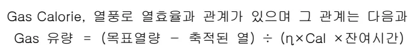

<h3>4.2 열풍로 연소계산</h3>

<h4>4.2.1 단일가스의 연소표</h4>

<table><thead><tr><th colspan="2">연료</th><th rowspan="3">연소방정식과 분자수</th><th colspan="4">연료 1Nm3에 대하여</th></tr><tr><th rowspan="2">명칭</th><th rowspan="2">분자식</th><th colspan="2">공기량 (Nm3)</th><th colspan="2">연소가스량 (Nm3)</th></tr><tr><th>O2</th><th>N2</th><th>CO2</th><th>H2O</th></tr></thead><tbody><tr><td>수소</td><td>H2</td><td>2H2 + O2 = 2H2O 2 1 2</td><td>0.5</td><td>1.88</td><td>0</td><td>1</td></tr><tr><td>일산화탄소</td><td>CO</td><td>2CO + O2 = 2CO2 2 1 2</td><td>0.5</td><td>1.88</td><td>1</td><td>0</td></tr><tr><td>메탄</td><td>CH4</td><td>CH4 + 2O2 = CO2 + 2H2O 1 2 1 2</td><td>2</td><td>7.52</td><td>1</td><td>2</td></tr><tr><td>에틸렌</td><td>C2H4</td><td>C2H4 + 3O2 = 2CO2 + 2H2O 1 3 2 2</td><td>3</td><td>11.28</td><td>2</td><td>2</td></tr><tr><td>아세틸렌</td><td>C2H2</td><td>2C2H2 + 5O2 = 4CO2 + 2H2O 2 5 4 2</td><td>2.5</td><td>9.40</td><td>2</td><td>1</td></tr><tr><td>탄화수소</td><td>CmHn</td><td>CmHn + (m+n/4)O2 = mCO2 + n/2H2O</td><td>m+n/4</td><td>3.76(m+n/4)</td><td>m</td><td>n/2</td></tr></tbody></table>
<a href="components/TP-030-120-020 열풍로 연소기술 기준(Rev.11)_0900bf4ba7a451f1_usr0000bf4b95f9e446_p001_table_02.png">Table snapshot</a>

<h2>Page 2</h2>
4.2.2 공기와 혼합시 가연기체의 연소범위

<table><thead><tr><th>가연기체</th><th>연소 범위 <math>C_1 - C_2</math></th><th>비고</th></tr></thead><tbody><tr><td>H2</td><td>4.1 - 75</td><td rowspan="7">C1: 하한연소범위 C2: 상한연소범위</td></tr><tr><td>CO</td><td>12.5 - 74</td></tr><tr><td>CH4</td><td>5.3 - 15</td></tr><tr><td>C2H2</td><td>2.3 - 8.2</td></tr><tr><td>C2H6</td><td>3.0 - 12.5</td></tr><tr><td>C2H4</td><td>3.1 - 32.1</td></tr><tr><td>C3H8</td><td>2.2 - 9.5</td></tr></tbody></table>
<a href="components/TP-030-120-020 열풍로 연소기술 기준(Rev.11)_0900bf4ba7a451f1_usr0000bf4b95f9e446_p002_table_01.png">Table snapshot</a>

- 가연연소범위 결정

Le Chatelier 계산식 이용

<math>L_m = 100/(P_1/n_1) + (P_2/n_2) + (P_3/n_3) + 	ext{...}</math>, 단, <math>P_1, P_2, P_3</math>는 혼합가스 중의 가연가스성분

<math>n_1, n_2, n_3</math>는 각가스의 상한연소범위(<math>C_2</math>) 혹은 하한연소범위(<math>C_1</math>)를 %로 표시

4.2.3 Gas 발열량 계산식

4.2.3.1 Gas 성분별 발열량 보정식

<math display="block">C_2H_4 + 3O_2 = 2CO_2 + 2H_2O + 14,320 	ext{ KCal/N m}^3</math>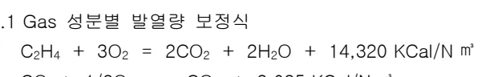

<math display="block">CO + 1/2O_2 = CO_2 + 3,035 	ext{ KCal/N m}^3</math>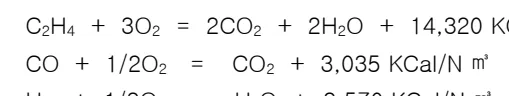

<math display="block">H_2 + 1/2O_2 = H_2O + 2,570 	ext{ KCal/N m}^3</math>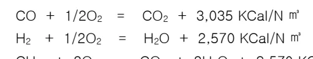

<math display="block">CH_4 + 2O_2 = CO_2 + 2H_2O + 8,570 	ext{ KCal/N m}^3</math>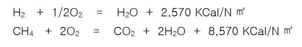

4.2.3.2 고위발열량(총발열량) : 물의 응축(증발)잠열 포함

<math display="block">H_h(	ext{고위발열량}) = 3035 	imes CO + 3050 	imes H_2 + 9530 	imes CH_4 + 15280 	imes C_2H_4 + 14090 	imes C_2H_2 + 35310 	imes C_6H_6</math>

4.2.3.3 저위발열량(진발열량) : 물의 증발잠열 미포함 (실제이용 가능열량)

<math display="block">H_l(	ext{저위발열량}) = 3035 	imes CO + 2570 	imes H_2 + 8570 	imes CH_4 + 14320 	imes C_2H_4 + 13600 	imes C_2H_2 + 33870 	imes C_6H_6</math>

4.2.3.4 COG Gas의 발열량 계산예 (H2 58%, CO 7.8%, CH4 25%, C2H4 3.0%)

<math display="block">	ext{발열량 } H_e = 14,320 	imes 0.03 + 8750 	imes 0.25 + 3035 	imes 0.078 + 2570 	imes 0.58 = 4300 	ext{ KCal/N m}^3</math>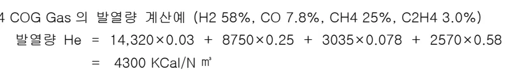

4.2.3.5 BFG Gas의 발열량 계산예 (H2 3.1%, CO 21%, CO2 21.5%, N2 54.4%)

<math display="block">	ext{발열량 } H_e = 3035 	imes 0.21 + 2570 	imes 0.03 = 715 	ext{ KCal/N m}^3</math>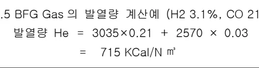

<h2>Page 3</h2>
<h4>4.2.4 이론 연소공기량 계산</h4>

<table><thead><tr><th>구분</th><th>이론 연소공기량 계산</th></tr></thead><tbody><tr><td>COG</td><td><math display="block">A_0 = 1/0.21 \times (0.5H_2 + 0.5CO + 3C_2H_4 + 2CH_4)</math><math display="block">= 1/0.21 \times (0.5 \times 0.58 + 0.5 \times 0.078 + 3 \times 0.03 + 2 \times 0.25)</math><math display="block">= 4.352 \text{ N m}^3/\text{N m}^3</math></td></tr><tr><td>BFG</td><td><math display="block">A_0 = 1/0.21 \times (0.5H_2 + 0.5CO)</math><math display="block">= 1/0.21 \times (0.5 \times 0.031 + 0.5 \times 0.21)</math><math display="block">= 0.57 \text{ N m}^3/\text{N m}^3</math></td></tr></tbody></table>
<a href="components/TP-030-120-020 열풍로 연소기술 기준(Rev.11)_0900bf4ba7a451f1_usr0000bf4b95f9e446_p003_table_01.png">Table snapshot</a>

<h4>4.2.5 이론 연소배기 Gas량 계산</h4>

<table><thead><tr><th>구분</th><th>C O G</th><th>BFG</th></tr></thead><tbody><tr><td>CO2</td><td><math display="block">CO_2 = CO + CH_4 + 2C_2H_4 + CO_2</math><math display="block">= 0.078 + 0.25 + 2 \times 0.03 + 0.028</math><math display="block">= 0.416 \text{ N m}^3/\text{N m}^3</math></td><td>0.215</td></tr><tr><td>H2O</td><td><math display="block">H_2O = H_2 + 2CH_4 + 2C_2H_4</math><math display="block">= 0.58 + 2 \times 0.25 + 2 \times 0.03 = 1.14 \text{ N m}^3/\text{N m}^3</math></td><td>0.025</td></tr><tr><td>N2</td><td><math display="block">N_2 = N_2 + 0.79 \times A_0 = 0.027 \text{ N m}^3/\text{N m}^3</math></td><td>0.99</td></tr><tr><td>TOTAL</td><td><math display="block">G \text{ total} = CO_2 + H_2O + N_2 = 5.021 \text{ N m}^3/\text{N m}^3</math></td><td>1.23</td></tr></tbody></table>
<a href="components/TP-030-120-020 열풍로 연소기술 기준(Rev.11)_0900bf4ba7a451f1_usr0000bf4b95f9e446_p003_table_02.png">Table snapshot</a>

<h4>4.2.6 이론연소온도 계산 (COG)</h4>

<math display="block">\begin{aligned}&amp;= (\text{발열량} + \text{COG 비열} \times \text{COG 온도} + \text{연소공기 비열} \times \text{연소공기 온도} \times \text{연소공기 이론량}) \\&amp;\div (\text{배가스 비열} \times \text{배가스량}) \\&amp;= (4.300 + 0.335 \times 25 + 0.309 \times 25 \times 4.352) \div (0.304 \times 5.021) = 2485^{\circ}\text{C}\end{aligned}</math>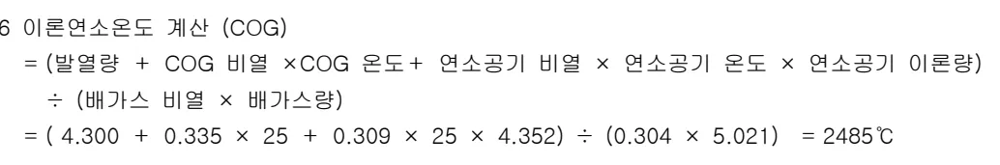

<h4>4.2.7 실제연소 온도 계산</h4>

이론 연소공기로 gAS을 완전연소 하기는 불가능 한데, 이는 Burner 에서 Air 와 Gas 를 100% 연소역(폭발한계)으로 혼합연소 할수 없고 부분적으로 Air/Gas 비의 분포차이가나게된다. 경험상 COG 와 BFG 는 2~10%의 과잉공기를 투과시 최고연소온도에 도달되고 있음이 발견되었다.

COG 실제의 연소온도 : 2441°C

BFG 실제의 연소온도 : 1833°C

<h4>5. 이상판단 및 조치기준 : 해당사항 없음</h4>

뒷장 계속

<h2>Page 4</h2>
<h2>6. 기술이론</h2>

<h3>6.1 열 정 산</h3>

<h4>6.1.1 열정산 목적</h4>

공급열량과 그 사용 상태를 명확히 하고 열의 입,출열량의 관계를 정산하고 열의분포 상태를 파악, 열손실을 최소화하여 열풍로 열효율을 증진하기 위한 필요한 기초자료 확보.

<h4>6.1.2 전제 조건</h4>

- 대상고로 : 3고로 열풍로

- Data : 일평균 Data 적용

<h5>6.1.2.1 조업지수 및 비열</h5>

<table><thead><tr><th colspan="2">조업 지수</th><th colspan="2">조업 지수</th><th colspan="2">비열(kcal/N m3 °C)</th></tr></thead><tbody><tr><td>송풍시간(분)</td><td>63</td><td>열풍온도(°C)</td><td>1120</td><td>열풍</td><td>0.340</td></tr><tr><td>연소시간(분)</td><td>51</td><td>냉풍온도(°C)</td><td>173</td><td>건열풍습분</td><td>0.400</td></tr><tr><td>송풍유량(N m3/Min)</td><td>2901</td><td>연소 Air 온도(°C)</td><td>50</td><td>산소</td><td>0.3126</td></tr><tr><td>산소부화(N m3/hr)</td><td>15391</td><td>BFG 온도(°C)</td><td>86</td><td>연소공기</td><td>0.310</td></tr><tr><td>Air 유량(N m3/hr)</td><td>98452</td><td>COG 온도(°C)</td><td>16</td><td>연소공기습분</td><td>0.341</td></tr><tr><td>BFG 유량(N m3/hr)</td><td>88228</td><td>C/G 온도(°C)</td><td>47</td><td>냉풍</td><td>0.311</td></tr><tr><td>COG 유량(N m3/hr)</td><td>6437</td><td>M/G 온도(°C)</td><td>85</td><td>냉풍습분</td><td>0.345</td></tr><tr><td>M/G 유량(N m3/hr)</td><td>94665</td><td>W/G 온도(°C)</td><td>224</td><td>배 Gas 중 CO2</td><td>0.441</td></tr><tr><td>M-Gas 발열량(kcal)</td><td>966</td><td>대기온도(°C)</td><td>2.2</td><td>N2</td><td>0.312</td></tr><tr><td>COG 발열량(kcal)</td><td>4119</td><td>대기습분(g/N m3)</td><td>1.84</td><td>O2</td><td>0.322</td></tr><tr><td>COG 비율(%)</td><td>6.8</td><td>송풍습분(g/N m3)</td><td>10.0</td><td>습분</td><td>0.350</td></tr><tr><td>BFG 비율(%)</td><td>93.2</td><td>습분계수</td><td>0.001244</td><td>BFG</td><td>0.327</td></tr><tr><td>A/G</td><td>1.04</td><td>W/G O2(%)</td><td>2.46</td><td>COG</td><td>0.327</td></tr></tbody></table>
<a href="components/TP-030-120-020 열풍로 연소기술 기준(Rev.11)_0900bf4ba7a451f1_usr0000bf4b95f9e446_p004_table_01.png">Table snapshot</a>

<h5>6.1.2.2 연료(Gas) 성분(%)</h5>

<table><thead><tr><th>구분</th><th>Co</th><th>Co2</th><th>H2</th><th>N2</th><th>CH4</th><th>C2H4</th><th>O2</th><th>비고</th></tr></thead><tbody><tr><td>COG</td><td>6.2</td><td>2.4</td><td>53.9</td><td>8.9</td><td>24.9</td><td>2.9</td><td>0.9</td><td>4119 kcal</td></tr><tr><td>BFG</td><td>21.1</td><td>22.7</td><td>3.7</td><td>52.4</td><td>-</td><td>-</td><td>-</td><td>735 kcal</td></tr></tbody></table>
<a href="components/TP-030-120-020 열풍로 연소기술 기준(Rev.11)_0900bf4ba7a451f1_usr0000bf4b95f9e446_p004_table_02.png">Table snapshot</a>

<h5>6.1.3 입열량(B0) : 연소,송풍 1Cycle 동안 열풍로에 투입된 총열량</h5>

<h6>6.1.3.1 M-Gas 연소열(B1) : 연소중 M-Gas 가 연소해서 발생하는 열량</h6>

<math display="block">B1 = M\text{-Gas량} \times M\text{-Gas 발열량} \times \frac{\text{연소시간}}{60} = 94665 \times 966 \times \frac{51}{60} = 77729432 \text{ KCal}</math>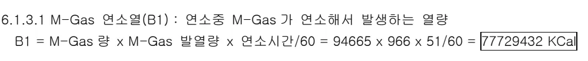

<h2>Page 5</h2>

6.1.3.2 연소용 Air 현열(B2) : 연소중 연소용 Air 가 열풍로에 가지고 들어오는 열량

<math display="block">\begin{aligned}B2 &amp;= ((1-\text{습분계수} \times \text{대기습분}) \times \text{공기비열} + 0.001244 \times \text{대기습분} \times \text{습분비열}) \times \\&amp;\text{연소용 Air 온도} \times \text{연소용 Air 유량} \times \text{연소시간} / 60 \\&amp;= ((1-0.001244 \times 1.84) \times 0.31 + 0.001244 \times 1.84 \times 0.341) \times 50.0 \times 98452 \times 51/60 \\&amp;= \boxed{297402 \text{ KCal}}\end{aligned}</math>
공기비열 : 0.310, 습분(수증기)비열 : 0.341
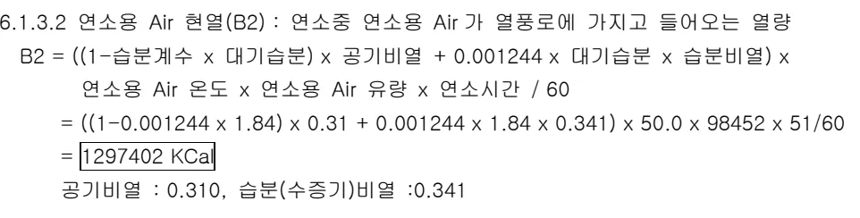

6.1.3.3 M-Gas 현열(B3) : 연소중 M-Gas 가 열풍로에 가지고 들어오는 열량

<math display="block">\begin{aligned}B3 &amp;= \text{M-Gas 량} \times (\text{COG 비열} \times \text{COG 온도} \times \text{COG 비율} + \text{BFG 비열} \times \text{BFG 온도} \times \\&amp; (1 - \text{COG 비율})) \times \text{연소시간} / 60 \\&amp;= 94665 \times (0.327 \times 16.0 \times 0.068 + 0.327 \times 86.0 \times (1 - 0.068)) = \boxed{2137598 \text{ KCal}}\end{aligned}</math>
BFG 비열: 0.327, COG 비열: 0.327
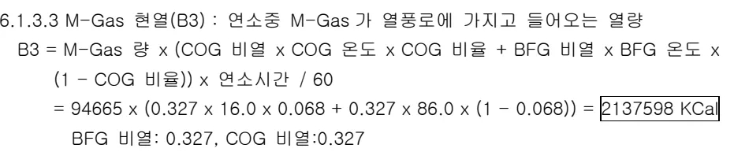

6.1.3.4 냉풍 건 현열(B4) : 송풍중 냉풍 및 산소부화량이 열풍로에 가지고 들어오는 열량

<math display="block">\begin{aligned}B4 &amp;= (1-\text{습분계수} \times \text{냉풍습분}) \times \text{송풍유량} \times \text{냉풍비열} \times \text{냉풍온도} \times \text{송풍시간} + \\&amp; (\text{산소취입량}/2) \times \text{산소비열} \times \text{냉풍온도} \times \text{송풍시간} \times 1/60 \\&amp;= (1-0.001244 \times 10) \times 2901 \times 0.311 \times 173 \times 63 + (15391/2) \times 0.3126 \times 173 \times \\&amp; 63 \times 1/60 = \boxed{9519136 \text{ KCal}}\end{aligned}</math>
냉풍비열 : 0.311, 산소비열: 0.3126
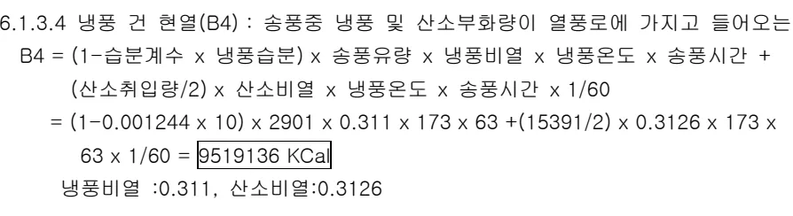

6.1.3.5 냉풍 습분 현열(B5) : 송풍중 냉풍중의 수증기가 열풍로에 가지고 들어오는 열량

<math display="block">\begin{aligned}B5 &amp;= \text{습분계수} \times \text{냉풍습분} \times \text{송풍유량} \times \text{냉풍 수증기 비열} \times \text{냉풍온도} \times \text{송풍시간} \\&amp;= 0.001244 \times 10 \times 2901 \times 0.345 \times 173 \times 63 = \boxed{106897 \text{ KCal}}\end{aligned}</math>
냉풍습분 비열: 0.345

6.1.4 총열량(A0) : 연소, 송풍 1Cycle 동안 열풍로에서 지출된 총열량

6.1.4.1 열풍 건 현열(A1) : 송풍중 열풍 및 산소부하가 열풍로에서 가지고 나가는 열량

<math display="block">\begin{aligned}A1 &amp;= (1-\text{습분계수} \times \text{냉풍습분}) \times \text{송풍유량} \times \text{열풍비열} \times \text{열풍온도} \times \text{송풍시간} + \\&amp; (\text{산소취입량}/2) \times \text{산소비열} \times \text{송풍온도} \times \text{송풍시간}/60 \\&amp;= (1-0.001244 \times 10) \times 2901 \times 0.340 \times 1120 \times 63 + (15391/2) \times 0.3126 \times 1120 \times \\&amp; 63/60 = \boxed{69711403 \text{ Kcal}}\end{aligned}</math>
열풍비열: 0.340
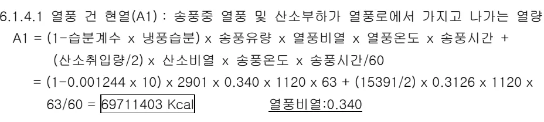

6.1.4.2 열풍습분 현열(A2) : 송풍중 열풍중의 수증기가 열풍로에서 가지고 나가는 열량

<math display="block">\begin{aligned}A2 &amp;= \text{습분계수} \times \text{냉풍습분} \times \text{송풍유량} \times \text{건열풍 수증기 비열} \times \text{송풍온도} \times \text{송풍시간} \\&amp;= 0.001244 \times 10 \times 2901 \times 0.400 \times 1120 \times 63 = \boxed{991174 \text{ KCal}}\end{aligned}</math>
건열풍습분 비열 : 0.400
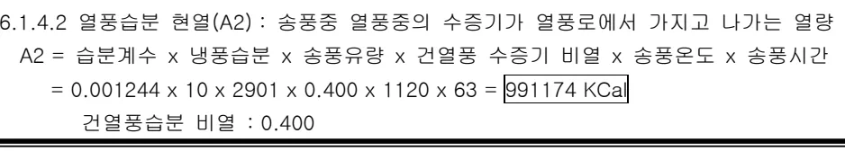

<h2>Page 6</h2>
6.1.4.3 배 Gas 치출열(A3): 연소기간중 열풍로에서 가지고 나가는 배 Gas 총열량

<math display="block">A3 = (FCO2 \times CO2 \text{ 비열} + FN2 \times N2 \text{ 비열} + FO2 \times O2 \text{ 비열} + FH2O \times \text{배 Gas 중 수증기비열}) \times \\ \text{배 Gas 평균온도} \times \text{연소시간}/60 = (41174 \times 0.441 + 124946 \times 0.312 + 3706 \times 0.322 + 10530 \times \\ 0.350) \times 224 \times 51/60 = \boxed{11808494 \text{ Kcal}}</math>

<math display="block">CO2 \text{ 비열}: 0.441, N2 \text{ 비열}: 0.312, O2 \text{ 비열}: 0.322, \text{배 GAS 중 수증기 비열}: 0.350</math>

6.1.4.4 배 Gas 유량 산출

(1) BFG 를 완전 연소하는데 필요한 O2 량 (X1)

<math display="block">X1 = \text{BFG 유량} \times (\text{BFG 중 CO} + \text{BFG 중 H2}) \times 0.5 = 88228 \times (0.211 + 0.037) \times 0.5 \\ = \boxed{10940 \text{ Nm}^3/\text{hr}}</math>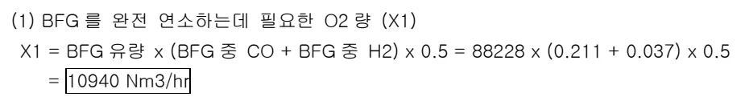

(2) COG 를 완전 연소하는데 필요한 O2 량 (X2)

<math display="block">X2 = \text{COG 유량} \times (3.5 \times \text{COG 중 C2H6} + 3 \times \text{COG 중 C2H4} + 2 \times \text{COG 중 CH4} + 0.5 \times \\ (\text{COG 중 CO} + \text{COG 중 H2})) = 6437 \times (3.5 \times 0.0 + 3 \times 0.029 + 2 \times 0.249 + 0.5 \times \\ (0.062 + 0.539)) = \boxed{5700 \text{ Nm}^3/\text{hr}}</math>

(3) BFG 연소시에 발생하는 CO2 량 (Y1)

<math display="block">Y1 = \text{BFG 유량} \times (\text{BFG 중 CO} + \text{BFG 중 CO2}) = 88228 \times (0.211 + 0.227) = \boxed{38644 \text{ Nm}^3/\text{hr}}</math>

(4) BFG 연소시 발생하는 N2 량 (Y2)

<math display="block">Y2 = X1 \times 0.79/0.21 + \text{BFG 유량} \times \text{BFG 중 N2} = 10940 \times 0.79/0.21 + 88228 \times 0.524 \\ = \boxed{87388 \text{ Nm}^3/\text{hr}}</math>

(5) COG 연소시 발생하는 CO2 량 (Y3)

<math display="block">Y3 = \text{COG 유량} \times (\text{COG 중 CO2} + \text{COG 중 CO} + 2 \times \text{COG 중 C2H6} + 2 \times \text{COG 중 C2H4} + \\ \text{COG 중 CH4}) = 6437 \times (0.024 + 0.062 + 2 \times 0.0 + 2 \times 0.029 + 0.249) = \boxed{2530 \text{ Nm}^3/\text{hr}}</math>

(6) COG 연소시 발생하는 N2 량 (Y4)

<math display="block">Y4 = X2 \times 0.79/0.21 + \text{COG 유량} \times \text{COG 중 N2} = 5700 \times 0.79/0.21 + 6437 \times 0.089 \\ = \boxed{22016 \text{ Nm}^3/\text{hr}}</math>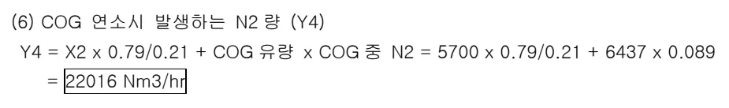

(7) COG 로 부터 가지고 들어가는 O2 량 (Y5)

<math display="block">Y5 = \text{COG 유량} \times \text{COG 중 O2} = 6437 \times 0.009 = \boxed{58 \text{ Nm}^3/\text{hr}}</math>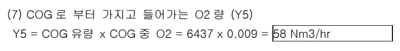

<h2>Page 7</h2>

(8) 과잉공기량 (Z)

<math display="block"><begin{aligned}z></begin{aligned}z></math>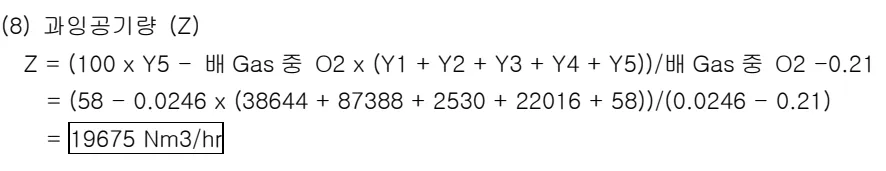

(9) BFG 연소에 의해 발생하는 배 Gas 중 H2O 량 (BH1)

<math display="block">BH1 = \text{BFG 유량} \times \text{BFG 중 H2} = 88228 \times 0.037 = \boxed{3264 \text{ Nm}^3/\text{hr}}</math>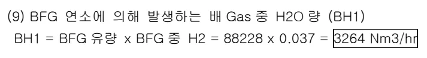

(10) BFG 가 갖고 들어가 발생하는 배 Gas 중 H2O 량 (BH2)

<math display="block">BH2 = \text{BFG 유량} \times \text{습분계수} \times \text{대기습분} = 88228 \times 0.001244 \times 1.84 = \boxed{202 \text{ Nm}^3/\text{hr}}</math>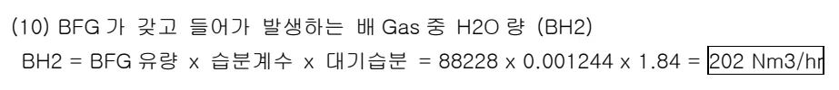

(11) COG 연소에 의해 발생하는 배 Gas 중 H2O 량 (BH3)

<math display="block"><begin{aligned}bh3></begin{aligned}bh3></math>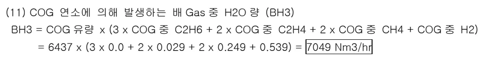

(12) COG 가 갖고 들어가 발생하는 배 Gas 중 H2O 량 (BH4)

<math display="block">BH4 = \text{COG 유량} \times \text{습분계수} \times \text{대기습분} = 6437 \times 0.001244 \times 1.84 = \boxed{15 \text{ Nm}^3/\text{hr}}</math>

(13) 연소용 Air 가 갖고 들어가 발생하는 H2O 량 (BH5)

<math display="block">BH5 = \text{연소용 Air 유량} \times \text{습분계수} \times \text{대기습분} = 98452 \times 0.001244 \times 1.84 = \boxed{225 \text{ Nm}^3/\text{hr}}</math>

(14) 배 Gas 중 CO2 유량 (FCO2)

<math display="block">FCO2 = Y1 + Y3 = 38644 + 2530 = \boxed{41174 \text{ Nm}^3/\text{hr}}</math>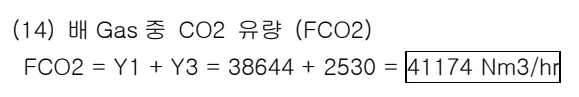

(15) 배 Gas 중 N2 유량 (FN2)

<math display="block">FN2 = Y2 + Y4 + 0.79 \times Z = 87388 + 22016 + 0.79 \times 19675 = \boxed{124946 \text{ Nm}^3/\text{hr}}</math>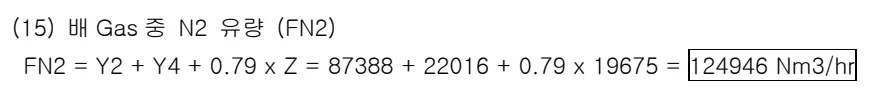

(16) 배 Gas 중 O2 유량 (FO2)

<math display="block"><begin{aligned}fo2></begin{aligned}fo2></math>

(17) 배 Gas 중 수증기 유량 (FH2O)

<math display="block">FH2O = BH1 + BH2 + BH3 + BH4 + BH5 = 3264 + 202 + 7049 + 15 + 225 = \boxed{10530 \text{ Nm}^3/\text{hr}}</math>

뒷 장 계속

<h2>Page 8</h2>
6.1.5 배 GAS 회수열 (WR)

<math display="block">WR = \text{연소공기 승온열} + \text{BFG 승온열} = 1240032 + 956396 = \boxed{2196428 \text{ KCal}}</math>

<math display="block">6.1.5.1 \text{ 연소공기 승온열} = \text{연소공기 유량} \times (\text{연소 Air 온도} - \text{대기온도}) \times \text{비열} \times \text{연소시간}/60</math>

<math display="block">= 98452 \times (50.0 - 2.2) \times 0.310 \times 51/60 = \boxed{1240032 \text{ Kcal}}</math>

<math display="block">6.1.5.2 \text{ BFG 승온열} = \text{BFG 유량} \times (\text{BFG 온도} - \text{Cleaning GAS 온도}) \times \text{BFG 비열} \times \text{연소시간}/60</math>

<math display="block">= 88228 \times (86.0 - 47.0) \times 0.327 \times 51/60 = \boxed{956396 \text{ Kcal}}</math>

6.1.6 기타 방산열 (A4)

<math display="block">A4 = (B1 + B2 + B3 + B4 + B5) - (A1 + A2 + A3)</math>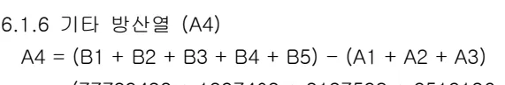

<math display="block">= (77729432 + 1297402 + 2137598 + 9519136 + 106897) - (69711408 + 991174 +</math>

<math display="block">11808494) = \boxed{8279394 \text{ Kcal}}</math>

6.1.7 열효율

<math display="block">\text{열효율} = \frac{(\text{열풍건 현열} + \text{열풍습분 현열} + \text{배 Gas 회수열})}{(\text{M-Gas 연소열} + \text{연소용 Air 현열} +</math>

<math display="block">\text{M-Gas 현열} + \text{냉풍건현열} + \text{냉풍습분현열})} \times 100</math>

<math display="block">= \frac{((69711403 + 991174 + 2916428)}{(77729432 + 1297402 + 2137598 + 9519136</math>

<math display="block">+ 106897)} \times 100 = \boxed{80.03\%}</math>

6.2 열정산 결과표

<table><thead><tr><th>구분</th><th>계산내용</th><th>계산열량</th><th>%</th><th>비고</th></tr></thead><tbody><tr><td rowspan="6">입열</td><td>M-GAS 연소열</td><td>77729432</td><td>85.61</td><td>B1</td></tr><tr><td>연소용 AIR 현열</td><td>1297402</td><td>1.43</td><td>B2</td></tr><tr><td>M-GAS 현열</td><td>2137598</td><td>2.35</td><td>B3</td></tr><tr><td>냉풍건현열</td><td>9519136</td><td>10.48</td><td>B4</td></tr><tr><td>냉풍습현열</td><td>106897</td><td>0.12</td><td>B5</td></tr><tr><td>TOTAL</td><td>90790464</td><td>100</td><td>Bo</td></tr><tr><td rowspan="5">출열</td><td>열풍건현열</td><td>69711403</td><td>76.78</td><td>A1</td></tr><tr><td>열풍습분현열</td><td>991174</td><td>1.09</td><td>A2</td></tr><tr><td>배 GAS 지출열</td><td>11808494</td><td>13.01</td><td>A3</td></tr><tr><td>방산열</td><td>8279394</td><td>9.12</td><td>A4</td></tr><tr><td>TOTAL</td><td>90790464</td><td>100</td><td>Ao</td></tr><tr><td>기타</td><td>배 Gas 회수열</td><td>2196428</td><td>2.42</td><td>WR</td></tr></tbody></table>
<a href="components/TP-030-120-020 열풍로 연소기술 기준(Rev.11)_0900bf4ba7a451f1_usr0000bf4b95f9e446_p008_table_01.png">Table snapshot</a>

뒷 장 계속

<h2>Page 9</h2>
<h3>6.3 열정산 결과</h3>

가. 열풍로 열효율 80.03%로 양호

나. 배 GAS 지출열 13.0% 중 배 Gas 회수량 2.4%로 실제 배 GAS 지출열은 10.6%

다. 손실열 :19.7%(기타 방산열:9.1 + 배 GAS 지출열:10.6%):

<h3>6.4 열효율 향상방안</h3>

가. 풍온상승에 따른 M-GAS 적정유량(훈소용)조정

나. 배 GAS 온도관리(HE-1 배 Gas 출구온도)로 배열회수열량 증대

다. 각호별 열풍로 특성에 따른 최적 Control 로 열 Blance 유지

라. 철피온도 관리강화로 방산열 최소화

마. 주기적 열정산으로 열효율관리 필요

‘끝.’

이 하 여 백
