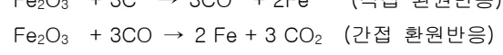
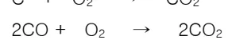
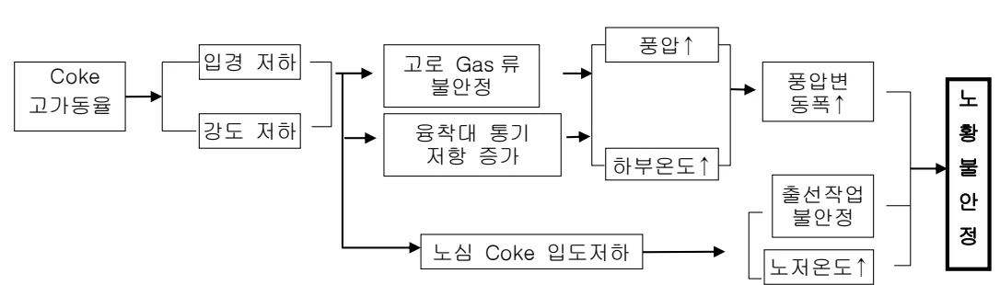

<!-- 페이지번호: 1, 파일명: 고로사용 연료(Coke,Coal)의 기준 -->
# 1. 적용범위

고로에서 사용하는 연료(Coke, Coal)의 기준에 대하여 적용한다.

# 2. 목적

ㅇ 고로에서 사용하는 연료의 물리, 화학적 성상은 고로의 노황 및 용성품질을 결정짓는 주요소이다.

ㅇ 고로 노황이 안정된 상태에서 양질의 용선이 생산되도록 연료의 특성에 대하여 이해 할 필요가 있다.

# 3. 중점 관리항목

<table><thead><tr><th>품질영향인자</th><th>공정영향인자</th></tr></thead><tbody><tr><td>[Si], [S]</td><td>풍압, 노열,</td></tr></tbody></table>
<a href="components/TP-030-020-060 고로사용 연료(Coke,Coal)의 기준(Rev.11)_0900bf4ba7a2b052_usr0000bf4b95f9e446_p001_table_01.png">Table snapshot</a>

# 4. 조업기준

## 4.1. Coke의 특성

### 4.1.1 고로에서의 Coke의 역할

Coke는 대부분이 탄소로 구성되어 있는 유기화합물로서 고로내에 장입되어 산소와 반응하여 이산화탄소와 일산화탄소를 발생시키고 높은열(발열량: 7100Kcal/kg)을 내게되며 그 반응식은 다음과 같다.

<math display="block">Fe₂O₃ + 3C 
→ 3CO + 2Fe (직접 환원반응)</math>

<math display="block">Fe₂O₃ + 3CO 
→ 2Fe + 3CO₂ (간접 환원반응)</math>

<math display="block">C + O₂ 
→ CO₂ (Coke 연소반응)</math>

<math display="block">2CO + O₂ 
→ 2CO₂</math>

철광석에 포함되어 있는 산화철(Fe₂O₃, Fe₃O₄) 성분은 탄소 및 일산화탄소와 고온에서 반응하여 선철로 환원되는데 철광석의 환원 및 용융에 필요한 열을 제공하는 열원제, 산화철의 환원에 필요한 탄소와 일산화탄소를 제공하는 환원제로서 작용한다. 또한 기공률이 높아 철광석과 함께 장입되어 발생 가스 및 열을 전달하는 통액/통기제로서 작용한다.

## 4.2. 고로에서 요구되는 Coke의 특징

### 4.2.1 회분이 적을 것

Coke 중 회분이 많으면 상대적으로 고정탄소가 적게되어 Coke의 발열량이 저하한다.

### 4.2.2 P₂O₅가 적을 것

<!-- 페이지번호: 2, 파일명: 고로사용 연료(Coke,Coal)의 기준 -->

Coke 중의 P₂O₅ 는 대부분이 선철중에 고용된다. 따라서 이 [P]는 강재 품질을 악화시키므로 적은 것이 유리함.

### 4.2.3 [S]가 적을 것

강재 취성의 원인이 되는 [S]는 고로에 장입되는 양 중의 80~90%가 Coke 로 부터 유입된다. 따라서 Coke 중의 [S] 함량은 적을수록 좋다.

### 4.2.4 수분이 적고 변동폭이 적을 것

수분은 노내에서 증발하므로 열량을 소비하게 된다. 또한 고로에 장입되는 Coke 량은 중량으로 관리하는데 수분이 변동하게 되면 Coke 장입량이 변동하는 것과 같으므로 노열변동의 원인이 된다.

### 4.2.5 강도가 높을 것

고로 노내에서 통기성을 유지하는 것이 Coke 의 중요한 역할 중의 하나인데 이를 위해서는 수송과정이나 노내 강하시 분화가 되지 않도록 강도가 높아야 한다. 특히 대형 고로일 경우 에는 노내에서 Coke 가 받는 하중이 더욱 크므로 한층 높은 강도가 요구된다.

### 4.2.6 적정 입도를 유지할 것

연소상태를 균일하게 하고 양호한 Gas류 분포를 확보하기 위해서는 Coke 입도 분포가 적절해야 한다. 특히, 입도가 미세할 경우에는 고상대에서 통기성 및 노저에서 흡액성을 저해하게 되어 Gas 편류 및 노저온도 상승의 원인이 된다.

## 4.3 Coke 품질이 고로 조업에 미치는 영향

### 4.3.1 Coke 회분(Ash)의 영향

<ul><li>Coke 중 회분의 증가시 Slag 가 가지고 나가는 열량이 증가되어 연료비 상승 및 생산량 저하를 초래한다</li><li>보통 Coke 회분 1% 증가는 Coke 를 5.6 kg/T-P 상승한다.</li><li>Coke 회분이 상승할 경우 Slag 량 및 Al₂O₃ 증가로 통기성에 악영향을 미친다.</li><li>Coke 회분 증가는 상대적으로 탄소량을 감소시켜 노열 Balance 변화를 초래한다.</li></ul>

### 4.3.2 Coke 수분의 영향

<ul><li>Coke 중 수분이 과도하게 상승할 경우 Coke 에 부착분이 발생하여 노내 통기성을 저해하거나 중성자 수분계의 수분감지 오차발생으로 노열 변동을 초래할 수 있다.</li><li>Yard Coke 사용시는 직송 사용시와 달리 수분 변동이 크기 때문에 노열 Balance 저해 요인이 될 수 있음.</li></ul>

<!-- 페이지번호: 3, 파일명: 고로사용 연료(Coke,Coal)의 기준 -->
### 4.3.3 Coke 입도 및 강도의 영향

<table><thead><tr><th>노내부위</th><th>정상수준시</th><th>입도 및 강도 저하시</th><th>대책</th></tr></thead><tbody><tr><td>괴상대</td><td>통기성안정</td><td><ul><li>Shaft 부 통기성 악화 (Slip 및 Drop 발생)</li><li>Dust 발생 증가</li><li>노체 열부하 증대</li></ul></td><td><ul><li>Coke 배합 변경 실시</li><li>적정 장입물 분포 유지</li></ul></td></tr><tr><td>연화용착대</td><td>Coke Slit 와 연화용착대의 안정한 형상 유지</td><td><ul><li>Slit Coke 의 열화<ul><li>Slit 층의 통기 악화</li><li>Slit 에서의 편류 발생</li></ul></li></ul></td><td><ul><li>연화용착대에서의 통기성 확보<ul><li>연화용착대 근부의 안정</li><li>Slit 통과 Gas 량의 적절한 관리</li><li>장입물 분포 조정</li><li>풍량, 산소, 조습, 풍온등의 제어</li></ul></li></ul></td></tr><tr><td>적하대</td><td>안정한 열분포 및 Level 유지</td><td><ul><li>중심류 감소 및 편류 증가</li><li>Raceway 변형</li><li>통액성 및 통기성 저하</li><li>노하부 열 Balance 붕괴</li></ul></td><td><ul><li>적하대 및 탕류대에서의 통기성 및 통액성 확보<ul><li>적정 Raceway 유지</li><li>Coke 층의 안정화</li><li>Slag 유동성 확보</li><li>저선 Level 관리</li></ul></li></ul></td></tr><tr><td>탕류대</td><td>출선상태 안정 에 의한 적정 열 Balance 유지</td><td><ul><li>출선상태 불량</li><li>미분 Coke 에 의한 Slag 유동성 악화</li></ul></td><td></td></tr></tbody></table>
<a href="components/TP-030-020-060 고로사용 연료(Coke,Coal)의 기준(Rev.11)_0900bf4ba7a2b052_usr0000bf4b95f9e446_p003_table_01.png">Table snapshot</a>

### 4.3.4 고가동을 조업시 영향

Flowchart illustrating the impact of high coke circulation rate (고가동율) on furnace conditions and slagging (노화불안정):

Coke 고가동율 leads to:
<ul><li>입경 저하</li><li>강도 저하</li></ul>
These factors lead to:
<ul><li>고로 Gas 류 불안정</li><li>용착대 통기 저항 증가</li><li>노심 Coke 입도저하</li></ul>
These factors further lead to:
<ul><li>풍압 ↑</li><li>하부온도 ↑</li><li>풍압변동폭 ↑</li><li>출선작업 불안정</li><li>노저온도 ↑</li></ul>
All of these factors contribute to 노화불안정 (Slagging/Instability).

# 5. 이상판단 및 조치기준 : 해당사항 없음

뒷 장 계속

<!-- 페이지번호: 4, 파일명: 고로사용 연료(Coke,Coal)의 기준 -->
# 6. 기술이론

## 6.1 Coal 분류

### 6.1.1 분류기준 인자

<ul><li>석탄생성의 지질연대, 석탄조직성분, 근원식물, 석탄화과정</li><li>석탄의 원소조성(C,H,O) 함량</li><li>공업기술, 용도상 성상변화 및 탄의 성질(발열량,점결성,팽창성,파쇄성,연소성등)</li></ul>

### 6.1.2 Coal 분류 및 특성

<ul><li>Coke 용: V.M,유동도,탄화도 기준분류 (미국,호주,캐나다별 강점, 미정탄으로 분류)</li><li>PCI 용: V.M, Ash, 발열량 기준분류 (파쇄성,연소성제약으로 Mixing 사용 발생)</li><li>FINEX 용: V.M,발열량,CO₂ 반응성 기준분류 (입도 +10~+50mm 제약으로 -10mm Under 발생)<ul><li>제약조건외 단가저렴시 Coke 용 일반탄, PCI 용, FINEX 용, 연료용탄 회환가능.</li></ul></li></ul>

## 6.2 PCI 용 Coal의 분류 및 특성('23년 기준)

<table><thead><tr><th rowspan="2">ITEM</th><th rowspan="2">품명</th><th colspan="5">공업분석</th><th rowspan="2">발열량</th><th rowspan="2">HGI</th><th rowspan="2">수분</th></tr><tr><th>IM</th><th>ASH</th><th>VM</th><th>FC</th><th>TS</th></tr></thead><tbody><tr><td rowspan="3">무연탄</td><td>S.SA</td><td>6.0</td><td>9.5</td><td>4.5</td><td>80.0</td><td>0.22</td><td>6,919</td><td>89</td><td>12.0</td></tr><tr><td>P.LY</td><td>1.6</td><td>20.0</td><td>3.9</td><td>74.5</td><td>0.43</td><td>6,135</td><td>100</td><td>9.7</td></tr><tr><td>M.PE</td><td>3.0</td><td>14.1</td><td>5.8</td><td>77.1</td><td>0.27</td><td>6,556</td><td>64</td><td>10.0</td></tr><tr><td rowspan="5">미정탄</td><td>Y.P</td><td>1.4</td><td>9.5</td><td>10.9</td><td>78.3</td><td>0.58</td><td>7,645</td><td>89</td><td>10.5</td></tr><tr><td>C.P</td><td>1.5</td><td>9.8</td><td>18.9</td><td>69.8</td><td>0.51</td><td>7,625</td><td>99</td><td>10.0</td></tr><tr><td>J.B</td><td>2.4</td><td>10.3</td><td>15.5</td><td>71.9</td><td>0.51</td><td>7,577</td><td>105</td><td>8.8</td></tr><tr><td>K.G</td><td>1.1</td><td>10.0</td><td>13.5</td><td>75.4</td><td>0.29</td><td>7,546</td><td>75</td><td>10.4</td></tr><tr><td>BRB</td><td>1.6</td><td>9.8</td><td>13.7</td><td>74.3</td><td>0.56</td><td>7,580</td><td>129</td><td>8.3</td></tr><tr><td rowspan="4">반무연</td><td>BRT</td><td>1.4</td><td>9.5</td><td>16.8</td><td>72.3</td><td>0.43</td><td>7,597</td><td>82</td><td>9.5</td></tr><tr><td>S.C</td><td>1.3</td><td>9.1</td><td>15.2</td><td>74.4</td><td>0.31</td><td>7,752</td><td>91</td><td>9.5</td></tr><tr><td>F.X</td><td>0.9</td><td>9.2</td><td>12.5</td><td>77.4</td><td>0.44</td><td>7,716</td><td>88</td><td>10.9</td></tr><tr><td>BLP</td><td>2.0</td><td>8.0</td><td>14.4</td><td>75.7</td><td>0.55</td><td>7,814</td><td>71</td><td>10.8</td></tr><tr><td></td><td>C.U</td><td>0.9</td><td>9.5</td><td>18.6</td><td>71.1</td><td>0.38</td><td>7,644</td><td>96</td><td>10.3</td></tr><tr><td></td><td>KBD</td><td>1.6</td><td>9.8</td><td>16.6</td><td>72.0</td><td>0.32</td><td>7,501</td><td>79</td><td>9.0</td></tr></tbody></table>
<a href="components/TP-030-020-060 고로사용 연료(Coke,Coal)의 기준(Rev.11)_0900bf4ba7a2b052_usr0000bf4b95f9e446_p004_table_01.png">Table snapshot</a>

‘끝.’
