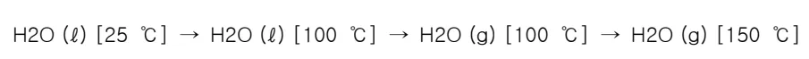

<!-- 페이지번호: 1, 파일명: 노내침수 판단기준 및 열보상 기준 -->
# 1. 적용범위

고로조업중 노내 침수사고에 대한 판단 및 조치기준에 대하여 적용한다..

# 2. 목적

냉각 또는 살수설비의 고장으로 노내 침수사고가 발생하였을 때 조치지연이나 정확한 노열보상에 실패시 노열변동 및 노황변동을 초래할 수 있다.

# 3. 중점관리 항목

<table><thead><tr><th>품질영향 인자</th><th>공정영향 인자</th></tr></thead><tbody><tr><td>[S] [Si]</td><td>풍압, 노열</td></tr></tbody></table>
<a href="components/TP-030-030-060 노내침수 판단기준 및 열보상 기준(Rev.8)_0900bf4ba7a443b0_usr0000bf4b95f9e446_p001_table_01.png">Table snapshot</a>

# 4. 조업기준

## 4.1 노내침수 판단 기준

### 가. 냉각수 배수량이 줄고 배수시 거품, 기포, STEAM 등이 발생한다.

### 나. 노정 GAS 중의 H2%가 SHIFT 평균치보다 상승한다.

### 다. 노정온도 저하하고 장시간 지속시 노내 폭발 또는 용선온도가 저하되고 용용물의 성분변동을 초래한다. ([Si]저하, [S]상승)

### 라. 살수장치에 의한 침수시는 살수 LINE 의 DRAIN VALVE 를 열었을 때 장시간 물이 DRAIN 된다.

### 마. 풍구나 노체 냉각반의 파손에 의한 침수시는 GAS 검지기에 의한 확인, 수압 TEST 에 의한 확인, 배수 LINE 착화 TEST 에 의한 확인 방법이 있다.

### 바. 풍구파손에 의해 노내 침수시는 파손풍구 상부에 불이 붙어 붉은 화염이 발생 한다.

(PEEPING HOLE 로 확인)

### 사. 노내에 다량 침수시는 풍구와 대풍구간의 틈새로 물 또는 기포가 스며 나오며 건조시 흰색 또는, 푸른색으로 오염된다.

### 아. 출선구 주위에서 침수되거나 다량 침수시는 출선구 보호벽의 균열부위로 물이 스며 나온다.

### 4.1.1 노내 침수예상 개소

고로 조업중 노내부로 침수가 예상되는 개소는 냉각수를 사용하는 노정기기들로 노정살수장치, CROSS SONDE, SHAFT SONDE, PROFILE METER, 노체냉각반, STAVE COOLER, 풍구 및 대풍구, 출선구, 냉각반이다.

뒷 장 계속

<!-- 페이지번호: 2, 파일명: 노내침수 판단기준 및 열보상 기준 -->
## 4.2 노내침수시 열보상 기준

### 4.2.1 노정 GAS 중 H2 % 변동에 따른 열보상량 계산

노내로 물이 침수되면 H₂O → H₂ + 1/2 O₂로 분해되던가, H₂O + C → H₂ + CO의 반응을 하고 노정 GAS 중의 H2 %가 상승하게 된다. 여기서는 입력 H2 개념에 의해 감광량을 결정하는 방법을 제시한다.

#### 가. 계산 예(포항 2 고로 경우)

«전제사항»

풍량 4,000 N m³/min, COKE BASE 18.0 t/ch, WH2O 40 g/N m³, 노정 GAS 발생량(TGV) 1520

N m³/t-p, 총선량 5,300 t/d (35.3 t/ch), COKE 중 H2 0.5 %, η_{H₂} 60 % 일때

ㅇ COKE 로 부터의 입력 H2 : 18000kg × (0.5/100) ÷ 35.3 t/ch = 2.55kg/t-p ㅇ 송풍중 습분으로 부터의 입력 H2 : (40g/1000) × (2/18) × (4000 × 1440min/day) / 5,300T/D = 4.83kg/t ㅇ TOTAL 입력 H2 량 = 2.55 + 4.83 = 7.38kg/t-p ㅇ 노정 GAS 중 H2 :

<math display="block">7.38 × (40 / 100) × (22.4 / 2) ÷ 1,520 × 100 = 2.18 %</math>

<table><thead><tr><th>구분</th><th>입량 H2(kg/t-p)</th><th>노정 Gas 중 H2%</th><th>Δ H2%</th><th>비고</th></tr></thead><tbody><tr><td>기준 (WH2O 40g/N m³)</td><td>7.38</td><td>2.18</td><td>—</td><td rowspan="4">Coke 입력 H2는 2.55 kg/T-일정 전제</td></tr><tr><td>WH2O + 10g/N m³시</td><td>8.59</td><td>2.54</td><td>0.36</td></tr><tr><td>WH2O + 20g/N m³시</td><td>9.80</td><td>2.89</td><td>0.35</td></tr><tr><td>WH2O + 30g/N m³시</td><td>11.00</td><td>3.25</td><td>0.36</td></tr></tbody></table>
<a href="components/TP-030-030-060 노내침수 판단기준 및 열보상 기준(Rev.8)_0900bf4ba7a443b0_usr0000bf4b95f9e446_p002_table_01.png">Table snapshot</a>

#### 나. 침수량에 따른 H2 변동 %

* 위 표에서 습분 10g/N m³(Δ CR 5 kg/T-P) 증가 취입시 노정 Gas 중 H2는 평균 0.36% 상승. 즉, 노정 GAS 중 H2가 0.36% 상승시 Coke Ratio 약 5 kg/T-P 감광필요.

<!-- 페이지번호: 3, 파일명: 노내침수 판단기준 및 열보상 기준 -->
### 4.2.2 침수량의 기화열을 기준으로 한 열보상량 계산

### 가. 계산전제

<ul><li>ㅇ노내로 침수된 물은 전량 GAS 로 기화</li><li>ㅇ노내로 침수시 물의 온도는 25 °C 기준</li><li>ㅇ노정 및 냉각반으로 침수된 물은 기화후 노정온도 (150 °C 까지) 승온 고려</li><li>ㅇ수성 GAS 반응은 무시</li><li>ㅇCOKE 발열량은 7,100 kcal / kg</li></ul>

### 나. 노정 및 냉각반, STAVE 로 1 TON 침수시

<math display="block">H2O (l) [25°C] → H2O (l) [100°C] → H2O (g) [100°C] → H2O (g) [150°C]</math>

Δ H1

Δ H2

Δ H3

<ul><li>ㅇ Δ H1: 25 °C H2O (l) → 100 °C H2O (l) 흡열 18.03 cal / mol -계산 : 물 1 ton → 55,556 mol</li></ul>

-계산결과 : 75 Mcal / t

<ul><li>ㅇ Δ H2: 100 °C H2O (l) → 100 °C H2O (g) 흡열 9.68 kcal / mol -계산결과 : 538 Mcal / t</li></ul>

<ul><li>ㅇ Δ H3: 100 °C H2O (g) → 150 °C H2O (g) 흡열 (7.17+2.56 × 10⁻³Tcal/mol) -계산 : 적분 [7.17 + 2.56 × 10⁻³Tcal/mol] → 0.409kcal /mol</li></ul>

계산결과 : 23 Mcal / t

<ul><li>ㅇ합계(Δ H1 + Δ H2 + Δ H3) = 636 Mcal/t ▶ 636 Mcal/t ÷ 7100 kcal/kg</li></ul>

↔COKE 로 환산하면 90 kg

### 다. 풍구로 1 ton 침수시

<math display="block">(1) H2O (l) [25°C] → H2O (l) [100°C] → H2O (g) [100°C] → H2O (g) [1500°C]</math>

Δ H1

Δ H2

Δ H3

<ul><li>ㅇ Δ H1, Δ H2 는 나항과 동일 : Δ H1 + Δ H2 = 613 Mcal/t</li></ul>

<ul><li>ㅇ Δ H3: 100 °C H2O (g) → 1500 °C H2O (g) 흡열 (7.17+2.56 × 10⁻³Tcal/mol)</li></ul>

-계산 : 적분 [7.17 + 2.56 × 10⁻³Tcal/mol] → 13.9kcal /mol

계산결과 : 772 Mcal / t

<!-- 페이지번호: 4, 파일명: 노내침수 판단기준 및 열보상 기준 -->

○합계(Δ H1 + Δ H2 + Δ H3) = 1385 Mcal/t ► 1385 Mcal/t ÷ 7100 kcal/kg ☞ COKE 로 환산하면 159 kg

(2) H₂O(g)의 Carbon 과의 반응

○ H₂O(g) + C(s) → CO(g) + H₂(g) 흡열 (31810 + 33.85 × 10⁻³ T) cal/mol ) (반응온도 1500°C 기준) -계산결과 : 1772 Mcal/ton ☞ COKE 로 환산하면 250 kg

(3) 풍구로 물 1ton 침수시 Total COKE 장입량 159 + 250 = 409 kg

※ 위 계산량을 POSCO 통일식으로 계산시

○ 계산기준

-조습 10 g/Nm³ → COKE 5 kg/t-p 열보상 -풍량 6250 Nm³/min, 산소 0 -생산량 8300 T/D (5.76 T/min)

○ 계산

-분당 조습량 : 10 g/Nm³ × 6250 Nm³/min = 62500 g/min -물 1ton 조습에 필요한 시간 : 1,000,000 g ÷ 62500 = 16 min -조습 1 ton 취입하는 동안 용선 생성량 : 5.76 × 16 = 92 ton ☞ Total 열보상 COKE량 : 5 kg/t-p × 92 ton-PIG = 460 kg

뒷 장 계 속

<!-- 페이지번호: 5, 파일명: 노내침수 판단기준 및 열보상 기준 -->
# 5. 이상판단 및 조치 기준

## 5.1 노정기기에 의한 침수시

### 가. 소량침수로 판단되면 냉각수량을 줄이고, 대량 침수로 판단되면 완전히 CUT 한다.나. 차기 정수주기까지 조업이 어렵다고 공장장이 판단하면 휴풍 후 조치한다.다. 살수장치에 의해 침수시는 각 VALVE의 LEAK 상태를 점검한다.라. 열보상은 노내 침수시 열보상 기준에 의거 실시한다.

## 5.2 노체 냉각반 또는, STAVE COOLER 파손에 의한 침수시

### 가. 냉각반 파손일 때는 급,배수관을 CLOSE 조치한다.나. STAVE 파손시는 급수량을 줄이거나 공장장이 판단하여 휴풍 후 조치한다.다. 열보상은 노내 침수시 열보상 기준에 의거 실시한다.

## 5.3 풍구 파손시

### 가. 급수량을 줄여 노내 침수되는 량을 적게 하고, 파손된 풍구부위에 STEAM PURGE 또는, 살수를 하여 보조냉각을 시킨다.나. 필요시 출선하여 용융물을 배출한 후 휴풍을 하여 교환한다.다. 열보상은 노내 침수시 열보상 기준에 의거 실시한다.

‘끝.’

이 하 여 백
