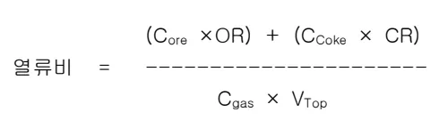

<!-- 페이지번호: 1, 파일명: PCI Cut시 조치기준 -->
# 1. 적용범위

노황관리 기술종 고로의 연로로서 미분탄 등의 보조연료를 사용하지 않고 용선을 생산하는 방식인 All Coke 조업시의 작업기준과 관리방안 및 조치수순에 대하여 적용한다.

# 2. 목적

다음사항 발생시 PCI Cut 하고 All Coke 조업을 실시함으로써 적정 용선생산 Balance 를 유지 또는 회복하기 위함이다.

<ul><li>미분탄 취입설비 계획수리나 고장등으로 인하여 미분탄 취입이 불가능한 경우</li><li>질소등 Utility 공급 조건 악화에 의해 미분탄 취입이 곤란한 경우</li><li>노황불량에 의한 대폭적인 감량을 통해 Cleaning 조업 수행시</li><li>노벽보수를 위한 감척조업 수행시</li></ul>

# 3. 중점 관리 항목

<table><thead><tr><th>품질 영향 인자</th><th>공정 영향 인자</th></tr></thead><tbody><tr><td>[Si] [S]</td><td>풍압, 노열,</td></tr></tbody></table>
<a href="components/TP-030-030-090 PCI Cut시 조치기준(Rev.9)_0900bf4ba7a451d0_usr0000bf4b95f9e446_p001_table_01.png">Table snapshot</a>

# 4. 조업기준

## 4.1 PCI Cut(All Coke)조업 관리항목 및 기준

### 가. 노하부 불활성화 방지를 위해 풍량 우선조업 실시 (정상조업 VB ± 100 N m³/min)

### 나. 감산에 따른 노심부 불활성화 방지를 위하여 풍구유속 확보

### 다. 노황안정유지를 위해 연원료 품질은 PCI 조업시와 동일 또는 상향유지

### 라. 출선량 감소를 고려한 Sinter, Pellet ratio 조정 실시

### 마. 장입물 분포제어는 주변류 확보형으로 변경 실시

### 바. 출선재를 강화하고 용선온도는 [Si] level 을 고려하여 1510°C 이상 확보

### 사. 안정적 노열 확보를 위해 O/C 3.0 이하 유지 (노황 악화 상태에서 All Coke 조업 시 추가 감광)

뒷 장 계속

<!-- 페이지번호: 2, 파일명: PCI Cut시 조치기준 -->
## 4.2 PCI Cut 시 노내상황 변화예측

Flowchart illustrating the predicted changes in furnace conditions during PCI Cut (All Coke) operation:

Inputs: Tf 상승 (Tf Increase), 감산조업 (Reduced Production), Input VB 저하 (Input VB Decrease), VBG 저하 (VBG Decrease), PC cut, Input H2 저하 (Input H2 Decrease), O/C 저하 (O/C Decrease), Coke 증후 ↑ (Coke Increase).

Key process blocks and flows:
<ul><li>Tf 상승 leads to 풍구전 Coke 강도 저하 (Coke Strength Decrease in Furnace Front).</li><li>감산조업 leads to Input VB 저하.</li><li>Input VB 저하 leads to VBG 저하.</li><li>VBG 저하 leads to 열류비 상승 (Increased Heat Flow Rate).</li><li>열류비 상승 leads to 노정온도 저하 (Decreased Slag Temperature).</li><li>열류비 상승 also leads to 풍구전 Coke 공급 불안정 (Δ L 축소) (Unstable Coke Supply in Furnace Front (Δ L Reduction)).</li><li>Input H2 저하 leads to Bosh gas 점성 증가 (Increased Viscosity of Bosh Gas).</li><li>Bosh gas 점성 증가 leads to 노하부 통기성 악화 (Worsened Gas Permeability in Lower Section).</li><li>열류비 상승 also leads to 노하부 통기성 악화.</li><li>Input H2 저하 also leads to 중심류 발달 (Development of Center Stream).</li><li>중심류 발달 leads to ηCO 저하 (Decreased ηCO).</li><li>O/C 저하 (Coke 증후 ↑) leads to 연화용착대 근부 불안정 (Unstable Reduction Zone Near Bottom).</li><li>연화용착대 근부 불안정 leads to Cross flow 변동 대 (Large Cross Flow Variation).</li><li>노하부 통기성 악화 leads to 노내 Zn 퇴적량 증가 (Increased Zn Deposition Inside Furnace).</li><li>노하부 통기성 악화 also leads to 환원제비 상승 (Increased Reducing Agent Ratio).</li><li>노하부 통기성 악화 also leads to 노채연와 손상 (Damage to Slag Channel).</li><li>노내 Zn 퇴적량 증가 leads to 풍압변동 Slip 발생 (Fluctuation Slip Generation).</li><li>풍압변동 Slip 발생 leads to 생산량 저하 (Decreased Production Quantity).</li><li>풍압변동 Slip 발생 also leads to 용선품질 저하 (Decreased Slag Quality).</li></ul>

## 4.3 PCI Cut(All Coke)조업방향

### 가. Bosh Gas Volume 확보 (고풍량 조업실시, Tf 과다 상승방지)

### 나. 연화용착대 Level 안정조치

<ul><li>부용해능력 확보, Ore base 저하, Δ L 관리강화를 통한 연화용착대 저하방지</li><li>고풍량조업을 통한 노하부압력 상승, 노정압 저하조업, 조습조업에 의한 노하부 Gas량 증대로부터 연화용착대 안정화 유도</li><li>고열조업 실시로 용착대 과다저하 방지</li></ul>

<!-- 페이지번호: 3, 파일명: PCI Cut시 조치기준 -->
### 다. 노내 환원 Balance 변화 감지 및 조치

<ul><li>ηCO, CSL, K치 변화의 밀착 감시 및 신속한 Action 실시</li><li>Upper probe 및 AB probe 를 활용한 융착대 처짐현상 관리</li><li>환원 Balance 를 고려한 노열 Level 조정수단 확보(풍온, 풍습, O/C 등)</li></ul>

### 라. 연원료 관리

<ul><li>노상부 열류비 상승대비 소결광의 냉간강도 개선 및 Screen 강화를 통한 노내 분장입량 저하</li><li>저 Zn 함량 광석 집중사용에 의한 Input Zn량 저하 (0.20kg/t-p 이하 유지)</li><li>노내 통기지수 K 상승 방지를 위한 노하부 Coke 입도 저하 예방</li><li>Coke 가동율 상승에 의한 Coke 입도, 냉간강도(DI), 열간강도(CSR) 저하 방지</li><li>풍구전 Tf 과다 상승(2300°C 이상)에 의한 풍구전 Coke 분화 가속시</li></ul>

## 4.4 PCI Cut(All Coke)조업시 노내현상 변화의 이론적 고찰

### 4.4.1 노내 열 Balance 변화

#### 가. 고로 상부

노정온도 저하및 열류비 상승의 과정에서 Zn 배출능력 부족에 따른 노내 순환량 증가 상태에서 연원료 품질저하에 의한 고로 분장입량 증가시 노체 상부에 부착물이 성장하여장입물 강화가 불안정 해지고 또한 Thermal reserve zone 의 축소로 환원능력 저하등에도 영향을 미치게 된다.

<ul><li>열류비 상승에 따른 조정온도 저하 Mechanism</li></ul>

<math display="block">열류비 = [((C_{Core} × OR) + (C_{Coke} × CR))/(C_{Gas} × V_{Top})]</math>

C_{Core} : 광석의 비열

OR : 광석비

C_{Coke} : Coke의 비열

CR : Coke 비

C_{Gas} : Gas의 비열

V_{Top} : Top gas volume

Coke 비 상승과 노정가스량 감소는 열류비를 상승시켜서 노정온도를 저하시키는 요인으로 작용한다.

#### 나. 고로 하부

노하부에서 발생되는 연소가스 밀도 저하에 따라 노하부 용해 에너지(T_f × VBG) 부족 현상이

<!-- 페이지번호: 4, 파일명: PCI Cut시 조치기준 -->

발생하여 연화용착대 근부가 불안정하게 될 수 있다. 이로 인해 다양한 생광낙하 하여 노열번동 및 노저연와 침식에 영향을 미치게 되고 또한 노하부 불활성화가 진행될 가능성이 있다.

#### 다. 노열 Balance 관리를 위한 Action 방향

##### (1) 먼저 노상부 열류비 상승에 대한 대책

<ul><li>소결광의 냉간강도 개선 및 Screen 강화를 부터 노내 분장입량 저하 추진</li><li>노정온도 하한선 관리 (80°C) 이상 유지</li></ul>

#### 라. 노정온도 80°C 이상 과다 저하 방지방안

<ul><li>장입물 수분 저하 추진 (Yard 소결광 및 Coke 사용 지양, 소결광 입조 Line 살수량 저하)</li><li>Bosh gas volume 확보 (고풍량 조업 실시, Tf 과다 상승 방지)</li></ul>

### 4.4.2 노내 환원 Balance 변화

#### 가. Carbon solution loss량의 변화

All coke 조업에서 환원제비 저하를 위한 송풍습분 저하는 Input H2 저하 → H2 간접 환원율 감소 → 직접 환원율 증가 (Carbon solution loss량 증가) → 노내 열분포 Level 저하 및 연화용착대 Level 저하에 영향을 미쳐서 노하부 불활성에 의한 노황부조를 초래할수도 있다.

#### 나. 괴상대 열교환 기능 변화에 따른 환원 Balance 변화

노벽부 부착물 과다 성장 방지를 위한 주변류화 조업의 장기간 이행시 괴상대의 노벽부와 중심부 사이에 위치하는 중간부에서 Coke 흡수 저하로 부터 통기성이 저하되어 중간부의 Gas 흐름량을 저하시키게 된다. 이런 결과 중간부 장입물 승온상태 불량으로 부터 연화용착대 중간부 처짐현상을 유발하여 Δ L 축소로 부터 풍압변동을 일으키기도 한다.

#### 다. All coke 조업시 노내 환원 Balance 변화에 대한 감지 및 조치 활동

ηCO, CSL, K치 변화의 밀착 감시 및 신속한 Action 실시, Upper probe 및 AB probe를 활용한 용착대 처짐현상 관리, 환원 Balance를 고려한 노열 Level 조정수단 확보 (풍온, 풍습, O/C) 등을 추진해야 한다.

### 4.4.3 노내 통기성 변화

All coke 수행시 노내 O/C 저하에 의해 노내 통기성은 전반적으로 저하하게 되나, 다음과 같은 경우에는 하부 통기저하 지수 (하부 K) 가 증가하게 된다.

<ul><li>노내 Solution loss 반응 증가, Alkali 반응 증가, 기계적 응력 증가에 의한 노하부 Coke 입도 저하시</li></ul>

<!-- 페이지번호: 5, 파일명: PCI Cut시 조치기준 -->

o Coke 가동율 상승에 의한 Coke 입도, 냉간강조(DI), 열간강도(CSR) 저하시

o 풍구전 Tf 과다 상승(2300°C 이상) 에 의한 풍구전 Coke 분화 가속시

노하부의 통기성 악화를 유발시키는 Coke 입도 저하는 노심부 불활성화 진행에도 영향을 끼쳐서 노심을 비대화 시키고 노저부 환상류 발달로 부터 노저연와 침식을 가속 시키게 된다. 따라서 All coke 조업시에는 노저부 통액성 악화를 대비하여 출선구 심도 확보를 통한 출선재 배출을 도모해야 한다.

# 5. 이상판단 및 조치기준 : 해당사항 없음

‘끝.’

이 하 여 백
