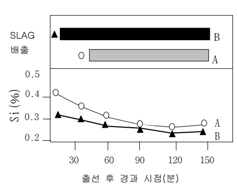

<!-- 페이지번호: 1, 파일명: 고출선비 조업시 출선,재 관리 기준 -->
# 1. 적용범위

고출선비 조업시 출선 조건 변화와 출선강화 대책에 대하여 적용한다.

# 2. 목 적

고출선비 조업시 생산 Speed 증가 및 송풍에너지 증가에 따른 노심 Coke 입도 저하로 노저 통액성이 저하하여 노내 용융물의 배출이 원활하지 못할 우려가 있으므로 출선 강화 대책을 수립하여 출선 고출선비 조업을 안정적으로 수행하는데 목적이 있다.

# 3. 중점관리 항목

<table><thead><tr><th>품질영향 인자</th><th>공정영향 인자</th></tr></thead><tbody><tr><td>[Si], [S]</td><td>풍압, 노열</td></tr></tbody></table>
<a href="components/TP-030-040-050 고출선비 조업시 출선,재 관리 기준(Rev.11)_0900bf4ba7a2b08e_usr0000bf4b95f9e446_p001_table_01.png">Table snapshot</a>

# 4. 조업기준

## 4.1 고출선비 조업시 출선 상황 변화

고출선비 조업시에는 평상 조업 대비 단위 시간당 용융물 생성 속도가 증가하므로 출선재를 충분히 배출 시키는 것이 노황을 안정하게 유지하는데 가장 중요하며, 고출선비 조업을 장기적, 안정적으로 지속하기 위해서도 출선작업의 안정은 가장 기본적인 조업 수단이 된다. 고출선비 조업시 노내 현상의 변화는 용융물 생성량의 증가로 노내 저선량이 증가하고 그에 따라 송풍 압력이 상승하여 공취 시점이 평상조업 대비 짧아지므로 공취 시점 이전에 충분히 저선 Level 을 낮추어 주던지 혹은 공취 시점을 연장하여 출선 시간을 확보해주는 대책이 필요하다.

노상부의 장입물 강화 Speed 증가에 의하여 Coke 분화 현상이 가속되는 경우 노심 Coke 의 입도가 가 저하하여 충분한 통액성을 유지하기 어렵다. 또한 평상 조업대비 미환원 철광석(생광)의 낙하량이 증가하여 노상부에서의 직접환원 반응으로 노심의 열을 저하 시키므로 노열변동에대한 관리대책이 필요하다.

Flowchart illustrating the effects of increased High Output Line (출선비 ↑) operation:
<ul><li>Increased High Output Line (출선비 ↑) leads to:<ul><li>Increased Molten Material Production Speed (용융물 생성 Speed ↑), which leads to Increased Initial Low Line Material (출선 초기 노내 저선량 ↑).</li><li>Increased Blower Pressure (송풍 압력 ↑), which leads to Increased Air Volume → Increased Air Flow Rate → Increased Initial Low Line Material (풍압 상승 → 풍압 변동폭 증가 → 공취 시기 단축 → 노내 저선량 ↑).</li><li>Decreased Coke Feed Rate (Coke 입도 ↓), which leads to Reduced Low Line Material (노저 통액성 저하).</li></ul></li></ul>

<!-- 페이지번호: 2, 파일명: 고출선비 조업시 출선,재 관리 기준 -->
## 4.2 출선재 배출 강화 대책

### 가. 출선 초기 배출 속도 증대

<ul><li>생산 Speed 에 따라 Bit 경 확대 : 54 Φ, 56 Φ, 58 Φ, 60 Φ 이상 사용 (그림 참조)</li><li>Mud 재 풍질개선 (초기 공확대 원할 및 일정 유지)</li><li>풍구경 확대 등 풍압저하 대책 수립</li><li>대형고로의 경우 3개 출선구 사용시, 1개 출선구 사용중인 주상에는 2개 출선구 사용중인 반대주상에서 사용하는 Bit 보다 지름이 큰 것을 사용하여 주상별 배출편차를 줄여줌 (+2mm 이상)</li></ul>

그림 : BIT 경 & 출선량 관계

### 나. Lap 출선 기준

<ul><li>Slag Discharging Ratio 관리 (1.0 수준) : 그림 참조</li><li>Slag 배출 지연 40분 이상시 및 저선 Level 20% 이상시</li><li>출선후 1시간 이내에 정상 출선 Speed 미달시 (예:4고로 6~7T/min 이하 60분초과시)</li><li>출선지연 20분 이상시 타 출선구 개공</li><li>혈절 발생에 의한 용융물 배출 불량시 타 출선구 개공</li></ul>

= 1.0." src="components/0a87c58c46a8f2a61b2712556dbb435f_8_img.webp"/>

<math display="block">SLAG Discharging Ratio = [(a')/((b' - c'))] ≥ 1.0</math>

그림 : Slag Discharging Rate 관리기준

뒷 장 계속

<!-- 페이지번호: 3, 파일명: 고출선비 조업시 출선,재 관리 기준 -->
### 다. 출선비에 따른 출선 Pattern 관리방법

-용용물 생성량, 용선온도에 따른 출선구 운영패턴 차별화 적용

<table><thead><tr><th>출선비 (t/d/m3)</th><th>용선온도(°C)</th><th>출선패턴</th><th>출선구 운영 개수</th><th>Lap / Delay Time</th><th>출선 Bit 경</th></tr></thead><tbody><tr><td>1.25 이상</td><td>—</td><td>Para 출선</td><td>3~4(주상별 대각선 출선)</td><td>Lap time 100~120 분</td><td>52~56Φ</td></tr><tr><td rowspan="2">1.1~1.25</td><td>1520 이상</td><td>—</td><td>—</td><td>—</td><td>—</td></tr><tr><td>1520 이하</td><td>Lap 출선</td><td>4 (시계/반시계 방향)</td><td>Lap time 5~10 분</td><td>—</td></tr><tr><td rowspan="2">0.9~1.1</td><td>1520 이상</td><td>—</td><td>—</td><td>—</td><td>56Φ</td></tr><tr><td>1520 이하</td><td>Delay time 적용</td><td>—</td><td>Delay time 60 분</td><td>(Slag 배출불량 시 52Φ고려)</td></tr><tr><td>0.9 이하</td><td>—</td><td>—</td><td>—</td><td>Delay time 90 분</td><td>—</td></tr></tbody></table>
<a href="components/TP-030-040-050 고출선비 조업시 출선,재 관리 기준(Rev.11)_0900bf4ba7a2b08e_usr0000bf4b95f9e446_p003_table_01.png">Table snapshot</a>

### 라. 출선구 안정 대책

○ Mud 충진량 증대에 의한 출선구 심도 확보

출선구 심도의 안정적 확보를 위해 충분한 용용물 배출을 병행한다.

○ 출선구 Mud 재질 향상으로 내 Slag 성 향상

○ Hammering 에 의한 일발공개 작업시 출선구 보호벽의 내부 Crack 에 의한 헐절 또는 탈락의 위험이 있으므로 심도 증가를 목적으로 하는 경우 최대한 Hammering 작업을 억제하고 Drill 에 의한 개공을 실시한다.

### 마. 용용물 유동성 향상 대책

<ul><li>용선온도 상향관리 1510± 10°C 수준</li><li>Slag 성상관리 : Al₂O₃ ↓, MgO ↑</li><li>Coke 입도 및 강도 개선</li><li>Si 저하 대책 수립<ul><li>저선 Level 하향관리(그림 참조)</li><li>소결광 FeO ↑</li><li>고 염기성 Pellet 사용</li><li>저 SiO₂ Coal 사용</li></ul></li></ul>

그림 : SLAG 배출과 용선 Si 관계

# 5 이상판단 및 조치기준 : 해당사항 없음

‘끝.’

이 하 여 백
