<!-- 페이지번호: 1, 파일명: [Si] 제어기술 기준 -->
# 1. 적용범위
# 1 적용범위

[Si]의 노내거동 및 고로내에서 저[Si]용선을 제조하기 위한 조업기술에 대하여 적용한다.

# 2 목적

<table><thead><tr><th></th><th>제선공정</th><th>제강공정</th></tr></thead><tbody><tr><td>노내[Si] 제어시</td><td>ㅇ 고로내 통기성 개선, 연료비 절감 등 용선제조원가 절감 가능 ㅇ Slag Foaming 등 환경사고 예방, 작업환경 개선 가능 ㅇ 후공정(제강)요구 용선을 안정적으로 공급 가능</td><td>ㅇ 전로 HMR 상승가능으로 자원가조업 실시(용선한제원가 < Scrap 구입가격) ㅇ 전로 정련 최적화 - 성분제어능 극대화, 정련기능 단순화 ㅇ 환경친화적 조업가능 - Slopping 및 폐기물 발생 억제</td></tr></tbody></table>
<a href="components/TP-030-050-030 [Si] 제어기술 기준(Rev.11)_0900bf4ba9aaaf78_usr0000bf4b95f9e446_p001_table_01.png">Table snapshot</a>

# 3 중점관리 항목

<table><thead><tr><th>품질 영향인자</th><th>공정 영향인자</th></tr></thead><tbody><tr><td>[Si]</td><td>풍압, 노열,</td></tr></tbody></table>
<a href="components/TP-030-050-030 [Si] 제어기술 기준(Rev.11)_0900bf4ba9aaaf78_usr0000bf4b95f9e446_p001_table_02.png">Table snapshot</a>

# 4 조업기준

## 4.1 [Si] 관리기준

- 후공정 [Si] 상향 요청에 따라 관리 기준 하한치 설정 및 상한치 상향

<table><thead><tr><th></th><th>내부관리 기준</th><th>부적합품 기준</th><th>비고</th></tr></thead><tbody><tr><td rowspan="2">용선 [Si]</td><td>4,2 고로</td><td>0.15 ≤ [Si] ≤ 0.75</td><td rowspan="2">> 2.00</td><td rowspan="2">TP-030-050-020 참조</td></tr><tr><td>3,4 고로</td><td>0.10 ≤ [Si] ≤ 0.60</td></tr></tbody></table>
<a href="components/TP-030-050-030 [Si] 제어기술 기준(Rev.11)_0900bf4ba9aaaf78_usr0000bf4b95f9e446_p001_table_03.png">Table snapshot</a>

뒷 장 계속

<!-- 페이지번호: 2, 파일명: [Si] 제어기술 기준 -->
## 4.2 저[Si] 용선제조 조업기준

<table><thead><tr><th>조업방법</th><th>제어수단</th><th>제약조건</th><th>문제점</th></tr></thead><tbody><tr><td>● SiO 발생억제 -P SiO 저하</td><td>o Tf 저하 -조습량 증대 o 노정압 상승 o SiO₂ 일량제어 -Coke, Coal 의 Ash, 광석의 Ash 제어 o Slag 염기도 상승 o Slag MgO 상승 o P CO 상승 -산소부화 증가 -풍압 상승</td><td>-풍온 한계 -설비 한계 -원료조건제약 -설비 한계</td><td>-연료비상승 -slag 점성증가 -원료 Balance -통기성문제</td></tr><tr><td>● SiO Gas 의 용선 으로의 흡수억제</td><td>o 용선온도 저하 -Tap 별 온도편차 감소 o 용착대 근부저하 -η CO 상승 -열류비 상승 -Ore/Coke 상승 -연료비 저하 -SOR 상승 -노체 방산열 감소 o 장입물 분포제어</td><td></td><td>-노하부불활성 -풍압변동</td></tr><tr><td>● 반응시간 단축</td><td>o 잔류 Slag 층후저하 o Slag 적하시간 단축 o 출선비 증대 o 출선간격 단축 o 용착대 저하 o 방산열 감소 o 소결광 FeO 상승 (복규반응 억제)</td><td>-감산체제</td><td>-출선부하 -연료비상승</td></tr><tr><td>● 기타</td><td>o 원주 Balance 제어 -풍구선 조건 균일 -중심류 증대 및 노심 활성화</td><td></td><td></td></tr></tbody></table>
<a href="components/TP-030-050-030 [Si] 제어기술 기준(Rev.11)_0900bf4ba9aaaf78_usr0000bf4b95f9e446_p002_table_01.png">Table snapshot</a>

<!-- 페이지번호: 3, 파일명: [Si] 제어기술 기준 -->
## 4.3 저[Si]조입 Diagram

조로 Action

Flowchart illustrating the control logic for low [Si] input:

Inputs (Top Row): 생산 Speed Up, 연료비 저하, 소결광 C/S 상승, 소결 MgO 상승, Tf 저하, Input SiO₂ 저하, 노정압 상승.

Intermediate Calculations/States (Top Row): 열류비 상승, 용융점 상승, SiO Gas 발생량 감소.

Control Actions (Middle Row): O₂ 부화 Up, 노열변동폭 감소, 용선온도 저하, 분포조정, 용착대 근부 저하.

Core Process: 연화용착대 레벨저하.

Intermediate State: SiO → Si 환원영역 축소.

Control Actions (Bottom Row): 출선.재 강화, 저선 Level 저하, 복[Si]반응시간 감소, * 주상 탈규 강화.

Final Output: 용선[Si] 저하.

Final State: 뒷 장 계 속.
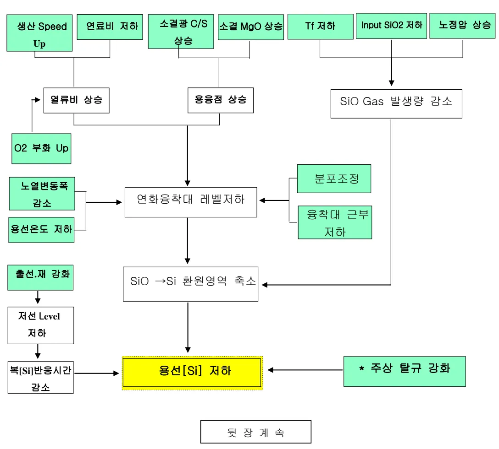

<!-- 페이지번호: 4, 파일명: [Si] 제어기술 기준 -->
## 4.4 용선[Si] 이행촉진 주요 영향인자

Flowchart illustrating the factors influencing [Si] concentration:
<ul><li>Inputs affecting Tf: 촬광석, Coke, Coal 중 맥석량, 맥석성분의 염기성, 송풍온도, 송풍습분, 산소부화, 보조연료 취입.</li><li>Inputs affecting Bosh Gas 중 H₂ 농도.</li><li>Inputs affecting O/C.</li><li>Inputs affecting 용융적하비: Tf, Bosh Gas 중 H₂ 농도, O/C, 송풍비, 광석용점 저하, 촬광석 환원도, 노체 방산열.</li><li>Inputs affecting 적하대 높이: 용융적하비, Tf, Bosh Gas 중 H₂ 농도, O/C, 송풍비, 광석용점 저하, 촬광석 환원도, 노체 방산열.</li><li>Inputs affecting 적하대의 Coke 온도: 용융적하비, 적하대 높이, 적하대의 용융물 보존온도, 반응의 특별 영역.</li><li>Inputs affecting 적하대의 용융물 보존온도: 적하대 높이, 적하대의 Coke 입자경, 용융물의 점성, 반응의 특별 영역.</li><li>Inputs affecting 반응의 특별 영역: 적하대의 Coke 입자경, 용융물의 점성.</li></ul>
All these factors ultimately influence [Si] 농도 (highlighted box).

# 5. 이상판단 및 조치기준

노내[Si]이 이상판단기준을 벗어났을시는 « 기술기준(고로공정) - 용선 및 외판주물선 요구품질 기준 (TP-030-050-020) »의 용선품질 이상시 조치기준에 따른다.

뒷 장 계속

<!-- 페이지번호: 5, 파일명: [Si] 제어기술 기준 -->
# 6. 기술이론

## 6.1 용선 [Si]생성 Mechanism

<b>Lumpy Zone</b>

<b>Gas Flow</b>

<b>Dropping</b>

<b>Dead Man</b>

<b>Slag Flow (SiO₂)</b>

<b>Gas Flow (SiO₂)</b>

<b>Slag Bulk</b>

<b>Hot Metal Bulk</b>

<b>Gas Flow</b>

<b>Cohesive</b>

<b>Race</b>

<b>Blast</b>

<b>Si 의 노내거동</b>
<ol><li>SiO₂(ℓ) + C = SiO(g) + CO(g)</li><li>SiO(g) → Si : SiO(g) + C = Si + CO(g)</li><li>Slag-Metal Reaction SiO₂(ℓ) + 2[C] = [Si] + 2CO</li><li>Reoxidation of [Si] [Si] + 2(FeO) = (SiO₂) + 2Fe</li></ol>

<b>(노 내부 상황)</b>

<b>Slag-Metal 반응</b>

<b>-C 와의 반응</b> (SiO₂) + 2C → [Si] + 2CO

<b>-Metal 과 반응</b> (SiO₂) + 2[C] → [Si] + 2CO

<b>([Si]의 변화)</b>

<b>Gas-Metal 반응</b>

<b>-중간 생성물 SiO 발생</b> SiO₂(ℓ) + C → SiO(g) + CO

<b>-Gas-Metal 간 직접 환원</b> SiO(g) + C, [C] → [Si] + CO

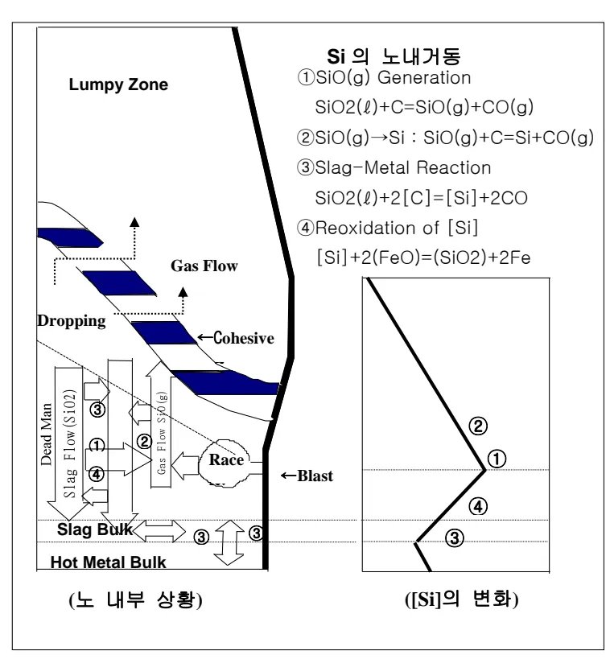

용선중 Si (이하 [Si])는 철광석이나 Coke Ash 중의 SiO₂ 성분이 노내에서 환원되어 용선중에 함유된 것으로 노내에서는 Slag-Metal 간 반응이나, Gas-Metal 간 반응으로 환원된다.

<math display="block">[  철광석중 SiO₂  Coke Ash 중 SiO₂ </math>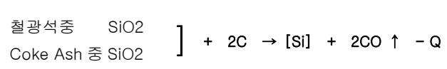

뒷 장 계속

### 적하대 Slag-Metal 반응

-C 와의 반응

<math display="block">(SiO₂) + 2C → [Si] + 2CO</math>

-Metal 과 반응

<math display="block">(SiO₂) + 2[C] → [Si] + 2CO</math>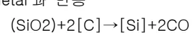

#### 연소대 Gas-Metal 반응

-중간 생성물 SiO 발생

<math display="block">SiO₂(ℓ) + C → SiO(g) + CO</math>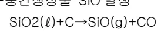

-Gas-Metal 간 직접 환원

<math display="block">SiO(g) + C, [C] → [Si] + CO</math>

#### 爐床部 Slag-Metal 반응

<math display="block">-SiO₂(ℓ) + 2[C] → [Si] + 2CO</math>

※ [Si]의 재산화 반응

<math display="block">[Si] + 2(FeO, MnO) → SiO₂ + 2[Fe, Mn]</math>

<math display="block">SiO + (FeO) → SiO₂ + Fe</math>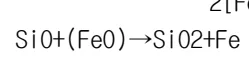

<!-- 페이지번호: 6, 파일명: [Si] 제어기술 기준 -->
## 6.2 적하대에서의 Si 거동

Coke 및 Coal 중의 SiO₂와 광석에서 유래된 용융 SiO₂가 강하하면서 Coke 중 C나 Metal 중의 [C]와 접촉 반응하여 선종[Si]로 이행한다. 이 영역에서는 Slag-Metal의 반응온도, 반응시간, 반응 비표면적, Slag 조성 등에 의해 [Si]의 크기가 변화한다.

<ul><li><b>반응온도</b> : 적하대 온도는 주로 연소된 Gas 온도, 적하대 높이, 용선 및 Slag의 유량에 의해 결정되며 이중 풍구 선단에서의 연소 Gas 온도(Raceway 연소온도)는 Raceway로 강화하는 Coke 입자온도, 풍운, 조습량, 산소부화량, 보조연료 취입량 등에 의해 결정된다. 따라서 Race-way 연소온도(Tf)와 Coke 충진층 강하 온도가 [Si]을 결정하는 주요 인자이다.</li><li><b>반응시간</b> : 반응시간은 적하대 쪽 Coke 충진층에서의 용선과 Slag의 체류시간을 의미하며, 적하대 거리, 액체의 물리적 성질(점도,밀도), 적하속도, 적하대 에서의 Coke 입도 분포 등에 의존한다. 이중 적하대 거리가 반응시간에 미치는 영향이 가장 크며 다음과 같은 인자들이 적하대 거리와 밀접한 관계가 있다.<ol><li>연소 Gas의 온도</li><li>Ore/Coke</li><li>광석의 용융 적하 온도</li><li>광석의 간접환원율(간접환원율이 크면 고상대역 확대, 적하대역 축소)</li><li>미분탄 취입량</li><li>조습량-Bosh Gas 중 수소량</li><li>노벽 방산열</li><li>액적의 체적속도- 생산 Speed, 출선비</li></ol></li><li><b>반응 비표면적</b> : SiO₂(g)발생은 적하대 높이, Bosh Gas 체적이 일정하면 Slag 유입량, Slag-Coke 간 반응 비표면적 및 반응시간에 의존하며, 적하대에서 SiO₂와 Metal과의 반응은 Coke 중 높이와 SiO₂ 분압이 일정하면 [Si]는 반응시간과 반응 비표면적에 비례한다.</li></ul>

<ul><li><b>Slag 조성</b> : Coke와 광석 중 액체에서 유래된 SiO₂는 영기조성에 의해 환량(a SiO₂)이 제어된다. 액체 성분의 영기조성에 따라 SiO₂ Gas의 흡수속도가 영향을 받아 SiO₂의 분압(P SiO₂)이 변화 한다. 또 MgO 증가는 연화 용착 온도를 상승시켜 연화용착대 위치저하, 적하대 높이 감소로 용선과 SiO₂의 접촉반응시간이 단축되어 [Si]이 저하한다.</li></ul>

<!-- 페이지번호: 7, 파일명: [Si] 제어기술 기준 -->
## 6.3 연소대 에서의 Si 반응

Raceway 는 고온 환원분위기로 적하대를 통과하면서 Slag 화 하는 Coke 및 Coal Ash 중의 SiO₂ 와 광석에서 유래한 Slag 내의 SiO₂ 성분의 환원에 의해 SiO Gas 가 발생한다.

Coke 또는 Coal Ash 중 SiO₂ 로 부터 SiO Gas 발생속도(그림 b)는 온도분포와 밀접한 관계가 있으며, 특히 고 SiO Gas 발생속도는 Raceway 내부와 노심 Coke 가 유입되는 Raceway 상부측에 위치하는데, 이는 Coke 충진층 밀도가 높고 온도가 높기 때문이다.

맥석 Slag 중 SiO₂ 로 부터의 SiO Gas 발생속도는 Coke 의 그것보다 발생속도에서 1/40 수준이며, 따라서 노내 SiO Gas 발생의 Source 는 Coke 또는 Coal 중의 Ash 임을 알 수 있다.

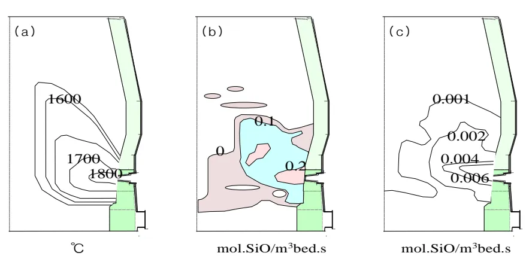

(a) 고로 모델에 의한 고상(Solid)온도 분포 (b) 코크스 중 SiO₂ 로 부터의 SiO Gas 생성속도 (c) Slag 중 SiO₂ 로 부터의 SiO Gas 생성속도

## 6.4 용선으로의 가규 반응

가규 반응은 SiO Gas 를 Si 원으로 하는 Gas-Metal 반응과 Slag 중 SiO₂ 를 Si 원으로 하는 Slag-Metal 반응이 주 반응이나 후자의 반응은 매우 미약하다. 용선중 가규 반응속도는 SiO Gas 발생속도에 비해서 훨씬 빠르기 때문에 Raceway 주변에서 발생된 SiO Gas 를 쉽게 흡수할 수 있게 된다. 따라서 저 [Si] 조업을 위해서는 SiO Gas 발생 반응, 즉 Coke Ash 로 부터의 SiO Gas 발생을 억제하는 것이 가장 중요하다.

Model 에 의해 계산된 고로내 용선중의 [Si]분포는 0.1~0.2 % 정도이나 출선치는 0.5% 정도 나타난다. Raceway 선단부에서는 1.0 % 정도이며 Raceway 상부 노심 Coke 유입부에서는 약간

<!-- 페이지번호: 8, 파일명: [Si] 제어기술 기준 -->

감소된 주체를 보여주고 있는데, 이것은 후꾸야마 5고로에서의 실고로 측정치와 거의 일치한다. [Si]의 고농도 지역이 풍구 Level 상의 노심부에 존재하는 이유는 이 부분에서 용선적하가 적고 SiO Gas 발생량이 많아 가규반응이 활발하게 진행되기 때문이며, 이 구역의 용선중 [Si]농도는 출선치에 큰 영향을 미친다.

SiO 분압의 분포

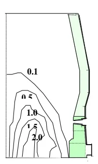

%용선중 [Si]

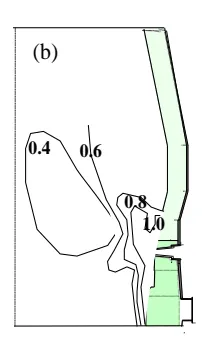

용선의 질량 유속

## 6.5 [Si]의 재 산화 반응

해체조사에서 밝혀진 [Si]의 거동은 풍구 ~ Bosh 하부에서는 3% 전후, 노저에서는 1% 전후로 떨어졌다. 이는 [Si]의 재 산화반응으로 탈[Si]이 일어남을 의미한다.

<math display="block">[Si] + 2(MO) 
→ SiO₂ + 2[M]  *M = Fe, Mn 등</math>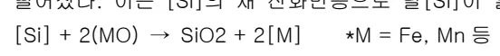

즉 FeO 의 상승은 탈[Si]의 원인이 된다. 저 환원율의 광석이 강하하는 영역에서는 FeO 를 많이 함유한 Slag 도 동시에 강하하기 때문에 직접환원이 일어나 온도저하를 초래하고, SiO 발생 또는 SiO 와 선중 [C]와의 반응을 억제하며, FeO 함유 Slag 강하에 의해 산소분압이 상승하기 때문에 SiO 가 SiO2 로 재 산화되어 SiO 분압이 저하한다.

또, 직접환원 FeO 는 [Si] + 2(FeO) 
→ SiO₂ + 2Fe 로 [Si]을 SiO2 로 재 산화하므로 선중[Si]는 저하한다.

## 6.6 노내[Si] 제어기술

### 가. Slag-Metal 간 반응 억제

<ul><li>노내 열 Level Down → SiO2 분해 반응 억제</li><li>조업 Speed 증가 → 용융물의 노내 체류시간 단축 → 반응 억제</li><li>Slag 염기도 및 MgO 증가 → SiO2 활량저하 → 반응 억제</li><li>Coke 강도확보 → 노심 공극율 향상 → 출선, 재 개선 → 반응시간단축</li><li>소결광 사용비 상승 → 적하대 구간 축소 → 반응거리, 시간단축</li></ul>

<!-- 페이지번호: 9, 파일명: [Si] 제어기술 기준 -->

Graph showing [Si] vs THM (°C). The regression equation is y = 4.29 × 10⁻³ X - 6.11.

Graph showing [Si] vs Po (ton/d). The regression equation is y = 1.15 × 10⁻⁴ X + 1.36.

Graph showing [Si] vs CaO/SiO₂. The legend indicates MgO content ranges: 5.8 ~ 7.1% and 7.2 ~ 8.5%.
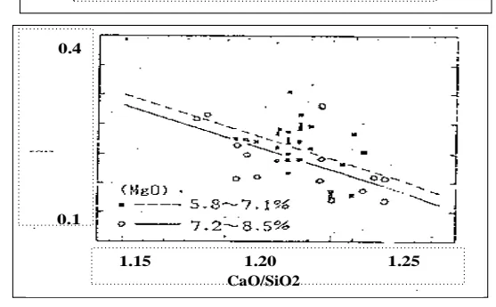

Graph showing [Si] × 10⁻²% vs SOR (%). The legend indicates 3BF (red triangles) and 4BF (white squares). The 3BF data points are associated with the transformation 3BF: 77.9 → 81.2%.
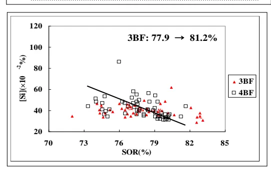

Graph showing [Si] × 10⁻²% vs Input SiO₂ (Kg/T-P). The legend indicates 1BF (black circles) and 4BF (white squares). The 1BF data points are associated with the transformation 1BF: 123.8 → 120.6kg/t-p.
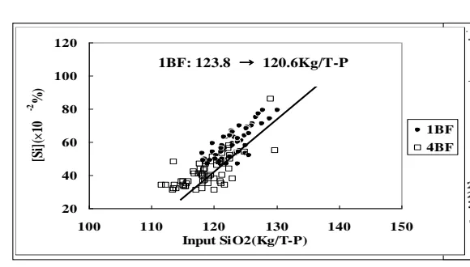

Graph showing [Si] vs pSiO, atm. The regression equation is Y = 91.62X + 0.11; R = 0.76.

※ P SiO (SiO Gas 분압)는 Slag 조성에서 생각할 수 있으며, SiO Gas 발생원으로써 Coke, Coal 중 Ash 와 광석중 맥석이 고려되며 Slag 의 영기도 조정에 의해 SiO₂ 활량(αSiO₂)이 제어된다.

또 Slag 영기도에 따라 SiO Gas 의 흡수속도가 영향을 받아 SiO의 분압(P SiO)이 변화한다. 한편 MgO 의 증가는 연화 용착 온도를 상승시키며 용착대 위치저하, 적하구간 감소로 인해 용선과 SiO의 접촉 시간이 단축 되어 [Si]이 저하한다.

<!-- 페이지번호: 10, 파일명: [Si] 제어기술 기준 -->
### 나. SiO2 → SiO Gas 반응화 억제

<ul><li>Tf 저하 → P SiO 저하 → Gas 화 반응 억제</li><li>Coke, Coal 중 Ash 저하 → 풍구앞 SiO2 인입 억제</li><li>노정압 상승에 의한 송풍압 증가 → CO 분압 증가 → P SiO 저하</li></ul>

### 다. SiO2 일량 제어

·고로 장입 SiO2

<table><thead><tr><th>구분</th><th>소결광</th><th>코크스</th><th>정립광</th><th>미분탄</th><th>부원료</th><th>펠렛</th><th>계</th></tr></thead><tbody><tr><td>장입 SiO2(kg/TP)</td><td>68.3</td><td>21.0</td><td>8.9</td><td>7.4</td><td>5.2</td><td>0.7</td><td>111.6</td></tr><tr><td>%</td><td>61.2</td><td>18.8</td><td>8.0</td><td>6.6</td><td>4.7</td><td>0.6</td><td>100</td></tr></tbody></table>
<a href="components/TP-030-050-030 [Si] 제어기술 기준(Rev.11)_0900bf4ba9aaaf78_usr0000bf4b95f9e446_p010_table_01.png">Table snapshot</a>

소결광에 비해 정립광이나 펠렛의 SiO2 함량이 적으나 원가측면에서 불리하기 때문에 제강 [Si]

요구수준을 감안하여 소결광 사용량을 조절한다.

·PCI coal brand 에 따른 영향

<table><thead><tr><th rowspan="2">미분탄종</th><th colspan="6">반무연탄</th><th colspan="3">미점탄</th></tr><tr><th>F.X</th><th>Y.Q</th><th>M.Z</th><th>S.C</th><th>C.B</th><th>C.U</th><th>C.P</th><th>B.I</th><th>B.P</th><th>A.P</th></tr></thead><tbody><tr><td>SiO2 함량 (%)</td><td>3.8</td><td>5.2</td><td>4.4</td><td>3.1</td><td>3.7</td><td>4.5</td><td>4.0</td><td>5.9</td><td>4.4</td><td>4.7</td></tr></tbody></table>
<a href="components/TP-030-050-030 [Si] 제어기술 기준(Rev.11)_0900bf4ba9aaaf78_usr0000bf4b95f9e446_p010_table_02.png">Table snapshot</a>

코크스에 비해 상대적으로 SiO2 함량이 적은 미분탄 사용량을 늘리는 것이 용선 중 저[Si] 조업에 유리하고, 미분탄 사용량이 증가할수록 탄 중 Ash 에 포함된 SiO2 가 낮은 미분탄을 사용하는 것이 저[Si] 조업에 유리하다.

‘끝.’

이 하 여 백
