<!-- 페이지번호: 1, 파일명: [Mn] [P] 제어기술 기준 -->
# 1. 적용범위

용선성분중 [Mn], [P]의 관리기준과 노내에서의 Mn, P의 거동 및 제어기술에 대해 적용한다.

# 2. 목적

<ul><li>용선중 [Mn]은 제강공정에서 강종별 최소량의 Mn 규격이 있으므로 고로에서부터 성분규격을 설정하여 관리해야 한다.</li><li>용선중 [P]는 고급강(저린강, 극저린강) 제조시 극소량까지 제어해야 하므로 고로에서부터 성분을 관리하여 제강 예비처리공정의 효율이 상승할 수 있도록 관리해야 한다.</li></ul>

# 3. 중점 관리항목

<table><thead><tr><th>품질영향 인자</th><th>공정영향 인자</th></tr></thead><tbody><tr><td>[Mn]</td><td>◦소결광중 MnO</td></tr><tr><td>[P]</td><td>◦소결광중 P2O5</td></tr></tbody></table>
<a href="components/TP-030-050-050 [Mn] [P] 제어기술 기준(Rev.9)_0900bf4ba7a46419_usr0000bf4b95f9e446_p001_table_01.png">Table snapshot</a>

# 4. 조업 기준

## 4.1 용선중 [Mn], [P] 성분기준

<table><thead><tr><th>구분</th><th>성분 규격 기준</th><th>비고</th></tr></thead><tbody><tr><td>[Mn]</td><td>기준없음</td><td rowspan="2">TP-030-050-020 참조</td></tr><tr><td>[P]</td><td>≤ 0.160</td></tr></tbody></table>
<a href="components/TP-030-050-050 [Mn] [P] 제어기술 기준(Rev.9)_0900bf4ba7a46419_usr0000bf4b95f9e446_p001_table_02.png">Table snapshot</a>

## 4.2 노내에서의 Mn 반응

적하개시 후, MnO의 환원은 진행되지만 풍구하부에서 급격히 환원이 진행된다. [Si]의 환원과, [C]의 침탄반응이 Bosh 및 Belley 상부에서 급속히 진행되는 것에 비해, MnO의 환원은 노상부에서 용선과 슬래그에서 진행 된다.

MnO까지 환원 (510~ 1050°C)

MnO의 직접환원 (1100°C 이상)

[Si]에 의한 환원

0 0.5 1.0 1.5

<노내적하물중 [Mn]의 주이>

<!-- 페이지번호: 2, 파일명: [Mn] [P] 제어기술 기준 -->
### 4.2.1 Mn 의 환원

고로 장입원료중 Mn Source 는 주로 MnO₂(Pyrolusite), Mn₃O₄(Hausmanite), 3Mn₂O₃, MnSiO₃(Braunite), MnO₂ · nH₂O(Psilomelane) 형태로 장입된다.

이들은 화학친화력이 낮아, 고로조건에서는 쉽게 산소의 일부를 방출하고 MnO 가 된다.

이때 MnO₂ 와 Mn₂O₃ 는 비가역 반응에 의해 Mn₃O₄ 까지 환원한다.

<math display="block">3MnO₂ + 2CO → Mn₃O₄ + 2CO₂ + 101,600kcal</math>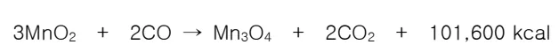

<math display="block">3Mn₂O₃ + CO → 2Mn₃O₄ + CO₂ + 40,660kcal</math>

환원된 Mn₃O₄ 는 다시 환원제 C 와 반응하여 MnO 까지 환원 한다.

<math display="block">Mn₃O₄ + CO → 3MnO + CO₂ + 12,4000kcal</math>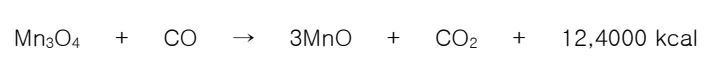

<math display="block">CO₂ + C → 2CO</math>

<math display="block">Mn₃O₄ + C → 3MnO + CO</math>

위 반응은 CO-CO₂ 혼합 가스 중 CO의 평형함량이 낮은 곳(700°C에 CO 약 10%)에서 잘 진행된다. 이 환원 조건에서는 Fe₃O₄ 의 환원보다 더 용이하게 일어난다. 그러나 Shaft 상부의 고온 아래에서는 Mn₃O₄ 에서 MnO 을 생성하는 반응에 따라 발생된 CO₂ 는 다시 C 와 반응하여 CO 를 생성시키므로 결국 환원과정은 직접환원으로 진행 한다.

##### 

<math display="block">MnO + CO → Mn + CO₂</math>

위의 반응이 일어날 수 있는 조건은 700°C에서 가스상의 CO₂ 함량이 0.01%를 넘지 않을 때 만이 된다. 고로 내에서는 700°C에서 이렇게 CO₂ 가 적을 수는 없다. CO₂ 가 이정도 될 수 있는 것은 1000°C 이상의 온도에서 환원된 CO₂ 가 전부 C로 반응 될 때 만이다.

<math display="block">MnO + CO → Mn + CO₂</math>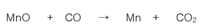

<math display="block">CO₂ + C → 2CO</math>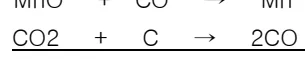

<math display="block">MnO + C → Mn + CO</math>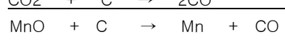

MnO 를 고체 C 으로 환원하기 위해서는 일정온도 조건이 필요하고, 600~700°C에서는 반대방향 조차 진행된다.

<math display="block">Mn + CO → MnO + C + 68,640kcal</math>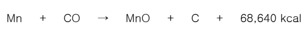

<!-- 페이지번호: 3, 파일명: [Mn] [P] 제어기술 기준 -->

반응을 Mn의 환원 방향으로 향하게 하기 위해서는 보다 높은 온도가 필요하다. 즉 Bosh와 Hearth에서 Mn의 탄화물 Mn₃C가 생성되지만, 이 C가 MnO를 Mn으로 심하게 환원시킨다. Mn₃C 생성은 발열반응으로서 흡열 반응인 Mn의 환원 진행을 쉽게 해준다.

<math display="block">MnO + [(8)/(6)]C → [(1)/(3)]Mn₃C + CO - 64kcal</math>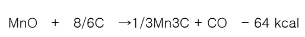

<math display="block">MnO + C → Mn + CO - 68.9kcal</math>

500°C 또는 그 이하의 온도에서, Mn₂O₃와 MnO₂는 환원하기 시작하고, Mn₃O₄는 570~1050°C 범위에서 환원이 된다. MnO가 C에 의해 Mn까지 환원이 시작되는 온도가 1100°C 부터이다. Fe가 존재하는 경우 1030°C에서도 이 환원이 시작되지만, 1200~1400°C에서 환원율 15~73%가 일어난다. 고로 조건하에서는 Mn이 선종에 약 60~80%가 들어가고, 극히 일부가 가스에 의해 노외로 방출되고, 나머지는 슬래그 중에 녹는다.

최근, Si이 Mn보다 먼저 환원되고 Mn의 환원은 C에 의하지 않고, Si에 의해 행해진다는 의견이 있다.

<math display="block">2MnO + [Si] → 2Mn + SiO₂ - 32.1 kc</math>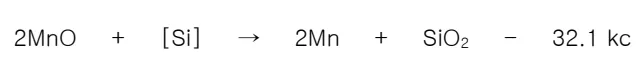

따라서, Mn의 환원은 노열이 높을수록 [Si]가 높을수록 많이 발생하며, 이는 슬래그의 영기도와 다음 지수와의 관계에서 설명되어진다.

<math display="block">K_{Mn} = [((Mn)√([Si]))/([Mn])]</math>

(Mn) : 슬래그중 Mn의 함량

[Si], [Mn]: 용선중 Si 및 Mn의 함량

슬래그의 영기도가 높게 됨에 따라 K_{Mn}의 값은 감소한다, 즉 용선의 [Si] 함량이 적게되고, 용선의 Mn 함량이 올라가면 슬래그의 Mn이 저하된다. 슬래그의 영기도가 불변하고, K_{Mn}가 불변하면 다음과 같이 된다.

<math display="block">K_{Mn} [(1)/(√([Si]))] = [((Mn))/([Mn])]</math>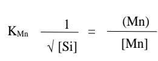

<!-- 페이지번호: 4, 파일명: [Mn] [P] 제어기술 기준 -->

따라서, 이경우 용선의 Si 함량 √([Si])의 상승은 [Mn]의 증대와 (Mn)의 저하를 일으킨다.

그림 1과 2에서는 [Mn]/(MnO)와 용선온도의 관계를 나타낸다.

즉 온도가 높을 때 MnO의 환원이 잘 일어나고 있다.

즉 용선온도의 상승에 의해 용선중 [Si]의 상승을 초래하고

용선중 [Mn]도 상승한다. 그림 3에서는

[Mn]/(MnO)와 C/S의

관계를 나타낸다. 실 고로에서는 거의 MnO의 환원은 풍형에

달해 있다고 생각해도 좋다.

그림 1. MnO 환원에 대한 용선온도의 영향

그림 2. MnO 환원에 대한 용선온도의 영향(2)

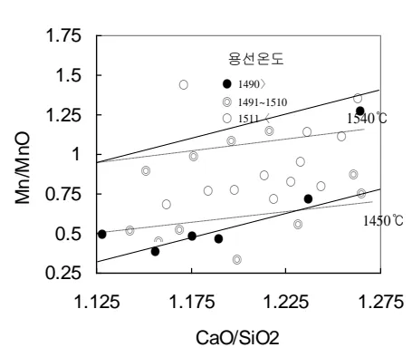

그림 3. MnO 환원에 대한 염기도의 영향

뒷 장 계속

<!-- 페이지번호: 5, 파일명: [Mn] [P] 제어기술 기준 -->
### 4.2.2 Mn 광 사용 FLOW

<table border="1" style="width: 100%; text-align: center;"><tbody><tr><td rowspan="6" style="width: 15%; vertical-align: top; text-align: left;">제선공장</td><td>Mn 광 파쇄</td><td>분 Mn 광</td></tr><tr><td>Over Size(8~30mm)</td><td>Under Size(-8mm)</td></tr><tr><td colspan="2">소결 Blending</td></tr><tr><td colspan="2">소결광중 MnO 함유</td></tr><tr><td colspan="2">고로 장입</td></tr><tr><td colspan="2">용선중 [Mn]</td></tr><tr><td rowspan="5" style="width: 15%; vertical-align: top; text-align: left;">제강공장</td><td>탈 S</td><td></td></tr><tr><td>탈 P</td><td></td></tr><tr><td>전 로</td><td>탈산 합금철 투입 : (Fe-Mn, Al, Fe-Si 등)</td></tr><tr><td>BAP</td><td></td></tr><tr><td>RH-OB</td><td>합금철 투입 : (Fe-Mn, Al, Fe-Si 등)</td></tr><tr><td colspan="2">연 주</td><td></td></tr><tr><td colspan="3">저급제</td></tr></tbody></table>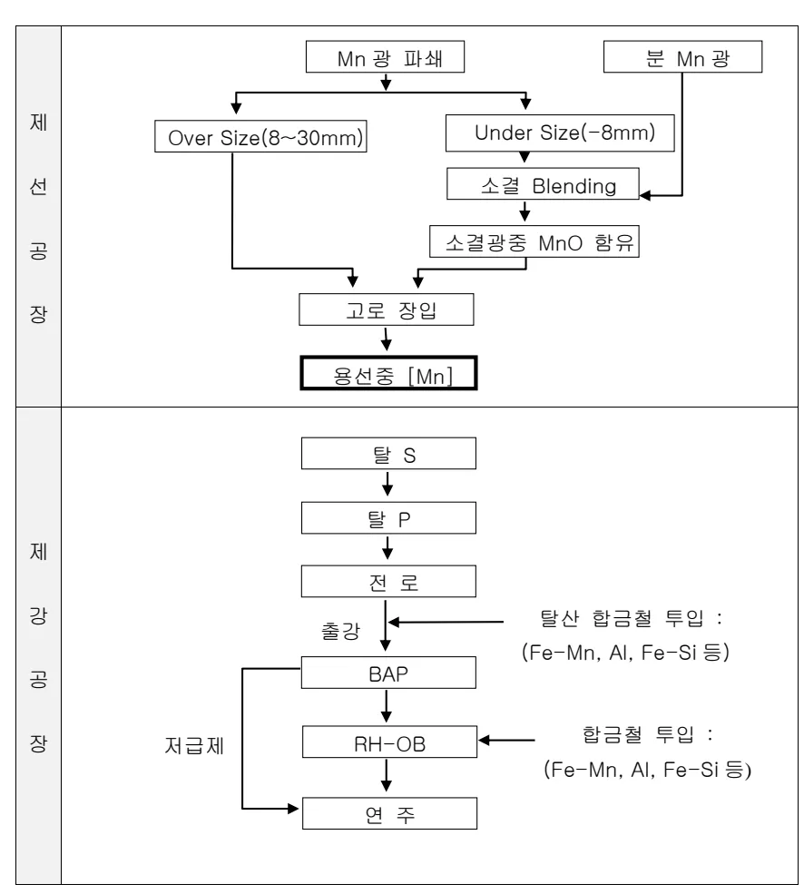

뒷 장 계속

<!-- 페이지번호: 6, 파일명: [Mn] [P] 제어기술 기준 -->
### 4.2.3 [Mn] 함량 저하 이론적 배경

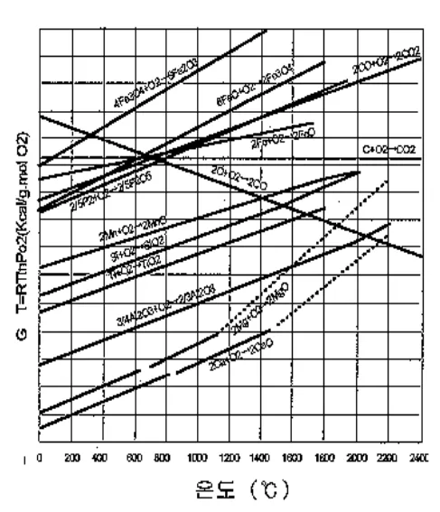

○ 산소결합 순서 : Ti → Si → Mn → P

○ O₂ Source : 탈규제, 공기

○ Mn 광 환원제 : C, [Si]

<math display="block">MnO + [(8)/(6)] C → [(1)/(3)] Mn₃C + CO - 269,400 J</math>

<math display="block">MnO + C → Mn + CO - 288,500 J</math>

<math display="block">2MnO + [Si] → 2Mn + SiO₂ - 134,300 J</math>

※ 고로내 환원분위기에서는 MnO의 간접 환원은 불가능함 (MnO의 CO Gas 에 의한 간접환원 가능 온도는 2,200 °C 이상임)

※ MnO의 환원은 C, Si 에 의한 직접환원으로 가능하며, 소요열량이 큼.

● 고로 조업에서 [Mn] 제어 방법(C/S, 용선온도 등)은 몇가지 있지만, 장입 Mn의 대부분 (약 70% 이상)이 용선중으로 환원되기 때문에 고로에서는 임량의 조정에 의해서 용선중 [Mn]을 제어 하고 있다.

## 4.3 노내에서의 P 반응

고로 장입 원료 중 P₂O₅ 형태로 산화철 또는 석탄과 결합해서 (FeO)₃P₂O₅—Vivianite, 또는 (CaO)₃P₂O₅—Apatite로 존재한다.

Vivianite의 H₂ 에 의한 환원은 600°C에서 시작하지만 CO에 의한 환원은 더 높은 온도에서 이루어진다. 환원이 급속히 이루어지는 구간은 H₂ 에 의한 환원은 900~ 1000°C이고, CO에 의한 환원은 100~ 1200°C 구간이다. P가 환원될 때는 (FeO)₃P₂O₅ 에서 P와 Fe로 동시에 환원된다.

<노내적하물중 [P]의 추이>

<!-- 페이지번호: 7, 파일명: [Mn] [P] 제어기술 기준 -->
<math display="block">2Fe₃(PO₄)₂ + 16CO = 3Fe₂P + P + 16CO₂</math>

950~1000℃ 이상의 온도에서는 C의 존재

아래서 CO₂는 불안정하고 결국;

<math display="block">2Fe₃(PO₄)₂ + 16C = 3Fe₂P + P + 16CO</math>로 반응하고 P는 용선에 녹는다.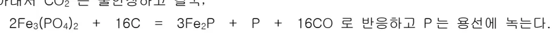

Apatite의 환원반응은 C, CO 및 H₂에 의한 환원이 가능하다. 1300℃에서 다음의 반응에 의해 P가 생성된다. (CaO)₃P₂O₅ + 5C = 3CaO + 2P + 5CO - 389100 kcal

P₂O₅의 P가 완전히 환원되는 것은 산소와의 친화력이 비교적 적기 때문이다.

용선중에 환원되는 것에서 부터 고로 노내 에의 P의 관리는 불가능하고, 원료단계에서의 관리기준을 강화하는 것이 필요하다.

## 4.4 [P] 입력 제어

- 고로 장입 [P]

<table><thead><tr><th>구분</th><th>소결광</th><th>코크스</th><th>정립광</th><th>미분탄</th><th>펠렛</th><th>부원료</th><th>계</th></tr></thead><tbody><tr><th>[P] 함량 (%)</th><td>0.060</td><td>0.050</td><td>0.057</td><td>0.024</td><td>0.023</td><td>0.068</td><td>-</td></tr><tr><th>장입 [P] (kg/TP)</th><td>0.81</td><td>0.17</td><td>0.15</td><td>0.04</td><td>0.01</td><td>0.01</td><td>1.19</td></tr><tr><th>%</th><td>68.1</td><td>14.3</td><td>12.6</td><td>3.4</td><td>0.8</td><td>0.8</td><td>100</td></tr></tbody></table>
<a href="components/TP-030-050-050 [Mn] [P] 제어기술 기준(Rev.9)_0900bf4ba7a46419_usr0000bf4b95f9e446_p007_table_01.png">Table snapshot</a>

- 소결 사용 원료 Brand에 따른 영향

<table><thead><tr><th>구분</th><th>HIY.F</th><th>CAR.F</th><th>YAN.F</th><th>MAC.F</th><th>SAL.F</th><th>JSN.PK</th><th>MINI.P</th></tr></thead><tbody><tr><th>[P] 함량 (%)</th><td>0.050</td><td>0.031</td><td>0.039</td><td>0.059</td><td>0.079</td><td>0.201</td><td>0.069</td></tr></tbody></table>
<a href="components/TP-030-050-050 [Mn] [P] 제어기술 기준(Rev.9)_0900bf4ba7a46419_usr0000bf4b95f9e446_p007_table_02.png">Table snapshot</a>

소결광에서 장입되는 [P]의 양에 가장 영향을 받기 때문에 사용 광종 관리를 통한 입력 제어가 요구되며 [P]함량이 높은 자선분광(JSN.PK)의 사용량을 조절하는 것이 중요.

# 5. 이상판단 및 조치기준 :

노내[P]이 이상판단기준을 벗어났을시는 « 기술기준(고로공정) - 용선 및 외판 주물선 요구품질 기준 (TP-030-050-020) »의 용선품질 이상시 조치기준에 따른다.

‘끝.’
