<!-- 페이지번호: 1, 파일명: Slag 염기도 및 유동성 관리기준 -->
# 1. 적용범위

고로공정에서 용선과 함께 생산되는 SLAG의 염기도 및 유동성 관리기술에 대해 적용한다.

# 2. 목적

SLAG는 철광석이 융융되거나 COKE의 연소후 생성되는 맥석들의 용용물로서 용선과 거의 동일한 시점에 융융되고 배출되기 때문에 용선성분 및 고로 노황에 SLAG성상이 미치는 영향은 대단히 크다. 따라서 SLAG 성상중 가장 중요한 염기도 및 유동성의 제어기술에 대한 이해가 필요하다.

# 3. 중점 관리항목

<table><thead><tr><th>품질영향 인자</th><th>공정영향 인자</th></tr></thead><tbody><tr><td>[Si] [S]</td><td>풍압,노열</td></tr></tbody></table>
<a href="components/TP-030-060-020 Slag 염기도 및 유동성 관리기준(Rev.13)_0900bf4ba7a44070_usr0000bf4b95f9e446_p001_table_01.png">Table snapshot</a>

# 4. 조업기준

## 4.1 SLAG 염기도 관리기준

<table><thead><tr><th>항 목</th><th>관리범위</th><th>최적 조업범위</th><th>노황 조건</th></tr></thead><tbody><tr><td>고로 SLAG 염기도 (CaO/SiO2)</td><td>1.10 ~ 1.30</td><td>1.25 ± 0.03</td><td>○용선온도 1,500 °C ○SLAG 중 Al2O3 14~16 %</td></tr></tbody></table>
<a href="components/TP-030-060-020 Slag 염기도 및 유동성 관리기준(Rev.13)_0900bf4ba7a44070_usr0000bf4b95f9e446_p001_table_02.png">Table snapshot</a>

○고로 조업조건인 용선온도 1,500 °C, SLAG 중 Al2O3 10~16 % 조건에서

○유동성 측면에서는 SLAG 염기도 1.10 ~ 1.30 으로 관리필요

○노내 탈류능을 고려하면 SLAG 염기도 1.20 ~ 1.35 까지 관리필요

○따라서 고로 SLAG 염기도 관리범위는 노내 탈류능과 SLAG 유동성을 고려하여 1.10 ~ 1.30 이다.

- 필요시(통기성 불량, 정기수리, 노벽수리등)시는 上記 범위를 벗어나 일시적으로 조업할 수 있다.

- SLAG 염기도 관리범위기준은 각 고로특성에 따라 변경관리할수 있다

# 5. 이상판단 및 조치기준

## 가. 노내 용용물(용선+SLAG)의 유동성 불량시는 SLAG 염기도, Al2O3 함량을 확인하고, C/S ≥ 1.31 이면 장입계산으로 염기도를 낮추고, Al₂O₃ ≥ 16.1 %인 경우는 소결공장에 Al₂O₃ 량을 낮추어 줄 것을 요청한다.

## 나. 용선중 [S]가 평상치(0.015~0.020 %)보다 상승시는 염기도를 1.20 이상으로 상향 조정한다.

<!-- 페이지번호: 2, 파일명: Slag 염기도 및 유동성 관리기준 -->
## 다. SLAG 영기ido가 1.31 이상이고 노내 통기성이 악화될 때는 감광 및 계산영기ido를 낮춘다.

-감광 및 영기ido 조정폭은 당시 고로상황에 따라 판단, 결정한다.

# 6. 기술이론

## 6.1 노내 탈류능력과 SLAG 유동성을 고려한 SLAG 영기ido 검토

### 가. 노내 탈류와 Slag C/S

<ul><li>용선중의 [S]는 Slag-Metal 계면반응에 의해 Slag 중으로 이행 [FeS] + (CaO, MgO) → (FeO) + (CaS, MgS)</li><li>따라서 탈류반응은 C/S 가 높거나, 고열일때 활발.</li><li>용선온도 1,500 °C 상태에서는 C/S 1.40 까지 탈류능 향상됨.</li></ul>

(그림)Slag 영기ido와 탈류능

### 나. SLAG 유동성과 Slag C/S

<ul><li>용선온도 1,500 °C, Al₂O₃ 10~16% 수준에서 Slag C/S 1.20 수준이 유동성면에서 가장 유리</li></ul>

(a) Al₂O₃ 10%, Mgo 5%

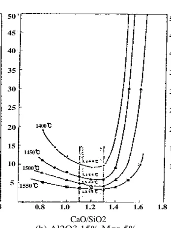

(b) Al₂O₃ 15%, Mgo 5%

(c) Al₂O₃ 20%, Mgo 5%

뒷 장 계속

<!-- 페이지번호: 3, 파일명: Slag 염기도 및 유동성 관리기준 -->
#### 다. SLAG 성분관리

<ul><li>포항고로 조업조건인 용선온도 1,500 °C, Slag 중 Al₂O₃ 10.0~16.0% 에서</li><li>노내 탈류능력을 확보하기 위해서는 Slag C/S 1.20~1.35 까지 관리필요</li><li>반면에 Slag 유동성을 확보하기 위해서는 Slag C/S 1.10~1.30 까지 관리필요</li><li>따라서 포항 고로는 탈류능력과 Slag 유동성을 확보하기 위해서는 영기도를 1.20 ~ 1.30 범위로 관리하면 됨.</li></ul>

## 6.2 SLAG 의 성분

<table><thead><tr><th>염기성</th><th>산성</th><th>양(兩)성</th></tr></thead><tbody><tr><td>FeO</td><td>SiO2</td><td>Al₂O₃</td></tr><tr><td>MnO</td><td>P2O5</td><td>Fe2O3</td></tr><tr><td>CaO</td><td>Cr2O3</td><td>TiO2</td></tr><tr><td>MgO</td><td>WO3</td><td></td></tr><tr><td>Na2O</td><td>V2O5</td><td></td></tr><tr><td>K2O</td><td>Mo3</td><td></td></tr></tbody></table>
<a href="components/TP-030-060-020 Slag 염기도 및 유동성 관리기준(Rev.13)_0900bf4ba7a44070_usr0000bf4b95f9e446_p003_table_01.png">Table snapshot</a>

## 6.3 SLAG 의 주요 조성

Slag 의 주요 조성은 SiO₂, Al₂O₃, CaO, MgO 이며 기타 성분으로서 MnO 2% 이하, TiO₂ 2% 이하, S 약 1%, FeO 약 1% 이하를 품고 있다.

CaO-SiO₂-Al₂O₃ 3 원계의 용점을 그림에 나타낸다.

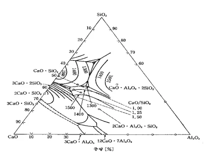

그림. CaO-SiO₂-Al₂O₃ 계의 용점

## 6.4 SLAG 의 유동성

Slag 의 유동성은 고로 조업 및 출선재 작업에 중요한 영향을 미치며 점성, 표면장력, 밀도 및 유체의 온도와 밀접한 관계가 있다.

### 6.4.1 점성(점도, VISCOSITY)

점성이란 다른 속도로 이동하는 액체층의 사이에서 발생하는 내부 마찰력이라고 생각한다.

그림 1. 처럼 접촉면적(S)의 점성액체를 깔 2개의 층이 dx 거리만큼 떨어져 있는 경우

이 2개를 운동 속도차 du로 움직이기 위해 필요한 힘(P)는 다음과 같은 식으로 나타낸다

<!-- 페이지번호: 4, 파일명: Slag 염기도 및 유동성 관리기준 -->

[(P)/(S)] = η [(d u)/(d x)]

S

→ P

점성액체

d x

u + d u

v

그림 1. 점성의 정의

여기서 η는 내부마찰계수로서 점성을, 점성계수 또는 절대점도라 한다.

점성계수 η의 단위는 c.g.s. 단위계(dyn.sec/cm²)로 나타낼때는 그 단위를 poise로 부른다.

또 η(poise)를 밀도ρ(g/cm³)로 나눌때 값 η/ρ를 동점성계수 또는 동점도라 하고 그 단위는 stokes라 한다.

표 1. 에 점성계수 값의 개념을 알기 쉽게 대표적인 물질의 점도를 나타냈다.

[표 1. 대표적인 물질의 점도]

<table><thead><tr><th>물질명</th><th>점도 (poise)</th></tr></thead><tbody><tr><td>물(water)</td><td>0.01</td></tr><tr><td>흐름이 양호한 Slag</td><td>3~6</td></tr><tr><td>용선</td><td>0.04~0.08</td></tr></tbody></table>
<a href="components/TP-030-060-020 Slag 염기도 및 유동성 관리기준(Rev.13)_0900bf4ba7a44070_usr0000bf4b95f9e446_p004_table_01.png">Table snapshot</a>

### 6.4.2 화학성분과 SLAG 유동성과의 관계

### 가. SiO₂의 영향

SiO₂는 산성 산화물이고 점도가 높은 glass를 만드는 주성분이므로 점성을 저하시키기 위해 일반적으로 염기성 성분을 첨가해 유동성을 좋게할 필요가 있다. 또한, SiO₂는 산소를 4개 배위한 사면체가 3차원적으로 결합해서 Network를 구성한 산화물이다.

고로 Slag의 점성은 주로 이 Network에 의해 크게 지배되고 이 Network가 작은 만큼 점성은 낮다. SiO₂는 일반적으로 안정한 Slag를 형성한다.

### 나. CaO의 영향

CaO는 Slag 구조상 Network 파괴자로 되어 SiO₂와 공존하며, SiO₂와 공존시 점성을 저하시키지만 규산 Slag와 관계하는 이상으로 첨가하면 Slag 용점이 높아져 CaO 증가에 따라 점성이 증가한다.

뒷 장 계속

<!-- 페이지번호: 5, 파일명: Slag 염기도 및 유동성 관리기준 -->
#### 다. FeO, MnO의 영향

FeO와 MnO는 Slag의 점성을 저하시켜 점출 온도를 낮춘다. FeO의 융점은 1380°C로 낮기 때문에 CaO, SiO₂에 더하면 융용점이 저하한다.

Slag 중에 FeO를 더하면 전체적으로 점성은 저하하지만, 염기성 Slag보다는 산성 Slag에 더하는 편이 Network 파괴자로써 효과가 크다.

MnO는 Slag 점출 온도와 점성에 관해서 FeO와 거의 유사한 영향을 미친다.

또 MnO 첨가는 FeO처럼 SiO₂의 용용점을 저하시킨다.

#### 라. TiO₂의 영향

TiO₂는 FeO처럼 초기 Slag의 유동성을 저하시키며, 1400°C 부근에서 Al₂O₃와 SiO₂는 점성을 상승시키지만 TiO₂는 점성을 저하시킨다.

TiO₂의 점도를 저하시키는 효과는 1400°C 부근의 낮은 온도에서 현저하다.

#### 마. S의 영향

고로 Slag는 S를 여러가지 화합물로 함유하고 있다. S의 화합물로서는 주로 CaS이고 그 밖에 FeS, MnS, MgS로 존재한다. 유화물 Slag의 점성에 대해서는 일반적으로 유화물의 증가에 따라 어느 한계까지는 점도를 저하시키고, 그 유화물의 석출로 인해 점도가 상승한다고 알려져 있다. MgS는 Slag 중에 용해하지 않기 때문에 미세 분산된 현탁물로써 Slag 중에 더물러 점성을 증대시킨다.

### 6.4.3 C/S에 따른 점도의 영향

#### 가. 저 C/S의 경우(C/S=1.1) Al₂O₃가 높아지는 경우 MgO량을 첨가하면 점도의 상승을 방지.

#### 나. 고 C/S의 경우(C/S=1.3) 염기성 성분이 많이 존재하기 위해 MgO를 첨가하면 점성 저하의 효과가 있지만 Al₂O₃가 10% 이상 존재하는 때에는 점성을 저하시키고, Al₂O₃ 10% 이하에 대해서는 MgO의 첨가는 점성을 상승시킨다.

Al₂O₃(%) (a) 1450°C C/S=1.1

Al₂O₃(%) (b) 1450°C C/S=1.3

<!-- 페이지번호: 6, 파일명: Slag 염기도 및 유동성 관리기준 -->
#### 다. Al₂O₃, MgO 성분 변화에 대한 안정성은 전반적으로 염기도가 높은 slag가 등정성 곡선의 간격이 좁고 불안정하다. 통상 고로 slag 성분에는 거의 문제가되지 않는다.

### 6.4.4 복합염기도가 SLAG 점성에 미치는 영향

<ul><li>MgO는 산성 Slag(C/S 0.8)에서는 첨가시 점성을 저하시켜 주고 염기성 Slag(C/S 1.2) 분위기에서는 CaO에 비해 약 염기성이며 CaO가 과잉으로 존재하므로 유동성 개선 효과가 적음. 따라서 C/S 1.2인 고로 조업범위 내에서<ul><li>Al₂O₃ 0%인 경우 : 염기가 과잉으로 존재하여 MgO(0~5%)첨가해도 점성저하 효과는 적음.</li><li>Al₂O₃ 6~16%인 경우 : Al₂O₃는 산성 성분이므로 증가시에 점성저하 효과가 큼.</li></ul></li></ul>

<ul><li>MgO가 점성저하 효과를 발휘할 수 있는 범위는 산성성분의 과잉상태인 (Al₂O₃ 9~13%) 범위이며 Slag 염기도 1.2, 복합 C/S 0.98~1.00 범위에서 Slag 점성이 최저수준이 유지되어 유동성 개선효과가 큼.</li></ul>

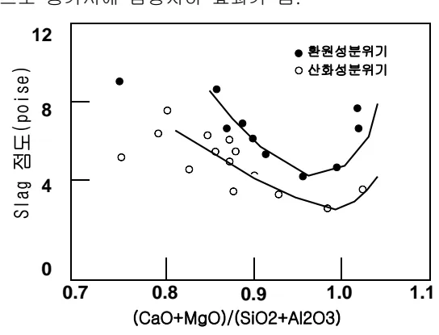

그림. 고로 Slag의 점도에 미치는 C/S의 영향 (1450°C)

### 6.4.5 SLAG 성분과 점도의 관계

안정된 노황을 유지하기 위해 고로 Slag는 물리성상과 화학성분에서 고려되어야 하며, Slag 특성, 고탈류 능력, 낮은 용해온도와 낮은 점도 등에 심각한 영향을 미치지 않는 범위내에서의 Slag 성분 조정이 필요하고, 이것은 전체 Slag 성분의 95%를 차지하는 CaO, MgO, SiO₂와 Al₂O₃의 주요성분의 Balance에 의해 결정된다.

Slag 성분에 의해 결정되는 Slag 구조는 점도에 커다란 영향을 미치며, Alumino-Silicates를 포함하는 Slag는 Al-O와 Si-O를 구성한 3차원 Net-Work가 용액 상태에서도 견디기 때문에 점도가 높다. 염기성 산화물(CaO, MgO)의 첨가는 이러한 3차원 Net-Work를 유동성이 좋은 Silica 4단체로 분리함으로써 점성을 개선한다.

### 6.4.6 Slag 성분에 따른 점도 및 임계온도 예측

정상 및 비정상조업 (정기수리, 노벽보수, 냉입 등)시 채취한 실제 고로 Slag 43EA에 대한 점도실험

<!-- 페이지번호: 7, 파일명: Slag 염기도 및 유동성 관리기준 -->

결과를 바탕으로 다음과 같이 각 조성에서의 임계온도 및 1,400°C에서의 점도를 예측하여 최적 Slag 조성을 설계할 수 있는 Guidance Model을 제시하였다.

이에 따라, 정상조업시 염기도 등 Slag 성상 조성을 위한 부원료 사용시 이 Model을 참고로 하여 부원료 사용량 결정 및 비정상 조업시 Slag 유동성 확보를 위한 참고자료로 활용할 수 있다.

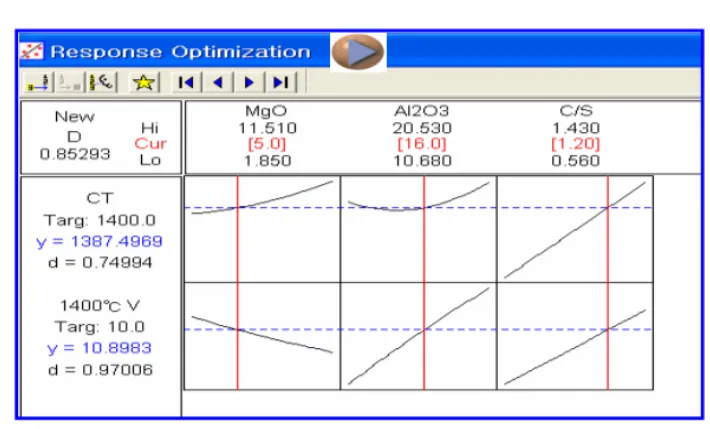

### 6.4.7 Slag 성분에 따른 염기도 상한 관리기준

- 정상 Al₂O₃ 범위에서의 염기도 상한기준

(1) MgO 4.0%

관리기준 : 점도 12Poise 이하 (1,400°C), C.T(임계온도) 1,400°C 이하

<!-- 페이지번호: 8, 파일명: Slag 염기도 및 유동성 관리기준 -->

(2) MgO 4.2%

관리기준 : 점도 12Poise 이하 (1,400℃), C.T(임계온도) 1,400℃ 이하

MgO 4.2% 염기도 vs 점도, C.T

Y-axis: 점도 (Poise), X-axis: 염기도 (-), Secondary Y-axis: C.T (°C)

Legend: A203 15.0%, A203 15.1%, A203 15.2%, A203 15.3%, A203 15.4%, A203 15.5%, A203 15.6%
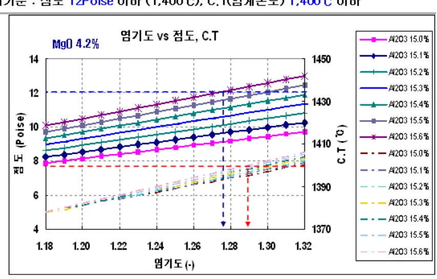

(3) MgO 4.4%

관리기준 : 점도 12Poise 이하 (1,400℃), C.T(임계온도) 1,400℃ 이하

MgO 4.4% 염기도 vs 점도, C.T

Y-axis: 점도 (Poise), X-axis: 염기도 (-), Secondary Y-axis: C.T (°C)

Legend: A203 15.0%, A203 15.1%, A203 15.2%, A203 15.3%, A203 15.4%, A203 15.5%, A203 15.6%
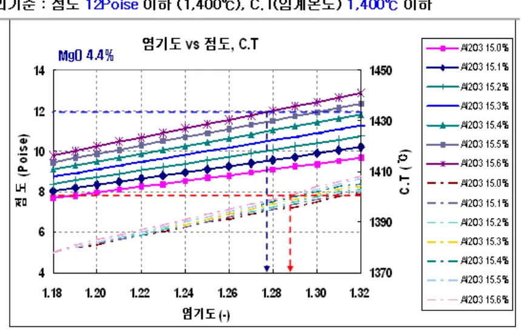

뒷 장 계속

<!-- 페이지번호: 9, 파일명: Slag 염기도 및 유동성 관리기준 -->

(4) MgO 4.6%

관리기준 : 점도 12Poise 이하 (1,400°C), C.T(임계온도) 1,400°C 이하

Figure 1: MgO 4.6% Viscosity vs Temperature, C.T.

The graph plots Viscosity (Poise) on the left axis (4 to 14) and Temperature (C.T. in °C) on the right axis (1370 to 1450) against Viscosity Ratio (염기도 (-)) on the x-axis (1.18 to 1.32).

Legend:
<ul><li>A2O3 15.0%</li><li>A2O3 15.1%</li><li>A2O3 15.2%</li><li>A2O3 15.3%</li><li>A2O3 15.4%</li><li>A2O3 15.5%</li><li>A2O3 15.6%</li><li>A2O3 15.0% (dashed line)</li><li>A2O3 15.1% (dashed line)</li><li>A2O3 15.2% (dashed line)</li><li>A2O3 15.3% (dashed line)</li><li>A2O3 15.4% (dashed line)</li><li>A2O3 15.5% (dashed line)</li><li>A2O3 15.6% (dashed line)</li></ul>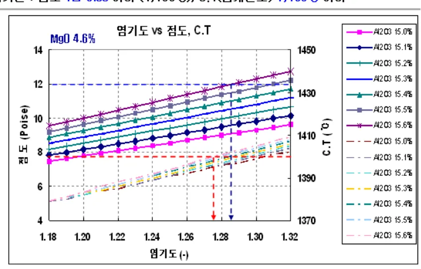

(4) MgO 4.8%

관리기준 : 점도 12Poise 이하 (1,400°C), C.T(임계온도) 1,400°C 이하

Figure 2: MgO 4.8% Viscosity vs Temperature, C.T.

The graph plots Viscosity (Poise) on the left axis (4 to 14) and Temperature (C.T. in °C) on the right axis (1370 to 1450) against Viscosity Ratio (염기도 (-)) on the x-axis (1.18 to 1.32).

Legend:
<ul><li>A2O3 15.0%</li><li>A2O3 15.1%</li><li>A2O3 15.2%</li><li>A2O3 15.3%</li><li>A2O3 15.4%</li><li>A2O3 15.5%</li><li>A2O3 15.6%</li><li>A2O3 15.0% (dashed line)</li><li>A2O3 15.1% (dashed line)</li><li>A2O3 15.2% (dashed line)</li><li>A2O3 15.3% (dashed line)</li><li>A2O3 15.4% (dashed line)</li><li>A2O3 15.5% (dashed line)</li><li>A2O3 15.6% (dashed line)</li></ul>

<!-- 페이지번호: 10, 파일명: Slag 염기도 및 유동성 관리기준 -->

- 고 Al2O3 범위에서의 염기도 상한 기준

(1) MgO 4.0%

관리기준 : 점도 12Poise 이하 (1,400°C), C.T(임계온도) 1,400°C 이하

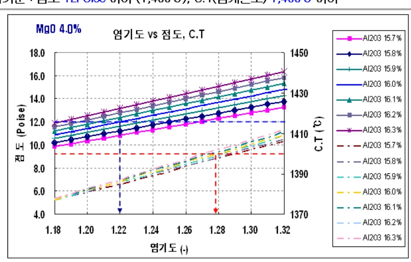

(2) MgO 4.2%

관리기준 : 점도 12Poise 이하 (1,400°C), C.T(임계온도) 1,400°C 이하

<!-- 페이지번호: 11, 파일명: Slag 염기도 및 유동성 관리기준 -->

(3) MgO 4.4%

관리기준 : 점도 12Poise 이하 (1,400°C), C.T(임계온도) 1,400°C 이하

MgO 4.4% 염기도 vs 점도, C.T

Left Y-axis: 점도 (Poise)

Right Y-axis: C.T (°C)

X-axis: 염기도 (-)

Legend (Al2O3 percentages): 15.7%, 15.8%, 15.9%, 16.0%, 16.1%, 16.2%, 16.3%, 15.7%, 15.8%, 15.9%, 16.0%, 16.1%, 16.2%, 16.3%
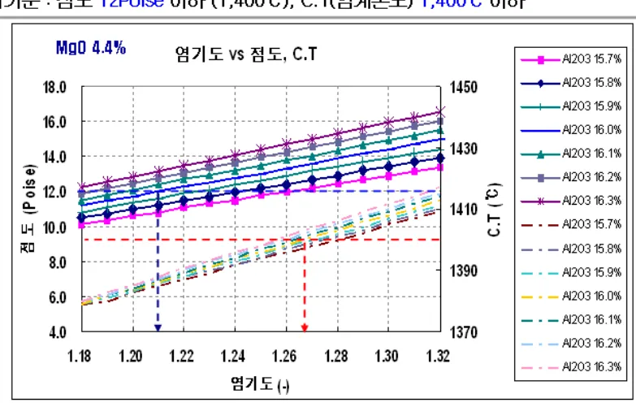

(4) MgO 4.6%

관리기준 : 점도 12Poise 이하 (1,400°C), C.T(임계온도) 1,400°C 이하

MgO 4.6% 염기도 vs 점도, C.T

Left Y-axis: 점도 (Poise)

Right Y-axis: C.T (°C)

X-axis: 염기도 (-)

Legend (Al2O3 percentages): 15.7%, 15.8%, 15.9%, 16.0%, 16.1%, 16.2%, 16.3%, 15.7%, 15.8%, 15.9%, 16.0%, 16.1%, 16.2%, 16.3%

뒷 장 계속

<!-- 페이지번호: 12, 파일명: Slag 염기도 및 유동성 관리기준 -->

(5) MgO 4.8%

관리기준 : 점도 12Poise 이하 (1,400°C), C.T(임계온도) 1,400°C 이하

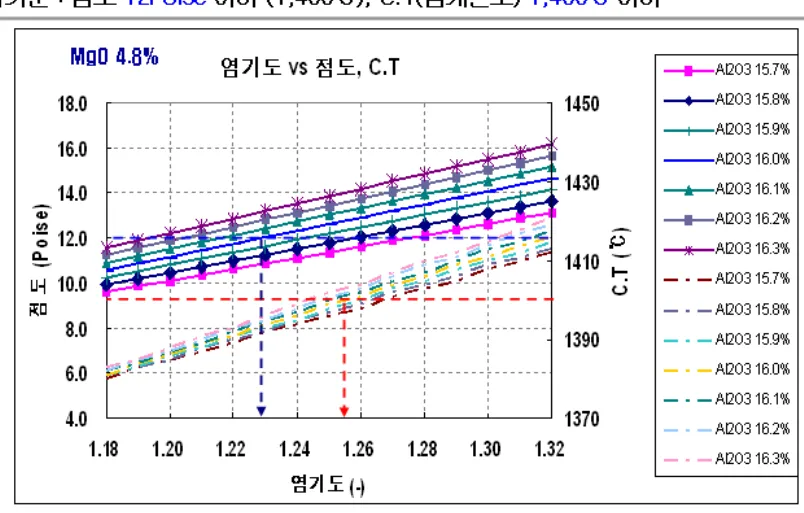

### 6.4.8 Slag 성분과 점도의 관계

안정된 노화를 유지하기 위해 고로 Slag는 조성과 물리적인 면에서 공히 동질성을 나타내야 하며, Slag 특성, 고탈류 능력, 낮은 용해온도와 낮은 점도등에 심각한 영향을 미치지 않는 범위내에서의 Slag 성분变动이 요구되어지고, 이것은 전체 Slag 성분의 95%를 차지하는 CaO, MgO, SiO2와 Al2O3의 주요성분의 Balance에 의해 결정된다.

Slag 성분에 의해 결정되는 Slag 구조는 점도에 커다란 영향을 미치며, Alumino-Silicates를 포함하는 Slag 는 Al-O 와 Si-O를 구성한 커다란 3차원 그물이 심지어는 용액 상태에서도 견디기 때문에 점도가 높다. 영기성 산화물(CaO, MgO)의 첨가는 이러한 3차원 그물을 유동성이 좋은 Silica 4단체로 분리함으로써 점도를 줄일 수 있다.

뒷 장 계속

<!-- 페이지번호: 13, 파일명: Slag 염기도 및 유동성 관리기준 -->
[온도와 점도의 관계]

<table><thead><tr><th></th><th colspan="7">온도</th></tr><tr><th></th><th>1300</th><th>1350</th><th>1400</th><th>1450</th><th>1500</th><th>1550</th><th>1600</th></tr></thead><tbody><tr><th>A</th><td>< 7.4</td><td>< 5.1</td><td>< 3.5</td><td>< 2.6</td><td>< 1.9</td><td>< 1.5</td><td>< 1.2</td></tr><tr><th>B</th><td>7.4 ~ 18.5</td><td>5.1 ~ 11.9</td><td>3.5 ~ 7.4</td><td>2.6 ~ 5.1</td><td>1.9 ~ 3.6</td><td>1.5 ~ 2.7</td><td>1.2 ~ 2.2</td></tr><tr><th>C</th><td>18.5 ~ 38.0</td><td>11.9 ~ 22.0</td><td>7.4 ~ 13.0</td><td>5.1 ~ 18.2</td><td>3.6 ~ 5.8</td><td>2.7 ~ 4.3</td><td>2.2 ~ 3.4</td></tr><tr><th>D</th><td>38.0 ~ 81.0</td><td>22.0 ~ 45.0</td><td>13.0 ~ 27.0</td><td>8.7 ~ 17.0</td><td>5.8 ~ 11.4</td><td>4.3 ~ 8.0</td><td>3.4 ~ 6.2</td></tr><tr><th>E</th><td>81.0 ~ 210.0</td><td>45.0 ~ 115.0</td><td>27.0 ~ 64.0</td><td>17.0 ~ 39.0</td><td>11.4 ~ 26.0</td><td>8.0 ~ 18.0</td><td>6.2 ~ 14.0</td></tr><tr><th>F</th><td>210.0 ~ 720.0</td><td>115.0 ~ 340.0</td><td>64.0 ~ 180.0</td><td>39.0 ~ 108.0</td><td>26.0 ~ 66.0</td><td>18.0 ~ 48.0</td><td>14.0 ~ 36.0</td></tr><tr><th>G</th><td>> 720</td><td>> 340</td><td>> 180</td><td>> 108</td><td>> 66</td><td>> 48</td><td>> 36</td></tr></tbody></table>
<a href="components/TP-030-060-020 Slag 염기도 및 유동성 관리기준(Rev.13)_0900bf4ba7a44070_usr0000bf4b95f9e446_p013_table_01.png">Table snapshot</a>

A graph illustrating the relationship between Viscosity (Poise) on the Y-axis and Temperature (°C) on the X-axis. The Y-axis ranges from 2 to 6 Poise, and the X-axis ranges from 1300 to 1600 °C. The graph displays seven straight lines labeled A through G, showing that viscosity decreases as temperature increases.

<!-- 페이지번호: 14, 파일명: Slag 염기도 및 유동성 관리기준 -->
[Slag 용해온도와 점도범위]

Al2O3(%)---- 8%

<table><thead><tr><th>MgO(%)</th><th>0%</th><th>2%</th><th>4%</th><th>6%</th><th>8%</th><th>10%</th><th>12%</th><th>14%</th><th>16%</th><th>18%</th></tr></thead><tbody><tr><td>CaO(%)-- 28%</td><td>-</td><td>-</td><td>-</td><td>-</td><td>1295D</td><td>1309D</td><td>1319C</td><td>1328C</td><td>1344B</td><td>1363B</td></tr><tr><td>30%</td><td>-</td><td>-</td><td>1311E</td><td>1296D</td><td>1293D</td><td>1313D</td><td>1326C</td><td>1337C</td><td>1348B</td><td>1368B</td></tr><tr><td>32%</td><td>1373F</td><td>1357E</td><td>1332E</td><td>1315D</td><td>1296D</td><td>1315C</td><td>1334C</td><td>1356B</td><td>1369B</td><td>1388B</td></tr><tr><td>34%</td><td>1393E</td><td>1373E</td><td>1356D</td><td>1323D</td><td>1304C</td><td>1334C</td><td>1358B</td><td>1379B</td><td>1390B</td><td>1421B</td></tr><tr><td>36%</td><td>1413E</td><td>1391D</td><td>1369D</td><td>1337C</td><td>1320C</td><td>1355B</td><td>1382B</td><td>1402B</td><td>1416B</td><td>1476B</td></tr><tr><td>38%</td><td>1434E</td><td>1398D</td><td>1370D</td><td>1348C</td><td>1334C</td><td>1377B</td><td>1405B</td><td>1432B</td><td>1468B</td><td>-</td></tr><tr><td>40%</td><td>1430D</td><td>1400D</td><td>1363C</td><td>1346C</td><td>1350B</td><td>1402B</td><td>1437B</td><td>1458B</td><td>-</td><td>-</td></tr><tr><td>42%</td><td>1429D</td><td>1392C</td><td>1352C</td><td>1357B</td><td>1369B</td><td>1441B</td><td>-</td><td>-</td><td>-</td><td>-</td></tr><tr><td>44%</td><td>1415D</td><td>1369C</td><td>1348C</td><td>1389B</td><td>1396B</td><td>-</td><td>-</td><td>-</td><td>-</td><td>-</td></tr><tr><td>46%</td><td>1382C</td><td>1348C</td><td>1397B</td><td>1474B</td><td>-</td><td>-</td><td>-</td><td>-</td><td>-</td><td>-</td></tr><tr><td>48%</td><td>1360C</td><td>1413B</td><td>-</td><td>-</td><td>-</td><td>-</td><td>-</td><td>-</td><td>-</td><td>-</td></tr></tbody></table>
<a href="components/TP-030-060-020 Slag 염기도 및 유동성 관리기준(Rev.13)_0900bf4ba7a44070_usr0000bf4b95f9e446_p014_table_01.png">Table snapshot</a>

Al2O3(%)---- 9%

<table><thead><tr><th>MgO(%)</th><th>0%</th><th>2%</th><th>4%</th><th>6%</th><th>8%</th><th>10%</th><th>12%</th><th>14%</th><th>16%</th><th>18%</th></tr></thead><tbody><tr><td>CaO(%)-- 28%</td><td>-</td><td>-</td><td>-</td><td>-</td><td>1291D</td><td>1306D</td><td>1317C</td><td>1328C</td><td>1344B</td><td>1363B</td></tr><tr><td>30%</td><td>-</td><td>-</td><td>1305E</td><td>1291D</td><td>1290D</td><td>1308C</td><td>1324C</td><td>1337B</td><td>1348B</td><td>1365B</td></tr><tr><td>32%</td><td>1368F</td><td>1349E</td><td>1325E</td><td>1304D</td><td>1293D</td><td>1314C</td><td>1338C</td><td>1356B</td><td>1364B</td><td>1386B</td></tr><tr><td>34%</td><td>1390E</td><td>1367E</td><td>1347D</td><td>1313D</td><td>1307C</td><td>1335C</td><td>1360B</td><td>1376B</td><td>1388B</td><td>1423B</td></tr><tr><td>36%</td><td>1408E</td><td>1385D</td><td>1356D</td><td>1329C</td><td>1326C</td><td>1355B</td><td>1382B</td><td>1397B</td><td>1417B</td><td>1490B</td></tr><tr><td>38%</td><td>1418E</td><td>1386D</td><td>1354C</td><td>1337C</td><td>1344C</td><td>1375B</td><td>1400B</td><td>1435B</td><td>1473B</td><td>-</td></tr><tr><td>40%</td><td>1421D</td><td>1383D</td><td>1345C</td><td>1340C</td><td>1366B</td><td>1399B</td><td>1442B</td><td>1489B</td><td>-</td><td>-</td></tr><tr><td>42%</td><td>1414D</td><td>1372C</td><td>1337C</td><td>1358B</td><td>1390B</td><td>1446B</td><td>-</td><td>-</td><td>-</td><td>-</td></tr><tr><td>44%</td><td>1392C</td><td>1347C</td><td>1342B</td><td>1394B</td><td>1434B</td><td>-</td><td>-</td><td>-</td><td>-</td><td>-</td></tr><tr><td>46%</td><td>1357C</td><td>1342B</td><td>1409B</td><td>1495B</td><td>-</td><td>-</td><td>-</td><td>-</td><td>-</td><td>-</td></tr><tr><td>48%</td><td>1358C</td><td>1434B</td><td>-</td><td>-</td><td>-</td><td>-</td><td>-</td><td>-</td><td>-</td><td>-</td></tr></tbody></table>
<a href="components/TP-030-060-020 Slag 염기도 및 유동성 관리기준(Rev.13)_0900bf4ba7a44070_usr0000bf4b95f9e446_p014_table_02.png">Table snapshot</a>

Al2O3(%)---- 10%

<table><thead><tr><th>MgO(%)</th><th>0%</th><th>2%</th><th>4%</th><th>6%</th><th>8%</th><th>10%</th><th>12%</th><th>14%</th><th>16%</th><th>18%</th></tr></thead><tbody><tr><td>CaO(%)-- 28%</td><td>-</td><td>-</td><td>-</td><td>-</td><td>-</td><td>-</td><td>1314C</td><td>1327C</td><td>1343B</td><td>1366B</td></tr><tr><td>30%</td><td>-</td><td>-</td><td>-</td><td>-</td><td>-</td><td>1301C</td><td>1321C</td><td>1336B</td><td>1351B</td><td>1367B</td></tr><tr><td>32%</td><td>-</td><td>-</td><td>-</td><td>1293D</td><td>1290D</td><td>1314C</td><td>1339C</td><td>1355B</td><td>1366B</td><td>1395B</td></tr><tr><td>34%</td><td>1384E</td><td>1361E</td><td>1334D</td><td>1305D</td><td>1310C</td><td>1336C</td><td>1360B</td><td>1374B</td><td>1391B</td><td>1433B</td></tr><tr><td>36%</td><td>1399E</td><td>1373D</td><td>1342D</td><td>1323C</td><td>1333C</td><td>1354B</td><td>1380B</td><td>1398B</td><td>1426B</td><td>1395B</td></tr><tr><td>38%</td><td>1410E</td><td>1372D</td><td>1339C</td><td>1330C</td><td>1355C</td><td>1374B</td><td>1399B</td><td>1440B</td><td>1480B</td><td>-</td></tr><tr><td>40%</td><td>1407D</td><td>1367D</td><td>1331C</td><td>1340C</td><td>1383B</td><td>1402B</td><td>1452B</td><td>1496B</td><td>-</td><td>-</td></tr><tr><td>42%</td><td>1397D</td><td>1354C</td><td>1332C</td><td>1358B</td><td>1410B</td><td>1452B</td><td>1497B</td><td>-</td><td>-</td><td>-</td></tr><tr><td>44%</td><td>1369C</td><td>1332C</td><td>1345B</td><td>1394B</td><td>1466B</td><td>1528B</td><td>-</td><td>-</td><td>-</td><td>-</td></tr><tr><td>46%</td><td>1338C</td><td>1347C</td><td>1428B</td><td>1495B</td><td>-</td><td>-</td><td>-</td><td>-</td><td>-</td><td>-</td></tr><tr><td>48%</td><td>1371C</td><td>1451B</td><td>-</td><td>-</td><td>-</td><td>-</td><td>-</td><td>-</td><td>-</td><td>-</td></tr></tbody></table>
<a href="components/TP-030-060-020 Slag 염기도 및 유동성 관리기준(Rev.13)_0900bf4ba7a44070_usr0000bf4b95f9e446_p014_table_03.png">Table snapshot</a>

<!-- 페이지번호: 15, 파일명: Slag 염기도 및 유동성 관리기준 -->

Al2O3(%)---- 11%

<table><thead><tr><th>MgO(%)</th><th>0%</th><th>2%</th><th>4%</th><th>6%</th><th>8%</th><th>10%</th><th>12%</th><th>14%</th><th>16%</th><th>18%</th></tr></thead><tbody><tr><th>CaO(%)</th><td>28%</td><td>-</td><td>-</td><td>-</td><td>-</td><td>-</td><td>1304C</td><td>1324C</td><td>1344B</td><td>1375B</td></tr><tr><th></th><td>30%</td><td>-</td><td>-</td><td>-</td><td>-</td><td>1293C</td><td>1316C</td><td>1334B</td><td>1362B</td><td>1384B</td></tr><tr><th></th><td>32%</td><td>-</td><td>1305D</td><td>1281D</td><td>1285C</td><td>1313C</td><td>1337C</td><td>1358B</td><td>1381B</td><td>1418B</td></tr><tr><th></th><td>34%</td><td>1371E</td><td>1348E</td><td>1319D</td><td>1297D</td><td>1309C</td><td>1337C</td><td>1362B</td><td>1380B</td><td>1403B</td></tr><tr><th></th><td>36%</td><td>1382E</td><td>1357D</td><td>1328D</td><td>1318C</td><td>1336C</td><td>1358B</td><td>1386B</td><td>1404B</td><td>1440B</td></tr><tr><th></th><td>38%</td><td>1392D</td><td>1356D</td><td>1328C</td><td>1330C</td><td>1364B</td><td>1382B</td><td>1406B</td><td>1448B</td><td>1491B</td></tr><tr><th></th><td>40%</td><td>1388D</td><td>1354D</td><td>1329C</td><td>1350C</td><td>1395B</td><td>1414B</td><td>1458B</td><td>1501B</td><td>-</td></tr><tr><th></th><td>42%</td><td>1383D</td><td>1345C</td><td>1344C</td><td>1380B</td><td>1423B</td><td>1463B</td><td>1498B</td><td>-</td><td>-</td></tr><tr><th></th><td>44%</td><td>1357C</td><td>1338C</td><td>1366B</td><td>1425B</td><td>1481B</td><td>-</td><td>-</td><td>-</td><td>-</td></tr><tr><th></th><td>46%</td><td>1341C</td><td>1370C</td><td>1457B</td><td>-</td><td>-</td><td>-</td><td>-</td><td>-</td><td>-</td></tr><tr><th></th><td>48%</td><td>1401C</td><td>1478B</td><td>-</td><td>-</td><td>-</td><td>-</td><td>-</td><td>-</td><td>-</td></tr></tbody></table>
<a href="components/TP-030-060-020 Slag 염기도 및 유동성 관리기준(Rev.13)_0900bf4ba7a44070_usr0000bf4b95f9e446_p015_table_01.png">Table snapshot</a>

Al2O3(%)---- 12%

<table><thead><tr><th>MgO(%)</th><th>0%</th><th>2%</th><th>4%</th><th>6%</th><th>8%</th><th>10%</th><th>12%</th><th>14%</th><th>16%</th><th>18%</th></tr></thead><tbody><tr><th>CaO(%)</th><td>28%</td><td>-</td><td>-</td><td>-</td><td>-</td><td>-</td><td>1295C</td><td>1320C</td><td>1346B</td><td>1387B</td></tr><tr><th></th><td>30%</td><td>-</td><td>-</td><td>-</td><td>1265D</td><td>1289C</td><td>1313C</td><td>1331B</td><td>1376B</td><td>1407B</td></tr><tr><th></th><td>32%</td><td>-</td><td>-</td><td>1290D</td><td>1268D</td><td>1281C</td><td>1314C</td><td>1333B</td><td>1364B</td><td>1397B</td></tr><tr><th></th><td>34%</td><td>1356E</td><td>1334E</td><td>1303D</td><td>1287D</td><td>1308C</td><td>1339C</td><td>1366B</td><td>1388B</td><td>1417B</td></tr><tr><th></th><td>36%</td><td>1366E</td><td>1341D</td><td>1317D</td><td>1317D</td><td>1342C</td><td>1365B</td><td>1390B</td><td>1414B</td><td>1453B</td></tr><tr><th></th><td>38%</td><td>1374D</td><td>1341D</td><td>1322C</td><td>1335C</td><td>1377B</td><td>1392B</td><td>1419B</td><td>1454B</td><td>1503B</td></tr><tr><th></th><td>40%</td><td>1372D</td><td>1341D</td><td>1332C</td><td>1367C</td><td>1409B</td><td>1428B</td><td>1457B</td><td>1503B</td><td>-</td></tr><tr><th></th><td>42%</td><td>1367D</td><td>1341C</td><td>1363C</td><td>1399B</td><td>1437B</td><td>1469B</td><td>1499B</td><td>-</td><td>-</td></tr><tr><th></th><td>44%</td><td>1349C</td><td>1359C</td><td>1398B</td><td>1446B</td><td>1493B</td><td>-</td><td>-</td><td>-</td><td>-</td></tr><tr><th></th><td>46%</td><td>1361C</td><td>1403C</td><td>1477B</td><td>-</td><td>-</td><td>-</td><td>-</td><td>-</td><td>-</td></tr><tr><th></th><td>48%</td><td>1437C</td><td>1496B</td><td>-</td><td>-</td><td>-</td><td>-</td><td>-</td><td>-</td><td>-</td></tr></tbody></table>
<a href="components/TP-030-060-020 Slag 염기도 및 유동성 관리기준(Rev.13)_0900bf4ba7a44070_usr0000bf4b95f9e446_p015_table_02.png">Table snapshot</a>

Al2O3(%)---- 13%

<table><thead><tr><th>MgO(%)</th><th>0%</th><th>2%</th><th>4%</th><th>6%</th><th>8%</th><th>10%</th><th>12%</th><th>14%</th><th>16%</th><th>18%</th></tr></thead><tbody><tr><th>CaO(%)</th><td>28%</td><td>-</td><td>-</td><td>-</td><td>-</td><td>-</td><td>1289C</td><td>1316C</td><td>1353B</td><td>1402B</td></tr><tr><th></th><td>30%</td><td>-</td><td>-</td><td>-</td><td>1258D</td><td>1287C</td><td>1310C</td><td>1334B</td><td>1390B</td><td>1430B</td></tr><tr><th></th><td>32%</td><td>-</td><td>1298E</td><td>1276D</td><td>1258D</td><td>1280C</td><td>1314C</td><td>1335B</td><td>1371B</td><td>1410B</td></tr><tr><th></th><td>34%</td><td>1341E</td><td>1318D</td><td>1289D</td><td>1282C</td><td>1311C</td><td>1344B</td><td>1371B</td><td>1396B</td><td>1429B</td></tr><tr><th></th><td>36%</td><td>1349E</td><td>1326D</td><td>1308D</td><td>1317C</td><td>1350C</td><td>1373B</td><td>1396B</td><td>1425B</td><td>1462B</td></tr><tr><th></th><td>38%</td><td>1355D</td><td>1327D</td><td>1318C</td><td>1344C</td><td>1388B</td><td>1402B</td><td>1425B</td><td>1456B</td><td>-</td></tr><tr><th></th><td>40%</td><td>1356D</td><td>1333C</td><td>1342C</td><td>1384B</td><td>1420B</td><td>1436B</td><td>1456B</td><td>-</td><td>-</td></tr><tr><th></th><td>42%</td><td>1354D</td><td>1347C</td><td>1383C</td><td>1414B</td><td>144B</td><td>1470B</td><td>-</td><td>-</td><td>-</td></tr><tr><th></th><td>44%</td><td>1351C</td><td>1378C</td><td>1421B</td><td>1451B</td><td>-</td><td>-</td><td>-</td><td>-</td><td>-</td></tr><tr><th></th><td>46%</td><td>1381C</td><td>1425B</td><td>-</td><td>-</td><td>-</td><td>-</td><td>-</td><td>-</td><td>-</td></tr><tr><th></th><td>48%</td><td>1465C</td><td>-</td><td>-</td><td>-</td><td>-</td><td>-</td><td>-</td><td>-</td><td>-</td></tr></tbody></table>
<a href="components/TP-030-060-020 Slag 염기도 및 유동성 관리기준(Rev.13)_0900bf4ba7a44070_usr0000bf4b95f9e446_p015_table_03.png">Table snapshot</a>

<!-- 페이지번호: 16, 파일명: Slag 염기도 및 유동성 관리기준 -->
<table><thead><tr><th colspan="2"></th><th>0%</th><th>2%</th><th>4%</th><th>6%</th><th>8%</th><th>10%</th><th>12%</th><th>14%</th><th>16%</th></tr></thead><tbody><tr><th rowspan="2">Al2O3(%)</th><th>---</th><th colspan="9">17%</th></tr><tr><th>MgO(%)</th><th colspan="9"></th></tr><tr><th rowspan="10">CaO(%)</th><th>28%</th><td>---</td><td>---</td><td>---</td><td>---</td><td>---</td><td>1281C</td><td>1342C</td><td>1384B</td><td>1434B</td></tr><tr><th>30%</th><td>---</td><td>---</td><td>---</td><td>---</td><td>1272C</td><td>1302C</td><td>1364B</td><td>1419B</td><td>1470B</td></tr><tr><th>32%</th><td>---</td><td>---</td><td>---</td><td>---</td><td>1297C</td><td>1340C</td><td>1401B</td><td>1440B</td><td>1483B</td></tr><tr><th>34%</th><td>---</td><td>---</td><td>---</td><td>1315C</td><td>1350C</td><td>1390B</td><td>1427B</td><td>1457B</td><td>1492B</td></tr><tr><th>36%</th><td>1313E</td><td>1292D</td><td>1324C</td><td>1359C</td><td>1398B</td><td>1420B</td><td>1441B</td><td>1472B</td><td>1531B</td></tr><tr><th>38%</th><td>1316D</td><td>1339D</td><td>1372C</td><td>1410C</td><td>1431B</td><td>1439B</td><td>1453B</td><td>1492B</td><td>---</td></tr><tr><th>40%</th><td>1344D</td><td>1382D</td><td>1423C</td><td>1442B</td><td>1447B</td><td>1449B</td><td>1472B</td><td>---</td><td>---</td></tr><tr><th>42%</th><td>1389C</td><td>1429C</td><td>1451B</td><td>1464B</td><td>1472B</td><td>---</td><td>---</td><td>---</td><td>---</td></tr><tr><th>44%</th><td>1435C</td><td>1463C</td><td>1490B</td><td>---</td><td>---</td><td>---</td><td>---</td><td>---</td><td>---</td></tr><tr><th>46%</th><td>1486C</td><td>1516B</td><td>---</td><td>---</td><td>---</td><td>---</td><td>---</td><td>---</td><td>---</td></tr><tr><th>48%</th><td>---</td><td>---</td><td>---</td><td>---</td><td>---</td><td>---</td><td>---</td><td>---</td><td>---</td></tr></tbody></table>
<a href="components/TP-030-060-020 Slag 염기도 및 유동성 관리기준(Rev.13)_0900bf4ba7a44070_usr0000bf4b95f9e446_p016_table_01.png">Table snapshot</a>

<table><thead><tr><th colspan="2"></th><th>0%</th><th>2%</th><th>4%</th><th>6%</th><th>8%</th><th>10%</th><th>12%</th><th>14%</th><th>16%</th></tr></thead><tbody><tr><th rowspan="2">Al2O3(%)</th><th>---</th><th colspan="9">18%</th></tr><tr><th>MgO(%)</th><th colspan="9"></th></tr><tr><th rowspan="10">CaO(%)</th><th>28%</th><td>---</td><td>---</td><td>---</td><td>---</td><td>1276D</td><td>1288C</td><td>1365C</td><td>1417B</td><td>1478B</td></tr><tr><th>30%</th><td>---</td><td>---</td><td>---</td><td>---</td><td>1279C</td><td>1311C</td><td>1389B</td><td>1443B</td><td>1492B</td></tr><tr><th>32%</th><td>---</td><td>---</td><td>---</td><td>---</td><td>1308C</td><td>1352C</td><td>1420B</td><td>1461B</td><td>1503B</td></tr><tr><th>34%</th><td>---</td><td>---</td><td>1287D</td><td>1329C</td><td>1362C</td><td>1402B</td><td>1443B</td><td>1474B</td><td>1510B</td></tr><tr><th>36%</th><td>1308E</td><td>1298D</td><td>1343C</td><td>1376C</td><td>1409B</td><td>1431B</td><td>1452B</td><td>1484B</td><td>---</td></tr><tr><th>38%</th><td>1317D</td><td>1357D</td><td>1397C</td><td>1423C</td><td>1437B</td><td>1442B</td><td>1460B</td><td>---</td><td>---</td></tr><tr><th>40%</th><td>1361D</td><td>1409C</td><td>1438C</td><td>1453B</td><td>1452B</td><td>1452B</td><td>1473B</td><td>---</td><td>---</td></tr><tr><th>42%</th><td>1416C</td><td>1450C</td><td>1467B</td><td>1473B</td><td>1476B</td><td>---</td><td>---</td><td>---</td><td>---</td></tr><tr><th>44%</th><td>1462C</td><td>1484C</td><td>1515B</td><td>---</td><td>---</td><td>---</td><td>---</td><td>---</td><td>---</td></tr><tr><th>46%</th><td>1506C</td><td>---</td><td>---</td><td>---</td><td>---</td><td>---</td><td>---</td><td>---</td><td>---</td></tr><tr><th>48%</th><td>---</td><td>---</td><td>---</td><td>---</td><td>---</td><td>---</td><td>---</td><td>---</td><td>---</td></tr></tbody></table>
<a href="components/TP-030-060-020 Slag 염기도 및 유동성 관리기준(Rev.13)_0900bf4ba7a44070_usr0000bf4b95f9e446_p016_table_02.png">Table snapshot</a>

<table><thead><tr><th colspan="2"></th><th>0%</th><th>2%</th><th>4%</th><th>6%</th><th>8%</th><th>10%</th><th>12%</th></tr></thead><tbody><tr><th rowspan="2">Al2O3(%)</th><th>---</th><th colspan="7">19%</th></tr><tr><th>MgO(%)</th><th colspan="7"></th></tr><tr><th rowspan="10">CaO(%)</th><th>28%</th><td>---</td><td>---</td><td>---</td><td>---</td><td>1283D</td><td>1295C</td><td>1387C</td></tr><tr><th>30%</th><td>---</td><td>---</td><td>---</td><td>---</td><td>1285C</td><td>1319C</td><td>1413B</td></tr><tr><th>32%</th><td>---</td><td>---</td><td>---</td><td>---</td><td>1321C</td><td>1369C</td><td>1439B</td></tr><tr><th>34%</th><td>---</td><td>---</td><td>1302D</td><td>1345C</td><td>1375C</td><td>1416B</td><td>1457B</td></tr><tr><th>36%</th><td>1302E</td><td>1314D</td><td>1364C</td><td>1393C</td><td>1418B</td><td>1439B</td><td>1462B</td></tr><tr><th>38%</th><td>1323D</td><td>1379D</td><td>1417C</td><td>1437C</td><td>1444B</td><td>1446B</td><td>1463B</td></tr><tr><th>40%</th><td>1384D</td><td>1433C</td><td>1454C</td><td>1465B</td><td>1457B</td><td>1452B</td><td>1469B</td></tr><tr><th>42%</th><td>1443C</td><td>1475C</td><td>1484B</td><td>1479B</td><td>---</td><td>---</td><td>---</td></tr><tr><th>44%</th><td>1487C</td><td>1503C</td><td>---</td><td>---</td><td>---</td><td>---</td><td>---</td></tr><tr><th>46%</th><td>1518C</td><td>---</td><td>---</td><td>---</td><td>---</td><td>---</td><td>---</td></tr><tr><th>48%</th><td>---</td><td>---</td><td>---</td><td>---</td><td>---</td><td>---</td><td>---</td></tr></tbody></table>
<a href="components/TP-030-060-020 Slag 염기도 및 유동성 관리기준(Rev.13)_0900bf4ba7a44070_usr0000bf4b95f9e446_p016_table_03.png">Table snapshot</a>

<!-- 페이지번호: 17, 파일명: Slag 염기도 및 유동성 관리기준 -->

Al2O3(%)---- 20%

<table><thead><tr><th></th><th>0%</th><th>2%</th><th>4%</th><th>6%</th><th>8%</th><th>10%</th><th>12%</th></tr></thead><tbody><tr><th>MgO(%)</th><td></td><td></td><td></td><td></td><td></td><td></td><td></td></tr><tr><th>CaO(%)</th><td>28%</td><td>-</td><td>-</td><td>-</td><td>1296D</td><td>1319C</td><td>1414C</td></tr><tr><td></td><td>30%</td><td>-</td><td>-</td><td>-</td><td>1304C</td><td>1347C</td><td>1437B</td></tr><tr><td></td><td>32%</td><td>-</td><td>-</td><td>-</td><td>1313C</td><td>1343C</td><td>1398B</td></tr><tr><td></td><td>34%</td><td>-</td><td>1298D</td><td>1322D</td><td>1362C</td><td>1394C</td><td>1436B</td></tr><tr><td></td><td>36%</td><td>1306D</td><td>1340D</td><td>1385C</td><td>1412C</td><td>1429B</td><td>1450B</td></tr><tr><td></td><td>38%</td><td>1342D</td><td>1404D</td><td>1434C</td><td>1451C</td><td>1452B</td><td>1454B</td></tr><tr><td></td><td>40%</td><td>1411D</td><td>1453C</td><td>1468C</td><td>1472B</td><td>1460B</td><td>1452B</td></tr><tr><td></td><td>42%</td><td>1468C</td><td>1492C</td><td>1496B</td><td>1482B</td><td>1468B</td><td>1471B</td></tr><tr><td></td><td>44%</td><td>1506C</td><td>1517C</td><td>1508B</td><td>1495B</td><td>1511B</td><td>1523B</td></tr><tr><td></td><td>46%</td><td>1528C</td><td>1538B</td><td>1535B</td><td>1572B</td><td>1580B</td><td>-</td></tr><tr><td></td><td>48%</td><td>1546B</td><td>-</td><td>-</td><td>-</td><td>-</td><td>-</td></tr></tbody></table>
<a href="components/TP-030-060-020 Slag 염기도 및 유동성 관리기준(Rev.13)_0900bf4ba7a44070_usr0000bf4b95f9e446_p017_table_01.png">Table snapshot</a>

Al2O3(%)---- 21%

<table><thead><tr><th></th><th>0%</th><th>2%</th><th>4%</th><th>6%</th><th>8%</th><th>10%</th><th>12%</th></tr></thead><tbody><tr><th>MgO(%)</th><td></td><td></td><td></td><td></td><td></td><td></td><td></td></tr><tr><th>CaO(%)</th><td>28%</td><td>-</td><td>-</td><td>-</td><td>1316C</td><td>1357C</td><td>1442B</td></tr><tr><td></td><td>30%</td><td>-</td><td>-</td><td>-</td><td>1330C</td><td>1386C</td><td>1462B</td></tr><tr><td></td><td>32%</td><td>-</td><td>-</td><td>-</td><td>1331C</td><td>1375C</td><td>1433B</td></tr><tr><td></td><td>34%</td><td>-</td><td>1305D</td><td>1346D</td><td>1380C</td><td>1413C</td><td>1456B</td></tr><tr><td></td><td>36%</td><td>1319D</td><td>1367D</td><td>1403C</td><td>1428C</td><td>1441B</td><td>1465B</td></tr><tr><td></td><td>38%</td><td>1366D</td><td>1422D</td><td>1450C</td><td>1459B</td><td>1461B</td><td>1463B</td></tr><tr><td></td><td>40%</td><td>1438D</td><td>1467C</td><td>1481C</td><td>1478B</td><td>1464B</td><td>1459B</td></tr><tr><td></td><td>42%</td><td>1487D</td><td>1505C</td><td>1503B</td><td>1486B</td><td>1473B</td><td>1478B</td></tr><tr><td></td><td>44%</td><td>1521C</td><td>1530C</td><td>1515B</td><td>1508B</td><td>1511B</td><td>1516B</td></tr><tr><td></td><td>46%</td><td>1541C</td><td>1552B</td><td>1549B</td><td>1568B</td><td>1566B</td><td>-</td></tr><tr><td></td><td>48%</td><td>-</td><td>-</td><td>-</td><td>-</td><td>-</td><td>-</td></tr></tbody></table>
<a href="components/TP-030-060-020 Slag 염기도 및 유동성 관리기준(Rev.13)_0900bf4ba7a44070_usr0000bf4b95f9e446_p017_table_02.png">Table snapshot</a>

Al2O3(%)---- 22%

<table><thead><tr><th></th><th>0%</th><th>2%</th><th>4%</th><th>6%</th><th>8%</th><th>10%</th><th>12%</th></tr></thead><tbody><tr><th>MgO(%)</th><td></td><td></td><td></td><td></td><td></td><td></td><td></td></tr><tr><th>CaO(%)</th><td>28%</td><td>-</td><td>-</td><td>-</td><td>1338C</td><td>1397C</td><td>1471B</td></tr><tr><td></td><td>30%</td><td>-</td><td>-</td><td>-</td><td>1359C</td><td>1423C</td><td>1485B</td></tr><tr><td></td><td>32%</td><td>-</td><td>-</td><td>1309D</td><td>1347C</td><td>1403C</td><td>1461B</td></tr><tr><td></td><td>34%</td><td>1327E</td><td>1322D</td><td>1366D</td><td>1399C</td><td>1426C</td><td>1471B</td></tr><tr><td></td><td>36%</td><td>1336D</td><td>1390D</td><td>1423C</td><td>1443C</td><td>1449B</td><td>1479B</td></tr><tr><td></td><td>38%</td><td>1398D</td><td>1440D</td><td>1466C</td><td>1463B</td><td>1468B</td><td>1470B</td></tr><tr><td></td><td>40%</td><td>1459D</td><td>1484C</td><td>1494C</td><td>1483B</td><td>1465B</td><td>1461B</td></tr><tr><td></td><td>42%</td><td>1506C</td><td>1517C</td><td>1506B</td><td>1491B</td><td>1476B</td><td>1479B</td></tr><tr><td></td><td>44%</td><td>1535C</td><td>1544C</td><td>1521B</td><td>1510B</td><td>1504B</td><td>-</td></tr><tr><td></td><td>46%</td><td>1553C</td><td>-</td><td>-</td><td>1551B</td><td>-</td><td>-</td></tr><tr><td></td><td>48%</td><td>-</td><td>-</td><td>-</td><td>-</td><td>-</td><td>-</td></tr></tbody></table>
<a href="components/TP-030-060-020 Slag 염기도 및 유동성 관리기준(Rev.13)_0900bf4ba7a44070_usr0000bf4b95f9e446_p017_table_03.png">Table snapshot</a>

<!-- 페이지번호: 18, 파일명: Slag 염기도 및 유동성 관리기준 -->

※ POSCO 실제 고로 Slag 점도실험에 의한 Optimizer 대비 Redcar 정상 Slag 조성에서의 점도 비교

기술표준서상 비정상 Slag 성상별 용해온도

<table><thead><tr><th colspan="2">Al₂O₃ (%)</th><th colspan="10">8%</th></tr><tr><th></th><th>MgO (%)</th><th>0%</th><th>2%</th><th>4%</th><th>6%</th><th>8%</th><th>10%</th><th>12%</th><th>14%</th><th>16%</th><th></th></tr></thead><tbody><tr><td>28%</td><td>-</td><td>-</td><td>-</td><td>-</td><td>-</td><td>1253</td><td>1251</td><td>1306</td><td>1335</td><td>1371</td><td></td></tr><tr><td>30%</td><td>-</td><td>-</td><td>-</td><td>-</td><td>-</td><td>1255</td><td>1280</td><td>1327</td><td>1354</td><td>1404</td><td></td></tr><tr><td>32%</td><td>-</td><td>-</td><td>-</td><td>1258</td><td>1262</td><td>1277</td><td>1313</td><td>1357</td><td>1385</td><td>1422</td><td></td></tr><tr><td>34%</td><td>1319</td><td>1316</td><td>1295</td><td>1292</td><td>1321</td><td>1355</td><td>1387</td><td>1399</td><td>1440</td><td>1440</td><td></td></tr><tr><td>36%</td><td>1336</td><td>1309</td><td>1316</td><td>1331</td><td>1364</td><td>1384</td><td>1408</td><td>1430</td><td>1478</td><td>-</td><td></td></tr><tr><td>38%</td><td>1336</td><td>1332</td><td>1339</td><td>1364</td><td>1399</td><td>1408</td><td>1429</td><td>1466</td><td>-</td><td>-</td><td></td></tr></tbody></table><table><thead><tr><th colspan="2">Al₂O₃ (%)</th><th colspan="10">9%</th></tr><tr><th></th><th>MgO (%)</th><th>0%</th><th>2%</th><th>4%</th><th>6%</th><th>8%</th><th>10%</th><th>12%</th><th>14%</th><th>16%</th><th></th></tr></thead><tbody><tr><td>28%</td><td>-</td><td>-</td><td>-</td><td>-</td><td>-</td><td>1255</td><td>1253</td><td>1314</td><td>1349</td><td>1390</td><td></td></tr><tr><td>30%</td><td>-</td><td>-</td><td>-</td><td>-</td><td>-</td><td>1257</td><td>1285</td><td>1337</td><td>1370</td><td>1423</td><td></td></tr><tr><td>32%</td><td>-</td><td>-</td><td>1239</td><td>1263</td><td>1282</td><td>1321</td><td>1368</td><td>1400</td><td>1440</td><td>1440</td><td></td></tr><tr><td>34%</td><td>1295</td><td>1311</td><td>1283</td><td>1296</td><td>1321</td><td>1364</td><td>1398</td><td>1408</td><td>1465</td><td>-</td><td></td></tr><tr><td>36%</td><td>1328</td><td>1305</td><td>1318</td><td>1337</td><td>1373</td><td>1393</td><td>1416</td><td>1441</td><td>1494</td><td>-</td><td></td></tr><tr><td>38%</td><td>1329</td><td>1333</td><td>1346</td><td>1374</td><td>1408</td><td>1416</td><td>1435</td><td>1474</td><td>-</td><td>-</td><td></td></tr></tbody></table>
<a href="components/TP-030-060-020 Slag 염기도 및 유동성 관리기준(Rev.13)_0900bf4ba7a44070_usr0000bf4b95f9e446_p018_table_01.png">Table snapshot</a>

Al₂O₃에 따른 용해온도 화귀식 도출

CaO 36%, MgO 2%

y = 1,9741x² - 61,294x + 1775.3 R² = 0.9295

화귀식으로부터 Al₂O₃ 14~16%에서의 MgO%에 따른 용해온도 산출

POSCO 실제 고로 Slag Data → Optimizer

CT

Targ: 1400.0 y = 1405.3835 d = 0.96411

1400°C V Targ: 10.0 y = 10.9651 d = 0.96783

Redcar 화귀식 vs Optimizer 용해온도 비교

Al₂O₃ 14%, CaO 44%

Redcar 화귀식과 Optimizer로 부터 계산한 용해온도 큰 차이 발생
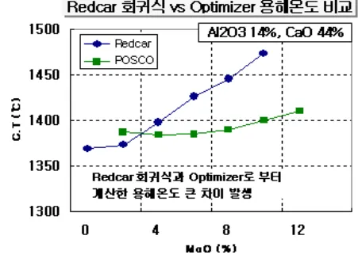

Redcar 화귀식

Al₂O₃ (%)

MgO (%)

CaO (%)
<table><thead><tr><th></th><th>0%</th><th>2%</th><th>4%</th><th>6%</th><th>8%</th><th>10%</th><th>12%</th><th>14%</th><th>16%</th></tr></thead><tbody><tr><td>28%</td><td>-</td><td>-</td><td>-</td><td>-</td><td>1253</td><td>1251</td><td>1306</td><td>1335</td><td>1371</td></tr><tr><td>30%</td><td>-</td><td>-</td><td>-</td><td>-</td><td>1255</td><td>1280</td><td>1327</td><td>1354</td><td>1404</td></tr><tr><td>32%</td><td>-</td><td>-</td><td>1258</td><td>1262</td><td>1277</td><td>1313</td><td>1357</td><td>1385</td><td>1422</td></tr><tr><td>34%</td><td>1319</td><td>1316</td><td>1285</td><td>1292</td><td>1321</td><td>1355</td><td>1387</td><td>1399</td><td>1440</td></tr><tr><td>36%</td><td>1336</td><td>1309</td><td>1316</td><td>1331</td><td>1364</td><td>1384</td><td>1408</td><td>1430</td><td>1478</td></tr><tr><td>38%</td><td>1336</td><td>1332</td><td>1339</td><td>1364</td><td>1399</td><td>1408</td><td>1429</td><td>1466</td><td>-</td></tr><tr><td>40%</td><td>1350</td><td>1353</td><td>1365</td><td>1397</td><td>1427</td><td>1435</td><td>1460</td><td>-</td><td>-</td></tr><tr><td>42%</td><td>1369</td><td>1373</td><td>1398</td><td>1426</td><td>1445</td><td>1473</td><td>-</td><td>-</td><td>-</td></tr><tr><td>44%</td><td>1380</td><td>1397</td><td>1437</td><td>1458</td><td>1521</td><td>-</td><td>-</td><td>-</td><td>-</td></tr><tr><td>46%</td><td>1408</td><td>1440</td><td>1500</td><td>1538</td><td>-</td><td>-</td><td>-</td><td>-</td><td>-</td></tr><tr><td>48%</td><td>-</td><td>-</td><td>-</td><td>-</td><td>-</td><td>-</td><td>-</td><td>-</td><td>-</td></tr></tbody></table>
<a href="components/TP-030-060-020 Slag 염기도 및 유동성 관리기준(Rev.13)_0900bf4ba7a44070_usr0000bf4b95f9e446_p018_table_02.png">Table snapshot</a>

POSCO Optimizer

Al₂O₃ (%)

MgO (%)

CaO (%)
<table><thead><tr><th></th><th>2%</th><th>4%</th><th>6%</th><th>8%</th><th>10%</th><th>11.5%</th><th>C/S</th></tr></thead><tbody><tr><td>28%</td><td>1376</td><td>1351</td><td>1331</td><td>1314</td><td>1302</td><td>1296</td><td>0.81</td></tr><tr><td>30%</td><td>1377</td><td>1356</td><td>1338</td><td>1325</td><td>1316</td><td>1312</td><td>0.87</td></tr><tr><td>32%</td><td>1379</td><td>1360</td><td>1346</td><td>1336</td><td>1330</td><td>1328</td><td>0.93</td></tr><tr><td>34%</td><td>1381</td><td>1365</td><td>1354</td><td>1347</td><td>1344</td><td>1345</td><td>0.99</td></tr><tr><td>36%</td><td>1382</td><td>1370</td><td>1362</td><td>1358</td><td>1358</td><td>1361</td><td>1.04</td></tr><tr><td>38%</td><td>1384</td><td>1374</td><td>1369</td><td>1368</td><td>1372</td><td>1377</td><td>1.10</td></tr><tr><td>40%</td><td>1385</td><td>1379</td><td>1377</td><td>1379</td><td>1386</td><td>1393</td><td>1.16</td></tr><tr><td>42%</td><td>1387</td><td>1384</td><td>1385</td><td>1390</td><td>1400</td><td>1410</td><td>1.22</td></tr><tr><td>44%</td><td>1388</td><td>1388</td><td>1393</td><td>1401</td><td>1414</td><td>1426</td><td>1.28</td></tr><tr><td>46%</td><td>1390</td><td>1393</td><td>1400</td><td>1412</td><td>1428</td><td>1442</td><td>1.33</td></tr><tr><td>48%</td><td>1392</td><td>1398</td><td>1408</td><td>1423</td><td>1442</td><td>1458</td><td>1.39</td></tr></tbody></table>
<a href="components/TP-030-060-020 Slag 염기도 및 유동성 관리기준(Rev.13)_0900bf4ba7a44070_usr0000bf4b95f9e446_p018_table_03.png">Table snapshot</a>

Al₂O₃ (%)

MgO (%)

CaO (%)
<table><thead><tr><th></th><th>0%</th><th>2%</th><th>4%</th><th>6%</th><th>8%</th><th>10%</th><th>12%</th><th>14%</th><th>16%</th></tr></thead><tbody><tr><td>28%</td><td>-</td><td>-</td><td>-</td><td>-</td><td>1255</td><td>1253</td><td>1314</td><td>1349</td><td>1390</td></tr><tr><td>30%</td><td>-</td><td>-</td><td>-</td><td>-</td><td>1257</td><td>1284</td><td>1337</td><td>1370</td><td>1423</td></tr><tr><td>32%</td><td>-</td><td>-</td><td>1239</td><td>1263</td><td>1282</td><td>1321</td><td>1368</td><td>1400</td><td>1440</td></tr><tr><td>34%</td><td>1295</td><td>1311</td><td>1283</td><td>1296</td><td>1329</td><td>1364</td><td>1398</td><td>1408</td><td>1455</td></tr><tr><td>36%</td><td>1328</td><td>1305</td><td>1318</td><td>1337</td><td>1373</td><td>1393</td><td>1416</td><td>1441</td><td>1494</td></tr><tr><td>38%</td><td>1329</td><td>1333</td><td>1348</td><td>1374</td><td>1408</td><td>1416</td><td>1435</td><td>1474</td><td>-</td></tr><tr><td>40%</td><td>1349</td><td>1358</td><td>1376</td><td>1409</td><td>1436</td><td>1440</td><td>1463</td><td>-</td><td>-</td></tr><tr><td>42%</td><td>1373</td><td>1384</td><td>1412</td><td>1437</td><td>1463</td><td>1476</td><td>-</td><td>-</td><td>-</td></tr><tr><td>44%</td><td>1390</td><td>1412</td><td>1452</td><td>1468</td><td>1530</td><td>-</td><td>-</td><td>-</td><td>-</td></tr><tr><td>46%</td><td>1423</td><td>1458</td><td>1511</td><td>1546</td><td>-</td><td>-</td><td>-</td><td>-</td><td>-</td></tr><tr><td>48%</td><td>-</td><td>-</td><td>-</td><td>-</td><td>-</td><td>-</td><td>-</td><td>-</td><td>-</td></tr></tbody></table>
<a href="components/TP-030-060-020 Slag 염기도 및 유동성 관리기준(Rev.13)_0900bf4ba7a44070_usr0000bf4b95f9e446_p018_table_04.png">Table snapshot</a>

Al₂O₃ (%)

MgO (%)

CaO (%)
<table><thead><tr><th></th><th>2%</th><th>4%</th><th>6%</th><th>8%</th><th>10%</th><th>11.5%</th><th>C/S</th></tr></thead><tbody><tr><td>28%</td><td>1336</td><td>1293</td><td>1285</td><td>1281</td><td>1281</td><td>1283</td><td>0.81</td></tr><tr><td>30%</td><td>1315</td><td>1307</td><td>1301</td><td>1300</td><td>1303</td><td>1308</td><td>0.87</td></tr><tr><td>32%</td><td>1326</td><td>1320</td><td>1318</td><td>1319</td><td>1326</td><td>1333</td><td>0.93</td></tr><tr><td>34%</td><td>1336</td><td>1333</td><td>1334</td><td>1339</td><td>1348</td><td>1358</td><td>0.99</td></tr><tr><td>36%</td><td>1346</td><td>1346</td><td>1350</td><td>1358</td><td>1370</td><td>1382</td><td>1.04</td></tr><tr><td>38%</td><td>1357</td><td>1359</td><td>1366</td><td>1377</td><td>1393</td><td>1407</td><td>1.10</td></tr><tr><td>40%</td><td>1367</td><td>1373</td><td>1383</td><td>1397</td><td>1415</td><td>1432</td><td>1.16</td></tr><tr><td>42%</td><td>1377</td><td>1386</td><td>1399</td><td>1416</td><td>1438</td><td>1457</td><td>1.22</td></tr><tr><td>44%</td><td>1387</td><td>1399</td><td>1415</td><td>1436</td><td>1460</td><td>1481</td><td>1.28</td></tr><tr><td>46%</td><td>1397</td><td>1412</td><td>1432</td><td>1455</td><td>1483</td><td>1506</td><td>1.33</td></tr><tr><td>48%</td><td>1407</td><td>1426</td><td>1448</td><td>1474</td><td>1505</td><td>1531</td><td>1.39</td></tr></tbody></table>
<a href="components/TP-030-060-020 Slag 염기도 및 유동성 관리기준(Rev.13)_0900bf4ba7a44070_usr0000bf4b95f9e446_p018_table_05.png">Table snapshot</a>

Al₂O₃ (%)

MgO (%)

CaO (%)
<table><thead><tr><th></th><th>0%</th><th>2%</th><th>4%</th><th>6%</th><th>8%</th><th>10%</th><th>12%</th><th>14%</th><th>16%</th></tr></thead><tbody><tr><td>28%</td><td>-</td><td>-</td><td>-</td><td>-</td><td>1259</td><td>1261</td><td>1327</td><td>1366</td><td>1413</td></tr><tr><td>30%</td><td>-</td><td>-</td><td>-</td><td>-</td><td>1262</td><td>1292</td><td>1350</td><td>1391</td><td>1444</td></tr><tr><td>32%</td><td>-</td><td>-</td><td>1217</td><td>1267</td><td>1290</td><td>1331</td><td>1381</td><td>1417</td><td>1459</td></tr><tr><td>34%</td><td>1267</td><td>1307</td><td>1284</td><td>1303</td><td>1338</td><td>1375</td><td>1409</td><td>1418</td><td>1472</td></tr><tr><td>36%</td><td>1321</td><td>1304</td><td>1323</td><td>1345</td><td>1382</td><td>1403</td><td>1426</td><td>1452</td><td>1512</td></tr><tr><td>38%</td><td>1326</td><td>1338</td><td>1360</td><td>1385</td><td>1418</td><td>1423</td><td>1442</td><td>1483</td><td>-</td></tr><tr><td>40%</td><td>1352</td><td>1368</td><td>1389</td><td>1421</td><td>1443</td><td>1444</td><td>1466</td><td>-</td><td>-</td></tr><tr><td>42%</td><td>1381</td><td>1397</td><td>1426</td><td>1447</td><td>1469</td><td>1478</td><td>-</td><td>-</td><td>-</td></tr><tr><td>44%</td><td>1403</td><td>1429</td><td>1466</td><td>1477</td><td>1535</td><td>-</td><td>-</td><td>-</td><td>-</td></tr><tr><td>46%</td><td>1441</td><td>1476</td><td>1521</td><td>1552</td><td>-</td><td>-</td><td>-</td><td>-</td><td>-</td></tr><tr><td>48%</td><td>-</td><td>-</td><td>-</td><td>-</td><td>-</td><td>-</td><td>-</td><td>-</td><td>-</td></tr></tbody></table>
<a href="components/TP-030-060-020 Slag 염기도 및 유동성 관리기준(Rev.13)_0900bf4ba7a44070_usr0000bf4b95f9e446_p018_table_06.png">Table snapshot</a>

Al₂O₃ (%)

MgO (%)

CaO (%)
<table><thead><tr><th></th><th>2%</th><th>4%</th><th>6%</th><th>8%</th><th>10%</th><th>11.5%</th><th>C/S</th></tr></thead><tbody><tr><td>28%</td><td>1306</td><td>1293</td><td>1285</td><td>1281</td><td>1281</td><td>1283</td><td>0.81</td></tr><tr><td>30%</td><td>1315</td><td>1307</td><td>1301</td><td>1300</td><td>1303</td><td>1308</td><td>0.87</td></tr><tr><td>32%</td><td>1326</td><td>1320</td><td>1318</td><td>1319</td><td>1326</td><td>1333</td><td>0.93</td></tr><tr><td>34%</td><td>1336</td><td>1333</td><td>1334</td><td>1339</td><td>1348</td><td>1358</td><td>0.99</td></tr><tr><td>36%</td><td>1346</td><td>1346</td><td>1350</td><td>1358</td><td>1370</td><td>1382</td><td>1.04</td></tr><tr><td>38%</td><td>1357</td><td>1359</td><td>1366</td><td>1377</td><td>1393</td><td>1407</td><td>1.10</td></tr><tr><td>40%</td><td>1367</td><td>1373</td><td>1383</td><td>1397</td><td>1415</td><td>14</td></tr></tbody></table>
<a href="components/TP-030-060-020 Slag 염기도 및 유동성 관리기준(Rev.13)_0900bf4ba7a44070_usr0000bf4b95f9e446_p018_table_07.png">Table snapshot</a>

<!-- 페이지번호: 19, 파일명: Slag 염기도 및 유동성 관리기준 -->
※ 포항 3 고로 Tap 별 Slag 분석시 용해온도 및 용선온도별 정도 Guidance HMI 화면

출선 Data
<table><thead><tr><th colspan="3">Tap 선택</th></tr><tr><th>이전 Tap</th><th>다음 Tap</th><th>최근 Tap</th></tr></thead><tbody><tr><td>Tap No</td><td>7526</td><td></td></tr><tr><td>출선구 번호</td><td>3</td><td></td></tr><tr><td>출선게시시각</td><td>2008-06-14 0537</td><td></td></tr><tr><td>출선완료시각</td><td>2008-06-14 0821</td><td></td></tr><tr><td>출선소요시간 [Min]</td><td>164</td><td></td></tr><tr><td>이론 Pig량 [Ton]</td><td>1356</td><td></td></tr><tr><td>이론 Slag량 [Ton]</td><td>367</td><td></td></tr><tr><td>출선속도 [Ton/min]</td><td>8.3</td><td></td></tr><tr><td>장입속도 [min/ch]</td><td>10.0</td><td></td></tr><tr><td>잔선량 [Ton]</td><td>160</td><td></td></tr><tr><td>출선량(선선 포함)[Ton]</td><td>1366</td><td></td></tr><tr><td>Tap Hole 상태</td><td>A</td><td></td></tr><tr><td>출선구 심도 [mm]</td><td>3900</td><td></td></tr><tr><td>Mud 충전량 [kg]</td><td>408</td><td></td></tr><tr><td>Mud 충전압</td><td>0</td><td></td></tr><tr><td>Slag 종류</td><td>수재</td><td></td></tr><tr><td>Slag 분리시각</td><td>2008-06-14 0547</td><td></td></tr><tr><td>Slag 분리시간 [Min]</td><td>10</td><td></td></tr><tr><td>이재율 [%]</td><td>93.90</td><td></td></tr><tr><td>용선온도 [°C]</td><td>1535</td><td></td></tr><tr><td>No Hammer</td><td>0</td><td></td></tr><tr><td>열절지점</td><td>0</td><td></td></tr><tr><td>Bit 외경</td><td>0</td><td></td></tr><tr><td>O2 Pipe</td><td>0</td><td></td></tr><tr><td>개공시간</td><td>0</td><td></td></tr></tbody></table><table><thead><tr><th colspan="2">Slag 성분(현재)</th><th colspan="2">Slag 성분(Test)</th><th>자료수정</th></tr><tr><th>Sample</th><th>1</th><th>Sample</th><th>1</th><th>저장</th><th>취소</th></tr></thead><tbody><tr><td>SiO2 [%]</td><td>33.47</td><td>CM/SA</td><td>0.92</td><td>MgO [%]</td><td>0.00</td></tr><tr><td>CaO [%]</td><td>41.73</td><td>TiO2 [%]</td><td>0.62</td><td>ZnO [%]</td><td>0.00</td></tr><tr><td>Al2O3 [%]</td><td>16.37</td><td>FeO [%]</td><td>0.30</td><td>Al2O3 [%]</td><td>0.00</td></tr><tr><td>MgO [%]</td><td>4.25</td><td>MnO [%]</td><td>0.36</td><td>C/S [-]</td><td>0.00</td></tr><tr><td>C/S</td><td>1.25</td><td>S [%]</td><td>0.65</td><td>입게온도</td><td>0</td></tr><tr><td></td><td></td><td>입게온도</td><td>1401</td><td></td><td></td></tr></tbody></table><table><thead><tr><th>용선온도 [°C]</th><th>1370</th><th>1380</th><th>1390</th><th>1400</th><th>1410</th><th>1430</th><th>1450</th><th>1470</th><th>1490</th><th>1500</th><th>1510</th><th>1520</th></tr></thead><tbody><tr><td>정도 [Pulse]</td><td>현재 31.4</td><td>26.3</td><td>17.3</td><td>11.4</td><td>11.3</td><td>10.0</td><td>3.2</td><td>3.1</td><td>2.6</td><td>2.5</td><td>2.0</td><td>1.8</td></tr><tr><td>Test</td><td>0.0</td><td>0.0</td><td>0.0</td><td>0.0</td><td>0.0</td><td>0.0</td><td>0.0</td><td>0.0</td><td>0.0</td><td>0.0</td><td>0.0</td><td>0.0</td></tr></tbody></table><table><thead><tr><th colspan="2">Ladle 정보/용선성분</th><th colspan="2">Sample 수</th></tr><tr><th>Sample</th><th>1</th><th>Sample</th><th>1</th></tr></thead><tbody><tr><td>I/D No</td><td colspan="2"></td><td>T37</td><td>T03</td><td>T07</td><td>T13</td><td>T42</td><td>T61</td><td colspan="2"></td><td>Average</td></tr><tr><td>Rail No</td><td colspan="2"></td><td>38</td><td>37</td><td>38</td><td>37</td><td>37</td><td>38</td><td colspan="2"></td><td></td></tr><tr><td>수선 시간</td><td>0</td><td>분 이하</td><td>57</td><td>34</td><td>54</td><td>21</td><td>0</td><td>11</td><td colspan="2"></td><td>35</td></tr><tr><td>수선량</td><td>0</td><td>Ton 이상</td><td>304</td><td>293</td><td>317</td><td>292</td><td>0</td><td>0</td><td colspan="2"></td><td>301</td></tr><tr><td>실적량</td><td colspan="2"></td><td>0</td><td>0</td><td>0</td><td>0</td><td>0</td><td>0</td><td colspan="2"></td><td>0</td></tr><tr><td>용선온도</td><td>0</td><td>-</td><td>1525</td><td>1535</td><td>1520</td><td>1535</td><td>1520</td><td>1520</td><td colspan="2"></td><td>1526</td></tr><tr><td>[C]</td><td>0.00</td><td>-</td><td>0.00</td><td>0.00</td><td>0.00</td><td>0.00</td><td>0.00</td><td>0.00</td><td colspan="2"></td><td>0.00</td></tr><tr><td>[Si]</td><td>0.00</td><td>-</td><td>0.00</td><td>0.00</td><td>0.00</td><td>0.00</td><td>0.00</td><td>0.00</td><td colspan="2"></td><td>0.47</td></tr><tr><td>[Mn]</td><td>0.00</td><td>% 이상</td><td>0.33</td><td>0.34</td><td>0.00</td><td>0.00</td><td>0.00</td><td>0.00</td><td colspan="2"></td><td>0.34</td></tr><tr><td>용선 물 [Si]</td><td>0.00</td><td>% 이하</td><td>0.00</td><td>0.00</td><td>0.00</td><td>0.00</td><td>0.00</td><td>0.00</td><td colspan="2"></td><td>0.00</td></tr><tr><td>성분 [S]</td><td>0.00</td><td>% 이하</td><td>0.017</td><td>0.017</td><td>0.000</td><td>0.000</td><td>0.000</td><td>0.000</td><td colspan="2"></td><td>0.017</td></tr><tr><td>[P]</td><td>0.00</td><td>% 이하</td><td>0.107</td><td>0.108</td><td>0.000</td><td>0.000</td><td>0.000</td><td>0.000</td><td colspan="2"></td><td>0.108</td></tr><tr><td>[Ti]</td><td>0.00</td><td>% 이하</td><td>0.067</td><td>0.064</td><td>0.000</td><td>0.000</td><td>0.000</td><td>0.000</td><td colspan="2"></td><td>0.066</td></tr><tr><td>[V]</td><td>0.00</td><td>% 이하</td><td>0.038</td><td>0.038</td><td>0.000</td><td>0.000</td><td>0.000</td><td>0.000</td><td colspan="2"></td><td>0.038</td></tr><tr><td>[Cr]</td><td colspan="2"></td><td>0.010</td><td>0.010</td><td>0.000</td><td>0.000</td><td>0.000</td><td>0.000</td><td colspan="2"></td><td>0.010</td></tr></tbody></table>

뒷 장 계속

<!-- 페이지번호: 20, 파일명: Slag 염기도 및 유동성 관리기준 -->

* 참고 : Slag의 조성별 정도의 온도 의존성 (포스코 기술연구원 분석자료)

C/S 1.22, Al₂O₃ 16%

BF slag system CaO/SiO₂=1.22, 16% Al₂O₃

Viscosity (poise)

4% MgO 7% MgO 10% MgO

Temperature (°C)
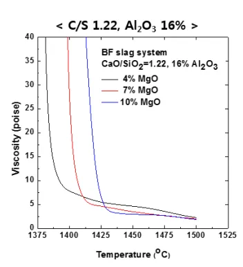

C/S 1.22, Al₂O₃ 18%

BF slag system CaO/SiO₂=1.22, 18% Al₂O₃

Viscosity (poise)

4% MgO 7% MgO 10% MgO

Temperature (°C)
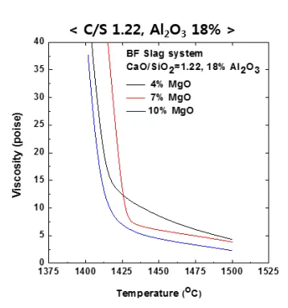

C/S 1.22, Al₂O₃ 20%

BF slag system CaO/SiO₂=1.22, 20% Al₂O₃

Viscosity (poise)

4% MgO 7% MgO 10% MgO

Temperature (°C)

C/S 1.18, Al₂O₃ 16%

BF slag system CaO/SiO₂=1.18, 16% Al₂O₃

Viscosity (poise)

4% MgO 7% MgO 10% MgO

Temperature (°C)
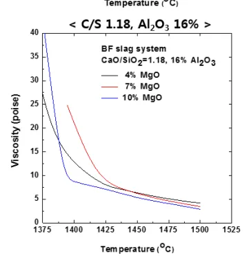

C/S 1.18, Al₂O₃ 18%

BF slag system CaO/SiO₂=1.18, 18% Al₂O₃

Viscosity (poise)

4% MgO 7% MgO 10% MgO

Temperature (°C)

C/S 1.18, Al₂O₃ 20%

BF slag system CaO/SiO₂=1.18, 20% Al₂O₃

Viscosity (poise)

4% MgO 7% MgO 10% MgO

Temperature (°C)

— 22 —

이 하 여 백
