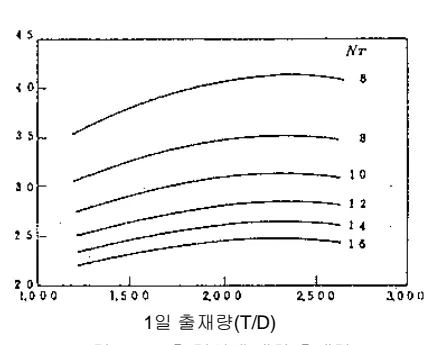
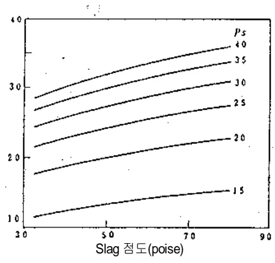
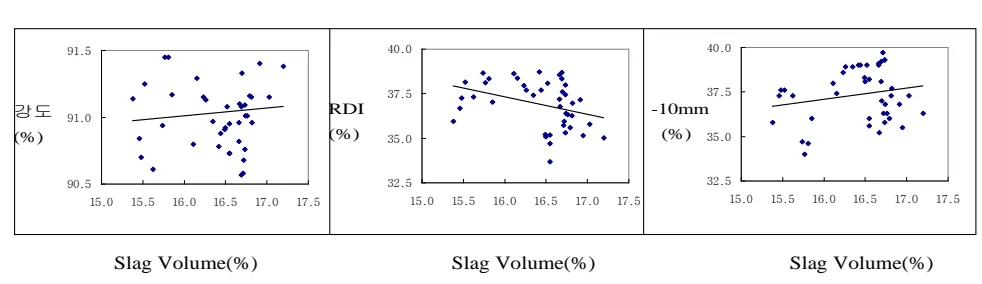

<!-- 페이지번호: 1, 파일명: Slag Volume 관리 기술기준 -->
# 1. 적용범위

고로공정의 Slag Volume 관리 기술에 대하여 적용한다.

# 2. 목적

고출선비, 고 PCR 이 고로조업에서 노황안정 유지와, 또한 소결조업에서의 소결광 풍질유지를 위해 Slag Volume 의 관리범위를 설정하여 관리해야 한다.

# 3. 중점관리 항목

<table><thead><tr><th>풍질영향 인자</th><th>공정영향 인자</th></tr></thead><tbody><tr><td>[Si], [S]</td><td>풍압, 노열</td></tr></tbody></table>
<a href="components/TP-030-060-050 Slag Volume 관리 기술기준(Rev.10)_0900bf4ba7a44072_usr0000bf4b95f9e446_p001_table_01.png">Table snapshot</a>

Slag Volume 상승 → 노내 통기성 저해 → 감풍 → 용선[Si] 상승

# 4. 조업기준

## 4.1 Slag Volume 관리기준

<table><thead><tr><th>조업조건</th><th>Slag Volume 관리기준</th></tr></thead><tbody><tr><td><ul><li>출선비 2.3t/d.m²의 고출선비 조업</li><li>PCR ≥ 100kg/t-p</li></ul></td><td><ul><li>관리범위 : 290 ± 30kg/t-p</li></ul></td></tr></tbody></table>
<a href="components/TP-030-060-050 Slag Volume 관리 기술기준(Rev.10)_0900bf4ba7a44072_usr0000bf4b95f9e446_p001_table_02.png">Table snapshot</a>

*각 고로의 특성을 고려하여 관리기준을 다르게 관리할 수 있다

# 5. 이상판단 및 조치기준 : 해당 사항 없음

# 6 기술이론

## 6.1 SLAG VOLUME 의 영향

### 가. 고로 노저에서 용용물(용선,Slag)의 배출이 불충분해서 노저에 용용물이 충만한 경우, 승풍압력이 상승하여 장입물 강하 속도가 저하하고, Slip 이 발생한다.

일반적으로 고로 출선 Cycle 에 대한 노저 Level 의 변화는 그림 1.과 같이 출선개시 직전에는 수평을 유지하지만 출선종료 직전에는 압력, 코크스와 용용물간의 저항등에 의해 압력손실, 용용물의 점성 등의 요인으로 (b)와 같은 패턴이 됨.

뒷 장 계속

<!-- 페이지번호: 2, 파일명: Slag Volume 관리 기술기준 -->

그림1. 노저 용선, Slag의 Level 변화

(b)와 같은 경우 출선구에서는 가스가 유출되고, 출선을 종시할 경우 실제로는 패 용용물이 출선구 Level 보다 상부에 잔류하게 됨.

川鐵技研에서는 다음과 같은 가정을 설정해서, 노저 Slag의 흐름을 단순화하고, 실제 조업에서 노저 잔류 저선재 Level을 추정.

<ol><li>노저에는 출재 개시시에 코크스층이 출선구에서 존재하여 Slag는 이 코크스층을 통하여 출선구로 이동.</li><li>출선 개시시에 Slag Level은 수평임.</li><li>용선의 動粘度는 Slag의 動粘度의 약 1/150이고, 용선의 유출속도도 용재와 거의 같기 때문에, 용선의 Level은 출선중 수평임.</li><li>출재속도는 출재중 일정.</li><li>노저내는 등온임.</li><li>노저내의 코크스는 일정하게 충진되어 있고, 공극율과 입경은 일정.</li></ol>
위의 가정을 통하여 다음 그림과 같은 결론은 얻어냄.

그림2. Slag층 깊이에 대한 출재량

<!-- 페이지번호: 3, 파일명: Slag Volume 관리 기술기준 -->

그림 2에서 출재량이 증가할 때, Slag 층의 깊이(잔재량)은 최초 증가하여, 다음에 감소함. 출선 유량 비가 2일 때 최대가 됨. 또 출선회수가 적게되면 잔재량은 증가함.

그림 3 및 그림 4에 표시된바와 같이 출재속도, 용재의 점도의 증가에 의해 잔재량은 증가함. 그 증가의 정도가 출재량의 영향은 작은 통상의 변동폭은 작아서 무시함. 출선회수는 12회부터 14회로 증가하면 Slag 층 깊이를 약 7% 저하하는 것이 가능함. 이 경우 잔재량의 저하는 약 2%임. 출재 속도는 동상 정확하게 제어하는 것은 곤란해서 크게 변동하고, 2T/min 에서 3T/min 로 증가하면, Slag 높이는 약 35%, 잔재량은 약 25% 증가함.

그림3. Slag층 깊이에 대한 유출속도의 영향

그림4. Slag층 깊이에 대한 점성의 영향

Slag의 점도는 3.5 poise 에서 4.75 poise 로 증가하면 Slag 높이는 8%(1poise 당 6.4%), 잔재량은 14%(1poise 당 11.2%)증가하고, 패 크게 변동함. 점도는 용재 온도에 의존하기 때문에 잔재량의 증가를 방지하는 것은 용재온도를 높이고 점도를 저하, 유지하는 것이 필요함.

출재속도가 증가하는 것은, 용재 점도의 상승에 의한 Slag 높이의 증가를 해소하기 위한 수단으로 출선회수를 증가하면 유효함. 예를 들면, 출재 속도가 변화할 때, Slag 층의 깊이를 일정하게 유지하기 위해 필요한 출선회수를 그림 5.에 표시함.

고로 노저온에서 저선량 Level 에 있어서 중요점은, 점성과 코크스 입경과 노저온도와의 관계임. 특히 대형 고로에서 출선회량이 크고, 출재 속도의 편차가 크면 최종 Slag Level 의 균배가 크게 됨.

또 노저온도가 필히 균일해지면, 중심부의 온도가 저하한 상태로 조업한 경우는 중심부를 통해 흐르는 것이 어렵게 됨. 이를 위해 중심부에 열을 주는 조업과 노심부 코크스를 크게하거나 Slag의 점성을 고려해서 조업하는 것이 필요함.

<!-- 페이지번호: 4, 파일명: Slag Volume 관리 기술기준 -->

그림5. 용재의 유출속도와 출선회수와의 관계

### 나. PCR 증대시 Slag 점도가 증가하기 때문에 Slag Ratio 를 감소시키고, 유동성 개선을 위해서 Al2O3의 하향 조정이 필요함.

[ PCR 증대시 조업실적 ]

### 다. 향후 포항 고로 고 PCR 조업시는 노내 Slag의 원활한 배출을 위해 Slag 중 Al2O3 는 14%이하 수준, Slag Volume 은 현 수준인 300kg/t-p 보다 더 낮추어야 한다.(280kg/t-p 수준)

뒷 장 계속

<!-- 페이지번호: 5, 파일명: Slag Volume 관리 기술기준 -->
## 6.2 고 PCR, 고출선비 고로의 조업실적

<table><thead><tr><th></th><th>Lurea 2BF</th><th>Hoogo, 6BF</th><th>ILVA 5BF</th><th>Ijmuid.6BF</th><th>광양 4BF</th><th>포항 4BF</th></tr></thead><tbody><tr><td>출선비(T/D.m3)</td><td>2.53</td><td>2.36</td><td>2.37</td><td>2.77</td><td>2.34</td><td>2.34</td></tr><tr><td>FR(Kg/T-P)</td><td>449</td><td>498</td><td>491</td><td>508</td><td>493</td><td>500</td></tr><tr><td>PCR(Kg/T-P)</td><td>77</td><td>170</td><td>143</td><td>206</td><td>145</td><td>171</td></tr><tr><td>Slag.V(Kg/T-P)</td><td>155</td><td>216</td><td>293</td><td>214</td><td>281</td><td>297</td></tr><tr><td>SPR(%)</td><td>100</td><td>96.3</td><td>84.5</td><td>99.7</td><td>90.1</td><td>82.1</td></tr><tr><td>Al2O3(%)</td><td>11.3</td><td>15.9</td><td>12.2</td><td>13.2</td><td>13.6</td><td>14.4</td></tr></tbody></table>
<a href="components/TP-030-060-050 Slag Volume 관리 기술기준(Rev.10)_0900bf4ba7a44072_usr0000bf4b95f9e446_p005_table_01.png">Table snapshot</a>

## 6.3 소결광 저 Slag Volume 조업목적

<ul><li>Slag Volume 저하 : 고 PCI 조업 지원, 폐기물(고로 Slag)발생량 저하</li><li>SiO₂, MgO 저하 : 용선중 [Si]저하, 소결 저가광(갈철광) 사용비 증대</li></ul>

## 6.4 저 Slag Volume 조업시 소결광 품질

Three scatter plots showing the relationship between Slag Volume(%) (X-axis, 15.0 to 17.5) and quality parameters (Y-axis).

Left Plot: 강도(%) (Strength %) vs Slag Volume(%). Shows a slight positive trend.

Middle Plot: RDI(%) vs Slag Volume(%). Shows a negative trend (RDI decreases as Slag Volume increases).

Right Plot: -10mm (%) vs Slag Volume(%). Shows a positive trend (Percentage of -10mm particles increases as Slag Volume increases).

<ul><li>Slag Volume 저하시 소결광 강도(Si)는 큰 변화 없으나 RDI 는 소폭상승되고 -10mm 는 오히려 개선됨</li></ul>

## 6.5 향후 조업방향

### 가. 당사

<ul><li>SOR 상승 → Slag.V 증가 → MgO, SiO₂ 저하 → Slag.V 저하유도 → RDI 다소 상승(포항 40%, 광양 45%)</li><li>고로 저원가조업을 위해 소결광 사용비를 올릴면 여기에 따라 Slag Volume 상승, 따라서 소결광중의 MgO 와 SiO₂ 를 낮추어 Slag Volume 저하를 유도함. 이때 불가피하게 RDI 는 다소 상승 할 것으로 예상됨(포항 40%, 광양 45%)</li></ul>

<!-- 페이지번호: 6, 파일명: Slag Volume 관리 기술기준 -->
### 나. 일본고로

- 君津, 名古屋 : 소결능력 부족으로 SOR 낮음(74%) → Slag.V 저하 → RDI 상승 → MgO, SiO₂ 상향(사문암 미파쇄 사용) → RDI 다소 저하

- 기타고로 : SOR 80% → Slag.V 증가 → MgO, SiO₂ 저하 → Slag.V 저하유도 → RDI 다소 상승 (당사 조업방향과 동일)

- 끝 -

이 하 여 백
