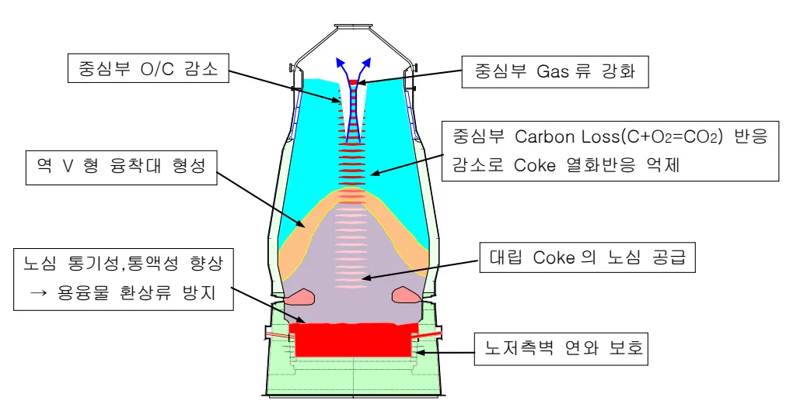
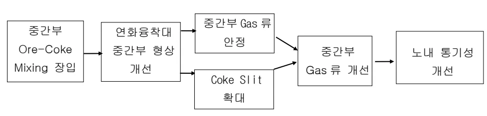
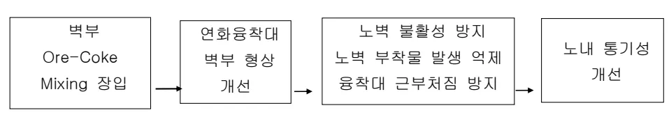

<!-- 페이지번호: 1, 파일명: Coke 중심장입 및 Nut Coke 장입기준 -->
# 1. 적용범위

고로의 통기성 향상을 위한 장입물 분포제어 방법으로 중심 Gas 류 개선을 위한 Coke 중심장입기술 및 벽부 Gas 류 개선을 위한 Nut Coke 장입 기술에 대해 적용한다.

# 2. 목 적

<ul><li>Coke 중심장입: 대립 Coke 의 중심부 장입을 통해 건전한 Coke 를 노심에 공급하여 중심가스류 확보를 통한 통기성 개선 및 노저부의 풍액성 확보를 기반으로 노황 안정 도모.</li><li>Nut Coke 장입: 종괴 Coke 를 Ore 와 노벽부 및 중간부 혼합장입을 통해<ul><li>노벽 Gas 류를 유도하여 노벽 불활성 방지 및 벽부 통기성 개선</li><li>종괴 Coke 의 우선적인 Solution Loss 반응으로 노심 Coke 입도저하 방지 및 중간부 통기성 개선</li></ul></li></ul>

# 3. 중점관리 항목

<table><tbody><tr><td>품질영향 인자</td><td>공정영향 인자</td></tr><tr><td>[Si], [S]</td><td>풍압, 노열</td></tr></tbody></table>
<a href="components/TP-030-070-050 Coke 중심장입 및 Nut Coke 장입기준(Rev.9)_0900bf4ba7a466b5_usr0000bf4b95f9e446_p001_table_01.png">Table snapshot</a>

# 4. 조업 기준

## 4.1 Coke 중심장입 기준

### 가. 각고로 Coke 중심장입 방법 및 장입량설정

<table><thead><tr><th>구분</th><th>2고로</th><th>3고로</th><th>4고로</th></tr></thead><tbody><tr><td>장입 방법 (조정가능)</td><td>C↓, OL↓, Cc↓, Os↓</td><td>C↓, OL↓, Cc↓, Os↓</td><td>C↓, OL↓, Cc↓, Os↓</td></tr><tr><td>장입량</td><td colspan="3">각 고로 특성 및 노황에따라 사용량 증감</td></tr><tr><td>경동각도 (조정가능)</td><td>3°</td><td>5°</td><td>5°</td></tr><tr><td>노내 형상</td><td colspan="3"></td></tr></tbody></table>
<a href="components/TP-030-070-050 Coke 중심장입 및 Nut Coke 장입기준(Rev.9)_0900bf4ba7a466b5_usr0000bf4b95f9e446_p001_table_02.png">Table snapshot</a>

<!-- 페이지번호: 2, 파일명: Coke 중심장입 및 Nut Coke 장입기준 -->
### 나. Coke 중심장입 효과

도표: Coke 중심장입 효과
<ul><li>중심부 O/C 감소</li><li>중심부 Gas류 강화</li><li>역 V 형 융착대 형성</li><li>중심부 Carbon Loss (C+O₂=CO₂) 반응 감소로 Coke 열화반응 억제</li><li>노심 통기성, 흡액성 향상 → 용융물 환상류 방지</li><li>대립 Coke의 노심 공급</li><li>노저측벽 연와 보호</li></ul>

# 4 2 Nut Coke 장입 기준

## 가. 각고로 Nut Coke 장입방법 및 장입량 설정

<table><thead><tr><th>구분</th><th>2 고로</th><th>3 고로</th><th>4 고로</th></tr></thead><tbody><tr><td>장입 방법 (조정가능)</td><td>C, OL+N.C, Os+N.C</td><td>C, OL+N.C, Os+N.C</td><td>C, OL+N.C, Os+N.C</td></tr><tr><td>장입량</td><td colspan="3">각 고로 특성 및 노화에따라 사용량 증감</td></tr><tr><td>장입 Sequence 및 노내 형상</td><td colspan="3">
도면 설명: Top hopper, Ore Bin, Surge Hopper, Nut coke, Os, Nut coke/ore mixed zone, Nut Coke, Cc.
</td></tr></tbody></table>
<a href="components/TP-030-070-050 Coke 중심장입 및 Nut Coke 장입기준(Rev.9)_0900bf4ba7a466b5_usr0000bf4b95f9e446_p002_table_01.png">Table snapshot</a>

<!-- 페이지번호: 3, 파일명: Coke 중심장입 및 Nut Coke 장입기준 -->
## 나. Nut Coke 장입효과

(1) Ore Large + Nut Coke 장입

<table border="1"><tbody><tr><td>중간부 Ore-Coke Mixing 장입</td><td>연화용착대 중간부 형상 개선</td><td>중간부 Gas 류 안정 Coke Slit 확대</td><td>중간부 Gas 류 개선</td><td>노내 통기성 개선</td></tr></tbody></table>

(2) Ore Small + Nut Coke 장입

<table border="1"><tbody><tr><td>벽부 Ore-Coke Mixing 장입</td><td>연화용착대 벽부 형상 개선</td><td>노벽 불활성 방지 노벽 부착물 발생 억제 용착대 근부처짐 방지</td><td>노내 통기성 개선</td></tr></tbody></table>

# 5 이상판단 및 조치기준 : 해당사항 없음

‘끝.’

이 하 여 백
