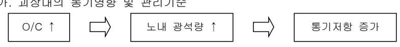
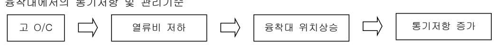

<!-- 페이지번호: 1, 파일명: 미분탄 취입시 조업기준 -->
# 1. 적용범위

고로에서 미분탄 취입조업시 Coke 대체에 따른 노내 통기성과 Coke 와의 치환율 및 장입 Base 등 제반 조업관리 기준에 대하여 적용한다.

# 2. 목 적

Coke 대체로의 미분탄 취입비 증가시 발생되는 노하부 통기성, 풍액성 저하와 적정 치환율 관리 및 장입 Base 관리기준을 적용하여 안정적인 취입조업을 수행하기 위함

# 3. 중점 관리항목

<table><thead><tr><th>품질영향인자</th><th>공정영향인자</th></tr></thead><tbody><tr><td>[Si], [S]</td><td>풍압, 노열,</td></tr></tbody></table>
<a href="components/TP-030-080-040 미분탄 취입시 조업기준(Rev.12)_0900bf4ba7a447e5_usr0000bf4b95f9e446_p001_table_01.png">Table snapshot</a>

# 4. 조업 기준

## 4.1 조업관리기준

### 가. 과상대의 통기영향 및 관리기준

<table><tr><td>O/C ↑</td><td>→</td><td>노내 광석량 ↑</td><td>→</td><td>통기저항 증가</td></tr></table>

(1) 장입시의 분발생 방지를 위해 Coke, 광석의 냉간강도 증대

[예] Coke 평균입도 변화 : 장입 B/C 50mm → 선회 Chute 선단 42mm → 노내 장입물 표면(35~38mm)

(2) 소결광 RDI(저온 환원분화지수) 개선

(3) 소립 Coke 의 광석 Mixing 장입 (고 Coke 의 반응열화량 감소)

(4) Coke 중심장입에 의한 Gas류 분포 안정화

(5) 노정온도 저하에 의한 노구 Gas 유속 저하 (Coke 유통화 방지)

### 나. O/C 증대시 중점류 확보대책

(1) 소결광 입도별 장입실시(주변류 세립화)

(2) 시계열 입도장입에 의한 중심부 조립화

(3) Coke 중심장입

(4) 노내 반경방향 O/C 분포의 균일화 (적정 Terrace 길이 확보 : 중간부 처짐 방지)

(5) 중고 Coke 와 Ore Large Mixing 에 의한 중간류 확보 (중간부 처짐 방지)

(6) 정립광 및 Pellet 입도별 장입

(7) Soft 장입에 의한 중심부 원주 Balance 개선

<!-- 페이지번호: 2, 파일명: 미분탄 취입시 조업기준 -->
### 다. 융착대에서의 통기저항 및 관리기준

Flowchart showing the process for managing permeability in the fusion zone:

고 O/C → 열류비 저하 → 융착대 위치상승 → 통기저항 증가

<ol><li>열류비 저하에 의한 융착대 위치 적정화<ul><li>산소부화</li><li>생산 Speed 증대</li><li>연료비 저하</li><li>습분↓, 풍운↑, 소결광 RI↑, Coke Ash↓</li></ul></li><li>장입물 분포조정에 의한 적정 융착대 형성 유지<ul><li>Gas 분배기로서의 역할</li><li>Slit 면적 확대 (크기 및 개수)</li></ul></li><li>융착대 폭 감소를 위한 소결광 및 Pellet 성분조정<ul><li>연화온도와 용락온도의 폭 축소</li></ul></li></ol>

### 라. 노심 Coke 에서의 통기저항 및 조업기준

Flowchart showing the process for managing permeability in the core coke:

O/C↑ → 노내 Coke량 감소 → 괴 Coke 1 개당 반응열화량 증가 → 노심 Coke 분 증가, 통기저항 증가

<ol><li>소립 Coke 와 광석의 Mixing 장입 → 괴 Coke 반응 열화량 감소</li><li>Coke 반응성 및 CSR(열간강도) 증대</li><li>Coke 중심장입 → 건전한 Coke 중심부 공급</li><li>A/B 6 온도증대 → 노심 열투입량 증가</li><li>중심부 O/C↓ → 중심부 ECO↓ → 건전 Coke 반응량 감소</li></ol>

### 마. Raceway 에서의 통기영향 및 조업기준

Flowchart showing the process for managing permeability in the Raceway:

PCRI↑ → Raceway 내 미분탄 우선반응, 연소초점 풍구 선단측 이동 → Raceway 내 Coke 체류시간 증가 → Coke 분 발생증가 → 노체 열부하 증가 → 통기저항 증가

<ol><li>PC 연소성 개선<ul><li>Oxy-Coal 채용 및 Lance 구조 변경</li><li>O2 부화량 증대, Tf ↑</li></ul></li><li>Coke 강도 증대</li><li>PC Lance 위치 노내이동</li></ol>

<!-- 페이지번호: 3, 파일명: 미분탄 취입시 조업기준 -->
### 마. 치환율 관리기준

<table><thead><tr><th>PCR(Kg/T-P)</th><th>80</th><th>100</th><th>120</th><th>140</th><th>160</th><th>180</th><th>200</th></tr></thead><tbody><tr><td>치환율</td><td>0.98</td><td>0.92</td><td>0.88</td><td>0.85</td><td>0.82</td><td>0.79</td><td>0.76</td></tr></tbody></table>
<a href="components/TP-030-080-040 미분탄 취입시 조업기준(Rev.12)_0900bf4ba7a447e5_usr0000bf4b95f9e446_p003_table_01.png">Table snapshot</a>

### 사. 미분탄 취입조건에 따른 Ore, Coke Base 관리기준 (해당 값 ± 3%)

<table><thead><tr><th colspan="3">2 고로</th><th colspan="3">3 고로</th></tr><tr><th>취입량</th><th>Ore Base</th><th>Coke Base</th><th>취입량</th><th>Ore Base</th><th>Coke Base</th></tr></thead><tbody><tr><td>20</td><td>66.6</td><td>17.0</td><td>55</td><td>123.1</td><td>27.1</td></tr><tr><td>25</td><td>69.6</td><td>16.8</td><td>60</td><td>124.6</td><td>26.6</td></tr><tr><td>30</td><td>72.7</td><td>16.7</td><td>65</td><td>126.2</td><td>26.1</td></tr><tr><td>35</td><td>75.8</td><td>16.5</td><td>70</td><td>127.7</td><td>25.6</td></tr><tr><td>40</td><td>78.8</td><td>16.3</td><td>75</td><td>129.3</td><td>25.2</td></tr><tr><td>45</td><td>81.9</td><td>16.2</td><td>80</td><td>130.8</td><td>24.7</td></tr><tr><td>50</td><td>85.0</td><td>16.0</td><td>85</td><td>132.3</td><td>24.2</td></tr></tbody></table>
<a href="components/TP-030-080-040 미분탄 취입시 조업기준(Rev.12)_0900bf4ba7a447e5_usr0000bf4b95f9e446_p003_table_02.png">Table snapshot</a>

<table><thead><tr><th colspan="3">4 고로</th></tr><tr><th>취입량</th><th>Ore Base</th><th>Coke Base</th></tr></thead><tbody><tr><td>70</td><td>158.1</td><td>37.2</td></tr><tr><td>80</td><td>165.3</td><td>36.7</td></tr><tr><td>90</td><td>172.6</td><td>36.1</td></tr><tr><td>100</td><td>179.8</td><td>35.6</td></tr><tr><td>110</td><td>187.0</td><td>35.0</td></tr><tr><td>120</td><td>194.3</td><td>34.5</td></tr><tr><td>130</td><td>201.5</td><td>33.9</td></tr></tbody></table>
<a href="components/TP-030-080-040 미분탄 취입시 조업기준(Rev.12)_0900bf4ba7a447e5_usr0000bf4b95f9e446_p003_table_03.png">Table snapshot</a>

* 70 T/Hr 이상시는 Coke Base Min. 21 Ton 기준으로 Ore Base Up

* 각 고로의 노황 및 기타 필요시 변경할 수 있다

뒷 장 계속

<!-- 페이지번호: 4, 파일명: 미분탄 취입시 조업기준 -->
## 4.2 예방판단 및 조치기준

### 가. O/C 증대에 따른 통기성 영향 최소화를 위한- 소결광 RDI(환원분화지수) 개선- Coke 중심장입에 의한 Gas류 분포 안정화나. O/C 증대시 중심류 확보를 위해- 소결광 입도별 장입실시(주변부 세립화)- 종괴 Coke 와 Ore Large 혼합에 의한 중간류 확보- Soft 장입에 의한 중심부 원주 Balance 개선다. 용착대 통기저항 방지를 위해- 용착대 폭 감소를 위한 소결광 및 Pellet 성분조정라. 노심 Coke 통기저항 해소를 위해- Coke 중심장입으로 건전한 Coke 중심부 공급- 중심부 O/C 저하로 Eco 조정, 건전 Coke 반응량 감소 유도마. Raceway 의 통기영향의 대책으로- Coke 강도 증대

# 5. 이상판단 및 조치기준

## 가. 미분탄 취입 중 긴급휴풍시 노열확보 위한 사전 PC 증가기준

<table><thead><tr><th>구분</th><th>1 Hr</th><th>2 Hr</th><th>3 Hr</th><th>4 Hr</th><th>5 Hr</th></tr></thead><tbody><tr><td>기존 PC 취입량 +</td><td>2~3 Ton</td><td>2~3 Ton</td><td>3.0 Ton</td><td>4.0 Ton</td><td>5.0 Ton</td></tr></tbody></table>
<a href="components/TP-030-080-040 미분탄 취입시 조업기준(Rev.12)_0900bf4ba7a447e5_usr0000bf4b95f9e446_p004_table_01.png">Table snapshot</a>

## 나. 미분탄의 열효과 기준

<ul><li>미분탄 취입시 : 3~4 시간후 노열상승</li><li>미분탄 Cut 시 : 2~3 시간후 노열저하</li></ul>

# 6. 기술이론

## 6.1 미분탄 취입시 노하부 통기영향 Mechanism

Flowchart illustrating the mechanism of blast furnace permeability effects during the introduction of micro-pellets:

Inputs (Left): PCR↑, Ore/Coke 증가, Coke의 노내 및 Raceway 체류시간 증가, 미연소 미분탄 생성.

Intermediate Effects (Center):<ul><li>노심 Coke의 하중 증가<ul><li>노심 Coke의 치밀화</li><li>Coke Free 층 축소</li></ul></li><li>Raceway 길이축소</li><li>풍구주변 분 Coke 퇴적량 증가</li><li>미연소 Coal 퇴적량 증가</li></ul>

Output (Right):<ul><li>노하부, 통기, 풍액성 저하</li><li>Coke 중심 장입 (대교장입)</li><li>Coke 강도증대</li><li>PC 연소성 개선</li></ul>

<!-- 페이지번호: 5, 파일명: 미분탄 취입시 조업기준 -->
## 6.2 치환율 산출방식

### 가. 결보기 치환율

* 결보기 치환율 = 기준조업 대비 Coke 감소량 (Kg/T-P) / 미분탄 취입량 (kg/T-P)

### 나. 보정 치환율

* 보정 치환율 = 기준조업시 Coke 비 x 보정 Coke 비 (Kg/T-P) / 미분탄 취입량 (kg/T-P)

* 보정 Coke 비는 POSCO 통일식 적용

<table><thead><tr><th rowspan="2">구분</th><th rowspan="2">기준</th><th>보정치</th><th rowspan="2">구분</th><th rowspan="2">기준</th><th>보정치</th></tr><tr><th>Kg/T-P</th><th>Kg/T-P</th></tr></thead><tbody><tr><td>송풍온도(°C)</td><td>+ 10</td><td>- 1</td><td>Slag V.(Kg/T-P)</td><td>+ 10</td><td>+ 2.5</td></tr><tr><td>송풍습분(g/Nm³)</td><td>+ 10</td><td>+ 8</td><td>ECO (%)</td><td>+ 1</td><td>- 4</td></tr><tr><td>소결광비(%)</td><td>+ 10</td><td>- 10</td><td>Coke Ash(%)</td><td>+ 1</td><td>+ 10</td></tr><tr><td>Pellet 비(%)</td><td>+ 10</td><td>- 5</td><td>소결광 FeO</td><td>+ 1</td><td>+ 4</td></tr><tr><td>[Si](%)</td><td>+ 1</td><td>+ 70</td><td></td><td></td><td></td></tr></tbody></table>
<a href="components/TP-030-080-040 미분탄 취입시 조업기준(Rev.12)_0900bf4ba7a447e5_usr0000bf4b95f9e446_p005_table_01.png">Table snapshot</a>

### 다. 포항고로 치환율 계산공식 (실행식)

R = 1.992 X 0.534 X Log(PCR) PCR : Kg/T-P

‘끝.’

이 하 여 백
