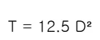
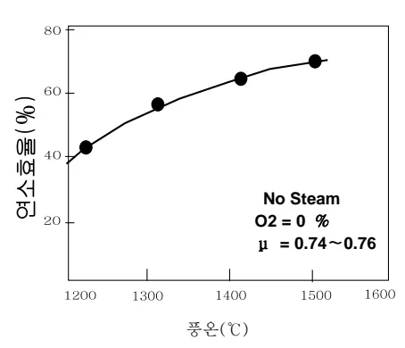
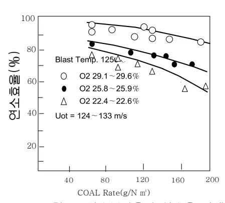
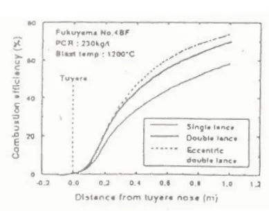
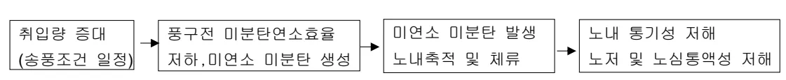
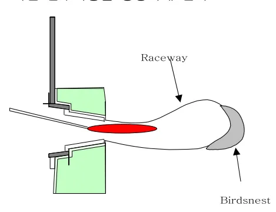
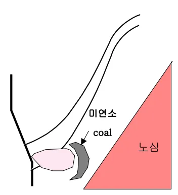

<!-- 페이지번호: 1, 파일명: Coal 연소성 향상방안 기준 -->
# 1. 적용범위

고로공정 미분탄 취입조업에서 미분탄 취입비 상승에 따른 노내 연소성 향상방안에 대해 적용함.

# 2. 목적

미분탄 취입조업에서 미분탄 취입량 증가에 따른 노내 각 부위별 연소성 저해요인과 연소거동 변화에 대한 연소성 향상방안 수립으로 안정적인 고미분탄 취입 수행을 하기위함

# 3. 중점 관리항목

<table><tr><td>품질영향인자</td><td>공정영향인자</td></tr><tr><td>[SI], [S]</td><td>풍압, 노열</td></tr></table>
<a href="components/TP-030-080-060 Coal 연소성 향상방안 기준(Rev.12)_0900bf4ba7a2bc2f_usr0000bf4b95f9e446_p001_table_01.png">Table snapshot</a>

# 4. 조업기준

## 4.1 조업관리기준

### 가. Coal 의 취발분 (Volatile Matter)

취발분은 연소과정에서 열분해 단계를 용속하는 주요인자로서 취발분 함유량이 높을수록 연소성이 향상되며 취발분이 40% 이상의 고취발분일 경우에는 착화온도를 낮춰서 연소를 용이하게 한다. 취발분이 낮은 연소반응의 경우 열분해 반응에 의한 취발분 방출량이 상대적으로 낮아 취발 연소후에 잔존하는 고상입자의 양이 증가하게 된다.

이때 고상입자의 연소속도는 취발분의 연소속도에 비해 매우 느리기 때문에 전체적인 연소속도는 감소하게 된다. 또한 미분탄 취발분의 함량은 잔존 고상입자의 상대적인 양에 영향을 미칠뿐 아니라 잔존 고상입자의 연소속도 자체에 영향을 미친다.

즉 석탄화도가 다른 경우 석탄의 물리화학적 성상의 차이에 의해 열분해 거동이 상이하게 되며 이로 인한 고상입자의 기공특성 변화는 연소반응 가스에 대한 입자의 반응성 차이를 조래하게 된다.

그림 1은 동일 취발분에서도 취입량에 따라 연소율 차이가 있음을 보여주고 Table 1은 동일 취입량을 기준으로 할때 취발분에 따른 연소효율을 보여주고 있다.

뒷 장 계속

<!-- 페이지번호: 2, 파일명: Coal 연소성 향상방안 기준 -->

Line graph showing the relationship between input ratio (Kg/T-P) and yield efficiency (%). The X-axis is Input Ratio (%), ranging from 10 to 60. The Y-axis is Yield Efficiency (%), ranging from 0 to 100. Four lines represent different input ratios: 50 Kg/T-P (solid line with solid circles), 100 Kg/T-P (solid line with solid triangles), 150 Kg/T-P (dashed line with squares), and 200 Kg/T-P (dashed line with circles).

<table><thead><tr><th>V.M (%)</th><th>연소효율 (%)</th></tr></thead><tbody><tr><td>45</td><td>90</td></tr><tr><td>35</td><td>80</td></tr><tr><td>19</td><td>72</td></tr></tbody></table>
<a href="components/TP-030-080-060 Coal 연소성 향상방안 기준(Rev.12)_0900bf4ba7a2bc2f_usr0000bf4b95f9e446_p002_table_01.png">Table snapshot</a>

Table.1 Raceway 선단부 도달시 연소효율

그림 1. 취입량별 연소효율 변화

#### 나. Coal의 입도

미분탄 입도는 연소과정에서 표면산화반응 단계의 울속인자이며 입도가 작을수록 연소시간이 빨라지고 입자가 미세할수록 반응 표면적이 증가함으로서 산소와의 접촉이 활발하게 되어 반응속도가 빨라지기 때문이다. 입도에 따른 연소소요시간은 실험결과 다음과 같은 관계가 있는 것으로 나타났다.

<math display="block">T = 12.5 D²</math>

(T = 완전연소 소요시간, D = 미분탄 입경/mm)

<table><thead><tr><th rowspan="2">구분</th><th colspan="3">PCR (Kg/T-P)</th></tr><tr><th>100</th><th>200</th><th>300</th></tr></thead><tbody><tr><th>COAL</th><td>48</td><td>95</td><td>62</td><td>32</td></tr><tr><th>입도 (μm)</th><td>285</td><td>82</td><td>46</td><td>2</td></tr><tr><th></th><td>1180</td><td>73</td><td>28</td><td>0</td></tr></tbody></table>
<a href="components/TP-030-080-060 Coal 연소성 향상방안 기준(Rev.12)_0900bf4ba7a2bc2f_usr0000bf4b95f9e446_p002_table_02.png">Table snapshot</a>

Table 2. 풍구 선단에서 200mm 지점 에서의 취입비별 연소효율 변화

Graph showing the relationship between input degree (mm) and reaction time (sec). The X-axis is Input Degree (mm), ranging from 0.075 to 1.70. The Y-axis is Reaction Time (sec), ranging from 0 to 40. The curve shows that reaction time increases significantly as input degree increases.

그림 3. 입도와 연소효율 변화

뒷 장 계속

<!-- 페이지번호: 3, 파일명: Coal 연소성 향상방안 기준 -->
### 다. 송풍온도 및 습분

<ul><li>풍운상승→미분탄의 열분해속도 상승 → 열분해량 증가 → 미연소 미분탄의 연소속도 상승</li></ul>

<ul><li>습분상승 → 연소율 상승 (H₂ O + C → H₂ + CO) 단, Tf 일정하에서는 다소 상승하나, 조습증가로 Tf 저하시 효과미약</li></ul>

### 라. 산소부화율

미분탄 취입의 효과는 풍구선단에서의 연소성에 의해서 좌우된다. 연소성을 향상시키는 방법으로 원료탄의 적정선택, 입도관리, 풍운상승 등의 방법이 있으나 제조건을 만족시에도 취입량을 상승시키기에는 한계가 있으며 이를 위한 효과적인 방법으로 산소부화 송풍이 있다. 미분탄 취입시에는 다른 보조연료 취입시와 마찬가지로 입현열의 차이 및 탄화수소 분해열 등의 소모로 많은 열량이 소모되기 때문에 연소온도는 저하할 수 밖에 없으며 이로 인해 연소성이 저하하여 미연소 미분탄이 발생하므로 취입량에 제한을 받게 된다.

산소부화는 풍구선단에서 연소온도를 상승시켜 줄 뿐만 아니라 탄화수소를 연소시키는데 필요한 충분한 산소를 공급하여 주기 때문에 산소부화율이 증가할수록 연소성이 향상되며 미분탄 취입량이 낮은 경우보다 취입량이 높은 경우에 산소부화 효과가 증대됨을 알 수 있다.(그림 6) 한편 산소부화는 송풍조건의 변화에 따라서 그 적정 Point 가 정해진다.

Table 3 에서 볼 수 있듯이 연소효율 최대점에서의 산소부화율은 풍운이 상승하면 저하시킬 수 있고 풍운이 낮은 경우는 산소부화율을 증대시켜 적정 조습량의 확보하여 연소율을 최대화 시킬 수가 있다. 기존에는 송풍중에 산소를 취입하는 산소부화가 일반적이었으나 최근에는 별도의 랜스를 사용하여 산소와 Coal을 풍구 선단에서 직접 접촉시켜 연소성을 획기적으로 향상시키는 Oxycoal 조입기술을 개발하여 조입에 적용중에 있다.

뒷 장 계속

<!-- 페이지번호: 4, 파일명: Coal 연소성 향상방안 기준 -->

그림 6. 산소부화율과 연소율 관계

<table><thead><tr><th>풍 온 (°C)</th><th>조 습 (g/Nm3)</th><th>연소효율 최대점의 산소부화율 (%)</th></tr></thead><tbody><tr><td>1330</td><td>0</td><td>4</td></tr><tr><td>1200</td><td>0</td><td>5</td></tr><tr><td>1200</td><td>10</td><td>6</td></tr></tbody></table>
<a href="components/TP-030-080-060 Coal 연소성 향상방안 기준(Rev.12)_0900bf4ba7a2bc2f_usr0000bf4b95f9e446_p004_table_01.png">Table snapshot</a>

Table.3 송풍조건 변화시의 적정 Max 산소부화율

※ 산소의 분산가능시는 미연소 미분탄과 산소의 접촉효율을 높일수있어 최대점을 훨씬 올릴수있음

한편 산소부화조업은 다음과 같은 부수적인 효과를 보이고 있다.

<ul><li>생산성 증대에 의한 고로 열효율이 향상되고 증산 혹은 생산량의 탄력적 조정이 용이하다.</li><li>연소성 향상으로 Coke 대체비 증가 및 노화안정, 용선성분 안정으로 용선제조원가 절감.</li></ul>

#### 바. 미분탄 Dual 취입으로 미분탄과 산소의 접촉효율 향상

미분탄 취입량이 증가함에 따라 취입되는 미분탄과 산소와의 접촉(반응기회)효율은 저하되고 있다. 미분탄과 산소와의 반응기회를 증대시키기 위하여 1개 풍구당 1개 Lance 로 취입되는 미분탄을 2개 Lance 를 이용하여 Dual 취입하는 Double Lance 조업기술을 적용, 활용하고 있다.

그림 7. Lance Type에 따른 연소율

미분탄 Dual 취입을 위한 Double Lance 적용시 Lance 의 끝단부 형상에 따라 연소율의 차이가 발생한다. (Eccentric D/L > Nomal Double Lance)

그림 8. 미분탄과 산소와의 반응기회

<!-- 페이지번호: 5, 파일명: Coal 연소성 향상방안 기준 -->
# 5. 이상판단 및 조치기준

## 5.1 예방판단 및 조치기준

Flowchart illustrating the cause and effect of abnormal conditions:

Input Flow (Left): 휘입량 증대 (송풍조건 일정) → 풍구전 미분탄연소효율 저하, 미연소 미분탄 생성 → 미연소 미분탄 발생 (노내 축적 및 체류) → 노내 통기성 저해 (노저 및 노심통액성 저해)

## 5.2 이상판단 및 조치기준

Coal의 연소는 Coal이 가지고 있는 휘발분, 기공율에 의해 Coke보다 연소성이 우수하며 고로 내에 존재하는 노심 Coke의 영향으로 Solution Loss 반응에 의해 이론적 연소효율보다 실조업의 연소효율이 증가하며 특히 산소량에 따라 이 효과는 증가되며 산소부화의 증대가 Coal 연소성에 큰 영향을 미친다.

그러나 휘입량 증가시는 과잉산소계수의 변동에 의해서 연소효율이 저하되어 미연 Char가 발생하며 Raceway 후단부에 미연 Char 및 Slag로 이루어진 풍액성 및 유동성이 극히 불량한 Birdnest라는 난투과층을 형성하게 된다

○ Coal 휘발분의 휘발 종료지점 : Raceway 중간부

○ Birdnest 부 반응(char) CO₂ + C o 2CO

# 6. 기술이론

## 6.1 Coal의 연소 Mechanism

Coal 연소는 휘입 직후 노내 고온 복사열에 의해 예열되고 열전도에 의해 입자온도가 상승하면서 열분해에 의해 휘발분을 방출한다. 방출된 휘발분은 주변의 Gas로 확산되며 산소와 반응하여 CO, OH, H 등의 중간 생성물을 거쳐서 CO₂, H₂O Gas를 방출시킨다. 휘발분 방출이 완료된 석탄 입자는 고정탄소를 주성분으로 하는 Char를 형성하고 생성된 Char와 산소가 반응하여 연소하고 1차 연소에 의해 발생된 CO₂, H₂O Gas가 Char를 Solution Loss 반응에 의해 연소시킴으로서 Coal의 연소가 완료된다.

<!-- 페이지번호: 6, 파일명: Coal 연소성 향상방안 기준 -->

Coal + Air 혼합 → 입자 열분해 및 착화 → 휘발분방출 및 입자에 CO, H2 침투 예열 온도 (°C) → 예열대 예열 Gas 확산 (CO, H2) Gas 화반응 - CO + O₂ → CO₂ - h + O +H₂O 연소대 고정탄소연소 및 Ash 용융 C의 연소반응 - C + CO₂ → 2CO - C +H₂O → CO +H₂ 후연소대

Raceway 거리

노내 고온 복사열을 받아 미분탄입자가 열 → 열전도에 의해 석탄 입자온도 상승 및 입자 휘발분 방출

주변 Gas 와 산소반응 하여 CO₂, H₂O 생성

Char의 연소 및 Ash Melting 반응구역 (Coal 연소의 율속단계)

그림 1. Coal의 연소 Mechanism

## 6.2 미연소 Coal의 소비

피상대 연화대 융착대 적하대 노심

<strong>연화대</strong>
<ul><li>미연소 미분탄 연화대 도달</li><li>→ 연화대층 수축</li><li>→ 공극을 저하</li><li>→ 공극내축적 (압손증가)</li><li>연화대에 축적된 미연 Char 가 융착층에서 소비</li></ul>
<strong>융착대</strong>
<ul><li>융착층의 압손감소 (slag 소비)</li><li>FeO + C → Fe + CO (slag) (coal)</li></ul>
<strong>적하대</strong>
<ul><li>융착대로부터 적하하는 slag, metal 과 접촉 → 극소량이 용선중에 침탄</li><li>3Fe + C → Fe₃C (미연 Char)</li></ul>

<!-- 페이지번호: 7, 파일명: Coal 연소성 향상방안 기준 -->
## 6.3 미연 Char 의 체류

### 6.3.1 용착대 근방에 체류

○ 역 V 형 용착대

PCR 증대시 → 노벽 Gas 류 감소 → S1, S2 단 온도 저하 → 노화안정

(단, PCR 저하시 주의)

○ W 형 용착대

PCR 증대시 → 노벽 Gas 류 증가 → S1, S2 단 온도 증가 → 노화불안정 (풍압변동)

역 V 형 용착대에 체류시는 충분한

Coke Slit 의 확보로 노하부 풍압변동을

최소화 할 수 있으나

W 형 용착대에 체류시는 Coke Slit 의

부족으로 기본적으로 불균일한 Gas 류

Pattern 을 더욱 가중시키는 결과초래

따라서

고 미분탄취입을 위해서는 PCR 증대 전에

역 V 형 용착대를 형성시켜 주어야 한다.

### 6.3.2 Birdnest (노심 표층부) 체류

노심 열전달 감소

SLAG 유동성 저하

통액성 저해

Raceway 후단부의 Birdnest 에 체류시는

Birdnest 자체의 낮은온도 분위기하에서

체류된 미연 Char 가 더욱 강고한 난투과

층을 형성시킨다. 이영향으로 노심부위에

충분한 열전달을 시킬 수가 없으며 노심

오염의 가속화, 노심부 풍액성 불량 및

환상류 조장으로 국부적인 노저촉벽 침식

을 가속화시킨다.

PCR 증가시 미연 Char 의 증가는

Slag 와 결합시에 점도가 급상승하는

특징이 있으므로 유동성을 해친다.
