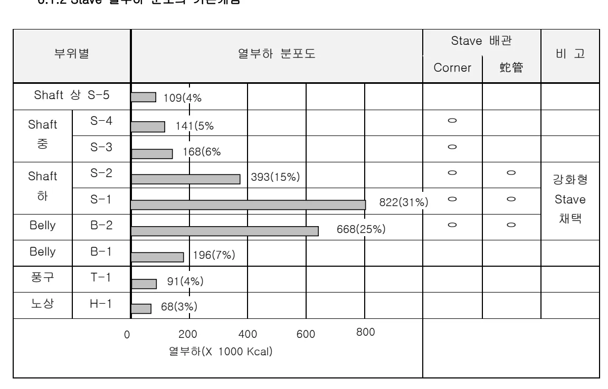
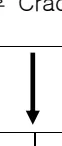

<!-- 페이지번호: 1, 파일명: 노체Stave 관리기술 기준 -->
# 1. 적용범위

고로 본체 Stave 냉각반의 관리 방법에 대하여 적용한다

# 2. 목적

최근 고로는 15년 이상의 장수명화를 위하여 노체의 건전성 유지가 필수적 이므로 노체 Stave 의 재질적 특성에 따른 적정 유량 및 수온관리 기술이 필요함.

# 3. 중점 관리항목

<table><thead><tr><th>품질영향 인자</th><th>공정영향 인자</th></tr></thead><tbody><tr><td>Si, S</td><td>풍압, 노열</td></tr></tbody></table>
<a href="components/TP-030-090-040 노체Stave 관리기술 기준(Rev.11)_0900bf4ba7a2bc6e_usr0000bf4b95f9e446_p001_table_01.png">Table snapshot</a>

# 4. 조업기준 : 해당사항 없음

# 5. 이상판단 및 조치기준 : 해당사항 없음

# 6. 기술이론

## 6.1 Stave 개발 기술

### 6.1.1 Stave 의 구조 개발경위

Stave 냉각 기술은 최초로 1950년대 말에 소련에서 개발되었고 1967년 소련으로부터 일본에 기술 도입후 1969년 4월 名古屋 3고로에 처음으로 채용되어 사용이 시작된후 단계적으로 발전을 거듭하였다. 처음 1세대 Stave 는 (1969 ~ 1972년) 소련에서 도입한 기술을 그대로 적용하였으나 채용후 조업중 문제점이 발생되는 부분에 대하여 개발을 적극적으로 추진하여 현재에는 4세대 Stave 까지 개발하여서 적용하고 있다.

주로 문제점이 되어 개발한 내용을 보면 다음과 같다.

<ul><li>Stave Corner 부의 냉각 취약성: 냉각 Line 보완 설계 (만곡형 → 직각형, 수직 Pipe 와 사형 Pipe 이중 배치)</li></ul>

<ul><li>Stave 두께: 박벽화</li></ul>

<ul><li>Stave 냉각 System: 강제순환 방식, 배면냉각,</li></ul>

<ul><li>Stave 연와의 지지 방식 및 재질: Rib 선단에 연와주입, 고품질 연와(SiC 등) 적용</li></ul>

Copper stave 의 경우 1986년도에 독일 Harbon 6고로에 1매를 설치하여 Test 한 결과 구리의 우수한 냉각능력에 의해 Stave 내면에 Slag coating 이 형성되고 Stave body 부의 열팽창율이 노내 열부하 변동에 의해 크게 변동되지 않으므로써 Slag coating 층 안정화가 가능하게 됨. 용선 약 1000만톤 생산시점에서 해체조사한 결과 Stave 마모량은 미미한 것으로 발표.

<!-- 페이지번호: 2, 파일명: 노체Stave 관리기술 기준 -->
<table><thead><tr><th>구분</th><th>형태</th><th>비고</th></tr></thead><tbody><tr><td>제 1 세대 (1969~1972)</td><td></td><td><ul><li>구 소련에서 최초 소개</li><li>BASE METAL : FCH (LOW Cr)</li><li>주입 연와 : CHAMOTE</li><li>COOLING SYSTEM : (자연중발 순환)</li><li>수명 : 6~7 년</li><li>TYPE : SINGLE</li></ul></td></tr><tr><td>제 2 세대 (1973~1976)</td><td></td><td><ul><li>BASE METAL : FCD</li><li>COOLING SYSTEM : 강제순환</li><li>주입 연와 : HIGH ALUMINA</li><li>CORNER 냉각 강화 (직각)</li><li>수명 : 8~10 년</li><li>TYPE : SINGLE</li></ul></td></tr><tr><td>제 3 세대 (1977~1985)</td><td></td><td><ul><li>CORNER PIPE 추가 설치</li><li>STAVE 후면 蛇管 냉각배관</li><li>전면부 GRAPHITE Si 연와</li><li>WALL 두께 : 700~800mm</li><li>수명 : 약 15 년</li><li>TYPE : DOUBLE</li><li>포항 2BF (P2R2) B2,B3,S1, S2 부위 설치</li></ul></td></tr><tr><td>제 4 세대 (1985~현재)</td><td></td><td><ul><li>박벽 구조형 STAVE</li><li>STAVE 내 연와 삽입후 소결</li><li>수명 : 15 년 이상</li><li>TYPE : DOUBLE</li><li>광양 5BF B2,B3,S1,S2 부위 설치</li></ul></td></tr></tbody></table>
<a href="components/TP-030-090-040 노체Stave 관리기술 기준(Rev.11)_0900bf4ba7a2bc6e_usr0000bf4b95f9e446_p002_table_01.png">Table snapshot</a>

그림 1. 노체 Stave 설비 기술발전 현황

<!-- 페이지번호: 3, 파일명: 노체Stave 관리기술 기준 -->
### 6.1.2 Stave 열부하 분포의 기본개념

<table><thead><tr><th rowspan="2">부위별</th><th colspan="4">열부하 분포도</th><th colspan="2">Stave 배관</th><th rowspan="2">비고</th></tr><tr><th colspan="2">Corner</th><th>蛇管</th></tr></thead><tbody><tr><td>Shaft 상 S-5</td><td>109(4%)</td><td></td><td></td><td></td><td></td><td></td><td></td></tr><tr><td>Shaft 중 S-4</td><td>141(5%)</td><td></td><td></td><td></td><td>○</td><td></td><td></td></tr><tr><td>Shaft 중 S-3</td><td>168(6%)</td><td></td><td></td><td></td><td>○</td><td></td><td></td></tr><tr><td>Shaft 하 S-2</td><td>393(15%)</td><td></td><td></td><td></td><td>○</td><td>○</td><td rowspan="2">강화형 Stave 채택</td></tr><tr><td>Shaft 하 S-1</td><td>822(31%)</td><td></td><td></td><td></td><td>○</td><td>○</td></tr><tr><td>Belly B-2</td><td></td><td>668(25%)</td><td></td><td></td><td>○</td><td>○</td><td></td></tr><tr><td>Belly B-1</td><td>196(7%)</td><td></td><td></td><td></td><td></td><td></td><td></td></tr><tr><td>풍구 T-1</td><td>91(4%)</td><td></td><td></td><td></td><td></td><td></td><td></td></tr><tr><td>노상 H-1</td><td>68(3%)</td><td></td><td></td><td></td><td></td><td></td><td></td></tr></tbody><tfoot><tr><td colspan="6">열부하(X 1000 Kcal)</td><td></td><td></td></tr><tr><td colspan="6">0 200 400 600 800</td><td></td><td></td></tr></tfoot></table>

뒷 장 계속

<!-- 페이지번호: 4, 파일명: 노체Stave 관리기술 기준 -->
### 6.1.3 Stave 모재의 재질 변화

<table><tr><td>저 Cr 주철(FCD)</td></tr><tr><td>ㅇ 열전도성이 우수함</td></tr><tr><td>ㅇ Stave 전면 Lining 또는 내장 연와 탈락후 Crack 다발</td></tr></table>
<a href="components/TP-030-090-040 노체Stave 관리기술 기준(Rev.11)_0900bf4ba7a2bc6e_usr0000bf4b95f9e446_p004_table_01.png">Table snapshot</a>

<table><tr><td>고 열부하 영역 및 기계적 마모부위 (Shaft ~ Bosh)</td><td>고 열전도성 필요부위 (풍구 ~ Hearth)</td></tr><tr><td><u>구상흑연주철(FCD)</u> 일본: FCD 45, FCD 450 독일: FCD 37</td><td><u>Ferrite 계 흑연주철(FC)</u> 일본: FC 20 호주: 회주철</td></tr></table>
<a href="components/TP-030-090-040 노체Stave 관리기술 기준(Rev.11)_0900bf4ba7a2bc6e_usr0000bf4b95f9e446_p004_table_02.png">Table snapshot</a>

<table><tr><td colspan="3">COPPER STAVE</td></tr><tr><td>사용고로</td><td>HAMBORN #4 고로</td><td>RUHORT #6 고로</td></tr><tr><td>배열위치</td><td>Shaft 중 2 개</td><td>Shaft 하 2 개</td></tr><tr><td>결과</td><td>마모, Crack, 배관 노출현상 없음, Edge 및 Corner 부 상태 건전</td><td>91년 조사실적: 주강재에 비하여 마모가 거의 않됨</td></tr><tr><td>효과</td><td colspan="2">구조간단 및 저급 내화물 사용 가능</td></tr></table>
<a href="components/TP-030-090-040 노체Stave 관리기술 기준(Rev.11)_0900bf4ba7a2bc6e_usr0000bf4b95f9e446_p004_table_03.png">Table snapshot</a>

뒷 장 계속

<!-- 페이지번호: 5, 파일명: 노체Stave 관리기술 기준 -->
### 6.1.4 Stave 재질별 특성 비교

<table><tr><td>고열부위 내마모성</td><td>FCD 45 > FCD 37 > FCH</td></tr><tr><td>열 전도성</td><td>FC 20 > FCH > FCD</td></tr><tr><td>FCH 문제점</td><td>AC1 변태점 (760 °C) 이상에서 결정성장에 의한 Crack 발생</td></tr><tr><td>FCD 특성</td><td>고 열부하 부위에 구상화 특연 주철계 (FCD 계) 재질 채택 이후 노말기 연와 마모후 열부하에 의한 모재 Crack 현상이 걱감</td></tr></table>
<a href="components/TP-030-090-040 노체Stave 관리기술 기준(Rev.11)_0900bf4ba7a2bc6e_usr0000bf4b95f9e446_p005_table_01.png">Table snapshot</a>

<table><thead><tr><th>구분</th><th>압연동</th><th>주물동</th><th>주철(FCD)</th></tr></thead><tbody><tr><td>동순도(%)</td><td>99.9 <</td><td>99.5 <</td><td>-</td></tr><tr><td>인장강동(Kg/mm²)</td><td>22 <</td><td>20 <</td><td>39.5 (300°C), 12.4 (600°C)</td></tr><tr><td>연실율(%)</td><td>40 <</td><td>35 <</td><td>-</td></tr><tr><td>경도(HB 10/500)</td><td>45 <</td><td>40 <</td><td>130 ~ 180</td></tr><tr><td>연전도율(Kcal/mh °C)</td><td>320 <</td><td>180 <</td><td>25 ~ 35</td></tr><tr><td>열팽창율</td><td>16.0 X 10⁻⁶</td><td>16.0 X 10⁻⁶</td><td>10.5 X 10⁻⁶</td></tr></tbody></table>
<a href="components/TP-030-090-040 노체Stave 관리기술 기준(Rev.11)_0900bf4ba7a2bc6e_usr0000bf4b95f9e446_p005_table_02.png">Table snapshot</a>

## 6.2 Stave 의 관리기술

### 6.2.1 Stave 의 압입

#### 가. 최초 압입 실시: Stave 본체 파손시작 이후

#### 나. 압입주기: 비 정기적으로 실시하며 철피온도 상승부위 발생시 정기수리를 통하여 압입 실시

#### 다. 압입부위: 철피와 Stave 사이만 압입(Stave 전면은 압입 하지 않음)

### 6.2.2 Stave 파손시 대책

#### 가. 노내로 침수되는 누수량이 적은량일 경우는 해당 지관의 순환수 유속을 줄여 조업을 계속 유지 하도록 한다.

#### 나. 노내 침수량이 많은 경우 Stave 파손 부위의 Line 을 망쳐리 하고 By Pass Line 을 설치한다.(누수가 심할 시에 휴공 고려)

#### 다. 파손 Stave 의 모서리 부에 열부하가 집중 되므로 압입 Nipple 을 설치, 압입을 실시한다.

#### 라. 필요하면 보조냉각반 설치 및 부분적인 노체살수를 실시한다.

<!-- 페이지번호: 6, 파일명: 노체Stave 관리기술 기준 -->
#### 마. 노 경년에 따른 Stave 손상

<table><thead><tr><th rowspan="3">구분</th><th rowspan="3">화입</th><th rowspan="3">내용적 (m³)</th><th rowspan="3">손상시점 (년)</th><th colspan="2">누계 손상량</th><th rowspan="3">비고</th></tr><tr><th>(매)</th><th>기간</th></tr><tr><th></th><th></th></tr></thead><tbody><tr><td rowspan="10">3 세대</td><td rowspan="2">포항 2 고로(Ledge)</td><td rowspan="2">97.08</td><td rowspan="2">2550</td><td rowspan="2">6.3</td><td>4</td><td>6.3 년</td><td>03.11/3 04.1/8, 1/12</td></tr><tr><td></td><td></td><td></td></tr><tr><td rowspan="2">보산 3</td><td rowspan="2">94.09</td><td rowspan="2">4350</td><td rowspan="2">1.4</td><td>221</td><td>8 년</td><td>5 년 경과시 급증</td></tr><tr><td></td><td></td><td></td></tr><tr><td rowspan="2">加古川 2</td><td>Ledge</td><td>80.02</td><td>3850</td><td>7</td><td>34</td><td>16 년</td><td>12 년 경과시 급증</td></tr><tr><td>직관</td><td></td><td></td><td>16</td><td>2</td><td></td><td></td></tr><tr><td rowspan="2">加古川 3</td><td>Ledge</td><td>78.02</td><td>4500</td><td>7</td><td>7</td><td>10 년</td><td>3 년 경과시 급증</td></tr><tr><td>직관</td><td></td><td></td><td>9</td><td>3</td><td></td><td></td></tr><tr><td rowspan="2">吳 1</td><td>Ledge</td><td>84.01</td><td>2150</td><td>1</td><td>228</td><td>10 년</td><td>3 년 경과시 급증</td></tr><tr><td>직관</td><td></td><td></td><td>10</td><td>1</td><td></td><td></td></tr><tr><td rowspan="2">鹿島 3</td><td>Ledge</td><td>76.09</td><td>5050</td><td>7</td><td>115</td><td>13 년</td><td>8 년 경과시 급증</td></tr><tr><td>직관</td><td></td><td></td><td>7</td><td>65</td><td></td><td></td></tr><tr><td rowspan="2">福山 2</td><td>Ledge</td><td>83.05</td><td>2828</td><td>2</td><td>-8</td><td>11 년</td><td>Ledge 부 6 년차</td></tr><tr><td>직관</td><td></td><td></td><td>6</td><td>19</td><td></td><td>전면 단수</td></tr><tr><td rowspan="4">4 세대</td><td>大分 1</td><td>93.05</td><td>4884</td><td>4.3</td><td>7</td><td>10 년</td><td>-</td></tr><tr><td>大分 2</td><td>88.12</td><td>5245</td><td>4</td><td>159</td><td>15 년</td><td>-</td></tr><tr><td>名古屋 1</td><td>92.05</td><td>4650</td><td>3.7</td><td>46</td><td>11 년</td><td>-</td></tr><tr><td>君津 2</td><td>94.11</td><td>3273</td><td>3.3</td><td>66</td><td>9 년</td><td>-</td></tr></tbody></table>
<a href="components/TP-030-090-040 노체Stave 관리기술 기준(Rev.11)_0900bf4ba7a2bc6e_usr0000bf4b95f9e446_p006_table_01.png">Table snapshot</a>

### 6.2.3 PCI 증대에 따른 Stave 노체관리

PCI 를 증대하면 풍구 상부에 열부하가 커지므로 Stave 냉각수를 최대로 공급 유지 할 것

### 6.2.4 FCD 450 Stave 의 관리

A1 변태점 (780 °C)에 도달하지 않도록 관리하기 위하여 본체 T/C 온도를 200 °C 이하로 관리해야 한다.

● Stave 본체 온도에 따른 취성 도달시간

<table><thead><tr><th>본체온도(°C)</th><th>700</th><th>750</th><th>800</th><th>850</th><th>900</th></tr></thead><tbody><tr><th>취성도달시간(Hr)</th><td>1774</td><td>50</td><td>2.2</td><td>0.14</td><td>1 초</td></tr></tbody></table>
<a href="components/TP-030-090-040 노체Stave 관리기술 기준(Rev.11)_0900bf4ba7a2bc6e_usr0000bf4b95f9e446_p006_table_02.png">Table snapshot</a>

### 6.2.5 Stave 온도관리

#### 가. Stave 본체 온도 상승: 냉각수량 증대 및 Gas 중심화 유도 조업

#### 나. 노구 Stave 온도 저하: 냉각수량 저하할 것

<!-- 페이지번호: 7, 파일명: 노체Stave 관리기술 기준 -->
#### 다. Stave 마모 급속진행: 중심류 조업 및 생산량 감소 조업 실시한다

정상조업중 노체 Stave의 냉각수 유량은 설계유량을 기준으로 관리하며, 화입조기 노체승온이 충분히 진행되지 않은 경우에는 설계유량의 90%를 유지하고, 노황 불량 등으로 인하여 노체열 부하가 과도하게 증가한 경우에는 본체계 냉각수 유량을 10% 범위내에서 증가하여 냉각능력을 강화 시킨다.

특히 노내 편류에 의하여 본체계 원주방향별 냉각수 배수온도차가 2℃ 이상 발생하는 경우에는 배수온도가 상승한 Zone의 배수 V/V Open 개도 증가를 통해 급수량을 부분적으로 증대시킴으로서 Stave 냉각능력을 강화시켜 주어야 한다.

노내 Gas류 변화등으로 인하여 노체열부하가 과도하게 저하되거나, Stave body T/C 온도가 저하상태에서 상승기미를 보이지 않을 경우에는 냉각수 급수온도를 일시적으로 상승시키면서 Stave 내면에 형성된 부착물의 성장을 적극적으로 방지해야 한다. 노체 냉각수 급수온도는 본체계, 강화계의 경우에 40~60℃ 범위 내에서 관리하며, 노구계의 경우에는 노내 Zn 및 Alkali의 냉각에 의한 노상부 부착물 형성을 고려하여 70~95℃ 범위내에서 관리한다.

냉각수 급배수온도차는 Stave 내면 700℃ 이상 피폭시간을 고려하여 본체계의 경우 14.5℃ 범위 내에서 관리하고, 노구계의 경우에는 19.0℃ 범위내에서 관리한다. 표 1 는 Cu-Stave의 냉각조건 관리기준에 대해서 제시하고 있다.

표 1. Cu-Stave 냉각 조건 관리 기준

<table><thead><tr><th rowspan="2">Stave</th><th colspan="2">정상 조업</th></tr><tr><th>유량 (m³/min)</th><th>급수온도 (°C)</th></tr></thead><tbody><tr><td>노구</td><td>221</td><td>85</td></tr><tr><td>본체</td><td>3750</td><td>42</td></tr><tr><td>노저</td><td>1950</td><td>25</td></tr></tbody></table>
<a href="components/TP-030-090-040 노체Stave 관리기술 기준(Rev.11)_0900bf4ba7a2bc6e_usr0000bf4b95f9e446_p007_table_01.png">Table snapshot</a>

Cu-Stave의 한계 관리 온도는 다음과 같다.

표 2. Copper Stave 한계 관리 온도

<table><thead><tr><th>T/C 위치</th><th>(A)</th><th>(B)</th><th>(C)</th><th>해외 경험</th></tr></thead><tbody><tr><td rowspan="2">온도</td><td rowspan="2">180</td><td rowspan="2">100</td><td rowspan="2">60</td><td>TKS: Skull 소모후 (B)지점 Max 127℃</td></tr><tr><td>NKK: Skull 탈락후 (A)지점 Max 225℃</td></tr></tbody></table>
<a href="components/TP-030-090-040 노체Stave 관리기술 기준(Rev.11)_0900bf4ba7a2bc6e_usr0000bf4b95f9e446_p007_table_02.png">Table snapshot</a>

뒷 장 계속

<!-- 페이지번호: 8, 파일명: 노체Stave 관리기술 기준 -->
## 6.3 Stave 의 수질관리 기술

### 6.3.1 Stave 의 관리 기본

#### 가. 화입전 시운전시 반드시 Flushing 작업을 실시한다

#### 나. 조업중 Scale 생성을 억제하기 위하여 약품을 투입, 관내 Scale을 주기적으로 점검한다

### 6.3.2 수질관리 항목

탈산제, 방식제, MDD, 염소이온, Ca경도, 전철, PH

### 6.3.3 각 고로별 수질관리 기준

<table><thead><tr><th rowspan="2">구분</th><th rowspan="2">약주</th><th colspan="2">포항</th><th colspan="2">광양</th><th>名古屋</th><th>名古屋</th><th>戶烟</th><th>戶烟</th></tr><tr><th>2 고로</th><th>3 고로</th><th>5 고로</th><th>1 고로</th><th>3 고로</th><th>1 고로</th><th>3 고로</th></tr></thead><tbody><tr><td rowspan="5">보충수</td><td>탈산제</td><td>Na₂SO₄</td><td>NaNO₂</td><td>Na₂SO₃</td><td colspan="2">N₂H₄</td><td></td><td></td><td></td></tr><tr><td>경도조정</td><td>Na₃PO₄</td><td>PBTC</td><td>Na₃PO₄</td><td colspan="2">Na₃PO₄</td><td></td><td></td><td></td></tr><tr><td>PH 조정</td><td>NaOH</td><td>NaOH</td><td>NaOH</td><td colspan="2">Na₂CO₃, NaOH</td><td></td><td></td><td></td></tr><tr><td>수질</td><td>연수</td><td>연수</td><td>연수</td><td>연수</td><td>연수</td><td></td><td></td><td></td></tr><tr><td>PH</td><td>6.67</td><td>6.5~7.5</td><td>7.0~8.0</td><td>8.9</td><td>8.4</td><td></td><td></td><td></td></tr><tr><td rowspan="3">순환수</td><td>전도율(μ S/cm²)</td><td>158</td><td><200</td><td><200</td><td><200</td><td><200</td><td></td><td></td><td></td></tr><tr><td>전경도(ppm)</td><td>5</td><td><1.0</td><td><1.0</td><td><2.0</td><td><1.0</td><td></td><td></td><td></td></tr><tr><td>Cl(ppm)</td><td>11.8</td><td><20</td><td><50</td><td><50</td><td><50</td><td></td><td></td><td></td></tr><tr><td rowspan="9">순환수</td><td>PH</td><td>8 ~ 11</td><td>7.5~10.5</td><td>9.0~10.5</td><td>9.6~9.8</td><td>9.5~9.6</td><td>10.7</td><td>9.8</td><td></td></tr><tr><td>전도율(μ S/cm²)</td><td>< 500</td><td><1000</td><td>< 500</td><td>363~500</td><td>215~233</td><td>897</td><td>278</td><td></td></tr><tr><td>전경도(ppm)</td><td>< 5</td><td><5.0</td><td><5.0</td><td><2.0</td><td><1.0</td><td>0</td><td>0</td><td></td></tr><tr><td>Cl(ppm)</td><td>< 50</td><td><50</td><td><50</td><td>10</td><td>8.5</td><td>83</td><td>22</td><td></td></tr><tr><td>PO4(ppm)</td><td>20 ~ 40</td><td></td><td></td><td></td><td></td><td>0.2</td><td>2.9</td><td></td></tr><tr><td>용존산소(ppm)</td><td>< 0.5</td><td></td><td></td><td></td><td></td><td></td><td></td><td></td></tr><tr><td>P-Al(ppm)</td><td>< 120</td><td><120</td><td><120</td><td><120</td><td><120</td><td>140</td><td>24</td><td></td></tr><tr><td>M-Al(ppm)</td><td>< 150</td><td></td><td></td><td>12</td><td>74</td><td>180</td><td>54</td><td></td></tr><tr><td>Fe(ppm)</td><td>< 3</td><td><2.0</td><td><3.0</td><td><3.0</td><td><3.0</td><td>0.34</td><td>0.65</td><td></td></tr><tr><td rowspan="2">Pipe 부식판단 방법</td><td>MDD</td><td>< 5</td><td><5.0</td><td><5.0</td><td><10.0</td><td><10.0</td><td>-</td><td>-</td><td></td></tr><tr><td>수질 분석 주기</td><td>1 회/주</td><td></td><td></td><td>1 회/주</td><td>1 회/주</td><td>1 회/주</td><td>1 회/주</td><td></td></tr><tr><td></td><td></td><td>시편삽입</td><td></td><td></td><td>-</td><td>-</td><td>-</td><td>-</td><td></td></tr></tbody></table>
<a href="components/TP-030-090-040 노체Stave 관리기술 기준(Rev.11)_0900bf4ba7a2bc6e_usr0000bf4b95f9e446_p008_table_01.png">Table snapshot</a>

‘끝.’

이하여 백
