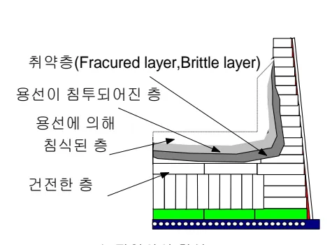
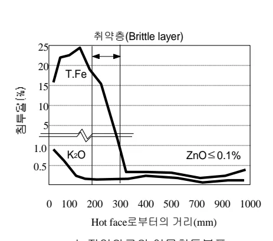
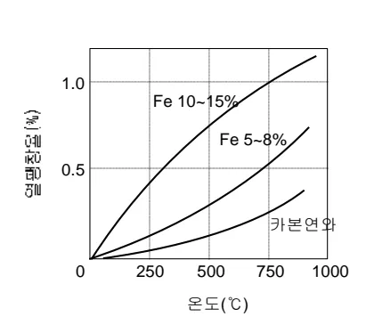
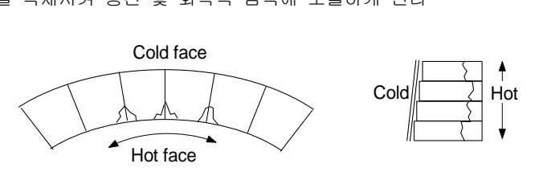
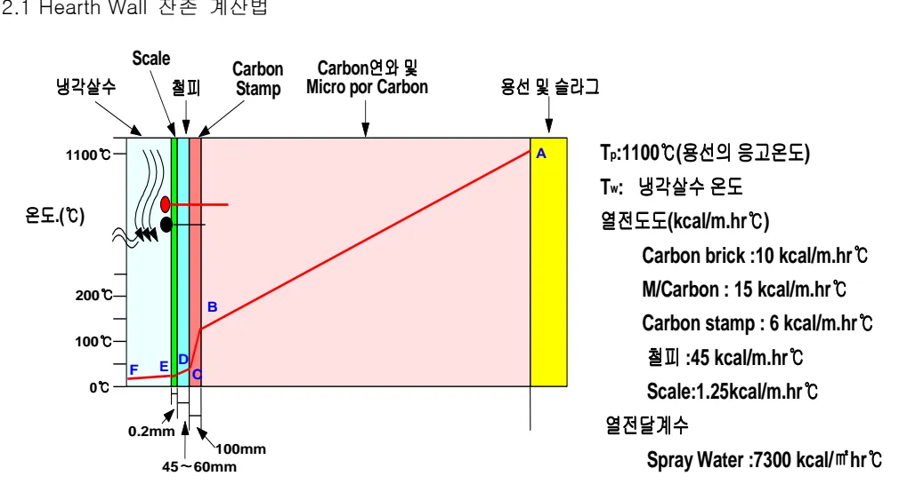

<!-- 페이지번호: 1, 파일명: 노저연와 침식기구 및 잔존 계산법 기준 -->
# 1. 적용범위
# 1 적용범위

고로본체의 노저연와 침식에 대한 침식 메커니즘 및 침식 판단과 잔존의 계산에 대하여 적용한다

# 2 목 적

노체의 장수명화를 위하여 노저의 침식 메커니즘과 잔존계산 방법을 정립하므로서 노저 침식현상을 정확히 판단하고 기술적인 노저관리를 위함

# 3 중점관리 항목 : 해당사항 없음

# 4 조업기준 : 해당사항 없음

# 5 이상판단 및 조치기준 : 해당사항 없음

# 6 기술이론

## 6.1 노저연와의 침식 기구

### 6.1.1 주요 노저연와 침식기구

#### 가. 용선 유동에 의한 기계적인 침식: 노저 코너부에 주로 발생

#### 나. 용선 침투로 비중차에 의한 연와부상: Hearth Bottom 중심부에서 발생

#### 다. Carbon 연와 조직변화에 의한 침식: 기공내 화학 및 물리적 반응에 의한 침식

#### 라. 열 확산에 의한 침식: Fe-C 상태도의 공정 온도인 1153°C 부근에서 발생

#### 마. 알카리에 의한 침식: Carbon 연와 기공으로 침투된 알카리 화합물의 체적 팽창

#### 바. Zn에 의한 침식: 풍구 하부로 부터 출선구 부근의 균열부 및 부착물 계면 등에 발생

#### 사. 열응력에 의한 침식: Carbon 연와의 큰 온도구배 형성시 열응력에 의한 균열, 파괴

### 6.1.2 노저 해체조사에 의한 노저 침식 진행과정 분석

노저 침식 진행 과정을 관찰한 결과 용선이 약 1μm pores에 도달할 때까지 카본연와에 침투한다

이로인해 카본연와의 강도가 저하되고

용선의 침투가 증가됨에 따라 카본연와가 Grapite로 상변태가 된다

이 Grapite가 침투된 용선속에 용해되어 있는 영산과 접촉하면 카본연와는 원형을 유지하지 못하고 작은 조각으로 부스러진다

<노저연와의 침식 Profile>

<!-- 페이지번호: 2, 파일명: 노저연와 침식기구 및 잔존 계산법 기준 -->

이 부스러진층(Fractured layer)으로 다량의

용선이 침투되고, 상대적으로 소량만이 방출

되어 카본연와의 침식이 지속된다 또한 부스러진 층으로 Zinc 와 Alkali 가 침적되어

카본연와의 결합구조를 파괴시켜 카본연와의 강도와 내열 충격성을 저하 시킨다

침투된 용선은 카본연와의 구조를 파괴 시키며, 용선 침투량 증가에 따라 카본 연와의 열 팽창율이 증가된다

특히 화학적 침식인 산화 및 알카리, Zinc 에 의한 침식은 그 반응이 870 ~ 1100 °C 구간에서 발생 되므로 건전층과 Hot face 의 중간층인 취약층(Fracture layer)에서 발생한다

취약층(Brittle layer)

Y-axis: 취약층 침투율(%)

X-axis: Hot face로부터의 거리(mm)

Graph showing T.Fe and K₂O concentration profiles, and ZnO ≤ 0.1%.

<노저연와로의 이물침투분포>

Y-axis: 열팽창율(%)

X-axis: 온도(°C)

Graph showing thermal expansion rates for Fe 10~15%, Fe 5~8%, and 카본연와 (Carbon Graphite).

<용선침투에의한 카본연와의 열팽창>

<!-- 페이지번호: 3, 파일명: 노저연와 침식기구 및 잔존 계산법 기준 -->
노저연와 침식 원인 및 기구

① 용선에 의한 침식 ② 취약층 형성

<table><thead><tr><th></th><th>모식도</th><th>현상</th></tr></thead><tbody><tr><th>I</th><td></td><td>카본연와의 기공 (Pores) 내로 용선침투</td></tr><tr><th>II</th><td></td><td>결합재의 용해에 의한 연와결합 구조 파괴</td></tr><tr><th>III</th><td></td><td>분리된 연와가 모재로부터 이탈 → 연와침식</td></tr></tbody></table>
<a href="components/TP-030-090-070 노저연와 침식기구 및 잔존 계산법 기준(Rev.8)_0900bf4ba7a466ad_usr0000bf4b95f9e446_p003_table_01.png">Table snapshot</a>

<table><thead><tr><th></th><th>모식도</th><th>현상</th></tr></thead><tbody><tr><th>I</th><td></td><td>카본연와 기공으로 용선침투</td></tr><tr><th>II</th><td></td><td>결합구조파괴 → 미세균열발생</td></tr><tr><th>III</th><td></td><td>동일온도구배에서 연와길이저하로 열팽창차이가 증가하여, 연와가 취약해지고 균열이 발생</td></tr><tr><th>IV</th><td></td><td></td></tr><tr><th>V</th><td></td><td>분쇄되거나 탈락되는 부분 발생</td></tr></tbody></table>
<a href="components/TP-030-090-070 노저연와 침식기구 및 잔존 계산법 기준(Rev.8)_0900bf4ba7a466ad_usr0000bf4b95f9e446_p003_table_02.png">Table snapshot</a>

노저연와 침식 진행도>

I 단계) 카본연와의 기공속으로 용선이 침투한다

- 일반적으로 용선이 약 20% 정도 침투

II 단계) 용선에의해 침식이 진행과 동시에 침투가 지속 진행된다.

- 용선에의한 침식이 결합구조(Matrix)에서 최초발생하여 지속 진행됨

- 용선침투에 의해 카본연와 구조(Structure)가 파괴되고 침식이 증대된다.

- 카본연와에 침투된 용선의 응고 및 재용융이 반복됨에 따라 연와에 미세균열을 발생시키고, 기계적 강도를 저하시킨다.

III 단계) 노저철피쪽의 냉각효과에 의해 용선의 침투가 중단된다.

IV 단계) 노내측의 온도변화와 용선침투지역과 건전층의 전단응력(Shearing force)의 차이 발생 용선이 침투된 영역의 열팽창율이 증가(그림 9.2.3)

<!-- 페이지번호: 4, 파일명: 노저연와 침식기구 및 잔존 계산법 기준 -->

V 단계) 노내측의 연와조각이 변형됨 → 용선침투 → 경계면의 분화 또는 분리 Zinc 와 알카리의 침적이 분화 분리를 촉진시킴

제 1 항 Hearth Bottom

Hearth Bottom 연와의 경우 주로 연와간의 연결 부위로 용선이 침투하여 소실된다 이론상 노 저판부 수냉 System 이 없을경우 콘크리트 기초(Foundation)의 온도가 1000°C 까지 상승하여 열화에 의한 강도 저하로 변형이 발생할수 있어 노저 바닥부의 등온선을 Bottom 상부로 올리기 위해 Bottom 연와 입적과 콘크리트 기초 사이에 고 열 전도도 의 Grapite 연와를 채용하고 그 밑에 물에 의한 노 저판부 수냉을 실시한다

제 2 항 Hearth Wall

Hearth Wall 의 침식은 주로 열 팽창 흡수력의 부족(Lack of thermal expansion relief), 노벽 으로 부터의 높은 온도 구배(High Thermal Graients across the wall block), 정도가 다른 열 팽창 간의 적응 불능(Inability to accommodate differential thermal expansion) 로 인해 연와에 균열이 발생하고 용선 침투에 의한 물리적 및 화학적 침식이 발생한다 특히 정도가 다른 열 팽창 간의 적응 불능의 경우는 노내측(Hot Face)과 철피측(Cold Face) 간에 온도차에 의한 다른 열 팽창율로 인해 연와가 구부러 지거나 휘어짐이 발생하고 이로 인해 연와간의 고정 부위에 응력 집중과 균열이 발생된다 이렇게 발생된 균열층은 공기층 (Air Gap) 역할을 제공하여 카본 연와의 열전달 기능을 급격히 저하시켜 노내측에서 부착층 형성을 억제시켜 용선 및 화학적 침식에 노출하게 된다

<그림5 카본연와의 열팽창차이에 의한 균열현상>

뒷 장 계 속

<!-- 페이지번호: 5, 파일명: 노저연와 침식기구 및 잔존 계산법 기준 -->

<부위별 노저연와 침식 기구 비교>

<table><thead><tr><th>침식기구</th><th>노저바닥 (Bottom Pad)</th><th>노저코너 (Pad/Wall Interface)</th><th>출선구주위 (Tap Hole Zone)</th><th>노벽부 (Hearth Wall)</th><th>풍구주위 (Tuyere Zone)</th><th>비고</th></tr></thead><tbody><tr><td>열 부하 (Heat Load)</td><td>대</td><td>대</td><td>중</td><td>중</td><td>대</td><td></td></tr><tr><td>열 충격 (Thermal Shock)</td><td>소</td><td>소</td><td>대-중</td><td>대</td><td>대</td><td></td></tr><tr><td>기계적 충격 (Mechanical Stress)</td><td>소</td><td>대</td><td>대</td><td>대-중</td><td>중</td><td></td></tr><tr><td>알카리/Zinc 침식 (Alkali/Zinc Attack)</td><td>중</td><td>대-중</td><td>대-중</td><td>대</td><td>중-소</td><td></td></tr><tr><td>슬라그 침식 (Slag Attack)</td><td>소</td><td>소</td><td>대-중</td><td>대</td><td>중</td><td></td></tr><tr><td>침식 (Erosion)</td><td>중-소</td><td>대-중</td><td>대</td><td>중</td><td>대</td><td></td></tr><tr><td>산화 (Oxidation)</td><td>소</td><td>소</td><td>대-중</td><td>대</td><td>대</td><td></td></tr><tr><td>용선의 압력 (Pressure)</td><td>대</td><td>대</td><td>대</td><td>중-소</td><td>대</td><td></td></tr></tbody></table>
<a href="components/TP-030-090-070 노저연와 침식기구 및 잔존 계산법 기준(Rev.8)_0900bf4ba7a466ad_usr0000bf4b95f9e446_p005_table_01.png">Table snapshot</a>

뒷 장 계속

<!-- 페이지번호: 6, 파일명: 노저연와 침식기구 및 잔존 계산법 기준 -->
## 3.2 노지연와 잔존 계산법

### 3.2.1 Hearth Wall 잔존 계산법

Figure illustrating the cross-section of a Hearth Wall and associated temperature distribution.

Components (left to right):
<ul><li>냉각살수 (Cooling water)</li><li>Scale</li><li>철피 (Iron plate)</li><li>Carbon Stamp</li><li>Carbon연와 및 Micro por Carbon (Carbon hearth and Micro porous Carbon)</li><li>용선 및 슬라그 (Slag and Slag line)</li></ul>
Temperature Scale (온도 (°C)): 0°C, 100°C, 200°C, 1100°C.

Dimensions: 0.2mm, 45~60mm, 100mm.

Temperature Conditions:
<ul><li>T_p: 1100°C (Slag line temperature)</li><li>T_w: Cooling water temperature</li><li>Heat Transfer Coefficients (kcal/m.hr°C):</li><ul><li>Carbon brick: 10</li><li>M/Carbon: 15</li><li>Carbon stamp: 6</li><li>철피: 45</li><li>Scale: 1.25</li></ul><li>Heat Transfer Coefficient (열전달계수): Spray Water: 7300 kcal/m² hr°C</li></ul>

<math display="block">[((1100 - 현재의 냉각살수 온도))/((1/HW + L1/λ₁ + L2/λ₂ + L3/λ₃ + L4/λ₄ + L5/λ₅))] = [((현재 T/C 온도 - 현재 냉각살수 온도))/((1/HW + L1/λ₁ + L2/λ₂ + L3/λ₃ + L4/λ₄ + LX/λ₅))]</math>

※ 최고 온도시의 잔존 계산시는 응고층이 없으므로 L5는 없고 L4까지만 계산

{범례}

Hw = 냉각수 전열계수 (7300 Kcal/m².H.°C)

l1 = Scale 두께, λ1 = Scale 열전도율 (1.25 Kcal/m.hr.°C)

l2 = 철피 두께, λ2 = 철피 열전도율 (45 Kcal/m.hr.°C)

l3 = Carbon Stamp 두께, λ3 = Carbon Stamp 열전도율 (6 Kcal/m.hr.°C)

l4 = Carbon 연와 잔존, λ4 = Carbon 연와 열전도율 (10 ~ 15 Kcal/m.hr.°C)

l5 = 응고층 두께, λ5 = 응고층 열전도율 (2 Kcal/m.hr.°C)

lX = Thermocouple 삽입길이 (100mm ~ 250mm)

<!-- 페이지번호: 7, 파일명: 노저연와 침식기구 및 잔존 계산법 기준 -->
### 3.2.2 Hearth Bottom 잔존 계산법

Diagram showing a vertical cross-section with four horizontal lines labeled T_p, T₁, T₂, and T₃ from top to bottom. The segments between T_p and T₁, T₁ and T₂, and T₂ and T₃ are labeled l x (λ 3), l 2 (λ 2), and l 1 (λ 1) respectively.

Q = Δ T 에서

<math display="block">Q = [(λ 1)/(l 1)] (T₂ - T₃) = [(λ 2)/(l 2)] (T₁ - T₂) = [(λ 3)/(l x)] (T_p - T₁)</math>

- '끝.' -

이 하 여 백
