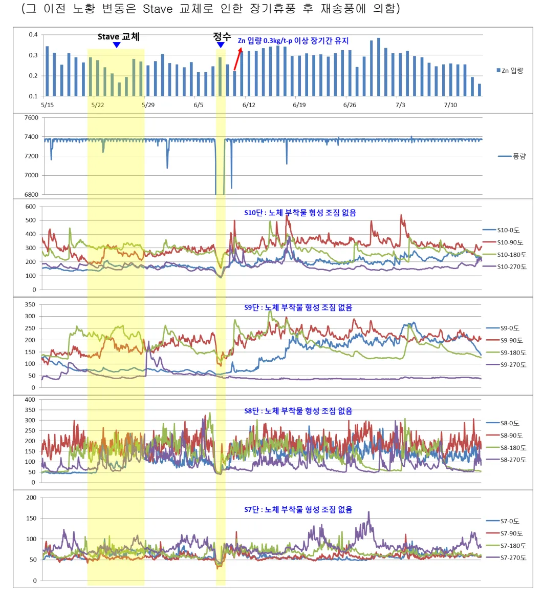
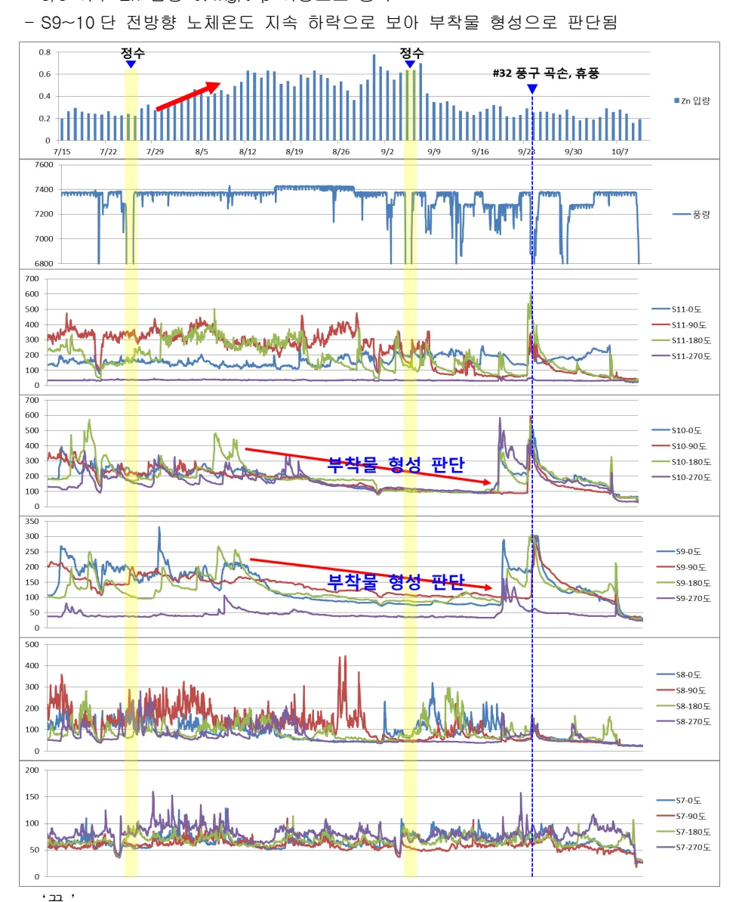

<!-- 페이지번호: 1, 파일명: Zn Alkali 입량 관리기준 -->
# 1. 적용범위

Zn 및 Alkali 의 노체 내에서 미치는 영향과 장입되는 량의 관리기준에 대하여 적용한다

# 2. 목적

Zn 과 Alkali 가 장입 연, 원료에 함유되어 노내로 들어오게 되면 노외 배출이 상당히 어렵고 노내에서 채류하면서 기화와 응축의 순환을 거듭 하면서 노벽 및 장입물에 흡착되어 노황 불량과 노체 수명을 단축 시키는 요인이 된다

따라서 적극적인 입량 제어 관리로서 차기에 발생되는 문제를 사전에 예방하기 위함

# 3. 중점 관리항목

<table><tbody><tr><td>품질영향인자</td><td>공정영향인자</td></tr><tr><td>[Si], [S]</td><td>풍압, 노열</td></tr></tbody></table>
<a href="components/TP-030-090-110 Zn Alkali 입량 관리기준(Rev.11)_0900bf4baaeef1aa_usr0000bf4b95f9e446_p001_table_01.png">Table snapshot</a>

# 4. 조업기준

## 4.1 조업관리기준

### 4.1.1 Zn 관리방안

#### 가. Zn 입량 제어

고로 입량 규제 및 고로 장입 연, 원료의 적정 사용을 위한 사용계획 수립으로 일시적인 상승 최소화 실시

#### 나. 고로별 Zn 장입 관리기준 ('22년 노체불활성 실적 바탕으로 기준 개정)

<table><thead><tr><th colspan="4">냉각반 고로</th></tr><tr><th></th><th>2 고로</th><th>3 고로</th><th>4 고로</th></tr></thead><tbody><tr><td>Zn 장입 기준</td><td colspan="3">0.20 kg/t-p 이하</td></tr></tbody></table>
<a href="components/TP-030-090-110 Zn Alkali 입량 관리기준(Rev.11)_0900bf4baaeef1aa_usr0000bf4b95f9e446_p001_table_02.png">Table snapshot</a>

* Stave 고로의 경우, Zn 장입 기준 0.40kg/t-p 이하

- 4 고로 3 대기('10.10.08~'24.02.22) : Stave 고로

#### 다. Zn 배출강화

조업방법 변경(노정온도 상승, 노정 H2 % 함량 저하)에 의한 Zn 배출은 고 생산성, 고 PCI 조업, 저[Si] 조업 하에서는 곤란 하다고 본다 그러나 노정압 상향 조업에 의한 출선구를 통한 배출은 유리하다고 판단됨

<!-- 페이지번호: 2, 파일명: Zn Alkali 입량 관리기준 -->
### 4.1.2 Zn에 의한 고로의 부착물 생성 Mechanism

<b>부착물 생성</b>

장입 100%, 배출 90%

<b>노벽부 저유속/저온 구역에서</b> ZnO(s) 및 장입물 Dust 정체 ↓ - 노벽의 내화물/ZnO/Dust가 상호반응하여 Scaffold 형성

[Scaffold] 2Zn + SiO₂ → 2ZnO + SiO₂ ZnO + Al₂O₃ → ZnO · Al₂O₃ ZnO + FeO · SiO₂ → ZnO · SiO₂ + FeO - 장입물중 K₂O, Na₂O 성분이 자용점화 촉진 - Carbon deposition 반응 촉매 역할

<b>Zn(g)의 응축에 의한 부착물</b> - 노내 통기불량 / Gas 편류시 ZnO(s)로 전환하지 못한 Zn(g)가 급격한 냉각에 의해 응축 - Zn(g) 응축온도 : 520 ~ 580°C

<b>Zn 거동</b>

<b>Dust 배출</b> 노정상부 고유속 지역

<b>순환 20배속</b>

<b>1,100°C 이상</b> ZnO(s) + CO → Zn(g) + CO₂ ZnO(s) + C → Zn(g) + CO

<b>1,100°C 이하</b> Zn(g) + CO₂ → ZnO(s) + CO

<b>Zn(s) 상승</b>

<b>ZnO(s) 상승</b>

배출 10%

노내 순환

배출 10%

뒷 장 계 속

<!-- 페이지번호: 3, 파일명: Zn Alkali 입량 관리기준 -->
### 4.1.2 Alkali 관리방안

#### 가. Alkali 입력제어

고로 입력 규제 및 장입 연, 원료의 적정 사용을 위한 사용계획 수립으로 일시적인 상승을 최소화(장입 Alkali 관리 기준: 2.50 Kg/T-P 이하)

##### 나. Alkali 배출강화

조업방법 변경(노정온도 상승, Slag Vol 증가, Slag C/S 저하)에 의한 Alkali 배출은 고 생산성 고 PCI 조업, 저[Si] 조업 하에서는 곤란함. 그러나 노정암 상향 조업에 의한 출선구를 통한 배출은 유리 하다고 판단됨

◦형석(CaF₂)투입: 노정 Gas 중 Alkali 의 증기화에 유리하고 Alkali 불화물로서 제거가능, Slag 의 용점을 저하시켜 부착물의 제거에 효과 있음

##### ◦노내 Alkali 배출을 용이하게 하기위한 Action

<table><tbody><tr><td>Slag 중 SiO₂, Vol 증대</td><td>K+ 와 친화력 증대 및 반응면적 증가</td></tr><tr><td>Slag 중 C/S 저하</td><td>CaO 상승시 Ca++ 이온이 K+ 와 Silicate 계 결합을 억제</td></tr><tr><td>복합 염기도 저하</td><td>SiO₂ 역할을 대체할수 있는 Al₂O₃, TiO₂ 증가시 배출용이</td></tr><tr><td>노열저하</td><td>Slag 온도 증가시 Silicate 계 파괴로 Alkali 배출불리 (노열 상승시 용선중 [Si] 상승으로 Slag 염기도 상승)</td></tr><tr><td>노정암 상향</td><td>노정암 증가는 노구로의 배출은 불리하나 노하부로 밀쳐내는 효과로 출선구 배출 증가 및 노하부 촉적</td></tr></tbody></table>
<a href="components/TP-030-090-110 Zn Alkali 입량 관리기준(Rev.11)_0900bf4baaeef1aa_usr0000bf4b95f9e446_p003_table_01.png">Table snapshot</a>

뒷 장 계속

<!-- 페이지번호: 4, 파일명: Zn Alkali 입량 관리기준 -->
### 4.1.3 Zn 및 Alkali 관리기준

<table><thead><tr><th>관리기준</th><th colspan="3">Alkali</th><th colspan="3">Zn</th></tr></thead><tbody><tr><td>고로입량(Kg/T-P)</td><td colspan="3">2.50</td><td colspan="3">2~4 고로 : 0.20</td></tr><tr><td>소결광</td><td colspan="3">1.35</td><td colspan="3">0.16</td></tr><tr><td>광석비</td><td colspan="3">1.670</td><td colspan="3">1.670</td></tr><tr><td>소결광비(%)</td><td>75</td><td>80</td><td>85</td><td>75</td><td>80</td><td>85</td></tr><tr><td>소결광 중 점유비(%)</td><td>0.108</td><td>0.101</td><td>0.095</td><td>0.0128</td><td>0.0120</td><td>0.0113</td></tr></tbody></table>
<a href="components/TP-030-090-110 Zn Alkali 입량 관리기준(Rev.11)_0900bf4baaeef1aa_usr0000bf4b95f9e446_p004_table_01.png">Table snapshot</a>

# 5 이상판단 및 조치기준 : 해당사항 없음

# 6 기술이론

## 6.1 Zn 및 Alkali 의 이화학적 특성

<table><thead><tr><th rowspan="2">구분</th><th colspan="6">Alkali 금속(1a 족)</th><th colspan="7">Alkali 화합물(규산염, 시안화물, 탄산염, 산화물)</th></tr><tr><th>Li</th><th>Na</th><th>K</th><th>Rb</th><th>Cs</th><th>Na₂SiO₃</th><th>K₂SiO₃</th><th>NaCN</th><th>KCN</th><th>Na₂CO₃</th><th>K₂CO₃</th><th>Na₂O</th><th>K₂O</th></tr></thead><tbody><tr><td>용점</td><td>179</td><td>97.9</td><td>63.6</td><td>38.5</td><td>28.5</td><td>1089</td><td>977</td><td>562</td><td>622</td><td>850</td><td>901</td><td>1132</td><td>-</td></tr><tr><td>沸点</td><td>1336</td><td>883</td><td>760</td><td>700</td><td>670</td><td>-</td><td>-</td><td>1530</td><td>1625</td><td>-</td><td>-</td><td>-</td><td>881</td></tr><tr><td>비중</td><td>0.53</td><td>0.97</td><td>0.86</td><td>1.55</td><td>1.87</td><td></td><td></td><td></td><td></td><td></td><td></td><td></td><td></td></tr></tbody></table>
<a href="components/TP-030-090-110 Zn Alkali 입량 관리기준(Rev.11)_0900bf4baaeef1aa_usr0000bf4b95f9e446_p004_table_02.png">Table snapshot</a>

<table><thead><tr><th>구분</th><th>Zn 금속</th><th>Zn 화합물</th></tr></thead><tbody><tr><td>용점</td><td>419.7</td><td>-ZnO, ZnO.Fe₂O₃</td></tr><tr><td>沸点</td><td>907</td><td>-ZnS, -ZnCO₃</td></tr><tr><td>비중</td><td>7.14</td><td>-2ZnO.SiO₂(용점:1520 °C), 2(Fe.Ca.Zn).SiO₂</td></tr></tbody></table>
<a href="components/TP-030-090-110 Zn Alkali 입량 관리기준(Rev.11)_0900bf4baaeef1aa_usr0000bf4b95f9e446_p004_table_03.png">Table snapshot</a>

고로내에서 3 상으로 존재하며 Alkali 금속은 용점이 낮고 음이온과 전화력이 강해 금속 반응성이 크다

<!-- 페이지번호: 5, 파일명: Zn Alkali 입량 관리기준 -->

(Cs > Rb > K > Na > Li)

주] Na: Sodium, K: Potassium, Rb: Rubidium

## 6.2 Alkali 가 고로 내에서 미치는 영향

<table><thead><tr><th></th><th>노내에서 미치는 영향</th></tr></thead><tbody><tr><td>부착물의 생성 및 성장</td><td>○ Alkali 화합물(시안화물, 탄산염)에 의한 부착물 생성 ○ 부착물에 의한 장입물 강하물량 발생(Slip, Hanging 등)</td></tr><tr><td>Coke 의 분화</td><td>○ Coke crack 부위에 Alkali 응축으로 Coke 박리 및 분화 촉진 ○ Alkali 화합물은 Solution Loss 반응의 촉매작용으로 Coke 강도를 열화</td></tr><tr><td>광석층의 통기성 저하</td><td>○ 산성 Pellet 중에 Alkali 응축시 이상 팽창을 유발함 ○ 소결광의 환원분화 및 고착에 의한 기공 저하로 통기성 저해</td></tr><tr><td>Hearth 온도저하</td><td>○ 순환 Alkali 의 반응시 반응열 소비로 Hearth 온도 저하</td></tr><tr><td>내화연와의 손상</td><td>○ Alkali 화합물이 냉각반과 연와 사이로 침투하여 연와중의 산화물을 환원시켜 연와 파괴 ○ Alkali 증기는 CO 와 연와중의 실리카와 반응하여 Free 규산염 생성 ○ Alkali 화합물이 Gas 또는 액체 상태로 Carbon 연와 내에 침투하여 응고 팽창 실시 ○ Carbon 연와에서 탄산염의 석출과 분해가 반복되어 연와파괴</td></tr></tbody></table>
<a href="components/TP-030-090-110 Zn Alkali 입량 관리기준(Rev.11)_0900bf4baaeef1aa_usr0000bf4b95f9e446_p005_table_01.png">Table snapshot</a>

## 6.3 Zn 가 고로내에서 미치는 영향

### 6.3.1 부착물 형성

노내에 장입된 Zn 은 융점이 낮기 때문에 융착대 상부에서 거의 융융, 휘발되어 노정 Gas 를 통해서 배출되나 노정 온도가 낮을 경우 노상부에 응축된 후 노벽에 부착되어 부착물을 형성하게 된다

### 6.3.2. 고로 조업에 미치는 영향

#### 가. 장입물 강하 불안정

노벽에 형성된 부착물에 의해 장입물 강하 불량으로 Slip, Hanging 등을 유발하게 된다. 즉 고로는 장입물 강하시 승온에 의한 팽창, 융융에 의한 수축에 적합하도록 Shaft, Belly, Bosh 부분 이 설계되어 있는데, 부착물의 형성은 이러한 상황을 불균형으로 만든다.

<!-- 페이지번호: 6, 파일명: Zn Alkali 입량 관리기준 -->
#### 나. 생산량 저하

부착물로 인하여 유효내용적을 감소시켜 생산량 저하를 유발하게 된다

#### 다. 용선 및 품질의 불안정

Gas 류 및 장입물 강화 불안정은 노황 불안정을 초래하게 되고 용선 성분 불안정을 유발한다 이때 조업자는 노황 안정을 위해 정확한 장입물의 보상을 해야된다

#### 라. Dust 발생량 증가

부착물이 형성된 고로는 Dust 발생량이 증가하게 되는데 그 이유는 Shaft 부의 유효 내용적 감소로 Bosh Gas 가 압축되고 부착물 부위를 통과하는 Gas 의 유속이 증가하기 때문이다 또한 소용돌이 상태의 Gas 흐름과 노정온도의 상승으로 다량의 Dust 가 생성되어 노외로 배출 된다 Dust 발생 및 노정온도의 상승은 노정 설비와 Gas 청정 설비의 손상을 초래할 수 있다

#### 마. 연료비의 증가

Dust 중 Carbon % 증가 및 Dust 발생량 증가, 용선 품질 변동에 의한 열보상, 노정온도 상승 및 nCO 감소 등으로 연료비가 증가 한다

### 6.3.3 Zn 배출에 미치는 영향

#### 가. 노정온도

Zn 가 증기 상태로 노정으로 상승할 수 있기 때문에 노정에서 Zn 의 증기압은 노정온도에 의해 영향을 받는다 연구 결과에 의하면 노정온도 100°C 상승시 Zn 의 증기압은 1000 배로 상승 한다 따라서 노정 온도의 상승은 Zn 의 배출을 용이하게 한다

#### 나. 노정압

Zn은 기체로 노정에 존재할 수 있으므로 Gas 법칙을 적용할 수 있다 일정한 Zn의 증기압 하 에서 Zn의 무게는 노정압에 반비례 한다 따라서 노정압을 높이는 것은 노내 순환 Zn 량을 증가시키고 순환 Cycle 을 하부로 움기는 경향이 있다

#### 다. 노정 Gas 중 H2%

노정 Gas 중 H2%를 증가시킬 경우 고로 잔류 Zn 량은 증가된다. 따라서 Input H2 량 저하는 Zn 배출에 도움을 줄 수 있다.

#### 라. 노정 Gas 중 Dust 발생량

Zn 는 응축된 증기의 입자로서 노정에 존재할 수 있기 때문에 Dust 발생량의 감소는 Zn 배출에 악영향을 미칠 수 있다.

<!-- 페이지번호: 7, 파일명: Zn Alkali 입량 관리기준 -->
#### 마. 장입물과의 반응

Zn 가 노내 순환중 노정에서 CO2 에 의해 산화되고, 강하하면서 환원되므로 광석 환원을 저해하는 경향이 있다. 따라서 다량의 Zn 노내 침적, 순환은 광석의 환원 능력을 약화시킬 수 있다.

## 6.4 고로하부 Scab 생성기구 및 대책

### 6.4.1 Scab 생성기구

Flowchart illustrating the causes of Scab formation in the blast furnace hearth (Scab Generation Mechanism):
<ul><li>High SR (고로 SR 증가) leads to Increased Input Alkali (↑ Input Alkali).</li><li>Input Alkali (↑) leads to Increased Alkali Vapor Production (↑ Alkali Vapor 발생량 증가).</li><li>Increased Alkali Vapor Production (↑) leads to Increased Alkali Dust Circulation (↑ Alkali 노내 순환량 증가).</li><li>Alkali Dust Circulation (↑) leads to Hearth Scab Formation (노하부 Scab 생성).</li><li>Increased Ore Outside (Ore 외진조업) leads to Increased Ore in the Furnace (↑ 노벽부 Ore 증후).</li><li>Increased Ore in the Furnace (↑) leads to Slag Erosion (↑ 주변류 역제).</li><li>Slag Erosion (↑) leads to Increased Slag Erosion (Increased Slag Erosion).</li><li>Increased Slag Erosion leads to Increased Slag Erosion (Increased Slag Erosion).</li><li>Increased Slag Erosion leads to Increased Slag Erosion (Increased Slag Erosion).</li><li>Increased Slag Erosion leads to Increased Slag Erosion (Increased Slag Erosion).</li><li>Increased Slag Erosion leads to Increased Slag Erosion (Increased Slag Erosion).</li><li>Increased Slag Erosion leads to Increased Slag Erosion (Increased Slag Erosion).</li><li>Increased Slag Erosion leads to Increased Slag Erosion (Increased Slag Erosion).</li><li>Increased Slag Erosion leads to Increased Slag Erosion (Increased Slag Erosion).</li><li>Increased Slag Erosion leads to Increased Slag Erosion (Increased Slag Erosion).</li><li>Increased Slag Erosion leads to Increased Slag Erosion (Increased Slag Erosion).</li><li>Increased Slag Erosion leads to Increased Slag Erosion (Increased Slag Erosion).</li><li>Increased Slag Erosion leads to Increased Slag Erosion (Increased Slag Erosion).</li><li>Increased Slag Erosion leads to Increased Slag Erosion (Increased Slag Erosion).</li><li>Increased Slag Erosion leads to Increased Slag Erosion (Increased Slag Erosion).</li><li>Increased Slag Erosion leads to Increased Slag Erosion (Increased Slag Erosion).</li><li>Increased Slag Erosion leads to Increased Slag Erosion (Increased Slag Erosion).</li><li>Increased Slag Erosion leads to Increased Slag Erosion (Increased Slag Erosion).</li><li>Increased Slag Erosion leads to Increased Slag Erosion (Increased Slag Erosion).</li><li>Increased Slag Erosion leads to Increased Slag Erosion (Increased Slag Erosion).</li><li>Increased Slag Erosion leads to Increased Slag Erosion (Increased Slag Erosion).</li><li>Increased Slag Erosion leads to Increased Slag Erosion (Increased Slag Erosion).</li><li>Increased Slag Erosion leads to Increased Slag Erosion (Increased Slag Erosion).</li><li>Increased Slag Erosion leads to Increased Slag Erosion (Increased Slag Erosion).</li><li>Increased Slag Erosion leads to Increased Slag Erosion (Increased Slag Erosion).</li><li>Increased Slag Erosion leads to Increased Slag Erosion (Increased Slag Erosion).</li><li>Increased Slag Erosion leads to Increased Slag Erosion (Increased Slag Erosion).</li><li>Increased Slag Erosion leads to Increased Slag Erosion (Increased Slag Erosion).</li><li>Increased Slag Erosion leads to Increased Slag Erosion (Increased Slag Erosion).</li><li>Increased Slag Erosion leads to Increased Slag Erosion (Increased Slag Erosion).</li><li>Increased Slag Erosion leads to Increased Slag Erosion (Increased Slag Erosion).</li><li>Increased Slag Erosion leads to Increased Slag Erosion (Increased Slag Erosion).</li><li>Increased Slag Erosion leads to Increased Slag Erosion (Increased Slag Erosion).</li><li>Increased Slag Erosion leads to Increased Slag Erosion (Increased Slag Erosion).</li><li>Increased Slag Erosion leads to Increased Slag Erosion (Increased Slag Erosion).</li><li>Increased Slag Erosion leads to Increased Slag Erosion (Increased Slag Erosion).</li><li>Increased Slag Erosion leads to Increased Slag Erosion (Increased Slag Erosion).</li><li>Increased Slag Erosion leads to Increased Slag Erosion (Increased Slag Erosion).</li><li>Increased Slag Erosion leads to Increased Slag Erosion (Increased Slag Erosion).</li><li>Increased Slag Erosion leads to Increased Slag Erosion (Increased Slag Erosion).</li><li>Increased Slag Erosion leads to Increased Slag Erosion (Increased Slag Erosion).</li><li>Increased Slag Erosion leads to Increased Slag Erosion (Increased Slag Erosion).</li><li>Increased Slag Erosion leads to Increased Slag Erosion (Increased Slag Erosion).</li><li>Increased Slag Erosion leads to Increased Slag Erosion (Increased Slag Erosion).</li><li>Increased Slag Erosion leads to Increased Slag Erosion (Increased Slag Erosion).</li><li>Increased Slag Erosion leads to Increased Slag Erosion (Increased Slag Erosion).</li><li>Increased Slag Erosion leads to Increased Slag Erosion (Increased Slag Erosion).</li><li>Increased Slag Erosion leads to Increased Slag Erosion (Increased Slag Erosion).</li><li>Increased Slag Erosion leads to Increased Slag Erosion (Increased Slag Erosion).</li><li>Increased Slag Erosion leads to Increased Slag Erosion (Increased Slag Erosion).</li><li>Increased Slag Erosion leads to Increased Slag Erosion (Increased Slag Erosion).</li><li>Increased Slag Erosion leads to Increased Slag Erosion (Increased Slag Erosion).</li><li>Increased Slag Erosion leads to Increased Slag Erosion (Increased Slag Erosion).</li><li>Increased Slag Erosion leads to Increased Slag Erosion (Increased Slag Erosion).</li><li>Increased Slag Erosion leads to Increased Slag Erosion (Increased Slag Erosion).</li><li>Increased Slag Erosion leads to Increased Slag Erosion (Increased Slag Erosion).</li><li>Increased Slag Erosion leads to Increased Slag Erosion (Increased Slag Erosion).</li><li>Increased Slag Erosion leads to Increased Slag Erosion (Increased Slag Erosion).</li><li>Increased Slag Erosion leads to Increased Slag Erosion (Increased Slag Erosion).</li><li>Increased Slag Erosion leads to Increased Slag Erosion (Increased Slag Erosion).</li><li>Increased Slag Erosion leads to Increased Slag Erosion (Increased Slag Erosion).</li><li>Increased Slag Erosion leads to Increased Slag Erosion (Increased Slag Erosion).</li><li>Increased Slag Erosion leads to Increased Slag Erosion (Increased Slag Erosion).</li><li>Increased Slag Erosion leads to Increased Slag Erosion (Increased Slag Erosion).</li><li>Increased Slag Erosion leads to Increased Slag Erosion (Increased Slag Erosion).</li><li>Increased Slag Erosion leads to Increased Slag Erosion (Increased Slag Erosion).</li><li>Increased Slag Erosion leads to Increased Slag Erosion (Increased Slag Erosion).</li><li>Increased Slag Erosion leads to Increased Slag Erosion (Increased Slag Erosion).</li><li>Increased Slag Erosion leads to Increased Slag Erosion (Increased Slag Erosion).</li><li>Increased Slag Erosion leads to Increased Slag Erosion (Increased Slag Erosion).</li><li>Increased Slag Erosion leads to Increased Slag Erosion (Increased Slag Erosion).</li><li>Increased Slag Erosion leads to Increased Slag Erosion (Increased Slag Erosion).</li><li>Increased Slag Erosion leads to Increased Slag Erosion (Increased Slag Erosion).</li><li>Increased Slag Erosion leads to Increased Slag Erosion (Increased Slag Erosion).</li><li>Increased Slag Erosion leads to Increased Slag Erosion (Increased Slag Erosion).</li><li>Increased Slag Erosion leads to Increased Slag Erosion (Increased Slag Erosion).</li><li>Increased Slag Erosion leads to Increased Slag Erosion (Increased Slag Erosion).</li><li>Increased Slag Erosion leads to Increased Slag Erosion (Increased Slag Erosion).</li><li>Increased Slag Erosion leads to Increased Slag Erosion (Increased Slag Erosion).</li><li>Increased Slag Erosion leads to Increased Slag Erosion (Increased Slag Erosion).</li><li>Increased Slag Erosion leads to Increased Slag Erosion (Increased Slag Erosion).</li><li>Increased Slag Erosion leads to Increased Slag Erosion (Increased Slag Erosion).</li><li>Increased Slag Erosion leads to Increased Slag Erosion (Increased Slag Erosion).</li><li>Increased Slag Erosion leads to Increased Slag Erosion (Increased Slag Erosion).</li><li>Increased Slag Erosion leads to Increased Slag Erosion (Increased Slag Erosion).</li><li>Increased Slag Erosion leads to Increased Slag Erosion (Increased Slag Erosion).</li><li>Increased Slag Erosion leads to Increased Slag Erosion (Increased Slag Erosion).</li><li>Increased Slag Erosion leads to Increased Slag Erosion (Increased Slag Erosion).</li><li>Increased Slag Erosion leads to Increased Slag Erosion (Increased Slag Erosion).</li><li>Increased Slag Erosion leads to Increased Slag Erosion (Increased Slag Erosion).</li><li>Increased Slag Erosion leads to Increased Slag Erosion (Increased Slag Erosion).</li><li>Increased Slag Erosion leads to Increased Slag Erosion (Increased Slag Erosion).</li><li>Increased Slag Erosion leads to Increased Slag Erosion (Increased Slag Erosion).</li><li>Increased Slag Erosion leads to Increased Slag Erosion (Increased Slag Erosion).</li><li>Increased Slag Erosion leads to Increased Slag Erosion (Increased Slag Erosion).</li><li>Increased Slag Erosion leads to Increased Slag Erosion (Increased Slag Erosion).</li><li>Increased Slag Erosion leads to Increased Slag Erosion (Increased Slag Erosion).</li><li>Increased Slag Erosion leads to Increased Slag Erosion (Increased Slag Erosion).</li><li>Increased Slag Erosion leads to Increased Slag Erosion (Increased Slag Erosion).</li><li>Increased Slag Erosion leads to Increased Slag Erosion (Increased Slag Erosion).</li><li>Increased Slag Erosion leads to Increased Slag Erosion (Increased Slag Erosion).</li><li>Increased Slag Erosion leads to Increased Slag Erosion (Increased Slag Erosion).</li><li>Increased Slag Erosion leads to Increased Slag Erosion (Increased Slag Erosion).</li><li>Increased Slag Erosion leads to Increased Slag Erosion (Increased Slag Erosion).</li><li>Increased Slag Erosion leads to Increased Slag Erosion (Increased Slag Erosion).</li><li>Increased Slag Erosion leads to Increased Slag Erosion (Increased Slag Erosion).</li><li>Increased Slag Erosion leads to Increased Slag Erosion (Increased Slag Erosion).</li><li>Increased Slag Erosion leads to Increased Slag Erosion (Increased Slag Erosion).</li><li>Increased Slag Erosion leads to Increased Slag Erosion (Increased Slag Erosion).</li><li>Increased Slag Erosion leads to Increased Slag Erosion (Increased Slag Erosion).</li><li>Increased Slag Erosion leads to Increased Slag Erosion (Increased Slag Erosion).</li><li>Increased Slag Erosion leads to Increased Slag Erosion (Increased Slag Erosion).</li><li>Increased Slag Erosion leads to Increased Slag Erosion (Increased Slag Erosion).</li><li>Increased Slag Erosion leads to Increased Slag Erosion (Increased Slag Erosion).</li><li>Increased Slag Erosion leads to Increased Slag Erosion (Increased Slag Erosion).</li><li>Increased Slag Erosion leads to Increased Slag Erosion (Increased Slag Erosion).</li><li>Increased Slag Erosion leads to Increased Slag Erosion (Increased Slag Erosion).</li><li>Increased Slag Erosion leads to Increased Slag Erosion (Increased Slag Erosion).</li><li>Increased Slag Erosion leads to Increased Slag Erosion (Increased Slag Erosion).</li><li>Increased Slag Erosion leads to Increased Slag Erosion (Increased Slag Erosion).</li><li>Increased Slag Erosion leads to Increased Slag Erosion (Increased Slag Erosion).</li><li>Increased Slag Erosion leads to Increased Slag Erosion (Increased Slag Erosion).</li><li>Increased Slag Erosion leads to Increased Slag Erosion (Increased Slag Erosion).</li><li>Increased Slag Erosion leads to Increased Slag Erosion (Increased Slag Erosion).</li><li>Increased Slag Erosion leads to Increased Slag Erosion (Increased Slag Erosion).</li><li>Increased Slag Erosion leads to Increased Slag Erosion (Increased Slag Erosion).</li><li>Increased Slag Erosion leads to Increased Slag Erosion (Increased Slag Erosion).</li><li>Increased Slag Erosion leads to Increased Slag Erosion (Increased Slag Erosion).</li><li>Increased Slag Erosion leads to Increased Slag Erosion (Increased Slag Erosion).</li><li>Increased Slag Erosion leads to Increased Slag Erosion (Increased Slag Erosion).</li><li>Increased Slag Erosion leads to Increased Slag Erosion (Increased Slag Erosion).</li><li>Increased Slag Erosion leads to Increased Slag Erosion (Increased Slag Erosion).</li><li>Increased Slag Erosion leads to Increased Slag Erosion (Increased Slag Erosion).</li><li>Increased Slag Erosion leads to Increased Slag Erosion (Increased Slag Erosion).</li><li>Increased Slag Erosion leads to Increased Slag Erosion (Increased Slag Erosion).</li><li>Increased Slag Erosion leads to Increased Slag Erosion (Increased Slag Erosion).</li><li>Increased Slag Erosion leads to Increased Slag Erosion (Increased Slag Erosion).</li><li>Increased Slag Erosion leads to Increased Slag Erosion (Increased Slag Erosion).</li><li>Increased Slag Erosion leads to Increased Slag Erosion (Increased Slag Erosion).</li><li>Increased Slag Erosion leads to Increased Slag Erosion (Increased Slag Erosion).</li><li>Increased Slag Erosion leads to Increased Slag Erosion (Increased Slag Erosion).</li><li>Increased Slag Erosion leads to Increased Slag Erosion (Increased Slag Erosion).</li><li>Increased Slag Erosion leads to Increased Slag Erosion (Increased Slag Erosion).</li><li>Increased Slag Erosion leads to Increased Slag Erosion (Increased Slag Erosion).</li><li>Increased Slag Erosion leads to Increased Slag Erosion (Increased Slag Erosion).</li><li>Increased Slag Erosion leads to Increased Slag Erosion (Increased Slag Erosion).</li><li>Increased Slag Erosion leads to Increased Slag Erosion (Increased Slag Erosion).</li><li>Increased Slag Erosion leads to Increased Slag Erosion (Increased Slag Erosion).</li><li>Increased Slag Erosion leads to Increased Slag Erosion (Increased Slag Erosion).</li><li>Increased Slag Erosion leads to Increased Slag Erosion (Increased Slag Erosion).</li><li>Increased Slag Erosion leads to Increased Slag Erosion (Increased Slag Erosion).</li><li>Increased Slag Erosion leads to Increased Slag Erosion (Increased Slag Erosion).</li><li>Increased Slag Erosion leads to Increased Slag Erosion (Increased Slag Erosion).</li><li>Increased Slag Erosion leads to Increased Slag Erosion (Increased Slag Erosion).</li><li>Increased Slag Erosion leads to Increased Slag Erosion (Increased Slag Erosion).</li><li>Increased Slag Erosion leads to Increased Slag Erosion (Increased Slag Erosion).</li><li>Increased Slag Erosion leads to Increased Slag Erosion (Increased Slag Erosion).</li><li>Increased Slag Erosion leads to Increased Slag Erosion (Increased Slag Erosion).</li><li>Increased Slag Erosion leads to Increased Slag Erosion (Increased Slag Erosion).</li><li>Increased Slag Erosion leads to Increased Slag Erosion (Increased Slag Erosion).</li><li>Increased Slag Erosion leads to Increased Slag Erosion (Increased Slag Erosion).</li><li>Increased Slag Erosion leads to Increased Slag Erosion (Increased Slag Erosion).</li><li>Increased Slag Erosion leads to Increased Slag Erosion (Increased Slag Erosion).</li><li>Increased Slag Erosion leads to Increased Slag Erosion (Increased Slag Erosion).</li><li>Increased Slag Erosion leads to Increased Slag Erosion (Increased Slag Erosion).</li><li>Increased Slag Erosion leads to Increased Slag Erosion (Increased Slag Erosion).</li><li>Increased Slag Erosion leads to Increased Slag Erosion (Increased Slag Erosion).</li><li>Increased Slag Erosion leads to Increased Slag Erosion (Increased Slag Erosion).</li><li>Increased Slag Erosion leads to Increased Slag Erosion (Increased Slag Erosion).</li><li>Increased Slag Erosion leads to Increased Slag Erosion (Increased Slag Erosion).</li><li>Increased Slag Erosion leads to Increased Slag Erosion (Increased Slag Erosion).</li><li>Increased Slag Erosion leads to Increased Slag Erosion (Increased Slag Erosion).</li><li>Increased Slag Erosion leads to Increased Slag Erosion (Increased Slag Erosion).</li><li>Increased Slag Erosion leads to Increased Slag Erosion (Increased Slag Erosion).</li><li>Increased Slag Erosion leads to Increased Slag Erosion (Increased Slag Erosion).</li><li>Increased Slag Erosion leads to Increased Slag Erosion (Increased Slag Erosion).</li><li>Increased Slag Erosion leads to Increased Slag Erosion (Increased Slag Erosion).</li><li>Increased Slag Erosion leads to Increased Slag Erosion (Increased Slag Erosion).</li><li>Increased Slag Erosion leads to Increased Slag Erosion (Increased Slag Erosion).</li><li>Increased Slag Erosion leads to Increased Slag Erosion (Increased Slag Erosion).</li><li>Increased Slag Erosion leads to Increased Slag Erosion (Increased Slag Erosion).</li><li>Increased Slag Erosion leads to Increased Slag Erosion (Increased Slag Erosion).</li><li>Increased Slag Erosion leads to Increased Slag Erosion (Increased Slag Erosion).</li><li>Increased Slag Erosion leads to Increased Slag Erosion (Increased Slag Erosion).</li><li>Increased Slag Erosion leads to Increased Slag Erosion (Increased Slag Erosion).</li><li>Increased Slag Erosion leads to Increased Slag Erosion (Increased Slag Erosion).</li><li>Increased Slag Erosion leads to Increased Slag Erosion (Increased Slag Erosion).</li><li>Increased Slag Erosion leads to Increased Slag Erosion (Increased Slag Erosion).</li><li>Increased Slag Erosion leads to Increased Slag Erosion (Increased Slag Erosion).</li><li>Increased Slag Erosion leads to Increased Slag Erosion (Increased Slag Erosion).</li><li>Increased Slag Erosion leads to Increased Slag Erosion (Increased Slag Erosion).</li><li>Increased Slag Erosion leads to Increased Slag Erosion (Increased Slag Erosion).</li><li>Increased Slag Erosion leads to Increased Slag Erosion (Increased Slag Erosion).</li><li>Increased Slag Erosion leads to Increased Slag Erosion (Increased Slag Erosion).</li><li>Increased Slag Erosion leads to Increased Slag Erosion (Increased Slag Erosion).</li><li>Increased Slag Erosion leads to Increased Slag Erosion (Increased Slag Erosion).</li><li>Increased Slag Erosion leads to Increased Slag Erosion (Increased Slag Erosion).</li><li>Increased Slag Erosion leads to Increased Slag Erosion (Increased Slag Erosion).</li><li>Increased Slag Erosion leads to Increased Slag Erosion (Increased Slag Erosion).</li><li>Increased Slag Erosion leads to Increased Slag Erosion (Increased Slag Erosion).</li><li>Increased Slag Erosion leads to Increased Slag Erosion (Increased Slag Erosion).</li><li>Increased Slag Erosion leads to Increased Slag Erosion (Increased Slag Erosion).</li><li>Increased Slag Erosion leads to Increased Slag Erosion (Increased Slag Erosion).</li><li>Increased Slag Erosion leads to Increased Slag Erosion (Increased Slag Erosion).</li><li>Increased Slag Erosion leads to Increased Slag Erosion (Increased Slag Erosion).</li><li>Increased Slag Erosion leads to Increased Slag Erosion (Increased Slag Erosion).</li><li>Increased Slag Erosion leads to Increased Slag Erosion (Increased Slag Erosion).</li><li>Increased Slag Erosion leads to Increased Slag Erosion (Increased Slag Erosion).</li><li>Increased Slag Erosion leads to Increased Slag Erosion (Increased Slag Erosion).</li><li>Increased Slag Erosion leads to Increased Slag Erosion (Increased Slag Erosion).</li><li>Increased Slag Erosion leads to Increased Slag Erosion (Increased Slag Erosion).</li><li>Increased Slag Erosion leads to Increased Slag Erosion (Increased Slag Erosion).</li><li>Increased Slag Erosion leads to Increased Slag Erosion (Increased Slag Erosion).</li><li>Increased Slag Erosion leads to Increased Slag Erosion (Increased Slag Erosion).</li><li>Increased Slag Erosion leads to Increased Slag Erosion (Increased Slag Erosion).</li><li>Increased Slag Erosion leads to Increased Slag Erosion (Increased Slag Erosion).</li><li>Increased Slag Erosion leads to Increased Slag Erosion (Increased Slag Erosion).</li><li>Increased Slag Erosion leads to Increased Slag Erosion (Increased Slag Erosion).</li><li>Increased Slag Erosion leads to Increased Slag Erosion (Increased Slag Erosion).</li><li>Increased Slag Erosion leads to Increased Slag Erosion (Increased Slag Erosion).</li><li>Increased Slag Erosion leads to Increased Slag Erosion (Increased Slag Erosion).</li><li>Increased Slag Erosion leads to Increased Slag Erosion (Increased Slag Erosion).</li><li>Increased Slag Erosion leads to Increased Slag Erosion (Increased Slag Erosion).</li><li>Increased Slag Erosion leads to Increased Slag Erosion (Increased Slag Erosion).</li><li>Increased Slag Erosion leads to Increased Slag Erosion (Increased Slag Erosion).</li><li>Increased Slag Erosion leads to Increased Slag Erosion (Increased Slag Erosion).</li><li>Increased Slag Erosion leads to Increased Slag Erosion (Increased Slag Erosion).</li><li>Increased Slag Erosion leads to Increased Slag Erosion (Increased Slag Erosion).</li><li>Increased Slag Erosion leads to Increased Slag Erosion (Increased Slag Erosion).</li><li>Increased Slag Erosion leads to Increased Slag Erosion (Increased Slag Erosion).</li><li>Increased Slag Erosion leads to Increased Slag Erosion (Increased Slag Erosion).</li><li>Increased Slag Erosion leads to Increased Slag Erosion (Increased Slag Erosion).</li><li>Increased Slag Erosion leads to Increased Slag Erosion (Increased Slag Erosion).</li><li>Increased Slag Erosion leads to Increased Slag Erosion (Increased Slag Erosion).</li><li>Increased Slag Erosion leads to Increased Slag Erosion (Increased Slag Erosion).</li><li>Increased Slag Erosion leads to Increased Slag Erosion (Increased Slag Erosion).</li><li>Increased Slag Erosion leads to Increased Slag Erosion (Increased Slag Erosion).</li><li>Increased Slag Erosion leads to Increased Slag Erosion (Increased Slag Erosion).</li><li>Increased Slag Erosion leads to Increased Slag Erosion (Increased Slag Erosion).</li><li>Increased Slag Erosion leads to Increased Slag Erosion (Increased Slag Erosion).</li><li>Increased Slag Erosion leads to Increased Slag Erosion (Increased Slag Erosion).</li><li>Increased Slag Erosion leads to Increased Slag Erosion (Increased Slag Erosion).</li><li>Increased Slag Erosion leads to Increased Slag Erosion (Increased Slag Erosion).</li><li>Increased Slag Erosion leads to Increased Slag Erosion (Increased Slag Erosion).</li><li>Increased Slag Erosion leads to Increased Slag Erosion (Increased Slag Erosion).</li><li>Increased Slag Erosion leads to Increased Slag Erosion (Increased Slag Erosion).</li><li>Increased Slag Erosion leads to Increased Slag Erosion (Increased Slag Erosion).</li><li>Increased Slag Erosion leads to Increased Slag Erosion (Increased Slag Erosion).</li><li>Increased Slag Erosion leads to Increased Slag Erosion (Increased Slag Erosion).</li><li>Increased Slag Erosion leads to Increased Slag Erosion (Increased Slag Erosion).</li><li>Increased Slag Erosion leads to Increased Slag Erosion (Increased Slag Erosion).</li><li>Increased Slag Erosion leads to Increased Slag Erosion (Increased Slag Erosion).</li><li>Increased Slag Erosion leads to Increased Slag Erosion (Increased Slag Erosion).</li><li>Increased Slag Erosion leads to Increased Slag Erosion (Increased Slag Erosion).</li><li>Increased Slag Erosion leads to Increased Slag Erosion (Increased Slag Erosion).</li><li>Increased Slag Erosion leads to Increased Slag Erosion (Increased Slag Erosion).</li><li>Increased Slag Erosion leads to Increased Slag Erosion (Increased Slag Erosion).</li><li>Increased Slag Erosion leads to Increased Slag Erosion (Increased Slag Erosion).</li><li>Increased Slag Erosion leads to Increased Slag Erosion (Increased Slag Erosion).</li><li>Increased Slag Erosion leads to Increased Slag Erosion (Increased Slag Erosion).</li><li>Increased Slag Erosion leads to Increased Slag Erosion (Increased Slag Erosion).</li><li>Increased Slag Erosion leads to Increased Slag Erosion (Increased Slag Erosion).</li><li>Increased Slag Erosion leads to Increased Slag Erosion (Increased Slag Erosion).</li><li>Increased Slag Erosion leads to Increased Slag Erosion (Increased Slag Erosion).</li><li>Increased Slag Erosion leads to Increased Slag Erosion (Increased Slag Erosion).</li><li>Increased Slag Erosion leads to Increased Slag Erosion (Increased Slag Erosion).</li><li>Increased Slag Erosion leads to Increased Slag Erosion (Increased Slag Erosion).</li><li>Increased Slag Erosion leads to Increased Slag Erosion (Increased Slag Erosion).</li><li>Increased Slag Erosion leads to Increased Slag Erosion (Increased Slag Erosion).</li><li>Increased Slag Erosion leads to Increased Slag Erosion (Increased Slag Erosion).</li><li>Increased Slag Erosion leads to Increased Slag Erosion (Increased Slag Erosion).</li><li>Increased Slag Erosion leads to Increased Slag Erosion (Increased Slag Erosion).</li><li>Increased Slag Erosion leads to Increased Slag Erosion (Increased Slag Erosion).</li><li>Increased Slag Erosion leads to Increased Slag Erosion (Increased Slag Erosion).</li><li>Increased Slag Erosion leads to Increased Slag Erosion (Increased Slag Erosion).</li><li>Increased Slag Erosion leads to Increased Slag Erosion (Increased Slag Erosion).</li><li>Increased Slag Erosion leads to Increased Slag Erosion (Increased Slag Erosion).</li><li>Increased Slag Erosion leads to Increased Slag Erosion (Increased Slag Erosion).</li><li>Increased Slag Erosion leads to Increased Slag Erosion (Increased Slag Erosion).</li><li>Increased Slag Erosion leads to Increased Slag Erosion (Increased Slag Erosion).</li><li>Increased Slag Erosion leads to Increased Slag Erosion (Increased Slag Erosion).</li><li>Increased Slag Erosion leads to Increased Slag Erosion (Increased Slag Erosion).</li><li>Increased Slag Erosion leads to Increased Slag Erosion (Increased Slag Erosion).</li><li>Increased Slag Erosion leads to Increased Slag Erosion (Increased Slag Erosion).</li><li>Increased Slag Erosion leads to Increased Slag Erosion (Increased Slag Erosion).</li><li>Increased Slag Erosion leads to Increased Slag Erosion (Increased Slag Erosion).</li><li>Increased Slag Erosion leads to Increased Slag Erosion (Increased Slag Erosion).</li><li>Increased Slag E</li></ul>

<!-- 페이지번호: 8, 파일명: Zn Alkali 입량 관리기준 -->
※ Stave 고로 Zn 입력 증가에 따른 노체 부착물 형성 사례

- 4 고로 3대기('10.10.08~'24.02.22) : Stave 고로, 4 고로 4대기('24.06.27~) : 냉각반 고로

○ 4 고로 '16.5/15~7/17

- 6/11 부터 Zn 입력 0.3kg/t-p 이상으로 상승하였으나, 노체 부착물 형성 없음.

(그 이전 노황 변동은 Stave 교체로 인한 장기휴풍 후 재송풍에 의함)

Figure showing Zn input (Stave 교체 to 정수, Zn 입력 0.3kg/t-p 이상 장기간 유지) and Zn input amount (Zn 입력) over time (5/15 to 7/10).

Graphs showing slag flow (풍량) and Zn concentration (Zn 0도, Zn 90도, Zn 180도, Zn 270도) for S10, S9, S8, and S7 furnaces, all indicating no formation of furnace scale (노체 부착물 형성 조짐 없음) after the Zn input increase.

<!-- 페이지번호: 9, 파일명: Zn Alkali 입량 관리기준 -->
○ 4고로 '16.7/15~10/12

- 8/5 이후 Zn 입량 0.4kg/t-p 이상으로 증가

- S9~10 단 전방향 노체온도 지속 하락으로 보아 부착물 형성으로 판단됨

Graph showing Zn input (Zn 입량) and furnace temperature trends from July 15 to October 7, 2016, for 4 High Furnaces.

The top chart shows Zn input (Zn 입량) increasing significantly starting around August 5 (marked by a red arrow), coinciding with a period of high Zn input (정수).

The subsequent charts show furnace temperatures (Furnace Temp) for various locations (S11, S10, S9, S8, S7) and conditions (0도, 90도, 180도, 270도). Vertical lines mark the period of high Zn input (July 22 to August 2) and the shutdown/restart period (August 30 to September 2).

Annotations indicate that temperatures in S10 and S9 locations dropped significantly starting around August 5, suggesting the formation of slag (부착물 형성 판단).

'끝.'

이 하 여 백
