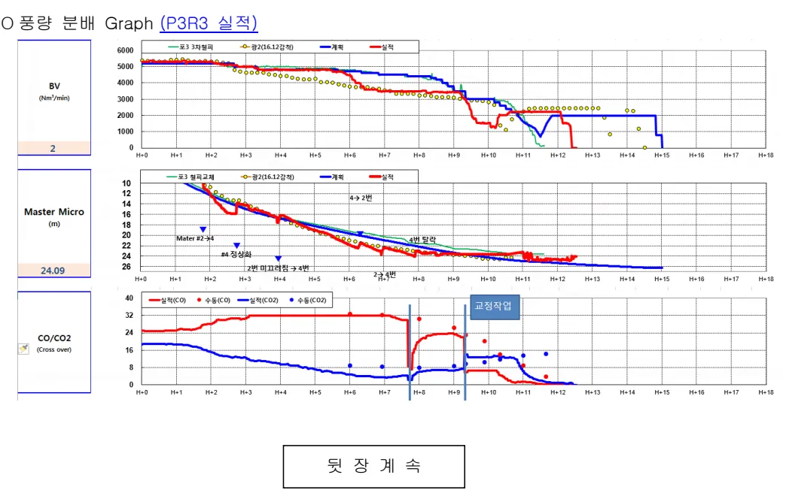
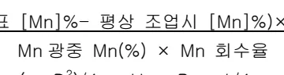
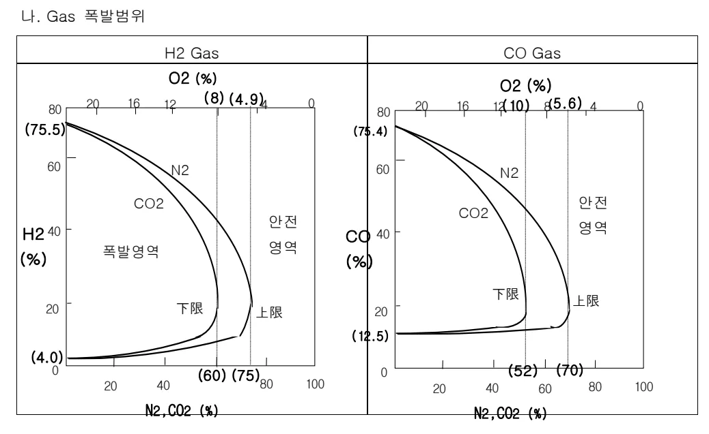
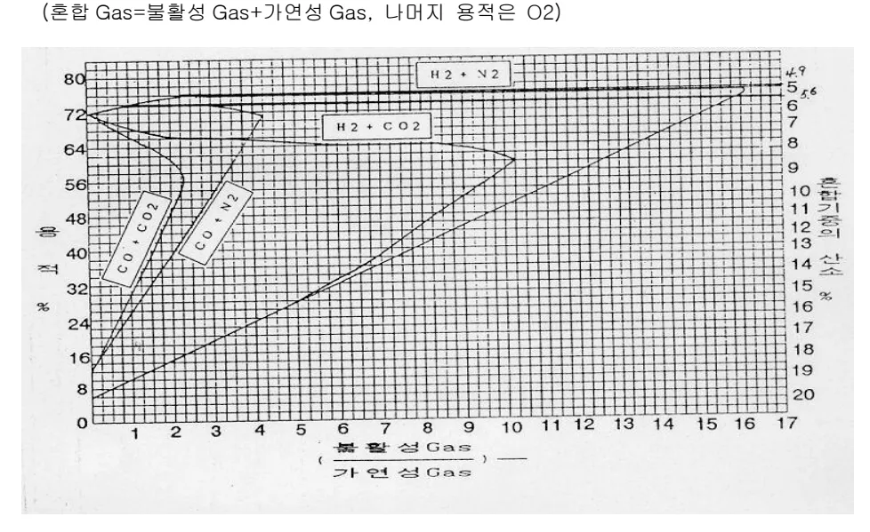

<!-- 페이지번호: 1, 파일명: 감척,종풍 조업기술 기준 -->
# 1. 적용범위

고로의 개수 및 보수에 앞서서 고로조업을 종료시키는 최종 휴풍조업 과정인 감척, 중풍조업에 대하여 적용한다.

# 2. 목적

<ul><li>냉각물량의 감소 및 냉각 소요시간의 단축</li><li>제거물량의 감소로 해체, 운반비용 및 소요시간의 단축</li><li>중풍조업용 COKE 사용량의 감소.</li></ul>

# 3. 중점관리 항목 : 해당사항 없음

# 4. 조업 기준

## 4.1 조업관리 기준

### 4.1.1 사전 감척조업

#### 가. 사전 감척조업 목적

감척조업 개시전 사전에 Stock Level 저하를 통한 감척시간을 단축하고, 감척조업 기간중에 노정온도의 상승을 최대한 방지하여 살수최소화를 목적으로 한다

##### 나. 사전감척 기준

사전감척은 본감척 개시전 2~3 시간전에 실시하며, 사전에 장입시간의 조정을 통해 Stock Level을 관리하고 사전감척 범위는 S.L 3.0~7.0 m 이내에서 실시한다.

사전감척시의 송풍조건은 정상조업시와 동일하게 설정하고, 감척조업시 노내에서 일어날 수 있는 폭발사고를 방지하기 위하여 노내 Purge를 병행하여 실시하고, 노정온도 상승을 방지하기 위하여 간헐적으로 장입을 실시하며 노정살수를 최대한 지양한다

### 4.1.2 사전휴풍 작업

#### 가. 사전휴풍작업의 목적

사전휴풍은 본감척조업중에 발생할 수 있는 노내침수에 대한 가능성을 사전에 방지하기 위하여 냉각반, 풍구 등 침수관련 설비의 안전성 확인을 위하여 실시한다. 감척조업시 감척조업을 대비하기 위한 별도의 휴풍이며, 사전에 모든 작업이 완료시는 생략할 수 있다.

<!-- 페이지번호: 2, 파일명: 감척,종풍 조업기술 기준 -->
#### 나. 사전휴풍 기준

사전휴풍 시간은 작업량에 따라서 결정 되어지며 휴풍기준에 의거하여 열보상을 실시한다.

또한, 강척조업을 대비한 노체점검을 위하여 Stock Level 을 5~10m 저하시킨다.

### 4.1.3 분감척 조업

#### 가. 강척조업중 한계압순 관리

강척조업중 노내 장입물 Level 저하에 따른 생바람 발생을 적극적으로 억제하기 위하여 노정압은 가능한한 강척말기까지 최대한 유지하며, 풍량분배도 S.L 저하에 따라 노내장입물 유동화 방지를 위한 최소유동화 풍량이하에서 관리를 기본으로 한다. 포항고로의 생바람방지를 위한 한계압순 관리는 생바람안전계수(K=장입물 중량/노내압순×평균단면적)의 2~3 배를 만족하는 범위에서 결정된다. 특히, S.L 18.0m 이상 강척시에는 강척말기 주요 조업관리 지표로서 한계압순관리에 유의해야 한다.

○ 풍량 분배 Graph (P3R3 실적)

Graphs illustrating wind distribution and operational data (P3R3 actual results) over time (H+0 to H+18).

The graphs are categorized by BV (Nm³/min), Master Micro (m), and CO/CO2 (Cross over).

The legend indicates data series for BV: 포3 3차분리, 공기(16.12강척), 계척, 실척.

The legend indicates data series for Master Micro: 포3 헬리고제, 공기(16.12강척), 계척, 실척.

The legend indicates data series for CO/CO2: 실척(CO), 수동(CO), 실척(CO₂), 수동(CO₂).

Annotations on the Master Micro graph include: 4->2번, Mater #2 수치, #4 정상화, 7번 미리작업->3번, 7번 3번, 4번 닫음, and 교정작업.

Legend for CO/CO2 graph: 실척(CO), 수동(CO), 실척(CO₂), 수동(CO₂).

Text below the graphs: 뒷 장 계속.

<!-- 페이지번호: 3, 파일명: 감척,종풍 조업기술 기준 -->
#### 나. 강철조업중 장입물 Level 판단 방법

<table><thead><tr><th>방법</th><th>내용</th><th>비고</th></tr></thead><tbody><tr><td>Sounding</td><td>
- Sounding 에의한 직접 검지로써 정확한 Level 측정

- 감척 13~15 시간 시점

- S.L 10m 이하에서는 노내온도가 1,000℃ 이상으로 Sounding 은 Level 측정후 즉시 대기위치로 복귀
</td><td>*강철용 Sounding - 20~30m</td></tr><tr><td>풍구 관찰</td><td>풍구 선단부에서 Coke 선회변화 및 풍구 1EA 만 노출이 확인되어도 종풍 판단</td><td></td></tr><tr><td>노체압력계</td><td>
- 노내 장입물 유,무를 Shaft 압력계로 측정

P2>P1, P3=P2
</td><td></td></tr><tr><td>BFG 조성 변화</td><td>
- 노내 광석 존재할 경우와 Coke 공연소시의 노내 Gas 조성변화로 검지 (Coke 공연소 시점부터 노내 Gas CO↑, CO₂↓)
</td><td></td></tr></tbody></table>
<a href="components/TP-030-100-030 감척,종풍 조업기술 기준(Rev.8)_0900bf4ba7a451d9_usr0000bf4b95f9e446_p003_table_01.png">Table snapshot</a>

뒷 장 계속

<!-- 페이지번호: 4, 파일명: 감척,종풍 조업기술 기준 -->
<ul><li>심차 Sounding 강하에 의한 목표 Level 도달상태 측정</li><li>최종 감광분의 마지막 Charge 에 TiO2 광이나 Mn 광을 장입하여 감척말기 용선 및 Slag 성분 변화 조사.</li></ul>

#### 라. 본감척조업시 주요 고려사항

<ol><li>본감척은 감척 Level 에 따라 작업시간이 다르며 통상 휴풍전 3~15 시간전에 실시한다</li><li>감척조업 기간중 노정온도 상승방지를 위하여 살수를 실시하면서 본감광 장입물량을 적정하게 배분하여 장입을 병행하면서 감척조업을 수행한다</li><li>감척조업시의 풍량배분은 Coke 연소속도를 사전에 계산하여 적용시키고 장입물 중량과 송풍량을 고려한 최소 유동화곡선 범위 내에서 실시한다</li><li>Coke 연소속도 향상을 위하여 미분탄은 감척조업 시작과 동시에 Cut 하고 산소는 풍량의 80%전후 혹은 휴풍 1 시간 30 분전까지 취입한다</li><li>감척조업시 감척 Level 측정을 위하여 심차 Sounding 을 최소 30 분 주기로 측정한다</li><li>감척조업시 노정 Gas 분석을 위하여 Up Take 상에 Gas 채취용 Nipple 을 만들어서 30 분~1 시간 주기로 Sample 을 채취하여 수동분석하고 Gas Chro 를 통한 자동분석도 병행실시한다</li><li>감척기간중 폭발방지를 위하여 노정 Steam Purge Line 을 이용하여 Steam Purge 작업을 실시하고 노체의 N2 Purge Line 을 이용하여 N2 Purge 를 지속적으로 실시한다. -산소는 2.0%이하, 노정온도는 H2,CO Gas 의 발화점 이하인 400℃ 이하로 관리한다</li></ol>

뒷 장 계속

<!-- 페이지번호: 5, 파일명: 감척,종풍 조업기술 기준 -->
#### 마. 감척, 중풍 조업 방침

<table><thead><tr><th>항목</th><th>조업방침</th><th>실시사항</th><th>비고</th></tr></thead><tbody><tr><td>중풍 완료</td><td>○ S.L : 풍구+2m(통상)</td><td>○ Sounding 이 목표 Level 도달시 중풍</td><td>○(포)4 고로:3.9~24.2m ○(포)1 고로:4.0~23.8m ○(포)3 고로:4.2~23.1m</td></tr><tr><td>감척 조업 개시</td><td>○ Mn 광 장입 ○ COKE 장입 ○ Start:기준 S.L +1~2m</td><td>○감척중 미장입</td><td>○(포)4 고로 Mn 광:20 Ton Coke:150 Ton ○(포)1 고로 Mn 광: 8 Ton Coke:100 Ton ○(포)3 고로 Mn 광:20 Ton Coke:180 Ton</td></tr><tr><td>용용 완료 시점 확인</td><td>○용선종 [Mn] 상승으로 확인</td><td>○용선 Sample 간격:5 분</td><td></td></tr><tr><td>감척 중풍 소요 시간</td><td>○약 15 시간</td><td></td><td>○(포)4 고로:14 시간 20 분 ○(포)1 고로:13 시간 40 분 ○(포)1 고로:14 시간 30 분</td></tr><tr><td>노정온도 상승시 조치</td><td>○ Max: 350°C (노정살수장치 유용)</td><td>○ N2 취입 ○노정살수 ○감풍 ○Steam 취입</td><td>* 장입 B/C 에서 Coke 에 살수 *V.S 분사수신설(주수냉각용)</td></tr><tr><td>조습 Cut</td><td>○ H2% 상승억제</td><td>○본감척 개시시점부터 대기습분 조업</td><td></td></tr><tr><td>풍량 및 노정압 조정</td><td>○노정압은 취발방지 및 노내용용물의 최대배출을 위해 가능한 높게 유지 ○풍량은 안전계수 2.5 이상 S.F 곡선 적용</td><td>○휴풍 1 시간전까지 노정압 일정수준이상 유지</td><td>○(포)4 고로:2.10 kg/cm² 유지 ○(포)2 고로:1.30 kg/cm² 유지 ○(포)3 고로: 1.50 kg/cm² 유지</td></tr><tr><td>BFG Calorie 제어</td><td>○ Gas Calorie Max 1,250 kcal/N m³</td><td>○ N2 취입 ○ steam 취입 ○감풍</td><td></td></tr><tr><td>BFG 성분 분석</td><td>○ CO : 0~ 40% H2 : 0~ 15% N2 : 0~100% CO2: 0~ 30%</td><td>○ Gas Chro 연속분석 ○수동 분석 (O2 포함) (1회/30분~1시간)</td><td>○ CO, CO2, H2, O2 분석(Gas Chro Range 변경)</td></tr><tr><td>휴풍후 조치</td><td>○노정 점화시까지 N2 취입 하여 노내 점압(+) 유지</td><td></td><td></td></tr></tbody></table>
<a href="components/TP-030-100-030 감척,종풍 조업기술 기준(Rev.8)_0900bf4ba7a451d9_usr0000bf4b95f9e446_p005_table_01.png">Table snapshot</a>

<!-- 페이지번호: 6, 파일명: 감척,종풍 조업기술 기준 -->
# 5. 이상판단 및 조치기준 : 해당사항 없음

# 6. 기술 이론 (감척시 장입물량 및 Gas 폭발 범위의 이론적 계산)

## 6.1 감척시 장입물량의 결정 (예:P3R2)

### 6.1.1 고로 내용적 추정 (예:P3R2)

#### 가. 측정기준: 가장 최근 S.D 시 노체 Boring 에 의한 내용적 측정실적 적용

#### 나. 연와 침식으로 형성된 예상직경: 각 부위에서의 직경 + (연와 침식 깊이×2)

○ 포항 2 고로 내용적 확대 실적 (내용적 확대율: 9.7%)

·S.L 0 ~ 26.2m (풍구 중심선)까지의 내용적(침식 미고려): 3,220 m³

·S.L 0 ~ 26.2m (풍구 중심선)까지의 내용적(침식 고려): 3,533 m³

### 6.1.2 Mn 광 투입량 결정 : 최종 출선시 용선중 [Mn]% 급상승에 의해 노내 절광석 용량 확인.

#### 가. 전제 조건: 선종 [Mn]% 목표: 1.0% (정상 조업의 4배, '04년 실적 기준)

: Mn 회수율 : 0.8

#### 나. Mn 소요량: (목표 [Mn]% - 평상 조업시 [Mn]% ) × 희석 용선량

<math display="block">Mn 광중 Mn(%) × Mn 회수율</math>

<math display="block"> o 희석 용선량 &= (π · D²)/4 × H × P × 1/4 & D: 노상경 (13.2m)  &= (π · 13.2²)/4 × 3.5 × 6.8 × 1/4 & H: 출선구 Level-노저침식 Line  &= 814Ton & P: 용선 비중 (6.8) </math>

<!-- 페이지번호: 7, 파일명: 감척,종풍 조업기술 기준 -->
### 6.1.3 종풍용 Coke 량의 결정

#### 가. 종풍용 Coke 장입목적

종풍 완료시점에서 노내의 모든 철광석은 물론 탈락된 노벽 부착물 등을 완전 배출시킬 목적으로 최종 장입분을 COKE로 하여 노내에 Coke 만 남게 할 목적으로 장입한다. 공연소 시키는 Coke(30 Ton)와 연소 후에도 풍구상부 +2.0m 지점까지 남아있는 감척용 Coke를 장입한다

#### ▷ 타고로 종풍용 Coke 장입실적

<table><thead><tr><th>구분</th><th>Coke 장입량 (Ton)</th><th>감척 Level</th><th>비고</th></tr></thead><tbody><tr><td>P3R1</td><td>150</td><td>S.L 25.8m (풍구상 +0.4m)</td><td></td></tr><tr><td>P1 R2</td><td>100</td><td>S.L 23.8m (풍구상 +1.4m)</td><td></td></tr><tr><td>P4 R1</td><td>150</td><td>S.L 24.2m (풍구상 +2.0m)</td><td></td></tr><tr><td>P2 R2</td><td>130</td><td>S.L 23.8m (풍구상 +2.0m)</td><td></td></tr><tr><td>P3 R2</td><td>180</td><td>S.L 23.1m (풍구상 +3.1m)</td><td></td></tr></tbody></table>
<a href="components/TP-030-100-030 감척,종풍 조업기술 기준(Rev.8)_0900bf4ba7a451d9_usr0000bf4b95f9e446_p007_table_01.png">Table snapshot</a>

### 6.1.4 소요풍량 검토 (예:P3R2)

<ul><li>Coke 연소속도 : 2,390Nm³ (O/C 3.0 에서의 조업실적 : P4R1 실적) 4,743Nm³ (이론식: 공연소 Coke 연소속도, 포항 3고로 Gas 조성)</li><li>노내 Coke 량 (O/C 3.0: S.L 4 ~ 21.2m [Coke 안식각 30°적용]) 3,126m³ ÷ 96.9m³/Ch(1Charge 당 노내 장입물 부피) × 30Ton/Ch(Coke base) = 971 Ton</li><li>공연소 Coke 량: 100 Ton<ul><li>종풍용 Coke 장입량중 감척용 Coke 100Ton(S.L 21.2~26.2m)을 제외한 잔량</li></ul></li><li>총 소요풍량: (971 × 2,390) + (100 × 4,734) = 2,794,990Nm³</li></ul>

뒷 장 계속

<!-- 페이지번호: 8, 파일명: 감척,종풍 조업기술 기준 -->
## 6.2 Gas 폭발 방지

### 6.2.1 Gas 폭발 범위

#### 가. 전제조건

<ul><li>공기중 상온,상압하에서 폭발범위 추정</li><li>용기내 Air 분위기속에서 가연성 및 불활성 Gas 단계적 취입</li><li>가연성+불활성 Gas 체적을 제외한 나머지는 Air 용적임</li></ul>

#### 나. Gas 폭발범위

<ul><li>온도가 상승하면 폭발범위는 대폭 넓어짐.</li><li>압력이 상승하면 폭발범위는 전반적으로 소폭 넓어지나, 대기압~ 5atm 까지는 다소 좁아짐.</li></ul>

#### 다. 대기(Air)중 폭발한계

<table><thead><tr><th rowspan="2">Gas</th><th colspan="2">폭발한계</th><th rowspan="2">범위(%)</th><th rowspan="2">착화온도</th><th rowspan="2">비고</th></tr><tr><th>하한(vol%)</th><th>상한(vol%)</th></tr></thead><tbody><tr><td>CO</td><td>12.5</td><td>75.4</td><td>62.9</td><td>647~658°C</td><td>상온,상압</td></tr><tr><td>H₂</td><td>4.15</td><td>75.0</td><td>70.85</td><td>580~590°C</td><td>대기중</td></tr></tbody></table>
<a href="components/TP-030-100-030 감척,종풍 조업기술 기준(Rev.8)_0900bf4ba7a451d9_usr0000bf4b95f9e446_p008_table_01.png">Table snapshot</a>

뒷 장 계속

<!-- 페이지번호: 9, 파일명: 감척,종풍 조업기술 기준 -->
# 2 불활성 Gas 취입시 폭발한계

<table><thead><tr><th>Gas</th><th>하한 CO₂ + O₂(%)</th><th>상한 N₂ + O₂(%)</th><th>불활성 Gas 취입에 의한 폭발방지 안전영역</th></tr></thead><tbody><tr><td>H₂</td><td>60 + 8</td><td>75 + 4.9</td><td>N₂≥75% + O₂≤4.9%, CO₂≥60% + O₂≤8%</td></tr><tr><td>CO</td><td>52 + 10</td><td>70 + 5.6</td><td>N₂≥70% + O₂≤5.6%, CO₂≥52% + O₂≤10%</td></tr></tbody></table>
<a href="components/TP-030-100-030 감척,종풍 조업기술 기준(Rev.8)_0900bf4ba7a451d9_usr0000bf4b95f9e446_p009_table_01.png">Table snapshot</a>

## 마. 불활성/가연성 비에 따른 혼합 Gas 폭발(상,하한 용적율)범위(혼합 Gas=불활성 Gas+가연성 Gas, 나머지 용적은 O₂)

6.2.2 감척중 노정 Gas 폭발범위

## 가. 노정 Gas 성분설정: 감척중 가연성 Gas 량 최대, 불활성 Gas 량 최소전제

<table><thead><tr><th>구분</th><th>설정치</th><th>P2R2</th><th>P4R1</th><th>P4 2 차 Spray</th><th>P4 3 차 Spray</th><th>P3R2</th></tr></thead><tbody><tr><td rowspan="2">가연성</td><td>CO%</td><td>35</td><td>34.7</td><td>34.6</td><td>33.4</td><td>31.7</td><td>22.8 < X < 32.0</td></tr><tr><td>H₂%</td><td>12</td><td>11.2</td><td>11.8</td><td>10.9</td><td>11.6</td><td>< 10%</td></tr><tr><td rowspan="2">불활성</td><td>CO₂%</td><td>3</td><td>2.6</td><td>3.5</td><td>8.9</td><td>3.0</td><td>3</td></tr><tr><td>N₂%</td><td>51</td><td>55.5</td><td>54.4</td><td>56.1</td><td>55.0</td><td>51</td></tr><tr><td>지연성</td><td>O₂%</td><td>4.9</td><td>0.4</td><td>0.2</td><td>-</td><td>-</td><td>< 0.5</td></tr></tbody></table>
<a href="components/TP-030-100-030 감척,종풍 조업기술 기준(Rev.8)_0900bf4ba7a451d9_usr0000bf4b95f9e446_p009_table_02.png">Table snapshot</a>

<!-- 페이지번호: 10, 파일명: 감척,종풍 조업기술 기준 -->
## 나. 폭발범위 산정

(1) 노정 Gas 성분중 불활성/가연성의 비에 따른 폭발 상,하한계 용적비 도출 ◯ N₂/CO = 51%/35% = 1.5 → (N₂+CO) Gas 용적비 = 하한 32% ~ 상한 76% ◯ CO₂/H₂ = 12%/3% = 4 → (CO₂+H₂) Gas 용적비 = 하한 20% ~ 상한 66%

(2) 루샤테리어(Le' Chaterier)식에 의한 혼합 Gas 의 폭발 상,하한계 도출

<math display="block">◯ L = [(100)/(n1/N1 + n2/N2)]</math>
L:혼합 Gas 폭발 상(하)한 (%) N:성분 Gas 폭발 상(하)한 (%) n:혼합 Gas 용적비 (%)

<math display="block">◯ 폭발 하한계 = 100/(86/32 + 15/20) = 29.1%</math>

<math display="block">◯ 폭발 상한계 = 100/(86/76 + 15/66) = 73.5%</math>

(3) H₂의 하한 = 29.1% × 12%/100 = 3.53%, 상한 = 71.8% × 12%/100 = 8.62% CO의 하한 = 29.1% × 35%/100

## 다. 감척조업시 조업범위

<table border="1" style="width: 100%; border-collapse: collapse;"><thead><tr><th rowspan="2">구분</th><th colspan="3">Gas 조성 (%)</th><th rowspan="2">비고</th></tr><tr><th>H2</th><th>O2</th><th>CO</th></tr></thead><tbody><tr><td>초기</td><td>3.0~ 4.0</td><td>0.2</td><td>23~ 35</td><td>S.L 4~20m 괴상대소멸</td></tr><tr><td>중기</td><td>4.0~ 9.0</td><td>0.4</td><td>35~ 30</td><td>S.L 20~22m 용착대소멸</td></tr><tr><td>말기</td><td>9.0~ 11.2</td><td>0.1</td><td>30~ 28</td><td>S.L 22~24.5m Coke 공연소</td></tr></tbody></table>

뒷 장 계속

<!-- 페이지번호: 11, 파일명: 감척,종풍 조업기술 기준 -->
## 라. 노내 Gas 폭발방지 관리기준

<table><thead><tr><th>시기</th><th>폭발범위</th><th>관리기준</th><th>관리기준 초과시 조치</th><th>비고</th></tr></thead><tbody><tr><td>감척조업</td><td>O₂ ≥ 5.6%</td><td>O₂ ≤ 2.0% 노정온도 ≤ 350°C</td><td>① N2 취입 ② Steam 취입 ③ 감풍 ④ 살수</td><td>• Gas 발화점 - H₂ ≥ 500°C, CO ≥ 609°C • 감척개시 시점에서 노정에 Steam, N₂ Purge 실시 • DC Steam, N₂ Purge 실시</td></tr><tr><td>종풍후 Gas 치환</td><td>H₂ ≥ 4.0% CO ≥ 12.5%</td><td>H₂ ≤ 2.0% CO ≤ 4.0%</td><td>- 자연정화 불가시 관리기준내에서 Air Purge (착화 Burner 삽입)</td><td></td></tr></tbody></table>
<a href="components/TP-030-100-030 감척,종풍 조업기술 기준(Rev.8)_0900bf4ba7a451d9_usr0000bf4b95f9e446_p011_table_01.png">Table snapshot</a>

‘끝.’

이 하 여 백
