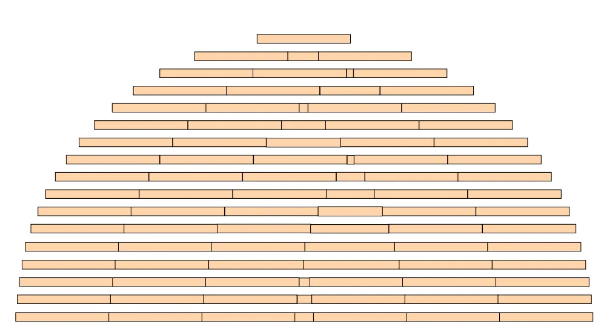
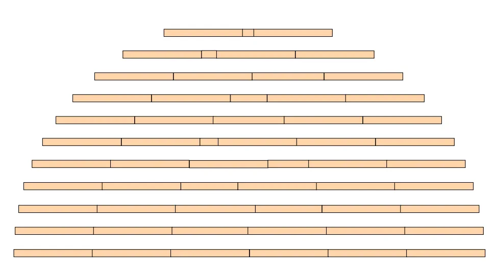
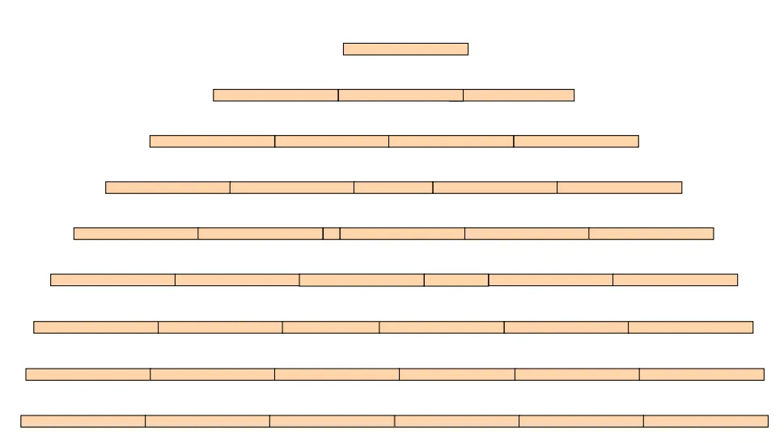
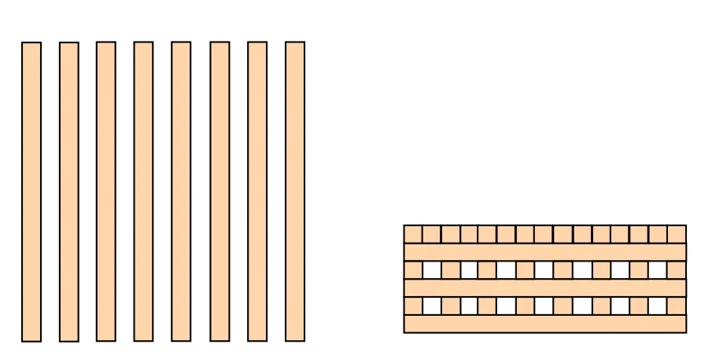
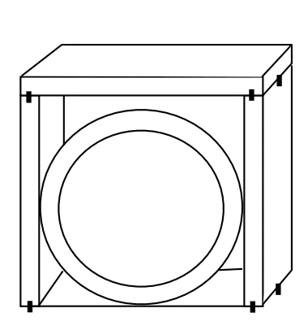

<!-- 페이지번호: 1, 파일명: 노내 침목적 작업 기술 -->
# 1. 적용범위

고로 화입조업중 조기에 건전한 노심 Coke 형성과 원활한 노열확보를 위한 침목적 작업기준 및 조치 수순에 대하여 적용한다.

# 2. 목 적

<ul><li>고로화입전 노저에서부터 풍구하단 높이까지 침목을 쌓음으로써,</li><li>화입후 연소되지 않은 Coke 강하 방지</li><li>충분한 열원이 확보된 건전한 노심 Coke 형성과 노상부(Hearth 부)온도를 조기에 상승시켜 원활한 화입조업을 수행하기 위한 목적이다.</li></ul>

# 3. 중점관리 항목 : 해당사항 없음

# 4. 조업기준

## 4.1 조업관리기준

### 4.1.1 침목공사 계획시 전제사항

#### 가. 고로 노저부위의 돌출부(출선구 보호벽 등)는 무시하고 원통형으로 간주한다.

#### 나. 침목적은 노저에서 풍구 직하부까지 실시하며, # 자 쌓기를 실시한다.

#### 다. 침목 및 꺾쇠의 오차, 침목간의 틈은 고려하지 않는다.

#### 라. 고로 개수 공기가 짧을 경우에는 던져 쌓기를 실시한다.

( 아래 그림 참고)

<!-- 페이지번호: 2, 파일명: 노내 침목적 작업 기술 -->
### 4.1.2 침목충진시 고려사항

#### 가. 장입물 하중을 견딜 수 있어야 한다.

### 4.1.3 침목적 작업방법 및 기준

#### 가. 노저에서 풍구 직상부까지의 각 단별 침목형태는 (그림 1)과 같다.

뒷 장 계 속

<!-- 페이지번호: 3, 파일명: 노내 침목적 작업 기술 -->
<table border="1"><thead><tr><th>구분</th><th>목적</th><th>축조형상</th></tr></thead><tbody><tr><td>중앙쌓기</td><td>노중심부 Coke 승열</td><td>코크스</td></tr><tr><td>세워쌓기</td><td>풍구 및 풍구주위 노벽보호</td><td>노내 배목</td></tr><tr><td>밀착쌓기</td><td>장입물 강하방지</td><td></td></tr><tr><td>1 본 띄워쌓기</td><td>장입물 지지를위한 강도유지,</td><td></td></tr><tr><td>2 본 띄워쌓기</td><td>장입물 승열 시간확보</td><td></td></tr><tr><td>3 본 띄워쌓기</td><td></td><td></td></tr></tbody></table>
3 본쌓기

2 본쌓기

1 본쌓기

밀착쌓기

중앙쌓기

그림 1. 노내 침목적 상황도

#### 나. 제 1 단 및 홀수단은 0 ~ 180°방향으로 쌓고, 짝수단은 홀수단과 직각 방향으로 쌓으며 각 단 쌓기별 상세도는 (그림 2~7)과 같다.

뒷 장 계속

<!-- 페이지번호: 4, 파일명: 노내 침목적 작업 기술 -->

그림 2. 밀착쌓기 상세도

그림 3. 1本 띄워쌓기 상세도

<!-- 페이지번호: 5, 파일명: 노내 침목적 작업 기술 -->

Diagram showing 10 horizontal lines, each divided into segments, illustrating the arrangement of 2 sticks.

그림 4. 2本 떠워쌓기 상세도

Diagram showing 10 horizontal lines, each divided into segments, illustrating the arrangement of 3 sticks (1).

그림 5. 3本 떠워쌓기(1) 상세도

<!-- 페이지번호: 6, 파일명: 노내 침목적 작업 기술 -->

그림 6. 3본 띄워쌓기 (II) 상세도

그림 7. 세워쌓기 상세도

<!-- 페이지번호: 7, 파일명: 노내 침목적 작업 기술 -->
#### 다. 침목은 노저부로 부터 벽측에 단별 표시를 하여 수평 Level 을 유지한다.

#### 라. 침목쌓기에 있어 침목의 크기가 맞지 않을경우에는 침목을 절단하여 절단 침목은 중앙부로 가도록 측조한다.

#### 마. Gas 유로 형성을위해 출선구간 통로를 하부 3본 쌓기구역에 일정단수까지 설치하며, 통로폭을 적정간격으로 유지한다.

#### 바. 출선구 보호벽과 접하는 부분의 침목은 그 부위에 맞도록 침목을 적절히 잘라서 사용한다.

#### 사. 노하부 3본 띄워쌓기중 고로 Size 에 따라 기존에 정한 단수까지 침목을 실시한 후 풍구 직하부로부터 거리를 측정한 후 단수조정이 필요한 경우 2본 띄워쌓기에서 미리 단수조정을 실시하여 밀착 쌓기 상부가 풍구 직하부와 밀착되게 한다.

(3본 띄워쌓기 마지막단에서 3~4 단전에 재측정실시 및 조정)

#### 아. 침목과 침목의 연결은 깍쇠로서 유동 및 하중에 견딜수 있도록 견고하게 박는다.

#### 자. 풍구보호용 세워쌓기 침목은 2단으로 설치하되 서로 깍쇠를 사용하여 두 단이 붙어 있도록 하며, 깍쇠를 이용하여 미끄러지지 않도록 고정한다 (그림 7).

#### 차. 화입초기 노내 Gas Profile 및 연화용착대를 조기에 형성과 동시에 노심 Coke 의 충분한 승열을 위해 (그림 8), (그림 9)와 같이 중앙쌓기를 실시한다.

그림 8. 중앙쌓기 (A)형 상세도

뒷 장 계 속

<!-- 페이지번호: 8, 파일명: 노내 침목적 작업 기술 -->

그림 9. 중앙쌓기 (B)형 상세도

#### 카. 노내로 돌출된 풍구를 낙하물로 부터 보호하기 위하여 풍구 보호용 침목을 (그림 10)과 같이 실시한다. 또한 화입초기 풍구열에 의해 풍구 하단의 이음 침목이 먼저 연소하여 Coke 및 Ore 가 이 부분으로 강하할 우려가 있으므로, 풍구 형상에 맞게 가공하여 침목적하며, 토막은 노중심으로 가도록 한다.

그림 10. 풍구 보호용 침목도

뒷 장 계 속

<!-- 페이지번호: 9, 파일명: 노내 침목적 작업 기술 -->
#### 다. 화입송풍시 착화를 용이하게 하기 위하여 풍구주위에 목탄을 일정량씩 적재한다.파. 세워쌓기 부터 노 중심쪽으로 폐목을 쌓음으로써 노 중심부의 중앙쌓기 침목까지 연소가 순조롭게 되도록 도와준다.하. 침목적 작업시에는 인화성이 높은 침목 및 폐목을 다루기 때문에 절대 금연하고 성냥 및 라이터의 소지를 금하며 소화기를 비치한다.

### 4.1.4 침목 반입계획

#### 가. 침목반입 지정풍구 및 작업원 출입구(침목반입풍구와 인접풍구)는 풍구를 취외한다.나. 침목은 Rampway를 통해 운반한 후 지개차를 이용하여 Tower crane 측 주상에 적치한다.다. 침목을 풍구상에서 침목반입 풍구까지 운반하는 것은 노체연와 수송용 Roller를 이용한다.라. 침목 반입구, 작업원 출입구, 감시 및 신호구는 풍구 취외부의 손상을 방지하기 위하여 (그림 11)과 같은 보호장치를 한다.

그림 11. 침목반입 및 작업원 출입구 보호장치

뒷 장 계 속

<!-- 페이지번호: 10, 파일명: 노내 침목적 작업 기술 -->
#### 마. 침목을 풍구상에서 노상으로 반입할때 침목의 낙하충격으로 부터 노저연와를 보호하기 위하여 초기 침목반입시는 (그림 12)와 같은 보호장치를 설치하여 반입한다. 또한 최초 침목반입시는 ROPE 로 묶어서 반입한다.

그림 12. 침목 반입용 노내 가설도

### 4.1.5 침목 소요자재 내역

#### 가. 침목 및 깎쇠 규격

○ 침목

○ 깎쇠

<table><thead><tr><th rowspan="2">구분</th><th colspan="3">허용오차(mm)</th><th rowspan="2">비고</th></tr><tr><th>H + 5</th><th>W + 5</th><th>L + 10</th></tr></thead><tbody><tr><td>A형</td><td><u>200</u></td><td>200</td><td><u>1,000</u></td><td>용이, 마구리 활열 및 운활 이 없고, 벌레먹지않은</td></tr><tr><td>B형</td><td><u>200</u></td><td>200</td><td><u>500</u></td><td>상태에서 충분히 건조되어 있을것</td></tr><tr><td>C형</td><td><u>140</u></td><td><u>200</u></td><td><u>2000</u></td><td></td></tr><tr><td>재질</td><td colspan="3">AIPTON</td><td></td></tr></tbody></table>
<a href="components/TP-030-110-040 노내 침목적 작업 기술(Rev.8)_0900bf4ba7a6214e_usr0000bf4b95f9e446_p010_table_01.png">Table snapshot</a>

#### 나. 침목적 소요물량 산출

(1) 고로화입시 최초 노내 장입물을 충분히 승열시킬수 있는 열량을 얻을수 있는 침목량계산을 원칙으로 하며, 일반적으로 고로 노저~풍구까지의 내용적당 침목부피를 이용하여 침목소요량 및 노내 높이별 침목단수와 단별 침목수를 결정한다.

(2) 깎쇠는 침목간 고정을위해 사용되며, 소요량은 침목량 대비 깎쇠 소요비율에 따라 적용한다.

<!-- 페이지번호: 11, 파일명: 노내 침목적 작업 기술 -->

(3) 목탄은 최초 화입을 대비하여 풍구수당 적정량을 풍구전방에 배치한다.

(4) 폐목은 중앙쌓기와 세워쌓기 사이의 공간에 쌓는다.

<table><thead><tr><th rowspan="2">구분</th><th colspan="2">1 일차</th><th colspan="2">2 일차</th><th colspan="2">3 일차</th><th colspan="2">4 일차</th><th colspan="2">5 일차</th></tr><tr><th>주간</th><th>야간</th><th>주간</th><th>야간</th><th>주간</th><th>야간</th><th>주간</th><th>야간</th><th>주간</th><th>야간</th></tr></thead><tbody><tr><td>사전검토 및 노내가설</td><td></td><td></td><td></td><td></td><td></td><td></td><td></td><td></td><td></td><td></td></tr><tr><td>3本 띄워쌓기(단)</td><td></td><td></td><td></td><td></td><td></td><td></td><td></td><td></td><td></td><td></td></tr><tr><td>2本 띄워쌓기(단)</td><td></td><td></td><td></td><td></td><td></td><td></td><td></td><td></td><td></td><td></td></tr><tr><td>1本 띄워쌓기(단)</td><td></td><td></td><td></td><td></td><td></td><td></td><td></td><td></td><td></td><td></td></tr><tr><td>밀착쌓기(단)</td><td></td><td></td><td></td><td></td><td></td><td></td><td></td><td></td><td></td><td></td></tr><tr><td rowspan="2">중앙쌓기 (B형)</td><td>밀착쌓기(단)</td><td></td><td></td><td></td><td></td><td></td><td></td><td></td><td></td><td></td></tr><tr><td>1本 쌓기(단)</td><td></td><td></td><td></td><td></td><td></td><td></td><td></td><td></td><td></td></tr><tr><td rowspan="2">중앙쌓기 (A형)</td><td>밀착쌓기(단)</td><td></td><td></td><td></td><td></td><td></td><td></td><td></td><td></td><td></td></tr><tr><td>1本 쌓기(단)</td><td></td><td></td><td></td><td></td><td></td><td></td><td></td><td></td><td></td></tr><tr><td rowspan="2">세워쌓기</td><td>노중심축(1단)</td><td></td><td></td><td></td><td></td><td></td><td></td><td></td><td></td><td></td></tr><tr><td>노벽축(1단)</td><td></td><td></td><td></td><td></td><td></td><td></td><td></td><td></td><td></td></tr><tr><td>풍구주위 쌓기 (36)</td><td></td><td></td><td></td><td></td><td></td><td></td><td></td><td></td><td></td><td></td></tr><tr><td>목탄 및 폐목쌓기</td><td></td><td></td><td></td><td></td><td></td><td></td><td></td><td></td><td></td><td></td></tr></tbody></table>
<a href="components/TP-030-110-040 노내 침목적 작업 기술(Rev.8)_0900bf4ba7a6214e_usr0000bf4b95f9e446_p011_table_01.png">Table snapshot</a>

※ 단별구성과 배치에 따라 변경가능

## 4.2 예방판단 및 조치기준

### 4.2.1 침목적공사 안전사고 예방

#### 가. 노내 출입시

노정온도 50℃ 이하에서 다음사항을 확인하고, 산소농도에 이상이 없으면 노내에 출입한다.

<ol><li>노내 N2 VALVE CLOSE 확인</li><li>GAS 청정 LINE N2 VALVE CLOSE 확인</li><li>각종 SENSOR, AIR BLEEDER N2 VALVE CLOSE 확인</li></ol>

<!-- 페이지번호: 12, 파일명: 노내 침목적 작업 기술 -->
<ol><li>SEAL VALVE 및 MCG CLOSE, SOUNDING 정지 확인</li><li>노정 BLEEDER OPEN 확인</li><li>상부 MANHOLE 폭발구를 통한 낙하물 발생방지 조치 확인</li><li>노정 STEAM CLOSE 확인</li><li>각종 노정 장입장치 작동금지 및 시건장치 확인</li></ol>

#### 나. 침목 충진시

<ol><li>노저온도(중심부 분위기 온도)가 40℃ 이하이면 침목충진</li><li>화기, 살수 HOSE 등을 준비하고 주상, 풍구, 노정을 통하여 불씨가 들어오지 않도록 주변 작업자에게 교육실시</li><li>노내 출입시 불씨의 요인(성냥, 라이터)은 절대 소지하지 않으며 금연실시</li></ol>

#### 다. 침목입고시

<ol><li>입고일을 준수하며 입고시 침목의 재질검사 철저히 실시</li><li>입고된 침목은 지정장소에 적치</li><li>침목 적치시 침수방지를 위한 배수처리 및 침목의 Covering 을 철저히 실시</li></ol>

#### 라. 기타사항

<ol><li>작업 업체는 안전관리자를 계속 근무하도록 하며, 작업원들의 작업전 안전교육 및 화재예방 교육을 철저히 실시하고 노내로 작업원 투입시 인화성 물질의 소지를 엄금한다.</li><li>노내에는 소화기를 적당한 장소에 충분히 배치한다.</li><li>노외에 흡연장소를 지정하고, 재떨이 및 인화물질 보관함을 비치한다.</li><li>노내 출입시, N2 valve, MCG close, Sounding 정지 및 노정 Bleeder open 상태를 반드시 확인하고, 작업시 안전을 고려하여 각종 노정 장입장치의 작동을 금지한다.</li></ol>

### 4.2.2 노내 침목적 공사 계획수립 요령

#### 가. 노내 침목적 공사 계획수립

상기(1~8 절)의 내용에 따라 고로 설계조건에 맞게 노내 침목적 공사에 필요한 자재물량 및 공사일정 계획을 수립한다.

<!-- 페이지번호: 13, 파일명: 노내 침목적 작업 기술 -->
#### 나. 시공품의서 작성

<ol><li>공사자재 및 공사계약(구매부서)의 근거로써 공사에 필요한 소요자재 및 경비를 산출하여 시공 품의서를 작성한다.</li><li>시공품의는 시공품의서(1매), 공사내역서 및 공사시방서로 구성된다.</li><li>공사내역서는 공사에 필요한 자재소요량 및 장비사용, 소요인원으로 산출한 공사비 내역서와 원가계산서로 구성된다.</li></ol>

#### 다. 공사 감독자 선임 기안작성

작업품질 확보 및 안전작업 관련교육 실시를위한 공사 감독자(주감독자, 부감독자)를 선임한다.

### 4.2.3 노내 침목적 공사 결과조치 요령

#### 가. 준공 검사조서 작성

공사완료후 준공검사를 실시한 결과 설계서, 시방서, 도면 및 기타 지시서와 상위없이 준공됨을 확인하는 검사조서를 작성한다.

#### 나. 정산내역서 작성

공사에 소요된 자재 및 경비를 산출하여 정산내역서, 공사원가 계산서를 작성한다.

# 5. 이상판단 및 조치기준 : 해당사항 없음

이 하 여 백
