<!-- 페이지번호: 1, 파일명: 열풍로 연소기술 기준 -->
# 1. 적용범위

고로에 열풍을 공급해주는 열풍로의 촉열을 위한 연소관리 기술에 대하여 적용한다.

# 2. 목 적

열풍로 촉열실의 가열을 위한 연소실 하부에 설치된 버너(Burner) 에서의 사용되는 BFG 및 COG 의 최적 연소조건을 구축하여서 열풍로 열효율 향상및 안정된 고온의 열풍을 공급 하는데 목적이 있다.

# 3. 중점관리 항목

<table><thead><tr><th>품질영향 인자</th><th>공정영향 인자</th></tr></thead><tbody><tr><td>[Si], [S]</td><td>풍압, 노열</td></tr></tbody></table>
<a href="components/TP-030-120-020 열풍로 연소기술 기준(Rev.11)_0900bf4ba7a451f1_usr0000bf4b95f9e446_p001_table_01.png">Table snapshot</a>

# 4. 조업기준 : 열풍로 연소조건 설정 기준

## 4.1 연소용 Gas 유량 계산

목표 연소용 GAS 유량 계산은 연소중인 각 열풍로 별로 계산하고 있으며, Gas 유량은 목표열량, Gas Calorie, 열풍로 열효율과 관계가 있으며 그 관계는 다음과 같다

<math display="block">Gas 유량 = (목표열량 - 축적된 열) ÷ (η × Cal × 잔여시간)</math>

## 4.2 열풍로 연소계산

### 4.2.1 단일가스의 연소표

<table><thead><tr><th colspan="2">연료</th><th rowspan="3">연소방정식과 분자수</th><th colspan="4">연료 1Nm³에 대하여</th></tr><tr><th rowspan="2">명칭</th><th rowspan="2">분자식</th><th colspan="2">공기량 (Nm³)</th><th colspan="2">연소가스량 (Nm³)</th></tr><tr><th>O₂</th><th>N₂</th><th>CO₂</th><th>H₂O</th></tr></thead><tbody><tr><td>수소</td><td>H₂</td><td>2H₂ + O₂ = 2H₂O 2 1 2</td><td>0.5</td><td>1.88</td><td>0</td><td>1</td></tr><tr><td>일산화탄소</td><td>CO</td><td>2CO + O₂ = 2CO₂ 2 1 2</td><td>0.5</td><td>1.88</td><td>1</td><td>0</td></tr><tr><td>메탄</td><td>CH₄</td><td>CH₄ + 2O₂ = CO₂ + 2H₂O 1 2 1 2</td><td>2</td><td>7.52</td><td>1</td><td>2</td></tr><tr><td>에틸렌</td><td>C₂H₄</td><td>C₂H₄ + 3O₂ = 2CO₂ + 2H₂O 1 3 2 2</td><td>3</td><td>11.28</td><td>2</td><td>2</td></tr><tr><td>아세틸렌</td><td>C₂H₂</td><td>2C₂H₂ + 5O₂ = 4CO₂ + 2H₂O 2 5 4 2</td><td>2.5</td><td>9.40</td><td>2</td><td>1</td></tr><tr><td>탄화수소</td><td>CmHn</td><td>CmHn + (m+n/4)O₂ = mCO₂ + n/2H₂O</td><td>m+n/4</td><td>3.76(m+n/4)</td><td>m</td><td>n/2</td></tr></tbody></table>
<a href="components/TP-030-120-020 열풍로 연소기술 기준(Rev.11)_0900bf4ba7a451f1_usr0000bf4b95f9e446_p001_table_02.png">Table snapshot</a>

<!-- 페이지번호: 2, 파일명: 열풍로 연소기술 기준 -->
### 4.2.2 공기와 혼합시 가연기체의 연소범위

<table><thead><tr><th>가연기체</th><th>연소 범위 C₁ - C₂</th><th>비고</th></tr></thead><tbody><tr><td>H₂</td><td>4.1 - 75</td><td rowspan="7">C₁: 하한연소범위 C₂: 상한연소범위</td></tr><tr><td>CO</td><td>12.5 - 74</td></tr><tr><td>CH₄</td><td>5.3 - 15</td></tr><tr><td>C₂H₂</td><td>2.3 - 8.2</td></tr><tr><td>C₂H₆</td><td>3.0 - 12.5</td></tr><tr><td>C₂H₄</td><td>3.1 - 32.1</td></tr><tr><td>C₃H₈</td><td>2.2 - 9.5</td></tr></tbody></table>
<a href="components/TP-030-120-020 열풍로 연소기술 기준(Rev.11)_0900bf4ba7a451f1_usr0000bf4b95f9e446_p002_table_01.png">Table snapshot</a>

- 가연연소범위 결정

Le Chatelier 계산식 이용

L_m = 100/(P₁/n₁) + (P₂/n₂) + (P₃/n₃) + ..., 단, P₁, P₂, P₃는 혼합가스 중의 가연가스성분

n₁, n₂, n₃는 각가스의 상한연소범위(C₂) 혹은 하한연소범위(C₁)를 %로 표시

### 4.2.3 Gas 발열량 계산식

#### 4.2.3.1 Gas 성분별 발열량 보정식

<math display="block">C₂H₄ + 3O₂ = 2CO₂ + 2H₂O + 14,320 KCal/N m³</math>

<math display="block">CO + 1/2O₂ = CO₂ + 3,035 KCal/N m³</math>

<math display="block">H₂ + 1/2O₂ = H₂O + 2,570 KCal/N m³</math>

<math display="block">CH₄ + 2O₂ = CO₂ + 2H₂O + 8,570 KCal/N m³</math>

#### 4.2.3.2 고위발열량(총발열량) : 물의 응축(증발)잠열 포함

<math display="block">H_h(고위발열량) = 3035 × CO + 3050 × H₂ + 9530 × CH₄ + 15280 × C₂H₄ + 14090 × C₂H₂ + 35310 × C₆H₆</math>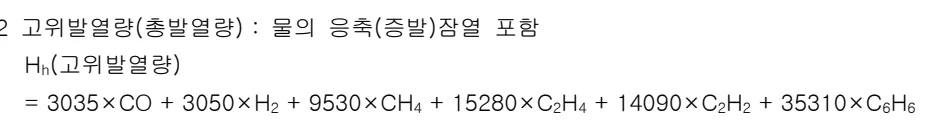

#### 4.2.3.3 저위발열량(진발열량) : 물의 증발잠열 미포함 (실제이용 가능열량)

<math display="block">H_l(저위발열량) = 3035 × CO + 2570 × H₂ + 8570 × CH₄ + 14320 × C₂H₄ + 13600 × C₂H₂ + 33870 × C₆H₆</math>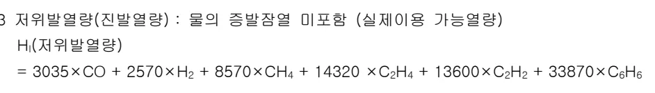

#### 4.2.3.4 COG Gas의 발열량 계산예 (H2 58%, CO 7.8%, CH4 25%, C2H4 3.0%)

<math display="block">발열량 H_e = 14,320 × 0.03 + 8750 × 0.25 + 3035 × 0.078 + 2570 × 0.58 = 4300 KCal/N m³</math>

#### 4.2.3.5 BFG Gas의 발열량 계산예 (H2 3.1%, CO 21%, CO2 21.5%, N2 54.4%)

<math display="block">발열량 H_e = 3035 × 0.21 + 2570 × 0.03 = 715 KCal/N m³</math>

<!-- 페이지번호: 3, 파일명: 열풍로 연소기술 기준 -->
### 4.2.4 이론 연소공기량 계산

<table><thead><tr><th>구분</th><th>이론 연소공기량 계산</th></tr></thead><tbody><tr><td>COG</td><td><math display="block">A₀ = 1/0.21 × (0.5H₂ + 0.5CO + 3C₂H₄ + 2CH₄)</math><math display="block">= 1/0.21 × (0.5 × 0.58 + 0.5 × 0.078 + 3 × 0.03 + 2 × 0.25)</math><math display="block">= 4.352Nm³/Nm³</math></td></tr><tr><td>BFG</td><td><math display="block">A₀ = 1/0.21 × (0.5H₂ + 0.5CO)</math><math display="block">= 1/0.21 × (0.5 × 0.031 + 0.5 × 0.21)</math><math display="block">= 0.57Nm³/Nm³</math></td></tr></tbody></table>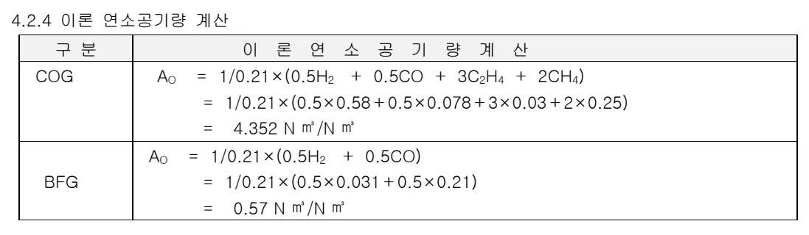
<a href="components/TP-030-120-020 열풍로 연소기술 기준(Rev.11)_0900bf4ba7a451f1_usr0000bf4b95f9e446_p003_table_01.png">Table snapshot</a>

### 4.2.5 이론 연소배기 Gas량 계산

<table><thead><tr><th>구분</th><th>C O G</th><th>BFG</th></tr></thead><tbody><tr><td>CO₂</td><td><math display="block">CO₂ = CO + CH₄ + 2C₂H₄ + CO₂</math><math display="block">= 0.078 + 0.25 + 2 × 0.03 + 0.028</math><math display="block">= 0.416Nm³/Nm³</math></td><td>0.215</td></tr><tr><td>H₂O</td><td><math display="block">H₂O = H₂ + 2CH₄ + 2C₂H₄</math><math display="block">= 0.58 + 2 × 0.25 + 2 × 0.03 = 1.14Nm³/Nm³</math></td><td>0.025</td></tr><tr><td>N₂</td><td><math display="block">N₂ = N₂ + 0.79 × A₀ = 0.027Nm³/Nm³</math></td><td>0.99</td></tr><tr><td>TOTAL</td><td><math display="block">G total = CO₂ + H₂O + N₂ = 5.021Nm³/Nm³</math></td><td>1.23</td></tr></tbody></table>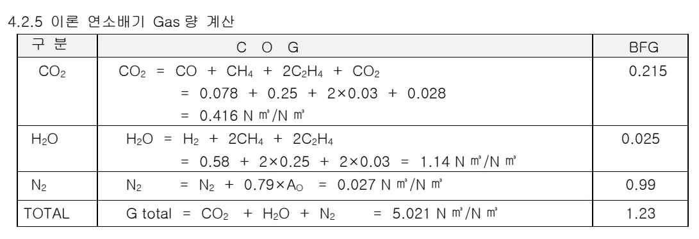
<a href="components/TP-030-120-020 열풍로 연소기술 기준(Rev.11)_0900bf4ba7a451f1_usr0000bf4b95f9e446_p003_table_02.png">Table snapshot</a>

### 4.2.6 이론연소온도 계산 (COG)

<math display="block">&= (발열량 + COG 비열 × COG 온도 + 연소공기 비열 × 연소공기 온도 × 연소공기 이론량) &÷ (배가스 비열 × 배가스량) &= (4.300 + 0.335 × 25 + 0.309 × 25 × 4.352) ÷ (0.304 × 5.021) = 2485°C</math>

### 4.2.7 실제연소 온도 계산

이론 연소공기로 gAS을 완전연소 하기는 불가능 한데, 이는 Burner 에서 Air 와 Gas 를 100% 연소역(폭발한계)으로 혼합연소 할수 없고 부분적으로 Air/Gas 비의 분포차이가나게된다. 경험상 COG 와 BFG 는 2~10%의 과잉공기를 투과시 최고연소온도에 도달되고 있음이 발견되었다.

COG 실제의 연소온도 : 2441°C

BFG 실제의 연소온도 : 1833°C

# 5. 이상판단 및 조치기준 : 해당사항 없음

뒷장 계속

<!-- 페이지번호: 4, 파일명: 열풍로 연소기술 기준 -->
# 6. 기술이론

## 6.1 열 정 산

### 6.1.1 열정산 목적

공급열량과 그 사용 상태를 명확히 하고 열의 입,출열량의 관계를 정산하고 열의분포 상태를 파악, 열손실을 최소화하여 열풍로 열효율을 증진하기 위한 필요한 기초자료 확보.

### 6.1.2 전제 조건

- 대상고로 : 3고로 열풍로

- Data : 일평균 Data 적용

#### 6.1.2.1 조업지수 및 비열

<table><thead><tr><th colspan="2">조업 지수</th><th colspan="2">조업 지수</th><th colspan="2">비열(kcal/N m³ °C)</th></tr></thead><tbody><tr><td>송풍시간(분)</td><td>63</td><td>열풍온도(°C)</td><td>1120</td><td>열풍</td><td>0.340</td></tr><tr><td>연소시간(분)</td><td>51</td><td>냉풍온도(°C)</td><td>173</td><td>건열풍습분</td><td>0.400</td></tr><tr><td>송풍유량(N m³/Min)</td><td>2901</td><td>연소 Air 온도(°C)</td><td>50</td><td>산소</td><td>0.3126</td></tr><tr><td>산소부화(N m³/hr)</td><td>15391</td><td>BFG 온도(°C)</td><td>86</td><td>연소공기</td><td>0.310</td></tr><tr><td>Air 유량(N m³/hr)</td><td>98452</td><td>COG 온도(°C)</td><td>16</td><td>연소공기습분</td><td>0.341</td></tr><tr><td>BFG 유량(N m³/hr)</td><td>88228</td><td>C/G 온도(°C)</td><td>47</td><td>냉풍</td><td>0.311</td></tr><tr><td>COG 유량(N m³/hr)</td><td>6437</td><td>M/G 온도(°C)</td><td>85</td><td>냉풍습분</td><td>0.345</td></tr><tr><td>M/G 유량(N m³/hr)</td><td>94665</td><td>W/G 온도(°C)</td><td>224</td><td>배 Gas 중 CO2</td><td>0.441</td></tr><tr><td>M-Gas 발열량(kcal)</td><td>966</td><td>대기온도(°C)</td><td>2.2</td><td>N2</td><td>0.312</td></tr><tr><td>COG 발열량(kcal)</td><td>4119</td><td>대기습분(g/N m³)</td><td>1.84</td><td>O2</td><td>0.322</td></tr><tr><td>COG 비율(%)</td><td>6.8</td><td>송풍습분(g/N m³)</td><td>10.0</td><td>습분</td><td>0.350</td></tr><tr><td>BFG 비율(%)</td><td>93.2</td><td>습분계수</td><td>0.001244</td><td>BFG</td><td>0.327</td></tr><tr><td>A/G</td><td>1.04</td><td>W/G O2(%)</td><td>2.46</td><td>COG</td><td>0.327</td></tr></tbody></table>
<a href="components/TP-030-120-020 열풍로 연소기술 기준(Rev.11)_0900bf4ba7a451f1_usr0000bf4b95f9e446_p004_table_01.png">Table snapshot</a>

#### 6.1.2.2 연료(Gas) 성분(%)

<table><thead><tr><th>구분</th><th>Co</th><th>Co2</th><th>H2</th><th>N2</th><th>CH4</th><th>C2H4</th><th>O2</th><th>비고</th></tr></thead><tbody><tr><td>COG</td><td>6.2</td><td>2.4</td><td>53.9</td><td>8.9</td><td>24.9</td><td>2.9</td><td>0.9</td><td>4119 kcal</td></tr><tr><td>BFG</td><td>21.1</td><td>22.7</td><td>3.7</td><td>52.4</td><td>-</td><td>-</td><td>-</td><td>735 kcal</td></tr></tbody></table>
<a href="components/TP-030-120-020 열풍로 연소기술 기준(Rev.11)_0900bf4ba7a451f1_usr0000bf4b95f9e446_p004_table_02.png">Table snapshot</a>

### 6.1.3 입열량(B0) : 연소,송풍 1Cycle 동안 열풍로에 투입된 총열량

#### 6.1.3.1 M-Gas 연소열(B1) : 연소중 M-Gas 가 연소해서 발생하는 열량

<math display="block">B1 = M-Gas량 × M-Gas 발열량 × [(연소시간)/(60)] = 94665 × 966 × [(51)/(60)] = 77729432kcal</math>

<!-- 페이지번호: 5, 파일명: 열풍로 연소기술 기준 -->
#### 6.1.3.2 연소용 Air 현열(B2) : 연소중 연소용 Air 가 열풍로에 가지고 들어오는 열량

<math display="block">B2 &= ((1-습분계수 × 대기습분) × 공기비열 + 0.001244 × 대기습분 × 습분비열) × &연소용 Air 온도 × 연소용 Air 유량 × 연소시간 / 60 &= ((1-0.001244 × 1.84) × 0.31 + 0.001244 × 1.84 × 0.341) × 50.0 × 98452 × 51/60 &= 297402kcal</math>
공기비열 : 0.310, 습분(수증기)비열 : 0.341

#### 6.1.3.3 M-Gas 현열(B3) : 연소중 M-Gas 가 열풍로에 가지고 들어오는 열량

<math display="block">B3 &= M-Gas 량 × (COG 비열 × COG 온도 × COG 비율 + BFG 비열 × BFG 온도 × & (1 - COG 비율)) × 연소시간 / 60 &= 94665 × (0.327 × 16.0 × 0.068 + 0.327 × 86.0 × (1 - 0.068)) = 2137598kcal</math>
BFG 비열: 0.327, COG 비열: 0.327

#### 6.1.3.4 냉풍 건 현열(B4) : 송풍중 냉풍 및 산소부화량이 열풍로에 가지고 들어오는 열량

<math display="block">B4 &= (1-습분계수 × 냉풍습분) × 송풍유량 × 냉풍비열 × 냉풍온도 × 송풍시간 + & (산소취입량/2) × 산소비열 × 냉풍온도 × 송풍시간 × 1/60 &= (1-0.001244 × 10) × 2901 × 0.311 × 173 × 63 + (15391/2) × 0.3126 × 173 × & 63 × 1/60 = 9519136kcal</math>
냉풍비열 : 0.311, 산소비열: 0.3126

#### 6.1.3.5 냉풍 습분 현열(B5) : 송풍중 냉풍중의 수증기가 열풍로에 가지고 들어오는 열량

<math display="block">B5 &= 습분계수 × 냉풍습분 × 송풍유량 × 냉풍 수증기 비열 × 냉풍온도 × 송풍시간 &= 0.001244 × 10 × 2901 × 0.345 × 173 × 63 = 106897kcal</math>
냉풍습분 비열: 0.345

### 6.1.4 총열량(A0) : 연소, 송풍 1Cycle 동안 열풍로에서 지출된 총열량

#### 6.1.4.1 열풍 건 현열(A1) : 송풍중 열풍 및 산소부하가 열풍로에서 가지고 나가는 열량

<math display="block">A1 &= (1-습분계수 × 냉풍습분) × 송풍유량 × 열풍비열 × 열풍온도 × 송풍시간 + & (산소취입량/2) × 산소비열 × 송풍온도 × 송풍시간/60 &= (1-0.001244 × 10) × 2901 × 0.340 × 1120 × 63 + (15391/2) × 0.3126 × 1120 × & 63/60 = 69711403kcal</math>
열풍비열: 0.340

#### 6.1.4.2 열풍습분 현열(A2) : 송풍중 열풍중의 수증기가 열풍로에서 가지고 나가는 열량

<math display="block">A2 &= 습분계수 × 냉풍습분 × 송풍유량 × 건열풍 수증기 비열 × 송풍온도 × 송풍시간 &= 0.001244 × 10 × 2901 × 0.400 × 1120 × 63 = 991174kcal</math>
건열풍습분 비열 : 0.400

<!-- 페이지번호: 6, 파일명: 열풍로 연소기술 기준 -->
#### 6.1.4.3 배 Gas 치출열(A3): 연소기간중 열풍로에서 가지고 나가는 배 Gas 총열량

<math display="block">A3 = (FCO2 × CO2 비열 + FN2 × N2 비열 + FO2 × O2 비열 + FH2O × 배 Gas 중 수증기비열) ×  배 Gas 평균온도 × 연소시간/60 = (41174 × 0.441 + 124946 × 0.312 + 3706 × 0.322 + 10530 ×  0.350) × 224 × 51/60 = 11808494kcal</math>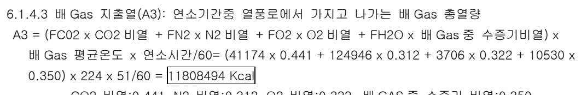

<math display="block">CO2 비열: 0.441, N2 비열: 0.312, O2 비열: 0.322, 배 GAS 중 수증기 비열: 0.350</math>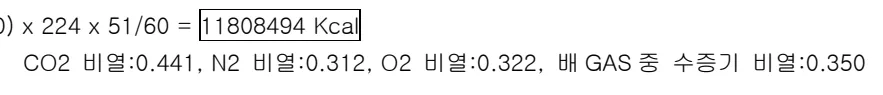

#### 6.1.4.4 배 Gas 유량 산출

(1) BFG 를 완전 연소하는데 필요한 O2 량 (X1)

<math display="block">X1 = BFG 유량 × (BFG 중 CO + BFG 중 H2) × 0.5 = 88228 × (0.211 + 0.037) × 0.5  = 10940Nm³/Hr</math>

(2) COG 를 완전 연소하는데 필요한 O2 량 (X2)

<math display="block">X2 = COG 유량 × (3.5 × COG 중 C2H6 + 3 × COG 중 C2H4 + 2 × COG 중 CH4 + 0.5 ×  (COG 중 CO + COG 중 H2)) = 6437 × (3.5 × 0.0 + 3 × 0.029 + 2 × 0.249 + 0.5 ×  (0.062 + 0.539)) = 5700Nm³/Hr</math>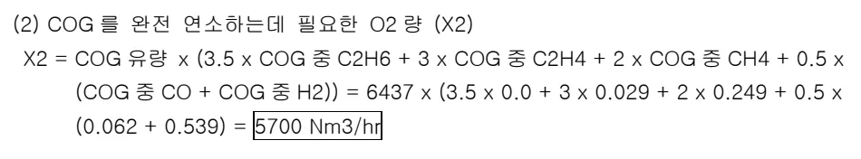

(3) BFG 연소시에 발생하는 CO2 량 (Y1)

<math display="block">Y1 = BFG 유량 × (BFG 중 CO + BFG 중 CO2) = 88228 × (0.211 + 0.227) = 38644Nm³/Hr</math>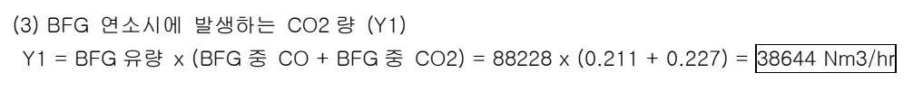

(4) BFG 연소시 발생하는 N2 량 (Y2)

<math display="block">Y2 = X1 × 0.79/0.21 + BFG 유량 × BFG 중 N2 = 10940 × 0.79/0.21 + 88228 × 0.524  = 87388Nm³/Hr</math>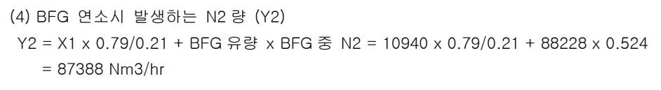

(5) COG 연소시 발생하는 CO2 량 (Y3)

<math display="block">Y3 = COG 유량 × (COG 중 CO2 + COG 중 CO + 2 × COG 중 C2H6 + 2 × COG 중 C2H4 +  COG 중 CH4) = 6437 × (0.024 + 0.062 + 2 × 0.0 + 2 × 0.029 + 0.249) = 2530Nm³/Hr</math>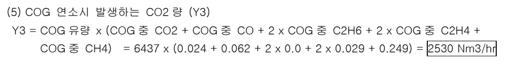

(6) COG 연소시 발생하는 N2 량 (Y4)

<math display="block">Y4 = X2 × 0.79/0.21 + COG 유량 × COG 중 N2 = 5700 × 0.79/0.21 + 6437 × 0.089  = 22016Nm³/Hr</math>

(7) COG 로 부터 가지고 들어가는 O2 량 (Y5)

<math display="block">Y5 = COG 유량 × COG 중 O2 = 6437 × 0.009 = 58Nm³/Hr</math>

<!-- 페이지번호: 7, 파일명: 열풍로 연소기술 기준 -->

(8) 과잉공기량 (Z)

<math display="block">z</math>

(9) BFG 연소에 의해 발생하는 배 Gas 중 H2O 량 (BH1)

<math display="block">BH1 = BFG 유량 × BFG 중 H2 = 88228 × 0.037 = 3264Nm³/Hr</math>

(10) BFG 가 갖고 들어가 발생하는 배 Gas 중 H2O 량 (BH2)

<math display="block">BH2 = BFG 유량 × 습분계수 × 대기습분 = 88228 × 0.001244 × 1.84 = 202Nm³/Hr</math>

(11) COG 연소에 의해 발생하는 배 Gas 중 H2O 량 (BH3)

<math display="block">bh3</math>

(12) COG 가 갖고 들어가 발생하는 배 Gas 중 H2O 량 (BH4)

<math display="block">BH4 = COG 유량 × 습분계수 × 대기습분 = 6437 × 0.001244 × 1.84 = 15Nm³/Hr</math>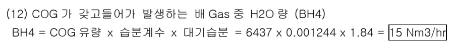

(13) 연소용 Air 가 갖고 들어가 발생하는 H2O 량 (BH5)

<math display="block">BH5 = 연소용 Air 유량 × 습분계수 × 대기습분 = 98452 × 0.001244 × 1.84 = 225Nm³/Hr</math>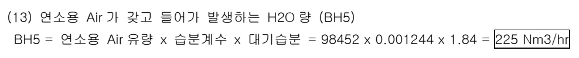

(14) 배 Gas 중 CO2 유량 (FCO2)

<math display="block">FCO2 = Y1 + Y3 = 38644 + 2530 = 41174Nm³/Hr</math>

(15) 배 Gas 중 N2 유량 (FN2)

<math display="block">FN2 = Y2 + Y4 + 0.79 × Z = 87388 + 22016 + 0.79 × 19675 = 124946Nm³/Hr</math>

(16) 배 Gas 중 O2 유량 (FO2)

<math display="block">fo2</math>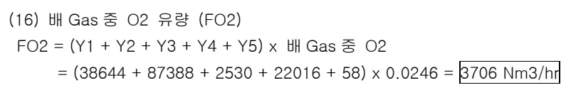

(17) 배 Gas 중 수증기 유량 (FH2O)

<math display="block">FH2O = BH1 + BH2 + BH3 + BH4 + BH5 = 3264 + 202 + 7049 + 15 + 225 = 10530Nm³/Hr</math>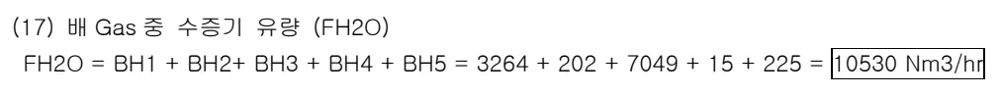

뒷 장 계속

<!-- 페이지번호: 8, 파일명: 열풍로 연소기술 기준 -->
### 6.1.5 배 GAS 회수열 (WR)

<math display="block">WR = 연소공기 승온열 + BFG 승온열 = 1240032 + 956396 = 2196428kcal</math>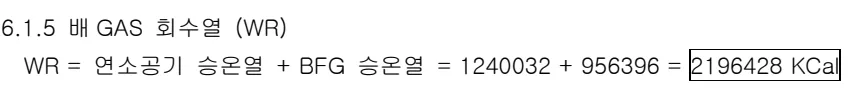

<math display="block">6.1.5.1 연소공기 승온열 = 연소공기 유량 × (연소 Air 온도 - 대기온도) × 비열 × 연소시간/60</math>

<math display="block">= 98452 × (50.0 - 2.2) × 0.310 × 51/60 = 1240032kcal</math>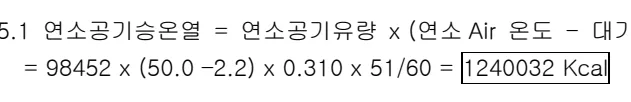

<math display="block">6.1.5.2 BFG 승온열 = BFG 유량 × (BFG 온도 - Cleaning GAS 온도) × BFG 비열 × 연소시간/60</math>

<math display="block">= 88228 × (86.0 - 47.0) × 0.327 × 51/60 = 956396kcal</math>

### 6.1.6 기타 방산열 (A4)

<math display="block">A4 = (B1 + B2 + B3 + B4 + B5) - (A1 + A2 + A3)</math>

<math display="block">= (77729432 + 1297402 + 2137598 + 9519136 + 106897) - (69711408 + 991174 +</math>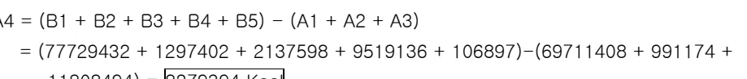

<math display="block">11808494) = 8279394kcal</math>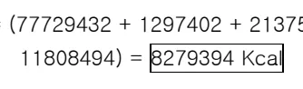

### 6.1.7 열효율

<math display="block">열효율 = [((열풍건 현열 + 열풍습분 현열 + 배 Gas 회수열))/((M-Gas 연소열 + 연소용 Air 현열 +)]</math>

<math display="block">M-Gas 현열 + 냉풍건현열 + 냉풍습분현열)} × 100</math>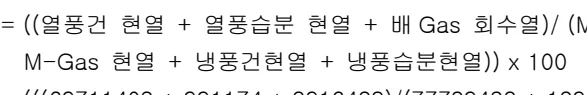

<math display="block">= [(((69711403 + 991174 + 2916428))/((77729432 + 1297402 + 2137598 + 9519136)]</math>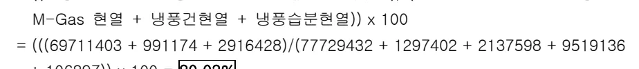

<math display="block">+ 106897)} × 100 = 80.03%</math>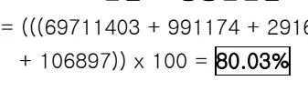

## 6.2 열정산 결과표

<table><thead><tr><th>구분</th><th>계산내용</th><th>계산열량</th><th>%</th><th>비고</th></tr></thead><tbody><tr><td rowspan="6">입열</td><td>M-GAS 연소열</td><td>77729432</td><td>85.61</td><td>B1</td></tr><tr><td>연소용 AIR 현열</td><td>1297402</td><td>1.43</td><td>B2</td></tr><tr><td>M-GAS 현열</td><td>2137598</td><td>2.35</td><td>B3</td></tr><tr><td>냉풍건현열</td><td>9519136</td><td>10.48</td><td>B4</td></tr><tr><td>냉풍습현열</td><td>106897</td><td>0.12</td><td>B5</td></tr><tr><td>TOTAL</td><td>90790464</td><td>100</td><td>Bo</td></tr><tr><td rowspan="5">출열</td><td>열풍건현열</td><td>69711403</td><td>76.78</td><td>A1</td></tr><tr><td>열풍습분현열</td><td>991174</td><td>1.09</td><td>A2</td></tr><tr><td>배 GAS 지출열</td><td>11808494</td><td>13.01</td><td>A3</td></tr><tr><td>방산열</td><td>8279394</td><td>9.12</td><td>A4</td></tr><tr><td>TOTAL</td><td>90790464</td><td>100</td><td>Ao</td></tr><tr><td>기타</td><td>배 Gas 회수열</td><td>2196428</td><td>2.42</td><td>WR</td></tr></tbody></table>
<a href="components/TP-030-120-020 열풍로 연소기술 기준(Rev.11)_0900bf4ba7a451f1_usr0000bf4b95f9e446_p008_table_01.png">Table snapshot</a>

뒷 장 계속

<!-- 페이지번호: 9, 파일명: 열풍로 연소기술 기준 -->
## 6.3 열정산 결과

### 가. 열풍로 열효율 80.03%로 양호

### 나. 배 GAS 지출열 13.0% 중 배 Gas 회수량 2.4%로 실제 배 GAS 지출열은 10.6%

### 다. 손실열 :19.7%(기타 방산열:9.1 + 배 GAS 지출열:10.6%):

## 6.4 열효율 향상방안

### 가. 풍온상승에 따른 M-GAS 적정유량(훈소용)조정

### 나. 배 GAS 온도관리(HE-1 배 Gas 출구온도)로 배열회수열량 증대

### 다. 각호별 열풍로 특성에 따른 최적 Control 로 열 Blance 유지

### 라. 철피온도 관리강화로 방산열 최소화

### 마. 주기적 열정산으로 열효율관리 필요

‘끝.’

이 하 여 백
