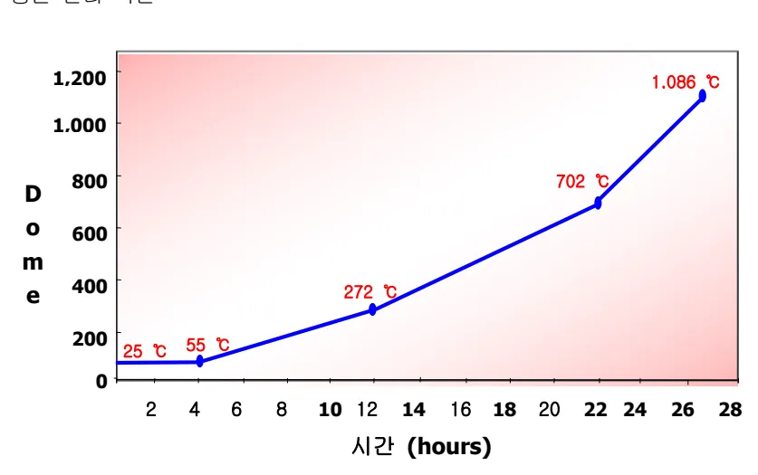
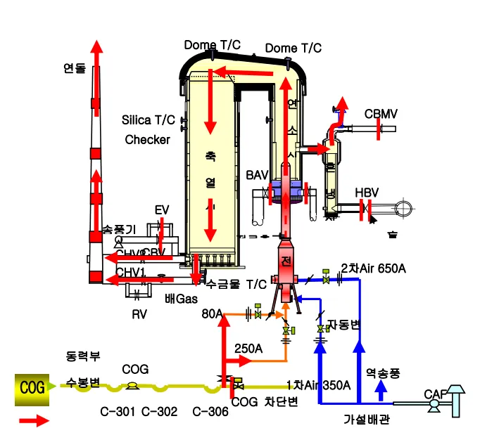
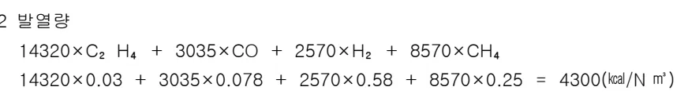
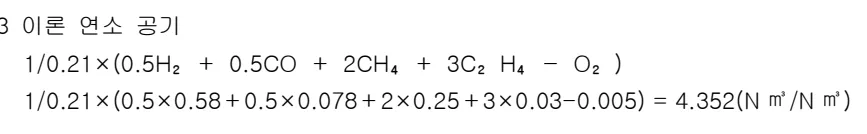
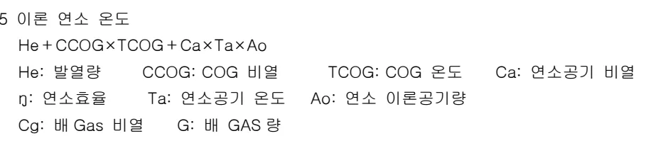
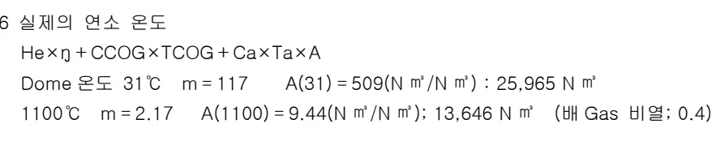
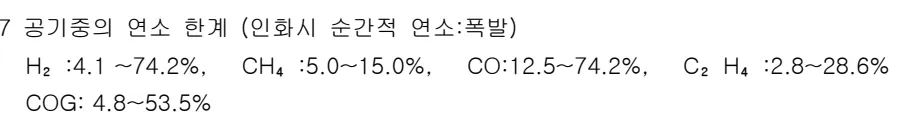

<!-- 페이지번호: 1, 파일명: 열풍로 개,보수기술 기준 -->
# 1. 적용범위

고로 부대설비중 가장중요한 열풍로 개보수기술인 냉각 및 승온기술에 대하여 적용한다.

# 2. 목 적

열풍로 장기사용에 따른 열화로 개수 및 보수시에는 냉각 수리교체후 건조를 한다

이때 냉각 및 건조과정은 대단히 복잡하고 위험을 수반하는 작업으로 냉각,건조중에 발생되는 연와의 손상을 예방하고 구조물의 변형을 방지하면서 예정된 일정에 맞추는 것이 중요하므로 조업자는 충분히 숙지할 필요가 있다.

# 3. 중점관리 항목

<table><tr><td>품질영향 인자</td><td>공정영향 인자</td></tr><tr><td>[SI], [S]</td><td>풍압, 노열</td></tr></table>
<a href="components/TP-030-120-030 열풍로 개,보수기술 기준(Rev.10)_0900bf4ba7a451ef_usr0000bf4b95f9e446_p001_table_01.png">Table snapshot</a>

# 4. 조업 기준 (열풍로 보수작업)

## 4.1 내연식 열풍로 보수작업

### 4.1.1 냉각목적

열풍로 냉각은 냉각중에 발생되는 연와의 손상을 예방하고 구조물의 변형을 방지하면서 예정된 일정에 맞추는 것이 중요한 목표이지만 실제의점검,측정,조정,기록등의 업무가 작업자의 직접조작에 의해서 이루어지므로 신속한 연락과 정확한 조작이 본작업의 성패 요인이며 또한 냉각작업 목적이기도하다.

#### 4.1.1.1 전제사항

##### 가. 냉각개시 시점의 Dome 온도는 950°C 가 되도록 한다

##### 나. 열풍로의 Dome 온도를 낮추는 시기는 중풍준비차 휴풍후 승풍으로 하고 ,이때부터 Dome 온도는 950°C로 조로하여 휴풍하고 이때의 풍온 풍량은 조업에 맞도록 조절한다

##### 다. 강제냉각의 냉풍은 연도지관 Man Hole 과 Burner A 변 Line 으로 흡입 Dome Side Man Hole 로 방산한다.

<!-- 페이지번호: 2, 파일명: 열풍로 개,보수기술 기준 -->
#### 4.1.1.2 준비작업

##### 가. Burner Fan 에 냉각배관을 설치한다.나. 열풍변 완폐한다.다. Burner A 변 전단을 맹판시킨다라. Dome Side Man Hole 부 방산 Bleeder(700x2000) Castable 시공하여 설치한다.마. Dome 부 기준 T/C 취외후 C/A T/C 를 설치한다.바. 연소실 상부 GL+33400 지점 C/A T/C 를 설치한다.사. 냉각용축연실 ,연소실,유량검출용 Orifice 를 설치한다.아. 냉각용 축연실,연소실,Air 조절용 Valve 를 설치한다.

#### 4.1.1.3 냉각작업

##### 가. 자연냉각을 실시한다.(1 단계 : 1 ~ 4 일 소요된다.)

(1) 열풍로 각변을 밀폐시킨다. (2) 변 취외개소 맹판취부 시킨다 (3) Dome 온도 950 ~ 800℃ 유지시킨다. (4) 냉각 Speed 는 37.5℃/D 유지시킨다. (5) 외부 냉풍유입시는 급냉발생되므로 철저히 방지시킨다.

##### 나. 강제냉각을 실시한다.(2 단계 : 5 ~25 일 소요된다.)

(1) 각열풍로 Man Hole 2 개소에 냉풍을 불어넣는다. (2) Dome Side Man Hole 을 열어 방산시킨다. (3) Dome 온도는 800 ~ 50℃ 까지 낮춘다. (4) 냉각 Speed 는 32.6℃/D Down 시킨다 (5) 연소실상부와 Dome 온도의 차가 50℃이내되도록바람조절한다

### 4.1.2 건조작업(승온작업)

#### 4.1.2.1 건조목적

열풍로 내부 연와 교체완료후 연와설비를 COG 로 사용해 연와를 건조시키는 작업이다.

#### 4.1.2.2 전제사항

##### 가. 열풍로건조는 COG 를 사용하여 건조한다.나. Pilot Burner 는 설치하지 않고 건조초기부터 건조용 COG Burner 를사용하여 연소시킨다다. Dome 온도 800℃가 되면 건조가 완료된 것으로 간주한다.

<!-- 페이지번호: 3, 파일명: 열풍로 개,보수기술 기준 -->
#### 4.1.2.3 건조 준비 사항

##### 가. 공사용 자재의 철거 및 청소실시한다.

##### 나. 건조용 가 배관(COG,Air),수금물 냉각용 Air 배관설치 및 Leak 압력 Test 한다.

##### 다. 건조용 가 배관(COG,Air),수금물 냉각용 Air 배관설치 및 Leak 압력 Test 한다.

##### 라. COG Booster Test 한다.

##### 마. 열풍변 냉각수 배관상태 및 Test 확인한다.

##### 바. Dome 온도, 배기 Gas 온도, Burner 상부온도 및 측정용 기기의 설치완료 Test 한다.

#### 4.1.2.4 건조 준비 작업

##### 가. 건조작업개시전 연도하부에 폐목을 연소시켜 열풍로초기 Draft 를 실시하고 연료는 COG 를 사용한다.

##### 나. 건조작업은 Dome 온도를 계획에 맞도록 COG 량 및 공기량을 조정한다.

##### 다. 각부온도 및 배기 Gas 성분을 분석하여 과잉공기량을 계산하여 Air 량을 조절한다.

건조초기에는 Air 량을 계획보다 많게하여 연소실과 Dome 온도자가 젖도록한다.

##### 라. 건조중에는 연와의 변태가 이루어지는 시기으로 400~500℃될때까지는 배기 Gas 량을 조정하여 편차가 250℃로 제어하여 균열이 발생하지않도록한다.

##### 마. 건조온도는 아래와 같이 조정한다.

- 1 ~ 13 일 :20℃/일, 14 ~ 17 일 :35℃/일, 18 ~ 24 일:53℃/일

## 4.2 외연식 열풍로 보수작업

### 4.2.1 냉각 Flow 및 냉각관리

#### 4.2.1.1 냉각 방법

<!-- 페이지번호: 4, 파일명: 열풍로 개,보수기술 기준 -->
#### 4.2.1.2 열풍로 냉각 Flow

#### 4.2.1.3 냉각 준비작업

##### 가. 사전작업

<ol><li>냉각 Air 가배관 제작 및 설치( 전동변, 수동변, 유량계 포함)</li><li>방산관( 내부 Castable 시공 ) 및 자재준비</li><li>Cable 포설 및 운전실 감시 System 구성( 기기 Test 완료)</li></ol>

##### 나. 휴풍시 작업

<ol><li>열풍병 취외 후 전 후단 내화벽돌 측조 및 盲 Flange 취부 본관측 살수 Line 설치</li><li>CBV, CBMCV, CH-1 V, CH-2 V, EV, RV 취외후 각각 전후단 盲 Flange 취부</li><li>GCV, ACV 변 취외후 각각 전단 盲 Flange 취부</li><li>GPV 전단 Stop 변 수동 Locking</li><li>훈냉실, 연소실측 방산관 설치 부위 M/H 개방후 내화물 제거</li><li>훈냉실, 연소실측 방산관( 내부 Castable 시공 ) 및 T/C 설치</li><li>축열실 하부 Checker 수금물 점검 M/H 개방후 내화물 제거</li><li>축열실 하부 냉각 배관 설치</li><li>HE-2 전단 냉각 Main 배관 취합</li></ol>

<!-- 페이지번호: 5, 파일명: 열풍로 개,보수기술 기준 -->
##### 다. 냉각 자동화 구성

<ol><li>열풍변 냉각에 필요한 Hard 구성(제어변, 유량계, 발신기, Cable 포설 등)</li><li>감시화면 구성(운전실 Centum 화면)</li><li>온도( 측열실, 연소실 Dome, 측열실 Silica 배면) 및 냉풍량 PC Trend 화</li></ol>

#### 4.2.1.4 냉각작업

##### 가. 냉각 관리 곡선 기준은 P3R2 계획을 적용하며 냉각 일정은 25일로 한다

<table><thead><tr><th>구분</th><th>냉각기</th><th>수축기</th><th>흡수기</th><th>합계</th></tr></thead><tbody><tr><td>Dome 온도</td><td>1000 ~ 600℃</td><td>600 ~ 258℃</td><td>258 ~ 54℃</td><td></td></tr><tr><td rowspan="2">조로</td><td>냉각속도 Max : 10℃/Hr 이하관리</td><td>냉각속도 Max : 3℃/Hr 이하관리</td><td>냉각속도 Max : 2℃/Hr 이하관리</td><td></td></tr><tr><td>연소실 상하부의 온도차 ≤50℃</td><td>연소실 상하부의 온도차 ≤30℃</td><td>연소실 상하부의 온도차 ≤10℃</td><td></td></tr><tr><td>냉각 속도</td><td>100℃/일</td><td>38℃/일</td><td>17℃/일</td><td></td></tr><tr><td>냉각 일정</td><td>4</td><td>9</td><td>12</td><td>25 일</td></tr></tbody></table>
<a href="components/TP-030-120-030 열풍로 개,보수기술 기준(Rev.10)_0900bf4ba7a451ef_usr0000bf4b95f9e446_p005_table_01.png">Table snapshot</a>

#### - 냉각 관리 곡선

##### 나. 휴로 후 Dome 온도 1000℃까지는 자연 냉각을 실시 한다 - 대기 자연방산

##### 다. Dome 온도 1000℃부터 강제 냉각을 실시하고 온도가 50℃까지 Down 되면 열풍로 냉각이 완료 되는 것으로 한다 (강제냉각은 CAF, 냉각배관, 대기방산관을 이용)

##### 라. 냉각시 각부위 온도, Air 유량, Dome 심도의 변화 상태는 시간 별 Check List를 작성 관리한다.

<!-- 페이지번호: 6, 파일명: 열풍로 개,보수기술 기준 -->
##### 마. 냉각 관련 모든 열풍로 조로 업무 사항은 운전설비관리 주임이 총괄한다

#### 4.2.1.5 냉각관리

##### 가. Dome 온도에 의한 냉각관리

온도관리는 촉열실과 연소실 Dome 온도를 기준으로 하고 촉열실과 연소실 하부온도 편차가 냉각관리기준을 벗어나지 않도록 냉각한다.

##### 나. 편 냉각관리

(1) Silica 배면온도의 급냉각을 방지한다. (관리온도 기준 ≤Max 10°C/Hr)

(2) Air 의 유량 Control 은 연와 냉각속도가 냉각곡선에 따라 빠른 냉각이 되지 않도록 조정.

(3) 노내 압력은 (연소실 하부, 연도변) 항상 + 압력(5 ~ 10mmAq) 이 되도록 관리한다.

##### 다. 방산변 철피적열방지

- 고온 냉각시 방산변 냉각수 급수상태 Check 및 적열시 보조 Spray 장치 증설

##### 라. Dome 심도 Check (1 회/Shift)

- 촉열실 및 연소실의 Dome 심도측정을 실시하여 변화량을 Check 한다.

##### 마. 안전작업 : 방산변 점검시 방열장갑 착용

### 4.2.2 열풍로 냉각 및 승온 작업용 가설물 설치

#### 4.2.2.1 Valve 취외(9 개소) 맹판설치(총 13 개소/열풍로 1 기 당)

##### 가. 맹판 취외, 취부 Schedule 작성

##### 나. 열풍로 취외 후 열풍본관측 맹판설치 및 Castable 설치

##### 다. Burner Air Control Valve 후단측 맹판취부로 Expansion 교환

<!-- 페이지번호: 7, 파일명: 열풍로 개,보수기술 기준 -->
##### 라. ⑦ Valve Bottom 부 냉각 Nozzle 설치 (냉각, 승온시 적열)마. HBV 취외 및 전, 후단 맹판설치

#### 4.2.2.2 냉각배관

##### 가. 냉각, 승온작업 겸용 Main Line 설치- 냉풍 Air Line 설치 (CAF 토출측 TOP 취합)

##### 나. 각 노별 배관설치(1) 각 노별 냉각용 지관 및 Valve 사전설치(2) 각 가설전로 건조용 Air 공급 지관 및 Valve 사전설치(3) 유량계 설치 및 직관 (상류측 20 배, 하류측 5 배) 확보(4) 냉각 Nozzle 설치를 위한 지관 Line 설치

#### 다. 방산변 설치

(1) 흔냉실 상부 설치 (배관경 결정, 차단 Vavle, Water Jacket) (2) 급,배수 Line 포함, Valve 후단 T/C 설치 (3) 연소실 가설전로 취합 M/H 설치 (배관경 : 700A, 높이 : 8m, Water Jacket) (4) 급,배수 Line 포함, Water Jacket 상부 T/C, 대기공기 역류방지 Cap, TRP 방향 방산구 설치) (5) 연소실 가설전로 취합 M/H 취외시 고려사항 - M/H 취외 → M/H 단관 Castable 시공 → 마감연와 취외 → 방산변 설치 - 냉각수 공급 : 선행공사시 열풍로 기존 잡용수, 본공사시 가설용 사용 - 냉각수 급, 배수 Line 보온실시

### 4.2.3 열풍로 승온

#### 4.2.3.1 열풍로 승온 목적

MORTAR 수분(30%) 제거

연 와 열 팽 창

MORTAR 탈락 방지

연 와 의 균 일 한 가 열

열응력에 의한연와 파손 방지

연 와 측 열

국부 가열 방지

고 로 건 조

고 로 송 풍 준 비

<!-- 페이지번호: 8, 파일명: 열풍로 개,보수기술 기준 -->
#### 4.2.3.2 열풍로 승온 기본 방향

##### 가. 승온의 기본 방향

<ol><li>노내알 관리: Leak 부에서의 외기 흡입에 의한 국부온도 편차방지</li><li>Dome 승온은 66°C에서 약 270°C까지는 매우 천천히 이루어져야 한다.</li><li>투입 열량 및 승온일정은 DME 사의 제안 및 실적을 기준으로 한다(승온: 26일간)</li></ol>

##### 나. 승온 관리 기준

<table><thead><tr><th>구분</th><th colspan="2">탈수, 팽창기</th><th>승열기</th><th>축열기</th></tr></thead><tbody><tr><td>Dome 온도</td><td>25~55°C</td><td>55~272°C</td><td>272~702°C</td><td>702~1086°C</td></tr><tr><td>조로</td><td>*승온속도 Max : 0.416°C/Hr 이하</td><td>*승온속도 Max : 1.0°C/Hr 이하</td><td>*승온속도 Max : 1.8°C/Hr 이하</td><td>*승온속도 Max : 4°C/Hr 이하</td></tr><tr><td>Dome 온도 편차 관리</td><td>목표온도 ± 2°C</td><td>목표온도 ± 2°C</td><td>목표온도 ± 2°C</td><td>목표온도 ± 2°C</td></tr><tr><td>건조 속도</td><td>10°C/일</td><td>24°C/일</td><td>43 °C/일</td><td>96°C/일</td></tr><tr><td>건조 일정</td><td>3 일</td><td>9 일</td><td>10 일</td><td>4 일</td></tr><tr><td rowspan="3">G1,2 R1 사례</td><td>상온~152°C</td><td>153~308°C</td><td>309~623°C</td><td>624~998°C</td></tr><tr><td>12°C/일</td><td>15°C/일</td><td>45°C/일</td><td>75°C/일</td></tr><tr><td>11 일</td><td>12 일</td><td>7 일</td><td>5 일</td></tr></tbody></table>
<a href="components/TP-030-120-030 열풍로 개,보수기술 기준(Rev.10)_0900bf4ba7a451ef_usr0000bf4b95f9e446_p008_table_01.png">Table snapshot</a>

##### 다. 승온 관리 곡선

<!-- 페이지번호: 9, 파일명: 열풍로 개,보수기술 기준 -->
#### 4.2.3.2 승온 작업 Flow 도

* 승온 순서 : Air & COG → 연소 (전로)→ 연소실 → Dome 연락관 → 측열실 → 연돌

### 4.2.4 승온 작업

#### 4.2.4.1 준비 작업

##### 가. 열풍로 자재 준비(전로 1기 설치 기준).

##### 나. 설비 구성 및 준비

##### 다. 전로 및 감시 장치 설치

<ol><li>기계 장치: 본체, Air 배관, COG 배관, Stop 밸브, 2차 Air 유량 조절용 전동변</li><li>계장 설비:<ul><li>유량계: COG (300, 1500Nm³/Hr) 및 연소 AIr (10000, 30000 Nm³/Hr)</li><li>T/C: 측열실 Dome, Silica 배면, Checker 연와하단, 수금물, 배 Gas 온도 및 연소실 Dome, Silica</li></ul></li><li>Process 구성: 별도 PC 신설 및 연소 상태 감시 Monitor 설치</li><li>기기별 기능 및 Inter Lock Test</li></ol>

<!-- 페이지번호: 10, 파일명: 열풍로 개,보수기술 기준 -->

라 열풍로측 설비 준비 작업

(1) HBV 전단 盲 Flange 설치 (2) BA 변, BG 변 연소실측 盲 Flange 설치 (3) CH-1,2 변 및 RV 盲 Flange 해체 (4) 측열실 하부 M/H 폐 (5) 흔냉실 방풍관 설치 (개폐식 Bleeder 형태)

#### 4.2.4.2 설비 운전 Test

##### 가. 승온 관련 전 Air 계통 Valve Test (자동 및 수동)나. 승온 관련 전 Gas 계통 Valve Test (자동 및 수동)다. 전 Drain Valve 작동 Test라. Mixing Chamber 상부 Bleeder Valve 작동 Test마. Dome 심도 측정구 Valve 작동 Test바. 냉각수 Line Flushing 및 통수사. 수봉변 수봉 및 해봉 Test아. 전기 및 계장 제어 장치 Test

#### 4.2.4.3 Gas 통입

##### 가. HS 행 COG 차단변 폐 및 전단 Bleeder Open나. 배관 Purge 후 COG 통입다. 착화 Test 및 Pilot Burner 점화 Test

#### 4.2.4.4 승온 작업

##### 가. 건조는 DME 에서 제시한 관리 곡선 기준을 적용하여 냉각 일정은 계획서 참조 한다.나. 건조 승온은 전로를 이용하여 실시 하고 연소 Gas 는 COG 를 사용한다.다. 전로 운전은 작업표준화하여 표준에 의거 운전한다.- 운전 작업표준 작성(조업)- 점화, 소화, Valve 조작, Dome 온도 조정, 전로 점검 작업 이상시 조치 작업 등.라. 건조 승온시 Check List 작성 기록관리 한다.마. 건조에 관한 제반 사항은 운전설비 주임이 총괄하며 DME 감독자와 협조 체제를 유지한다.

#### 4.2.4.5 열풍로 건조로 운전

##### 가. 점화 작업.

(1) 1,2 차 (350,650A:MOV) Air 변 Full Close

<!-- 페이지번호: 11, 파일명: 열풍로 개,보수기술 기준 -->
<ol><li>M/C 상부 방산변 Full Open</li><li>연도변(CHV-1,2) Full Close</li><li>전로 점화구(80A Flange) Open: 점화구 Draft 상태 확인</li><li>CO 검지기 사용 전로내부 Gas 검지실시 (CO 검출시 N2 Purge 실시)</li><li>COG Pilot Line 수동변 Open</li><li>방염복, 방열장갑, 방호면 착용</li><li>점화봉(15A) 착화 및 전로내부 투입</li><li>전로내 Flame 감지 확인</li><li>현장 Panel Manual 선택 후 Gas Pilot 자동변 Open</li><li>1 차 Air 투입 및 다. 전로 점화구 폐조치</li><li>현장 Panel Auto 선택 : Gas Main 자동변 Open 됨 (수동변 Close 상태확인)</li><li>연도변 20 ~40% Open( ) 조정후 M/C 방산변 Close</li><li>2 차 Air 투입 및 COG By-Pass 변(80A), Main 변(250A), 1 차 Air 조정하여 연소 - 자연소화의 경우 재 점화시 폭발위험 이 있으므로 반드시 N2 Purge 및 Gas 검지실시</li></ol>

#### 나. 소화 작업.

<ol><li>소화시 자동 Gas Main Valve Close 확인 및 수동변 Close 조치</li><li>연소용 1,2 차 Air Valve Close 조치</li><li>Pilot Burner 점화상태 확인</li><li>Pilot Burner 소화시 수동변 및 자동변 Close 조치</li><li>COG 자동변 후단 N2 Purge Valve Open Purge 실시</li></ol>

#### 다. 정전시 조치방법.

<ol><li>정전이 되면 CAF 가 정지되며 건조로 Gas Main 및 Pilot 자동변이 폐되며 자동소화</li><li>Gas Main Valve 완폐 확인 및 Air Valve, 연도변 Close 하여 대기유입에 의한 냉각 방지</li><li>복전시 재점화 순서에 의해 재 점화실시</li></ol>

#### 라. 자연소화시 조치방법.

<ol><li>소화시 자동 Gas Main Valve Close 확인 및 수동변 Close 조치</li><li>Pilot Burner 자동변 Close 확인 및 수동변 Close 조치</li><li>연소용 1,2 차 Air Valve Close 조치</li><li>COG 자동변 후단 N2 Purge Valve Open Purge 실시</li><li>재점화 순서에 의해 재 점화실시</li></ol>

뒷 장 계속

<!-- 페이지번호: 12, 파일명: 열풍로 개,보수기술 기준 -->
## 4.3 열풍로 보열

### 4.3.1 보열의 필요성

Flowchart illustrating the necessity of insulation:
<ol><li>열풍로 승온 (Heating up the furnace)</li><li>고로 건조 (Drying the furnace)</li><li>고압 Leak Test 및 충진 (High-pressure Leak Test and Charging)</li></ol>
The High-pressure Leak Test and Charging step leads to 화입 (Charging), which is associated with the following insulation requirements:
#### 열풍로 보열
<ol><li>열풍로 냉각 방지 (연와 보호: 연소)</li><li>Checker 수금물 과열 방지: 냉각송풍</li><li>화입 대비 측열 유지</li></ol>

### 4.3.2 보열 관리 기준

<table><thead><tr><th colspan="2">연 소</th><th colspan="2">역 송 풍</th></tr><tr><th>개 시</th><th>종 료</th><th>개 시</th><th>종 료</th></tr></thead><tbody><tr><td>-Dome 온도 900℃ 이하</td><td>-Dome 온도 1100℃ 이상</td><td>-Checker 수금물 온도 300℃ 이상</td><td>-Checker 수금물 온도 200℃ 이하</td></tr><tr><td>-규석 연와 최하단 온도 700℃ 이하</td><td>-Checker 수금물 온도 300℃ 이상</td><td>-Dome 온도 950℃ 이하</td><td>-Dome 온도 900℃ 이하</td></tr><tr><td>-BFG 30,000 N m²/H Air 20,000 N m²/H 이상</td><td></td><td></td><td>-혼냉실 방산구 온도 300℃ 이상</td></tr></tbody></table>
<a href="components/TP-030-120-030 열풍로 개,보수기술 기준(Rev.10)_0900bf4ba7a451ef_usr0000bf4b95f9e446_p012_table_01.png">Table snapshot</a>

뒷 장 계속

<!-- 페이지번호: 13, 파일명: 열풍로 개,보수기술 기준 -->
### 4.3.3 역송풍 Flow

연소용 Air Fan → 촉열실 Checker 수금물 → 촉열실

연락관 ← 연소실 ← 흡열실 ← 방산변

### 4.3.4 비상 대책

#### 4.3.4.1 승온용 Burner의 자연 소화시

##### 가. 예상 문제점

<ol><li>연소용 연료 COG는 폭발 및 중독의 위험이 있다.</li><li>소화시 Valve 폐작동이 불량하면 Gas가 Burner 내로 유입되어 재점화시 폭발의 위험이 있다.</li></ol>

##### 나. 응급 조치

<ol><li>자연 소화시 Gas 공급 Valve를 완전히 폐한다.</li><li>보고 계통 및 관련자에 연락한다.</li><li>지시를 받아 수리등 적절한 조치를 취한다.</li></ol>

<!-- 페이지번호: 14, 파일명: 열풍로 개,보수기술 기준 -->
##### 다. 재점화 수순

<ol><li>Gas Valve 가 전폐 상태에 있는지를 확인한다.</li><li>질소 Purge Valve 를 Open 하여 Burner 쪽의 잔류 Gas 를 Purge 한다.</li><li>연소용 Air Valve 를 Open 하여 연소용 공기를 공급한다.</li><li>정화용 COG Pilot Burner 에 착화하여 건조 Buener 에 접근 시킨다.</li><li>건조용 Gas Valve 를 서서히 Open 하면서 착화 상태를 확인한다.</li></ol>

#### 4.3.4.2 정전시

##### 가. 정전이 되면 Air Fan, Water Pump 가 모두 정지 및 건조 Gas 자동 Valve 가 폐되므로 자연 소화된다.

##### 나. 이때 Gas 공급 Valve 는 우선적으로 전폐를 확인하고 Air 및 연도 계통을 폐하여 대기 유입에 의한 냉각을 방지한다(연도변 폐)

##### 다. 복전이 되면 재점화 순서에 의해 재 점화한다.

##### 라. 정전이 장기간일 경우는 Dome 온도가 저하 하므로 재점화시 Dome 온도를 고려하여 강화된 온도부터 승온곡선에 따라 조로한다.

#### 4.3.4.3 단수시

##### 가. Pump 의 고장 일 경우에는 즉시 예비 Pump 로 교체한다.

##### 나. 예비 Pump 까지 모두 고장일 경우 고가수조의 물을 최소로 조정 사용 하면서 고장 복구한다.

##### 다. 단수가 15 분 이상 장기화 되면 필요한 조치를 취한다.

<ol><li>Gas 자동 Valve 를 Open Lock 한다</li><li>Air Comp 를 정지한다.</li><li>훈냉실 방산변 전폐한다</li><li>열풍변 전단 온도가 60°C 이상이면 연소를 중지한다</li></ol>

#### 4.3.4.4 Dome 온도가 계획치 보다 크게 상승 할 경우

##### 가. 배 Gas 온도가 여유 있으면 Air량을 증가 시킨다.

##### 나. 상기 방법으로 Dome 온도가 Control되지 않으면 Gas 유량을 감소 시킨다.

뒷 장 계속

<!-- 페이지번호: 15, 파일명: 열풍로 개,보수기술 기준 -->
## 4.4 열풍로 냉각, 승온관리 기준(내연식 : 포)P2R2, 외연식: 포) P3R2 실적)

<table><thead><tr><th rowspan="2">구분</th><th rowspan="2"></th><th colspan="2">1 단계</th><th colspan="2">2 단계</th><th colspan="2">3 단계</th><th colspan="2">4 단계</th></tr><tr><th>온도</th><th>일수</th><th>온도</th><th>일수</th><th>온도</th><th>일수</th><th>온도</th><th>일수</th></tr></thead><tbody><tr><td rowspan="2">내연식</td><td>냉각</td><td>37.5℃/D</td><td>4</td><td>32.6℃/D</td><td>21</td><td>-</td><td>-</td><td>-</td><td>-</td></tr><tr><td>건조</td><td>20.0℃/D</td><td>13</td><td>35.0℃/D</td><td>4</td><td>53.0℃/D</td><td>7</td><td>-</td><td>-</td></tr><tr><td rowspan="2">외연식</td><td>냉각</td><td>100℃/일</td><td>4</td><td>38℃/일</td><td>9</td><td>17℃/일</td><td>12</td><td>-</td><td>-</td></tr><tr><td>건조</td><td>10℃/일</td><td>3</td><td>24℃/일</td><td>9</td><td>43℃/일</td><td>10</td><td>96℃/일</td><td>4</td></tr></tbody></table>
<a href="components/TP-030-120-030 열풍로 개,보수기술 기준(Rev.10)_0900bf4ba7a451ef_usr0000bf4b95f9e446_p015_table_01.png">Table snapshot</a>

# 5. 이상판단 및 조치기준 : 해당사항 없음

# 6. 기술이론

## 6.1 Koppers 규석연와 열풍로의 특성

### 6.1.1 규석연와의 팽창

규석연와는 총열팽창률 1.2%중에서 300℃까지 약 0.9%가 팽창하므로 온도에 따라 연와의 팽창이 직선 비례하도록 승온이나 냉각시 엄격히 관리해야 한다. 따라서, 외연식 열풍로의 특징인 규석연와는 건조초기의 승온에 특히 주의해야하며 이는 규석연와의 팽창 변태 때문이다.

### 6.1.2 규석연와의 팽창 변태점

<table><thead><tr><th>성분</th><th>변태</th><th>온도(℃)</th><th>결정형</th><th>밀도</th><th>팽창률</th></tr></thead><tbody><tr><td rowspan="2">TRIDYMITE</td><td>α → β</td><td>117</td><td rowspan="2">사방 ↔ 육방</td><td rowspan="2">2.26~2.30</td><td>0.07</td></tr><tr><td>α → β</td><td>163</td><td>0.07</td></tr><tr><td>CRISTOBALITE</td><td>α → β</td><td>220~275</td><td>사방 ↔ 측등</td><td>2.32~2.21</td><td>0.90%</td></tr><tr><td>석영</td><td>α → β</td><td>573</td><td>삼방편육면체 ↔ 육방편사면체</td><td>2.65~2.52</td><td>0.30%</td></tr></tbody></table>
<a href="components/TP-030-120-030 열풍로 개,보수기술 기준(Rev.10)_0900bf4ba7a451ef_usr0000bf4b95f9e446_p015_table_02.png">Table snapshot</a>

뒷 장 계속

<!-- 페이지번호: 16, 파일명: 열풍로 개,보수기술 기준 -->
### 6.1.3 규석의 변태 팽창 곡선

### 6.1.4 열풍로용 규석연와의 열팽창

○ 팽창 곡선을 보면 석영이 가장 크며 규석연와의 용적 안정을 잔존 석영이나 Cristobalite 가 적고 Tridymite 가 많은 편이 좋다.(석영 2%이하)

<!-- 페이지번호: 17, 파일명: 열풍로 개,보수기술 기준 -->
## 6.2 연소 Air 계산

### 6.2.1 C.O.G 조성(평균)

<math display="block"> CO₂ : 2.8%       CO : 7.8%       CH₄ : 25.0%       N₂ : 2.8% H₂ : 58.0%       O₂ : 0.5%       C₂h₄ : 3.0% </math>

### 6.2.2 발열량

<math display="block"> 14320 × C₂h₄ + 3035 × CO + 2570 ×H₂ + 8570 × CH₄  14320 × 0.03 + 3035 × 0.078 + 2570 × 0.58 + 8570 × 0.25 = 4300 (kcal/Nm³) </math>

### 6.2.3 이론 연소 공기

<math display="block"> 1/0.21 × (0.5H₂ + 0.5 CO + 2 CH₄ + 3 C₂h₄ - O₂)  1/0.21 × (0.5 × 0.58 + 0.5 × 0.078 + 2 × 0.25 + 3 × 0.03 - 0.005) = 4.352 (Nm³ /Nm³) </math>

### 6.2.4 이론 연소 배기 Gas량

<math display="block"> CO₂ = CO + CH₄ + 2 C₂h₄ + CO₂ = 0.078 + 0.25 + 2 × 0.03 + 0.028  = 0.416 (Nm³ /Nm³) H₂ O =H₂ + 2 CH₄ + 2 C₂h₄ = 0.58 + 2 × 0.25 + 2 × 0.03 = 1.14 (Nm³ /Nm³)  N₂ = N₂ + 0.79 A₀ = 0.027 + 0.79 × 4.352 = 3.465 (Nm³ /Nm³) g₀ = CO₂ +H₂ O + N₂ = 0.416 + 1.14 + 3.465 = 5.021 (Nm³ /Nm³) </math>

### 6.2.5 이론 연소 온도

<math display="block"> He + CCOG × TCOG + Ca × Ta × A₀  He: 발열량       CCOG: COG 비열       TCOG: COG 온도       Ca: 연소공기 비열  η: 연소효율       Ta: 연소공기 온도       A₀: 연소 이론공기량  Cg: 배 Gas 비열g: 배 GAS량 </math>

### 6.2.6 실제의 연소 온도

<math display="block"> He × η + CCOG × TCOG + Ca × Ta × A  Dome 온도 31°C       m = 117       A(31) = 509 (Nm³ /Nm³) : 25,965Nm³  1100°C       m = 2.17       A(1100) = 9.44 (Nm³ /Nm³) ; 13,646Nm³       (배 Gas 비열: 0.4) </math>

### 6.2.7 공기중의 연소 한계 (인화시 순간적 연소: 폭발)

<math display="block">H₂ : 4.1 ~ 74.2%,       CH₄ : 5.0 ~ 15.0%,       CO: 12.5 ~ 74.2%,       C₂h₄ : 2.8 ~ 28.6%  COG: 4.8 ~ 53.5% </math>

‘끝.’
